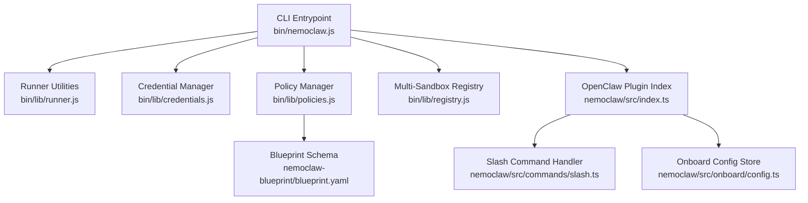
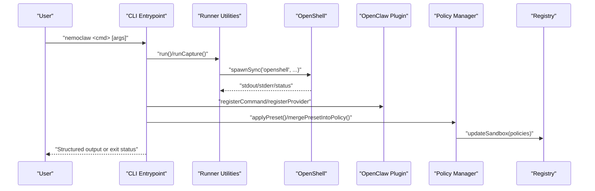
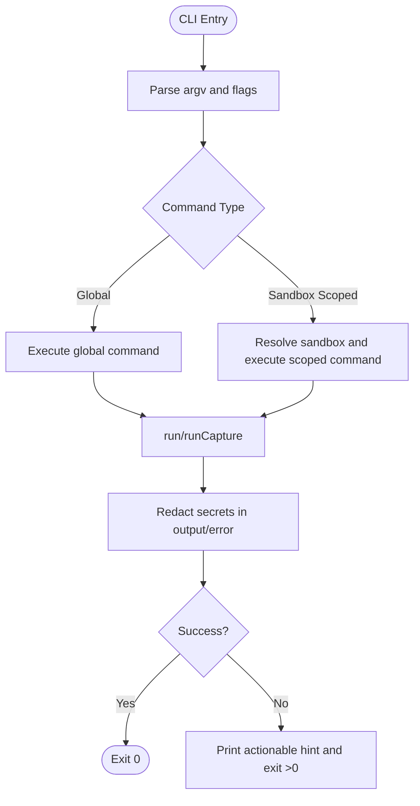
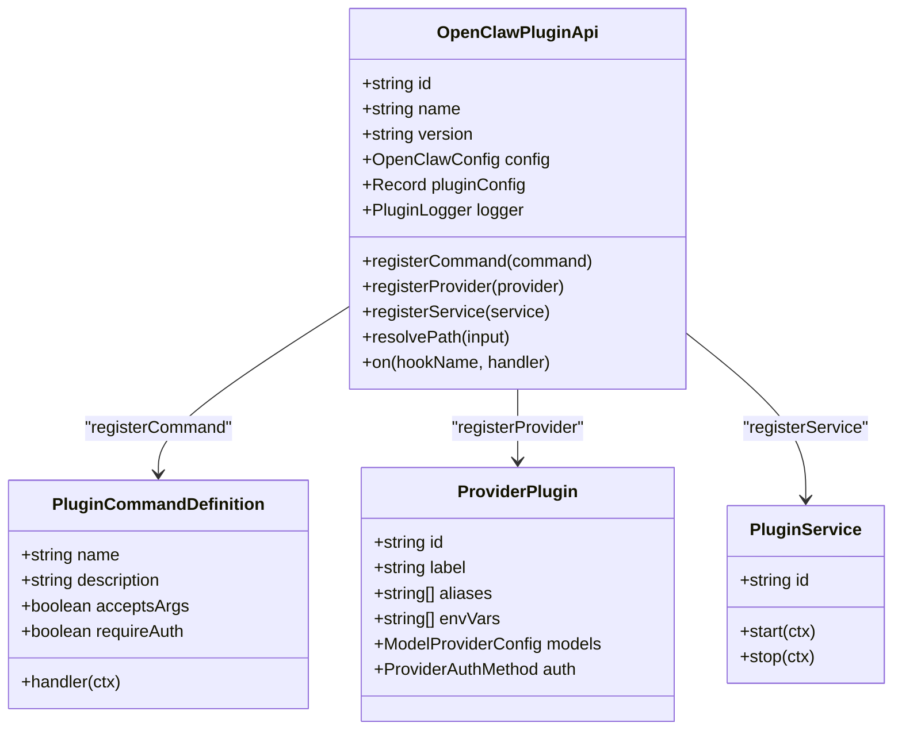
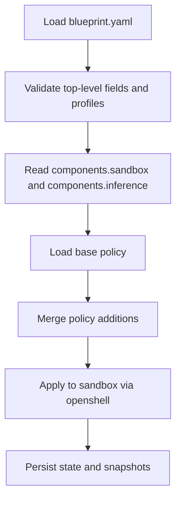
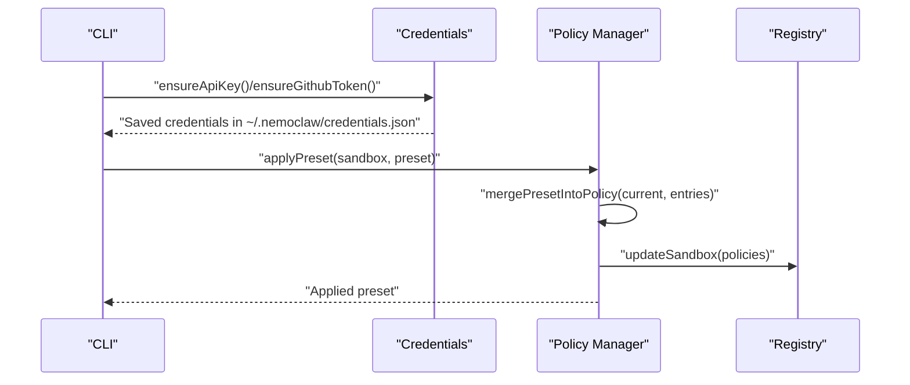
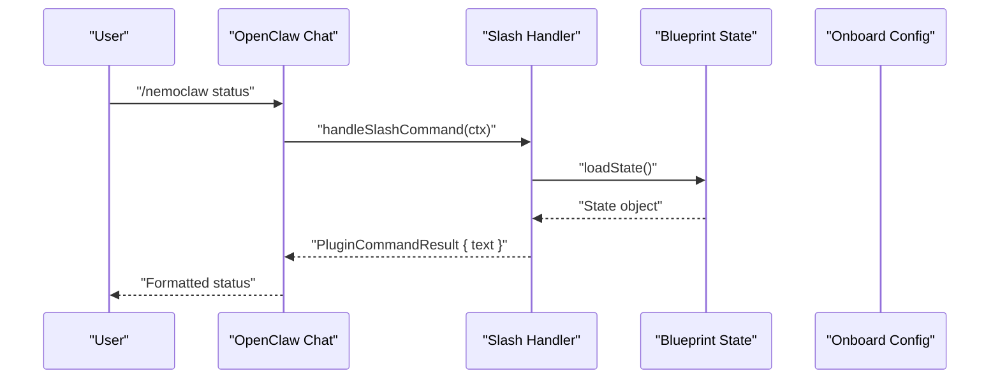
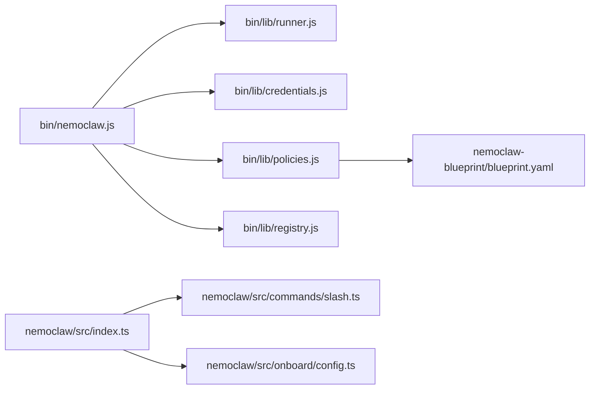

# API Reference

<cite>
**Referenced Files in This Document**
- [bin/nemoclaw.js](file://bin/nemoclaw.js)
- [nemoclaw/src/index.ts](file://nemoclaw/src/index.ts)
- [nemoclaw/openclaw.plugin.json](file://nemoclaw/openclaw.plugin.json)
- [nemoclaw/src/commands/slash.ts](file://nemoclaw/src/commands/slash.ts)
- [nemoclaw/src/onboard/config.ts](file://nemoclaw/src/onboard/config.ts)
- [bin/lib/credentials.js](file://bin/lib/credentials.js)
- [bin/lib/policies.js](file://bin/lib/policies.js)
- [bin/lib/registry.js](file://bin/lib/registry.js)
- [bin/lib/runner.js](file://bin/lib/runner.js)
- [nemoclaw-blueprint/blueprint.yaml](file://nemoclaw-blueprint/blueprint.yaml)
</cite>

## Table of Contents
1. [Introduction](#introduction)
2. [Project Structure](#project-structure)
3. [Core Components](#core-components)
4. [Architecture Overview](#architecture-overview)
5. [Detailed Component Analysis](#detailed-component-analysis)
6. [Dependency Analysis](#dependency-analysis)
7. [Performance Considerations](#performance-considerations)
8. [Troubleshooting Guide](#troubleshooting-guide)
9. [Conclusion](#conclusion)
10. [Appendices](#appendices)

## Introduction
This document provides a comprehensive API reference for NemoClaw’s programmatic interfaces and internal APIs. It covers:
- The CLI command API, including command signatures, parameter schemas, and return value formats
- The OpenClaw plugin API integration, slash command registration, and state synchronization interfaces
- The blueprint configuration API, including YAML schema validation, state management interfaces, and migration handling
- The security framework APIs, including policy enforcement interfaces, credential handling, and access control mechanisms
- Examples of API usage, error handling patterns, and integration scenarios
- API versioning, backward compatibility, and deprecation policies
- Client implementation guidelines for custom integrations and extension development

## Project Structure
NemoClaw comprises:
- A CLI entrypoint that orchestrates OpenShell and OpenClaw operations, manages credentials, applies network policy presets, and maintains a multi-sandbox registry
- An OpenClaw plugin module that registers slash commands, providers, and services
- A blueprint configuration system that defines sandbox, inference, and policy profiles

**Diagram sources**
- [bin/nemoclaw.js:1-1421](file://bin/nemoclaw.js#L1-L1421)
- [bin/lib/runner.js:1-207](file://bin/lib/runner.js#L1-L207)
- [bin/lib/credentials.js:1-328](file://bin/lib/credentials.js#L1-L328)
- [bin/lib/policies.js:1-353](file://bin/lib/policies.js#L1-L353)
- [bin/lib/registry.js:1-263](file://bin/lib/registry.js#L1-L263)
- [nemoclaw/src/index.ts:1-266](file://nemoclaw/src/index.ts#L1-L266)
- [nemoclaw/src/commands/slash.ts:1-147](file://nemoclaw/src/commands/slash.ts#L1-L147)
- [nemoclaw/src/onboard/config.ts:1-111](file://nemoclaw/src/onboard/config.ts#L1-L111)
- [nemoclaw-blueprint/blueprint.yaml:1-66](file://nemoclaw-blueprint/blueprint.yaml#L1-L66)

**Section sources**
- [bin/nemoclaw.js:1-1421](file://bin/nemoclaw.js#L1-L1421)
- [nemoclaw/src/index.ts:1-266](file://nemoclaw/src/index.ts#L1-L266)
- [nemoclaw/openclaw.plugin.json:1-33](file://nemoclaw/openclaw.plugin.json#L1-L33)
- [nemoclaw/src/commands/slash.ts:1-147](file://nemoclaw/src/commands/slash.ts#L1-L147)
- [nemoclaw/src/onboard/config.ts:1-111](file://nemoclaw/src/onboard/config.ts#L1-L111)
- [bin/lib/credentials.js:1-328](file://bin/lib/credentials.js#L1-L328)
- [bin/lib/policies.js:1-353](file://bin/lib/policies.js#L1-L353)
- [bin/lib/registry.js:1-263](file://bin/lib/registry.js#L1-L263)
- [bin/lib/runner.js:1-207](file://bin/lib/runner.js#L1-L207)
- [nemoclaw-blueprint/blueprint.yaml:1-66](file://nemoclaw-blueprint/blueprint.yaml#L1-L66)

## Core Components
- CLI command API: Orchestrates onboard, list, deploy, setup, start, stop, status, debug, uninstall, and help. Supports sandbox-scoped commands and global flags.
- OpenClaw plugin API: Registers slash commands, model providers, and background services; exposes configuration and logging hooks.
- Blueprint configuration API: Defines sandbox, inference profiles, and policy additions; supports YAML schema validation and migration handling.
- Security framework APIs: Credential handling with secure storage and prompting; policy preset application and merging; robust error redaction and access control.

**Section sources**
- [bin/nemoclaw.js:47-63](file://bin/nemoclaw.js#L47-L63)
- [nemoclaw/src/index.ts:237-266](file://nemoclaw/src/index.ts#L237-L266)
- [nemoclaw/openclaw.plugin.json:6-31](file://nemoclaw/openclaw.plugin.json#L6-L31)
- [nemoclaw-blueprint/blueprint.yaml:19-66](file://nemoclaw-blueprint/blueprint.yaml#L19-L66)
- [bin/lib/credentials.js:58-91](file://bin/lib/credentials.js#L58-L91)
- [bin/lib/policies.js:220-285](file://bin/lib/policies.js#L220-L285)
- [bin/lib/runner.js:84-154](file://bin/lib/runner.js#L84-L154)

## Architecture Overview
NemoClaw integrates with OpenShell and OpenClaw to manage sandboxes and inference routing. The CLI coordinates operations, while the plugin registers slash commands and providers. Policies are applied via preset YAML files, and state is persisted in a multi-sandbox registry.

**Diagram sources**
- [bin/nemoclaw.js:780-796](file://bin/nemoclaw.js#L780-L796)
- [bin/lib/runner.js:20-77](file://bin/lib/runner.js#L20-L77)
- [nemoclaw/src/index.ts:237-266](file://nemoclaw/src/index.ts#L237-L266)
- [bin/lib/policies.js:220-285](file://bin/lib/policies.js#L220-L285)
- [bin/lib/registry.js:171-203](file://bin/lib/registry.js#L171-L203)

## Detailed Component Analysis

### CLI Command API
- Command categories:
  - Global commands: onboard, list, deploy, setup, setup-spark, start, stop, status, debug, uninstall, help, --help/-h, --version/-v
  - Sandbox-scoped commands: list, status, connect, logs, destroy, policy apply, policy list, policy get, policy set, policy reset
- Parameter schemas:
  - onboard [--non-interactive] [--resume] [env flag]
  - setup (deprecated; use onboard)
  - policy apply <sandbox> <preset>
  - policy list <sandbox>
  - policy get <sandbox>
  - policy set <sandbox> <policy-file>
  - policy reset <sandbox>
- Return value formats:
  - Human-readable status messages and structured outputs for state queries
  - Exit codes for command failures; interactive prompts for credentials and tokens
- Error handling patterns:
  - Redacted error output via runner utilities
  - Graceful exits with actionable hints for gateway lifecycle issues
  - Validation of sandbox names and policy YAML parsing with fallbacks

**Diagram sources**
- [bin/nemoclaw.js:47-63](file://bin/nemoclaw.js#L47-L63)
- [bin/lib/runner.js:84-154](file://bin/lib/runner.js#L84-L154)

**Section sources**
- [bin/nemoclaw.js:47-63](file://bin/nemoclaw.js#L47-L63)
- [bin/nemoclaw.js:780-796](file://bin/nemoclaw.js#L780-L796)
- [bin/lib/runner.js:20-77](file://bin/lib/runner.js#L20-L77)
- [bin/lib/runner.js:84-154](file://bin/lib/runner.js#L84-L154)

### OpenClaw Plugin API Integration
- Plugin registration:
  - Slash command: /nemoclaw with subcommands status, eject, onboard
  - Provider registration: Managed Inference Route with model catalogs and auth methods
  - Logging: Info/warn/error/debug via plugin logger
- Interfaces:
  - OpenClawPluginApi: registerCommand, registerProvider, registerService, resolvePath, on
  - PluginCommandDefinition: name, description, acceptsArgs, requireAuth, handler
  - ProviderPlugin: id, label, envVars, models, auth
  - PluginService: id, start, optional stop
- State synchronization:
  - Slash command handler reads blueprint state and onboard configuration to render status and onboard details

**Diagram sources**
- [nemoclaw/src/index.ts:25-123](file://nemoclaw/src/index.ts#L25-L123)
- [nemoclaw/src/index.ts:237-266](file://nemoclaw/src/index.ts#L237-L266)

**Section sources**
- [nemoclaw/src/index.ts:237-266](file://nemoclaw/src/index.ts#L237-L266)
- [nemoclaw/src/commands/slash.ts:21-37](file://nemoclaw/src/commands/slash.ts#L21-L37)
- [nemoclaw/src/onboard/config.ts:21-31](file://nemoclaw/src/onboard/config.ts#L21-L31)

### Blueprint Configuration API
- Blueprint schema:
  - version, min_openshell_version, min_openclaw_version, digest
  - profiles: default, ncp, nim-local, vllm
  - components: sandbox image, name, forwarded ports
  - inference profiles: provider_type, provider_name, endpoint, model, credential_env, dynamic_endpoint
  - policy: base policy file and additions (e.g., nim_service endpoints)
- YAML schema validation:
  - Profiles and components validated by presence and structure
  - Policy additions merged into base policy via structured YAML parsing
- Migration handling:
  - Slash command “eject” provides rollback instructions and snapshot references
  - State persistence via registry and onboard configuration store

**Diagram sources**
- [nemoclaw-blueprint/blueprint.yaml:4-66](file://nemoclaw-blueprint/blueprint.yaml#L4-L66)
- [bin/lib/policies.js:164-219](file://bin/lib/policies.js#L164-L219)

**Section sources**
- [nemoclaw-blueprint/blueprint.yaml:4-66](file://nemoclaw-blueprint/blueprint.yaml#L4-L66)
- [bin/lib/policies.js:220-285](file://bin/lib/policies.js#L220-L285)
- [nemoclaw/src/commands/slash.ts:120-146](file://nemoclaw/src/commands/slash.ts#L120-L146)

### Security Framework APIs
- Credential handling:
  - Secure storage in user home directory with restrictive permissions
  - Prompting for secrets with raw TTY input and masking
  - Environment variable precedence and normalization
- Access control and policy enforcement:
  - Network policy presets loaded from YAML files
  - Structured merging of policy entries with fallback to text-based merge
  - Application of policies to sandboxes via OpenShell commands
- Error redaction:
  - Secret pattern matching and URL redaction
  - Redacted error surfaces for CLI output

**Diagram sources**
- [bin/lib/credentials.js:217-256](file://bin/lib/credentials.js#L217-L256)
- [bin/lib/credentials.js:270-311](file://bin/lib/credentials.js#L270-L311)
- [bin/lib/policies.js:220-285](file://bin/lib/policies.js#L220-L285)
- [bin/lib/registry.js:191-203](file://bin/lib/registry.js#L191-L203)

**Section sources**
- [bin/lib/credentials.js:58-91](file://bin/lib/credentials.js#L58-L91)
- [bin/lib/credentials.js:217-256](file://bin/lib/credentials.js#L217-L256)
- [bin/lib/credentials.js:270-311](file://bin/lib/credentials.js#L270-L311)
- [bin/lib/policies.js:164-219](file://bin/lib/policies.js#L164-L219)
- [bin/lib/runner.js:84-154](file://bin/lib/runner.js#L84-L154)

### Slash Command Registration and State Synchronization
- Slash command: /nemoclaw
  - Subcommands: status, eject, onboard, help
  - Status displays last action, blueprint version, run ID, sandbox, updated time, and rollback snapshot
  - Eject provides rollback instructions and snapshot references
  - Onboard shows endpoint/provider, model, credential env, profile, and onboarded timestamp
- State synchronization:
  - Slash command handler loads blueprint state and onboard configuration
  - Registry persists sandbox metadata and applied policies

**Diagram sources**
- [nemoclaw/src/commands/slash.ts:21-37](file://nemoclaw/src/commands/slash.ts#L21-L37)
- [nemoclaw/src/commands/slash.ts:60-84](file://nemoclaw/src/commands/slash.ts#L60-L84)
- [nemoclaw/src/commands/slash.ts:86-118](file://nemoclaw/src/commands/slash.ts#L86-L118)
- [nemoclaw/src/commands/slash.ts:120-146](file://nemoclaw/src/commands/slash.ts#L120-L146)

**Section sources**
- [nemoclaw/src/commands/slash.ts:21-37](file://nemoclaw/src/commands/slash.ts#L21-L37)
- [nemoclaw/src/commands/slash.ts:60-84](file://nemoclaw/src/commands/slash.ts#L60-L84)
- [nemoclaw/src/commands/slash.ts:86-118](file://nemoclaw/src/commands/slash.ts#L86-L118)
- [nemoclaw/src/commands/slash.ts:120-146](file://nemoclaw/src/commands/slash.ts#L120-L146)
- [nemoclaw/src/onboard/config.ts:91-110](file://nemoclaw/src/onboard/config.ts#L91-L110)

## Dependency Analysis
- CLI depends on runner utilities for command execution, credential manager for secure secrets, policy manager for network policy operations, and registry for multi-sandbox state
- Plugin depends on onboard configuration and blueprint state for slash command responses
- Policy manager depends on blueprint YAML for policy additions and OpenShell for applying policies

**Diagram sources**
- [bin/nemoclaw.js:24-42](file://bin/nemoclaw.js#L24-L42)
- [nemoclaw/src/index.ts:14-19](file://nemoclaw/src/index.ts#L14-L19)
- [nemoclaw/src/commands/slash.ts:14-19](file://nemoclaw/src/commands/slash.ts#L14-L19)
- [nemoclaw/src/onboard/config.ts:4-6](file://nemoclaw/src/onboard/config.ts#L4-L6)
- [nemoclaw-blueprint/blueprint.yaml:57-66](file://nemoclaw-blueprint/blueprint.yaml#L57-L66)

**Section sources**
- [bin/nemoclaw.js:24-42](file://bin/nemoclaw.js#L24-L42)
- [nemoclaw/src/index.ts:14-19](file://nemoclaw/src/index.ts#L14-L19)
- [nemoclaw/src/commands/slash.ts:14-19](file://nemoclaw/src/commands/slash.ts#L14-L19)
- [nemoclaw/src/onboard/config.ts:4-6](file://nemoclaw/src/onboard/config.ts#L4-L6)
- [nemoclaw-blueprint/blueprint.yaml:57-66](file://nemoclaw-blueprint/blueprint.yaml#L57-L66)

## Performance Considerations
- Command execution uses synchronous child process spawning with redacted output streaming; avoid long-running commands in tight loops
- Policy merging prefers structured YAML parsing for correctness; falls back to text-based merge for backward compatibility
- Registry operations use atomic writes and advisory locking to prevent corruption under concurrent access

[No sources needed since this section provides general guidance]

## Troubleshooting Guide
- Gateway lifecycle issues:
  - Healthy named gateway vs. unreachable or unhealthy states; recovery via select/start and port forwarding
  - Identity drift after restart requires sandbox recreation
- Sandbox verification:
  - Stale registry entries removed upon missing sandbox detection
  - Live sandbox validation with actionable hints for connectivity and auth errors
- Credential and token issues:
  - API key validation and secure prompting
  - GitHub token handling for private repositories
- Policy application:
  - Fallback to text-based merge when structured YAML fails
  - Sanitized error messages and redacted secrets in logs

**Section sources**
- [bin/nemoclaw.js:509-542](file://bin/nemoclaw.js#L509-L542)
- [bin/nemoclaw.js:616-672](file://bin/nemoclaw.js#L616-L672)
- [bin/nemoclaw.js:674-740](file://bin/nemoclaw.js#L674-L740)
- [bin/lib/credentials.js:217-256](file://bin/lib/credentials.js#L217-L256)
- [bin/lib/credentials.js:270-311](file://bin/lib/credentials.js#L270-L311)
- [bin/lib/policies.js:164-219](file://bin/lib/policies.js#L164-L219)

## Conclusion
NemoClaw provides a cohesive set of APIs for managing OpenClaw sandboxes within OpenShell, integrating a robust plugin system, secure credential handling, and structured policy management. The CLI offers comprehensive operational coverage, while the plugin enables seamless slash command and provider integration. Blueprint configuration and state persistence support reliable migrations and rollback scenarios.

[No sources needed since this section summarizes without analyzing specific files]

## Appendices

### API Versioning, Backward Compatibility, and Deprecation
- Versioning:
  - CLI and plugin declare version 0.1.0
  - Blueprint schema includes version and minimum component versions
- Backward compatibility:
  - Policy merging supports structured YAML with fallback to text-based merge
  - Slash command handler gracefully handles missing onboard configuration
- Deprecation:
  - setup is deprecated in favor of onboard

**Section sources**
- [nemoclaw/package.json:3](file://nemoclaw/package.json#L3)
- [nemoclaw/openclaw.plugin.json:4](file://nemoclaw/openclaw.plugin.json#L4)
- [nemoclaw-blueprint/blueprint.yaml:4-6](file://nemoclaw-blueprint/blueprint.yaml#L4-L6)
- [bin/nemoclaw.js:798-800](file://bin/nemoclaw.js#L798-L800)

### Client Implementation Guidelines
- For custom integrations:
  - Use OpenClawPluginApi to register slash commands and providers
  - Persist configuration via onboard config store and registry
  - Apply policy presets using structured YAML merging
  - Leverage runner utilities for secure command execution and redaction
- Extension development:
  - Extend slash command handler with additional subcommands
  - Add new provider plugins with appropriate auth methods
  - Maintain backward compatibility in policy YAML and state schemas

**Section sources**
- [nemoclaw/src/index.ts:237-266](file://nemoclaw/src/index.ts#L237-L266)
- [nemoclaw/src/commands/slash.ts:21-37](file://nemoclaw/src/commands/slash.ts#L21-L37)
- [bin/lib/policies.js:164-219](file://bin/lib/policies.js#L164-L219)
- [bin/lib/runner.js:84-154](file://bin/lib/runner.js#L84-L154)