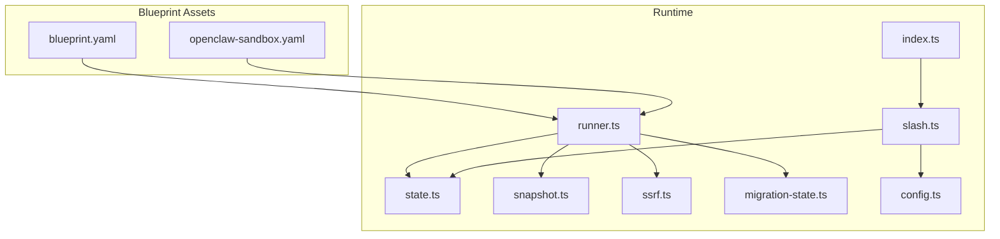
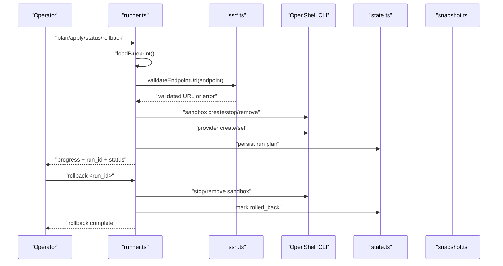
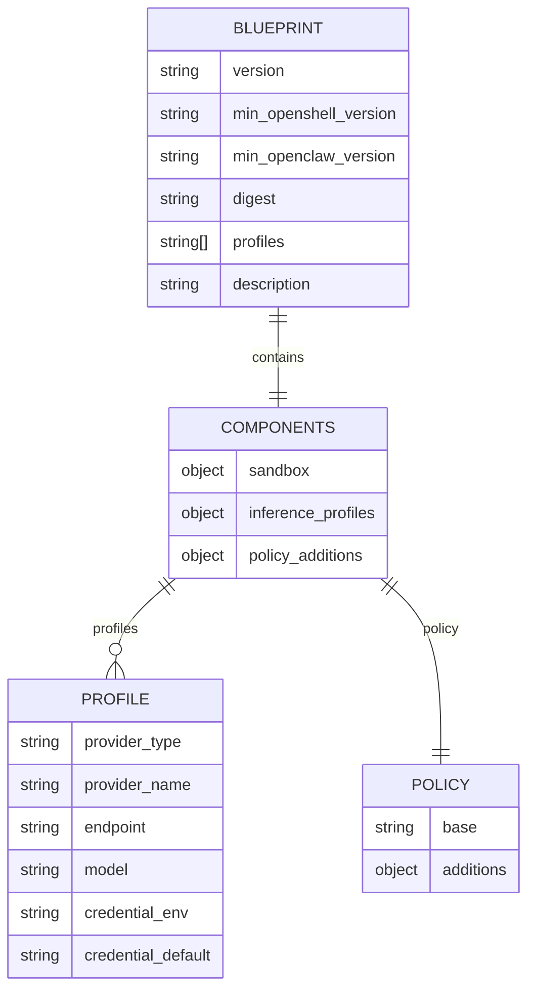
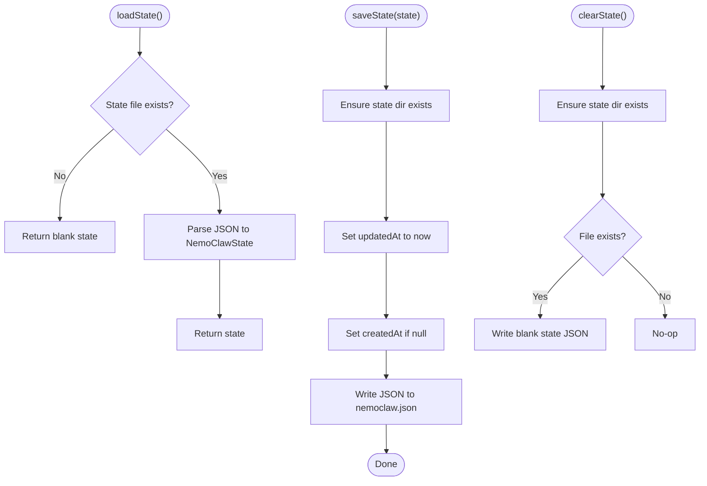
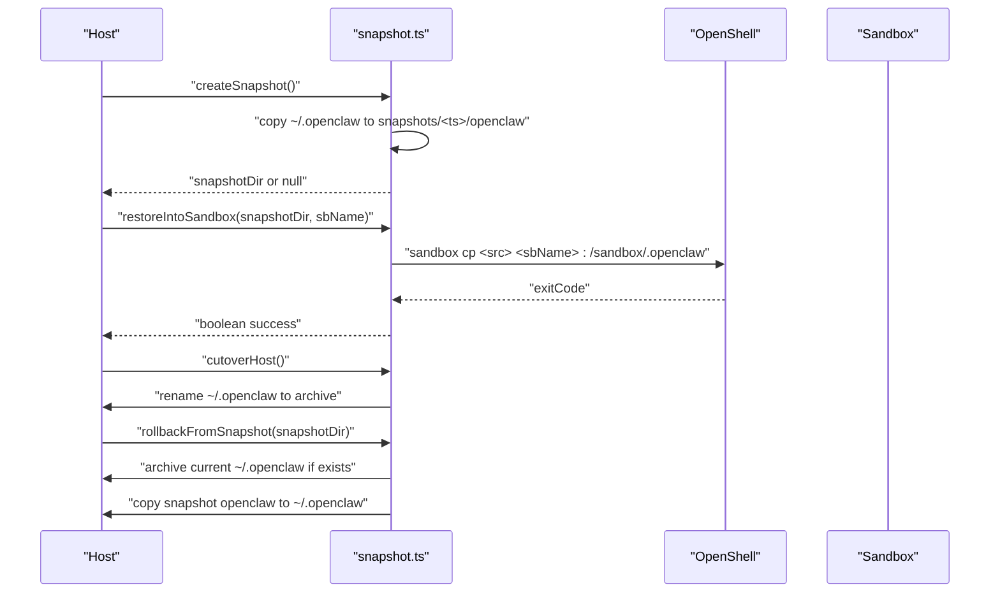
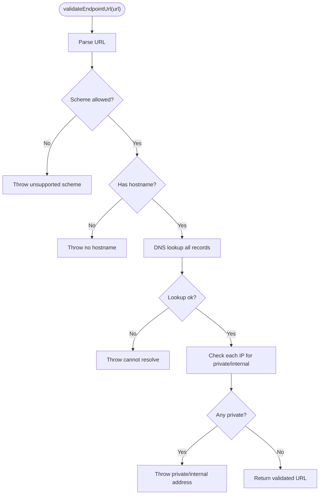
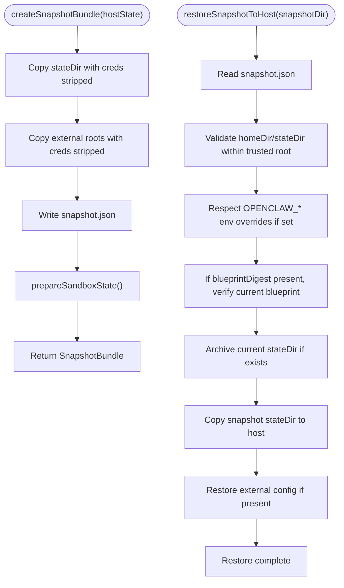
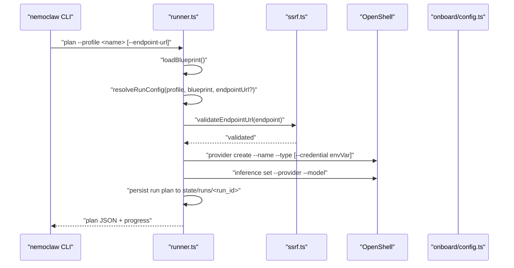
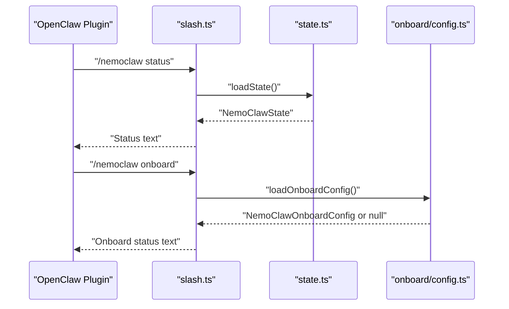
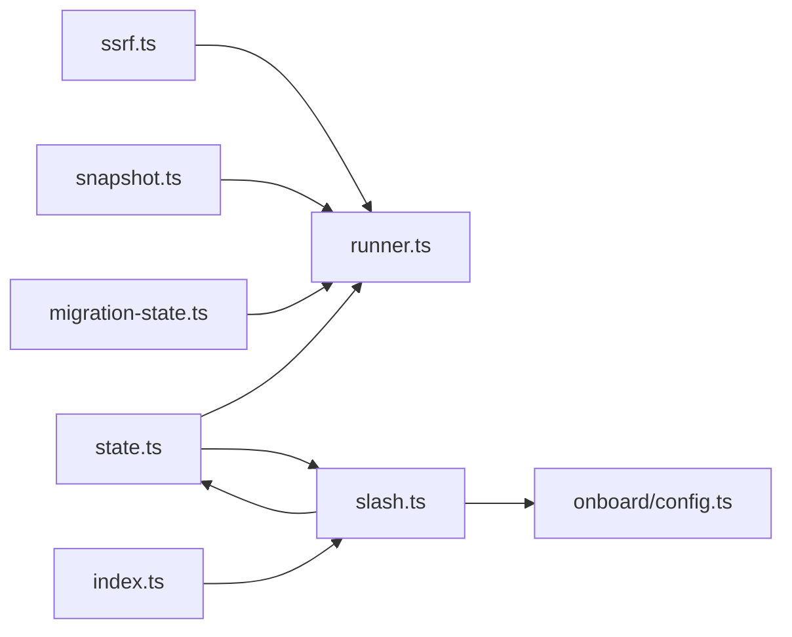

# Blueprint Configuration API

<cite>
**Referenced Files in This Document**
- [blueprint.yaml](file://nemoclaw-blueprint/blueprint.yaml)
- [openclaw-sandbox.yaml](file://nemoclaw-blueprint/policies/openclaw-sandbox.yaml)
- [runner.ts](file://nemoclaw/src/blueprint/runner.ts)
- [snapshot.ts](file://nemoclaw/src/blueprint/snapshot.ts)
- [state.ts](file://nemoclaw/src/blueprint/state.ts)
- [ssrf.ts](file://nemoclaw/src/blueprint/ssrf.ts)
- [migration-state.ts](file://nemoclaw/src/commands/migration-state.ts)
- [slash.ts](file://nemoclaw/src/commands/slash.ts)
- [index.ts](file://nemoclaw/src/index.ts)
- [config.ts](file://nemoclaw/src/onboard/config.ts)
- [validate-blueprint.test.ts](file://test/validate-blueprint.test.ts)
- [state.test.ts](file://nemoclaw/src/blueprint/state.test.ts)
- [snapshot.test.ts](file://nemoclaw/src/blueprint/snapshot.test.ts)
- [ssrf.test.ts](file://nemoclaw/src/blueprint/ssrf.test.ts)
</cite>

## Table of Contents
1. [Introduction](#introduction)
2. [Project Structure](#project-structure)
3. [Core Components](#core-components)
4. [Architecture Overview](#architecture-overview)
5. [Detailed Component Analysis](#detailed-component-analysis)
6. [Dependency Analysis](#dependency-analysis)
7. [Performance Considerations](#performance-considerations)
8. [Troubleshooting Guide](#troubleshooting-guide)
9. [Conclusion](#conclusion)
10. [Appendices](#appendices)

## Introduction
This document describes the Blueprint Configuration API used by NemoClaw to orchestrate OpenClaw sandbox lifecycle management within OpenShell. It covers YAML schema validation, state management interfaces, migration handling, blueprint structure, component definitions, and profile management APIs. It also explains state synchronization mechanisms, snapshot creation and restoration, SSRF protection, and configuration inheritance patterns. The goal is to enable operators to customize blueprints, configure components, manage state, and safely migrate between host and sandbox environments.

## Project Structure
The Blueprint Configuration API spans configuration assets, runtime runners, state persistence, snapshot utilities, SSRF protections, and migration tooling. The primary configuration assets are:
- Blueprint definition: [blueprint.yaml](file://nemoclaw-blueprint/blueprint.yaml)
- Base sandbox policy: [openclaw-sandbox.yaml](file://nemoclaw-blueprint/policies/openclaw-sandbox.yaml)

Runtime components:
- Blueprint runner: [runner.ts](file://nemoclaw/src/blueprint/runner.ts)
- State management: [state.ts](file://nemoclaw/src/blueprint/state.ts)
- Snapshot utilities: [snapshot.ts](file://nemoclaw/src/blueprint/snapshot.ts)
- SSRF protection: [ssrf.ts](file://nemoclaw/src/blueprint/ssrf.ts)
- Migration state and snapshot bundle: [migration-state.ts](file://nemoclaw/src/commands/migration-state.ts)
- Slash command integration: [slash.ts](file://nemoclaw/src/commands/slash.ts)
- Plugin API and onboard config: [index.ts](file://nemoclaw/src/index.ts), [config.ts](file://nemoclaw/src/onboard/config.ts)

**Diagram sources**
- [blueprint.yaml:1-66](file://nemoclaw-blueprint/blueprint.yaml#L1-L66)
- [openclaw-sandbox.yaml:1-219](file://nemoclaw-blueprint/policies/openclaw-sandbox.yaml#L1-L219)
- [runner.ts:1-451](file://nemoclaw/src/blueprint/runner.ts#L1-L451)
- [state.ts:1-70](file://nemoclaw/src/blueprint/state.ts#L1-L70)
- [snapshot.ts:1-177](file://nemoclaw/src/blueprint/snapshot.ts#L1-L177)
- [ssrf.ts:1-156](file://nemoclaw/src/blueprint/ssrf.ts#L1-L156)
- [migration-state.ts:1-912](file://nemoclaw/src/commands/migration-state.ts#L1-L912)
- [slash.ts:1-147](file://nemoclaw/src/commands/slash.ts#L1-L147)
- [index.ts:1-266](file://nemoclaw/src/index.ts#L1-L266)
- [config.ts:1-111](file://nemoclaw/src/onboard/config.ts#L1-L111)

**Section sources**
- [blueprint.yaml:1-66](file://nemoclaw-blueprint/blueprint.yaml#L1-L66)
- [openclaw-sandbox.yaml:1-219](file://nemoclaw-blueprint/policies/openclaw-sandbox.yaml#L1-L219)
- [runner.ts:1-451](file://nemoclaw/src/blueprint/runner.ts#L1-L451)
- [state.ts:1-70](file://nemoclaw/src/blueprint/state.ts#L1-L70)
- [snapshot.ts:1-177](file://nemoclaw/src/blueprint/snapshot.ts#L1-L177)
- [ssrf.ts:1-156](file://nemoclaw/src/blueprint/ssrf.ts#L1-L156)
- [migration-state.ts:1-912](file://nemoclaw/src/commands/migration-state.ts#L1-L912)
- [slash.ts:1-147](file://nemoclaw/src/commands/slash.ts#L1-L147)
- [index.ts:1-266](file://nemoclaw/src/index.ts#L1-L266)
- [config.ts:1-111](file://nemoclaw/src/onboard/config.ts#L1-L111)

## Core Components
- Blueprint runner orchestrates sandbox lifecycle, validates endpoints, and persists run state.
- State manager persists and restores NemoClaw operational state.
- Snapshot utilities capture and restore host OpenClaw configurations into OpenShell sandboxes.
- SSRF validator enforces safe endpoint URLs and rejects private/internal addresses.
- Migration state handles snapshot creation, credential sanitization, and secure restoration.
- Slash command integrates with OpenClaw plugin API to surface status and eject instructions.
- Onboard configuration stores user-selected inference endpoints and credentials.

**Section sources**
- [runner.ts:1-451](file://nemoclaw/src/blueprint/runner.ts#L1-L451)
- [state.ts:1-70](file://nemoclaw/src/blueprint/state.ts#L1-L70)
- [snapshot.ts:1-177](file://nemoclaw/src/blueprint/snapshot.ts#L1-L177)
- [ssrf.ts:1-156](file://nemoclaw/src/blueprint/ssrf.ts#L1-L156)
- [migration-state.ts:1-912](file://nemoclaw/src/commands/migration-state.ts#L1-L912)
- [slash.ts:1-147](file://nemoclaw/src/commands/slash.ts#L1-L147)
- [config.ts:1-111](file://nemoclaw/src/onboard/config.ts#L1-L111)

## Architecture Overview
The Blueprint Configuration API follows a layered architecture:
- Configuration layer: YAML-defined blueprint and policy assets.
- Orchestration layer: Blueprint runner parses blueprint, validates endpoints, and invokes OpenShell commands.
- Persistence layer: State and snapshot utilities maintain run metadata and host state.
- Security layer: SSRF validation and migration sanitization protect against SSRF and credential leakage.
- Integration layer: Slash command and plugin API expose status and rollback guidance.

**Diagram sources**
- [runner.ts:167-330](file://nemoclaw/src/blueprint/runner.ts#L167-L330)
- [ssrf.ts:118-155](file://nemoclaw/src/blueprint/ssrf.ts#L118-L155)
- [state.ts:47-69](file://nemoclaw/src/blueprint/state.ts#L47-L69)
- [snapshot.ts:362-391](file://nemoclaw/src/blueprint/snapshot.ts#L362-L391)

## Detailed Component Analysis

### Blueprint Schema and Validation
- Blueprint structure includes version, minimum platform versions, profiles, description, and components (sandbox, inference profiles, policy additions).
- Profiles define provider_type, provider_name, endpoint, model, and optional credential_env/credential_default.
- Base sandbox policy defines filesystem, process, and network_policies with endpoints and enforcement rules.

Validation highlights:
- Test suite ensures blueprint.yaml parses as a mapping, has non-empty profiles and inference profiles, and validates required fields per profile.
- Base policy must include version and network_policies.

**Diagram sources**
- [blueprint.yaml:4-66](file://nemoclaw-blueprint/blueprint.yaml#L4-L66)
- [openclaw-sandbox.yaml:16-219](file://nemoclaw-blueprint/policies/openclaw-sandbox.yaml#L16-L219)
- [validate-blueprint.test.ts:30-70](file://test/validate-blueprint.test.ts#L30-L70)

**Section sources**
- [blueprint.yaml:1-66](file://nemoclaw-blueprint/blueprint.yaml#L1-L66)
- [openclaw-sandbox.yaml:1-219](file://nemoclaw-blueprint/policies/openclaw-sandbox.yaml#L1-L219)
- [validate-blueprint.test.ts:1-87](file://test/validate-blueprint.test.ts#L1-L87)

### State Management Interfaces
- NemoClawState tracks lastRunId, lastAction, blueprintVersion, sandboxName, migrationSnapshot, hostBackupPath, createdAt, and updatedAt.
- Operations: loadState, saveState, clearState. saveState updates timestamps and preserves createdAt.

**Diagram sources**
- [state.ts:47-69](file://nemoclaw/src/blueprint/state.ts#L47-L69)

**Section sources**
- [state.ts:1-70](file://nemoclaw/src/blueprint/state.ts#L1-L70)
- [state.test.ts:29-110](file://nemoclaw/src/blueprint/state.test.ts#L29-L110)

### Snapshot Creation and Restoration
- Snapshot captures ~/.openclaw into .nemoclaw/snapshots/<timestamp>/openclaw with a manifest.
- Restore copies snapshot contents into a sandbox via OpenShell.
- Cutover renames host .openclaw to an archive; rollback restores from snapshot and optionally archives current state.

**Diagram sources**
- [snapshot.ts:57-135](file://nemoclaw/src/blueprint/snapshot.ts#L57-L135)

**Section sources**
- [snapshot.ts:1-177](file://nemoclaw/src/blueprint/snapshot.ts#L1-L177)
- [snapshot.test.ts:106-292](file://nemoclaw/src/blueprint/snapshot.test.ts#L106-L292)

### SSRF Protection and Endpoint Validation
- validateEndpointUrl enforces allowed schemes (http/https), requires a hostname, resolves DNS, and rejects private/internal IPs.
- isPrivateIp recognizes IPv4/IPv6 private ranges and mapped localhost.

**Diagram sources**
- [ssrf.ts:118-155](file://nemoclaw/src/blueprint/ssrf.ts#L118-L155)

**Section sources**
- [ssrf.ts:1-156](file://nemoclaw/src/blueprint/ssrf.ts#L1-L156)
- [ssrf.test.ts:1-182](file://nemoclaw/src/blueprint/ssrf.test.ts#L1-L182)

### Migration Handling Patterns
- Migration state detects host OpenClaw, collects external roots, sanitizes credentials, and prepares a snapshot bundle.
- Sanitization strips sensitive basenames and credential fields, removes gateway config, and chmods files securely.
- Restore validates trusted roots, optional env overrides, and blueprint digest integrity before writing to host.

**Diagram sources**
- [migration-state.ts:670-743](file://nemoclaw/src/commands/migration-state.ts#L670-L743)
- [migration-state.ts:772-911](file://nemoclaw/src/commands/migration-state.ts#L772-L911)

**Section sources**
- [migration-state.ts:1-912](file://nemoclaw/src/commands/migration-state.ts#L1-L912)

### Profile Management APIs
- Profiles are defined in blueprint.yaml under components.inference.profiles.
- Runner resolves a selected profile, optionally overrides endpoint, validates via SSRF, and configures OpenShell provider and inference route.
- Onboard configuration supports endpointType, endpointUrl, provider/providerLabel, model, profile, credentialEnv, and timestamps.

**Diagram sources**
- [runner.ts:167-330](file://nemoclaw/src/blueprint/runner.ts#L167-L330)
- [config.ts:21-31](file://nemoclaw/src/onboard/config.ts#L21-L31)

**Section sources**
- [runner.ts:51-144](file://nemoclaw/src/blueprint/runner.ts#L51-L144)
- [config.ts:1-111](file://nemoclaw/src/onboard/config.ts#L1-L111)

### Sandbox Lifecycle Management
- Runner emits run_id and progress events, creates/starts/stops/removes sandboxes, and persists run plans.
- Slash command surfaces status, onboard details, and eject instructions using state and onboard config.

**Diagram sources**
- [slash.ts:60-118](file://nemoclaw/src/commands/slash.ts#L60-L118)
- [state.ts:47-54](file://nemoclaw/src/blueprint/state.ts#L47-L54)
- [config.ts:91-110](file://nemoclaw/src/onboard/config.ts#L91-L110)

**Section sources**
- [slash.ts:1-147](file://nemoclaw/src/commands/slash.ts#L1-L147)
- [runner.ts:332-391](file://nemoclaw/src/blueprint/runner.ts#L332-L391)

## Dependency Analysis
- runner.ts depends on ssrf.ts for endpoint validation and uses OpenShell CLI for sandbox and provider operations.
- state.ts is used by runner.ts and slash.ts for persistence and status reporting.
- snapshot.ts depends on OpenShell CLI for sandbox copy operations.
- migration-state.ts coordinates snapshot creation, sanitization, and secure restoration, and depends on state for run metadata.
- slash.ts integrates with OpenClaw plugin API via index.ts and onboard/config.ts for status and onboard details.

**Diagram sources**
- [runner.ts:23-105](file://nemoclaw/src/blueprint/runner.ts#L23-L105)
- [state.ts:1-70](file://nemoclaw/src/blueprint/state.ts#L1-L70)
- [snapshot.ts:1-177](file://nemoclaw/src/blueprint/snapshot.ts#L1-L177)
- [migration-state.ts:1-912](file://nemoclaw/src/commands/migration-state.ts#L1-L912)
- [slash.ts:1-147](file://nemoclaw/src/commands/slash.ts#L1-L147)
- [index.ts:1-266](file://nemoclaw/src/index.ts#L1-L266)
- [config.ts:1-111](file://nemoclaw/src/onboard/config.ts#L1-L111)

**Section sources**
- [runner.ts:1-451](file://nemoclaw/src/blueprint/runner.ts#L1-L451)
- [state.ts:1-70](file://nemoclaw/src/blueprint/state.ts#L1-L70)
- [snapshot.ts:1-177](file://nemoclaw/src/blueprint/snapshot.ts#L1-L177)
- [migration-state.ts:1-912](file://nemoclaw/src/commands/migration-state.ts#L1-L912)
- [slash.ts:1-147](file://nemoclaw/src/commands/slash.ts#L1-L147)
- [index.ts:1-266](file://nemoclaw/src/index.ts#L1-L266)
- [config.ts:1-111](file://nemoclaw/src/onboard/config.ts#L1-L111)

## Performance Considerations
- Snapshot operations copy entire directories; prefer excluding unnecessary files and avoid frequent snapshots to reduce IO overhead.
- Endpoint validation performs DNS lookups; caching or batching validations may reduce latency in bulk operations.
- State persistence writes JSON files; ensure adequate disk performance and avoid concurrent writes.

## Troubleshooting Guide
Common issues and resolutions:
- Blueprint parsing failures: Verify YAML syntax and presence of required keys (profiles, components.inference.profiles).
- Missing OpenShell: The runner checks availability and exits with guidance if not installed.
- SSRF validation errors: Ensure endpoints are public, resolvable, and not private/internal addresses.
- Migration restore failures: Confirm trusted roots, OPENCLAW_* env overrides, and blueprint digest consistency.
- Snapshot restore missing files: Validate snapshot manifest and ensure snapshot directory structure is intact.

**Section sources**
- [validate-blueprint.test.ts:30-86](file://test/validate-blueprint.test.ts#L30-L86)
- [runner.ts:182-186](file://nemoclaw/src/blueprint/runner.ts#L182-L186)
- [ssrf.ts:118-155](file://nemoclaw/src/blueprint/ssrf.ts#L118-L155)
- [migration-state.ts:789-884](file://nemoclaw/src/commands/migration-state.ts#L789-L884)
- [snapshot.test.ts:116-143](file://nemoclaw/src/blueprint/snapshot.test.ts#L116-L143)

## Conclusion
The Blueprint Configuration API provides a robust framework for defining, validating, and operating OpenClaw sandboxes within OpenShell. It enforces security through SSRF validation and credential sanitization, manages state and snapshots for seamless migrations, and exposes profile-driven configuration for inference providers. Operators can customize blueprints, validate configurations, and safely manage sandbox lifecycles with built-in rollback and status capabilities.

## Appendices

### Blueprint Customization Examples
- Define a new inference profile with provider_type, provider_name, endpoint, model, and optional credential_env.
- Extend policy additions under components.policy.additions to allow additional endpoints.
- Override endpoint URL at runtime using --endpoint-url to validate via SSRF protection.

**Section sources**
- [blueprint.yaml:26-66](file://nemoclaw-blueprint/blueprint.yaml#L26-L66)
- [runner.ts:116-144](file://nemoclaw/src/blueprint/runner.ts#L116-L144)

### State Synchronization and Snapshot Operations
- Use createSnapshot to capture host state; listSnapshots to enumerate backups; restoreIntoSandbox to populate sandbox; rollbackFromSnapshot to revert host state.
- Runner persists run plans to state/runs/<run_id> for status queries.

**Section sources**
- [snapshot.ts:57-135](file://nemoclaw/src/blueprint/snapshot.ts#L57-L135)
- [runner.ts:304-330](file://nemoclaw/src/blueprint/runner.ts#L304-L330)
- [state.ts:47-69](file://nemoclaw/src/blueprint/state.ts#L47-L69)

### Security Validation and SSRF Protection
- validateEndpointUrl rejects unsupported schemes, missing hostnames, unresolved hosts, and private/internal IPs.
- migration-state sanitizes credentials and removes gateway config before snapshotting.

**Section sources**
- [ssrf.ts:118-155](file://nemoclaw/src/blueprint/ssrf.ts#L118-L155)
- [migration-state.ts:520-550](file://nemoclaw/src/commands/migration-state.ts#L520-L550)

### Configuration Inheritance Patterns
- Profiles inherit defaults from blueprint components.inference.profiles; endpoint overrides are validated and applied at runtime.
- Policy additions augment base sandbox policy without modifying immutable sections.

**Section sources**
- [blueprint.yaml:26-66](file://nemoclaw-blueprint/blueprint.yaml#L26-L66)
- [openclaw-sandbox.yaml:1-219](file://nemoclaw-blueprint/policies/openclaw-sandbox.yaml#L1-L219)