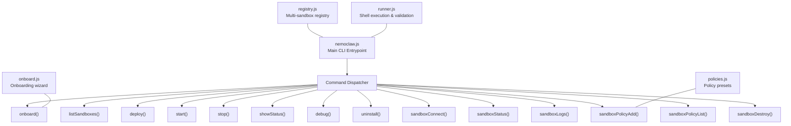
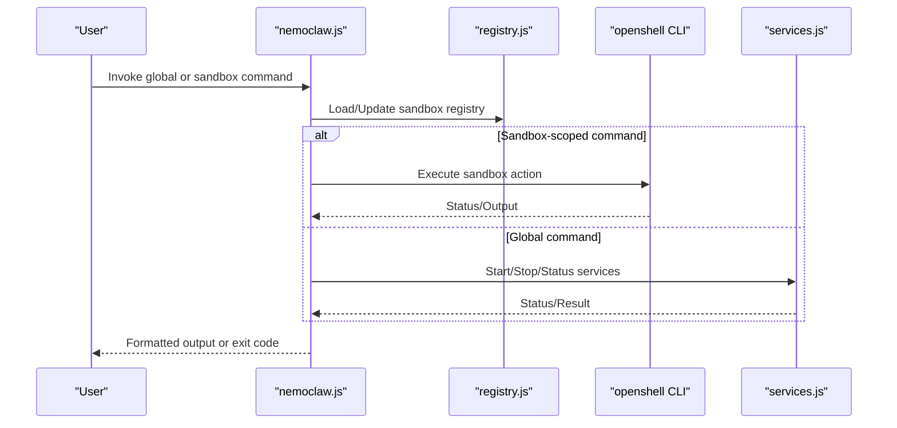
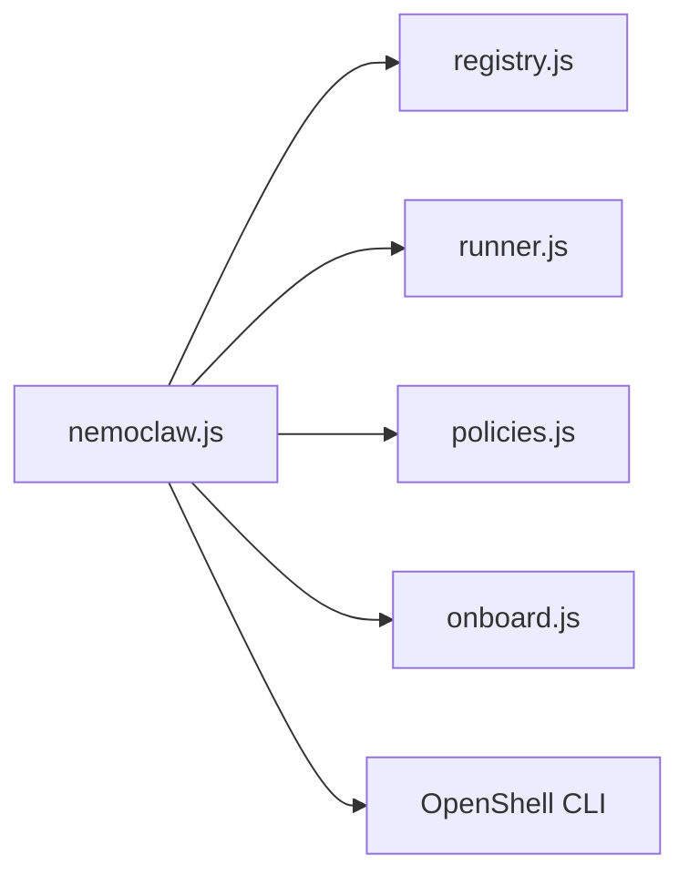

# CLI Command API

<cite>
**Referenced Files in This Document**
- [nemoclaw.js](file://bin/nemoclaw.js)
- [commands.md](file://docs/reference/commands.md)
- [registry.js](file://bin/lib/registry.js)
- [onboard.js](file://bin/lib/onboard.js)
- [policies.js](file://bin/lib/policies.js)
- [runner.js](file://bin/lib/runner.js)
- [package.json](file://package.json)
</cite>

## Table of Contents
1. [Introduction](#introduction)
2. [Project Structure](#project-structure)
3. [Core Components](#core-components)
4. [Architecture Overview](#architecture-overview)
5. [Detailed Component Analysis](#detailed-component-analysis)
6. [Dependency Analysis](#dependency-analysis)
7. [Performance Considerations](#performance-considerations)
8. [Troubleshooting Guide](#troubleshooting-guide)
9. [Conclusion](#conclusion)

## Introduction
This document provides a comprehensive Command Line Interface (CLI) API reference for NemoClaw’s host-side commands. It covers global commands (onboard, list, deploy, setup, setup-spark, start, stop, status, debug, uninstall, help, --help, -h, --version, -v) and sandbox-specific commands (connect, status, logs, policy-add, policy-list, destroy). For each command, you will find:
- Command signatures and aliases
- Parameter schemas and flags
- Validation rules and error handling patterns
- Output formats and examples
- Integration patterns with shell scripts and pipes
- Troubleshooting guidance

## Project Structure
NemoClaw’s CLI is implemented as a single executable that dispatches to specialized handlers. The main dispatcher resides in the CLI entrypoint and delegates to libraries for sandbox registry, onboard wizard, policy management, and other subsystems.

**Diagram sources**
- [nemoclaw.js:1308-1420](file://bin/nemoclaw.js#L1308-L1420)
- [registry.js:221-238](file://bin/lib/registry.js#L221-L238)
- [runner.js:197-206](file://bin/lib/runner.js#L197-L206)
- [onboard.js:1-120](file://bin/lib/onboard.js#L1-L120)
- [policies.js:339-352](file://bin/lib/policies.js#L339-L352)

**Section sources**
- [nemoclaw.js:47-63](file://bin/nemoclaw.js#L47-L63)
- [nemoclaw.js:1308-1420](file://bin/nemoclaw.js#L1308-L1420)
- [package.json:6-8](file://package.json#L6-L8)

## Core Components
- CLI Entrypoint: Parses argv, validates commands, and dispatches to handlers.
- Sandbox Registry: Persistent storage of sandbox metadata and default selection.
- Onboarding Wizard: Interactive setup for gateway, providers, and sandbox creation.
- Policy Manager: Lists, merges, and applies policy presets to sandboxes.
- Runner Utilities: Safe shell execution, quoting, redaction, and name validation.

**Section sources**
- [nemoclaw.js:1308-1420](file://bin/nemoclaw.js#L1308-L1420)
- [registry.js:123-152](file://bin/lib/registry.js#L123-L152)
- [onboard.js:1-120](file://bin/lib/onboard.js#L1-L120)
- [policies.js:220-285](file://bin/lib/policies.js#L220-L285)
- [runner.js:197-206](file://bin/lib/runner.js#L197-L206)

## Architecture Overview
The CLI orchestrates host-level operations and delegates sandbox-specific actions to the OpenShell CLI. It ensures sandbox liveness, recovers stale entries, and coordinates auxiliary services.

**Diagram sources**
- [nemoclaw.js:1308-1420](file://bin/nemoclaw.js#L1308-L1420)
- [registry.js:221-238](file://bin/lib/registry.js#L221-L238)
- [nemoclaw.js:834-848](file://bin/nemoclaw.js#L834-L848)

## Detailed Component Analysis

### Global Commands

#### onboard
- Aliases: None
- Signature: `nemoclaw onboard [--non-interactive] [--resume] [--yes-i-accept-third-party-software]`
- Purpose: Run the interactive setup wizard to configure inference providers, build the sandbox image, and create the sandbox.
- Parameters:
  - `--non-interactive`: Accept third-party software notice via flag or environment variable.
  - `--resume`: Resume an existing onboarding session.
  - Environment: `NEMOCLAW_ACCEPT_THIRD_PARTY_SOFTWARE=1` to accept notice in non-interactive mode.
- Validation:
  - Name validation for sandbox names follows RFC 1123 label rules.
  - Credential acceptance required for non-interactive mode.
- Error handling:
  - Exits with non-zero status on invalid options or wizard failures.
- Output:
  - Progress messages during gateway and sandbox creation.
  - Final success or failure messages.
- Examples:
  - Interactive: `nemoclaw onboard`
  - Non-interactive: `nemoclaw onboard --non-interactive --yes-i-accept-third-party-software`
  - With environment: `NEMOCLAW_ACCEPT_THIRD_PARTY_SOFTWARE=1 nemoclaw onboard --non-interactive`

**Section sources**
- [nemoclaw.js:780-796](file://bin/nemoclaw.js#L780-L796)
- [onboard.js:185-191](file://bin/lib/onboard.js#L185-L191)
- [runner.js:182-195](file://bin/lib/runner.js#L182-L195)

#### list
- Aliases: None
- Signature: `nemoclaw list`
- Purpose: List registered sandboxes with model, provider, GPU flag, and applied policy presets.
- Validation:
  - Recovers registry entries from the live OpenShell gateway when possible.
- Output:
  - Sandboxes with model/provider/GPU/policies.
  - Notes about recovered entries from session or gateway.
- Examples:
  - `nemoclaw list`

**Section sources**
- [nemoclaw.js:959-1008](file://bin/nemoclaw.js#L959-L1008)
- [nemoclaw.js:960-961](file://bin/nemoclaw.js#L960-L961)

#### deploy
- Aliases: None
- Signature: `nemoclaw deploy <instance-name>`
- Purpose: Deprecated. Compatibility wrapper for Brev-specific bootstrap flow.
- Validation:
  - Passes through to deployment executor with environment and root directory.
- Output:
  - Delegates to deployment module output.
- Examples:
  - `nemoclaw deploy my-instance`

**Section sources**
- [nemoclaw.js:814-832](file://bin/nemoclaw.js#L814-L832)

#### setup
- Aliases: Deprecated alias for onboard
- Signature: `nemoclaw setup`
- Purpose: Deprecated. Now delegates to onboard.
- Examples:
  - `nemoclaw setup`

**Section sources**
- [nemoclaw.js:798-803](file://bin/nemoclaw.js#L798-L803)
- [commands.md:267-275](file://docs/reference/commands.md#L267-L275)

#### setup-spark
- Aliases: Deprecated alias for onboard
- Signature: `nemoclaw setup-spark`
- Purpose: Deprecated. Current OpenShell releases handle older DGX Spark cgroup behavior; use onboard.
- Examples:
  - `nemoclaw setup-spark`

**Section sources**
- [nemoclaw.js:805-812](file://bin/nemoclaw.js#L805-L812)
- [commands.md:223-235](file://docs/reference/commands.md#L223-L235)

#### start
- Aliases: None
- Signature: `nemoclaw start`
- Purpose: Start auxiliary services (e.g., Telegram bridge, cloudflared tunnel).
- Validation:
  - Uses default sandbox name if present and valid.
- Output:
  - Service status after start.
- Examples:
  - `nemoclaw start`

**Section sources**
- [nemoclaw.js:834-840](file://bin/nemoclaw.js#L834-L840)
- [nemoclaw.js:835-839](file://bin/nemoclaw.js#L835-L839)

#### stop
- Aliases: None
- Signature: `nemoclaw stop`
- Purpose: Stop all auxiliary services.
- Validation:
  - Uses default sandbox name if present and valid.
- Output:
  - Service status after stop.
- Examples:
  - `nemoclaw stop`

**Section sources**
- [nemoclaw.js:842-848](file://bin/nemoclaw.js#L842-L848)
- [nemoclaw.js:843-847](file://bin/nemoclaw.js#L843-L847)

#### status
- Aliases: None
- Signature: `nemoclaw status`
- Purpose: Show registered sandboxes and auxiliary service status.
- Output:
  - Sandboxes with model/provider/GPU/policies.
  - Auxiliary service status.
- Examples:
  - `nemoclaw status`

**Section sources**
- [nemoclaw.js:937-957](file://bin/nemoclaw.js#L937-L957)
- [nemoclaw.js:938-956](file://bin/nemoclaw.js#L938-L956)

#### debug
- Aliases: None
- Signature: `nemoclaw debug [--quick] [--output FILE] [--sandbox NAME]`
- Purpose: Collect diagnostics for bug reports.
- Flags:
  - `--quick`, `-q`: Minimal diagnostics.
  - `--output`, `-o FILE`: Write diagnostics tarball to FILE.
  - `--sandbox`, `-s NAME`: Target sandbox name.
- Validation:
  - Requires a valid sandbox name if provided.
- Output:
  - Diagnostics summary or tarball path.
- Examples:
  - `nemoclaw debug`
  - `nemoclaw debug --quick`
  - `nemoclaw debug --output /tmp/diagnostics.tgz`
  - `nemoclaw debug --sandbox my-assistant`

**Section sources**
- [nemoclaw.js:850-893](file://bin/nemoclaw.js#L850-L893)

#### uninstall
- Aliases: None
- Signature: `nemoclaw uninstall [--yes] [--keep-openshell] [--delete-models]`
- Purpose: Remove NemoClaw sandboxes, gateway resources, related images/containers, and local state.
- Flags:
  - `--yes`: Skip confirmation prompt.
  - `--keep-openshell`: Leave the openshell binary installed.
  - `--delete-models`: Remove NemoClaw-pulled Ollama models.
- Validation:
  - Executes local uninstall script if present; otherwise downloads and executes remote script.
- Output:
  - Execution result or error messages.
- Examples:
  - `nemoclaw uninstall`
  - `nemoclaw uninstall --yes --keep-openshell`

**Section sources**
- [nemoclaw.js:895-935](file://bin/nemoclaw.js#L895-L935)

#### help, --help, -h
- Aliases: help, --help, -h
- Signature: `nemoclaw help`, `nemoclaw --help`, `nemoclaw -h`
- Purpose: Show top-level usage summary and command groups.
- Output:
  - Getting started, sandbox management, policy presets, compatibility commands, services, troubleshooting, and cleanup sections.
- Examples:
  - `nemoclaw help`
  - `nemoclaw --help`
  - `nemoclaw -h`

**Section sources**
- [nemoclaw.js:1258-1304](file://bin/nemoclaw.js#L1258-L1304)

#### --version, -v
- Aliases: --version, -v
- Signature: `nemoclaw --version`, `nemoclaw -v`
- Purpose: Print the installed NemoClaw CLI version.
- Output:
  - Version string (e.g., “nemoclaw vX.Y.Z”).
- Examples:
  - `nemoclaw --version`
  - `nemoclaw -v`

**Section sources**
- [nemoclaw.js:1351-1355](file://bin/nemoclaw.js#L1351-L1355)

### Sandbox-Specific Commands

#### connect
- Aliases: None
- Signature: `nemoclaw <name> connect`
- Purpose: Connect to a sandbox by name.
- Validation:
  - Ensures sandbox is live; recovers gateway/runtime if needed.
  - Validates sandbox name per RFC 1123 label rules.
- Output:
  - Connects to sandbox via OpenShell; exits with spawn result status.
- Examples:
  - `nemoclaw my-assistant connect`

**Section sources**
- [nemoclaw.js:1012-1021](file://bin/nemoclaw.js#L1012-L1021)
- [nemoclaw.js:1013-1014](file://bin/nemoclaw.js#L1013-L1014)
- [runner.js:182-195](file://bin/lib/runner.js#L182-L195)

#### status
- Aliases: None
- Signature: `nemoclaw <name> status`
- Purpose: Show sandbox status, health, inference configuration, OpenClaw process status, and NIM status.
- Validation:
  - Checks gateway state and recovers runtime if possible.
  - Validates sandbox name.
- Output:
  - Sandbox metadata, gateway status, OpenClaw process health, and NIM status.
- Examples:
  - `nemoclaw my-assistant status`

**Section sources**
- [nemoclaw.js:1024-1136](file://bin/nemoclaw.js#L1024-L1136)
- [nemoclaw.js:1025-1036](file://bin/nemoclaw.js#L1025-L1036)

#### logs
- Aliases: None
- Signature: `nemoclaw <name> logs [--follow]`
- Purpose: View sandbox logs; optionally stream with --follow.
- Validation:
  - Requires minimum OpenShell version for logs support.
  - Validates sandbox name.
- Output:
  - Logs streamed to stdout; errors written to stderr.
- Examples:
  - `nemoclaw my-assistant logs`
  - `nemoclaw my-assistant logs --follow`

**Section sources**
- [nemoclaw.js:1138-1179](file://bin/nemoclaw.js#L1138-L1179)
- [nemoclaw.js:1139-1143](file://bin/nemoclaw.js#L1139-L1143)
- [runner.js:182-195](file://bin/lib/runner.js#L182-L195)

#### policy-add
- Aliases: None
- Signature: `nemoclaw <name> policy-add`
- Purpose: Add a network or filesystem policy preset to a sandbox.
- Validation:
  - Loads presets from blueprint; validates sandbox name.
- Output:
  - Applies preset and updates registry.
- Examples:
  - `nemoclaw my-assistant policy-add`

**Section sources**
- [nemoclaw.js:1181-1193](file://bin/nemoclaw.js#L1181-L1193)
- [policies.js:220-285](file://bin/lib/policies.js#L220-L285)

#### policy-list
- Aliases: None
- Signature: `nemoclaw <name> policy-list`
- Purpose: List available policy presets and show which ones are applied to the sandbox.
- Output:
  - Preset list with markers for applied vs unapplied.
- Examples:
  - `nemoclaw my-assistant policy-list`

**Section sources**
- [nemoclaw.js:1195-1206](file://bin/nemoclaw.js#L1195-L1206)
- [policies.js:21-36](file://bin/lib/policies.js#L21-L36)

#### destroy
- Aliases: None
- Signature: `nemoclaw <name> destroy [--yes]`
- Purpose: Stop NIM for the sandbox and delete it; removes from registry.
- Flags:
  - `--yes`, `--force`: Skip confirmation prompt.
- Validation:
  - Validates sandbox name; confirms deletion unless --yes is provided.
- Output:
  - Success message; cleans up gateway resources if last sandbox is removed.
- Examples:
  - `nemoclaw my-assistant destroy`
  - `nemoclaw my-assistant destroy --yes`

**Section sources**
- [nemoclaw.js:1208-1254](file://bin/nemoclaw.js#L1208-L1254)
- [nemoclaw.js:1209-1219](file://bin/nemoclaw.js#L1209-L1219)
- [runner.js:182-195](file://bin/lib/runner.js#L182-L195)

## Dependency Analysis
- Command dispatch depends on:
  - Sandbox registry for default selection and metadata.
  - Runner utilities for safe shell execution, quoting, and name validation.
  - Onboarding wizard for interactive/non-interactive setup.
  - Policy manager for preset operations.
- External integration:
  - OpenShell CLI for sandbox and gateway operations.
  - Auxiliary services for Telegram bridge and tunnels.

**Diagram sources**
- [nemoclaw.js:1308-1420](file://bin/nemoclaw.js#L1308-L1420)
- [registry.js:221-238](file://bin/lib/registry.js#L221-L238)
- [runner.js:197-206](file://bin/lib/runner.js#L197-L206)
- [policies.js:339-352](file://bin/lib/policies.js#L339-L352)
- [onboard.js:1-120](file://bin/lib/onboard.js#L1-L120)

**Section sources**
- [nemoclaw.js:1308-1420](file://bin/nemoclaw.js#L1308-L1420)
- [registry.js:221-238](file://bin/lib/registry.js#L221-L238)
- [runner.js:197-206](file://bin/lib/runner.js#L197-L206)
- [policies.js:339-352](file://bin/lib/policies.js#L339-L352)
- [onboard.js:1-120](file://bin/lib/onboard.js#L1-L120)

## Performance Considerations
- Command execution uses synchronous spawns for deterministic output; avoid long-running commands in tight loops.
- Logging and diagnostics collection can be large; use `--quick` and targeted `--sandbox` to reduce overhead.
- Registry operations are atomic with advisory locking; avoid concurrent CLI invocations to prevent contention.

[No sources needed since this section provides general guidance]

## Troubleshooting Guide
Common issues and resolutions:
- Sandbox not present in live gateway:
  - The CLI removes stale registry entries and suggests running onboard or connecting again once the gateway is healthy.
- Gateway unreachable or identity drift:
  - The CLI attempts recovery via gateway reselection/start; if unresolved, guides to rebuild gateway and recreate the sandbox.
- Old OpenShell logs compatibility:
  - If logs fail due to version mismatch, upgrade OpenShell and retry.
- Uninstall failures:
  - If local uninstall script is missing, the CLI downloads and executes the remote script; ensure network connectivity.

**Section sources**
- [nemoclaw.js:674-740](file://bin/nemoclaw.js#L674-L740)
- [nemoclaw.js:1138-1179](file://bin/nemoclaw.js#L1138-L1179)
- [nemoclaw.js:895-935](file://bin/nemoclaw.js#L895-L935)

## Conclusion
NemoClaw’s CLI provides a robust, extensible interface for managing sandboxes and auxiliary services. It integrates tightly with OpenShell for sandbox lifecycle operations, maintains a persistent registry for multi-sandbox environments, and offers comprehensive diagnostics and recovery mechanisms. Use the command signatures and examples above to integrate NemoClaw into automation and scripting workflows.