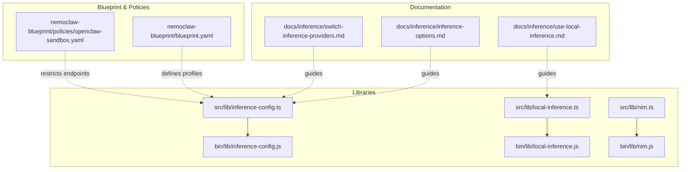
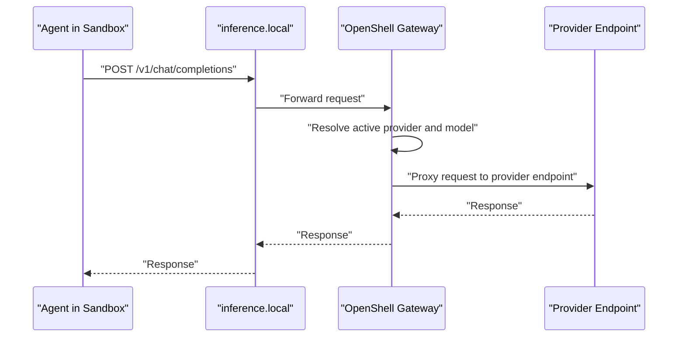
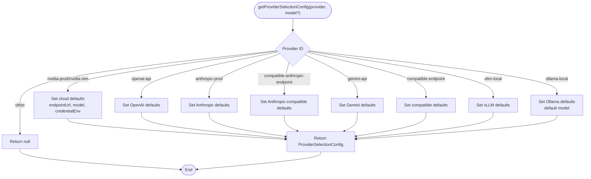
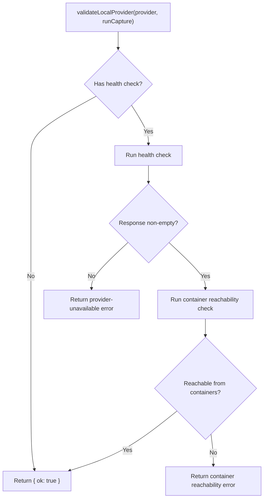
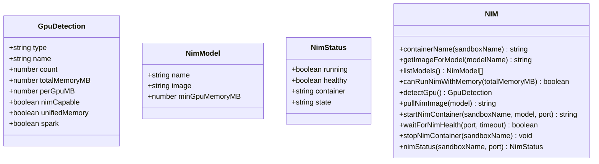
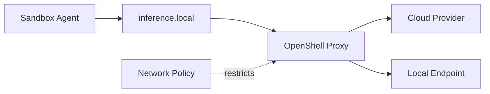
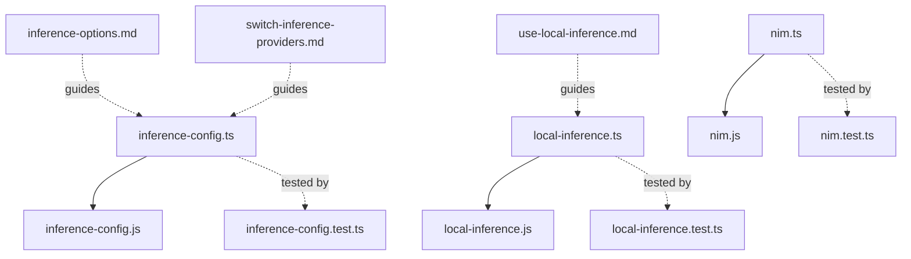

# Inference Management API

<cite>
**Referenced Files in This Document**
- [inference-config.ts](file://src/lib/inference-config.ts)
- [local-inference.ts](file://src/lib/local-inference.ts)
- [nim.ts](file://src/lib/nim.ts)
- [inference-config.js](file://bin/lib/inference-config.js)
- [local-inference.js](file://bin/lib/local-inference.js)
- [nim.js](file://bin/lib/nim.js)
- [inference-options.md](file://docs/inference/inference-options.md)
- [use-local-inference.md](file://docs/inference/use-local-inference.md)
- [switch-inference-providers.md](file://docs/inference/switch-inference-providers.md)
- [blueprint.yaml](file://nemoclaw-blueprint/blueprint.yaml)
- [openclaw-sandbox.yaml](file://nemoclaw-blueprint/policies/openclaw-sandbox.yaml)
- [test-inference.sh](file://scripts/test-inference.sh)
- [test-inference-local.sh](file://scripts/test-inference-local.sh)
- [inference-config.test.ts](file://src/lib/inference-config.test.ts)
- [local-inference.test.ts](file://src/lib/local-inference.test.ts)
- [nim.test.ts](file://src/lib/nim.test.ts)
</cite>

## Table of Contents
1. [Introduction](#introduction)
2. [Project Structure](#project-structure)
3. [Core Components](#core-components)
4. [Architecture Overview](#architecture-overview)
5. [Detailed Component Analysis](#detailed-component-analysis)
6. [Dependency Analysis](#dependency-analysis)
7. [Performance Considerations](#performance-considerations)
8. [Security Considerations](#security-considerations)
9. [Troubleshooting Guide](#troubleshooting-guide)
10. [Conclusion](#conclusion)
11. [Appendices](#appendices)

## Introduction
This document describes the Inference Management API that powers provider configuration, endpoint routing, and model selection within NemoClaw. It explains how inference providers are registered, validated, and switched at runtime, how local inference is set up and managed, and how inference configuration relates to sandbox deployment. It also documents authentication handling, security posture, rate-limiting considerations, and error handling patterns.

## Project Structure
The inference management surface is implemented primarily in TypeScript libraries under src/lib and exposed via thin Node.js re-export shims under bin/lib. Documentation for onboarding, local inference, and runtime switching resides in docs/inference. Blueprint and policy files define sandbox profiles and network permissions that constrain inference routing.

**Diagram sources**
- [inference-config.ts:1-150](file://src/lib/inference-config.ts#L1-L150)
- [local-inference.ts:1-238](file://src/lib/local-inference.ts#L1-L238)
- [nim.ts:1-276](file://src/lib/nim.ts#L1-L276)
- [inference-config.js:1-8](file://bin/lib/inference-config.js#L1-L8)
- [local-inference.js:1-8](file://bin/lib/local-inference.js#L1-L8)
- [nim.js:1-8](file://bin/lib/nim.js#L1-L8)
- [inference-options.md:1-81](file://docs/inference/inference-options.md#L1-L81)
- [use-local-inference.md:1-232](file://docs/inference/use-local-inference.md#L1-L232)
- [switch-inference-providers.md:1-101](file://docs/inference/switch-inference-providers.md#L1-L101)
- [blueprint.yaml:1-66](file://nemoclaw-blueprint/blueprint.yaml#L1-L66)
- [openclaw-sandbox.yaml:1-219](file://nemoclaw-blueprint/policies/openclaw-sandbox.yaml#L1-L219)

**Section sources**
- [inference-config.ts:1-150](file://src/lib/inference-config.ts#L1-L150)
- [local-inference.ts:1-238](file://src/lib/local-inference.ts#L1-L238)
- [nim.ts:1-276](file://src/lib/nim.ts#L1-L276)
- [inference-options.md:1-81](file://docs/inference/inference-options.md#L1-L81)
- [use-local-inference.md:1-232](file://docs/inference/use-local-inference.md#L1-L232)
- [switch-inference-providers.md:1-101](file://docs/inference/switch-inference-providers.md#L1-L101)
- [blueprint.yaml:1-66](file://nemoclaw-blueprint/blueprint.yaml#L1-L66)
- [openclaw-sandbox.yaml:1-219](file://nemoclaw-blueprint/policies/openclaw-sandbox.yaml#L1-L219)

## Core Components
- Provider selection and routing configuration: maps provider identifiers to endpoint URLs, default models, credential environments, and labels. Also resolves the OpenClaw primary model identifier for managed providers.
- Local inference helpers: compute base URLs, health checks, container reachability checks, model detection, warmup/probe commands, and validations for Ollama and vLLM.
- NIM container lifecycle: GPU detection, image selection, container start/stop, health polling, and status inspection for NVIDIA NIM.

Key exports and responsibilities:
- ProviderSelectionConfig and GatewayInference types, provider mapping, and gateway output parsing.
- Local provider URL mapping, health checks, container reachability, Ollama model parsing and validation, warmup/probe commands.
- NIM model catalog, GPU detection, container orchestration, and health/status queries.

**Section sources**
- [inference-config.ts:26-150](file://src/lib/inference-config.ts#L26-L150)
- [local-inference.ts:12-238](file://src/lib/local-inference.ts#L12-L238)
- [nim.ts:13-276](file://src/lib/nim.ts#L13-L276)

## Architecture Overview
Inference requests from agents inside the sandbox are routed to inference.local. OpenShell intercepts and forwards these requests to the selected provider endpoint on the host, keeping secrets on the host and not exposing them to the sandbox. Blueprints define profiles and policies that constrain which endpoints are reachable.

**Diagram sources**
- [inference-options.md:29-36](file://docs/inference/inference-options.md#L29-L36)
- [blueprint.yaml:26-56](file://nemoclaw-blueprint/blueprint.yaml#L26-L56)

## Detailed Component Analysis

### Provider Selection and Routing
Provider selection maps a provider identifier to a ProviderSelectionConfig that includes:
- endpointType: "custom"
- endpointUrl: a fixed route URL for sandbox-to-gateway routing
- profile: default route profile
- model: default or provided model
- credentialEnv: environment variable name for credentials
- providerLabel: human-readable label

Supported providers include cloud and compatible endpoints, plus local providers for vLLM and Ollama. Unknown providers return null.

**Diagram sources**
- [inference-config.ts:42-115](file://src/lib/inference-config.ts#L42-L115)

Additional behaviors:
- getOpenClawPrimaryModel builds a managed model identifier using a provider namespace and either the provided model or a default.
- parseGatewayInference extracts provider and model from OpenShell gateway status output.

**Section sources**
- [inference-config.ts:42-150](file://src/lib/inference-config.ts#L42-L150)
- [inference-config.test.ts:19-173](file://src/lib/inference-config.test.ts#L19-L173)

### Local Inference Setup and Validation
Local inference helpers support:
- Base URL mapping for vLLM and Ollama behind the host gateway.
- Health checks and container reachability checks for validating local endpoints.
- Ollama model detection via API tags or CLI list, with fallbacks and bootstrapping based on GPU memory.
- Warmup and probe commands for Ollama models with tunable keep-alive and timeouts.
- Validation routines that return structured results with messages for failures.

**Diagram sources**
- [local-inference.ts:73-130](file://src/lib/local-inference.ts#L73-L130)

Ollama-specific validation:
- Probe command sends a small generation request and parses JSON responses.
- Returns errors for timeouts or non-empty error payloads.

**Section sources**
- [local-inference.ts:132-238](file://src/lib/local-inference.ts#L132-L238)
- [local-inference.test.ts:70-125](file://src/lib/local-inference.test.ts#L70-L125)
- [local-inference.test.ts:230-249](file://src/lib/local-inference.test.ts#L230-L249)

### NVIDIA NIM Container Lifecycle
NIM management includes:
- GPU detection across NVIDIA, unified-memory, and Apple platforms.
- Image selection from a model catalog and pulling.
- Container orchestration (start/stop) with port mapping and shared memory sizing.
- Health polling and status inspection with automatic port resolution.

**Diagram sources**
- [nim.ts:19-36](file://src/lib/nim.ts#L19-L36)
- [nim.ts:171-276](file://src/lib/nim.ts#L171-L276)

**Section sources**
- [nim.ts:59-169](file://src/lib/nim.ts#L59-L169)
- [nim.ts:171-276](file://src/lib/nim.ts#L171-L276)
- [nim.test.ts:69-167](file://src/lib/nim.test.ts#L69-L167)
- [nim.test.ts:169-258](file://src/lib/nim.test.ts#L169-L258)

### Endpoint Routing and Authentication
- All sandbox-to-provider traffic is routed through inference.local on the host, which OpenShell intercepts and forwards to the selected provider endpoint.
- Credentials remain on the host; the sandbox does not receive API keys.
- Profiles and policies define which endpoints are allowed and how inference is constrained.

**Diagram sources**
- [inference-options.md:29-36](file://docs/inference/inference-options.md#L29-L36)
- [openclaw-sandbox.yaml:46-219](file://nemoclaw-blueprint/policies/openclaw-sandbox.yaml#L46-L219)

**Section sources**
- [inference-options.md:29-36](file://docs/inference/inference-options.md#L29-L36)
- [use-local-inference.md:28-31](file://docs/inference/use-local-inference.md#L28-L31)
- [openclaw-sandbox.yaml:46-219](file://nemoclaw-blueprint/policies/openclaw-sandbox.yaml#L46-L219)

### Model Catalog Management
- Cloud providers expose curated model options; the selection config supplies defaults and labels.
- Local inference catalogs models from Ollama tags or CLI list, with bootstrapped defaults for memory-constrained hosts.
- NIM models are drawn from a model catalog with minimum VRAM requirements.

**Section sources**
- [inference-config.ts:14-21](file://src/lib/inference-config.ts#L14-L21)
- [local-inference.ts:166-184](file://src/lib/local-inference.ts#L166-L184)
- [nim.ts:47-53](file://src/lib/nim.ts#L47-L53)

### Provider Switching Mechanisms
- Runtime switching is performed via OpenShell commands that update the active provider and model without restarting the sandbox.
- The sandbox continues to use inference.local; only the gateway route changes.

**Section sources**
- [switch-inference-providers.md:33-96](file://docs/inference/switch-inference-providers.md#L33-L96)

### Examples and Usage Patterns
- Custom provider implementation: extend provider mapping to support new compatible endpoints by adding entries to the provider switch and ensuring endpoint validation aligns with the chosen API path.
- Inference configuration: use environment variables to supply credentials for cloud or compatible endpoints; leverage blueprint profiles to predefine endpoints and models.
- Performance optimization: warm up Ollama models with keep-alive settings; use NIM with appropriate models for GPU capacity; tune probe timeouts and keep-alives for local endpoints.

**Section sources**
- [inference-config.ts:42-115](file://src/lib/inference-config.ts#L42-L115)
- [local-inference.ts:186-208](file://src/lib/local-inference.ts#L186-L208)
- [use-local-inference.md:70-84](file://docs/inference/use-local-inference.md#L70-L84)

## Dependency Analysis
- The TypeScript libraries are re-exported via Node.js shims for consumption by the compiled distribution.
- Tests validate provider mapping, local inference URL mapping, health checks, and NIM status resolution.
- Documentation guides complement the APIs with onboarding and runtime switching procedures.

**Diagram sources**
- [inference-config.ts:1-150](file://src/lib/inference-config.ts#L1-L150)
- [local-inference.ts:1-238](file://src/lib/local-inference.ts#L1-L238)
- [nim.ts:1-276](file://src/lib/nim.ts#L1-L276)
- [inference-config.js:1-8](file://bin/lib/inference-config.js#L1-L8)
- [local-inference.js:1-8](file://bin/lib/local-inference.js#L1-L8)
- [nim.js:1-8](file://bin/lib/nim.js#L1-L8)
- [inference-config.test.ts:1-214](file://src/lib/inference-config.test.ts#L1-L214)
- [local-inference.test.ts:1-255](file://src/lib/local-inference.test.ts#L1-L255)
- [nim.test.ts:1-260](file://src/lib/nim.test.ts#L1-L260)
- [inference-options.md:1-81](file://docs/inference/inference-options.md#L1-L81)
- [use-local-inference.md:1-232](file://docs/inference/use-local-inference.md#L1-L232)
- [switch-inference-providers.md:1-101](file://docs/inference/switch-inference-providers.md#L1-L101)

**Section sources**
- [inference-config.js:1-8](file://bin/lib/inference-config.js#L1-L8)
- [local-inference.js:1-8](file://bin/lib/local-inference.js#L1-L8)
- [nim.js:1-8](file://bin/lib/nim.js#L1-L8)
- [inference-config.test.ts:1-214](file://src/lib/inference-config.test.ts#L1-L214)
- [local-inference.test.ts:1-255](file://src/lib/local-inference.test.ts#L1-L255)
- [nim.test.ts:1-260](file://src/lib/nim.test.ts#L1-L260)

## Performance Considerations
- Warmup and keep-alive: use Ollama warmup commands to preload models and reduce first-request latency.
- Health polling intervals: adjust timeouts and intervals for local endpoints to balance responsiveness and resource usage.
- NIM sizing: select models aligned with GPU memory to avoid repeated reloads or degraded performance.
- Endpoint reachability: ensure local endpoints listen on interfaces reachable from containers to avoid extra retries and delays.

[No sources needed since this section provides general guidance]

## Security Considerations
- Secrets isolation: credentials are kept on the host; the sandbox does not receive API keys.
- Network policies: default sandbox policy restricts outbound connectivity to minimal required endpoints; inference endpoints must be permitted via policy or blueprint.
- Rate limiting: while not explicitly implemented in the referenced code, rate limiting should be enforced at the provider level or via upstream controls; avoid excessive polling in local validation.
- Error handling: validation routines return structured messages; sanitize logs and avoid leaking sensitive details.

**Section sources**
- [inference-options.md:35-36](file://docs/inference/inference-options.md#L35-L36)
- [openclaw-sandbox.yaml:46-219](file://nemoclaw-blueprint/policies/openclaw-sandbox.yaml#L46-L219)

## Troubleshooting Guide
Common issues and resolutions:
- Local provider unavailable: health checks fail; verify the endpoint is reachable on localhost and from containers.
- Container reachability failure: endpoint only binds to loopback; reconfigure to bind to 0.0.0.0 or equivalent.
- Ollama model validation failures: probe times out or returns an error; check model availability and host memory.
- NIM startup and health: ensure sufficient GPU memory and that the container becomes healthy within the timeout window.

Verification scripts:
- Use test scripts to validate routing through inference.local for cloud and local endpoints.

**Section sources**
- [local-inference.ts:73-130](file://src/lib/local-inference.ts#L73-L130)
- [local-inference.test.ts:80-111](file://src/lib/local-inference.test.ts#L80-L111)
- [local-inference.test.ts:230-249](file://src/lib/local-inference.test.ts#L230-L249)
- [test-inference.sh:1-10](file://scripts/test-inference.sh#L1-L10)
- [test-inference-local.sh:1-10](file://scripts/test-inference-local.sh#L1-L10)

## Conclusion
The Inference Management API provides a robust, extensible framework for configuring providers, routing inference through inference.local, and managing local inference with validation and lifecycle controls. Blueprints and policies govern sandbox deployment and endpoint access, while tests and documentation ensure reliable operation across cloud and local scenarios.

[No sources needed since this section summarizes without analyzing specific files]

## Appendices

### API Reference Summary
- Provider selection
  - getProviderSelectionConfig(provider, model?): ProviderSelectionConfig | null
  - getOpenClawPrimaryModel(provider, model?): string
  - parseGatewayInference(output): GatewayInference | null
- Local inference
  - getLocalProviderBaseUrl(provider): string | null
  - getLocalProviderValidationBaseUrl(provider): string | null
  - getLocalProviderHealthCheck(provider): string | null
  - getLocalProviderContainerReachabilityCheck(provider): string | null
  - validateLocalProvider(provider, runCapture): ValidationResult
  - parseOllamaList(output): string[]
  - parseOllamaTags(output): string[]
  - getOllamaModelOptions(runCapture): string[]
  - getDefaultOllamaModel(runCapture, gpu): string
  - getOllamaWarmupCommand(model, keepAlive?): string
  - getOllamaProbeCommand(model, timeout?, keepAlive?): string
  - validateOllamaModel(model, runCapture): ValidationResult
- NIM
  - containerName(sandboxName): string
  - getImageForModel(modelName): string | null
  - listModels(): NimModel[]
  - canRunNimWithMemory(totalMemoryMB): boolean
  - detectGpu(): GpuDetection | null
  - pullNimImage(model): string
  - startNimContainer(sandboxName, model, port?): string
  - waitForNimHealth(port?, timeout?): boolean
  - stopNimContainer(sandboxName): void
  - nimStatus(sandboxName, port?): NimStatus

**Section sources**
- [inference-config.ts:42-150](file://src/lib/inference-config.ts#L42-L150)
- [local-inference.ts:29-238](file://src/lib/local-inference.ts#L29-L238)
- [nim.ts:38-276](file://src/lib/nim.ts#L38-L276)