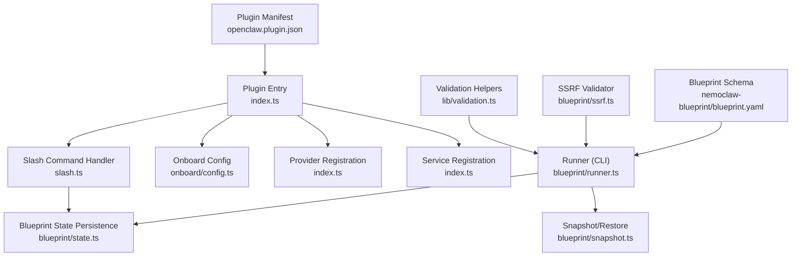
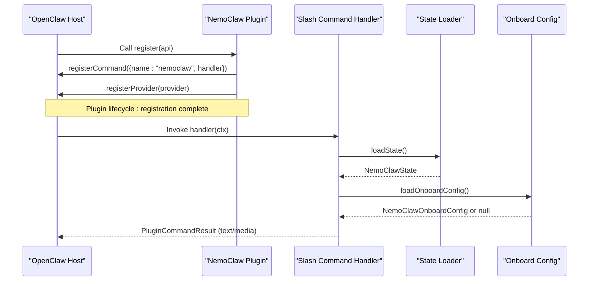
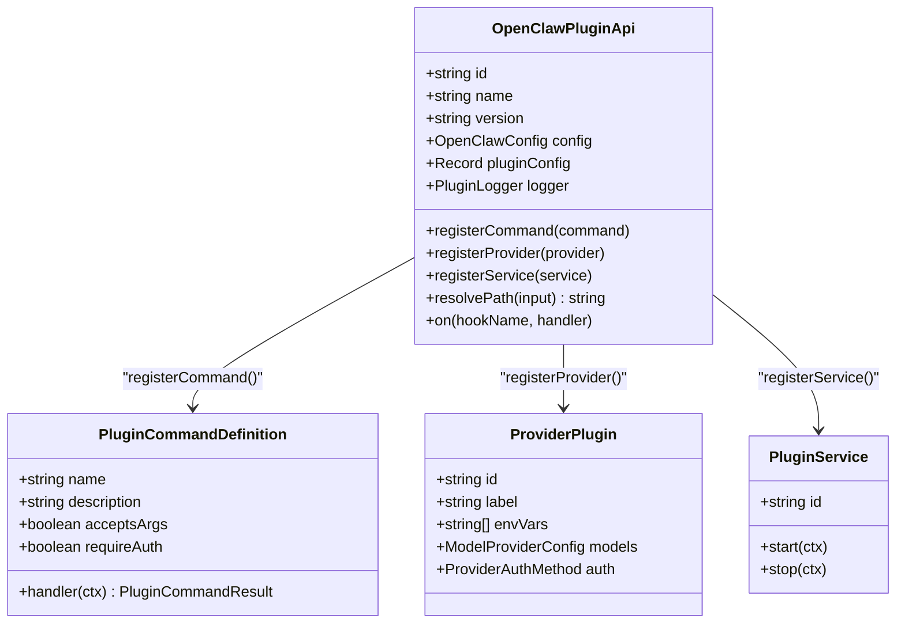
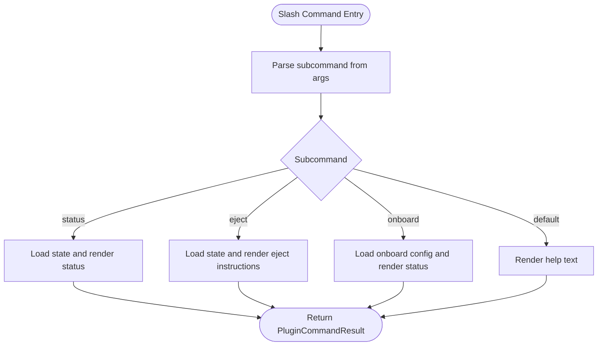
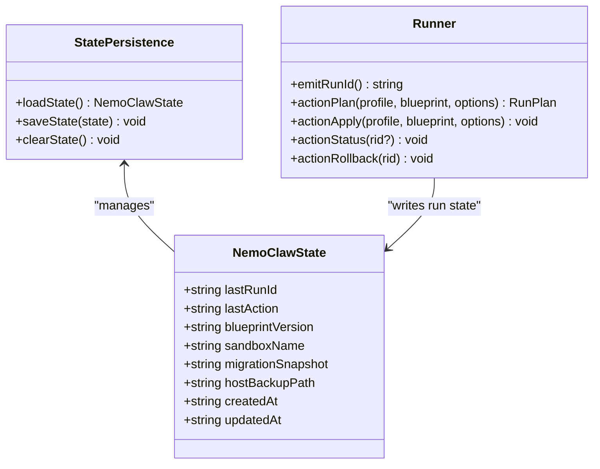
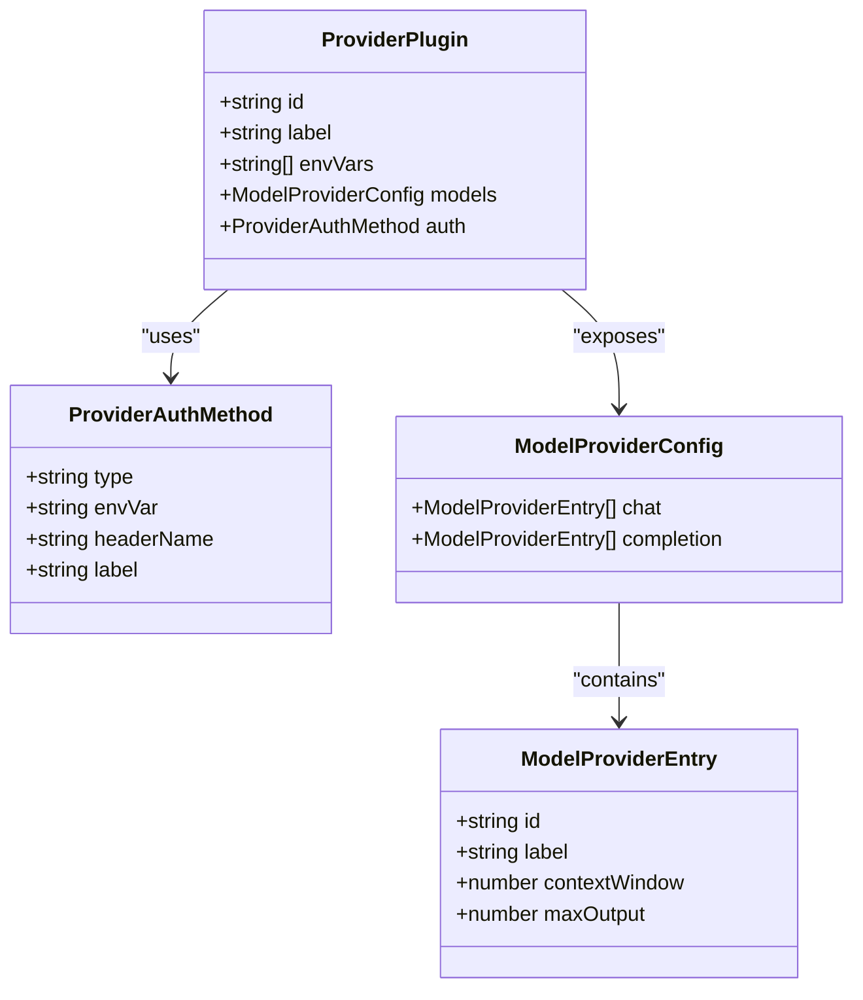
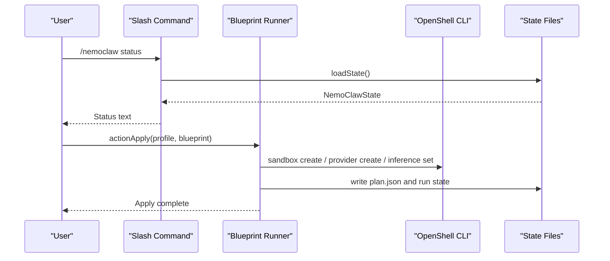
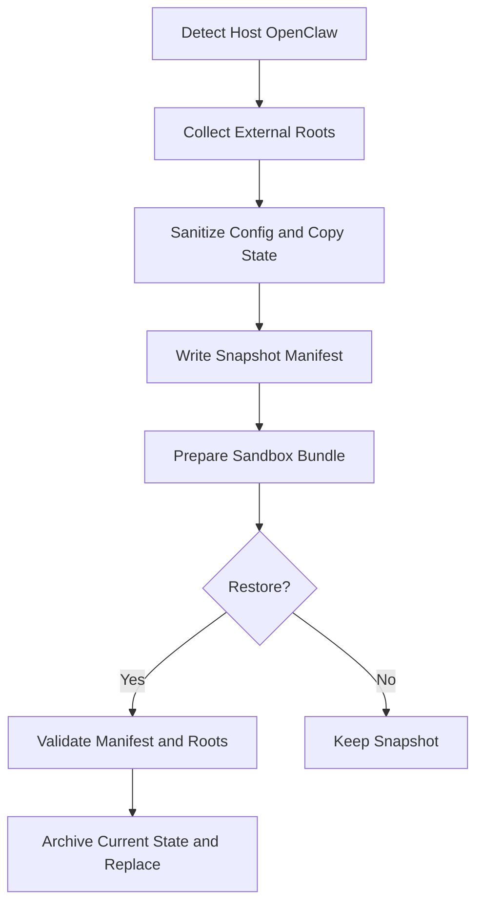
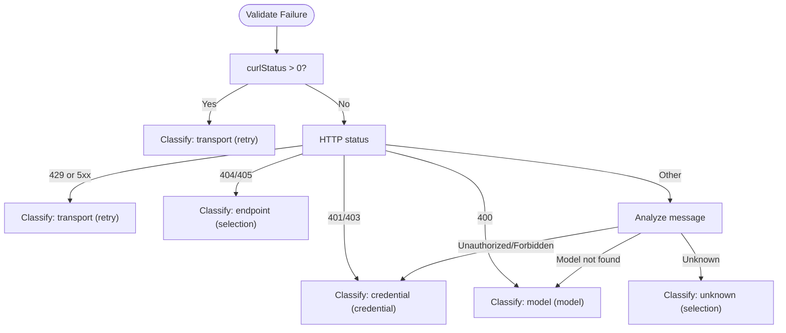
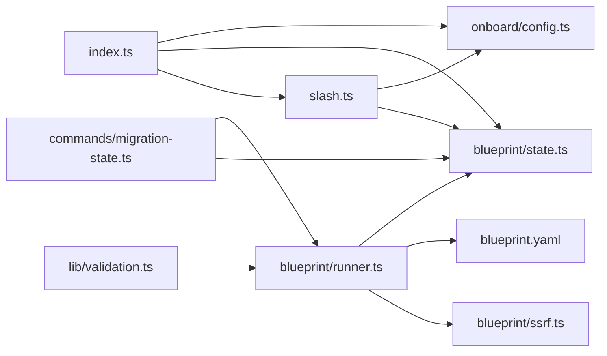

# OpenClaw Plugin API

<cite>
**Referenced Files in This Document**
- [index.ts](file://nemoclaw/src/index.ts)
- [slash.ts](file://nemoclaw/src/commands/slash.ts)
- [state.ts](file://nemoclaw/src/blueprint/state.ts)
- [runner.ts](file://nemoclaw/src/blueprint/runner.ts)
- [snapshot.ts](file://nemoclaw/src/blueprint/snapshot.ts)
- [migration-state.ts](file://nemoclaw/src/commands/migration-state.ts)
- [config.ts](file://nemoclaw/src/onboard/config.ts)
- [validation.ts](file://src/lib/validation.ts)
- [ssrf.ts](file://nemoclaw/src/blueprint/ssrf.ts)
- [blueprint.yaml](file://nemoclaw-blueprint/blueprint.yaml)
- [openclaw.plugin.json](file://nemoclaw/openclaw.plugin.json)
- [register.test.ts](file://nemoclaw/src/register.test.ts)
</cite>

## Table of Contents
1. [Introduction](#introduction)
2. [Project Structure](#project-structure)
3. [Core Components](#core-components)
4. [Architecture Overview](#architecture-overview)
5. [Detailed Component Analysis](#detailed-component-analysis)
6. [Dependency Analysis](#dependency-analysis)
7. [Performance Considerations](#performance-considerations)
8. [Security Considerations](#security-considerations)
9. [Troubleshooting Guide](#troubleshooting-guide)
10. [Conclusion](#conclusion)

## Introduction
This document describes the OpenClaw plugin API integrated into NemoClaw. It explains how the plugin registers slash commands, synchronizes state, manages providers and services, and coordinates with OpenShell and the blueprint system. It also documents plugin lifecycle management, configuration, validation, and security controls, and clarifies how OpenClaw commands relate to NemoClaw’s blueprint orchestration.

## Project Structure
The plugin surface area consists of:
- Plugin entry and API types
- Slash command handlers
- State persistence for plugin and blueprint runs
- Blueprint runner and snapshot/restore utilities
- Onboarding configuration and validation helpers
- Security controls for endpoint URLs and credential sanitization

**Diagram sources**
- [index.ts:237-266](file://nemoclaw/src/index.ts#L237-L266)
- [slash.ts:21-37](file://nemoclaw/src/commands/slash.ts#L21-L37)
- [state.ts:47-61](file://nemoclaw/src/blueprint/state.ts#L47-L61)
- [runner.ts:79-89](file://nemoclaw/src/blueprint/runner.ts#L79-L89)
- [snapshot.ts:57-79](file://nemoclaw/src/blueprint/snapshot.ts#L57-L79)
- [validation.ts:20-48](file://src/lib/validation.ts#L20-L48)
- [ssrf.ts:118-155](file://nemoclaw/src/blueprint/ssrf.ts#L118-L155)
- [blueprint.yaml:19-56](file://nemoclaw-blueprint/blueprint.yaml#L19-L56)
- [openclaw.plugin.json:1-33](file://nemoclaw/openclaw.plugin.json#L1-L33)

**Section sources**
- [index.ts:237-266](file://nemoclaw/src/index.ts#L237-L266)
- [openclaw.plugin.json:1-33](file://nemoclaw/openclaw.plugin.json#L1-L33)

## Core Components
- OpenClawPluginApi: The host-provided API injected into the plugin’s register function, exposing registration methods for commands, providers, and services, plus logging, configuration, and path resolution.
- PluginCommandDefinition: Defines a slash command with name, description, argument acceptance, optional auth requirement, and a handler function.
- ProviderPlugin: Registers a model provider with authentication method, model catalog, and environment variable exposure.
- PluginService: Registers background services with start/stop hooks.
- Slash Command Handlers: Implement command parsing and response generation for subcommands.
- State Management: Persist and load plugin and blueprint run state to disk.
- Blueprint Runner: Orchestrates sandbox lifecycle, validates endpoints, and writes run plans and state.
- Snapshot/Restore: Captures and restores host OpenClaw state for migration/cutover/rollback.
- Validation and Security: Classify failures, validate endpoints, sanitize credentials.

**Section sources**
- [index.ts:111-123](file://nemoclaw/src/index.ts#L111-L123)
- [index.ts:58-65](file://nemoclaw/src/index.ts#L58-L65)
- [index.ts:89-98](file://nemoclaw/src/index.ts#L89-L98)
- [index.ts:100-105](file://nemoclaw/src/index.ts#L100-L105)
- [slash.ts:21-37](file://nemoclaw/src/commands/slash.ts#L21-L37)
- [state.ts:47-61](file://nemoclaw/src/blueprint/state.ts#L47-L61)
- [runner.ts:167-210](file://nemoclaw/src/blueprint/runner.ts#L167-L210)
- [snapshot.ts:57-79](file://nemoclaw/src/blueprint/snapshot.ts#L57-L79)
- [validation.ts:20-48](file://src/lib/validation.ts#L20-L48)
- [ssrf.ts:118-155](file://nemoclaw/src/blueprint/ssrf.ts#L118-L155)

## Architecture Overview
The plugin integrates with OpenClaw via the OpenClawPluginApi. It registers:
- A slash command for user interaction
- A managed inference provider based on onboard configuration
- Optional background services

The slash command handler delegates to subcommand handlers that read state and onboard configuration to produce human-readable responses. The blueprint runner and snapshot utilities coordinate sandbox lifecycle and migration operations.

**Diagram sources**
- [index.ts:237-266](file://nemoclaw/src/index.ts#L237-L266)
- [slash.ts:21-37](file://nemoclaw/src/commands/slash.ts#L21-L37)
- [state.ts:47-54](file://nemoclaw/src/blueprint/state.ts#L47-L54)
- [config.ts:91-98](file://nemoclaw/src/onboard/config.ts#L91-L98)

## Detailed Component Analysis

### Plugin API Surface and Lifecycle
- Registration: The plugin registers a slash command and a provider during initialization. It logs a banner summarizing endpoint/provider/model and slash command availability.
- Configuration: Plugin-level configuration is read from the plugin manifest and merged into a typed configuration object with defaults.
- Services: The API supports registering background services with start/stop hooks.

**Diagram sources**
- [index.ts:111-123](file://nemoclaw/src/index.ts#L111-L123)
- [index.ts:58-65](file://nemoclaw/src/index.ts#L58-L65)
- [index.ts:89-98](file://nemoclaw/src/index.ts#L89-L98)
- [index.ts:100-105](file://nemoclaw/src/index.ts#L100-L105)

**Section sources**
- [index.ts:237-266](file://nemoclaw/src/index.ts#L237-L266)
- [openclaw.plugin.json:6-31](file://nemoclaw/openclaw.plugin.json#L6-L31)
- [register.test.ts:39-61](file://nemoclaw/src/register.test.ts#L39-L61)

### Slash Command Registration and Handlers
- Command: /nemoclaw with subcommands:
  - status: Reports last action, blueprint version, run ID, sandbox name, and optional rollback snapshot.
  - eject: Provides rollback instructions and snapshot/host backup path.
  - onboard: Summarizes onboard configuration and status.
  - default: Prints help text with usage and subcommands.
- Parsing: The handler splits arguments and dispatches to subcommand functions.

**Diagram sources**
- [slash.ts:21-37](file://nemoclaw/src/commands/slash.ts#L21-L37)
- [slash.ts:60-84](file://nemoclaw/src/commands/slash.ts#L60-L84)
- [slash.ts:120-146](file://nemoclaw/src/commands/slash.ts#L120-L146)
- [slash.ts:86-118](file://nemoclaw/src/commands/slash.ts#L86-L118)

**Section sources**
- [slash.ts:21-37](file://nemoclaw/src/commands/slash.ts#L21-L37)
- [slash.ts:60-84](file://nemoclaw/src/commands/slash.ts#L60-L84)
- [slash.ts:120-146](file://nemoclaw/src/commands/slash.ts#L120-L146)
- [slash.ts:86-118](file://nemoclaw/src/commands/slash.ts#L86-L118)

### State Synchronization Interfaces
- NemoClawState: Tracks last run ID, last action, blueprint version, sandbox name, migration snapshot, host backup path, and timestamps.
- Persistence: Ensures state directory exists, loads JSON state, saves updated state, and clears state by resetting to blank.
- Blueprint Runner: Emits run IDs, writes plan JSON, and persists run state under the user’s home directory.

**Diagram sources**
- [state.ts:9-18](file://nemoclaw/src/blueprint/state.ts#L9-L18)
- [state.ts:47-61](file://nemoclaw/src/blueprint/state.ts#L47-L61)
- [runner.ts:39-49](file://nemoclaw/src/blueprint/runner.ts#L39-L49)
- [runner.ts:167-210](file://nemoclaw/src/blueprint/runner.ts#L167-L210)

**Section sources**
- [state.ts:47-61](file://nemoclaw/src/blueprint/state.ts#L47-L61)
- [runner.ts:303-330](file://nemoclaw/src/blueprint/runner.ts#L303-L330)

### Provider and Model Catalog Registration
- ProviderPlugin: Declares provider identity, label, environment variables, model catalog, and authentication method.
- Authentication: Supports bearer token injection via environment variable with labeled header.
- Dynamic Models: Provider model entries can be customized based on onboard configuration.

**Diagram sources**
- [index.ts:89-98](file://nemoclaw/src/index.ts#L89-L98)
- [index.ts:67-73](file://nemoclaw/src/index.ts#L67-L73)
- [index.ts:83-87](file://nemoclaw/src/index.ts#L83-L87)
- [index.ts:75-81](file://nemoclaw/src/index.ts#L75-L81)

**Section sources**
- [index.ts:178-202](file://nemoclaw/src/index.ts#L178-L202)
- [index.ts:246-249](file://nemoclaw/src/index.ts#L246-L249)

### Blueprint Orchestration and Relationship to Commands
- Blueprint Schema: Defines sandbox image/name, inference profiles, and policy additions.
- Runner Actions: Plan, apply, status, and rollback actions coordinate with OpenShell and persist run state.
- Command Integration: The slash command status/eject rely on state loaded from the blueprint state module.

**Diagram sources**
- [slash.ts:60-84](file://nemoclaw/src/commands/slash.ts#L60-L84)
- [runner.ts:212-330](file://nemoclaw/src/blueprint/runner.ts#L212-L330)
- [state.ts:47-61](file://nemoclaw/src/blueprint/state.ts#L47-L61)

**Section sources**
- [blueprint.yaml:19-56](file://nemoclaw-blueprint/blueprint.yaml#L19-L56)
- [runner.ts:167-210](file://nemoclaw/src/blueprint/runner.ts#L167-L210)

### Migration State and Snapshot/Restore
- Snapshot Creation: Captures host OpenClaw state, sanitizes credentials, and prepares a sandbox-ready bundle.
- Restore Safety: Validates manifest fields, enforces containment within trusted host roots, and optionally verifies blueprint digest.
- Cutover/Rollback: Moves host state aside and replaces it with snapshot contents when restoring.

**Diagram sources**
- [migration-state.ts:376-477](file://nemoclaw/src/commands/migration-state.ts#L376-L477)
- [migration-state.ts:670-743](file://nemoclaw/src/commands/migration-state.ts#L670-L743)
- [migration-state.ts:772-912](file://nemoclaw/src/commands/migration-state.ts#L772-L912)

**Section sources**
- [migration-state.ts:376-477](file://nemoclaw/src/commands/migration-state.ts#L376-L477)
- [migration-state.ts:670-743](file://nemoclaw/src/commands/migration-state.ts#L670-L743)
- [migration-state.ts:772-912](file://nemoclaw/src/commands/migration-state.ts#L772-L912)

### Validation Patterns and Error Handling
- Failure Classification: HTTP status, curl status, and message heuristics classify failures into categories (transport, credential, model, endpoint, unknown) with retry guidance.
- Sandbox Creation Failures: Detects image transfer timeouts/reset and partial sandbox creation scenarios.
- Endpoint Validation: SSRF protection ensures URLs resolve to allowed schemes and not private/internal addresses.

**Diagram sources**
- [validation.ts:20-48](file://src/lib/validation.ts#L20-L48)
- [validation.ts:54-70](file://src/lib/validation.ts#L54-L70)

**Section sources**
- [validation.ts:20-48](file://src/lib/validation.ts#L20-L48)
- [validation.ts:54-70](file://src/lib/validation.ts#L54-L70)
- [ssrf.ts:118-155](file://nemoclaw/src/blueprint/ssrf.ts#L118-L155)

## Dependency Analysis
- Plugin entry depends on slash command handler, onboard configuration, and blueprint state.
- Slash command handler depends on blueprint state and onboard configuration.
- Runner depends on blueprint schema, SSRF validator, and OpenShell CLI.
- Migration utilities depend on filesystem operations and snapshot manifests.
- Validation helpers are standalone and used by runner and migration utilities.

**Diagram sources**
- [index.ts:14-19](file://nemoclaw/src/index.ts#L14-L19)
- [slash.ts:13-19](file://nemoclaw/src/commands/slash.ts#L13-L19)
- [runner.ts:23](file://nemoclaw/src/blueprint/runner.ts#L23)
- [blueprint.yaml:4-7](file://nemoclaw-blueprint/blueprint.yaml#L4-L7)

**Section sources**
- [index.ts:14-19](file://nemoclaw/src/index.ts#L14-L19)
- [slash.ts:13-19](file://nemoclaw/src/commands/slash.ts#L13-L19)
- [runner.ts:23](file://nemoclaw/src/blueprint/runner.ts#L23)

## Performance Considerations
- Prefer asynchronous operations for I/O-bound tasks (e.g., OpenShell invocations) to avoid blocking the plugin host.
- Minimize filesystem writes; batch state updates and write plan JSON only when necessary.
- Cache provider and onboard configuration results when repeatedly accessed within a single invocation.
- Avoid large tar archives during snapshot operations; compress selectively and follow symlinks carefully.

## Security Considerations
- Endpoint URL Validation: Enforce allowed schemes and disallow private/internal IP ranges to prevent SSRF.
- Credential Sanitization: Remove sensitive fields and files from snapshots and prepared bundles; inject credentials at runtime via provider mechanisms.
- Containment Checks: Validate manifest paths against trusted host roots and enforce exact matches when environment overrides are present.
- Blueprint Digest Verification: Ensure snapshot blueprint digest matches the current blueprint to prevent downgrade attacks.

**Section sources**
- [ssrf.ts:118-155](file://nemoclaw/src/blueprint/ssrf.ts#L118-L155)
- [migration-state.ts:480-550](file://nemoclaw/src/commands/migration-state.ts#L480-L550)
- [migration-state.ts:853-884](file://nemoclaw/src/commands/migration-state.ts#L853-L884)

## Troubleshooting Guide
- Slash command returns “no operations performed”: Ensure state file exists or run onboard first.
- Eject shows “no migration snapshot found”: Perform a snapshot or use manual rollback steps.
- Apply fails with transport errors: Check network connectivity and endpoint reachability.
- Apply fails with credential errors: Verify provider credentials and environment variables.
- Restore fails with blueprint digest mismatch: Re-run with the same blueprint used to create the snapshot.

**Section sources**
- [slash.ts:63-67](file://nemoclaw/src/commands/slash.ts#L63-L67)
- [slash.ts:127-131](file://nemoclaw/src/commands/slash.ts#L127-L131)
- [validation.ts:20-48](file://src/lib/validation.ts#L20-L48)
- [migration-state.ts:853-884](file://nemoclaw/src/commands/migration-state.ts#L853-L884)

## Conclusion
NemoClaw’s OpenClaw plugin integrates a concise command surface, robust state persistence, and secure blueprint orchestration. It registers a slash command, a managed inference provider, and leverages OpenShell to manage sandboxes and inference routes. The plugin’s design emphasizes safety through SSRF validation, credential sanitization, and strict containment checks, while offering clear pathways for status reporting, rollback, and migration.