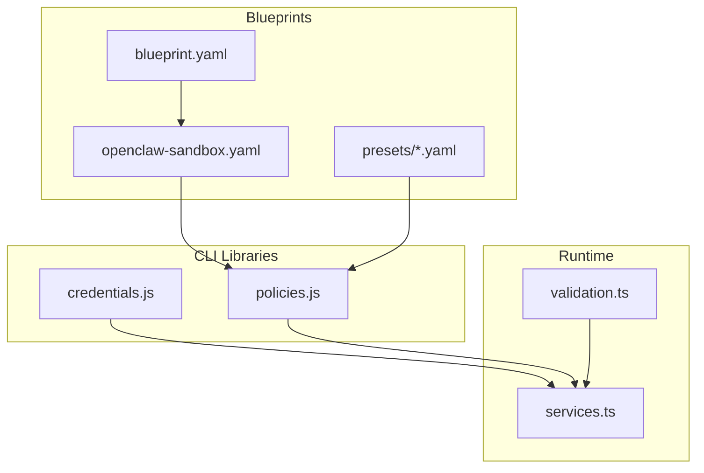
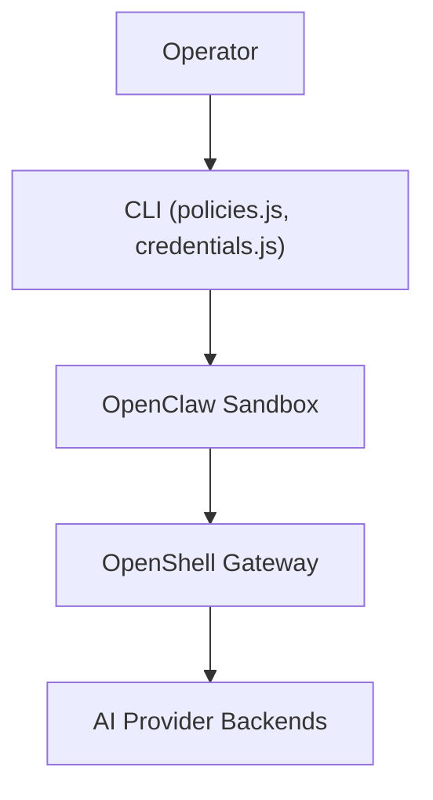
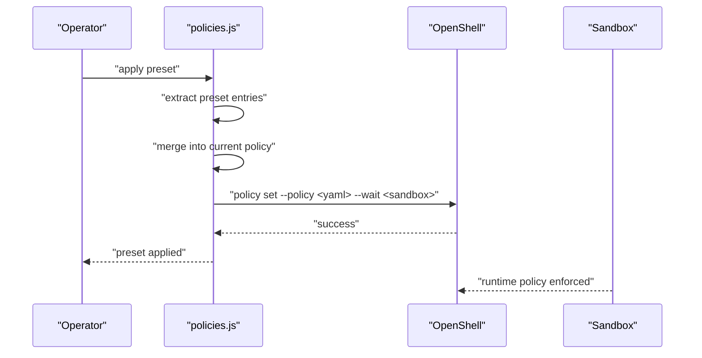
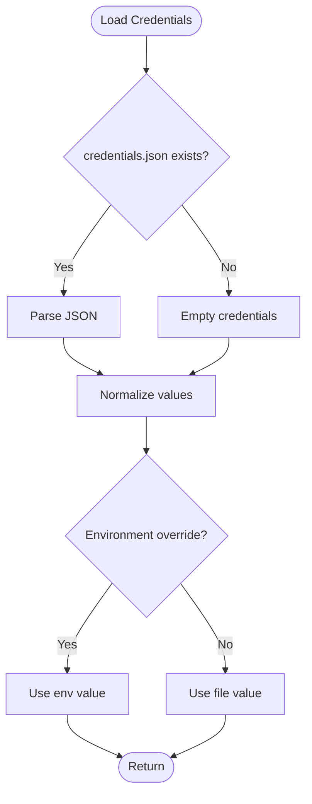
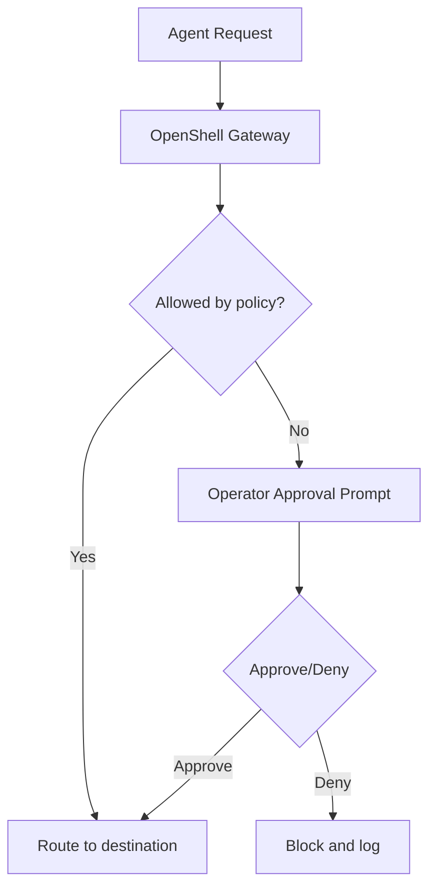
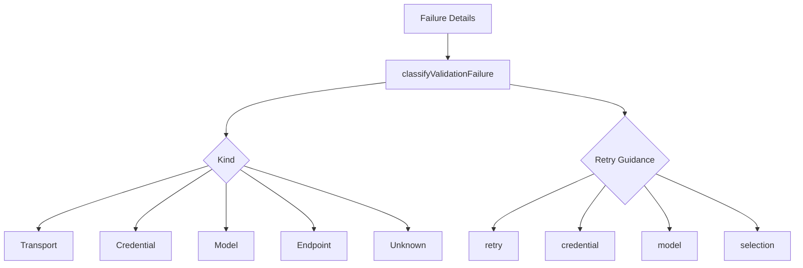
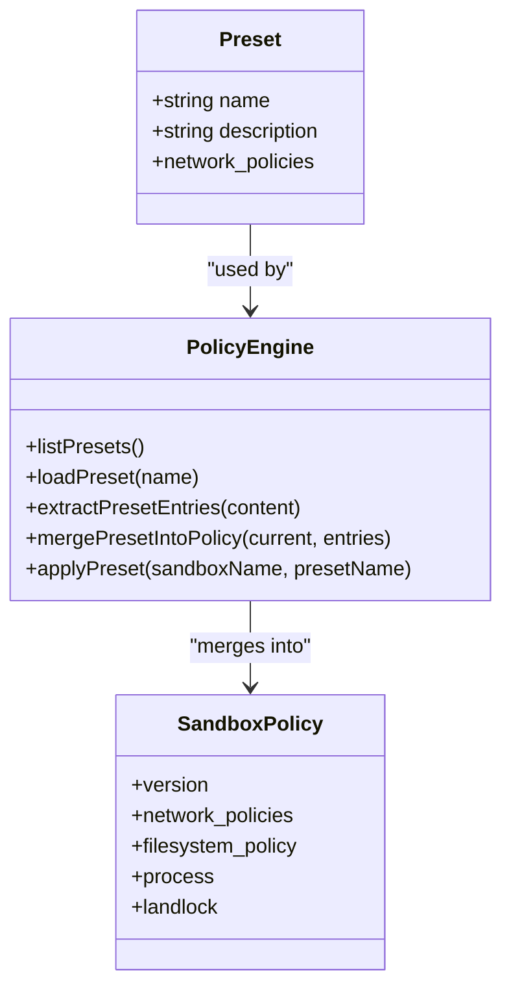
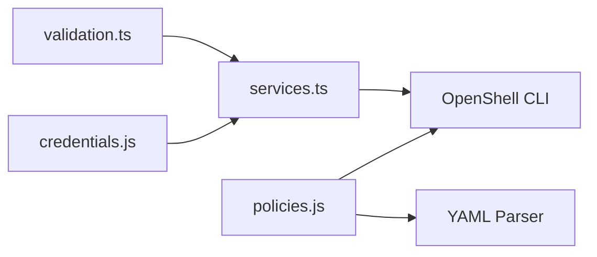

# Security Framework API

<cite>
**Referenced Files in This Document**
- [openclaw-sandbox.yaml](file://nemoclaw-blueprint/policies/openclaw-sandbox.yaml)
- [credentials.js](file://bin/lib/credentials.js)
- [policies.js](file://bin/lib/policies.js)
- [validation.ts](file://src/lib/validation.ts)
- [services.ts](file://src/lib/services.ts)
- [blueprint.yaml](file://nemoclaw-blueprint/blueprint.yaml)
- [brave.yaml](file://nemoclaw-blueprint/policies/presets/brave.yaml)
- [docker.yaml](file://nemoclaw-blueprint/policies/presets/docker.yaml)
- [best-practices.md](file://docs/security/best-practices.md)
- [how-it-works.md](file://docs/about/how-it-works.md)
- [network-policies.md](file://.agents/skills/nemoclaw-reference/references/network-policies.md)
- [security-c2-dockerfile-injection.test.js](file://test/security-c2-dockerfile-injection.test.js)
- [security-c4-manifest-traversal.test.js](file://test/security-c4-manifest-traversal.test.js)
- [security-method-wildcards.test.js](file://test/security-method-wildcards.test.js)
- [test-credential-sanitization.sh](file://test/e2e/test-credential-sanitization.sh)
- [migration-state.test.ts](file://nemoclaw/src/commands/migration-state.test.ts)
- [registry.js](file://bin/lib/registry.js)
</cite>

## Table of Contents
1. [Introduction](#introduction)
2. [Project Structure](#project-structure)
3. [Core Components](#core-components)
4. [Architecture Overview](#architecture-overview)
5. [Detailed Component Analysis](#detailed-component-analysis)
6. [Dependency Analysis](#dependency-analysis)
7. [Performance Considerations](#performance-considerations)
8. [Troubleshooting Guide](#troubleshooting-guide)
9. [Conclusion](#conclusion)
10. [Appendices](#appendices)

## Introduction
This document describes the Security Framework API that governs policy enforcement, credential handling, access control, and sandbox operations in the system. It covers:
- Policy enforcement interfaces for network, filesystem, process, and inference controls
- Credential protection and lifecycle management
- Landlock LSM and seccomp integration points
- Process isolation and security validation patterns
- Examples of custom policy implementation and operator-driven approvals
- Security audit interfaces, compliance validation, and threat detection mechanisms

## Project Structure
The security framework spans configuration blueprints, CLI libraries, runtime services, and validation utilities:
- Policy definitions and presets live under nemoclaw-blueprint/policies
- Credential and policy management are implemented in bin/lib
- Runtime services and sandbox orchestration are in src/lib
- Documentation and best practices guide enforcement behavior

**Diagram sources**
- [blueprint.yaml:1-66](file://nemoclaw-blueprint/blueprint.yaml#L1-L66)
- [openclaw-sandbox.yaml:1-219](file://nemoclaw-blueprint/policies/openclaw-sandbox.yaml#L1-L219)
- [brave.yaml:1-23](file://nemoclaw-blueprint/policies/presets/brave.yaml#L1-L23)
- [docker.yaml:1-46](file://nemoclaw-blueprint/policies/presets/docker.yaml#L1-L46)
- [credentials.js:1-328](file://bin/lib/credentials.js#L1-L328)
- [policies.js:1-353](file://bin/lib/policies.js#L1-L353)
- [services.ts:1-384](file://src/lib/services.ts#L1-L384)
- [validation.ts:1-85](file://src/lib/validation.ts#L1-L85)

**Section sources**
- [blueprint.yaml:1-66](file://nemoclaw-blueprint/blueprint.yaml#L1-L66)
- [openclaw-sandbox.yaml:1-219](file://nemoclaw-blueprint/policies/openclaw-sandbox.yaml#L1-L219)
- [credentials.js:1-328](file://bin/lib/credentials.js#L1-L328)
- [policies.js:1-353](file://bin/lib/policies.js#L1-L353)
- [services.ts:1-384](file://src/lib/services.ts#L1-L384)
- [validation.ts:1-85](file://src/lib/validation.ts#L1-L85)

## Core Components
- Policy engine: merges presets into the current sandbox policy and applies runtime updates via OpenShell
- Credential manager: securely stores, prompts for, and normalizes sensitive values
- Validation utilities: classifies failures and validates inputs for transport, credentials, models, and endpoints
- Runtime services: manages auxiliary services (cloudflared, Telegram bridge) and sandbox lifecycle
- Blueprints: define baseline images, inference profiles, and initial policy additions

Key responsibilities:
- Network policy management: deny-by-default with operator approval and REST rule enforcement
- Filesystem policy: read-only and read-write paths, Landlock LSM compatibility
- Process policy: user/group identity and capability drops
- Inference routing: controlled provider backends and runtime hot reload

**Section sources**
- [policies.js:220-285](file://bin/lib/policies.js#L220-L285)
- [credentials.js:58-91](file://bin/lib/credentials.js#L58-L91)
- [validation.ts:20-48](file://src/lib/validation.ts#L20-L48)
- [services.ts:107-192](file://src/lib/services.ts#L107-L192)
- [blueprint.yaml:26-66](file://nemoclaw-blueprint/blueprint.yaml#L26-L66)

## Architecture Overview
The security architecture enforces layered controls around the sandbox:
- Network: OpenShell gateway enforces baseline policy and inspects REST traffic
- Filesystem: Landlock LSM plus container mount restrictions
- Process: Runtime capability drops and user identity
- Inference: Controlled routing through OpenShell with hot-reloadable policy

**Diagram sources**
- [policies.js:220-285](file://bin/lib/policies.js#L220-L285)
- [openclaw-sandbox.yaml:46-219](file://nemoclaw-blueprint/policies/openclaw-sandbox.yaml#L46-L219)
- [how-it-works.md:123-143](file://docs/about/how-it-works.md#L123-L143)

**Section sources**
- [how-it-works.md:123-143](file://docs/about/how-it-works.md#L123-L143)
- [best-practices.md:95-135](file://docs/security/best-practices.md#L95-L135)

## Detailed Component Analysis

### Policy Enforcement Interfaces
- Network policies: deny-by-default baseline with explicit host/port/protocol rules and REST enforcement
- Filesystem policy: read-only and read-write paths; Landlock LSM compatibility
- Process policy: sandbox user/group identity
- Preset application: merges preset entries into current policy and applies via OpenShell

**Diagram sources**
- [policies.js:220-285](file://bin/lib/policies.js#L220-L285)
- [openclaw-sandbox.yaml:46-219](file://nemoclaw-blueprint/policies/openclaw-sandbox.yaml#L46-L219)

**Section sources**
- [policies.js:220-285](file://bin/lib/policies.js#L220-L285)
- [openclaw-sandbox.yaml:46-219](file://nemoclaw-blueprint/policies/openclaw-sandbox.yaml#L46-L219)

### Credential Handling and Protection
- Secure storage: credentials.json stored under ~/.nemoclaw with restrictive permissions
- Prompting: masked input for secrets; safe handling of TTY and signals
- Normalization: trimming and carriage return removal
- Environment precedence: process.env overrides stored credentials

**Diagram sources**
- [credentials.js:58-91](file://bin/lib/credentials.js#L58-L91)

**Section sources**
- [credentials.js:58-91](file://bin/lib/credentials.js#L58-L91)
- [test-credential-sanitization.sh:406-416](file://test/e2e/test-credential-sanitization.sh#L406-L416)

### Access Control Mechanisms
- Network egress: deny-by-default; operator approval for unknown destinations
- Filesystem: strict read-only/read-write rules; Landlock LSM best-effort enforcement
- Process: capability drops and sandbox user identity
- Inference: controlled routing through OpenShell with hot-reloadable policy

**Diagram sources**
- [openclaw-sandbox.yaml:133-147](file://nemoclaw-blueprint/policies/openclaw-sandbox.yaml#L133-L147)
- [best-practices.md:126-135](file://docs/security/best-practices.md#L126-L135)

**Section sources**
- [openclaw-sandbox.yaml:133-147](file://nemoclaw-blueprint/policies/openclaw-sandbox.yaml#L133-L147)
- [best-practices.md:126-135](file://docs/security/best-practices.md#L126-L135)

### Landlock LSM Integration
- Landlock policy: best-effort compatibility; default policy applies when supported
- Kernel requirement: recommended Linux 5.13+ for full enforcement
- Risk mitigation: on unsupported kernels, container mount restrictions serve as the primary filesystem control

**Section sources**
- [openclaw-sandbox.yaml:39-40](file://nemoclaw-blueprint/policies/openclaw-sandbox.yaml#L39-L40)
- [best-practices.md:258-267](file://docs/security/best-practices.md#L258-L267)

### seccomp Filtering Interfaces
- Additional process-level controls enforced by OpenShell include seccomp BPF socket domain filters and a specific enforcement application order
- Enforcement order: namespace entry, privilege drop, Landlock, seccomp

**Section sources**
- [best-practices.md:273-274](file://docs/security/best-practices.md#L273-L274)

### Process Isolation APIs
- Capability drops: entrypoint capability reduction using capsh
- User identity: sandbox user/group enforced at runtime
- Resource quotas: configured via container runtime securityContext

**Section sources**
- [best-practices.md:269-279](file://docs/security/best-practices.md#L269-L279)

### Security Validation Patterns
- Failure classification: transport, credential, model, endpoint, unknown with retry guidance
- Sandbox creation failure classification: image transfer timeouts/reset, partial creation
- Input validation: NVIDIA API key format, safe model ID regex

**Diagram sources**
- [validation.ts:20-52](file://src/lib/validation.ts#L20-L52)

**Section sources**
- [validation.ts:20-52](file://src/lib/validation.ts#L20-L52)

### Custom Policy Implementation Examples
- Preset structure: name, description, network_policies with endpoints and binaries
- Applying presets: load preset, extract entries, merge into current policy, write temp YAML, apply via OpenShell
- Baseline policy: deny-by-default with explicit allow-lists and REST rules

**Diagram sources**
- [policies.js:21-97](file://bin/lib/policies.js#L21-L97)
- [brave.yaml:4-23](file://nemoclaw-blueprint/policies/presets/brave.yaml#L4-L23)
- [docker.yaml:4-46](file://nemoclaw-blueprint/policies/presets/docker.yaml#L4-L46)

**Section sources**
- [policies.js:21-97](file://bin/lib/policies.js#L21-L97)
- [brave.yaml:4-23](file://nemoclaw-blueprint/policies/presets/brave.yaml#L4-L23)
- [docker.yaml:4-46](file://nemoclaw-blueprint/policies/presets/docker.yaml#L4-L46)

### Security Rule Configuration
- REST enforcement: protocol: rest with allow rules for method/path patterns
- Binary gating: restrict endpoints to specific binaries
- Method specificity: avoid wildcard methods; use explicit GET/POST
- TLS termination: enforce tls: terminate for REST endpoints

**Section sources**
- [openclaw-sandbox.yaml:52-73](file://nemoclaw-blueprint/policies/openclaw-sandbox.yaml#L52-L73)
- [openclaw-sandbox.yaml:82-95](file://nemoclaw-blueprint/policies/openclaw-sandbox.yaml#L82-L95)
- [openclaw-sandbox.yaml:124-144](file://nemoclaw-blueprint/policies/openclaw-sandbox.yaml#L124-L144)
- [security-method-wildcards.test.js:16-33](file://test/security-method-wildcards.test.js#L16-L33)

### Access Control Enforcement
- Operator approval: unknown destinations prompt operator in TUI; decisions persist per session
- Hot-reloadable network and inference policies via OpenShell
- Immutable gateway configuration: protected from agent tampering

**Section sources**
- [how-it-works.md:132-143](file://docs/about/how-it-works.md#L132-L143)
- [openclaw-sandbox.yaml:28-32](file://nemoclaw-blueprint/policies/openclaw-sandbox.yaml#L28-L32)

### Relationship Between Security Policies and Sandbox Operations
- Protection layers: network, filesystem, process, inference
- Runtime updates: network and inference policies hot-reloadable; filesystem/process locked at creation
- Inference routing: agent requests routed through OpenShell to provider backends

**Section sources**
- [best-practices.md:95-135](file://docs/security/best-practices.md#L95-L135)
- [how-it-works.md:125-131](file://docs/about/how-it-works.md#L125-L131)

### Security Audit Interfaces, Compliance Validation, and Threat Detection
- Audit vs enforce modes: OpenShell supports audit-vs-enforce modes for gradual policy rollout
- Compliance validation: ensure presets include binaries sections, method wildcards disallowed, and credential fields sanitized
- Threat detection: runtime monitoring via OpenShell TUI; credential sanitization tests detect leaks

**Section sources**
- [best-practices.md:126-131](file://docs/security/best-practices.md#L126-L131)
- [security-c2-dockerfile-injection.test.js:135-301](file://test/security-c2-dockerfile-injection.test.js#L135-L301)
- [security-c4-manifest-traversal.test.js:412-446](file://test/security-c4-manifest-traversal.test.js#L412-L446)
- [test-credential-sanitization.sh:602-805](file://test/e2e/test-credential-sanitization.sh#L602-L805)

## Dependency Analysis
The security framework components depend on each other as follows:
- policies.js depends on OpenShell CLI and YAML parsing to manage policy merges and applications
- credentials.js provides secure storage and retrieval used by services and CLI flows
- validation.ts classifies failures to guide retries and remediation
- services.ts coordinates auxiliary services and sandbox readiness

**Diagram sources**
- [policies.js:10-19](file://bin/lib/policies.js#L10-L19)
- [credentials.js:1-10](file://bin/lib/credentials.js#L1-L10)
- [services.ts:265-274](file://src/lib/services.ts#L265-L274)

**Section sources**
- [policies.js:10-19](file://bin/lib/policies.js#L10-L19)
- [credentials.js:1-10](file://bin/lib/credentials.js#L1-L10)
- [services.ts:265-274](file://src/lib/services.ts#L265-L274)

## Performance Considerations
- Policy merges: structured YAML parsing preferred; falls back to text-based merge for backward compatibility
- Credential storage: minimal I/O; cached in memory per process lifecycle
- Service lifecycle: detached processes with file logging; PID management for robust status reporting

[No sources needed since this section provides general guidance]

## Troubleshooting Guide
Common issues and resolutions:
- Credential leaks: verify credentials.json permissions and absence of secrets inside sandbox; confirm sanitizer patterns
- Policy application failures: check sandbox name validity and OpenShell availability; validate preset entries and YAML structure
- Path traversal in snapshots: ensure manifest fields are validated against trusted roots
- Dockerfile injection: confirm environment variables are used instead of string interpolation in RUN layers

**Section sources**
- [test-credential-sanitization.sh:406-416](file://test/e2e/test-credential-sanitization.sh#L406-L416)
- [policies.js:220-285](file://bin/lib/policies.js#L220-L285)
- [security-c4-manifest-traversal.test.js:412-446](file://test/security-c4-manifest-traversal.test.js#L412-L446)
- [security-c2-dockerfile-injection.test.js:135-301](file://test/security-c2-dockerfile-injection.test.js#L135-L301)

## Conclusion
The Security Framework API integrates policy enforcement, credential protection, and runtime controls to isolate agents and limit attack surface. Operators can tailor policies via presets and approvals, while Landlock and seccomp provide kernel-level protections. Validation utilities and tests ensure robustness and compliance.

[No sources needed since this section summarizes without analyzing specific files]

## Appendices

### Appendix A: Policy Application Workflow
- Load preset and extract network_policies entries
- Merge into current policy using structured YAML when possible
- Write temporary YAML with restrictive permissions
- Apply via OpenShell policy set and update registry

**Section sources**
- [policies.js:220-285](file://bin/lib/policies.js#L220-L285)
- [registry.js:275-282](file://bin/lib/registry.js#L275-L282)

### Appendix B: Credential Lifecycle
- Prompt for secrets with masked input
- Save to credentials.json with mode 600
- Load from file or environment with normalization
- Strip sensitive fields during migration

**Section sources**
- [credentials.js:93-172](file://bin/lib/credentials.js#L93-L172)
- [migration-state.test.ts:609-629](file://nemoclaw/src/commands/migration-state.test.ts#L609-L629)