# Advanced Topics

<cite>
**Referenced Files in This Document**
- [openclaw.plugin.json](file://nemoclaw/openclaw.plugin.json)
- [blueprint.yaml](file://nemoclaw-blueprint/blueprint.yaml)
- [index.ts](file://nemoclaw/src/index.ts)
- [register.test.ts](file://nemoclaw/src/register.test.ts)
- [services.ts](file://src/lib/services.ts)
- [inference-config.ts](file://src/lib/inference-config.ts)
- [validation.ts](file://src/lib/validation.ts)
- [openclaw-sandbox.yaml](file://nemoclaw-blueprint/policies/openclaw-sandbox.yaml)
- [state.ts](file://nemoclaw/src/blueprint/state.ts)
- [snapshot.ts](file://nemoclaw/src/blueprint/snapshot.ts)
- [ssrf.ts](file://nemoclaw/src/blueprint/ssrf.ts)
- [preflight.ts](file://src/lib/preflight.ts)
- [onboard-session.ts](file://src/lib/onboard-session.ts)
- [dashboard.ts](file://src/lib/dashboard.ts)
- [runtime-recovery.ts](file://src/lib/runtime-recovery.ts)
</cite>

## Table of Contents
1. [Introduction](#introduction)
2. [Project Structure](#project-structure)
3. [Core Components](#core-components)
4. [Architecture Overview](#architecture-overview)
5. [Detailed Component Analysis](#detailed-component-analysis)
6. [Dependency Analysis](#dependency-analysis)
7. [Performance Considerations](#performance-considerations)
8. [Troubleshooting Guide](#troubleshooting-guide)
9. [Conclusion](#conclusion)
10. [Appendices](#appendices)

## Introduction
This document targets advanced users who need to deeply customize and extend NemoClaw. It focuses on expert-level capabilities: custom blueprint development, advanced YAML configuration, component composition, state management customization, provider plugin extension, custom inference provider integration, routing logic customization, policy customization, advanced network rule configuration, security framework extensions, developing custom OpenClaw plugins, integrating with external systems, building specialized agent workflows, performance optimization, enterprise deployment patterns, advanced troubleshooting, security hardening, and infrastructure integration.

## Project Structure
NemoClaw is organized around:
- An OpenClaw plugin that registers commands, providers, and services.
- A blueprint that defines sandbox, inference profiles, and policies.
- Supporting libraries for service lifecycle, inference routing, validation, SSRF protection, preflight checks, session management, dashboard URL handling, and runtime recovery.

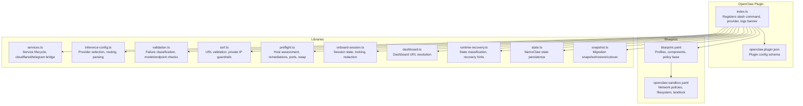

**Diagram sources**
- [index.ts:237-265](file://nemoclaw/src/index.ts#L237-L265)
- [openclaw.plugin.json:1-33](file://nemoclaw/openclaw.plugin.json#L1-L33)
- [blueprint.yaml:1-66](file://nemoclaw-blueprint/blueprint.yaml#L1-L66)
- [openclaw-sandbox.yaml:1-219](file://nemoclaw-blueprint/policies/openclaw-sandbox.yaml#L1-L219)
- [services.ts:104-366](file://src/lib/services.ts#L104-L366)
- [inference-config.ts:26-150](file://src/lib/inference-config.ts#L26-L150)
- [validation.ts:10-85](file://src/lib/validation.ts#L10-L85)
- [ssrf.ts:118-156](file://nemoclaw/src/blueprint/ssrf.ts#L118-L156)
- [preflight.ts:238-419](file://src/lib/preflight.ts#L238-L419)
- [onboard-session.ts:175-290](file://src/lib/onboard-session.ts#L175-L290)
- [dashboard.ts:13-40](file://src/lib/dashboard.ts#L13-L40)
- [runtime-recovery.ts:20-91](file://src/lib/runtime-recovery.ts#L20-L91)
- [state.ts:47-70](file://nemoclaw/src/blueprint/state.ts#L47-L70)
- [snapshot.ts:57-177](file://nemoclaw/src/blueprint/snapshot.ts#L57-L177)

**Section sources**
- [index.ts:14-265](file://nemoclaw/src/index.ts#L14-L265)
- [openclaw.plugin.json:1-33](file://nemoclaw/openclaw.plugin.json#L1-L33)
- [blueprint.yaml:1-66](file://nemoclaw-blueprint/blueprint.yaml#L1-L66)
- [openclaw-sandbox.yaml:1-219](file://nemoclaw-blueprint/policies/openclaw-sandbox.yaml#L1-L219)
- [services.ts:104-366](file://src/lib/services.ts#L104-L366)
- [inference-config.ts:26-150](file://src/lib/inference-config.ts#L26-L150)
- [validation.ts:10-85](file://src/lib/validation.ts#L10-L85)
- [ssrf.ts:118-156](file://nemoclaw/src/blueprint/ssrf.ts#L118-L156)
- [preflight.ts:238-419](file://src/lib/preflight.ts#L238-L419)
- [onboard-session.ts:175-290](file://src/lib/onboard-session.ts#L175-L290)
- [dashboard.ts:13-40](file://src/lib/dashboard.ts#L13-L40)
- [runtime-recovery.ts:20-91](file://src/lib/runtime-recovery.ts#L20-L91)
- [state.ts:47-70](file://nemoclaw/src/blueprint/state.ts#L47-L70)
- [snapshot.ts:57-177](file://nemoclaw/src/blueprint/snapshot.ts#L57-L177)

## Core Components
- OpenClaw plugin registration and provider definition:
  - Registers a slash command and a managed inference provider with model catalogs and authentication metadata.
  - Reads plugin configuration from the plugin manifest and merges with defaults.
- Blueprint orchestration:
  - Defines sandbox image, port forwarding, inference profiles, and policy base.
  - Supports multiple provider profiles (NVIDIA Endpoints, NIM local, vLLM local).
- Policy and network security:
  - Deny-by-default sandbox policy with granular endpoint rules, TLS termination, and binary allowances.
  - Extensible additions appended via blueprint policy additions.
- Service lifecycle:
  - Manages cloudflared tunnel and Telegram bridge with PID tracking, logging, and graceful shutdown.
- Inference routing and parsing:
  - Provider selection logic, route profiles, credential environment defaults, and gateway output parsing.
- Validation and SSRF protection:
  - Failure classification for transport, credentials, model, and endpoint issues.
  - URL validation with scheme and private IP checks.
- Preflight and session management:
  - Host assessment, remediation planning, port probing, memory/swap management.
  - Onboarding session with step tracking, locking, and sensitive data redaction.
- State and migration:
  - Persistent NemoClaw state and migration snapshot/restore/cutover/rollback.
- Dashboard and recovery:
  - Dashboard URL resolution and runtime recovery classification.

**Section sources**
- [index.ts:14-265](file://nemoclaw/src/index.ts#L14-L265)
- [blueprint.yaml:19-66](file://nemoclaw-blueprint/blueprint.yaml#L19-L66)
- [openclaw-sandbox.yaml:46-219](file://nemoclaw-blueprint/policies/openclaw-sandbox.yaml#L46-L219)
- [services.ts:104-366](file://src/lib/services.ts#L104-L366)
- [inference-config.ts:26-150](file://src/lib/inference-config.ts#L26-L150)
- [validation.ts:20-85](file://src/lib/validation.ts#L20-L85)
- [ssrf.ts:118-156](file://nemoclaw/src/blueprint/ssrf.ts#L118-L156)
- [preflight.ts:238-754](file://src/lib/preflight.ts#L238-L754)
- [onboard-session.ts:175-531](file://src/lib/onboard-session.ts#L175-L531)
- [state.ts:47-70](file://nemoclaw/src/blueprint/state.ts#L47-L70)
- [snapshot.ts:57-177](file://nemoclaw/src/blueprint/snapshot.ts#L57-L177)
- [dashboard.ts:13-40](file://src/lib/dashboard.ts#L13-L40)
- [runtime-recovery.ts:20-91](file://src/lib/runtime-recovery.ts#L20-L91)

## Architecture Overview
High-level flow of plugin registration, provider setup, and service orchestration.

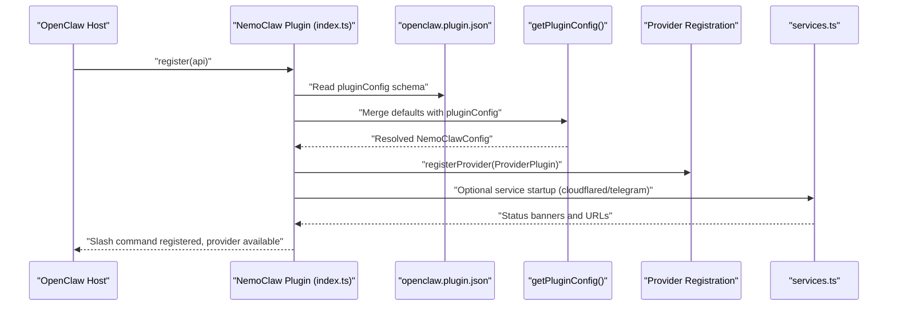

**Diagram sources**
- [index.ts:237-265](file://nemoclaw/src/index.ts#L237-L265)
- [openclaw.plugin.json:6-31](file://nemoclaw/openclaw.plugin.json#L6-L31)
- [services.ts:249-366](file://src/lib/services.ts#L249-L366)

**Section sources**
- [index.ts:237-265](file://nemoclaw/src/index.ts#L237-L265)
- [openclaw.plugin.json:6-31](file://nemoclaw/openclaw.plugin.json#L6-L31)
- [services.ts:249-366](file://src/lib/services.ts#L249-L366)

## Detailed Component Analysis

### Custom Blueprint Development
- Profiles and components:
  - Sandbox image, name, and forwarded ports.
  - Inference profiles with provider type, endpoint, model, credential environment, and dynamic endpoint toggles.
- Policy base and additions:
  - Base policy file path and additions appended at runtime.
- Advanced YAML configuration:
  - Use profiles to switch between NVIDIA Endpoints, NCP, NIM local, and vLLM local.
  - Add endpoints to policy additions for service integrations (e.g., local NIM service).

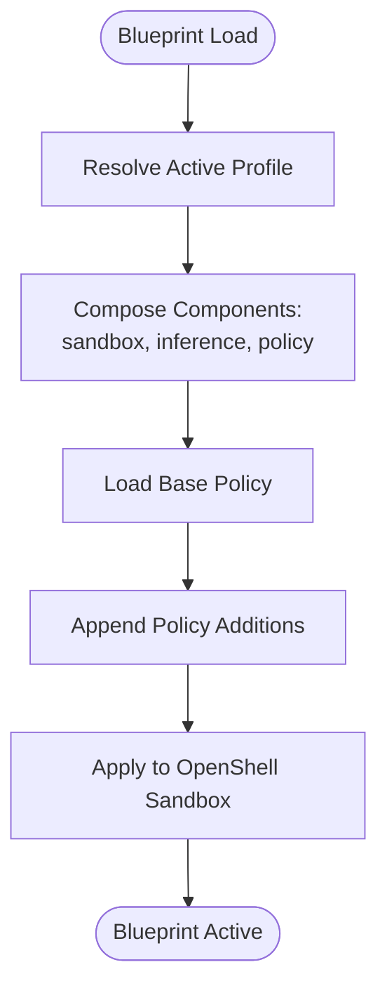

**Diagram sources**
- [blueprint.yaml:9-66](file://nemoclaw-blueprint/blueprint.yaml#L9-L66)
- [openclaw-sandbox.yaml:16-219](file://nemoclaw-blueprint/policies/openclaw-sandbox.yaml#L16-L219)

**Section sources**
- [blueprint.yaml:9-66](file://nemoclaw-blueprint/blueprint.yaml#L9-L66)
- [openclaw-sandbox.yaml:16-219](file://nemoclaw-blueprint/policies/openclaw-sandbox.yaml#L16-L219)

### Provider Plugin Extension Mechanisms
- Provider registration:
  - ProviderPlugin shape includes id, label, envVars, models catalog, and auth method.
  - Auth method supports bearer token via environment variable.
- Managed inference provider:
  - Provider id "inference" with alias "inference-local".
  - Dynamically builds model entries from onboard configuration.
- Plugin configuration:
  - getPluginConfig merges raw pluginConfig with defaults for blueprint version, registry, sandbox name, and inference provider.

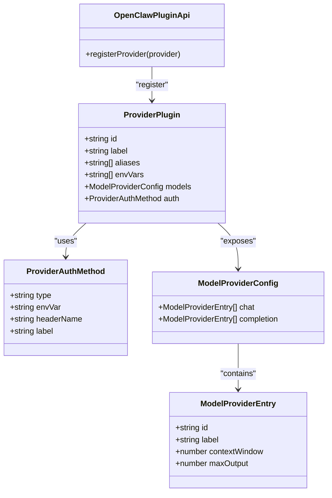

**Diagram sources**
- [index.ts:89-98](file://nemoclaw/src/index.ts#L89-L98)
- [index.ts:67-73](file://nemoclaw/src/index.ts#L67-L73)
- [index.ts:83-87](file://nemoclaw/src/index.ts#L83-L87)
- [index.ts:178-202](file://nemoclaw/src/index.ts#L178-L202)

**Section sources**
- [index.ts:89-202](file://nemoclaw/src/index.ts#L89-L202)
- [register.test.ts:39-80](file://nemoclaw/src/register.test.ts#L39-L80)

### Custom Inference Provider Integration and Routing Logic
- Provider selection:
  - getProviderSelectionConfig maps provider identifiers to endpoint type, URL, model defaults, credential environment, and provider label.
- Primary model resolution:
  - getOpenClawPrimaryModel constructs managed provider/model identifiers.
- Gateway output parsing:
  - parseGatewayInference extracts provider and model from structured gateway output.

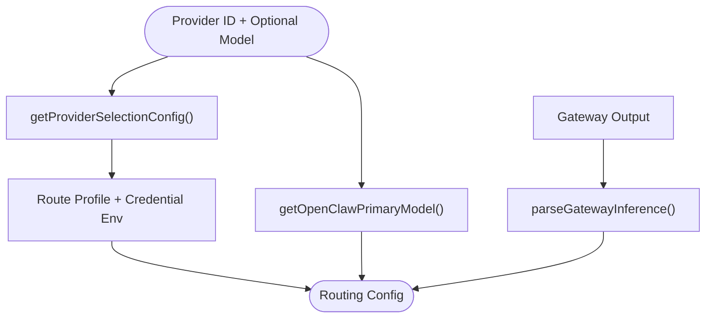

**Diagram sources**
- [inference-config.ts:42-121](file://src/lib/inference-config.ts#L42-L121)
- [inference-config.ts:123-150](file://src/lib/inference-config.ts#L123-L150)

**Section sources**
- [inference-config.ts:26-150](file://src/lib/inference-config.ts#L26-L150)

### Policy Customization and Network Rule Configuration
- Default deny-by-default sandbox policy:
  - Read-only and read-write filesystem paths, process user/group, and landlock compatibility.
- Endpoint rules:
  - Protocol, enforcement, TLS termination, and method/path allowlists per endpoint group.
  - Binary allowances for specific executables.
- Dynamic additions:
  - Policy additions appended via blueprint to allow local services (e.g., NIM service).

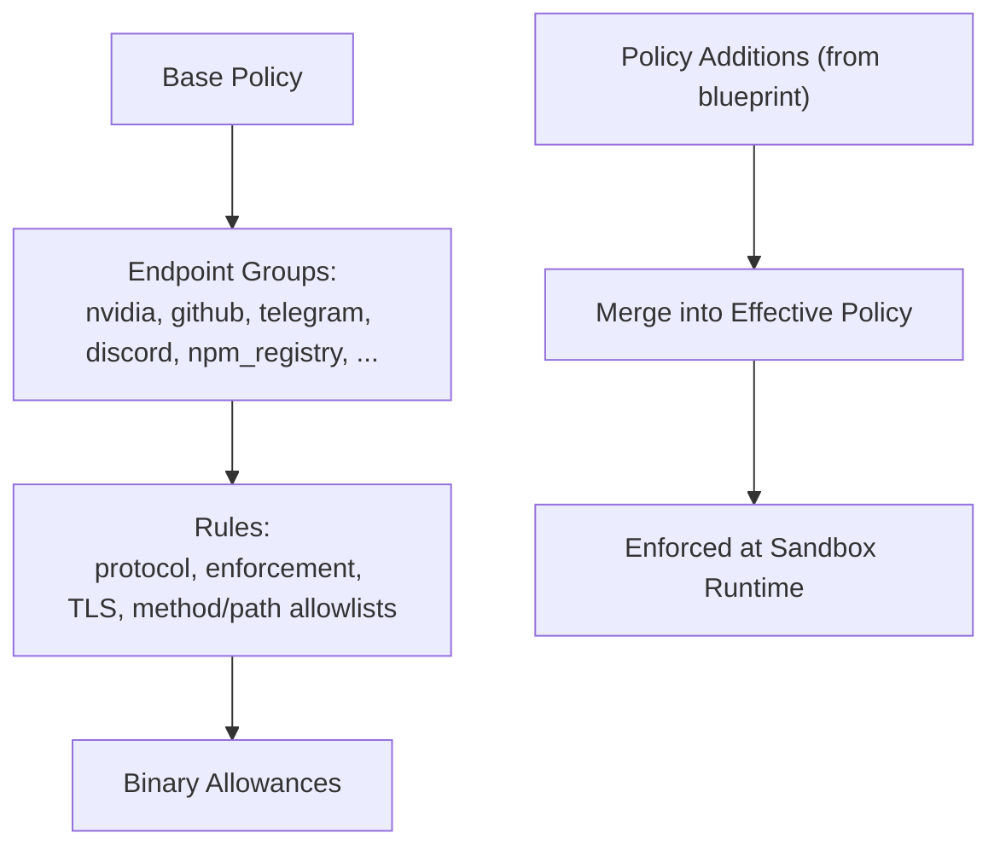

**Diagram sources**
- [openclaw-sandbox.yaml:18-219](file://nemoclaw-blueprint/policies/openclaw-sandbox.yaml#L18-L219)

**Section sources**
- [openclaw-sandbox.yaml:18-219](file://nemoclaw-blueprint/policies/openclaw-sandbox.yaml#L18-L219)

### Security Framework Extensions (SSRF Protection and Validation)
- URL validation:
  - validateEndpointUrl enforces allowed schemes and rejects private/internal addresses.
- Failure classification:
  - classifyValidationFailure maps HTTP statuses and messages to categories and retry strategies.
- Sandbox creation failure classification:
  - classifySandboxCreateFailure interprets gateway output to diagnose image transfer and sandbox creation issues.

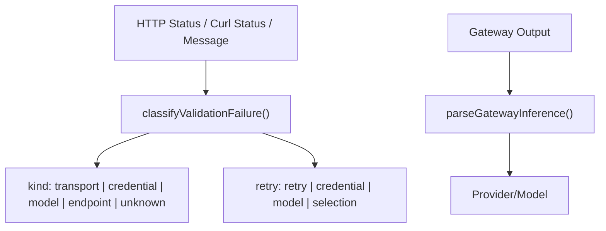

**Diagram sources**
- [ssrf.ts:118-156](file://nemoclaw/src/blueprint/ssrf.ts#L118-L156)
- [validation.ts:20-70](file://src/lib/validation.ts#L20-L70)
- [inference-config.ts:123-150](file://src/lib/inference-config.ts#L123-L150)

**Section sources**
- [ssrf.ts:118-156](file://nemoclaw/src/blueprint/ssrf.ts#L118-L156)
- [validation.ts:20-70](file://src/lib/validation.ts#L20-L70)
- [inference-config.ts:123-150](file://src/lib/inference-config.ts#L123-L150)

### State Management Customization
- NemoClaw state persistence:
  - loadState/saveState/clearState manage a JSON state file with timestamps and migration metadata.
- Migration snapshot/restore/cutover/rollback:
  - createSnapshot collects OpenClaw files, writes manifest, restores into sandbox, cutover renames host config, rollback restores from snapshot.

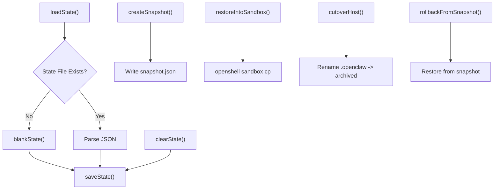

**Diagram sources**
- [state.ts:47-70](file://nemoclaw/src/blueprint/state.ts#L47-L70)
- [snapshot.ts:57-177](file://nemoclaw/src/blueprint/snapshot.ts#L57-L177)

**Section sources**
- [state.ts:47-70](file://nemoclaw/src/blueprint/state.ts#L47-L70)
- [snapshot.ts:57-177](file://nemoclaw/src/blueprint/snapshot.ts#L57-L177)

### Enterprise Deployment Patterns and Service Orchestration
- Service lifecycle:
  - startAll/startService/stopAll/stopService manage detached processes, PID files, and log redirection.
  - Environment-dependent behavior (e.g., WSL IPv4-first DNS).
- Dashboard and tunneling:
  - resolveDashboardForwardTarget/buildControlUiUrls construct dashboard URLs and tunnel targets.
- Recovery:
  - classifySandboxLookup/classifyGatewayStatus determine recovery readiness and suggest nemoclaw onboard --resume or full onboarding.

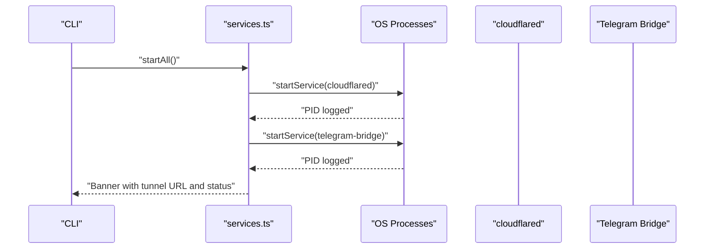

**Diagram sources**
- [services.ts:249-366](file://src/lib/services.ts#L249-L366)
- [dashboard.ts:13-40](file://src/lib/dashboard.ts#L13-L40)
- [runtime-recovery.ts:41-91](file://src/lib/runtime-recovery.ts#L41-L91)

**Section sources**
- [services.ts:104-366](file://src/lib/services.ts#L104-L366)
- [dashboard.ts:13-40](file://src/lib/dashboard.ts#L13-L40)
- [runtime-recovery.ts:41-91](file://src/lib/runtime-recovery.ts#L41-L91)

### Advanced Troubleshooting Procedures
- Preflight checks:
  - assessHost evaluates platform, container runtime, Docker/systemctl state, GPU presence, headless likelihood.
  - planHostRemediation suggests manual/auto/sudo remediations.
  - checkPortAvailable/probePortAvailability detect conflicts and ownership.
  - ensureSwap manages swap creation for Linux.
- Session management:
  - acquireOnboardLock/releaseOnboardLock coordinate onboarding sessions.
  - markStepStarted/markStepComplete/markStepFailed update step state and failures.
- Runtime recovery:
  - classifySandboxLookup/classifyGatewayStatus guide recovery decisions.

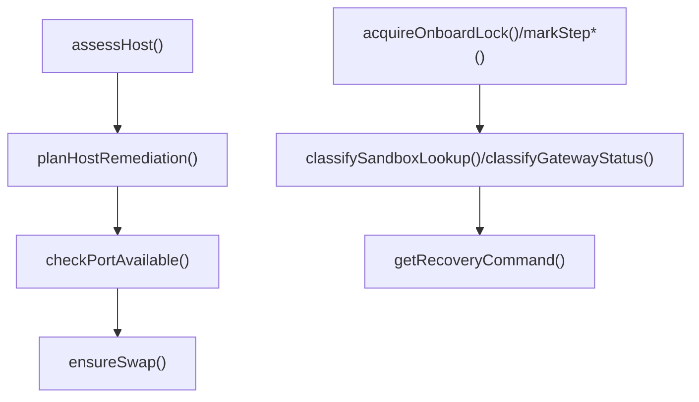

**Diagram sources**
- [preflight.ts:238-754](file://src/lib/preflight.ts#L238-L754)
- [onboard-session.ts:328-401](file://src/lib/onboard-session.ts#L328-L401)
- [runtime-recovery.ts:41-91](file://src/lib/runtime-recovery.ts#L41-L91)

**Section sources**
- [preflight.ts:238-754](file://src/lib/preflight.ts#L238-L754)
- [onboard-session.ts:328-401](file://src/lib/onboard-session.ts#L328-L401)
- [runtime-recovery.ts:41-91](file://src/lib/runtime-recovery.ts#L41-L91)

## Dependency Analysis
Key dependencies and coupling:
- Plugin depends on:
  - Plugin manifest schema for configuration.
  - Onboard configuration for provider model and credential environment.
  - Services for optional bridging and tunneling.
  - Inference configuration for routing and model resolution.
  - Validation and SSRF utilities for safety.
  - Preflight and session management for robust onboarding.
  - State and snapshot utilities for migration workflows.
  - Dashboard utilities for URL exposure.

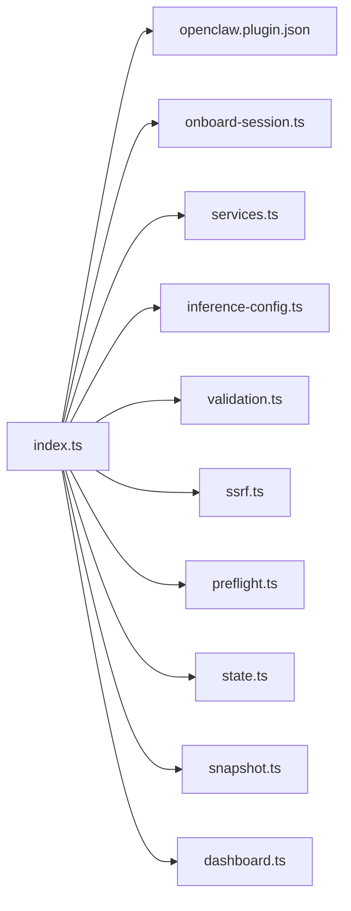

**Diagram sources**
- [index.ts:14-265](file://nemoclaw/src/index.ts#L14-L265)
- [openclaw.plugin.json:1-33](file://nemoclaw/openclaw.plugin.json#L1-L33)
- [services.ts:104-366](file://src/lib/services.ts#L104-L366)
- [inference-config.ts:26-150](file://src/lib/inference-config.ts#L26-L150)
- [validation.ts:20-85](file://src/lib/validation.ts#L20-L85)
- [ssrf.ts:118-156](file://nemoclaw/src/blueprint/ssrf.ts#L118-L156)
- [preflight.ts:238-754](file://src/lib/preflight.ts#L238-L754)
- [onboard-session.ts:175-531](file://src/lib/onboard-session.ts#L175-L531)
- [state.ts:47-70](file://nemoclaw/src/blueprint/state.ts#L47-L70)
- [snapshot.ts:57-177](file://nemoclaw/src/blueprint/snapshot.ts#L57-L177)
- [dashboard.ts:13-40](file://src/lib/dashboard.ts#L13-L40)

**Section sources**
- [index.ts:14-265](file://nemoclaw/src/index.ts#L14-L265)
- [openclaw.plugin.json:1-33](file://nemoclaw/openclaw.plugin.json#L1-L33)
- [services.ts:104-366](file://src/lib/services.ts#L104-L366)
- [inference-config.ts:26-150](file://src/lib/inference-config.ts#L26-L150)
- [validation.ts:20-85](file://src/lib/validation.ts#L20-L85)
- [ssrf.ts:118-156](file://nemoclaw/src/blueprint/ssrf.ts#L118-L156)
- [preflight.ts:238-754](file://src/lib/preflight.ts#L238-L754)
- [onboard-session.ts:175-531](file://src/lib/onboard-session.ts#L175-L531)
- [state.ts:47-70](file://nemoclaw/src/blueprint/state.ts#L47-L70)
- [snapshot.ts:57-177](file://nemoclaw/src/blueprint/snapshot.ts#L57-L177)
- [dashboard.ts:13-40](file://src/lib/dashboard.ts#L13-L40)

## Performance Considerations
- Service lifecycle:
  - Detach child processes and redirect logs to minimize overhead.
  - Busy-wait polling with short intervals during stop sequences.
- Preflight:
  - Prefer lsof for precise port conflict detection; fall back to net probe for portability.
  - Swap management avoids OOM during large image pushes on constrained hosts.
- Dashboard:
  - Forward target resolution optimizes loopback vs. external exposure.

[No sources needed since this section provides general guidance]

## Troubleshooting Guide
- Port conflicts:
  - Use checkPortAvailable to identify owning process and PID; resolve conflicts before starting services.
- Docker/runtime issues:
  - assessHost and planHostRemediation provide actionable remediations for Docker reachability and runtime support.
- Swap and memory:
  - ensureSwap creates a 4 GB swap file when total memory is below threshold.
- Session contention:
  - acquireOnboardLock ensures exclusive onboarding; releaseOnboardLock cleans stale locks.
- Gateway and sandbox state:
  - classifySandboxLookup/classifyGatewayStatus determine whether recovery is needed; getRecoveryCommand suggests resume or full onboarding.

**Section sources**
- [preflight.ts:482-537](file://src/lib/preflight.ts#L482-L537)
- [preflight.ts:698-754](file://src/lib/preflight.ts#L698-L754)
- [onboard-session.ts:328-401](file://src/lib/onboard-session.ts#L328-L401)
- [runtime-recovery.ts:41-91](file://src/lib/runtime-recovery.ts#L41-L91)

## Conclusion
NemoClaw exposes a comprehensive set of extension points for advanced customization: blueprint profiles and policies, provider registration, inference routing, security safeguards, service orchestration, state and migration, and robust preflight and recovery mechanisms. By leveraging these components, enterprises can tailor sandbox behavior, integrate custom inference providers, harden network policies, and operate reliably across diverse infrastructures.

[No sources needed since this section summarizes without analyzing specific files]

## Appendices

### Practical Examples of Advanced Configuration Scenarios
- Switching inference provider profiles:
  - Modify blueprint inference profiles to target NVIDIA Endpoints, NCP, NIM local, or vLLM local.
- Adding a local service to policy:
  - Extend policy additions to allow a local NIM service endpoint and port.
- Custom provider registration:
  - Define ProviderPlugin with envVars and models, then register via registerProvider.
- Enabling bridging and tunneling:
  - Set TELEGRAM_BOT_TOKEN and required API keys; startAll will launch bridges and cloudflared.

**Section sources**
- [blueprint.yaml:26-66](file://nemoclaw-blueprint/blueprint.yaml#L26-L66)
- [openclaw-sandbox.yaml:57-66](file://nemoclaw-blueprint/policies/openclaw-sandbox.yaml#L57-L66)
- [index.ts:178-202](file://nemoclaw/src/index.ts#L178-L202)
- [services.ts:292-318](file://src/lib/services.ts#L292-L318)

### Security Hardening for Specialized Use Cases
- Restrict endpoints and binaries:
  - Keep policy groups minimal and add only necessary endpoints and binaries.
- Enforce TLS termination and protocol rules:
  - Use enforcement and TLS termination for outbound traffic.
- SSRF protections:
  - validateEndpointUrl prevents private/internal address resolution.

**Section sources**
- [openclaw-sandbox.yaml:46-219](file://nemoclaw-blueprint/policies/openclaw-sandbox.yaml#L46-L219)
- [ssrf.ts:118-156](file://nemoclaw/src/blueprint/ssrf.ts#L118-L156)

### Integration with Existing Infrastructure
- Dashboard exposure:
  - resolveDashboardForwardTarget selects loopback vs. external binding based on CHAT_UI_URL.
- Service integration:
  - Use services.ts to launch bridges and tunnels; rely on policy additions for endpoint allowances.

**Section sources**
- [dashboard.ts:13-40](file://src/lib/dashboard.ts#L13-L40)
- [services.ts:104-366](file://src/lib/services.ts#L104-L366)