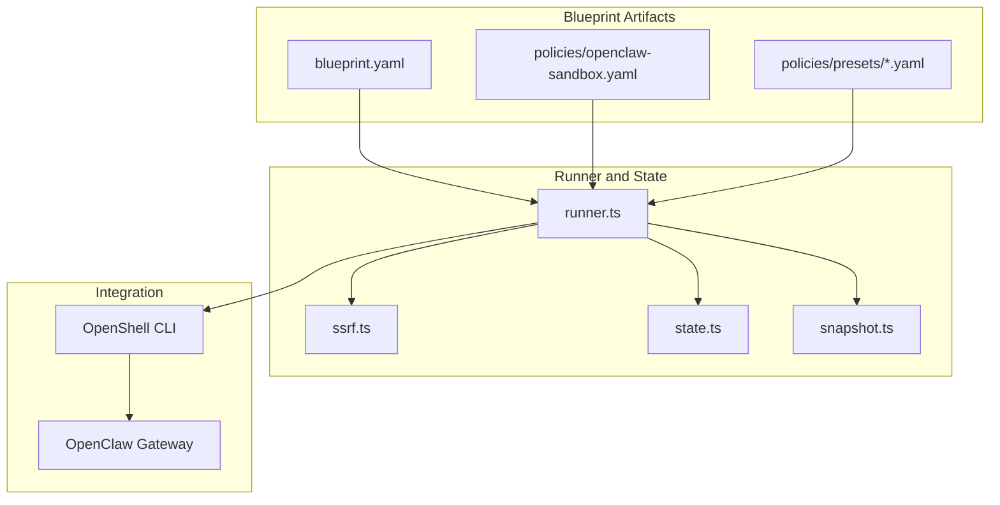
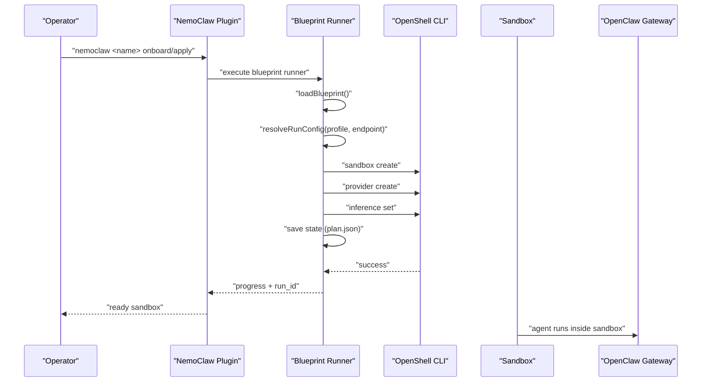
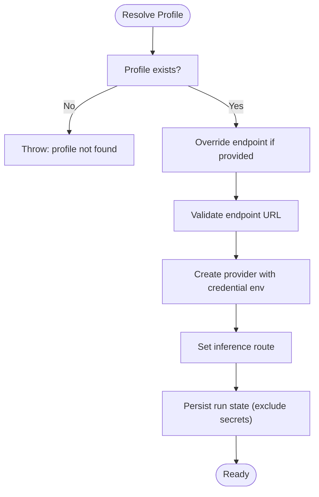
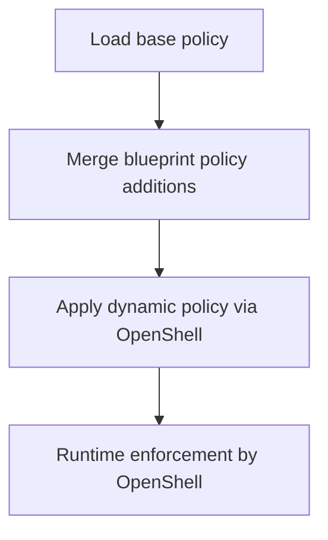
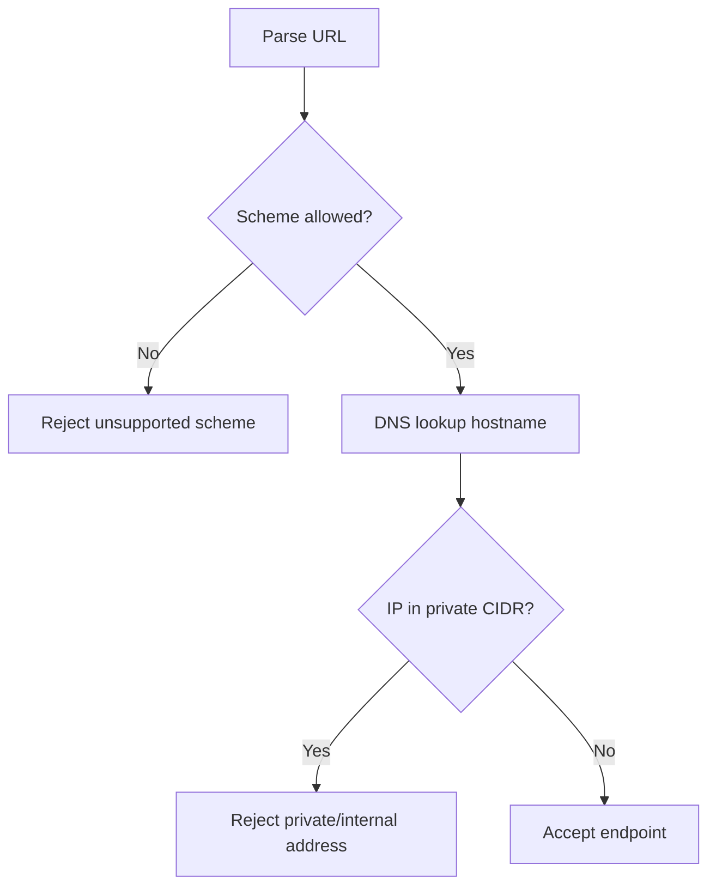
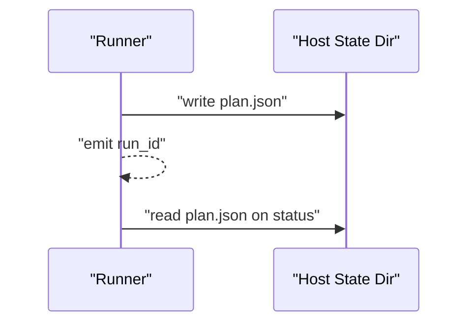
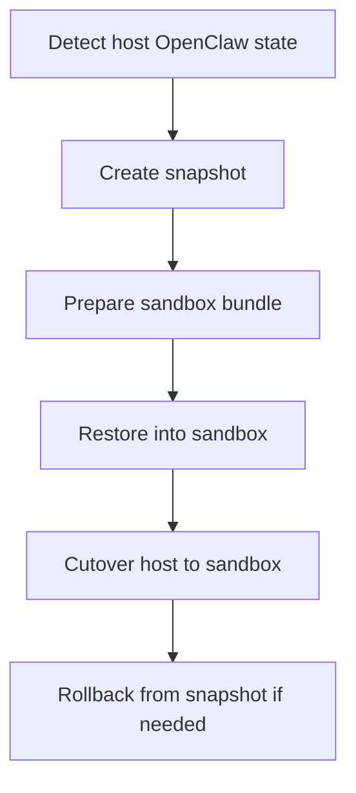
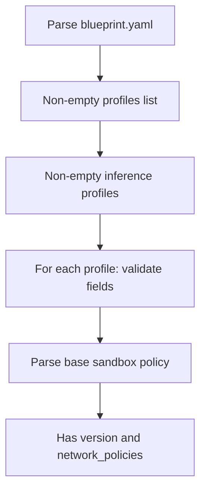
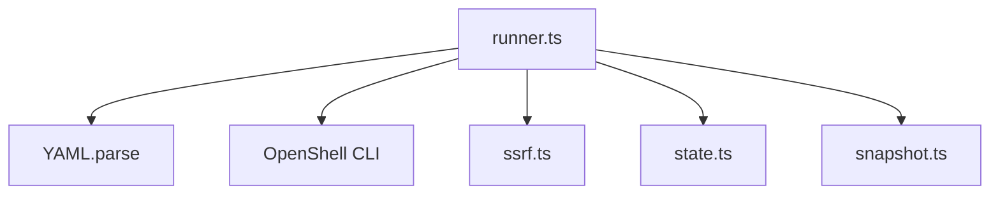

# Custom Blueprint Development

<cite>
**Referenced Files in This Document**
- [blueprint.yaml](file://nemoclaw-blueprint/blueprint.yaml)
- [openclaw-sandbox.yaml](file://nemoclaw-blueprint/policies/openclaw-sandbox.yaml)
- [brave.yaml](file://nemoclaw-blueprint/policies/presets/brave.yaml)
- [discord.yaml](file://nemoclaw-blueprint/policies/presets/discord.yaml)
- [runner.ts](file://nemoclaw/src/blueprint/runner.ts)
- [state.ts](file://nemoclaw/src/blueprint/state.ts)
- [snapshot.ts](file://nemoclaw/src/blueprint/snapshot.ts)
- [ssrf.ts](file://nemoclaw/src/blueprint/ssrf.ts)
- [migration-state.ts](file://nemoclaw/src/commands/migration-state.ts)
- [validate-blueprint.test.ts](file://test/validate-blueprint.test.ts)
- [runner.test.ts](file://nemoclaw/src/blueprint/runner.test.ts)
- [architecture.md](file://docs/reference/architecture.md)
- [inference-options.md](file://docs/inference/inference-options.md)
- [customize-network-policy.md](file://docs/network-policy/customize-network-policy.md)
</cite>

## Table of Contents
1. [Introduction](#introduction)
2. [Project Structure](#project-structure)
3. [Core Components](#core-components)
4. [Architecture Overview](#architecture-overview)
5. [Detailed Component Analysis](#detailed-component-analysis)
6. [Dependency Analysis](#dependency-analysis)
7. [Performance Considerations](#performance-considerations)
8. [Troubleshooting Guide](#troubleshooting-guide)
9. [Conclusion](#conclusion)
10. [Appendices](#appendices)

## Introduction
This document explains how to develop custom blueprints for NemoClaw. Blueprints define sandbox composition, inference routing, and network policy additions. They are executed as subprocesses by the NemoClaw plugin and orchestrated through OpenShell. This guide covers YAML structure, component definitions, advanced features (inference profiles, sandbox configuration, policy additions), validation, state management, migration handling, and practical examples for enterprise, specialized agents, and multi-environment setups. It also addresses inheritance via policy presets, conditional configuration patterns, dynamic parameter injection, versioning, compatibility, and best practices.

## Project Structure
NemoClaw’s blueprint system is composed of:
- A blueprint manifest (YAML) that declares versioning, profiles, and components.
- A base sandbox policy file that defines network and filesystem restrictions.
- Optional policy presets for common integrations.
- A blueprint runner that interprets the blueprint and invokes OpenShell commands.
- Supporting modules for SSRF validation, state persistence, and migration snapshots.

**Diagram sources**
- [blueprint.yaml:1-66](file://nemoclaw-blueprint/blueprint.yaml#L1-L66)
- [openclaw-sandbox.yaml:1-219](file://nemoclaw-blueprint/policies/openclaw-sandbox.yaml#L1-L219)
- [runner.ts:1-451](file://nemoclaw/src/blueprint/runner.ts#L1-L451)
- [ssrf.ts:1-156](file://nemoclaw/src/blueprint/ssrf.ts#L1-L156)
- [state.ts:1-70](file://nemoclaw/src/blueprint/state.ts#L1-L70)
- [snapshot.ts:1-177](file://nemoclaw/src/blueprint/snapshot.ts#L1-L177)

**Section sources**
- [blueprint.yaml:1-66](file://nemoclaw-blueprint/blueprint.yaml#L1-L66)
- [openclaw-sandbox.yaml:1-219](file://nemoclaw-blueprint/policies/openclaw-sandbox.yaml#L1-L219)
- [runner.ts:1-451](file://nemoclaw/src/blueprint/runner.ts#L1-L451)
- [architecture.md:114-174](file://docs/reference/architecture.md#L114-L174)

## Core Components
- Blueprint manifest: Defines versioning, minimum OpenShell/OpenClaw versions, profiles, and components (sandbox, inference, policy).
- Sandbox component: Specifies the container image, sandbox name, and forwarded ports.
- Inference component: Declares named profiles with provider type/name, endpoint, model, and optional credential environment variables.
- Policy component: References the base policy and allows additions merged at runtime.
- Runner: Loads the blueprint, validates profiles and endpoints, and executes OpenShell commands to create and configure the sandbox and provider.
- SSRF validator: Ensures endpoints are safe and resolvable.
- State manager: Persists run metadata and run IDs.
- Migration snapshot: Captures and restores host OpenClaw state for sandbox migration.

**Section sources**
- [blueprint.yaml:4-66](file://nemoclaw-blueprint/blueprint.yaml#L4-L66)
- [runner.ts:51-144](file://nemoclaw/src/blueprint/runner.ts#L51-L144)
- [ssrf.ts:118-155](file://nemoclaw/src/blueprint/ssrf.ts#L118-L155)
- [state.ts:9-70](file://nemoclaw/src/blueprint/state.ts#L9-L70)
- [snapshot.ts:57-177](file://nemoclaw/src/blueprint/snapshot.ts#L57-L177)

## Architecture Overview
The blueprint lifecycle is orchestrated by the NemoClaw plugin and executed by the blueprint runner:
- Resolve: Locate and verify the blueprint artifact and compatibility constraints.
- Verify: Confirm digest and compatibility.
- Plan: Determine resources to create/update (sandbox, provider, inference route, policy).
- Apply: Execute OpenShell commands to provision and configure.
- Status: Report current state and run metadata.

**Diagram sources**
- [runner.ts:167-330](file://nemoclaw/src/blueprint/runner.ts#L167-L330)
- [architecture.md:139-152](file://docs/reference/architecture.md#L139-L152)

**Section sources**
- [runner.ts:167-330](file://nemoclaw/src/blueprint/runner.ts#L167-L330)
- [architecture.md:139-152](file://docs/reference/architecture.md#L139-L152)

## Detailed Component Analysis

### Blueprint YAML Structure
The blueprint manifest defines:
- version: Semantic version of the blueprint.
- min_openshell_version and min_openclaw_version: Compatibility constraints.
- profiles: List of inference profile names.
- description: Human-readable description.
- components:
  - sandbox: image, name, forward_ports.
  - inference: profiles with provider_type, provider_name, endpoint, model, credential_env, credential_default, dynamic_endpoint.
  - policy: base policy path and additions.

Practical guidance:
- Keep profiles explicit and documented.
- Use dynamic_endpoint for profiles that accept CLI overrides.
- Keep credential_env and credential_default aligned with provider expectations.

**Section sources**
- [blueprint.yaml:4-66](file://nemoclaw-blueprint/blueprint.yaml#L4-L66)

### Sandbox Configuration
- image: Container image reference for the sandbox.
- name: Sandbox name used for OpenShell operations.
- forward_ports: Ports exposed from the sandbox to the host.

Runner behavior:
- Defaults to sensible values if fields are omitted.
- Reuses existing sandbox if creation indicates “already exists.”

**Section sources**
- [blueprint.yaml:20-25](file://nemoclaw-blueprint/blueprint.yaml#L20-L25)
- [runner.ts:191-195](file://nemoclaw/src/blueprint/runner.ts#L191-L195)
- [runner.ts:235-256](file://nemoclaw/src/blueprint/runner.ts#L235-L256)

### Inference Profiles and Dynamic Parameter Injection
Profiles support:
- provider_type/provider_name: Provider identity.
- endpoint: Base URL for the provider.
- model: Model identifier.
- credential_env: Environment variable name holding the credential.
- credential_default: Fallback credential value if env var is unset.
- dynamic_endpoint: Allow overriding endpoint via CLI.

Runner behavior:
- Validates requested profile exists.
- Applies endpoint override with SSRF validation.
- Creates provider with scoped credential environment.
- Sets inference route to the chosen provider and model.

**Diagram sources**
- [runner.ts:116-144](file://nemoclaw/src/blueprint/runner.ts#L116-L144)
- [runner.ts:258-301](file://nemoclaw/src/blueprint/runner.ts#L258-L301)
- [runner.ts:304-325](file://nemoclaw/src/blueprint/runner.ts#L304-L325)

**Section sources**
- [blueprint.yaml:26-56](file://nemoclaw-blueprint/blueprint.yaml#L26-L56)
- [runner.ts:116-144](file://nemoclaw/src/blueprint/runner.ts#L116-L144)
- [runner.ts:258-301](file://nemoclaw/src/blueprint/runner.ts#L258-L301)
- [runner.ts:304-325](file://nemoclaw/src/blueprint/runner.ts#L304-L325)

### Policy Additions and Presets
- Base policy: Defined in the sandbox policy file with network_policies, filesystem_policy, landlock, and process settings.
- Policy additions: Blueprint can inject additional endpoints/rules via policy.additions.
- Presets: Predefined policy fragments for common integrations (e.g., Discord, Telegram, npm).

Runner behavior:
- Collects policy additions from the blueprint.
- Applies policy changes to the sandbox via OpenShell.

**Diagram sources**
- [openclaw-sandbox.yaml:46-219](file://nemoclaw-blueprint/policies/openclaw-sandbox.yaml#L46-L219)
- [blueprint.yaml:57-66](file://nemoclaw-blueprint/blueprint.yaml#L57-L66)
- [runner.ts:203-204](file://nemoclaw/src/blueprint/runner.ts#L203-L204)

**Section sources**
- [openclaw-sandbox.yaml:1-219](file://nemoclaw-blueprint/policies/openclaw-sandbox.yaml#L1-L219)
- [brave.yaml:1-23](file://nemoclaw-blueprint/policies/presets/brave.yaml#L1-L23)
- [discord.yaml:1-47](file://nemoclaw-blueprint/policies/presets/discord.yaml#L1-L47)
- [customize-network-policy.md:1-130](file://docs/network-policy/customize-network-policy.md#L1-L130)

### SSRF Validation and Endpoint Safety
The runner validates endpoints to prevent SSRF to private/internal networks:
- URL parsing and scheme validation (http/https).
- DNS lookup and IP CIDR checks against private ranges.
- Rejects private/internal addresses.

**Diagram sources**
- [ssrf.ts:118-155](file://nemoclaw/src/blueprint/ssrf.ts#L118-L155)

**Section sources**
- [ssrf.ts:118-155](file://nemoclaw/src/blueprint/ssrf.ts#L118-L155)
- [runner.ts:131-140](file://nemoclaw/src/blueprint/runner.ts#L131-L140)

### State Management Integration
The runner persists run metadata to the host:
- plan.json includes run_id, profile, sandbox_name, and inference configuration (without secrets).
- Status queries the latest run or a specific run_id.

**Diagram sources**
- [runner.ts:304-325](file://nemoclaw/src/blueprint/runner.ts#L304-L325)
- [runner.ts:332-360](file://nemoclaw/src/blueprint/runner.ts#L332-L360)

**Section sources**
- [runner.ts:304-325](file://nemoclaw/src/blueprint/runner.ts#L304-L325)
- [runner.ts:332-360](file://nemoclaw/src/blueprint/runner.ts#L332-L360)
- [state.ts:9-70](file://nemoclaw/src/blueprint/state.ts#L9-L70)

### Migration Handling
The blueprint runner coordinates with migration utilities:
- Snapshot creation captures host OpenClaw state and prepares a sandbox bundle.
- Restore moves snapshot contents into the sandbox.
- Cutover and rollback handle host migration and recovery.

**Diagram sources**
- [snapshot.ts:57-135](file://nemoclaw/src/blueprint/snapshot.ts#L57-L135)
- [migration-state.ts:376-477](file://nemoclaw/src/commands/migration-state.ts#L376-L477)
- [migration-state.ts:670-743](file://nemoclaw/src/commands/migration-state.ts#L670-L743)

**Section sources**
- [snapshot.ts:57-135](file://nemoclaw/src/blueprint/snapshot.ts#L57-L135)
- [migration-state.ts:376-477](file://nemoclaw/src/commands/migration-state.ts#L376-L477)
- [migration-state.ts:670-743](file://nemoclaw/src/commands/migration-state.ts#L670-L743)

### Blueprint Validation Mechanisms
Validation ensures correctness and safety:
- Unit tests validate blueprint parsing, presence of profiles, and required fields.
- Policy baseline validation checks for version and network_policies presence.
- End-to-end validation mirrors unit tests.

**Diagram sources**
- [validate-blueprint.test.ts:30-86](file://test/validate-blueprint.test.ts#L30-L86)
- [runner.test.ts:158-173](file://nemoclaw/src/blueprint/runner.test.ts#L158-L173)

**Section sources**
- [validate-blueprint.test.ts:1-87](file://test/validate-blueprint.test.ts#L1-L87)
- [runner.test.ts:158-173](file://nemoclaw/src/blueprint/runner.test.ts#L158-L173)

### Advanced Features and Patterns
- Custom inference profiles: Define provider_type/provider_name, endpoint, model, and credential_env per profile.
- Sandbox configurations: Image, name, and forwarded ports tailored to environments.
- Policy additions: Extend base policy with additional endpoints and rules.
- Conditional configurations: Use dynamic_endpoint to allow CLI overrides; use presets for common integrations.
- Dynamic parameter injection: Pass credentials via environment variables scoped to provider creation.

**Section sources**
- [blueprint.yaml:26-56](file://nemoclaw-blueprint/blueprint.yaml#L26-L56)
- [runner.ts:258-301](file://nemoclaw/src/blueprint/runner.ts#L258-L301)
- [customize-network-policy.md:72-95](file://docs/network-policy/customize-network-policy.md#L72-L95)

### Practical Examples

#### Enterprise Deployment Blueprint
- Profiles: default, ncp (NVIDIA Connected Platform), nim-local (NVIDIA Inference Microservice).
- Sandbox: hardened image, specific forwarded ports.
- Policy additions: Internal endpoints for CI/CD, artifact registries, and vendor APIs.
- Validation: Ensure endpoint URLs resolve and are not private/internal.

**Section sources**
- [blueprint.yaml:26-56](file://nemoclaw-blueprint/blueprint.yaml#L26-L56)
- [openclaw-sandbox.yaml:162-173](file://nemoclaw-blueprint/policies/openclaw-sandbox.yaml#L162-L173)
- [inference-options.md:38-63](file://docs/inference/inference-options.md#L38-L63)

#### Specialized Agent Configuration
- Profiles: vLLM local for offline scenarios, OpenAI-compatible for proxy environments.
- Policy additions: Web search APIs, document repositories, or internal knowledge bases.
- Credential handling: Use credential_env and credential_default for secure injection.

**Section sources**
- [blueprint.yaml:49-56](file://nemoclaw-blueprint/blueprint.yaml#L49-L56)
- [brave.yaml:8-23](file://nemoclaw-blueprint/policies/presets/brave.yaml#L8-L23)

#### Multi-Environment Setups
- Profiles: dev, staging, prod with distinct endpoints and models.
- Policy presets: Apply environment-specific presets (e.g., npm for dev, docker for CI).
- Dynamic endpoint override: Use CLI to switch endpoints per environment.

**Section sources**
- [discord.yaml:8-47](file://nemoclaw-blueprint/policies/presets/discord.yaml#L8-L47)
- [runner.ts:131-140](file://nemoclaw/src/blueprint/runner.ts#L131-L140)

### Blueprint Inheritance and Presets
- Inheritance: Base policy file defines the baseline; blueprint policy.additions augments it.
- Presets: Use predefined policy fragments for common integrations and merge them into the base policy or apply dynamically.

**Section sources**
- [openclaw-sandbox.yaml:1-219](file://nemoclaw-blueprint/policies/openclaw-sandbox.yaml#L1-L219)
- [customize-network-policy.md:97-123](file://docs/network-policy/customize-network-policy.md#L97-L123)

### Blueprint Versioning and Compatibility
- version and min_openshell_version/min_openclaw_version in blueprint.yaml ensure compatibility.
- Digest verification and compatibility checks occur during blueprint resolution and verification.

**Section sources**
- [blueprint.yaml:4-6](file://nemoclaw-blueprint/blueprint.yaml#L4-L6)
- [architecture.md:147-148](file://docs/reference/architecture.md#L147-L148)

### Best Practices
- Keep profiles explicit and documented; avoid empty fields.
- Use dynamic_endpoint for flexible endpoint overrides.
- Exclude secrets from persisted state; rely on environment-scoped credentials.
- Validate endpoints with SSRF checks before applying.
- Prefer presets for common integrations; extend base policy minimally.
- Use policy additions for environment-specific needs; keep base policy strict.

**Section sources**
- [runner.ts:318-319](file://nemoclaw/src/blueprint/runner.ts#L318-L319)
- [ssrf.ts:118-155](file://nemoclaw/src/blueprint/ssrf.ts#L118-L155)
- [customize-network-policy.md:35-95](file://docs/network-policy/customize-network-policy.md#L35-L95)

## Dependency Analysis
The blueprint runner depends on:
- YAML parsing for blueprint loading.
- OpenShell CLI for sandbox and provider operations.
- SSRF validator for endpoint safety.
- State manager for run metadata persistence.
- Snapshot utilities for migration workflows.

**Diagram sources**
- [runner.ts:79-89](file://nemoclaw/src/blueprint/runner.ts#L79-L89)
- [runner.ts:212-330](file://nemoclaw/src/blueprint/runner.ts#L212-L330)
- [ssrf.ts:1-156](file://nemoclaw/src/blueprint/ssrf.ts#L1-L156)
- [state.ts:1-70](file://nemoclaw/src/blueprint/state.ts#L1-L70)
- [snapshot.ts:1-177](file://nemoclaw/src/blueprint/snapshot.ts#L1-L177)

**Section sources**
- [runner.ts:79-89](file://nemoclaw/src/blueprint/runner.ts#L79-L89)
- [runner.ts:212-330](file://nemoclaw/src/blueprint/runner.ts#L212-L330)

## Performance Considerations
- Minimize repeated OpenShell invocations by batching operations where possible.
- Use defaults for sandbox and provider to reduce configuration overhead.
- Avoid excessive policy additions to limit runtime enforcement complexity.
- Cache validated endpoints when feasible to reduce repeated SSRF checks.

## Troubleshooting Guide
Common issues and resolutions:
- Profile not found: Ensure the requested profile exists in components.inference.profiles and is listed in profiles.
- OpenShell not found: Install OpenShell and ensure it is on PATH.
- Endpoint SSRF blocked: Use a public endpoint; verify DNS resolution and avoid private/internal IPs.
- Sandbox creation failures: Check disk space and container runtime availability; the runner reuses existing sandboxes if creation indicates “already exists.”
- Rollback issues: Ensure run_id exists; the runner writes a rolled_back marker even if plan.json is missing.

**Section sources**
- [runner.ts:175-186](file://nemoclaw/src/blueprint/runner.ts#L175-L186)
- [runner.ts:225-256](file://nemoclaw/src/blueprint/runner.ts#L225-L256)
- [ssrf.ts:141-151](file://nemoclaw/src/blueprint/ssrf.ts#L141-L151)
- [runner.test.ts:175-188](file://nemoclaw/src/blueprint/runner.test.ts#L175-L188)
- [runner.test.ts:511-576](file://nemoclaw/src/blueprint/runner.test.ts#L511-L576)

## Conclusion
Custom blueprints in NemoClaw provide a powerful, declarative way to define sandbox composition, inference routing, and policy behavior. By leveraging profiles, presets, dynamic endpoint overrides, and robust validation, operators can tailor deployments for diverse environments while maintaining strong security and operational hygiene. Integrate state management and migration utilities to support safe transitions and recoverability.

## Appendices

### Appendix A: Blueprint YAML Reference
- version: Blueprint semantic version.
- min_openshell_version, min_openclaw_version: Compatibility constraints.
- profiles: List of inference profile names.
- description: Human-readable description.
- components.sandbox: image, name, forward_ports.
- components.inference.profiles: provider_type, provider_name, endpoint, model, credential_env, credential_default, dynamic_endpoint.
- components.policy.base: Base policy path.
- components.policy.additions: Additional policy entries.

**Section sources**
- [blueprint.yaml:4-66](file://nemoclaw-blueprint/blueprint.yaml#L4-L66)

### Appendix B: Policy Reference
- Base policy: network_policies, filesystem_policy, landlock, process.
- Policy additions: Merge into base policy via blueprint.
- Presets: Use for common integrations.

**Section sources**
- [openclaw-sandbox.yaml:46-219](file://nemoclaw-blueprint/policies/openclaw-sandbox.yaml#L46-L219)
- [customize-network-policy.md:35-123](file://docs/network-policy/customize-network-policy.md#L35-L123)