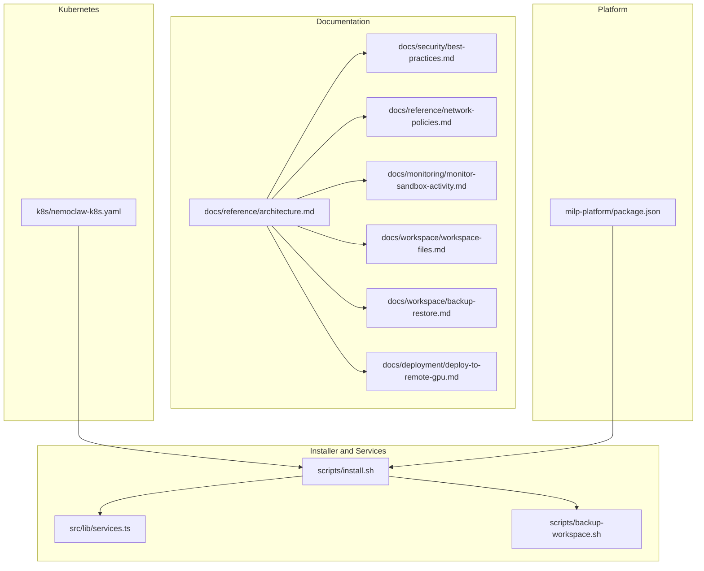
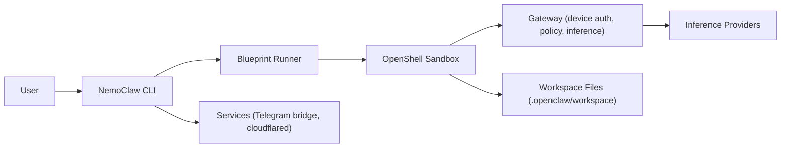
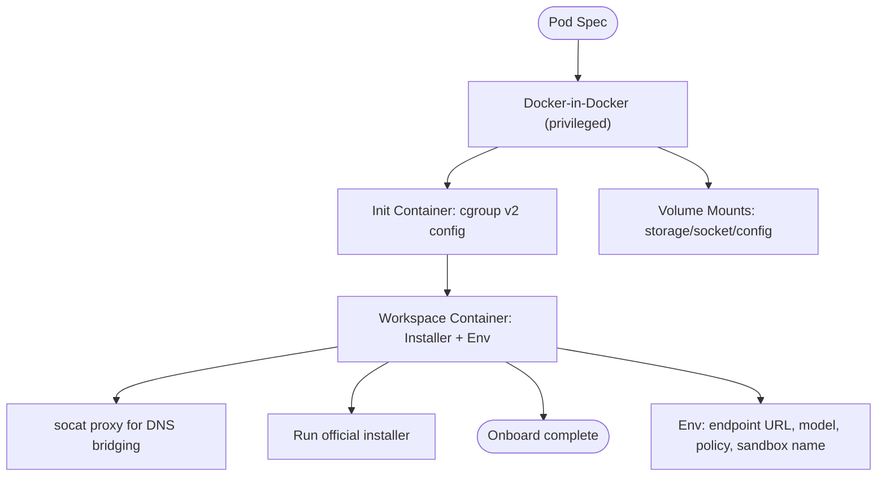
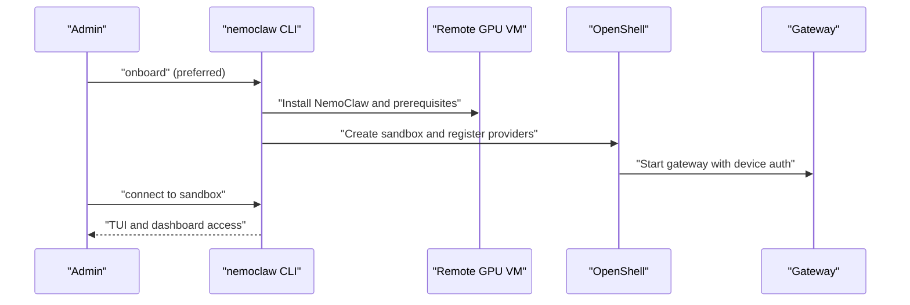
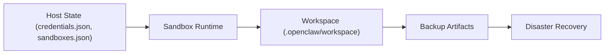
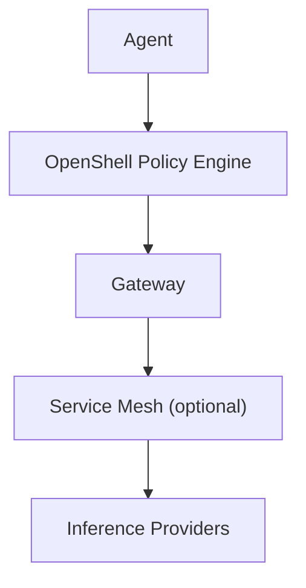
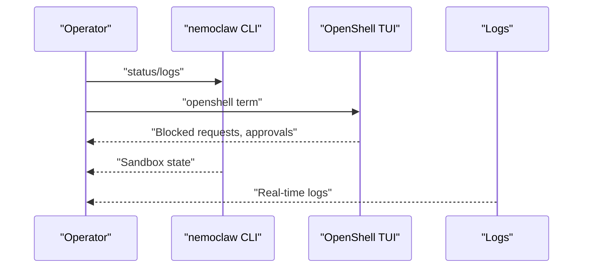
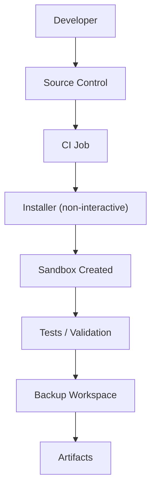
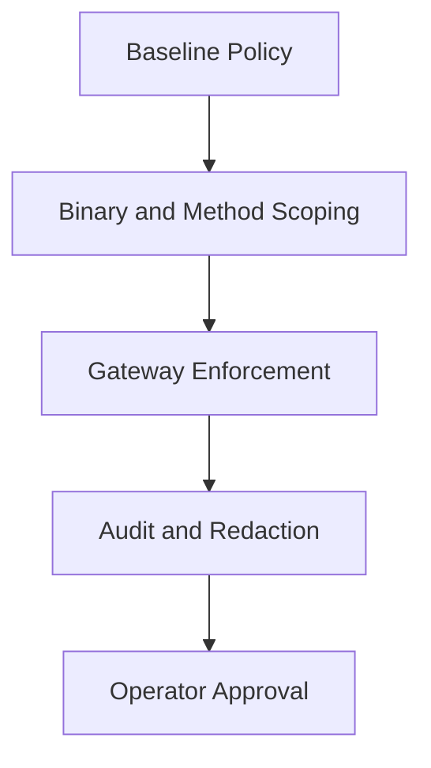
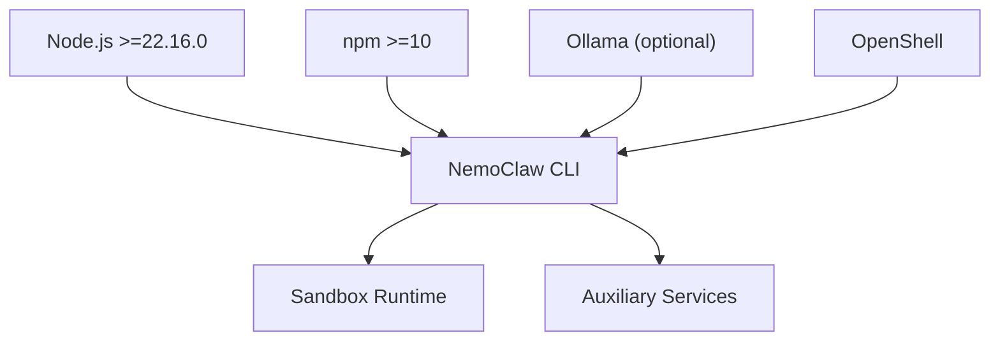

# Enterprise Integration Patterns

<cite>
**Referenced Files in This Document**
- [k8s/nemoclaw-k8s.yaml](file://k8s/nemoclaw-k8s.yaml)
- [docs/deployment/deploy-to-remote-gpu.md](file://docs/deployment/deploy-to-remote-gpu.md)
- [docs/security/best-practices.md](file://docs/security/best-practices.md)
- [docs/monitoring/monitor-sandbox-activity.md](file://docs/monitoring/monitor-sandbox-activity.md)
- [docs/reference/architecture.md](file://docs/reference/architecture.md)
- [docs/reference/network-policies.md](file://docs/reference/network-policies.md)
- [docs/workspace/workspace-files.md](file://docs/workspace/workspace-files.md)
- [docs/workspace/backup-restore.md](file://docs/workspace/backup-restore.md)
- [scripts/install.sh](file://scripts/install.sh)
- [src/lib/services.ts](file://src/lib/services.ts)
- [scripts/backup-workspace.sh](file://scripts/backup-workspace.sh)
- [milp-platform/package.json](file://milp-platform/package.json)
</cite>

## Table of Contents
1. [Introduction](#introduction)
2. [Project Structure](#project-structure)
3. [Core Components](#core-components)
4. [Architecture Overview](#architecture-overview)
5. [Detailed Component Analysis](#detailed-component-analysis)
6. [Dependency Analysis](#dependency-analysis)
7. [Performance Considerations](#performance-considerations)
8. [Troubleshooting Guide](#troubleshooting-guide)
9. [Conclusion](#conclusion)
10. [Appendices](#appendices)

## Introduction
This document describes enterprise integration patterns for NemoClaw with a focus on large-scale deployments and organizational workflows. It consolidates guidance on Kubernetes deployment strategies, remote GPU integration, multi-cluster management, service mesh integration, monitoring and observability, CI/CD pipeline integration, security and compliance, audit logging, high availability and disaster recovery, performance scaling, and operational excellence practices. Practical examples illustrate how to integrate NemoClaw with existing infrastructure such as LDAP authentication, centralized logging, and monitoring systems.

## Project Structure
NemoClaw’s repository organizes enterprise-focused assets across documentation, Kubernetes manifests, installer scripts, and supporting services. The structure emphasizes:
- Deployment and operations: Kubernetes manifest, installer, and service management scripts
- Security and governance: Security best practices, network policies, and workspace lifecycle
- Observability and operations: Monitoring docs, backup/restore procedures, and CLI service orchestration
- Platform and tooling: Optional Next.js-based management UI and associated dependencies

**Diagram sources**
- [docs/reference/architecture.md:23-194](file://docs/reference/architecture.md#L23-L194)
- [docs/security/best-practices.md:23-510](file://docs/security/best-practices.md#L23-L510)
- [docs/reference/network-policies.md:23-145](file://docs/reference/network-policies.md#L23-L145)
- [docs/monitoring/monitor-sandbox-activity.md:23-102](file://docs/monitoring/monitor-sandbox-activity.md#L23-L102)
- [docs/workspace/workspace-files.md:23-88](file://docs/workspace/workspace-files.md#L23-L88)
- [docs/workspace/backup-restore.md:23-129](file://docs/workspace/backup-restore.md#L23-L129)
- [docs/deployment/deploy-to-remote-gpu.md:23-135](file://docs/deployment/deploy-to-remote-gpu.md#L23-L135)
- [k8s/nemoclaw-k8s.yaml:1-120](file://k8s/nemoclaw-k8s.yaml#L1-L120)
- [scripts/install.sh:1-800](file://scripts/install.sh#L1-L800)
- [src/lib/services.ts:1-384](file://src/lib/services.ts#L1-L384)
- [scripts/backup-workspace.sh:1-135](file://scripts/backup-workspace.sh#L1-L135)
- [milp-platform/package.json:1-41](file://milp-platform/package.json#L1-L41)

**Section sources**
- [docs/reference/architecture.md:23-194](file://docs/reference/architecture.md#L23-L194)
- [k8s/nemoclaw-k8s.yaml:1-120](file://k8s/nemoclaw-k8s.yaml#L1-L120)
- [scripts/install.sh:1-800](file://scripts/install.sh#L1-L800)
- [src/lib/services.ts:1-384](file://src/lib/services.ts#L1-L384)
- [scripts/backup-workspace.sh:1-135](file://scripts/backup-workspace.sh#L1-L135)
- [milp-platform/package.json:1-41](file://milp-platform/package.json#L1-L41)

## Core Components
- Kubernetes deployment: Single-pod DinD-based manifest for sandboxed NemoClaw with DNS bridging and environment-driven configuration.
- Remote GPU deployment: Legacy “deploy” wrapper and preferred standalone installer flow on remote VMs, including GPU selection and dashboard access.
- Security posture: Deny-by-default network and filesystem controls, process hardening, inference routing, and device authentication.
- Monitoring and observability: CLI status/logs, TUI for live egress approvals, and workspace backup/restore.
- Services orchestration: Telegram bridge and cloudflared tunnel management with PID tracking and graceful shutdown.
- Workspace lifecycle: Hidden workspace files persisted inside the sandbox and backed up/restored via CLI or scripts.
- Installer and runtime: Node.js and Ollama detection/upgrades, environment-driven configuration, and non-interactive onboarding.

**Section sources**
- [k8s/nemoclaw-k8s.yaml:1-120](file://k8s/nemoclaw-k8s.yaml#L1-L120)
- [docs/deployment/deploy-to-remote-gpu.md:23-135](file://docs/deployment/deploy-to-remote-gpu.md#L23-L135)
- [docs/security/best-practices.md:23-510](file://docs/security/best-practices.md#L23-L510)
- [docs/monitoring/monitor-sandbox-activity.md:23-102](file://docs/monitoring/monitor-sandbox-activity.md#L23-L102)
- [src/lib/services.ts:1-384](file://src/lib/services.ts#L1-L384)
- [docs/workspace/workspace-files.md:23-88](file://docs/workspace/workspace-files.md#L23-L88)
- [docs/workspace/backup-restore.md:23-129](file://docs/workspace/backup-restore.md#L23-L129)
- [scripts/install.sh:1-800](file://scripts/install.sh#L1-L800)

## Architecture Overview
NemoClaw integrates a lightweight CLI plugin with a versioned blueprint to orchestrate OpenShell resources. The system separates host-side state from sandboxed execution, enforces strict network and filesystem policies, and routes inference through a credential-secured gateway.

**Diagram sources**
- [docs/reference/architecture.md:23-194](file://docs/reference/architecture.md#L23-L194)
- [docs/security/best-practices.md:412-453](file://docs/security/best-practices.md#L412-L453)
- [docs/workspace/workspace-files.md:23-88](file://docs/workspace/workspace-files.md#L23-L88)
- [src/lib/services.ts:104-193](file://src/lib/services.ts#L104-L193)

**Section sources**
- [docs/reference/architecture.md:23-194](file://docs/reference/architecture.md#L23-L194)

## Detailed Component Analysis

### Kubernetes Deployment Strategy
- Single-pod DinD setup with Docker-in-Docker for sandbox isolation, including privileged container for Docker daemon and cgroup v2 configuration.
- Workspace container runs the official installer and configures environment variables for endpoint URL, model, sandbox name, and policy mode.
- DNS bridging via socat to expose the inference endpoint to the sandbox using a host alias.
- Resource requests are defined for both containers; restart policy is set to Never to align with installer completion semantics.

**Diagram sources**
- [k8s/nemoclaw-k8s.yaml:1-120](file://k8s/nemoclaw-k8s.yaml#L1-L120)

**Section sources**
- [k8s/nemoclaw-k8s.yaml:1-120](file://k8s/nemoclaw-k8s.yaml#L1-L120)

### Remote GPU Integration Patterns
- Preferred path: Provision a GPU-enabled VM, install NemoClaw on the host, and run the onboarding wizard to create the sandbox and gateway.
- Legacy compatibility path: Use the deploy wrapper to provision and bootstrap a remote instance, installing Docker, NVIDIA Container Toolkit, OpenShell CLI, and running onboarding.
- GPU selection is controlled via an environment variable; dashboard access from remote browsers requires updating the allowlist origin before setup.

**Diagram sources**
- [docs/deployment/deploy-to-remote-gpu.md:23-135](file://docs/deployment/deploy-to-remote-gpu.md#L23-L135)

**Section sources**
- [docs/deployment/deploy-to-remote-gpu.md:23-135](file://docs/deployment/deploy-to-remote-gpu.md#L23-L135)

### Multi-Cluster Management
- Centralize NemoClaw configuration and credentials on the host; keep sandbox state inside the sandbox for portability.
- Use environment variables and policy presets to tailor sandbox behavior per cluster or tenant boundary.
- Employ backup/restore to migrate workspaces across clusters or recover from destructive operations.

**Diagram sources**
- [docs/reference/architecture.md:175-194](file://docs/reference/architecture.md#L175-L194)
- [docs/workspace/backup-restore.md:23-129](file://docs/workspace/backup-restore.md#L23-L129)

**Section sources**
- [docs/reference/architecture.md:175-194](file://docs/reference/architecture.md#L175-L194)
- [docs/workspace/backup-restore.md:23-129](file://docs/workspace/backup-restore.md#L23-L129)

### Service Mesh Integration
- Network egress is governed by OpenShell’s gateway and baseline policies; REST endpoints can be configured with L7 inspection for method/path control.
- Integrate messaging bridges (e.g., Telegram) and cloudflared tunnels for controlled ingress; ensure mesh policies allow only approved egress destinations.

**Diagram sources**
- [docs/security/best-practices.md:126-180](file://docs/security/best-practices.md#L126-L180)
- [docs/reference/network-policies.md:23-145](file://docs/reference/network-policies.md#L23-L145)

**Section sources**
- [docs/security/best-practices.md:126-180](file://docs/security/best-practices.md#L126-L180)
- [docs/reference/network-policies.md:23-145](file://docs/reference/network-policies.md#L23-L145)

### Monitoring and Observability Setup
- Use CLI status and logs to inspect sandbox health and troubleshoot.
- Open the TUI to observe blocked egress requests and approve/deny in real time.
- Monitor services (Telegram bridge, cloudflared) via service status and logs.

**Diagram sources**
- [docs/monitoring/monitor-sandbox-activity.md:23-102](file://docs/monitoring/monitor-sandbox-activity.md#L23-L102)
- [src/lib/services.ts:215-247](file://src/lib/services.ts#L215-L247)

**Section sources**
- [docs/monitoring/monitor-sandbox-activity.md:23-102](file://docs/monitoring/monitor-sandbox-activity.md#L23-L102)
- [src/lib/services.ts:215-247](file://src/lib/services.ts#L215-L247)

### CI/CD Pipeline Integration
- Use the installer in non-interactive mode with environment variables to automate onboarding and sandbox creation.
- Parameterize provider selection, model, policy mode, and presets to support multiple environments.
- Integrate backup/restore into pipeline stages to preserve workspace state across runs.

**Diagram sources**
- [scripts/install.sh:251-282](file://scripts/install.sh#L251-L282)
- [docs/workspace/backup-restore.md:75-129](file://docs/workspace/backup-restore.md#L75-L129)

**Section sources**
- [scripts/install.sh:251-282](file://scripts/install.sh#L251-L282)
- [docs/workspace/backup-restore.md:75-129](file://docs/workspace/backup-restore.md#L75-L129)

### Enterprise Security and Compliance
- Enforce deny-by-default network and filesystem policies; scope endpoints to specific binaries and HTTP methods.
- Use device authentication and secure auth derivation; avoid disabling device auth in remote deployments.
- Route inference through the gateway to isolate provider credentials; prefer local Ollama for sensitive workloads.
- Apply posture profiles (Locked-Down, Development, Integration Testing) to balance usability and risk.

**Diagram sources**
- [docs/security/best-practices.md:126-191](file://docs/security/best-practices.md#L126-L191)
- [docs/reference/network-policies.md:23-145](file://docs/reference/network-policies.md#L23-L145)

**Section sources**
- [docs/security/best-practices.md:126-191](file://docs/security/best-practices.md#L126-L191)
- [docs/reference/network-policies.md:23-145](file://docs/reference/network-policies.md#L23-L145)

### Audit Logging
- CLI redacts secrets from command output and error messages before logging.
- Use TUI to review blocked requests and maintain an audit trail of approvals.
- Persist workspace files and backups to support compliance records.

**Section sources**
- [docs/security/best-practices.md:401-411](file://docs/security/best-practices.md#L401-L411)
- [docs/workspace/workspace-files.md:23-88](file://docs/workspace/workspace-files.md#L23-L88)
- [docs/workspace/backup-restore.md:23-129](file://docs/workspace/backup-restore.md#L23-L129)

### High Availability and Disaster Recovery
- Persist workspace files inside the sandbox; back up before destructive operations.
- Use backup/restore scripts to recover state across environments or after upgrades.
- Maintain multiple sandbox instances across clusters for redundancy; coordinate credentials and policy via host state.

**Section sources**
- [docs/workspace/workspace-files.md:62-75](file://docs/workspace/workspace-files.md#L62-L75)
- [docs/workspace/backup-restore.md:23-129](file://docs/workspace/backup-restore.md#L23-L129)
- [docs/reference/architecture.md:175-194](file://docs/reference/architecture.md#L175-L194)

### Performance Scaling Strategies
- Select GPU type via environment variable for remote deployments.
- Use local Ollama for on-prem inference to reduce latency and control data locality.
- Optimize policy granularity to minimize overhead while maintaining security.

**Section sources**
- [docs/deployment/deploy-to-remote-gpu.md:119-129](file://docs/deployment/deploy-to-remote-gpu.md#L119-L129)
- [docs/security/best-practices.md:428-453](file://docs/security/best-practices.md#L428-L453)

### Operational Excellence Practices
- Use non-interactive installer with environment variables for repeatable deployments.
- Manage auxiliary services (Telegram bridge, cloudflared) with PID tracking and graceful shutdown.
- Monitor sandbox health, test inference, and validate network policy approvals regularly.

**Section sources**
- [scripts/install.sh:251-282](file://scripts/install.sh#L251-L282)
- [src/lib/services.ts:104-193](file://src/lib/services.ts#L104-L193)
- [docs/monitoring/monitor-sandbox-activity.md:23-102](file://docs/monitoring/monitor-sandbox-activity.md#L23-L102)

## Dependency Analysis
NemoClaw’s runtime depends on Node.js and npm for the CLI, optional Ollama for local inference, and OpenShell for sandboxing and gateway services. The installer coordinates these dependencies and prepares the environment for onboarding.

**Diagram sources**
- [scripts/install.sh:560-578](file://scripts/install.sh#L560-L578)
- [milp-platform/package.json:11-29](file://milp-platform/package.json#L11-L29)

**Section sources**
- [scripts/install.sh:560-578](file://scripts/install.sh#L560-L578)
- [milp-platform/package.json:11-29](file://milp-platform/package.json#L11-L29)

## Performance Considerations
- Prefer local Ollama for low-latency, on-prem inference to avoid network-bound delays.
- Tune policy rules to reduce unnecessary approvals and minimize gateway inspection overhead.
- Use resource requests in Kubernetes to ensure predictable performance for GPU-bound workloads.

[No sources needed since this section provides general guidance]

## Troubleshooting Guide
- Use CLI status and logs to diagnose sandbox state and errors.
- Open the TUI to review blocked egress requests and approve/deny as needed.
- Validate inference connectivity and endpoint reachability.
- Confirm environment variables for endpoint URL, model, and policy mode are correctly set.

**Section sources**
- [docs/monitoring/monitor-sandbox-activity.md:23-102](file://docs/monitoring/monitor-sandbox-activity.md#L23-L102)

## Conclusion
NemoClaw’s architecture and tooling provide a robust foundation for enterprise-grade AI agent deployments. By combining deny-by-default security, controlled inference routing, and operational tooling for monitoring, backup, and CI/CD, organizations can achieve secure, scalable, and auditable agent workflows across Kubernetes, remote GPUs, and multi-cluster environments.

[No sources needed since this section summarizes without analyzing specific files]

## Appendices

### Practical Integration Examples
- LDAP authentication: Integrate with enterprise identity providers by extending device authentication and access controls at the gateway level.
- Centralized logging: Stream sandbox logs and service logs to enterprise SIEM; redact secrets using CLI redaction features.
- Monitoring systems: Expose metrics and dashboards via cloudflared tunnels and integrate with existing monitoring stacks; monitor TUI approvals for anomaly detection.

[No sources needed since this section provides general guidance]