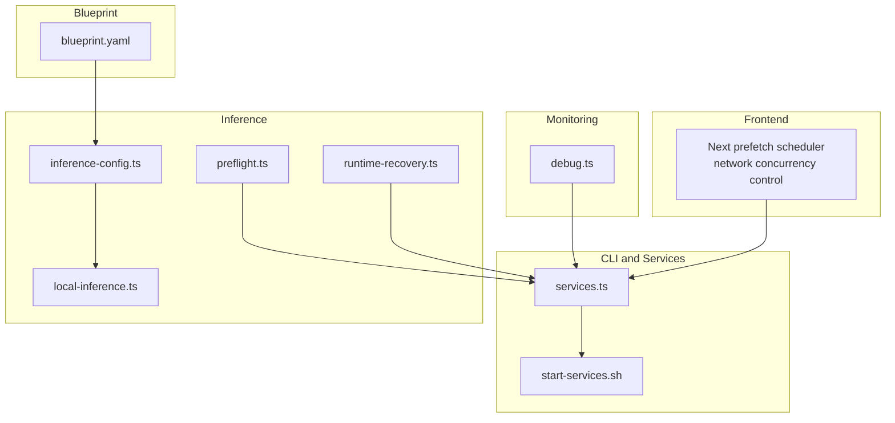
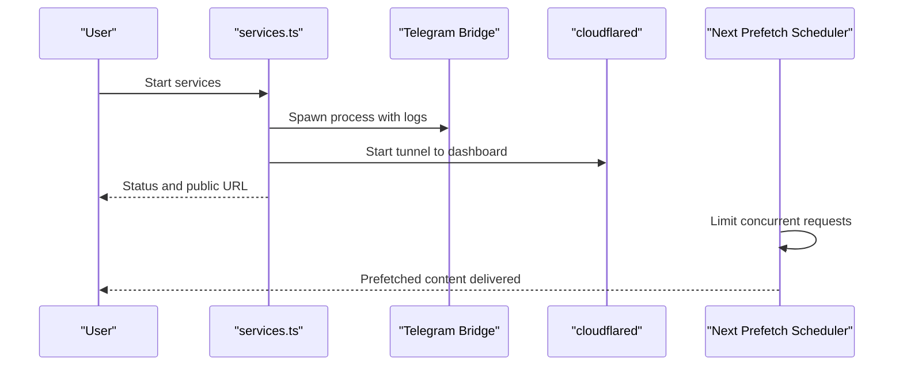
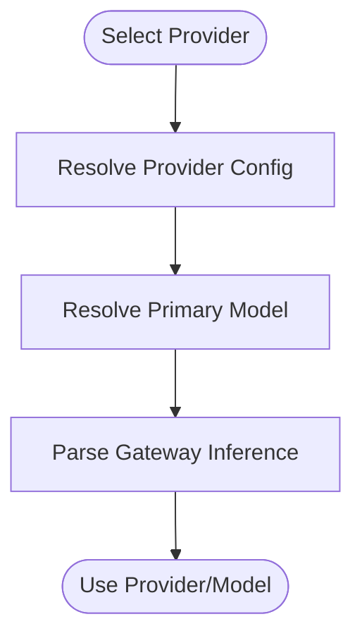
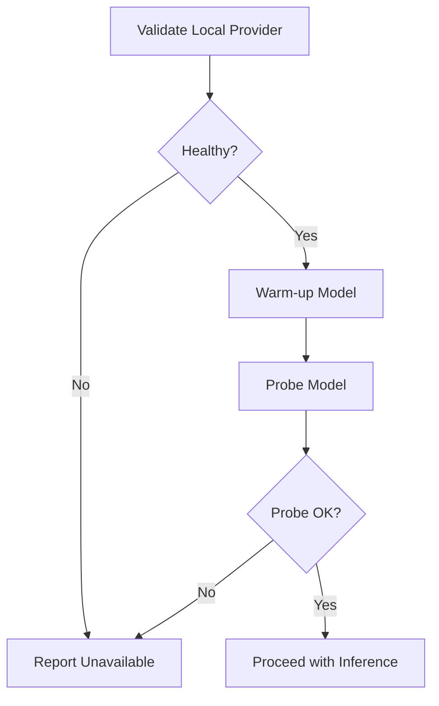
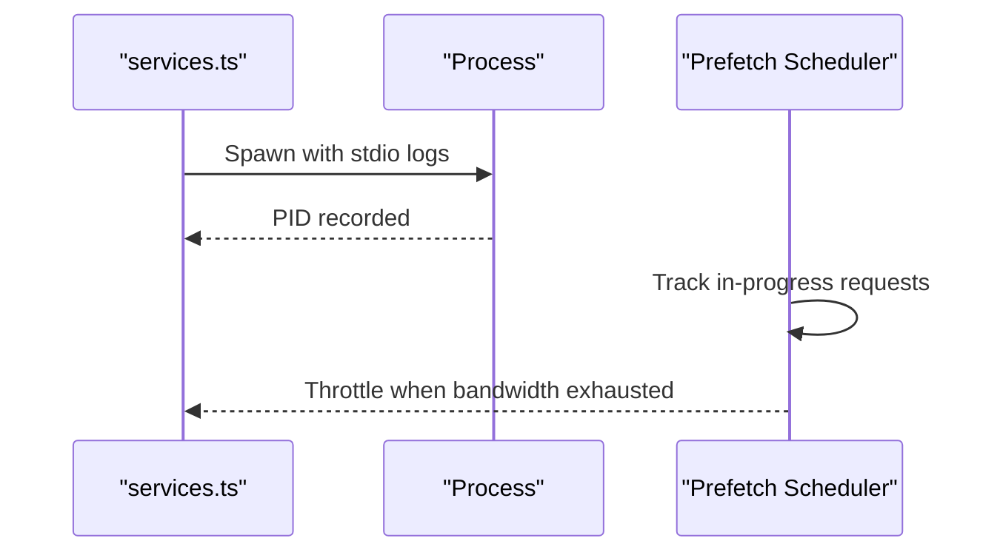
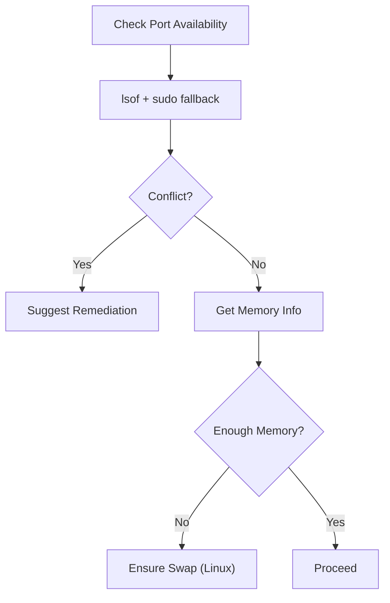
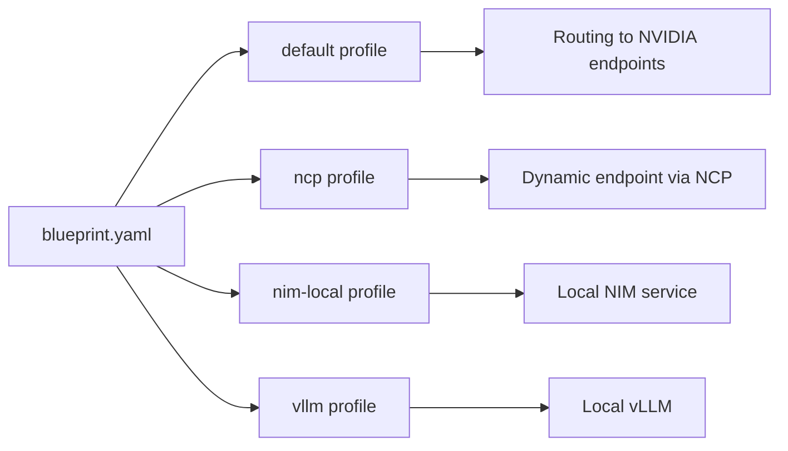
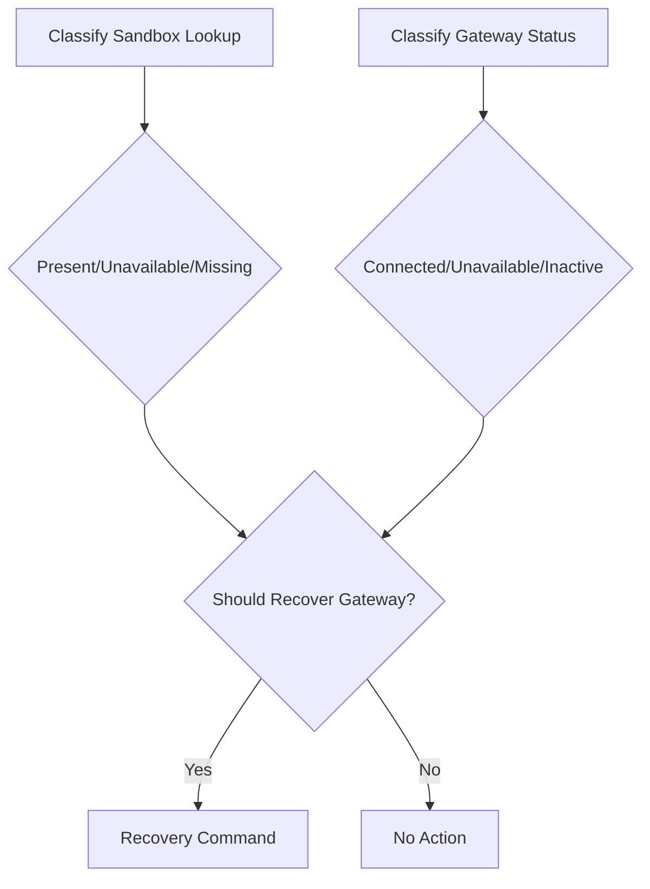
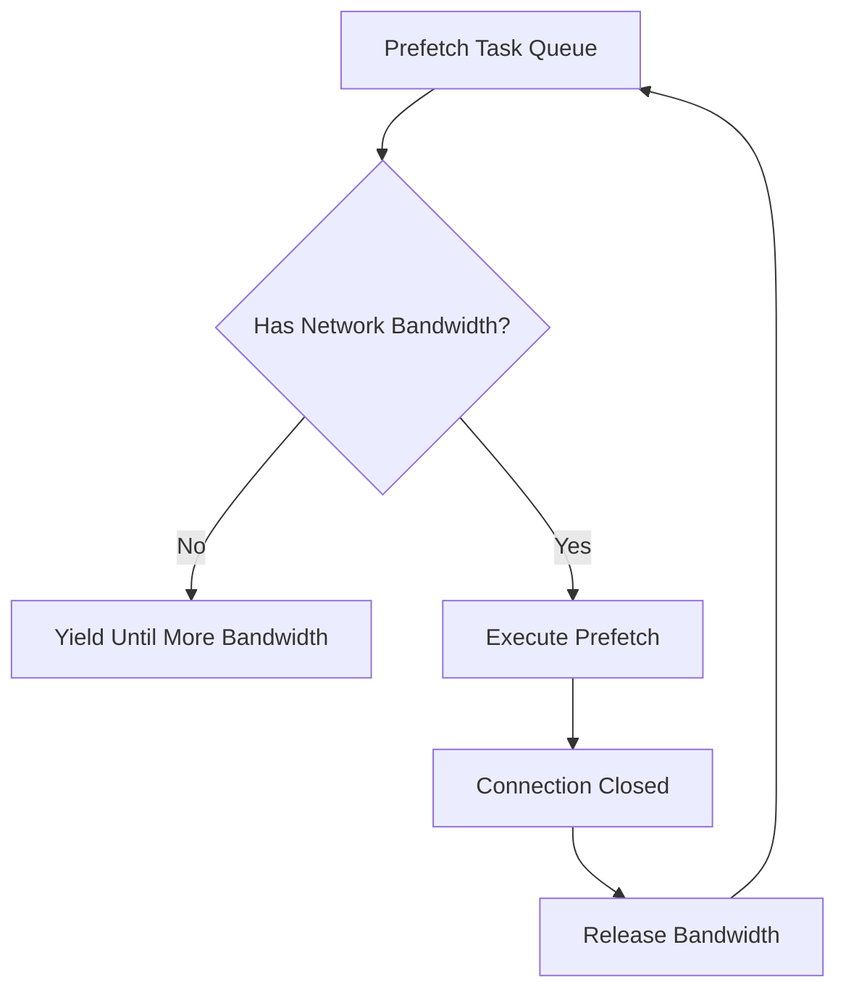
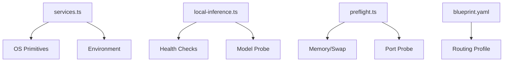

# Performance Optimization

<cite>
**Referenced Files in This Document**
- [inference-config.ts](file://src/lib/inference-config.ts)
- [local-inference.ts](file://src/lib/local-inference.ts)
- [services.ts](file://src/lib/services.ts)
- [preflight.ts](file://src/lib/preflight.ts)
- [runtime-recovery.ts](file://src/lib/runtime-recovery.ts)
- [debug.ts](file://src/lib/debug.ts)
- [blueprint.yaml](file://nemoclaw-blueprint/blueprint.yaml)
- [start-services.sh](file://scripts/start-services.sh)
- [test-inference.sh](file://scripts/test-inference.sh)
- [test-inference-local.sh](file://scripts/test-inference-local.sh)
- [package.json](file://package.json)
- [milp-platform ROI calculator](file://milp-platform/src/lib/roi-calculator.ts)
- [Next prefetch scheduler](file://milp-platform/.next/dev/server/chunks/ssr/0s7f_next_dist_esm_0~l8jon._.js)
- [Next prefetch scheduler (2)](file://milp-platform/.next/dev/server/chunks/ssr/0s7f_next_dist_0fvnr2s._.js)
- [Next prefetch scheduler (3)](file://milp-platform/.next/dev/server/chunks/ssr/0s7f_next_dist_0.92tiu._.js)
- [Next prefetch scheduler (4)](file://milp-platform/.next/dev/server/chunks/ssr/0s7f_next_dist_client_128cc0c._.js)
- [Next prefetch scheduler (5)](file://milp-platform/.next/dev/server/chunks/ssr/0s7f_06d1p-m._.js)
- [Next prefetch scheduler (6)](file://milp-platform/.next/dev/server/chunks/ssr/0s7f_07c17dd._.js)
- [Next prefetch scheduler (7)](file://milp-platform/.next/dev/server/chunks/ssr/0s7f_@clerk_shared_dist_runtime_05i910a._.js)
- [Next prefetch scheduler (8)](file://milp-platform/.next/dev/server/edge/chunks/0s7f_@clerk_shared_dist_runtime_10wcn50._.js)
- [Next prefetch scheduler (9)](file://milp-platform/.next/dev/static/chunks/0s7f_react-dom_03a28c2._.js)
</cite>

## Table of Contents
1. [Introduction](#introduction)
2. [Project Structure](#project-structure)
3. [Core Components](#core-components)
4. [Architecture Overview](#architecture-overview)
5. [Detailed Component Analysis](#detailed-component-analysis)
6. [Dependency Analysis](#dependency-analysis)
7. [Performance Considerations](#performance-considerations)
8. [Troubleshooting Guide](#troubleshooting-guide)
9. [Conclusion](#conclusion)
10. [Appendices](#appendices)

## Introduction
This document provides a comprehensive guide to performance optimization in NemoClaw with a focus on inference provider selection, caching strategies, resource allocation, and monitoring. It synthesizes performance-relevant code paths across the CLI, runtime services, local inference helpers, and blueprint configuration to deliver actionable techniques for development and production workloads. Topics include latency reduction, concurrent request handling, memory and GPU-aware decisions, and continuous performance monitoring.

## Project Structure
NemoClaw’s performance-critical paths span:
- CLI and runtime services for auxiliary processes (Telegram bridge, cloudflared tunnel)
- Local inference helpers for provider health, warm-up, and model selection
- Preflight checks for ports, memory, and swap to prevent OOM and startup conflicts
- Blueprint orchestration for sandbox and inference routing
- Monitoring and diagnostics via debug collection and runtime recovery classification
- Frontend prefetch scheduling that limits concurrent network requests to preserve bandwidth

**Diagram sources**
- [services.ts:104-383](file://src/lib/services.ts#L104-L383)
- [start-services.sh:15-214](file://scripts/start-services.sh#L15-L214)
- [inference-config.ts:12-150](file://src/lib/inference-config.ts#L12-L150)
- [local-inference.ts:29-238](file://src/lib/local-inference.ts#L29-L238)
- [preflight.ts:421-754](file://src/lib/preflight.ts#L421-L754)
- [runtime-recovery.ts:41-91](file://src/lib/runtime-recovery.ts#L41-L91)
- [blueprint.yaml:19-66](file://nemoclaw-blueprint/blueprint.yaml#L19-L66)
- [debug.ts:158-488](file://src/lib/debug.ts#L158-L488)
- [Next prefetch scheduler:5106-5140](file://milp-platform/.next/dev/server/chunks/ssr/0s7f_next_dist_esm_0~l8jon._.js#L5106-L5140)

**Section sources**
- [services.ts:104-383](file://src/lib/services.ts#L104-L383)
- [start-services.sh:15-214](file://scripts/start-services.sh#L15-L214)
- [inference-config.ts:12-150](file://src/lib/inference-config.ts#L12-L150)
- [local-inference.ts:29-238](file://src/lib/local-inference.ts#L29-L238)
- [preflight.ts:421-754](file://src/lib/preflight.ts#L421-L754)
- [runtime-recovery.ts:41-91](file://src/lib/runtime-recovery.ts#L41-L91)
- [blueprint.yaml:19-66](file://nemoclaw-blueprint/blueprint.yaml#L19-L66)
- [debug.ts:158-488](file://src/lib/debug.ts#L158-L488)
- [Next prefetch scheduler:5106-5140](file://milp-platform/.next/dev/server/chunks/ssr/0s7f_next_dist_esm_0~l8jon._.js#L5106-L5140)

## Core Components
- Inference provider selection and routing: provider mapping, model resolution, and gateway parsing
- Local inference helpers: health checks, warm-up, model probing, and GPU-aware defaults
- Auxiliary services lifecycle: Telegram bridge and cloudflared tunnel management
- Preflight checks: port availability, memory info, and swap provisioning
- Runtime recovery: sandbox/gateway state classification and recovery command derivation
- Blueprint orchestration: sandbox image, inference profiles, and endpoint routing
- Frontend prefetch scheduler: network concurrency control to limit concurrent requests

**Section sources**
- [inference-config.ts:26-150](file://src/lib/inference-config.ts#L26-L150)
- [local-inference.ts:29-238](file://src/lib/local-inference.ts#L29-L238)
- [services.ts:104-383](file://src/lib/services.ts#L104-L383)
- [preflight.ts:421-754](file://src/lib/preflight.ts#L421-L754)
- [runtime-recovery.ts:20-91](file://src/lib/runtime-recovery.ts#L20-L91)
- [blueprint.yaml:19-66](file://nemoclaw-blueprint/blueprint.yaml#L19-L66)
- [Next prefetch scheduler:5106-5140](file://milp-platform/.next/dev/server/chunks/ssr/0s7f_next_dist_esm_0~l8jon._.js#L5106-L5140)

## Architecture Overview
NemoClaw’s performance-sensitive architecture integrates:
- CLI-driven service management for auxiliary processes
- Local inference providers with health checks and warm-up
- Preflight validations to ensure adequate memory and ports
- Blueprint-defined inference profiles and routing
- Frontend prefetch scheduling to cap concurrent network requests

**Diagram sources**
- [services.ts:249-366](file://src/lib/services.ts#L249-L366)
- [start-services.sh:125-206](file://scripts/start-services.sh#L125-L206)
- [Next prefetch scheduler:5106-5140](file://milp-platform/.next/dev/server/chunks/ssr/0s7f_next_dist_esm_0~l8jon._.js#L5106-L5140)

## Detailed Component Analysis

### Inference Provider Optimization
- Provider selection and model resolution are centralized to reduce misconfiguration overhead and improve reliability.
- Gateway inference parsing extracts provider/model for observability and debugging.
- Local inference helpers compute provider URLs, validate health, and probe models to avoid cold starts and failures.

**Diagram sources**
- [inference-config.ts:42-150](file://src/lib/inference-config.ts#L42-L150)

**Section sources**
- [inference-config.ts:26-150](file://src/lib/inference-config.ts#L26-L150)

### Local Inference Optimization
- Health checks and container reachability ensure local providers are reachable from sandboxes.
- Warm-up and probe commands mitigate cold-start latency and validate model readiness.
- GPU-aware model selection chooses appropriate models based on memory capacity.

**Diagram sources**
- [local-inference.ts:73-130](file://src/lib/local-inference.ts#L73-L130)
- [local-inference.ts:186-208](file://src/lib/local-inference.ts#L186-L208)
- [local-inference.ts:210-237](file://src/lib/local-inference.ts#L210-L237)

**Section sources**
- [local-inference.ts:29-238](file://src/lib/local-inference.ts#L29-L238)

### Auxiliary Services Lifecycle and Concurrency Control
- Services are started as detached processes with logging and PID tracking.
- Prefetch scheduling caps concurrent network requests to preserve bandwidth and reduce contention.

**Diagram sources**
- [services.ts:107-145](file://src/lib/services.ts#L107-L145)
- [Next prefetch scheduler:5106-5140](file://milp-platform/.next/dev/server/chunks/ssr/0s7f_next_dist_esm_0~l8jon._.js#L5106-L5140)

**Section sources**
- [services.ts:104-383](file://src/lib/services.ts#L104-L383)
- [Next prefetch scheduler:5106-5140](file://milp-platform/.next/dev/server/chunks/ssr/0s7f_next_dist_esm_0~l8jon._.js#L5106-L5140)

### Preflight Checks and Resource Allocation Tuning
- Port probing identifies conflicts and suggests remediation.
- Memory info and swap management prevent OOM during heavy operations.
- Host assessment flags unsupported runtimes and headless environments.

**Diagram sources**
- [preflight.ts:423-537](file://src/lib/preflight.ts#L423-L537)
- [preflight.ts:541-582](file://src/lib/preflight.ts#L541-L582)
- [preflight.ts:705-753](file://src/lib/preflight.ts#L705-L753)

**Section sources**
- [preflight.ts:421-754](file://src/lib/preflight.ts#L421-L754)

### Blueprint-Based Routing and Endpoint Tuning
- Profiles define provider types, endpoints, and models for different scenarios.
- Policy additions enable controlled access to internal services.

**Diagram sources**
- [blueprint.yaml:26-66](file://nemoclaw-blueprint/blueprint.yaml#L26-L66)

**Section sources**
- [blueprint.yaml:19-66](file://nemoclaw-blueprint/blueprint.yaml#L19-L66)

### Runtime Recovery and Stability
- Classifies sandbox and gateway states to determine recovery actions.
- Derives recovery command based on session resumability.

**Diagram sources**
- [runtime-recovery.ts:41-82](file://src/lib/runtime-recovery.ts#L41-L82)

**Section sources**
- [runtime-recovery.ts:20-91](file://src/lib/runtime-recovery.ts#L20-L91)

### Frontend Prefetch Concurrency and Bandwidth Management
- Tracks in-progress requests and yields when bandwidth is constrained.
- Limits concurrent prefetches to reduce contention and improve perceived latency.

**Diagram sources**
- [Next prefetch scheduler:5106-5140](file://milp-platform/.next/dev/server/chunks/ssr/0s7f_next_dist_esm_0~l8jon._.js#L5106-L5140)
- [Next prefetch scheduler (2):5221-5255](file://milp-platform/.next/dev/server/chunks/ssr/0s7f_next_dist_0fvnr2s._.js#L5221-L5255)
- [Next prefetch scheduler (3):9446-9476](file://milp-platform/.next/dev/server/chunks/ssr/0s7f_06d1p-m._.js#L9446-L9476)
- [Next prefetch scheduler (4):8850-8880](file://milp-platform/.next/dev/server/chunks/ssr/0s7f_07c17dd._.js#L8850-L8880)
- [Next prefetch scheduler (5):9245-9272](file://milp-platform/.next/dev/server/chunks/ssr/0s7f_next_dist_client_128cc0c._.js#L9245-L9272)
- [Next prefetch scheduler (6):1515-1555](file://milp-platform/.next/dev/server/chunks/ssr/0s7f_@clerk_shared_dist_runtime_05i910a._.js#L1515-L1555)
- [Next prefetch scheduler (7):2799-2839](file://milp-platform/.next/dev/server/edge/chunks/0s7f_@clerk_shared_dist_runtime_10wcn50._.js#L2799-L2839)
- [Next prefetch scheduler (8):11052-11058](file://milp-platform/.next/dev/static/chunks/0s7f_react-dom_03a28c2._.js#L11052-L11058)

**Section sources**
- [Next prefetch scheduler:5106-5140](file://milp-platform/.next/dev/server/chunks/ssr/0s7f_next_dist_esm_0~l8jon._.js#L5106-L5140)
- [Next prefetch scheduler (9):11052-11058](file://milp-platform/.next/dev/static/chunks/0s7f_react-dom_03a28c2._.js#L11052-L11058)

## Dependency Analysis
- CLI services depend on OS process primitives and environment detection to manage auxiliary processes.
- Local inference helpers depend on provider health checks and model probing to ensure readiness.
- Preflight checks depend on platform-specific utilities and memory/swap interfaces.
- Blueprint configuration defines routing and endpoint choices that influence performance characteristics.

**Diagram sources**
- [services.ts:104-383](file://src/lib/services.ts#L104-L383)
- [local-inference.ts:51-130](file://src/lib/local-inference.ts#L51-L130)
- [preflight.ts:423-537](file://src/lib/preflight.ts#L423-L537)
- [blueprint.yaml:26-66](file://nemoclaw-blueprint/blueprint.yaml#L26-L66)

**Section sources**
- [services.ts:104-383](file://src/lib/services.ts#L104-L383)
- [local-inference.ts:51-130](file://src/lib/local-inference.ts#L51-L130)
- [preflight.ts:423-537](file://src/lib/preflight.ts#L423-L537)
- [blueprint.yaml:26-66](file://nemoclaw-blueprint/blueprint.yaml#L26-L66)

## Performance Considerations
- Inference provider selection: Choose providers aligned with model sizes and endpoint SLAs; leverage gateway parsing for observability.
- Local inference warm-up: Use warm-up and probe commands to reduce first-request latency; select models appropriate for available GPU memory.
- Service lifecycle: Detach auxiliary processes and track PID/log files to avoid blocking the CLI; ensure IPv4-first DNS for bridge processes on WSL2.
- Preflight validations: Confirm port availability and sufficient memory/swap to prevent OOM and startup conflicts; remediate unsupported runtimes.
- Frontend prefetch: Limit concurrent requests to preserve bandwidth and reduce contention; tune prefetch thresholds for workload characteristics.
- Benchmarking: Use the included test scripts to validate routing and endpoint reachability; compare metrics against industry benchmarks for ROI insights.

[No sources needed since this section provides general guidance]

## Troubleshooting Guide
- Use the debug collector to gather system, process, GPU, Docker, OpenShell, and kernel messages for diagnosing performance issues.
- Runtime recovery classification helps determine whether gateway recovery is needed based on sandbox and gateway states.
- Preflight checks surface port conflicts and memory/swap issues; remediations are suggested based on host assessment.

**Section sources**
- [debug.ts:158-488](file://src/lib/debug.ts#L158-L488)
- [runtime-recovery.ts:41-91](file://src/lib/runtime-recovery.ts#L41-L91)
- [preflight.ts:421-754](file://src/lib/preflight.ts#L421-L754)

## Conclusion
NemoClaw’s performance optimization hinges on careful inference provider selection, robust local inference readiness, efficient auxiliary service lifecycle management, and proactive resource allocation checks. Frontend prefetch scheduling further improves responsiveness by controlling network concurrency. Together, these mechanisms support scalable deployments from development to production.

[No sources needed since this section summarizes without analyzing specific files]

## Appendices

### Practical Deployment Scenarios and Tuning Tips
- Development: Enable local inference with warm-up and small models; use preflight checks to validate ports and memory; rely on debug collector for diagnostics.
- Remote/headless: Ensure IPv4-first DNS for bridges; provision swap if memory is tight; monitor GPU utilization via debug collector.
- Production: Prefer cloud providers with larger models; configure blueprint profiles for your workload; limit frontend prefetch concurrency to preserve bandwidth.

[No sources needed since this section provides general guidance]

### Benchmarking and Monitoring References
- Test inference routing locally and via OpenShell provider using the included scripts.
- Compare performance metrics against industry benchmarks using the ROI calculator.

**Section sources**
- [test-inference.sh:1-10](file://scripts/test-inference.sh#L1-L10)
- [test-inference-local.sh:1-10](file://scripts/test-inference-local.sh#L1-L10)
- [milp-platform ROI calculator:272-299](file://milp-platform/src/lib/roi-calculator.ts#L272-L299)