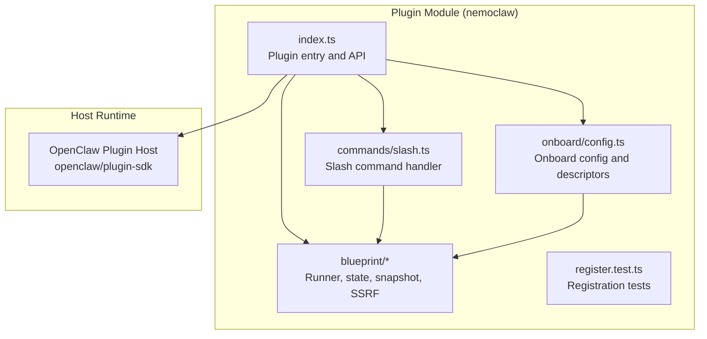
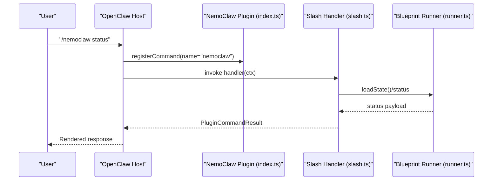
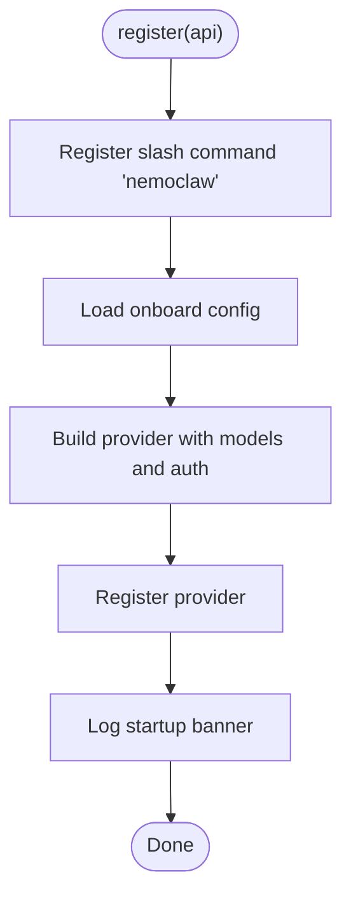
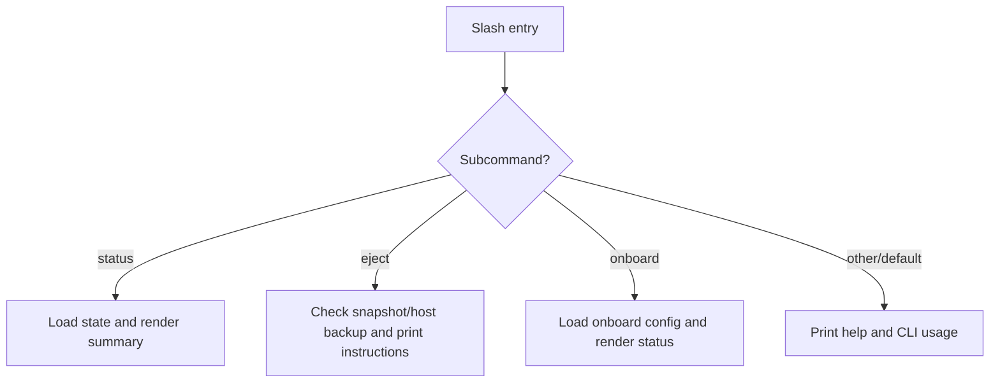
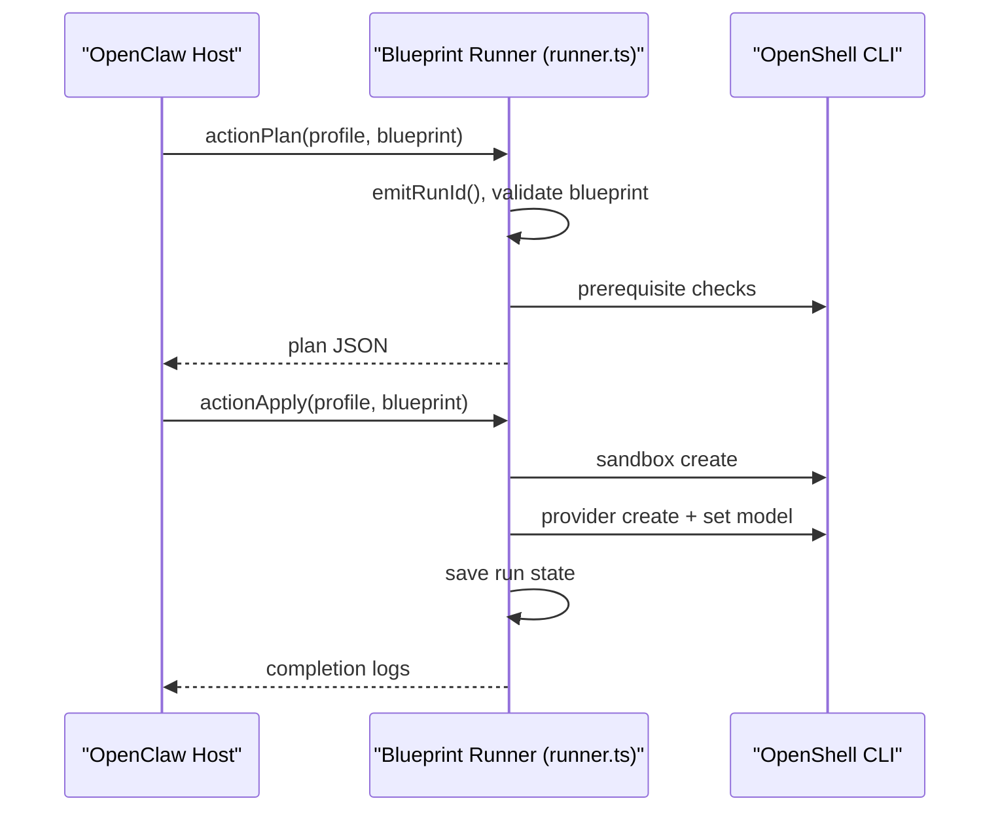
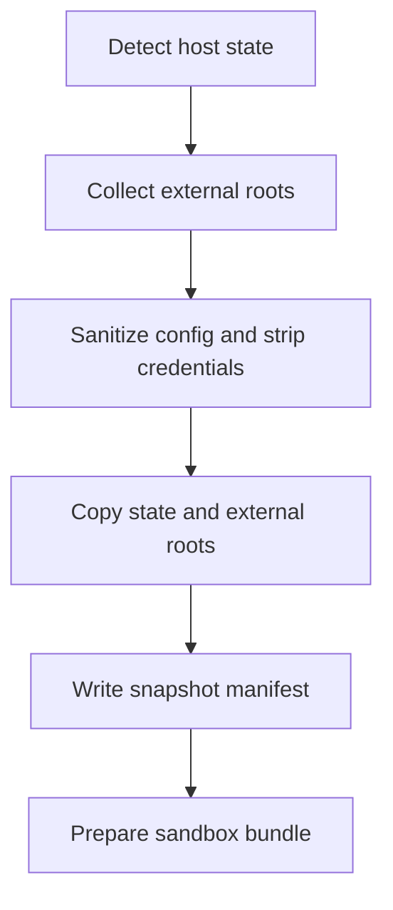
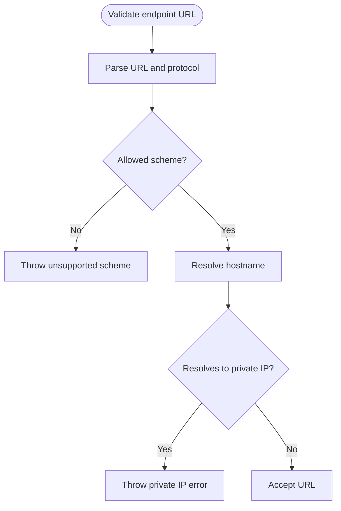
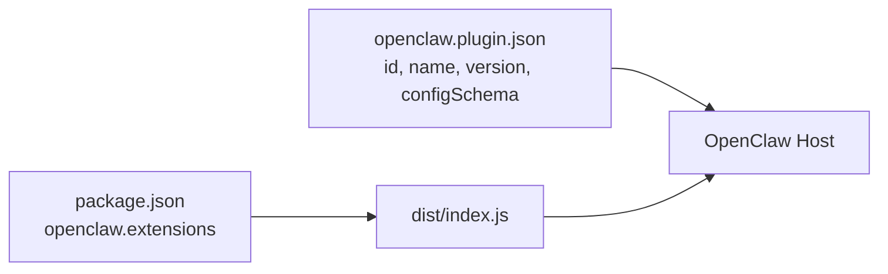
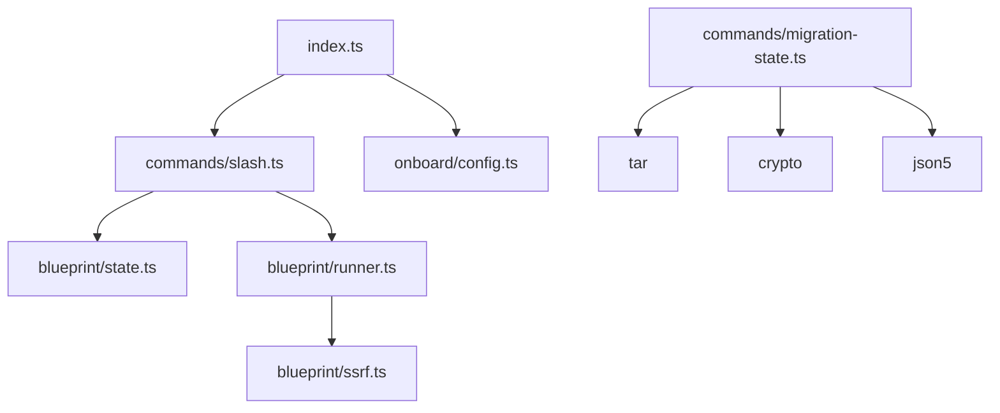

# Plugin Extension System

<cite>
**Referenced Files in This Document**
- [openclaw.plugin.json](file://nemoclaw/openclaw.plugin.json)
- [index.ts](file://nemoclaw/src/index.ts)
- [slash.ts](file://nemoclaw/src/commands/slash.ts)
- [state.ts](file://nemoclaw/src/blueprint/state.ts)
- [runner.ts](file://nemoclaw/src/blueprint/runner.ts)
- [snapshot.ts](file://nemoclaw/src/blueprint/snapshot.ts)
- [ssrf.ts](file://nemoclaw/src/blueprint/ssrf.ts)
- [migration-state.ts](file://nemoclaw/src/commands/migration-state.ts)
- [config.ts](file://nemoclaw/src/onboard/config.ts)
- [register.test.ts](file://nemoclaw/src/register.test.ts)
- [package.json](file://nemoclaw/package.json)
</cite>

## Table of Contents
1. [Introduction](#introduction)
2. [Project Structure](#project-structure)
3. [Core Components](#core-components)
4. [Architecture Overview](#architecture-overview)
5. [Detailed Component Analysis](#detailed-component-analysis)
6. [Dependency Analysis](#dependency-analysis)
7. [Performance Considerations](#performance-considerations)
8. [Troubleshooting Guide](#troubleshooting-guide)
9. [Conclusion](#conclusion)
10. [Appendices](#appendices)

## Introduction
This document explains NemoClaw’s plugin extension system for building custom OpenClaw plugins and extending functionality within OpenShell. It covers the plugin architecture, command registration, state synchronization hooks, lifecycle management, security, performance, and packaging/distribution. It also provides practical guidance for creating custom agents, implementing specialized workflows, integrating with external systems, and maintaining backward compatibility.

## Project Structure
NemoClaw’s plugin module is organized around a small, focused TypeScript surface that registers slash commands, providers, and services with the OpenClaw host, and orchestrates blueprint-driven sandbox lifecycles.

**Diagram sources**
- [index.ts:237-265](file://nemoclaw/src/index.ts#L237-L265)
- [slash.ts:21-37](file://nemoclaw/src/commands/slash.ts#L21-L37)
- [config.ts:91-111](file://nemoclaw/src/onboard/config.ts#L91-L111)
- [runner.ts:395-451](file://nemoclaw/src/blueprint/runner.ts#L395-L451)

**Section sources**
- [index.ts:14-265](file://nemoclaw/src/index.ts#L14-L265)
- [package.json:9-13](file://nemoclaw/package.json#L9-L13)

## Core Components
- Plugin entry and API surface: Defines OpenClaw-compatible types and the plugin registration function that registers slash commands, providers, and services.
- Slash command system: Implements the /nemoclaw command with subcommands for status, eject, and onboard.
- Onboard configuration: Loads and describes onboard settings and provider metadata.
- Blueprint orchestration: Plans, applies, queries status, and rolls back OpenClaw sandboxes via OpenShell.
- State and snapshot management: Persists and restores migration state and sandbox runs.
- Security controls: Validates endpoint URLs and sanitizes credentials during migration.

**Section sources**
- [index.ts:25-123](file://nemoclaw/src/index.ts#L25-L123)
- [slash.ts:21-147](file://nemoclaw/src/commands/slash.ts#L21-L147)
- [config.ts:21-111](file://nemoclaw/src/onboard/config.ts#L21-L111)
- [runner.ts:148-330](file://nemoclaw/src/blueprint/runner.ts#L148-L330)
- [state.ts:9-70](file://nemoclaw/src/blueprint/state.ts#L9-L70)
- [snapshot.ts:57-135](file://nemoclaw/src/blueprint/snapshot.ts#L57-L135)
- [ssrf.ts:118-156](file://nemoclaw/src/blueprint/ssrf.ts#L118-L156)

## Architecture Overview
NemoClaw integrates with OpenClaw via a small, host-defined SDK. The plugin registers:
- Slash commands for chat-style management
- Provider plugins for inference routing
- Services for background tasks

**Diagram sources**
- [index.ts:237-244](file://nemoclaw/src/index.ts#L237-L244)
- [slash.ts:21-37](file://nemoclaw/src/commands/slash.ts#L21-L37)
- [runner.ts:332-360](file://nemoclaw/src/blueprint/runner.ts#L332-L360)

## Detailed Component Analysis

### Plugin Registration and API Surface
- Defines OpenClaw-compatible interfaces for commands, providers, services, and logging.
- Reads plugin configuration from the host and merges defaults.
- Registers:
  - Slash command named “nemoclaw”
  - A managed inference provider with model entries derived from onboard config
  - A startup banner logged to the host

**Diagram sources**
- [index.ts:237-265](file://nemoclaw/src/index.ts#L237-L265)
- [index.ts:178-202](file://nemoclaw/src/index.ts#L178-L202)
- [config.ts:91-111](file://nemoclaw/src/onboard/config.ts#L91-L111)

**Section sources**
- [index.ts:25-123](file://nemoclaw/src/index.ts#L25-L123)
- [index.ts:204-231](file://nemoclaw/src/index.ts#L204-L231)
- [index.ts:237-265](file://nemoclaw/src/index.ts#L237-L265)
- [register.test.ts:45-80](file://nemoclaw/src/register.test.ts#L45-L80)

### Slash Command System
- Subcommands:
  - status: Reports last action, blueprint version, run ID, sandbox name, updated time, and optional rollback snapshot
  - eject: Guides rollback to host installation using stored snapshot/host backup
  - onboard: Summarizes onboard configuration and instructions
  - default: Prints help with usage and CLI equivalents

**Diagram sources**
- [slash.ts:21-37](file://nemoclaw/src/commands/slash.ts#L21-L37)
- [slash.ts:60-84](file://nemoclaw/src/commands/slash.ts#L60-L84)
- [slash.ts:120-146](file://nemoclaw/src/commands/slash.ts#L120-L146)
- [slash.ts:86-118](file://nemoclaw/src/commands/slash.ts#L86-L118)

**Section sources**
- [slash.ts:21-147](file://nemoclaw/src/commands/slash.ts#L21-L147)
- [state.ts:47-61](file://nemoclaw/src/blueprint/state.ts#L47-L61)

### Blueprint Lifecycle Orchestration
- Plan: Emits a run ID, validates blueprint, checks prerequisites, and prints a plan JSON.
- Apply: Creates sandbox, sets up provider and model, persists run state.
- Status: Reads latest run plan or a specific run.
- Rollback: Stops/removes sandbox and marks rollback timestamp.

**Diagram sources**
- [runner.ts:167-210](file://nemoclaw/src/blueprint/runner.ts#L167-L210)
- [runner.ts:212-330](file://nemoclaw/src/blueprint/runner.ts#L212-L330)
- [runner.ts:332-360](file://nemoclaw/src/blueprint/runner.ts#L332-L360)
- [runner.ts:362-391](file://nemoclaw/src/blueprint/runner.ts#L362-L391)

**Section sources**
- [runner.ts:148-330](file://nemoclaw/src/blueprint/runner.ts#L148-L330)
- [runner.ts:332-391](file://nemoclaw/src/blueprint/runner.ts#L332-L391)

### State Synchronization and Migration
- State persistence: Stores last action, blueprint version, run ID, sandbox name, migration snapshot, host backup path, timestamps.
- Migration snapshot/restore: Captures host OpenClaw state, sanitizes credentials, and prepares a sandbox bundle.
- External roots: Detects and migrates external workspaces, agent dirs, and skills directories with symlink preservation.

**Diagram sources**
- [migration-state.ts:376-477](file://nemoclaw/src/commands/migration-state.ts#L376-L477)
- [migration-state.ts:670-743](file://nemoclaw/src/commands/migration-state.ts#L670-L743)
- [migration-state.ts:768-770](file://nemoclaw/src/commands/migration-state.ts#L768-L770)

**Section sources**
- [state.ts:9-70](file://nemoclaw/src/blueprint/state.ts#L9-L70)
- [migration-state.ts:480-550](file://nemoclaw/src/commands/migration-state.ts#L480-L550)
- [migration-state.ts:670-743](file://nemoclaw/src/commands/migration-state.ts#L670-L743)

### Security Controls
- Endpoint URL validation: Ensures allowed schemes, resolves hostnames, rejects private/internal IPs.
- Credential sanitization: Strips sensitive fields and prevents credentials from entering the sandbox bundle.

**Diagram sources**
- [ssrf.ts:118-156](file://nemoclaw/src/blueprint/ssrf.ts#L118-L156)

**Section sources**
- [ssrf.ts:118-156](file://nemoclaw/src/blueprint/ssrf.ts#L118-L156)
- [migration-state.ts:488-550](file://nemoclaw/src/commands/migration-state.ts#L488-L550)

### Plugin Packaging and Distribution
- Package metadata declares the plugin entrypoint and exposes the plugin manifest alongside built JS.
- The manifest defines plugin identity, version, and a JSON Schema for configuration.

**Diagram sources**
- [package.json:9-13](file://nemoclaw/package.json#L9-L13)
- [openclaw.plugin.json:1-33](file://nemoclaw/openclaw.plugin.json#L1-L33)

**Section sources**
- [package.json:9-48](file://nemoclaw/package.json#L9-L48)
- [openclaw.plugin.json:1-33](file://nemoclaw/openclaw.plugin.json#L1-L33)

## Dependency Analysis
- index.ts depends on:
  - slash command handler
  - onboard configuration loader and descriptors
  - blueprint state and runner for status/eject
- slash.ts depends on:
  - onboard configuration and state
  - blueprint runner for status
- runner.ts depends on:
  - execa for OpenShell CLI invocations
  - YAML for blueprint parsing
  - SSRF validator for endpoint safety
- migration-state.ts depends on:
  - tar for archive creation
  - crypto for blueprint digest
  - JSON5 for config parsing

**Diagram sources**
- [index.ts:14-19](file://nemoclaw/src/index.ts#L14-L19)
- [slash.ts:14-19](file://nemoclaw/src/commands/slash.ts#L14-L19)
- [runner.ts:20-21](file://nemoclaw/src/blueprint/runner.ts#L20-L21)
- [migration-state.ts:19-21](file://nemoclaw/src/commands/migration-state.ts#L19-L21)

**Section sources**
- [index.ts:14-19](file://nemoclaw/src/index.ts#L14-L19)
- [slash.ts:14-19](file://nemoclaw/src/commands/slash.ts#L14-L19)
- [runner.ts:20-21](file://nemoclaw/src/blueprint/runner.ts#L20-L21)
- [migration-state.ts:19-21](file://nemoclaw/src/commands/migration-state.ts#L19-L21)

## Performance Considerations
- Minimize synchronous disk I/O in hot paths; batch writes and prefer streaming where possible.
- Cache parsed blueprint configurations and onboard settings to avoid repeated file reads.
- Use incremental status checks and avoid redundant OpenShell invocations.
- Prefer asynchronous operations for long-running tasks and expose progress updates via the runner’s protocol.

## Troubleshooting Guide
Common issues and remedies:
- Missing OpenShell CLI: The runner checks availability and throws a clear error if not present.
- Invalid endpoint URL: SSRF validator enforces allowed schemes and rejects private/internal addresses.
- Missing onboard configuration: Slash “onboard” subcommand detects absence and instructs to run the onboard command.
- Migration failures: Snapshot and rollback logic preserves host state and logs actionable messages.

**Section sources**
- [runner.ts:182-186](file://nemoclaw/src/blueprint/runner.ts#L182-L186)
- [ssrf.ts:118-156](file://nemoclaw/src/blueprint/ssrf.ts#L118-L156)
- [slash.ts:86-118](file://nemoclaw/src/commands/slash.ts#L86-L118)
- [snapshot.ts:112-135](file://nemoclaw/src/blueprint/snapshot.ts#L112-L135)

## Conclusion
NemoClaw’s plugin system offers a concise, secure, and extensible foundation for integrating OpenClaw with OpenShell. By registering commands and providers, orchestrating blueprint lifecycles, and managing state and migrations, developers can build robust agents and workflows. Adhering to security and performance best practices ensures reliable operation in production environments.

## Appendices

### Best Practices for Plugin Development
- Keep command handlers pure and deterministic; delegate side effects to services.
- Validate inputs and enforce schema compliance using the plugin manifest’s config schema.
- Use the runner’s progress and run ID protocols to provide user feedback.
- Sanitize credentials and avoid persisting secrets in state or bundles.

### Security Considerations
- Always validate endpoint URLs and reject private/internal addresses.
- Strip credentials from configuration and bundles; inject at runtime via provider mechanisms.
- Limit file system access to necessary directories and avoid writing outside trusted roots.

### Performance Optimization
- Cache frequently accessed configuration and state.
- Use asynchronous operations for long-running tasks.
- Avoid unnecessary OpenShell invocations; reuse providers and sandboxes when safe.

### Backward Compatibility
- Maintain stable command names and subcommand semantics.
- Preserve state file formats and manifest versions with migration logic.
- Keep plugin manifest fields optional and provide sensible defaults.