# Security Hardening Extensions

<cite>
**Referenced Files in This Document**
- [SECURITY.md](file://SECURITY.md)
- [best-practices.md](file://docs/security/best-practices.md)
- [sandbox-hardening.md](file://docs/deployment/sandbox-hardening.md)
- [customize-network-policy.md](file://docs/network-policy/customize-network-policy.md)
- [monitor-sandbox-activity.md](file://docs/monitoring/monitor-sandbox-activity.md)
- [blueprint.yaml](file://nemoclaw-blueprint/blueprint.yaml)
- [openclaw-sandbox.yaml](file://nemoclaw-blueprint/policies/openclaw-sandbox.yaml)
- [discord.yaml](file://nemoclaw-blueprint/policies/presets/discord.yaml)
- [docker.yaml](file://nemoclaw-blueprint/policies/presets/docker.yaml)
- [services.ts](file://src/lib/services.ts)
- [policies.js](file://bin/lib/policies.js)
- [security-binaries-restriction.test.js](file://test/security-binaries-restriction.test.js)
- [security-c2-dockerfile-injection.test.js](file://test/security-c2-dockerfile-injection.test.js)
- [security-c4-manifest-traversal.test.js](file://test/security-c4-manifest-traversal.test.js)
- [security-method-wildcards.test.js](file://test/security-method-wildcards.test.js)
</cite>

## Table of Contents
1. [Introduction](#introduction)
2. [Project Structure](#project-structure)
3. [Core Components](#core-components)
4. [Architecture Overview](#architecture-overview)
5. [Detailed Component Analysis](#detailed-component-analysis)
6. [Dependency Analysis](#dependency-analysis)
7. [Performance Considerations](#performance-considerations)
8. [Troubleshooting Guide](#troubleshooting-guide)
9. [Conclusion](#conclusion)
10. [Appendices](#appendices)

## Introduction
This document presents advanced security hardening extensions for NemoClaw with enterprise-grade configurations and threat mitigation. It explains custom security policies, advanced network isolation, enhanced credential protection, security monitoring, anomaly detection, and incident response automation. It also covers compliance integration, auditing, risk assessment, zero-trust architectures, advanced sandbox hardening, secure multi-tenant deployments, emerging threat strategies, attack surface reduction, security posture management, and continuous improvement processes.

## Project Structure
NemoClaw’s security posture is implemented across:
- Policy blueprints and presets that define deny-by-default network, filesystem, and process controls
- Runtime enforcement via OpenShell and container hardening
- CLI tooling for policy management, service lifecycle, and monitoring
- Automated tests validating security controls and guarding against regressions

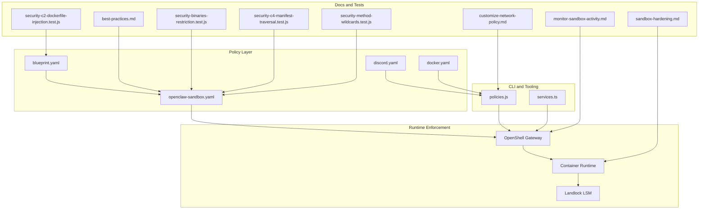

**Diagram sources**
- [blueprint.yaml:1-66](file://nemoclaw-blueprint/blueprint.yaml#L1-L66)
- [openclaw-sandbox.yaml:1-219](file://nemoclaw-blueprint/policies/openclaw-sandbox.yaml#L1-L219)
- [discord.yaml:1-47](file://nemoclaw-blueprint/policies/presets/discord.yaml#L1-L47)
- [docker.yaml:1-46](file://nemoclaw-blueprint/policies/presets/docker.yaml#L1-L46)
- [policies.js:1-353](file://bin/lib/policies.js#L1-L353)
- [services.ts:1-384](file://src/lib/services.ts#L1-L384)
- [best-practices.md:1-510](file://docs/security/best-practices.md#L1-L510)
- [sandbox-hardening.md:1-91](file://docs/deployment/sandbox-hardening.md#L1-L91)
- [customize-network-policy.md:1-130](file://docs/network-policy/customize-network-policy.md#L1-L130)
- [monitor-sandbox-activity.md:1-102](file://docs/monitoring/monitor-sandbox-activity.md#L1-L102)
- [security-binaries-restriction.test.js:1-80](file://test/security-binaries-restriction.test.js#L1-L80)
- [security-c2-dockerfile-injection.test.js:1-370](file://test/security-c2-dockerfile-injection.test.js#L1-L370)
- [security-c4-manifest-traversal.test.js:1-447](file://test/security-c4-manifest-traversal.test.js#L1-L447)
- [security-method-wildcards.test.js:1-34](file://test/security-method-wildcards.test.js#L1-L34)

**Section sources**
- [blueprint.yaml:1-66](file://nemoclaw-blueprint/blueprint.yaml#L1-L66)
- [openclaw-sandbox.yaml:1-219](file://nemoclaw-blueprint/policies/openclaw-sandbox.yaml#L1-L219)
- [policies.js:1-353](file://bin/lib/policies.js#L1-L353)
- [services.ts:1-384](file://src/lib/services.ts#L1-L384)
- [best-practices.md:1-510](file://docs/security/best-practices.md#L1-L510)
- [sandbox-hardening.md:1-91](file://docs/deployment/sandbox-hardening.md#L1-L91)
- [customize-network-policy.md:1-130](file://docs/network-policy/customize-network-policy.md#L1-L130)
- [monitor-sandbox-activity.md:1-102](file://docs/monitoring/monitor-sandbox-activity.md#L1-L102)
- [security-binaries-restriction.test.js:1-80](file://test/security-binaries-restriction.test.js#L1-L80)
- [security-c2-dockerfile-injection.test.js:1-370](file://test/security-c2-dockerfile-injection.test.js#L1-L370)
- [security-c4-manifest-traversal.test.js:1-447](file://test/security-c4-manifest-traversal.test.js#L1-L447)
- [security-method-wildcards.test.js:1-34](file://test/security-method-wildcards.test.js#L1-L34)

## Core Components
- Policy engine and preset management: Applies deny-by-default network policies, merges presets safely, and enforces structured YAML updates.
- Sandbox hardening: Removes unnecessary toolchains, enforces process limits, drops Linux capabilities, and isolates the gateway process.
- Gateway authentication: Enforces device pairing, secure auth derivation, and auto-pair allowlists.
- Monitoring and TUI: Live visibility into sandbox network activity, inference routing, and pending approvals.
- Security regression tests: Guardrails against code injection, path traversal, and overly permissive defaults.

**Section sources**
- [policies.js:1-353](file://bin/lib/policies.js#L1-L353)
- [openclaw-sandbox.yaml:1-219](file://nemoclaw-blueprint/policies/openclaw-sandbox.yaml#L1-L219)
- [sandbox-hardening.md:1-91](file://docs/deployment/sandbox-hardening.md#L1-L91)
- [best-practices.md:363-411](file://docs/security/best-practices.md#L363-L411)
- [monitor-sandbox-activity.md:1-102](file://docs/monitoring/monitor-sandbox-activity.md#L1-L102)
- [security-c2-dockerfile-injection.test.js:1-370](file://test/security-c2-dockerfile-injection.test.js#L1-L370)
- [security-c4-manifest-traversal.test.js:1-447](file://test/security-c4-manifest-traversal.test.js#L1-L447)

## Architecture Overview
The security architecture enforces layered controls across network, filesystem, process, and inference domains. Policies are defined in YAML and enforced by OpenShell at runtime. The CLI manages presets, dynamic policy updates, and auxiliary services like cloudflared and Telegram bridges.

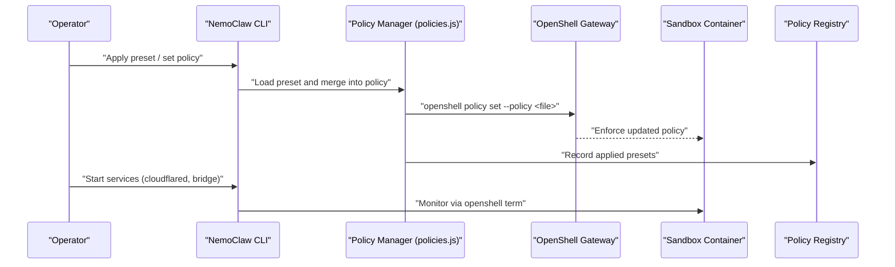

**Diagram sources**
- [policies.js:220-285](file://bin/lib/policies.js#L220-L285)
- [openclaw-sandbox.yaml:46-219](file://nemoclaw-blueprint/policies/openclaw-sandbox.yaml#L46-L219)
- [services.ts:249-366](file://src/lib/services.ts#L249-L366)

**Section sources**
- [policies.js:220-285](file://bin/lib/policies.js#L220-L285)
- [openclaw-sandbox.yaml:46-219](file://nemoclaw-blueprint/policies/openclaw-sandbox.yaml#L46-L219)
- [services.ts:249-366](file://src/lib/services.ts#L249-L366)

## Detailed Component Analysis

### Network Policy Engine and Presets
- Deny-by-default egress with endpoint scoping by binary and HTTP method/path rules
- L4-only vs L7 inspection toggled via protocol field
- Operator approval flow for unlisted endpoints
- Preset-driven integration policies for Discord, Docker, and others

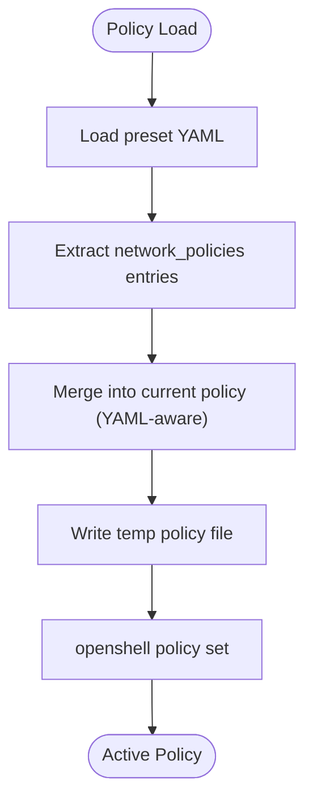

**Diagram sources**
- [policies.js:66-219](file://bin/lib/policies.js#L66-L219)
- [discord.yaml:8-47](file://nemoclaw-blueprint/policies/presets/discord.yaml#L8-L47)
- [docker.yaml:8-46](file://nemoclaw-blueprint/policies/presets/docker.yaml#L8-L46)

**Section sources**
- [customize-network-policy.md:1-130](file://docs/network-policy/customize-network-policy.md#L1-L130)
- [policies.js:66-219](file://bin/lib/policies.js#L66-L219)
- [discord.yaml:8-47](file://nemoclaw-blueprint/policies/presets/discord.yaml#L8-L47)
- [docker.yaml:8-46](file://nemoclaw-blueprint/policies/presets/docker.yaml#L8-L46)

### Sandbox Hardening Controls
- Build-time removal of compilers and network probes
- Runtime process limits and capability drops
- Read-only system paths and immutable gateway config
- PATH hardening and non-root user enforcement

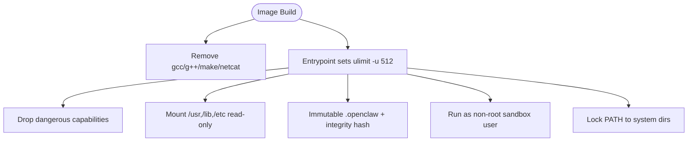

**Diagram sources**
- [sandbox-hardening.md:28-84](file://docs/deployment/sandbox-hardening.md#L28-L84)
- [best-practices.md:210-362](file://docs/security/best-practices.md#L210-L362)

**Section sources**
- [sandbox-hardening.md:28-84](file://docs/deployment/sandbox-hardening.md#L28-L84)
- [best-practices.md:210-362](file://docs/security/best-practices.md#L210-L362)

### Gateway Authentication and Inference Controls
- Device authentication with auto-pair allowlist
- Secure auth derivation based on URL scheme
- Inference routing through gateway to isolate provider credentials

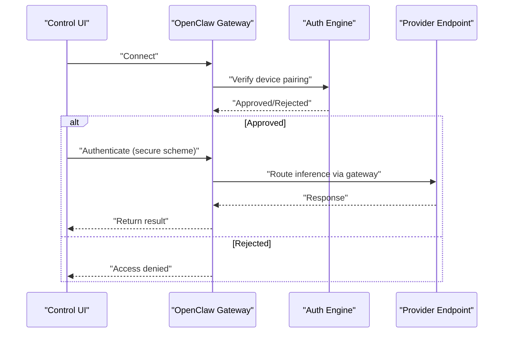

**Diagram sources**
- [best-practices.md:363-427](file://docs/security/best-practices.md#L363-L427)

**Section sources**
- [best-practices.md:363-427](file://docs/security/best-practices.md#L363-L427)

### Monitoring, Anomaly Detection, and Incident Response Automation
- Real-time TUI for sandbox network activity and pending approvals
- Status and logs for health checks and debugging
- Service lifecycle management for auxiliary services (cloudflared, Telegram bridge)

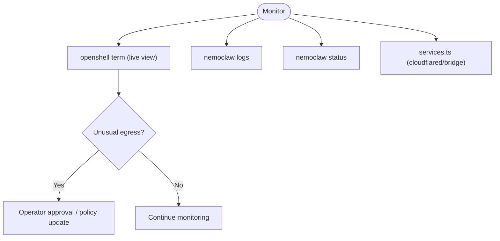

**Diagram sources**
- [monitor-sandbox-activity.md:63-80](file://docs/monitoring/monitor-sandbox-activity.md#L63-L80)
- [services.ts:249-366](file://src/lib/services.ts#L249-L366)

**Section sources**
- [monitor-sandbox-activity.md:1-102](file://docs/monitoring/monitor-sandbox-activity.md#L1-L102)
- [services.ts:249-366](file://src/lib/services.ts#L249-L366)

### Compliance, Auditing, and Risk Assessment
- Risk framework for every configurable control with recommendations
- Posture profiles for locked-down, development, and integration testing scenarios
- Common mistakes and remediation guidance

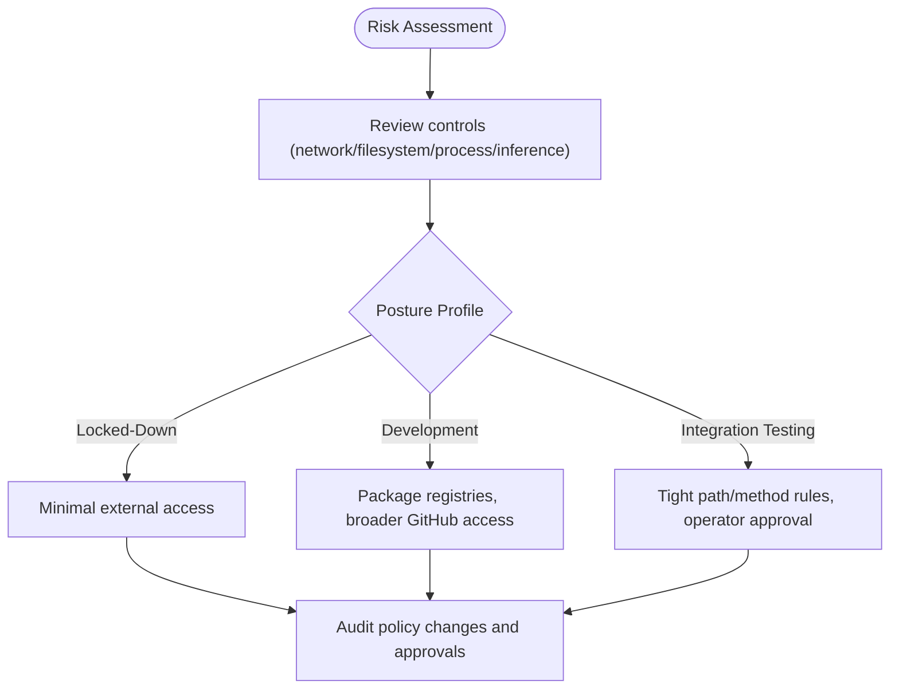

**Diagram sources**
- [best-practices.md:454-487](file://docs/security/best-practices.md#L454-L487)

**Section sources**
- [best-practices.md:454-487](file://docs/security/best-practices.md#L454-L487)

### Zero-Trust Architecture Implementation
- Principle: deny by default with explicit, least-privileged allowances
- Binary-scoped endpoint rules and path-scoped HTTP rules
- L7 inspection for REST APIs with explicit method/path controls
- Operator approval flow for dynamic exceptions

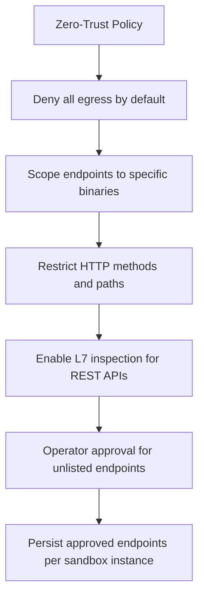

**Diagram sources**
- [best-practices.md:126-191](file://docs/security/best-practices.md#L126-L191)
- [openclaw-sandbox.yaml:46-219](file://nemoclaw-blueprint/policies/openclaw-sandbox.yaml#L46-L219)

**Section sources**
- [best-practices.md:126-191](file://docs/security/best-practices.md#L126-L191)
- [openclaw-sandbox.yaml:46-219](file://nemoclaw-blueprint/policies/openclaw-sandbox.yaml#L46-L219)

### Advanced Sandbox Hardening and Multi-Tenant Security
- Immutable gateway configuration and integrity verification
- Symlink validation and DAC permissions
- Kernel-level Landlock enforcement for filesystem access
- Process isolation and non-root execution

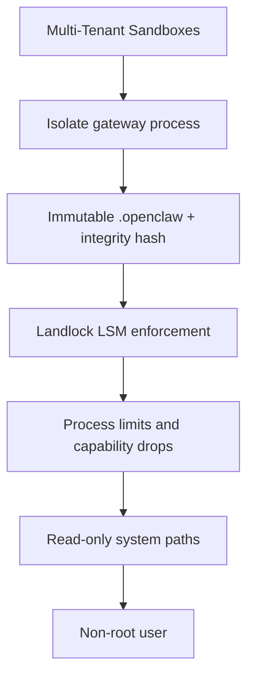

**Diagram sources**
- [best-practices.md:228-362](file://docs/security/best-practices.md#L228-L362)

**Section sources**
- [best-practices.md:228-362](file://docs/security/best-practices.md#L228-L362)

### Emerging Threats and Attack Surface Reduction
- Guardrails against code injection in Dockerfile via environment variables
- Path traversal prevention in snapshot restoration
- Wildcard method restrictions to avoid unintended destructive methods

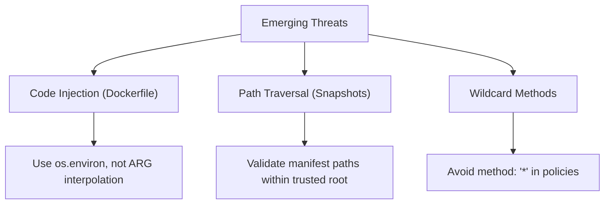

**Diagram sources**
- [security-c2-dockerfile-injection.test.js:135-301](file://test/security-c2-dockerfile-injection.test.js#L135-L301)
- [security-c4-manifest-traversal.test.js:412-446](file://test/security-c4-manifest-traversal.test.js#L412-L446)
- [security-method-wildcards.test.js:16-33](file://test/security-method-wildcards.test.js#L16-L33)

**Section sources**
- [security-c2-dockerfile-injection.test.js:1-370](file://test/security-c2-dockerfile-injection.test.js#L1-L370)
- [security-c4-manifest-traversal.test.js:1-447](file://test/security-c4-manifest-traversal.test.js#L1-L447)
- [security-method-wildcards.test.js:1-34](file://test/security-method-wildcards.test.js#L1-L34)

### Security Testing, Penetration Testing Preparation, and Continuous Improvement
- Automated tests validate policy correctness, injection resistance, and traversal protections
- Security best practices guide posture profiles and common mistakes
- Operational procedures for status, logs, and TUI monitoring

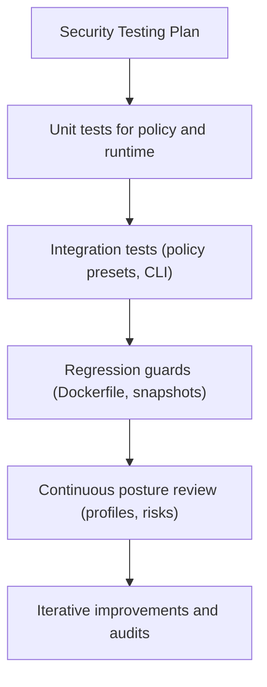

**Diagram sources**
- [security-binaries-restriction.test.js:23-79](file://test/security-binaries-restriction.test.js#L23-L79)
- [security-c2-dockerfile-injection.test.js:135-301](file://test/security-c2-dockerfile-injection.test.js#L135-L301)
- [security-c4-manifest-traversal.test.js:412-446](file://test/security-c4-manifest-traversal.test.js#L412-L446)
- [best-practices.md:488-509](file://docs/security/best-practices.md#L488-L509)

**Section sources**
- [security-binaries-restriction.test.js:1-80](file://test/security-binaries-restriction.test.js#L1-L80)
- [security-c2-dockerfile-injection.test.js:1-370](file://test/security-c2-dockerfile-injection.test.js#L1-L370)
- [security-c4-manifest-traversal.test.js:1-447](file://test/security-c4-manifest-traversal.test.js#L1-L447)
- [best-practices.md:488-509](file://docs/security/best-practices.md#L488-L509)

## Dependency Analysis
- Policy presets depend on structured YAML parsing and safe merging
- Runtime enforcement depends on OpenShell CLI and container runtime settings
- Monitoring depends on OpenShell TUI and service status utilities

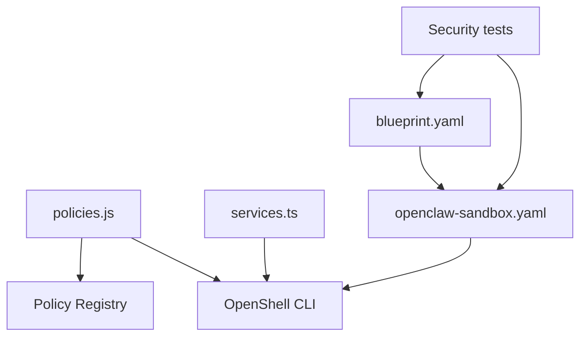

**Diagram sources**
- [policies.js:102-111](file://bin/lib/policies.js#L102-L111)
- [services.ts:265-274](file://src/lib/services.ts#L265-L274)
- [blueprint.yaml:57-66](file://nemoclaw-blueprint/blueprint.yaml#L57-L66)
- [openclaw-sandbox.yaml:46-219](file://nemoclaw-blueprint/policies/openclaw-sandbox.yaml#L46-L219)

**Section sources**
- [policies.js:102-111](file://bin/lib/policies.js#L102-L111)
- [services.ts:265-274](file://src/lib/services.ts#L265-L274)
- [blueprint.yaml:57-66](file://nemoclaw-blueprint/blueprint.yaml#L57-L66)
- [openclaw-sandbox.yaml:46-219](file://nemoclaw-blueprint/policies/openclaw-sandbox.yaml#L46-L219)

## Performance Considerations
- L7 inspection adds CPU overhead; use sparingly on high-throughput endpoints
- Operator approval flow introduces latency; batch approvals for predictable workloads
- Process limits mitigate resource exhaustion; tune ulimits per workload characteristics
- Immutable and integrity-checked configs reduce startup failures and reboots

[No sources needed since this section provides general guidance]

## Troubleshooting Guide
- Use status, logs, and TUI to diagnose sandbox health and network issues
- Validate policy merges and preset applications via CLI and registry
- Investigate service lifecycles for cloudflared and Telegram bridge
- Review security tests to identify misconfigurations or regressions

**Section sources**
- [monitor-sandbox-activity.md:32-95](file://docs/monitoring/monitor-sandbox-activity.md#L32-L95)
- [policies.js:243-252](file://bin/lib/policies.js#L243-L252)
- [services.ts:215-247](file://src/lib/services.ts#L215-L247)

## Conclusion
NemoClaw’s security hardening extensions deliver enterprise-grade protection through deny-by-default policies, robust sandbox hardening, strict gateway authentication, and comprehensive monitoring. The documented posture profiles, compliance guidance, and automated tests enable secure multi-tenant deployments, zero-trust enforcement, and continuous improvement against evolving threats.

[No sources needed since this section summarizes without analyzing specific files]

## Appendices
- Vulnerability reporting and disclosure process
- Reference materials for policy customization and monitoring

**Section sources**
- [SECURITY.md:10-59](file://SECURITY.md#L10-L59)
- [customize-network-policy.md:1-130](file://docs/network-policy/customize-network-policy.md#L1-L130)
- [monitor-sandbox-activity.md:1-102](file://docs/monitoring/monitor-sandbox-activity.md#L1-L102)