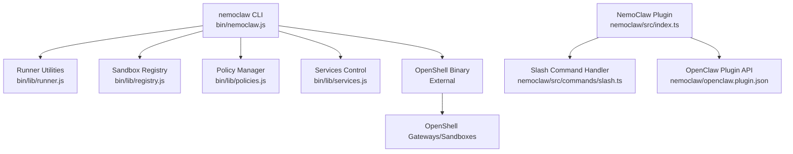
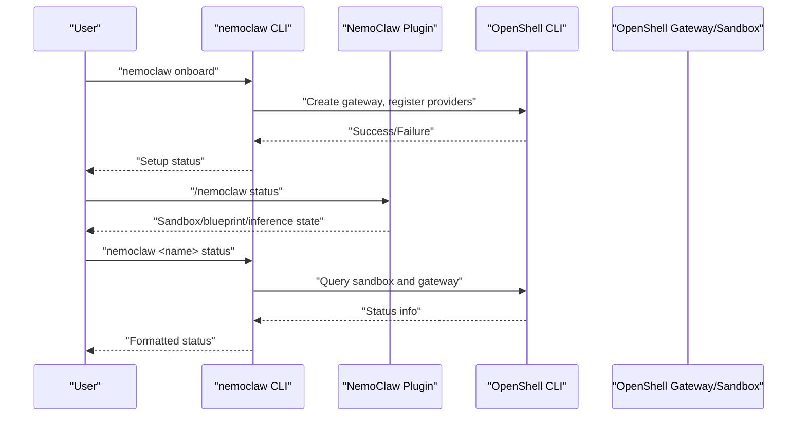
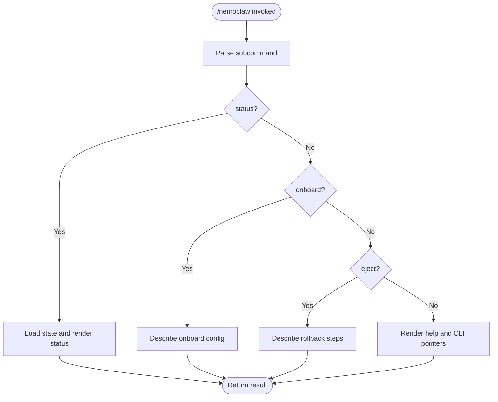
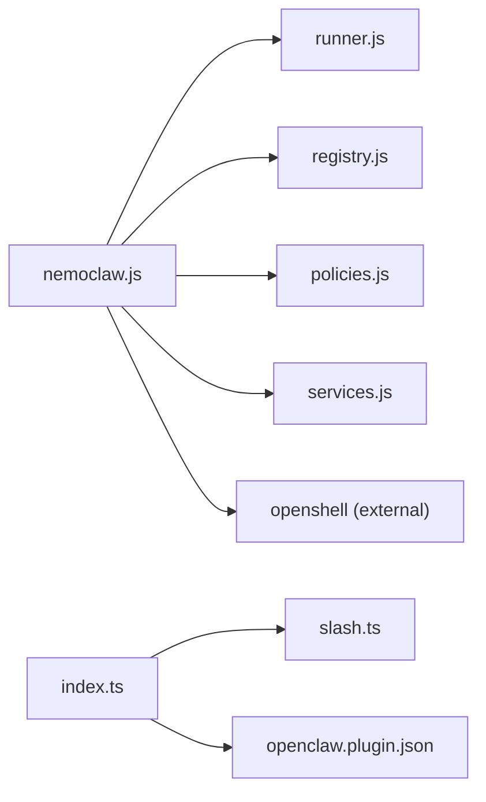

# CLI Reference

<cite>
**Referenced Files in This Document**
- [nemoclaw.js](file://bin/nemoclaw.js)
- [slash.ts](file://nemoclaw/src/commands/slash.ts)
- [index.ts](file://nemoclaw/src/index.ts)
- [openclaw.plugin.json](file://nemoclaw/openclaw.plugin.json)
- [runner.js](file://bin/lib/runner.js)
- [policies.js](file://bin/lib/policies.js)
- [registry.js](file://bin/lib/registry.js)
- [services.js](file://bin/lib/services.js)
- [commands.md](file://docs/reference/commands.md)
</cite>

## Table of Contents
1. [Introduction](#introduction)
2. [Project Structure](#project-structure)
3. [Core Components](#core-components)
4. [Architecture Overview](#architecture-overview)
5. [Detailed Component Analysis](#detailed-component-analysis)
6. [Dependency Analysis](#dependency-analysis)
7. [Performance Considerations](#performance-considerations)
8. [Troubleshooting Guide](#troubleshooting-guide)
9. [Conclusion](#conclusion)
10. [Appendices](#appendices)

## Introduction
This CLI reference documents the complete NemoClaw command-line interface, covering installation and setup, sandbox management, policy presets, service operations, slash command integration with OpenClaw plugins, provider switching, and workspace-related workflows. It explains command syntax, parameters, flags, return values, output formatting, error handling, and debugging techniques. Practical examples demonstrate common workflows such as agent interaction, log monitoring, and troubleshooting.

## Project Structure
NemoClaw’s CLI is implemented as a Node.js binary that orchestrates OpenShell commands and manages local state. The CLI delegates to OpenClaw plugins for slash command support and integrates with OpenShell gateways and sandboxes for runtime operations.

**Diagram sources**
- [nemoclaw.js:1308-1420](file://bin/nemoclaw.js#L1308-L1420)
- [runner.js:16-77](file://bin/lib/runner.js#L16-L77)
- [registry.js:123-227](file://bin/lib/registry.js#L123-L227)
- [policies.js:21-353](file://bin/lib/policies.js#L21-L353)
- [services.js:1-6](file://bin/lib/services.js#L1-L6)
- [slash.ts:21-37](file://nemoclaw/src/commands/slash.ts#L21-L37)
- [index.ts:237-265](file://nemoclaw/src/index.ts#L237-L265)
- [openclaw.plugin.json:1-33](file://nemoclaw/openclaw.plugin.json#L1-L33)

**Section sources**
- [nemoclaw.js:1308-1420](file://bin/nemoclaw.js#L1308-L1420)
- [runner.js:16-77](file://bin/lib/runner.js#L16-L77)
- [registry.js:123-227](file://bin/lib/registry.js#L123-L227)
- [policies.js:21-353](file://bin/lib/policies.js#L21-L353)
- [services.js:1-6](file://bin/lib/services.js#L1-L6)
- [slash.ts:21-37](file://nemoclaw/src/commands/slash.ts#L21-L37)
- [index.ts:237-265](file://nemoclaw/src/index.ts#L237-L265)
- [openclaw.plugin.json:1-33](file://nemoclaw/openclaw.plugin.json#L1-L33)

## Core Components
- CLI entry and dispatch: Routes commands to global or sandbox-scoped actions.
- OpenShell integration: Delegates sandbox operations to the OpenShell CLI.
- Plugin and slash commands: Registers slash commands and handlers for OpenClaw chat.
- Policy presets: Lists, loads, merges, and applies policy presets to sandboxes.
- Registry: Manages local sandbox metadata and default selection.
- Services: Starts/stops auxiliary services (e.g., Telegram bridge).
- Runner utilities: Executes commands, captures output, redacts secrets, validates names.

**Section sources**
- [nemoclaw.js:1308-1420](file://bin/nemoclaw.js#L1308-L1420)
- [slash.ts:21-37](file://nemoclaw/src/commands/slash.ts#L21-L37)
- [index.ts:237-265](file://nemoclaw/src/index.ts#L237-L265)
- [policies.js:21-353](file://bin/lib/policies.js#L21-L353)
- [registry.js:123-227](file://bin/lib/registry.js#L123-L227)
- [services.js:1-6](file://bin/lib/services.js#L1-L6)
- [runner.js:16-77](file://bin/lib/runner.js#L16-L77)

## Architecture Overview
The CLI orchestrates OpenShell commands and maintains local state. Slash commands integrate with OpenClaw plugins to surface quick actions in chat.

**Diagram sources**
- [nemoclaw.js:780-796](file://bin/nemoclaw.js#L780-L796)
- [slash.ts:60-84](file://nemoclaw/src/commands/slash.ts#L60-L84)
- [nemoclaw.js:1024-1136](file://bin/nemoclaw.js#L1024-L1136)

**Section sources**
- [nemoclaw.js:780-796](file://bin/nemoclaw.js#L780-L796)
- [slash.ts:60-84](file://nemoclaw/src/commands/slash.ts#L60-L84)
- [nemoclaw.js:1024-1136](file://bin/nemoclaw.js#L1024-L1136)

## Detailed Component Analysis

### Slash Command System
- Command: `/nemoclaw`
- Subcommands:
  - `status`: Show sandbox, blueprint, and inference state.
  - `onboard`: Show onboarding status and instructions.
  - `eject`: Show rollback instructions.
- Output: Rich-text response suitable for chat clients.

**Diagram sources**
- [slash.ts:21-37](file://nemoclaw/src/commands/slash.ts#L21-L37)
- [slash.ts:39-58](file://nemoclaw/src/commands/slash.ts#L39-L58)
- [slash.ts:60-84](file://nemoclaw/src/commands/slash.ts#L60-L84)
- [slash.ts:86-118](file://nemoclaw/src/commands/slash.ts#L86-L118)
- [slash.ts:120-146](file://nemoclaw/src/commands/slash.ts#L120-L146)

**Section sources**
- [slash.ts:21-37](file://nemoclaw/src/commands/slash.ts#L21-L37)
- [slash.ts:39-58](file://nemoclaw/src/commands/slash.ts#L39-L58)
- [slash.ts:60-84](file://nemoclaw/src/commands/slash.ts#L60-L84)
- [slash.ts:86-118](file://nemoclaw/src/commands/slash.ts#L86-L118)
- [slash.ts:120-146](file://nemoclaw/src/commands/slash.ts#L120-L146)
- [index.ts:237-265](file://nemoclaw/src/index.ts#L237-L265)
- [openclaw.plugin.json:1-33](file://nemoclaw/openclaw.plugin.json#L1-L33)

### Global Commands
- `nemoclaw help`, `nemoclaw --help`, `nemoclaw -h`: Show top-level usage and command groups.
- `nemoclaw --version`, `nemoclaw -v`: Print installed CLI version.
- `nemoclaw onboard`: Run interactive setup wizard; supports non-interactive mode and third-party software consent.
- `nemoclaw list`: List registered sandboxes with model, provider, GPU flag, and applied policy presets.
- `nemoclaw deploy <instance-name>`: Deprecated; compatibility wrapper for remote provisioning.
- `nemoclaw start`: Start auxiliary services (e.g., Telegram bridge).
- `nemoclaw stop`: Stop all auxiliary services.
- `nemoclaw status`: Show sandbox list and service status.
- `nemoclaw debug [--quick] [--sandbox NAME] [--output PATH]`: Collect diagnostics; optional quick mode and output tarball.
- `nemoclaw uninstall [--yes] [--keep-openshell] [--delete-models]`: Run uninstall script; supports flags to skip prompts and preserve OpenShell binary.

Return values and behavior:
- Exit codes: Non-zero on failure; errors are printed to stderr.
- Output: Human-readable status, lists, and formatted diagnostics.

**Section sources**
- [nemoclaw.js:1258-1304](file://bin/nemoclaw.js#L1258-L1304)
- [nemoclaw.js:1311-1361](file://bin/nemoclaw.js#L1311-L1361)
- [nemoclaw.js:834-848](file://bin/nemoclaw.js#L834-L848)
- [nemoclaw.js:850-893](file://bin/nemoclaw.js#L850-L893)
- [nemoclaw.js:895-935](file://bin/nemoclaw.js#L895-L935)
- [nemoclaw.js:937-957](file://bin/nemoclaw.js#L937-L957)
- [nemoclaw.js:959-1008](file://bin/nemoclaw.js#L959-L1008)
- [nemoclaw.js:780-796](file://bin/nemoclaw.js#L780-L796)

### Sandbox Management Operations
- `nemoclaw <name> connect`: Connect to a sandbox; ensures live sandbox and recovers OpenClaw gateway if needed.
- `nemoclaw <name> status`: Show sandbox model/provider/GPU/policies; reconcile with live gateway; report OpenClaw and NIM status.
- `nemoclaw <name> logs [--follow]`: View sandbox logs; streaming supported when OpenShell version meets minimum requirement.
- `nemoclaw <name> destroy [--yes]`: Stop NIM and delete sandbox; optional confirmation bypass; cleanup gateway when last sandbox is removed.

Behavior highlights:
- Gateway reconciliation: Detects missing, unreachable, or identity-drift scenarios and provides recovery guidance.
- OpenClaw process recovery: Restarts gateway inside sandbox when pod restarts.
- NIM container management: Stops NIM before deletion; cleans up gateway resources when last sandbox is destroyed.

**Section sources**
- [nemoclaw.js:1012-1021](file://bin/nemoclaw.js#L1012-L1021)
- [nemoclaw.js:1024-1136](file://bin/nemoclaw.js#L1024-L1136)
- [nemoclaw.js:1138-1179](file://bin/nemoclaw.js#L1138-L1179)
- [nemoclaw.js:1208-1254](file://bin/nemoclaw.js#L1208-L1254)

### Policy Management Commands
- `nemoclaw <name> policy-add`: Interactively select and apply a policy preset to a sandbox; merges YAML entries and updates registry.
- `nemoclaw <name> policy-list`: List available presets and mark applied ones.

Workflow:
- Lists presets from blueprint policies directory.
- Parses current policy, merges preset entries, writes temporary policy, applies via OpenShell, and updates registry.

**Section sources**
- [nemoclaw.js:1181-1193](file://bin/nemoclaw.js#L1181-L1193)
- [nemoclaw.js:1195-1206](file://bin/nemoclaw.js#L1195-L1206)
- [policies.js:21-353](file://bin/lib/policies.js#L21-L353)

### Service Operations
- `nemoclaw start`: Start auxiliary services using the default sandbox name if available.
- `nemoclaw stop`: Stop all services using the default sandbox name if available.
- `nemoclaw status`: Show sandbox list and service status.

Notes:
- Service control depends on service definitions and environment variables (e.g., Telegram bot token).

**Section sources**
- [nemoclaw.js:834-848](file://bin/nemoclaw.js#L834-L848)
- [nemoclaw.js:937-957](file://bin/nemoclaw.js#L937-L957)
- [services.js:1-6](file://bin/lib/services.js#L1-L6)

### Provider Switching and Inference Configuration
- The plugin registers a managed inference provider with configurable model entries and authentication.
- Provider selection and model configuration are derived from onboard configuration and plugin settings.

Operational impact:
- Changing provider affects sandbox inference configuration and may require re-running onboard to refresh credentials and endpoints.

**Section sources**
- [index.ts:178-202](file://nemoclaw/src/index.ts#L178-L202)
- [index.ts:211-231](file://nemoclaw/src/index.ts#L211-L231)
- [openclaw.plugin.json:6-31](file://nemoclaw/openclaw.plugin.json#L6-L31)

### Workspace Management Operations
- Workspace files (e.g., SOUL.md, USER.md, IDENTITY.md, AGENTS.md, MEMORY.md, daily notes) reside inside sandboxes.
- Destruction of a sandbox permanently removes workspace files; back up before destructive operations.

Practical guidance:
- Back up workspace before running `nemoclaw <name> destroy`.
- Use `nemoclaw <name> logs [--follow]` to monitor sandbox activity and troubleshoot.

**Section sources**
- [nemoclaw.js:159-167](file://bin/nemoclaw.js#L159-L167)
- [nemoclaw.js:1138-1179](file://bin/nemoclaw.js#L1138-L1179)

### Command Syntax and Flags Summary
- Global commands:
  - `nemoclaw onboard [--non-interactive] [--resume] [--accept-third-party-software]`
  - `nemoclaw debug [--quick] [--sandbox NAME] [--output PATH]`
  - `nemoclaw uninstall [--yes] [--keep-openshell] [--delete-models]`
- Sandbox-scoped commands:
  - `nemoclaw <name> connect`
  - `nemoclaw <name> status`
  - `nemoclaw <name> logs [--follow]`
  - `nemoclaw <name> destroy [--yes]`
  - `nemoclaw <name> policy-add`
  - `nemoclaw <name> policy-list`

Return values:
- Exit status 0 on success; non-zero on failure.
- Errors written to stderr; warnings and guidance printed to stdout.

**Section sources**
- [nemoclaw.js:780-796](file://bin/nemoclaw.js#L780-L796)
- [nemoclaw.js:850-893](file://bin/nemoclaw.js#L850-L893)
- [nemoclaw.js:895-935](file://bin/nemoclaw.js#L895-L935)
- [nemoclaw.js:1012-1021](file://bin/nemoclaw.js#L1012-L1021)
- [nemoclaw.js:1024-1136](file://bin/nemoclaw.js#L1024-L1136)
- [nemoclaw.js:1138-1179](file://bin/nemoclaw.js#L1138-L1179)
- [nemoclaw.js:1208-1254](file://bin/nemoclaw.js#L1208-L1254)
- [nemoclaw.js:1181-1193](file://bin/nemoclaw.js#L1181-L1193)
- [nemoclaw.js:1195-1206](file://bin/nemoclaw.js#L1195-L1206)

## Dependency Analysis
- CLI depends on:
  - Runner utilities for command execution, output redaction, and name validation.
  - Registry for sandbox metadata and default selection.
  - Policies for preset management and YAML merging.
  - Services for auxiliary service control.
  - OpenShell binary for sandbox and gateway operations.

**Diagram sources**
- [nemoclaw.js:1308-1420](file://bin/nemoclaw.js#L1308-L1420)
- [runner.js:16-77](file://bin/lib/runner.js#L16-L77)
- [registry.js:123-227](file://bin/lib/registry.js#L123-L227)
- [policies.js:21-353](file://bin/lib/policies.js#L21-L353)
- [services.js:1-6](file://bin/lib/services.js#L1-L6)
- [slash.ts:21-37](file://nemoclaw/src/commands/slash.ts#L21-L37)
- [index.ts:237-265](file://nemoclaw/src/index.ts#L237-L265)
- [openclaw.plugin.json:1-33](file://nemoclaw/openclaw.plugin.json#L1-L33)

**Section sources**
- [nemoclaw.js:1308-1420](file://bin/nemoclaw.js#L1308-L1420)
- [runner.js:16-77](file://bin/lib/runner.js#L16-L77)
- [registry.js:123-227](file://bin/lib/registry.js#L123-L227)
- [policies.js:21-353](file://bin/lib/policies.js#L21-L353)
- [services.js:1-6](file://bin/lib/services.js#L1-L6)
- [slash.ts:21-37](file://nemoclaw/src/commands/slash.ts#L21-L37)
- [index.ts:237-265](file://nemoclaw/src/index.ts#L237-L265)
- [openclaw.plugin.json:1-33](file://nemoclaw/openclaw.plugin.json#L1-L33)

## Performance Considerations
- Streaming logs: Use `--follow` to reduce latency and resource usage compared to repeated polling.
- Gateway reconciliation: Minimizes repeated OpenShell calls by caching and reusing results where appropriate.
- Policy merging: Uses structured YAML parsing to avoid invalid output and reduce manual post-processing.

[No sources needed since this section provides general guidance]

## Troubleshooting Guide
Common scenarios and resolutions:
- Gateway unreachable after restart: Reattach or rebuild the gateway; recreate affected sandbox if necessary.
- Identity drift after restart: Recreate sandbox after stabilizing gateway runtime.
- Old OpenShell version: Upgrade OpenShell to meet minimum logs version; otherwise, use compatibility guidance.
- Destroying a sandbox: Back up workspace first; destruction is permanent.

Diagnostic collection:
- Use `nemoclaw debug [--quick] [--output PATH] [--sandbox NAME]` to gather system info, Docker state, gateway logs, and sandbox status.

Secret redaction:
- Output is redacted to prevent accidental exposure of credentials and tokens.

**Section sources**
- [nemoclaw.js:674-740](file://bin/nemoclaw.js#L674-L740)
- [nemoclaw.js:718-740](file://bin/nemoclaw.js#L718-L740)
- [nemoclaw.js:1138-1179](file://bin/nemoclaw.js#L1138-L1179)
- [nemoclaw.js:850-893](file://bin/nemoclaw.js#L850-L893)
- [runner.js:84-154](file://bin/lib/runner.js#L84-L154)

## Conclusion
NemoClaw’s CLI provides a unified interface for onboarding, sandbox lifecycle management, policy application, service control, and troubleshooting. Its integration with OpenClaw plugins and OpenShell enables seamless agent interaction and robust runtime operations. Use the slash command system for quick actions in chat and the sandbox-scoped commands for detailed management.

[No sources needed since this section summarizes without analyzing specific files]

## Appendices

### Quick Reference Tables
- Global commands
  - `nemoclaw help`, `nemoclaw --help`, `nemoclaw -h`
  - `nemoclaw --version`, `nemoclaw -v`
  - `nemoclaw onboard [--non-interactive] [--resume] [--accept-third-party-software]`
  - `nemoclaw list`
  - `nemoclaw deploy <instance-name>`
  - `nemoclaw start`
  - `nemoclaw stop`
  - `nemoclaw status`
  - `nemoclaw debug [--quick] [--sandbox NAME] [--output PATH]`
  - `nemoclaw uninstall [--yes] [--keep-openshell] [--delete-models]`
- Sandbox-scoped commands
  - `nemoclaw <name> connect`
  - `nemoclaw <name> status`
  - `nemoclaw <name> logs [--follow]`
  - `nemoclaw <name> destroy [--yes]`
  - `nemoclaw <name> policy-add`
  - `nemoclaw <name> policy-list`

**Section sources**
- [nemoclaw.js:1258-1304](file://bin/nemoclaw.js#L1258-L1304)
- [nemoclaw.js:1311-1361](file://bin/nemoclaw.js#L1311-L1361)
- [nemoclaw.js:1012-1021](file://bin/nemoclaw.js#L1012-L1021)
- [nemoclaw.js:1024-1136](file://bin/nemoclaw.js#L1024-L1136)
- [nemoclaw.js:1138-1179](file://bin/nemoclaw.js#L1138-L1179)
- [nemoclaw.js:1208-1254](file://bin/nemoclaw.js#L1208-L1254)
- [nemoclaw.js:1181-1193](file://bin/nemoclaw.js#L1181-L1193)
- [nemoclaw.js:1195-1206](file://bin/nemoclaw.js#L1195-L1206)

### Practical Workflows
- Agent interaction: Use `/nemoclaw status` for quick state checks; `/nemoclaw eject` for rollback guidance.
- Log monitoring: Use `nemoclaw <name> logs [--follow]` to stream sandbox logs; ensure OpenShell meets minimum version.
- Troubleshooting: Run `nemoclaw debug [--quick] [--output PATH] [--sandbox NAME]` to collect diagnostics; follow gateway lifecycle hints for recovery.

**Section sources**
- [slash.ts:60-84](file://nemoclaw/src/commands/slash.ts#L60-L84)
- [slash.ts:120-146](file://nemoclaw/src/commands/slash.ts#L120-L146)
- [nemoclaw.js:1138-1179](file://bin/nemoclaw.js#L1138-L1179)
- [nemoclaw.js:850-893](file://bin/nemoclaw.js#L850-L893)
- [nemoclaw.js:563-613](file://bin/nemoclaw.js#L563-L613)