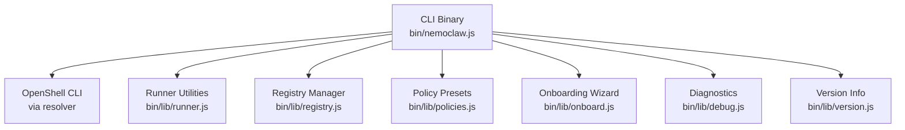
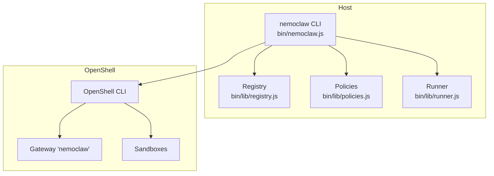
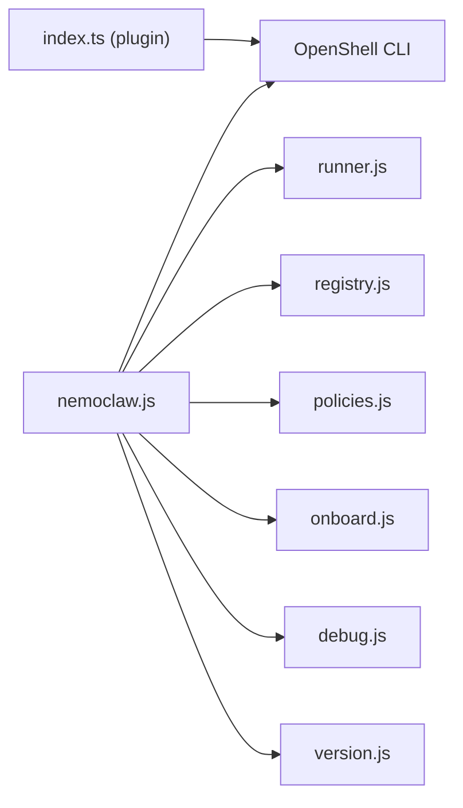

# Global Commands

<cite>
**Referenced Files in This Document**
- [nemoclaw.js](file://bin/nemoclaw.js)
- [commands.md](file://docs/reference/commands.md)
- [troubleshooting.md](file://docs/reference/troubleshooting.md)
- [onboard.js](file://bin/lib/onboard.js)
- [runner.js](file://bin/lib/runner.js)
- [registry.js](file://bin/lib/registry.js)
- [policies.js](file://bin/lib/policies.js)
- [index.ts](file://nemoclaw/src/index.ts)
</cite>

## Table of Contents
1. [Introduction](#introduction)
2. [Project Structure](#project-structure)
3. [Core Components](#core-components)
4. [Architecture Overview](#architecture-overview)
5. [Detailed Component Analysis](#detailed-component-analysis)
6. [Dependency Analysis](#dependency-analysis)
7. [Performance Considerations](#performance-considerations)
8. [Troubleshooting Guide](#troubleshooting-guide)
9. [Conclusion](#conclusion)

## Introduction
This document describes NemoClaw’s top-level command interface and global commands. It explains command syntax, parameters, flags, return values, output formatting, error handling, and debugging techniques. It also covers command precedence, environment variable dependencies, and integration with the OpenShell gateway.

## Project Structure
NemoClaw’s CLI is implemented as a Node.js program that orchestrates OpenShell operations and manages local state. The primary entry point defines the supported global commands and dispatches to specialized libraries for onboarding, registry management, policy presets, and diagnostics.

**Diagram sources**
- [nemoclaw.js:47-63](file://bin/nemoclaw.js#L47-L63)
- [runner.js:197-207](file://bin/lib/runner.js#L197-L207)
- [registry.js:247-263](file://bin/lib/registry.js#L247-L263)
- [policies.js:339-353](file://bin/lib/policies.js#L339-L353)
- [onboard.js:586-596](file://bin/lib/onboard.js#L586-L596)
- [index.ts:237-266](file://nemoclaw/src/index.ts#L237-L266)

**Section sources**
- [nemoclaw.js:47-63](file://bin/nemoclaw.js#L47-L63)
- [runner.js:197-207](file://bin/lib/runner.js#L197-L207)
- [registry.js:247-263](file://bin/lib/registry.js#L247-L263)
- [policies.js:339-353](file://bin/lib/policies.js#L339-L353)
- [onboard.js:586-596](file://bin/lib/onboard.js#L586-L596)
- [index.ts:237-266](file://nemoclaw/src/index.ts#L237-L266)

## Core Components
- Global command registry: Defines supported commands and aliases.
- OpenShell integration: Executes OpenShell subcommands and interprets results.
- Local state management: Persists sandbox metadata and default selection.
- Diagnostics: Captures system and gateway state for troubleshooting.
- Versioning: Reports installed NemoClaw version.

Key behaviors:
- Command dispatch validates arguments and delegates to appropriate handlers.
- OpenShell availability is enforced; missing binaries cause immediate exit.
- Sensitive output is redacted to protect secrets.

**Section sources**
- [nemoclaw.js:47-63](file://bin/nemoclaw.js#L47-L63)
- [nemoclaw.js:72-81](file://bin/nemoclaw.js#L72-L81)
- [runner.js:84-154](file://bin/lib/runner.js#L84-L154)

## Architecture Overview
The CLI wraps OpenShell to manage the NemoClaw gateway and sandboxes. It also maintains a local registry of sandboxes and supports policy preset application. The plugin registers slash commands and inference providers at runtime.

**Diagram sources**
- [nemoclaw.js:83-95](file://bin/nemoclaw.js#L83-L95)
- [nemoclaw.js:110-117](file://bin/nemoclaw.js#L110-L117)
- [registry.js:154-227](file://bin/lib/registry.js#L154-L227)
- [policies.js:220-285](file://bin/lib/policies.js#L220-L285)

## Detailed Component Analysis

### onboard
Purpose: Interactive setup wizard to create the OpenShell gateway, configure inference providers, build the sandbox image, and create the sandbox. Supports non-interactive mode and third-party consent.

Syntax
- nemoclaw onboard
- Flags:
  - --non-interactive
  - --resume
  - Accept third-party notice via flag or environment variable

Behavior
- Validates prerequisites and Docker connectivity.
- Prompts for provider selection and credentials (stored securely).
- Streams progress for image build, upload, sandbox creation, and readiness.
- On success, registers the sandbox in the local registry and sets it as default if none exists.

Output formatting
- Progress messages indicate build, upload, create, and ready phases.
- Final success confirms sandbox readiness and lists applied presets.

Error handling
- Exits on prerequisite failures (e.g., Docker not reachable).
- Provides remediation guidance for common issues (e.g., ports in use, low memory).
- On transport or credential errors, suggests retry or alternative provider.

Return values
- Exits with process status; successful onboarding sets up gateway and sandbox.

Practical examples
- Initial setup: nemoclaw onboard
- Non-interactive with consent: nemoclaw onboard --non-interactive --yes-i-accept-third-party-software
- Resume interrupted onboarding: nemoclaw onboard --resume

Integration with OpenShell
- Starts gateway cluster, waits for health, and creates sandbox via OpenShell commands.
- Applies policy presets and registers inference providers.

Environment variables
- NEMOCLAW_ACCEPT_THIRD_PARTY_SOFTWARE=1
- BRAVE_API_KEY (enables Brave Search and web fetch)
- Provider-specific keys (e.g., NVIDIA_API_KEY)

**Section sources**
- [nemoclaw.js:780-796](file://bin/nemoclaw.js#L780-L796)
- [onboard.js:586-596](file://bin/lib/onboard.js#L586-L596)
- [onboard.js:236-440](file://bin/lib/onboard.js#L236-L440)
- [onboard.js:442-565](file://bin/lib/onboard.js#L442-L565)
- [commands.md:59-106](file://docs/reference/commands.md#L59-L106)
- [troubleshooting.md:122-178](file://docs/reference/troubleshooting.md#L122-L178)

### list
Purpose: List registered sandboxes with model, provider, and policy presets.

Syntax
- nemoclaw list

Behavior
- Reads local registry and prints sandbox entries.

Output formatting
- Tabular or list-like presentation of sandbox metadata.

Return values
- Prints entries; exits with success status.

Practical examples
- View all sandboxes: nemoclaw list

**Section sources**
- [registry.js:220-227](file://bin/lib/registry.js#L220-L227)
- [commands.md:107-114](file://docs/reference/commands.md#L107-L114)

### deploy
Purpose: Deprecated. Use standard installer and onboard on the target host.

Syntax
- nemoclaw deploy <instance-name>

Behavior
- Compatibility wrapper for older Brev-specific flow.

Return values
- Exits with deprecation notice.

Practical examples
- Prefer standard installer and nemoclaw onboard on the remote host.

**Section sources**
- [commands.md:115-128](file://docs/reference/commands.md#L115-L128)

### setup
Purpose: Deprecated alias for onboard.

Syntax
- nemoclaw setup

Behavior
- Delegates to onboard with a deprecation notice.

Return values
- Exits with success after delegating.

**Section sources**
- [nemoclaw.js:798-801](file://bin/nemoclaw.js#L798-L801)
- [commands.md:267-275](file://docs/reference/commands.md#L267-L275)

### start
Purpose: Start auxiliary services (e.g., Telegram bridge, cloudflared tunnel).

Syntax
- nemoclaw start

Behavior
- Requires TELEGRAM_BOT_TOKEN for Telegram bridge.

Return values
- Exits with success or failure depending on service startup.

**Section sources**
- [commands.md:197-204](file://docs/reference/commands.md#L197-L204)

### stop
Purpose: Stop auxiliary services.

Syntax
- nemoclaw stop

Return values
- Exits with success or failure depending on service shutdown.

**Section sources**
- [commands.md:207-214](file://docs/reference/commands.md#L207-L214)

### status
Purpose: Show sandbox list and auxiliary service status.

Syntax
- nemoclaw status

Return values
- Prints status summary; exits with success.

**Section sources**
- [commands.md:215-222](file://docs/reference/commands.md#L215-L222)

### debug
Purpose: Collect diagnostics for bug reports.

Syntax
- nemoclaw debug [--quick] [--sandbox NAME] [--output PATH]

Flags
- --quick: Minimal diagnostics
- --sandbox NAME: Target specific sandbox
- --output PATH: Write tarball to path

Return values
- Prints diagnostic summary or writes tarball; exits with success.

**Section sources**
- [commands.md:236-251](file://docs/reference/commands.md#L236-L251)

### uninstall
Purpose: Remove sandboxes, gateway resources, images, containers, and local state.

Syntax
- nemoclaw uninstall [--yes] [--keep-openshell] [--delete-models]

Flags
- --yes: Skip confirmation
- --keep-openshell: Leave openshell binary installed
- --delete-models: Remove NemoClaw-pulled Ollama models

Return values
- Exits with success after cleanup.

**Section sources**
- [nemoclaw.js:753-763](file://bin/nemoclaw.js#L753-L763)
- [commands.md:252-266](file://docs/reference/commands.md#L252-L266)

### help and version
Purpose: Show usage summary and installed version.

Syntax
- nemoclaw help | --help | -h
- nemoclaw --version | -v

Return values
- Prints help/version; exits with success.

**Section sources**
- [nemoclaw.js:47-63](file://bin/nemoclaw.js#L47-L63)
- [commands.md:42-58](file://docs/reference/commands.md#L42-L58)

### Sandbox Lifecycle Commands (via OpenShell)
While not top-level commands, the CLI integrates with OpenShell for sandbox lifecycle operations. Examples include connect, status, logs, destroy, and policy management.

- connect: nemoclaw <name> connect
- status: nemoclaw <name> status
- logs: nemoclaw <name> logs [--follow]
- destroy: nemoclaw <name> destroy
- policy-add: nemoclaw <name> policy-add
- policy-list: nemoclaw <name> policy-list

These commands delegate to OpenShell and may interact with the local registry and policy presets.

**Section sources**
- [commands.md:129-196](file://docs/reference/commands.md#L129-L196)
- [policies.js:220-285](file://bin/lib/policies.js#L220-L285)

## Dependency Analysis
The CLI depends on:
- OpenShell CLI for gateway and sandbox operations
- Runner utilities for command execution and redaction
- Registry for persistent sandbox metadata
- Policies for preset application
- Onboarding for initial setup and non-interactive flows
- Plugin runtime for slash commands and provider registration

**Diagram sources**
- [nemoclaw.js:32-43](file://bin/nemoclaw.js#L32-L43)
- [runner.js:197-207](file://bin/lib/runner.js#L197-L207)
- [registry.js:247-263](file://bin/lib/registry.js#L247-L263)
- [policies.js:339-353](file://bin/lib/policies.js#L339-L353)
- [onboard.js:586-596](file://bin/lib/onboard.js#L586-L596)
- [index.ts:237-266](file://nemoclaw/src/index.ts#L237-L266)

**Section sources**
- [nemoclaw.js:32-43](file://bin/nemoclaw.js#L32-L43)
- [runner.js:197-207](file://bin/lib/runner.js#L197-L207)
- [registry.js:247-263](file://bin/lib/registry.js#L247-L263)
- [policies.js:339-353](file://bin/lib/policies.js#L339-L353)
- [onboard.js:586-596](file://bin/lib/onboard.js#L586-L596)
- [index.ts:237-266](file://nemoclaw/src/index.ts#L237-L266)

## Performance Considerations
- Streaming progress: Onboarding uses streaming to report build, upload, and create phases, reducing perceived latency.
- Redaction overhead: Output redaction avoids leaking secrets but adds CPU overhead; consider suppressing output in non-interactive contexts.
- Gateway health checks: Periodic checks ensure timely recovery after restarts; tune intervals for large deployments.

## Troubleshooting Guide
Common scenarios and resolutions:
- OpenShell not found: Install OpenShell CLI and ensure it is discoverable.
- Gateway unreachable after restart: Restart the gateway and verify health; reconnect sandboxes.
- Sandbox missing after host reboot: Recreate sandbox using onboard; ensure Docker runtime is running.
- Port conflicts: Free port 18789 if in use by another process.
- Low memory during image push: Add swap or upgrade hardware to avoid OOM kills.
- Policy denials: Approve endpoints in the OpenShell TUI or add presets.

Diagnostic collection
- Use nemoclaw debug to gather system info, Docker state, gateway logs, and sandbox status. Save a tarball for support.

**Section sources**
- [nemoclaw.js:72-81](file://bin/nemoclaw.js#L72-L81)
- [nemoclaw.js:509-542](file://bin/nemoclaw.js#L509-L542)
- [troubleshooting.md:179-277](file://docs/reference/troubleshooting.md#L179-L277)
- [commands.md:236-251](file://docs/reference/commands.md#L236-L251)

## Conclusion
NemoClaw’s global commands provide a cohesive interface for onboarding, lifecycle management, diagnostics, and integration with the OpenShell gateway. By leveraging OpenShell operations and maintaining a local registry, the CLI simplifies sandbox administration while ensuring secure and reliable workflows. Use the provided flags, environment variables, and diagnostics to streamline setup, troubleshoot issues, and maintain operational visibility.