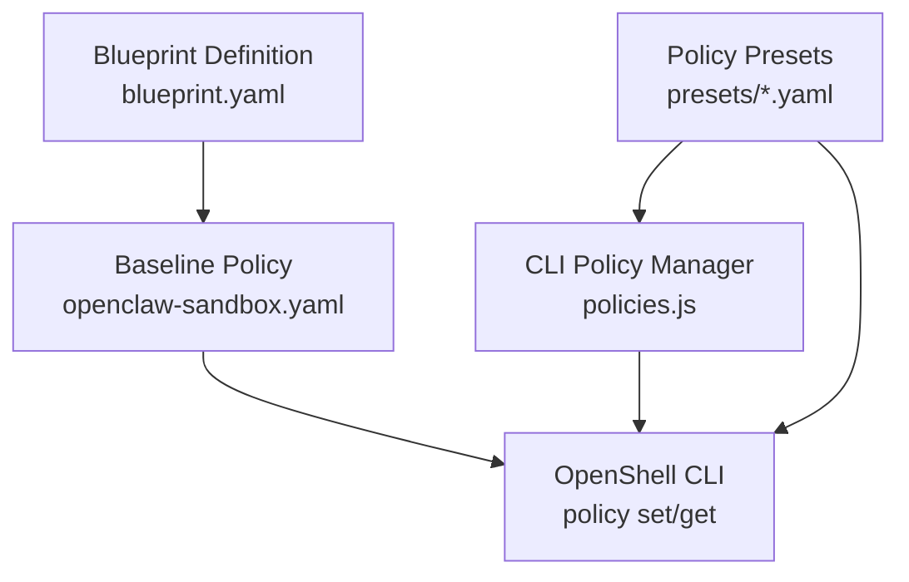
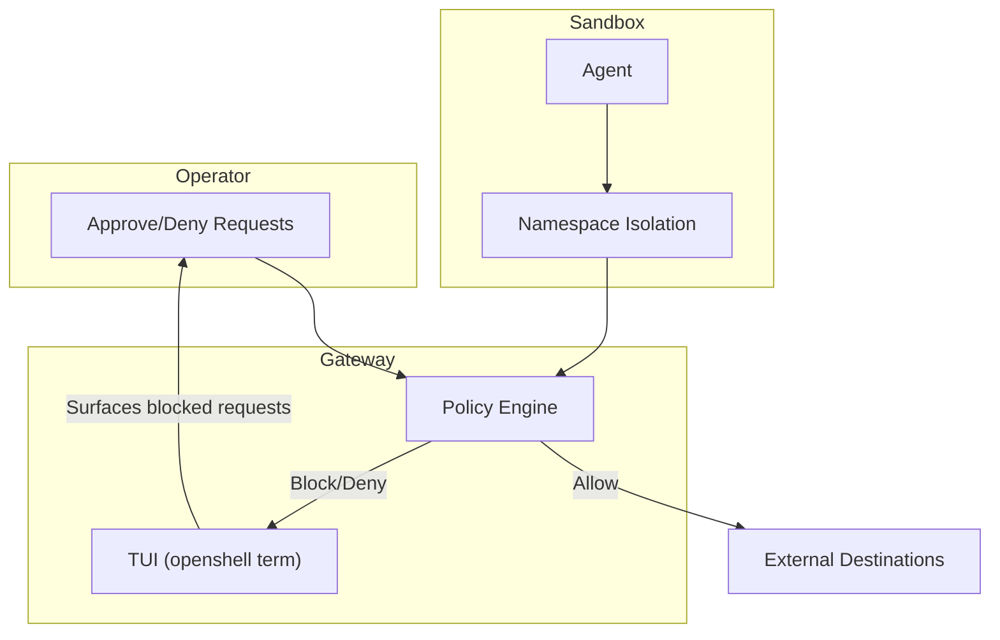
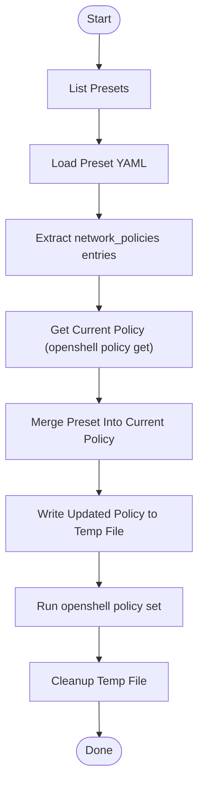
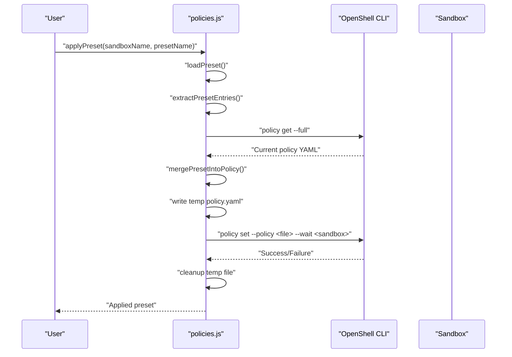
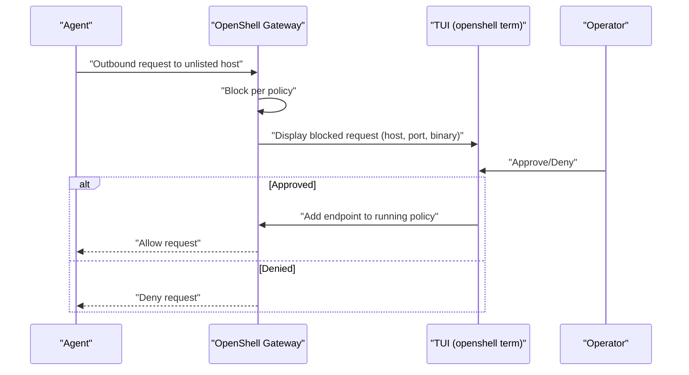
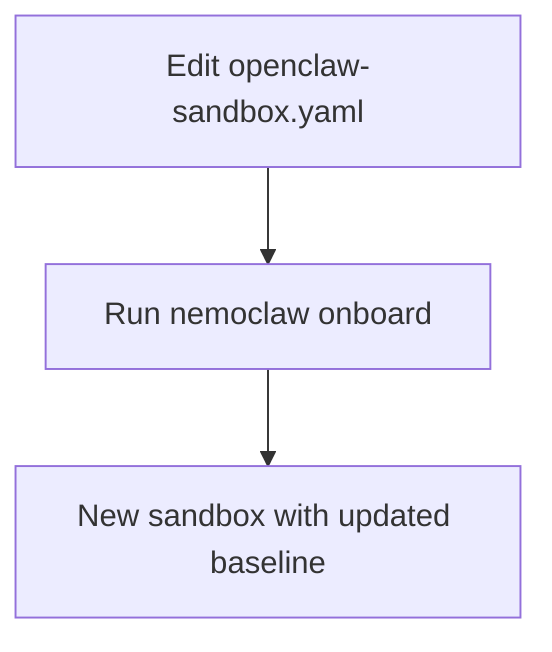
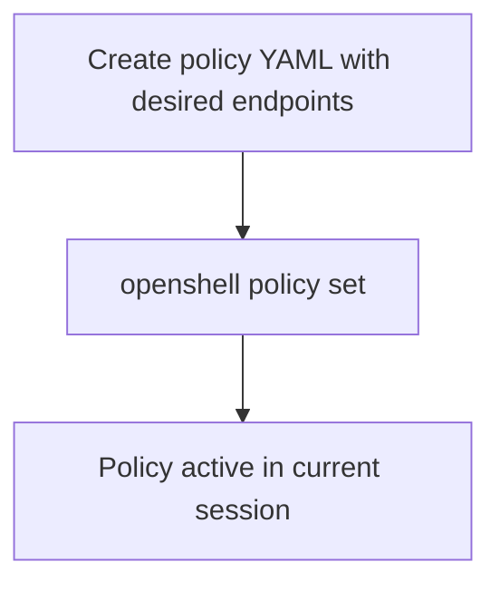
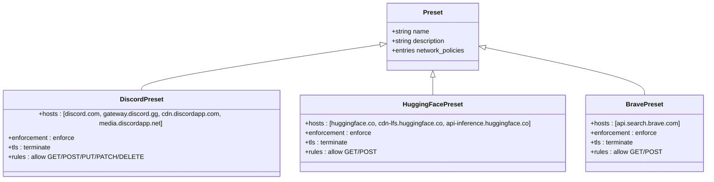
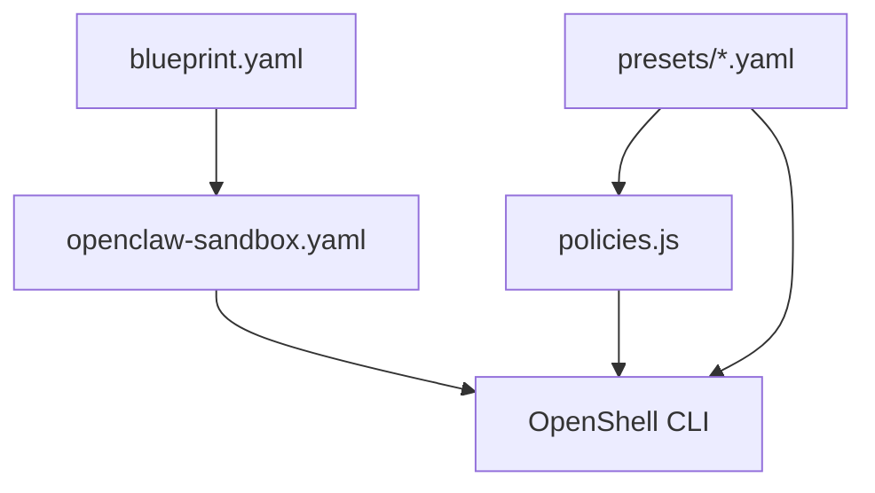

# Policy Commands

<cite>
**Referenced Files in This Document**
- [blueprint.yaml](file://nemoclaw-blueprint/blueprint.yaml)
- [openclaw-sandbox.yaml](file://nemoclaw-blueprint/policies/openclaw-sandbox.yaml)
- [policies.js](file://bin/lib/policies.js)
- [discord.yaml](file://nemoclaw-blueprint/policies/presets/discord.yaml)
- [huggingface.yaml](file://nemoclaw-blueprint/policies/presets/huggingface.yaml)
- [brave.yaml](file://nemoclaw-blueprint/policies/presets/brave.yaml)
- [customize-network-policy.md](file://docs/network-policy/customize-network-policy.md)
- [approve-network-requests.md](file://docs/network-policy/approve-network-requests.md)
- [network-policies.md](file://docs/reference/network-policies.md)
- [troubleshooting.md](file://docs/reference/troubleshooting.md)
</cite>

## Table of Contents
1. [Introduction](#introduction)
2. [Project Structure](#project-structure)
3. [Core Components](#core-components)
4. [Architecture Overview](#architecture-overview)
5. [Detailed Component Analysis](#detailed-component-analysis)
6. [Dependency Analysis](#dependency-analysis)
7. [Performance Considerations](#performance-considerations)
8. [Troubleshooting Guide](#troubleshooting-guide)
9. [Conclusion](#conclusion)
10. [Appendices](#appendices)

## Introduction
This document explains policy management commands and workflows for network policy operations and security configuration in NemoClaw. It focuses on:
- Approving network requests in real time via the OpenShell TUI
- Managing policy presets and applying them to running sandboxes
- Dynamically updating policies for active sessions
- Understanding the relationship between blueprint configurations, network namespace isolation, and enforcement mechanisms
- Policy inheritance, conflict resolution, and troubleshooting connectivity issues

## Project Structure
Policy-related assets are organized under the blueprint and CLI libraries:
- Blueprint policy definitions and presets
- CLI library for listing, loading, merging, and applying presets
- Documentation for approvals, customization, and troubleshooting

**Diagram sources**
- [blueprint.yaml:57-66](file://nemoclaw-blueprint/blueprint.yaml#L57-L66)
- [openclaw-sandbox.yaml:1-219](file://nemoclaw-blueprint/policies/openclaw-sandbox.yaml#L1-L219)
- [policies.js:14-353](file://bin/lib/policies.js#L1-L353)

**Section sources**
- [blueprint.yaml:19-66](file://nemoclaw-blueprint/blueprint.yaml#L19-L66)
- [openclaw-sandbox.yaml:1-219](file://nemoclaw-blueprint/policies/openclaw-sandbox.yaml#L1-L219)
- [policies.js:14-353](file://bin/lib/policies.js#L1-L353)

## Core Components
- Baseline policy definition: Defines default network, filesystem, and process constraints for the sandbox.
- Policy presets: Predefined endpoint groups for common integrations.
- CLI policy manager: Lists presets, loads and merges them into the current policy, and applies them to a sandbox.
- OpenShell policy commands: Applies dynamic policy updates and retrieves the current policy.

Key responsibilities:
- Policy presets encapsulate endpoint groups with hosts, ports, protocols, enforcement modes, and allowed HTTP rules.
- The CLI merges preset entries into the current policy and invokes OpenShell to apply the updated policy to a sandbox.
- Operator approval flow handles unlisted destinations at runtime.

**Section sources**
- [openclaw-sandbox.yaml:46-219](file://nemoclaw-blueprint/policies/openclaw-sandbox.yaml#L46-L219)
- [discord.yaml:4-47](file://nemoclaw-blueprint/policies/presets/discord.yaml#L4-L47)
- [huggingface.yaml:4-38](file://nemoclaw-blueprint/policies/presets/huggingface.yaml#L4-L38)
- [brave.yaml:4-23](file://nemoclaw-blueprint/policies/presets/brave.yaml#L4-L23)
- [policies.js:21-353](file://bin/lib/policies.js#L21-L353)

## Architecture Overview
The policy system enforces a deny-by-default posture. The sandbox’s network egress is controlled by OpenShell, which consults the current policy. Unlisted destinations are blocked and surfaced to the operator for approval in the TUI. Approved endpoints are merged into the running policy for the session.

[No sources needed since this diagram shows conceptual workflow, not actual code structure]

## Detailed Component Analysis

### Policy Preset Management (CLI)
The CLI module manages preset discovery, loading, merging, and application:
- Lists presets from the presets directory
- Loads a named preset and extracts its network policies
- Merges preset entries into the current policy (structured YAML when possible, otherwise text-based fallback)
- Builds and executes OpenShell policy set/get commands
- Tracks applied presets per sandbox

**Diagram sources**
- [policies.js:21-353](file://bin/lib/policies.js#L21-L353)

**Section sources**
- [policies.js:21-353](file://bin/lib/policies.js#L21-L353)

### Applying a Policy Preset to a Running Sandbox
The CLI loads a preset, merges it into the current policy, writes a temporary policy file, and applies it to the sandbox using OpenShell. It also records the applied preset in the local registry.

**Diagram sources**
- [policies.js:220-285](file://bin/lib/policies.js#L220-L285)

**Section sources**
- [policies.js:220-285](file://bin/lib/policies.js#L220-L285)

### Operator Approval Workflow (Real-Time)
When the agent attempts to reach an unlisted endpoint, OpenShell blocks the request and surfaces it in the TUI for operator approval. Approved endpoints are added to the running policy for the session.

**Diagram sources**
- [approve-network-requests.md:23-84](file://docs/network-policy/approve-network-requests.md#L23-L84)
- [network-policies.md:110-127](file://docs/reference/network-policies.md#L110-L127)

**Section sources**
- [approve-network-requests.md:23-84](file://docs/network-policy/approve-network-requests.md#L23-L84)
- [network-policies.md:110-127](file://docs/reference/network-policies.md#L110-L127)

### Customizing the Baseline Policy
You can edit the baseline policy file to add, remove, or modify allowed endpoints. After editing, re-run the onboard wizard to apply the updated policy to a new sandbox.

**Diagram sources**
- [customize-network-policy.md:35-71](file://docs/network-policy/customize-network-policy.md#L35-L71)

**Section sources**
- [customize-network-policy.md:35-71](file://docs/network-policy/customize-network-policy.md#L35-L71)

### Dynamic Policy Application to a Running Sandbox
Dynamic updates apply policy changes to a running sandbox without restarting. The change takes effect immediately for the current session.

**Diagram sources**
- [customize-network-policy.md:72-96](file://docs/network-policy/customize-network-policy.md#L72-L96)

**Section sources**
- [customize-network-policy.md:72-96](file://docs/network-policy/customize-network-policy.md#L72-L96)

### Policy Presets Reference
Common presets include Discord, Hugging Face, Brave Search, and others. Each preset defines endpoint groups with hosts, ports, enforcement, and allowed HTTP rules.

**Diagram sources**
- [discord.yaml:4-47](file://nemoclaw-blueprint/policies/presets/discord.yaml#L4-L47)
- [huggingface.yaml:4-38](file://nemoclaw-blueprint/policies/presets/huggingface.yaml#L4-L38)
- [brave.yaml:4-23](file://nemoclaw-blueprint/policies/presets/brave.yaml#L4-L23)

**Section sources**
- [discord.yaml:4-47](file://nemoclaw-blueprint/policies/presets/discord.yaml#L4-L47)
- [huggingface.yaml:4-38](file://nemoclaw-blueprint/policies/presets/huggingface.yaml#L4-L38)
- [brave.yaml:4-23](file://nemoclaw-blueprint/policies/presets/brave.yaml#L4-L23)

## Dependency Analysis
- Blueprint references the baseline policy file and can add dynamic endpoints.
- The CLI depends on the presence of preset YAML files and OpenShell for applying policies.
- The baseline policy file defines the initial network constraints; presets augment it.

**Diagram sources**
- [blueprint.yaml:57-66](file://nemoclaw-blueprint/blueprint.yaml#L57-L66)
- [openclaw-sandbox.yaml:1-219](file://nemoclaw-blueprint/policies/openclaw-sandbox.yaml#L1-L219)
- [policies.js:14-353](file://bin/lib/policies.js#L14-L353)

**Section sources**
- [blueprint.yaml:57-66](file://nemoclaw-blueprint/blueprint.yaml#L57-L66)
- [openclaw-sandbox.yaml:1-219](file://nemoclaw-blueprint/policies/openclaw-sandbox.yaml#L1-L219)
- [policies.js:14-353](file://bin/lib/policies.js#L14-L353)

## Performance Considerations
- Dynamic policy application is immediate and lightweight, operating on YAML merges and OpenShell invocations.
- Preset merges preserve non-network sections of the policy, minimizing unnecessary changes.
- Using structured YAML merging reduces risk of invalid output compared to text-based manipulations.

[No sources needed since this section provides general guidance]

## Troubleshooting Guide
Common issues and resolutions related to policy and connectivity:
- Agent cannot reach an external host: Open the TUI to review blocked requests and approve them. For persistent allowances, add the endpoint to the baseline policy and re-run onboarding.
- Inference requests timing out: Verify the provider endpoint is reachable, check credentials and base URLs, and ensure the endpoint is allowed by the policy.
- Sandbox shows as stopped or not running inside the sandbox: Use OpenShell commands to check sandbox state and reconnect as needed.

**Section sources**
- [troubleshooting.md:256-267](file://docs/reference/troubleshooting.md#L256-L267)
- [troubleshooting.md:244-255](file://docs/reference/troubleshooting.md#L244-L255)
- [troubleshooting.md:231-243](file://docs/reference/troubleshooting.md#L231-L243)

## Conclusion
NemoClaw’s policy system combines a deny-by-default baseline with flexible dynamic updates and operator-driven approvals. Blueprints define the baseline, presets encapsulate common endpoint groups, and OpenShell enforces and surfaces decisions at runtime. By leveraging these capabilities, operators can maintain strong security while enabling necessary integrations.

[No sources needed since this section summarizes without analyzing specific files]

## Appendices

### Practical Examples

- Approve a network request in real time:
  - Open the TUI and approve the blocked endpoint to temporarily allow it for the session.
  - Reference: [approve-network-requests.md:23-84](file://docs/network-policy/approve-network-requests.md#L23-L84)

- Apply a preset to a running sandbox:
  - Use the CLI to load a preset, merge it into the current policy, and apply it to the sandbox.
  - Reference: [policies.js:220-285](file://bin/lib/policies.js#L220-L285)

- Customize the baseline policy:
  - Edit the baseline policy file and re-run onboarding to apply changes to a new sandbox.
  - Reference: [customize-network-policy.md:35-71](file://docs/network-policy/customize-network-policy.md#L35-L71)

- Manage policy presets:
  - List available presets, choose one, and apply it to the running sandbox.
  - Reference: [policies.js:21-36](file://bin/lib/policies.js#L21-L36)

- Relationship to blueprint configurations:
  - The blueprint references the baseline policy file and can add dynamic endpoints.
  - Reference: [blueprint.yaml:57-66](file://nemoclaw-blueprint/blueprint.yaml#L57-L66)

- Network namespace isolation and enforcement:
  - The sandbox enforces filesystem, process, and network policies; unlisted network destinations are blocked and require operator approval.
  - Reference: [network-policies.md:25-42](file://docs/reference/network-policies.md#L25-L42)

- Policy inheritance and conflict resolution:
  - Preset entries override existing entries with the same name when merged; non-network sections are preserved.
  - Reference: [policies.js:149-219](file://bin/lib/policies.js#L149-L219)