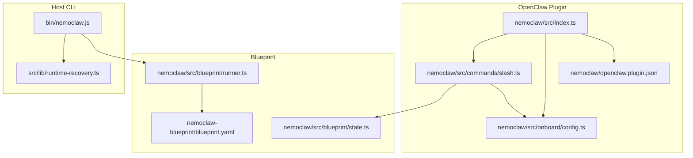
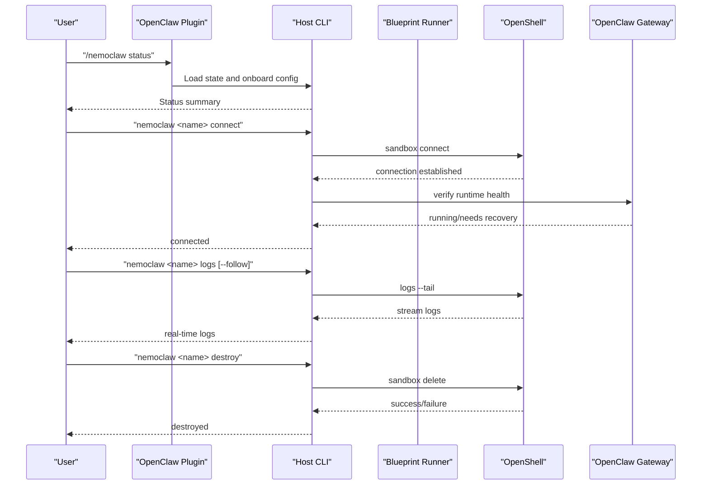
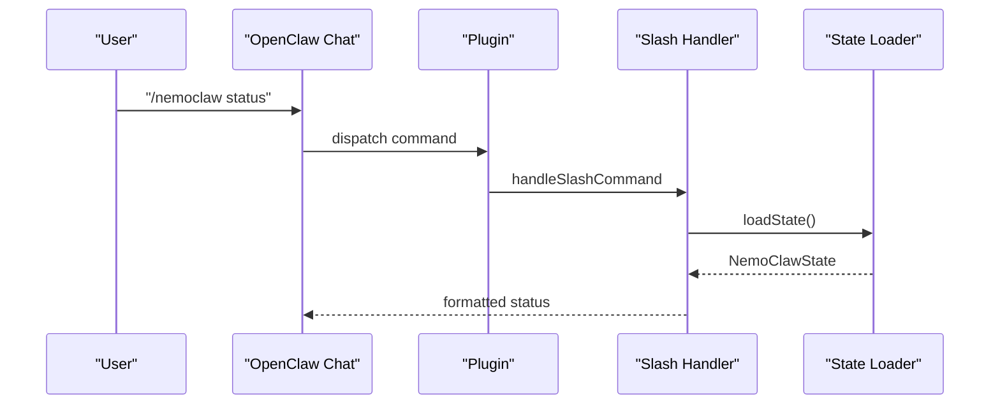
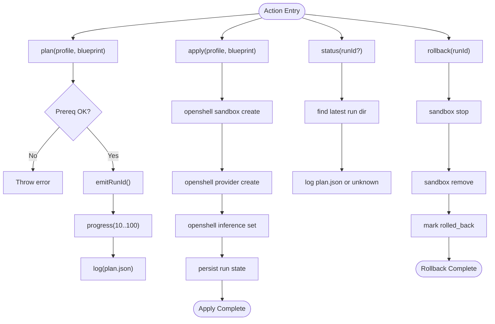
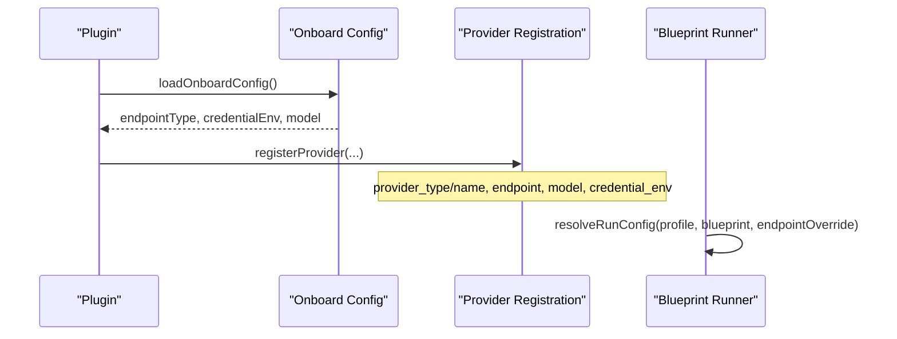
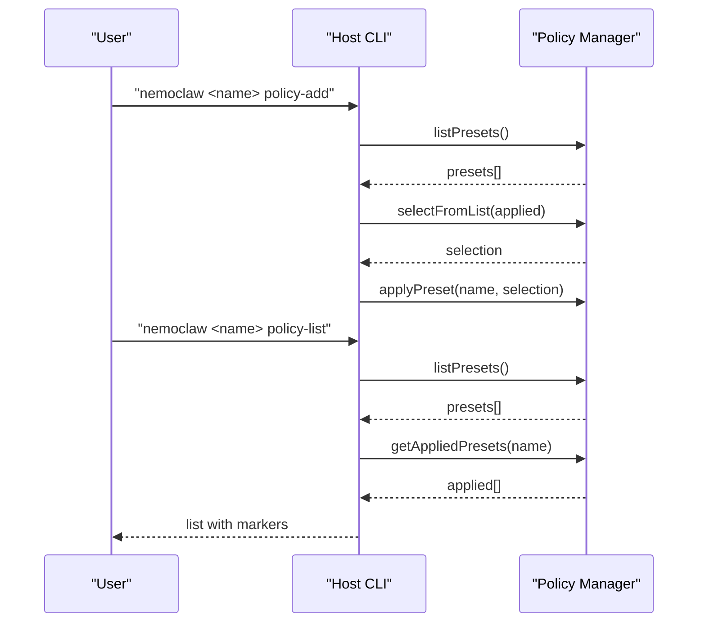
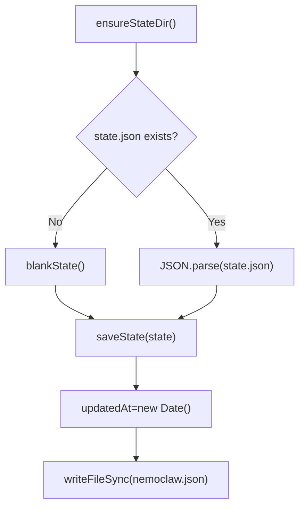
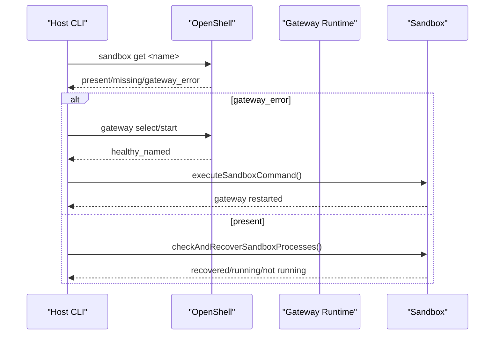
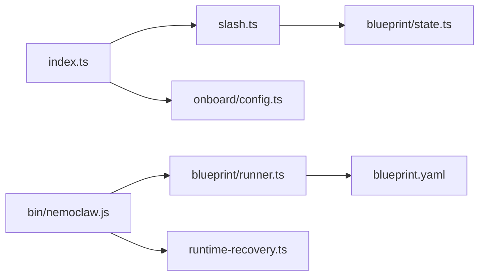

# Sandbox Management

<cite>
**Referenced Files in This Document**
- [nemoclaw/src/index.ts](file://nemoclaw/src/index.ts)
- [nemoclaw/src/commands/slash.ts](file://nemoclaw/src/commands/slash.ts)
- [nemoclaw/src/blueprint/state.ts](file://nemoclaw/src/blueprint/state.ts)
- [nemoclaw/src/blueprint/runner.ts](file://nemoclaw/src/blueprint/runner.ts)
- [nemoclaw/src/onboard/config.ts](file://nemoclaw/src/onboard/config.ts)
- [nemoclaw/openclaw.plugin.json](file://nemoclaw/openclaw.plugin.json)
- [nemoclaw-blueprint/blueprint.yaml](file://nemoclaw-blueprint/blueprint.yaml)
- [bin/nemoclaw.js](file://bin/nemoclaw.js)
- [src/lib/runtime-recovery.ts](file://src/lib/runtime-recovery.ts)
- [docs/reference/commands.md](file://docs/reference/commands.md)
- [docs/reference/troubleshooting.md](file://docs/reference/troubleshooting.md)
</cite>

## Table of Contents
1. [Introduction](#introduction)
2. [Project Structure](#project-structure)
3. [Core Components](#core-components)
4. [Architecture Overview](#architecture-overview)
5. [Detailed Component Analysis](#detailed-component-analysis)
6. [Dependency Analysis](#dependency-analysis)
7. [Performance Considerations](#performance-considerations)
8. [Troubleshooting Guide](#troubleshooting-guide)
9. [Conclusion](#conclusion)
10. [Appendices](#appendices)

## Introduction
This document explains sandbox lifecycle management for OpenClaw assistants within the NemoClaw ecosystem. It covers slash command integration, provider switching, workspace management, and the host CLI commands for create/start/stop/destroy, status monitoring, logs streaming, and connect operations. It also documents state transitions, recovery procedures, state persistence, and migration handling.

## Project Structure
NemoClaw is composed of:
- An OpenClaw plugin that registers slash commands and inference providers
- A blueprint runner that orchestrates sandbox lifecycle via OpenShell
- A host CLI that manages sandboxes, logs, policies, and recovery
- Onboarding configuration and state persistence for plugin and CLI

**Diagram sources**
- [nemoclaw/src/index.ts:237-266](file://nemoclaw/src/index.ts#L237-L266)
- [nemoclaw/src/commands/slash.ts:21-37](file://nemoclaw/src/commands/slash.ts#L21-L37)
- [nemoclaw/src/onboard/config.ts:91-111](file://nemoclaw/src/onboard/config.ts#L91-L111)
- [nemoclaw/openclaw.plugin.json:1-33](file://nemoclaw/openclaw.plugin.json#L1-L33)
- [nemoclaw/src/blueprint/runner.ts:167-210](file://nemoclaw/src/blueprint/runner.ts#L167-L210)
- [nemoclaw-blueprint/blueprint.yaml:19-56](file://nemoclaw-blueprint/blueprint.yaml#L19-L56)
- [nemoclaw/src/blueprint/state.ts:47-70](file://nemoclaw/src/blueprint/state.ts#L47-L70)
- [bin/nemoclaw.js:1012-1021](file://bin/nemoclaw.js#L1012-L1021)
- [src/lib/runtime-recovery.ts:25-57](file://src/lib/runtime-recovery.ts#L25-L57)

**Section sources**
- [nemoclaw/src/index.ts:237-266](file://nemoclaw/src/index.ts#L237-L266)
- [nemoclaw/src/commands/slash.ts:21-37](file://nemoclaw/src/commands/slash.ts#L21-L37)
- [nemoclaw/src/onboard/config.ts:91-111](file://nemoclaw/src/onboard/config.ts#L91-L111)
- [nemoclaw/openclaw.plugin.json:1-33](file://nemoclaw/openclaw.plugin.json#L1-L33)
- [nemoclaw/src/blueprint/runner.ts:167-210](file://nemoclaw/src/blueprint/runner.ts#L167-L210)
- [nemoclaw-blueprint/blueprint.yaml:19-56](file://nemocaw-blueprint/blueprint.yaml#L19-L56)
- [nemoclaw/src/blueprint/state.ts:47-70](file://nemoclaw/src/blueprint/state.ts#L47-L70)
- [bin/nemoclaw.js:1012-1021](file://bin/nemoclaw.js#L1012-L1021)
- [src/lib/runtime-recovery.ts:25-57](file://src/lib/runtime-recovery.ts#L25-L57)

## Core Components
- OpenClaw plugin registration and slash command handler
- Blueprint runner for plan/apply/status/rollback
- Onboarding configuration and provider registration
- Host CLI for sandbox connect/status/logs/destroy and recovery
- Runtime recovery utilities for gateway and sandbox state

**Section sources**
- [nemoclaw/src/index.ts:237-266](file://nemoclaw/src/index.ts#L237-L266)
- [nemoclaw/src/commands/slash.ts:21-37](file://nemoclaw/src/commands/slash.ts#L21-L37)
- [nemoclaw/src/blueprint/runner.ts:167-210](file://nemoclaw/src/blueprint/runner.ts#L167-L210)
- [nemoclaw/src/onboard/config.ts:91-111](file://nemoclaw/src/onboard/config.ts#L91-L111)
- [bin/nemoclaw.js:1012-1021](file://bin/nemoclaw.js#L1012-L1021)
- [src/lib/runtime-recovery.ts:25-57](file://src/lib/runtime-recovery.ts#L25-L57)

## Architecture Overview
The OpenClaw plugin registers slash commands and inference providers. The host CLI coordinates sandbox lifecycle and recovery. Blueprints define sandbox and inference configuration, and state is persisted for recovery and rollback.

**Diagram sources**
- [nemoclaw/src/commands/slash.ts:60-84](file://nemoclaw/src/commands/slash.ts#L60-L84)
- [bin/nemoclaw.js:1012-1021](file://bin/nemoclaw.js#L1012-L1021)
- [bin/nemoclaw.js:1138-1179](file://bin/nemoclaw.js#L1138-L1179)
- [bin/nemoclaw.js:1208-1254](file://bin/nemoclaw.js#L1208-L1254)
- [nemoclaw/src/blueprint/runner.ts:332-360](file://nemoclaw/src/blueprint/runner.ts#L332-L360)

## Detailed Component Analysis

### Slash Command Integration with OpenClaw Plugin
- Registers the `/nemoclaw` command with subcommands: status, eject, onboard, and help.
- Provides concise status and onboard summaries for quick verification and guidance.
- Delegates to host CLI for advanced operations.

**Diagram sources**
- [nemoclaw/src/index.ts:237-244](file://nemoclaw/src/index.ts#L237-L244)
- [nemoclaw/src/commands/slash.ts:21-37](file://nemoclaw/src/commands/slash.ts#L21-L37)
- [nemoclaw/src/blueprint/state.ts:47-54](file://nemoclaw/src/blueprint/state.ts#L47-L54)

**Section sources**
- [nemoclaw/src/index.ts:237-244](file://nemoclaw/src/index.ts#L237-L244)
- [nemoclaw/src/commands/slash.ts:21-37](file://nemoclaw/src/commands/slash.ts#L21-L37)
- [nemoclaw/src/blueprint/state.ts:47-54](file://nemoclaw/src/blueprint/state.ts#L47-L54)

### Sandbox Lifecycle Orchestration (Plan/Apply/Status/Rollback)
- Plan: validates blueprint, checks prerequisites, emits progress, and prints a plan JSON.
- Apply: creates sandbox, configures provider, sets inference route, persists run state.
- Status: prints latest run plan or unknown if missing.
- Rollback: stops/removes sandbox and marks run as rolled back.

**Diagram sources**
- [nemoclaw/src/blueprint/runner.ts:167-210](file://nemoclaw/src/blueprint/runner.ts#L167-L210)
- [nemoclaw/src/blueprint/runner.ts:212-330](file://nemoclaw/src/blueprint/runner.ts#L212-L330)
- [nemoclaw/src/blueprint/runner.ts:332-360](file://nemoclaw/src/blueprint/runner.ts#L332-L360)
- [nemoclaw/src/blueprint/runner.ts:362-391](file://nemoclaw/src/blueprint/runner.ts#L362-L391)

**Section sources**
- [nemoclaw/src/blueprint/runner.ts:167-210](file://nemoclaw/src/blueprint/runner.ts#L167-L210)
- [nemoclaw/src/blueprint/runner.ts:212-330](file://nemoclaw/src/blueprint/runner.ts#L212-L330)
- [nemoclaw/src/blueprint/runner.ts:332-360](file://nemoclaw/src/blueprint/runner.ts#L332-L360)
- [nemoclaw/src/blueprint/runner.ts:362-391](file://nemoclaw/src/blueprint/runner.ts#L362-L391)

### Provider Switching Operations
- The plugin registers a managed inference provider based on onboard configuration.
- Supports multiple provider types and endpoints defined in blueprints.
- Credential environment variables are scoped to provider creation to avoid leakage.

**Diagram sources**
- [nemoclaw/src/index.ts:246-249](file://nemoclaw/src/index.ts#L246-L249)
- [nemoclaw/src/onboard/config.ts:33-68](file://nemoclaw/src/onboard/config.ts#L33-L68)
- [nemoclaw/src/blueprint/runner.ts:116-144](file://nemoclaw/src/blueprint/runner.ts#L116-L144)

**Section sources**
- [nemoclaw/src/index.ts:246-249](file://nemoclaw/src/index.ts#L246-L249)
- [nemoclaw/src/onboard/config.ts:33-68](file://nemoclaw/src/onboard/config.ts#L33-L68)
- [nemoclaw/src/blueprint/runner.ts:116-144](file://nemoclaw/src/blueprint/runner.ts#L116-L144)

### Workspace Management Commands
- The CLI supports listing sandboxes, adding/listing policy presets, and connecting to a sandbox.
- Policy presets extend baseline network policy with additional endpoints.

**Diagram sources**
- [bin/nemoclaw.js:1181-1206](file://bin/nemoclaw.js#L1181-L1206)

**Section sources**
- [bin/nemoclaw.js:1181-1206](file://bin/nemoclaw.js#L1181-L1206)

### State Persistence and Migration Handling
- State is persisted under the user’s home directory and includes last action, blueprint version, sandbox name, and migration snapshot.
- Migration snapshot enables rollback to host installation.

**Diagram sources**
- [nemoclaw/src/blueprint/state.ts:22-61](file://nemoclaw/src/blueprint/state.ts#L22-L61)

**Section sources**
- [nemoclaw/src/blueprint/state.ts:22-61](file://nemoclaw/src/blueprint/state.ts#L22-L61)

### Sandbox Recovery Procedures
- The CLI recovers gateway runtime and inspects sandbox state.
- If gateway is unreachable or identity drift occurs, it suggests recovery steps.
- After reconnect, it can auto-recover OpenClaw gateway inside the sandbox.

**Diagram sources**
- [bin/nemoclaw.js:544-561](file://bin/nemoclaw.js#L544-L561)
- [bin/nemoclaw.js:616-672](file://bin/nemoclaw.js#L616-L672)
- [bin/nemoclaw.js:1104-1124](file://bin/nemoclaw.js#L1104-L1124)

**Section sources**
- [bin/nemoclaw.js:544-561](file://bin/nemoclaw.js#L544-L561)
- [bin/nemoclaw.js:616-672](file://bin/nemoclaw.js#L616-L672)
- [bin/nemoclaw.js:1104-1124](file://bin/nemoclaw.js#L1104-L1124)

### Command Syntax and Options

- Slash commands (OpenClaw chat):
  - `/nemoclaw`: help and host CLI pointers
  - `/nemoclaw status`: show sandbox/blueprint/inference state
  - `/nemoclaw onboard`: show onboarding status and reconfigure guidance
  - `/nemoclaw eject`: show rollback instructions

- Host CLI:
  - `nemoclaw <name> connect`: connect to sandbox
  - `nemoclaw <name> status`: sandbox health + NIM status
  - `nemoclaw <name> logs [--follow]`: stream sandbox logs
  - `nemoclaw <name> destroy [--yes]`: stop NIM + delete sandbox
  - `nemoclaw <name> policy-add`: add a policy preset
  - `nemoclaw <name> policy-list`: list presets and applied status

**Section sources**
- [nemoclaw/src/commands/slash.ts:39-58](file://nemoclaw/src/commands/slash.ts#L39-L58)
- [docs/reference/commands.md:27-37](file://docs/reference/commands.md#L27-L37)
- [docs/reference/commands.md:129-167](file://docs/reference/commands.md#L129-L167)
- [bin/nemoclaw.js:1258-1304](file://bin/nemoclaw.js#L1258-L1304)

### Practical Examples

- Create and start a sandbox:
  - Run onboarding to create gateway, provider, and sandbox.
  - Connect to the sandbox and verify status.

- Status checking:
  - Use `nemoclaw <name> status` to check model/provider, GPU/CPU, policies, and NIM health.
  - Inspect gateway and sandbox state; the CLI will attempt recovery if needed.

- Logs streaming:
  - Use `nemoclaw <name> logs --follow` to stream real-time logs.
  - For older OpenShell versions, the CLI provides compatibility guidance.

- Destroy a sandbox:
  - Use `nemoclaw <name> destroy` to stop NIM and delete the sandbox.
  - Confirm deletion; the CLI cleans up gateway resources when the last sandbox is removed.

- Provider switching:
  - Reconfigure inference provider via onboard wizard; the plugin registers the new provider and endpoint.

**Section sources**
- [docs/reference/commands.md:59-106](file://docs/reference/commands.md#L59-L106)
- [bin/nemoclaw.js:1012-1021](file://bin/nemoclaw.js#L1012-L1021)
- [bin/nemoclaw.js:1024-1136](file://bin/nemoclaw.js#L1024-L1136)
- [bin/nemoclaw.js:1138-1179](file://bin/nemoclaw.js#L1138-L1179)
- [bin/nemoclaw.js:1208-1254](file://bin/nemoclaw.js#L1208-L1254)
- [nemoclaw/src/index.ts:246-249](file://nemoclaw/src/index.ts#L246-L249)

## Dependency Analysis
- Plugin depends on onboard configuration and state loader for slash command responses.
- Blueprint runner depends on blueprint YAML and SSRF validation.
- Host CLI depends on OpenShell for sandbox operations and runtime recovery utilities.

**Diagram sources**
- [nemoclaw/src/index.ts:14-19](file://nemoclaw/src/index.ts#L14-L19)
- [nemoclaw/src/commands/slash.ts:14-19](file://nemoclaw/src/commands/slash.ts#L14-L19)
- [nemoclaw/src/blueprint/state.ts:4-6](file://nemoclaw/src/blueprint/state.ts#L4-L6)
- [nemoclaw/src/blueprint/runner.ts:79-89](file://nemoclaw/src/blueprint/runner.ts#L79-L89)
- [bin/nemoclaw.js:41-43](file://bin/nemoclaw.js#L41-L43)
- [src/lib/runtime-recovery.ts:9-11](file://src/lib/runtime-recovery.ts#L9-L11)

**Section sources**
- [nemoclaw/src/index.ts:14-19](file://nemoclaw/src/index.ts#L14-L19)
- [nemoclaw/src/commands/slash.ts:14-19](file://nemoclaw/src/commands/slash.ts#L14-L19)
- [nemoclaw/src/blueprint/state.ts:4-6](file://nemoclaw/src/blueprint/state.ts#L4-L6)
- [nemoclaw/src/blueprint/runner.ts:79-89](file://nemoclaw/src/blueprint/runner.ts#L79-L89)
- [bin/nemoclaw.js:41-43](file://bin/nemoclaw.js#L41-L43)
- [src/lib/runtime-recovery.ts:9-11](file://src/lib/runtime-recovery.ts#L9-L11)

## Performance Considerations
- Prefer streaming logs with `--follow` for real-time debugging to reduce polling overhead.
- Use policy presets judiciously to minimize network egress approvals and improve throughput.
- Keep OpenShell updated to benefit from improved logging and lifecycle commands.

## Troubleshooting Guide
Common issues and resolutions:
- Gateway unreachable after restart: restart the gateway and reconnect; if it stays unreachable, rebuild the gateway and recreate the sandbox.
- Identity drift after restart: sandbox connections cannot be reattached; recreate the sandbox after stabilizing the gateway.
- Port conflicts: ensure port 18789 is free before onboarding.
- Logs compatibility: upgrade OpenShell to support live streaming logs.

**Section sources**
- [docs/reference/troubleshooting.md:179-277](file://docs/reference/troubleshooting.md#L179-L277)
- [bin/nemoclaw.js:742-751](file://bin/nemoclaw.js#L742-L751)

## Conclusion
NemoClaw integrates OpenClaw with OpenShell to provide a robust sandbox lifecycle. The OpenClaw plugin offers quick status and rollback guidance, while the host CLI provides comprehensive management, recovery, and policy controls. Blueprints and state persistence enable reproducible deployments and safe rollbacks.

## Appendices

### Plugin Configuration Schema
- blueprintVersion: pinned blueprint artifact version or latest
- blueprintRegistry: OCI registry or GitHub release URL for blueprint artifacts
- sandboxName: OpenClaw sandbox name in OpenShell
- inferenceProvider: default inference provider type

**Section sources**
- [nemoclaw/openclaw.plugin.json:6-31](file://nemoclaw/openclaw.plugin.json#L6-L31)