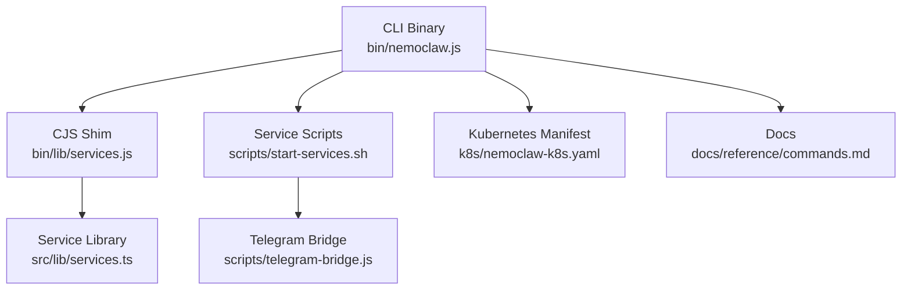
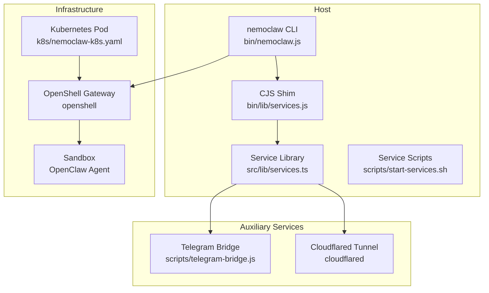
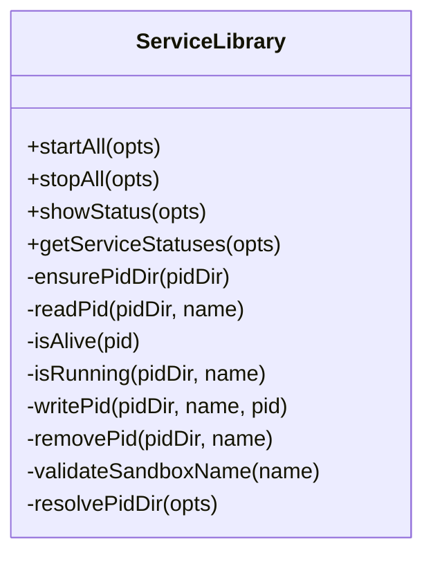
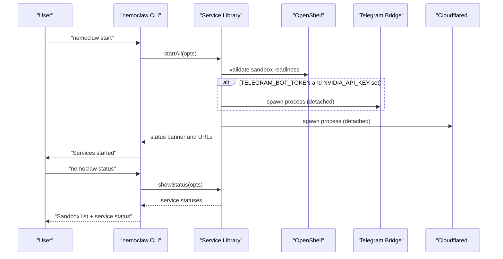
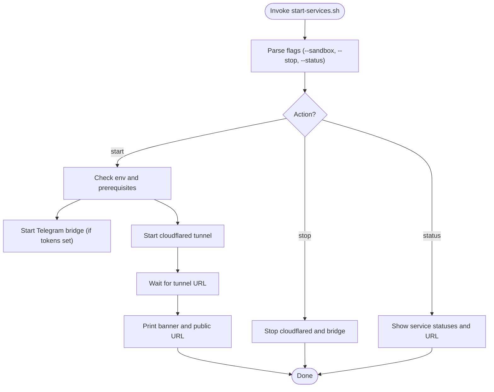
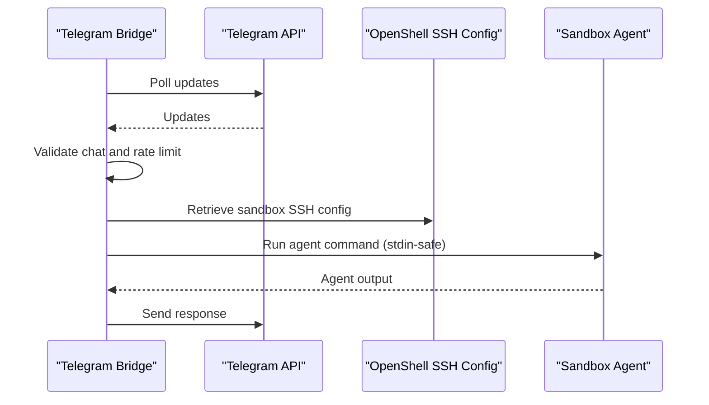
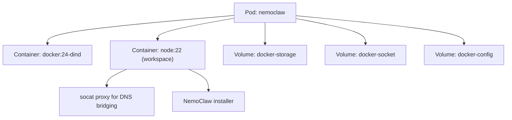
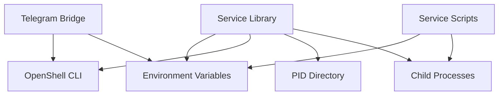

# Service Commands

<cite>
**Referenced Files in This Document**
- [bin/nemoclaw.js](file://bin/nemoclaw.js)
- [src/lib/services.ts](file://src/lib/services.ts)
- [bin/lib/services.js](file://bin/lib/services.js)
- [scripts/start-services.sh](file://scripts/start-services.sh)
- [scripts/telegram-bridge.js](file://scripts/telegram-bridge.js)
- [k8s/nemoclaw-k8s.yaml](file://k8s/nemoclaw-k8s.yaml)
- [docs/reference/commands.md](file://docs/reference/commands.md)
- [docs/deployment/deploy-to-remote-gpu.md](file://docs/deployment/deploy-to-remote-gpu.md)
- [docs/monitoring/monitor-sandbox-activity.md](file://docs/monitoring/monitor-sandbox-activity.md)
- [docs/reference/troubleshooting.md](file://docs/reference/troubleshooting.md)
</cite>

## Table of Contents
1. [Introduction](#introduction)
2. [Project Structure](#project-structure)
3. [Core Components](#core-components)
4. [Architecture Overview](#architecture-overview)
5. [Detailed Component Analysis](#detailed-component-analysis)
6. [Dependency Analysis](#dependency-analysis)
7. [Performance Considerations](#performance-considerations)
8. [Troubleshooting Guide](#troubleshooting-guide)
9. [Conclusion](#conclusion)
10. [Appendices](#appendices)

## Introduction
This document explains how to manage auxiliary services and infrastructure operations for NemoClaw. It focuses on service discovery, status monitoring, configuration management, and lifecycle operations for supporting services such as the Telegram bridge and the cloudflared tunnel. It also covers command syntax, startup and health-check workflows, dependency management, and integration with Docker and Kubernetes. Practical examples demonstrate how to start services, check their status, and troubleshoot common issues.

## Project Structure
NemoClaw exposes host-side commands through a CLI that orchestrates auxiliary services and integrates with OpenShell for sandbox lifecycle and monitoring. The service management logic is implemented in TypeScript and surfaced via a thin CommonJS shim for Node.js consumption. Supporting scripts provide Bash-based service orchestration and a Telegram bridge process.

**Diagram sources**
- [bin/nemoclaw.js:834-848](file://bin/nemoclaw.js#L834-L848)
- [bin/lib/services.js:1-5](file://bin/lib/services.js#L1-L5)
- [src/lib/services.ts:104-192](file://src/lib/services.ts#L104-L192)
- [scripts/start-services.sh:125-206](file://scripts/start-services.sh#L125-L206)
- [scripts/telegram-bridge.js:1-276](file://scripts/telegram-bridge.js#L1-L276)
- [k8s/nemoclaw-k8s.yaml:1-120](file://k8s/nemoclaw-k8s.yaml#L1-L120)
- [docs/reference/commands.md:197-221](file://docs/reference/commands.md#L197-L221)

**Section sources**
- [bin/nemoclaw.js:834-848](file://bin/nemoclaw.js#L834-L848)
- [bin/lib/services.js:1-5](file://bin/lib/services.js#L1-L5)
- [src/lib/services.ts:104-192](file://src/lib/services.ts#L104-L192)
- [scripts/start-services.sh:125-206](file://scripts/start-services.sh#L125-L206)
- [scripts/telegram-bridge.js:1-276](file://scripts/telegram-bridge.js#L1-L276)
- [k8s/nemoclaw-k8s.yaml:1-120](file://k8s/nemoclaw-k8s.yaml#L1-L120)
- [docs/reference/commands.md:197-221](file://docs/reference/commands.md#L197-L221)

## Core Components
- Service library (TypeScript): Manages auxiliary services, including process lifecycle, PID tracking, and status reporting. Supports Telegram bridge and cloudflared tunnel.
- CLI commands: Exposes start, stop, and status for services via the host CLI.
- Service scripts (Bash): Provides a portable, shell-based service manager with similar capabilities to the TypeScript implementation.
- Telegram bridge: Bridges Telegram messages to the OpenClaw agent inside the sandbox and coordinates approvals via the OpenShell TUI.
- Kubernetes manifest: Demonstrates a containerized deployment pattern that can host NemoClaw and related services.

Key responsibilities:
- Service discovery: Enumerates known service names and validates sandbox names.
- Lifecycle: Start, stop, and status queries for auxiliary services.
- Configuration: Resolves PID directory and environment-dependent options (e.g., dashboard port).
- Integration: Interacts with OpenShell for sandbox connectivity and monitoring.

**Section sources**
- [src/lib/services.ts:104-192](file://src/lib/services.ts#L104-L192)
- [src/lib/services.ts:215-247](file://src/lib/services.ts#L215-L247)
- [bin/nemoclaw.js:834-848](file://bin/nemoclaw.js#L834-L848)
- [scripts/start-services.sh:125-206](file://scripts/start-services.sh#L125-L206)
- [scripts/telegram-bridge.js:1-276](file://scripts/telegram-bridge.js#L1-L276)

## Architecture Overview
The service management architecture combines a host CLI with a service library and optional scripts. Auxiliary services are long-running processes managed independently of the sandbox lifecycle. The CLI coordinates service startup and status reporting, while the Telegram bridge and cloudflared tunnel provide external integration and exposure.

**Diagram sources**
- [bin/nemoclaw.js:834-848](file://bin/nemoclaw.js#L834-L848)
- [bin/lib/services.js:1-5](file://bin/lib/services.js#L1-L5)
- [src/lib/services.ts:104-192](file://src/lib/services.ts#L104-L192)
- [scripts/telegram-bridge.js:1-276](file://scripts/telegram-bridge.js#L1-L276)
- [k8s/nemoclaw-k8s.yaml:1-120](file://k8s/nemoclaw-k8s.yaml#L1-L120)

## Detailed Component Analysis

### Service Library (TypeScript)
The service library encapsulates:
- Service names and lifecycle: Defines supported services and manages start/stop with logging and PID tracking.
- Status reporting: Displays running services and optionally extracts a public URL from cloudflared logs.
- Environment-aware configuration: Resolves PID directory and dashboard port, with safeguards for sandbox names.

**Diagram sources**
- [src/lib/services.ts:104-192](file://src/lib/services.ts#L104-L192)
- [src/lib/services.ts:215-247](file://src/lib/services.ts#L215-L247)
- [src/lib/services.ts:372-383](file://src/lib/services.ts#L372-L383)

**Section sources**
- [src/lib/services.ts:104-192](file://src/lib/services.ts#L104-L192)
- [src/lib/services.ts:215-247](file://src/lib/services.ts#L215-L247)
- [src/lib/services.ts:372-383](file://src/lib/services.ts#L372-L383)

### CLI Service Commands
The CLI exposes three primary commands for service management:
- Start: Launches auxiliary services (Telegram bridge and cloudflared tunnel) with environment checks and warnings.
- Stop: Stops all auxiliary services and cleans PID files.
- Status: Lists registered sandboxes and auxiliary service status, including public URL extraction when available.

**Diagram sources**
- [bin/nemoclaw.js:834-848](file://bin/nemoclaw.js#L834-L848)
- [bin/nemoclaw.js:937-957](file://bin/nemoclaw.js#L937-L957)
- [src/lib/services.ts:249-366](file://src/lib/services.ts#L249-L366)

**Section sources**
- [bin/nemoclaw.js:834-848](file://bin/nemoclaw.js#L834-L848)
- [bin/nemoclaw.js:937-957](file://bin/nemoclaw.js#L937-L957)
- [docs/reference/commands.md:197-221](file://docs/reference/commands.md#L197-L221)

### Service Scripts (Bash)
The Bash scripts provide an alternative service manager with:
- Flag parsing for sandbox selection, stop, and status.
- PID-based lifecycle management and log rotation.
- Environment checks and warnings for prerequisites (e.g., Node.js, cloudflared availability).

**Diagram sources**
- [scripts/start-services.sh:21-43](file://scripts/start-services.sh#L21-L43)
- [scripts/start-services.sh:125-206](file://scripts/start-services.sh#L125-L206)

**Section sources**
- [scripts/start-services.sh:21-43](file://scripts/start-services.sh#L21-L43)
- [scripts/start-services.sh:125-206](file://scripts/start-services.sh#L125-L206)

### Telegram Bridge
The Telegram bridge:
- Validates environment variables and sandbox name.
- Polls Telegram updates, rate-limits messages, and serializes per-chat sessions.
- Executes agent commands inside the sandbox via SSH and OpenShell, forwarding responses to Telegram.
- Integrates with OpenShell TUI for operator approvals of egress requests.

**Diagram sources**
- [scripts/telegram-bridge.js:162-247](file://scripts/telegram-bridge.js#L162-L247)
- [scripts/telegram-bridge.js:98-158](file://scripts/telegram-bridge.js#L98-L158)

**Section sources**
- [scripts/telegram-bridge.js:162-247](file://scripts/telegram-bridge.js#L162-L247)
- [scripts/telegram-bridge.js:98-158](file://scripts/telegram-bridge.js#L98-L158)

### Kubernetes Deployment
The Kubernetes manifest demonstrates a containerized approach:
- A DinD sidecar runs the Docker daemon.
- A workspace container installs prerequisites, starts socat for DNS bridging, waits for Docker, and runs the NemoClaw installer.
- Environment variables configure endpoints and provider settings for inference.

**Diagram sources**
- [k8s/nemoclaw-k8s.yaml:12-120](file://k8s/nemoclaw-k8s.yaml#L12-L120)

**Section sources**
- [k8s/nemoclaw-k8s.yaml:12-120](file://k8s/nemoclaw-k8s.yaml#L12-L120)

## Dependency Analysis
Service management depends on:
- OpenShell for sandbox connectivity and TUI-based approvals.
- Environment variables for service configuration (e.g., tokens, ports).
- Platform-specific behaviors (e.g., DNS result ordering on WSL2).

**Diagram sources**
- [src/lib/services.ts:249-366](file://src/lib/services.ts#L249-L366)
- [scripts/start-services.sh:125-206](file://scripts/start-services.sh#L125-L206)
- [scripts/telegram-bridge.js:31-38](file://scripts/telegram-bridge.js#L31-L38)

**Section sources**
- [src/lib/services.ts:249-366](file://src/lib/services.ts#L249-L366)
- [scripts/start-services.sh:125-206](file://scripts/start-services.sh#L125-L206)
- [scripts/telegram-bridge.js:31-38](file://scripts/telegram-bridge.js#L31-L38)

## Performance Considerations
- Detached processes: Services are spawned detached to persist beyond the CLI session. Ensure proper logging and PID tracking.
- Busy-wait polling: Stop operations poll for process exit with short intervals; this is synchronous and avoids race conditions.
- DNS behavior on WSL2: Adjust DNS result ordering to mitigate IPv6 routing issues that can delay or fail bridge connections.
- Log parsing: Status queries extract public URLs from service logs; ensure log files are readable and not truncated prematurely.

[No sources needed since this section provides general guidance]

## Troubleshooting Guide
Common operational issues and resolutions:
- Services not starting: Verify environment variables (e.g., tokens) and prerequisites (e.g., cloudflared availability).
- Service status shows stopped: Confirm PID files exist and processes are alive; use stop to clean stale PID files.
- Public URL missing: Wait for cloudflared to publish a URL or install cloudflared manually.
- Sandbox connectivity after reboot: Reconnect via the CLI and restart auxiliary services if needed.
- Network egress blocked: Use the OpenShell TUI to approve blocked requests; adjust network policies as needed.

**Section sources**
- [docs/reference/troubleshooting.md:179-229](file://docs/reference/troubleshooting.md#L179-L229)
- [src/lib/services.ts:215-247](file://src/lib/services.ts#L215-L247)
- [scripts/start-services.sh:168-179](file://scripts/start-services.sh#L168-L179)

## Conclusion
NemoClaw’s service management provides a robust foundation for running auxiliary services that integrate with the sandbox and external systems. The CLI and service library offer consistent lifecycle operations, while the Telegram bridge and cloudflared tunnel enable practical workflows. The included scripts and Kubernetes manifest demonstrate flexible deployment patterns. Use the documented commands and troubleshooting steps to maintain reliable service operations across Docker and Kubernetes environments.

[No sources needed since this section summarizes without analyzing specific files]

## Appendices

### Command Syntax and Examples
- Start auxiliary services:
  - Host CLI: nemoclaw start
  - Script: ./scripts/start-services.sh
- Stop auxiliary services:
  - Host CLI: nemoclaw stop
  - Script: ./scripts/start-services.sh --stop
- Show status:
  - Host CLI: nemoclaw status
  - Script: ./scripts/start-services.sh --status

Operational notes:
- Environment variables: TELEGRAM_BOT_TOKEN, NVIDIA_API_KEY, DASHBOARD_PORT
- Sandbox scoping: Use --sandbox to target a specific sandbox name
- Remote GPU: Use the deploy command for legacy Brev compatibility; refer to the deployment guide for modern flows

**Section sources**
- [docs/reference/commands.md:197-221](file://docs/reference/commands.md#L197-L221)
- [docs/deployment/deploy-to-remote-gpu.md:40-68](file://docs/deployment/deploy-to-remote-gpu.md#L40-L68)
- [scripts/start-services.sh:8-13](file://scripts/start-services.sh#L8-L13)