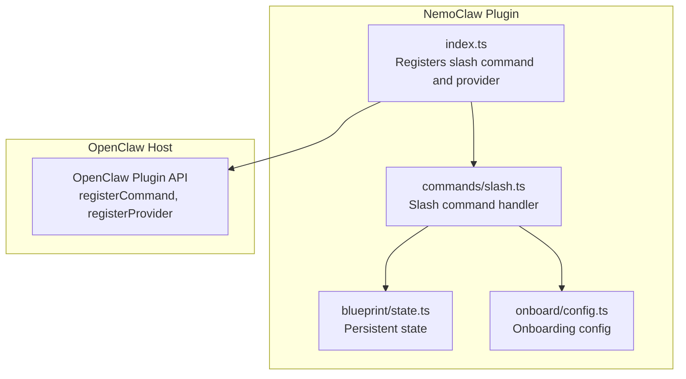
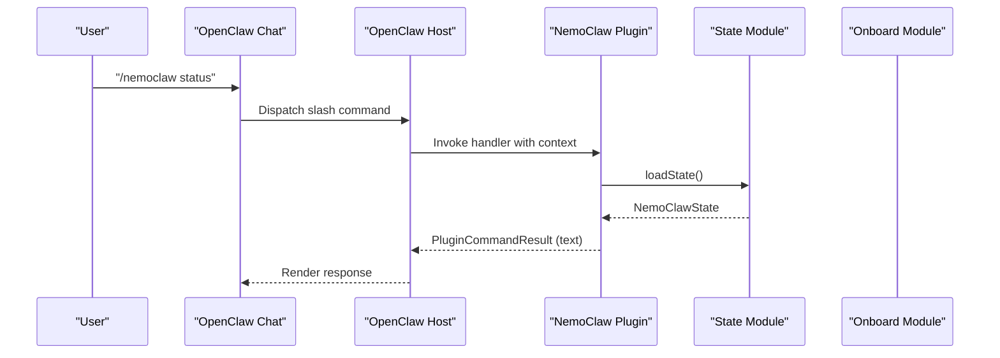
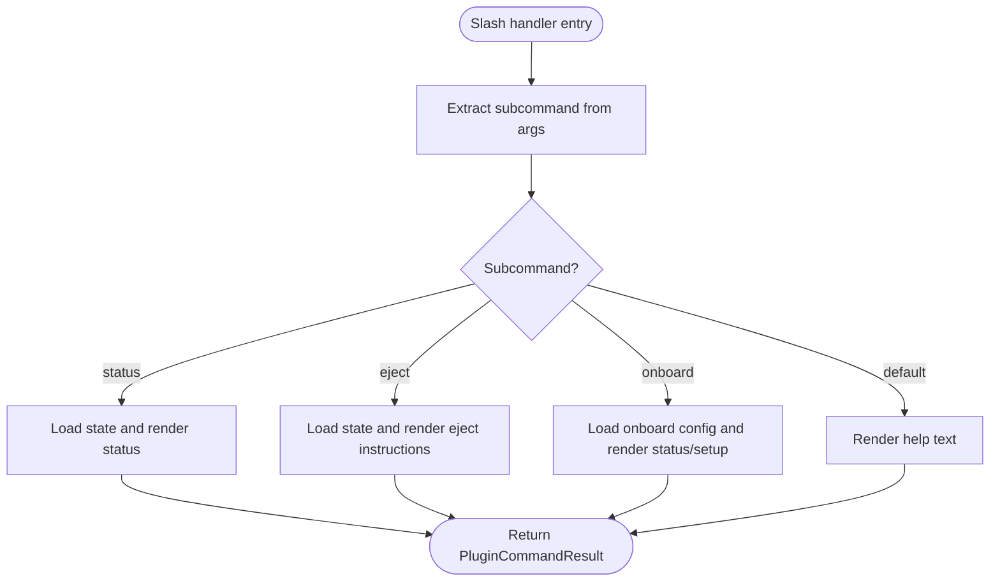
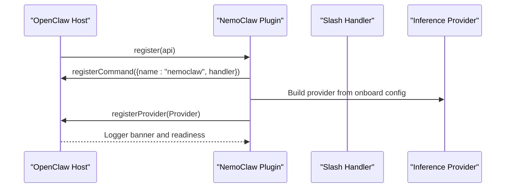
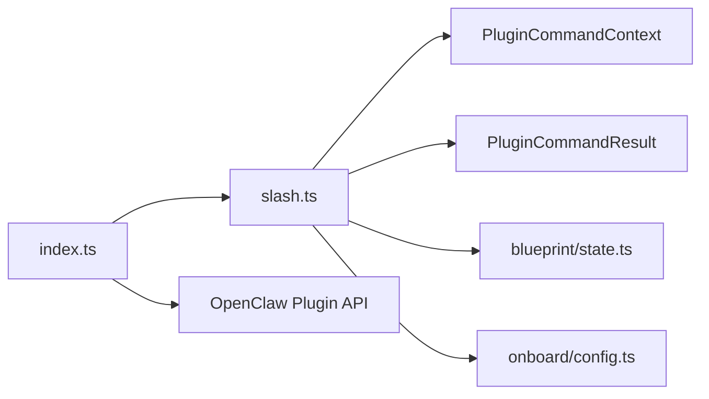

# Slash Commands

<cite>
**Referenced Files in This Document**
- [slash.ts](file://nemoclaw/src/commands/slash.ts)
- [slash.test.ts](file://nemoclaw/src/commands/slash.test.ts)
- [index.ts](file://nemoclaw/src/index.ts)
- [state.ts](file://nemoclaw/src/blueprint/state.ts)
- [config.ts](file://nemoclaw/src/onboard/config.ts)
- [openclaw.plugin.json](file://nemoclaw/openclaw.plugin.json)
- [commands.md](file://docs/reference/commands.md)
- [architecture.md](file://docs/reference/architecture.md)
- [runner.ts](file://nemoclaw/src/blueprint/runner.ts)
- [migration-state.ts](file://nemoclaw/src/commands/migration-state.ts)
</cite>

## Table of Contents
1. [Introduction](#introduction)
2. [Project Structure](#project-structure)
3. [Core Components](#core-components)
4. [Architecture Overview](#architecture-overview)
5. [Detailed Component Analysis](#detailed-component-analysis)
6. [Dependency Analysis](#dependency-analysis)
7. [Performance Considerations](#performance-considerations)
8. [Troubleshooting Guide](#troubleshooting-guide)
9. [Conclusion](#conclusion)
10. [Appendices](#appendices)

## Introduction
This document explains the slash command system for the NemoClaw OpenClaw plugin, focusing on how the /nemoclaw slash command integrates with the OpenClaw chat interface to extend sandbox functionality, enable dynamic agent operations, and provide an extensible command interface. It covers command registration, routing, validation, parameter handling, response formatting, and security considerations within the OpenClaw agent ecosystem.

## Project Structure
The slash command implementation resides in the NemoClaw plugin and interacts with onboarding and blueprint state modules. The plugin registers the slash command and exposes provider and service integrations.

**Diagram sources**
- [index.ts:237-244](file://nemoclaw/src/index.ts#L237-L244)
- [slash.ts:21-37](file://nemoclaw/src/commands/slash.ts#L21-L37)
- [state.ts:47-61](file://nemoclaw/src/blueprint/state.ts#L47-L61)
- [config.ts:91-103](file://nemoclaw/src/onboard/config.ts#L91-L103)

**Section sources**
- [index.ts:14-19](file://nemoclaw/src/index.ts#L14-L19)
- [slash.ts:13-19](file://nemoclaw/src/commands/slash.ts#L13-L19)
- [openclaw.plugin.json:1-33](file://nemoclaw/openclaw.plugin.json#L1-L33)

## Core Components
- Slash command handler: Parses subcommands and produces formatted responses for the chat interface.
- Plugin registration: Registers the slash command and inference provider with the OpenClaw host.
- State and onboarding modules: Provide runtime context for status and onboard subcommands.

Key responsibilities:
- Parse and route subcommands (status, eject, onboard).
- Validate presence of state and configuration before rendering responses.
- Render human-readable, structured text responses suitable for chat clients.

**Section sources**
- [slash.ts:21-147](file://nemoclaw/src/commands/slash.ts#L21-L147)
- [index.ts:237-249](file://nemoclaw/src/index.ts#L237-L249)
- [state.ts:9-18](file://nemoclaw/src/blueprint/state.ts#L9-L18)
- [config.ts:21-31](file://nemoclaw/src/onboard/config.ts#L21-L31)

## Architecture Overview
The slash command system is a thin extension layered on top of the OpenClaw plugin API. It leverages persistent state and onboarding configuration to inform responses, while the host manages permissions and routing.

**Diagram sources**
- [index.ts:237-244](file://nemoclaw/src/index.ts#L237-L244)
- [slash.ts:21-84](file://nemoclaw/src/commands/slash.ts#L21-L84)
- [state.ts:47-54](file://nemoclaw/src/blueprint/state.ts#L47-L54)

## Detailed Component Analysis

### Slash Command Handler
The handler extracts the first argument as the subcommand, then delegates to specialized functions. It supports:
- status: Reports last action, blueprint version, run ID, sandbox name, and optional rollback snapshot.
- eject: Provides rollback instructions when a snapshot or backup path is available.
- onboard: Displays onboarding status or setup guidance when no configuration exists.
- default: Renders help text with usage and subcommand list.

Response formatting:
- Responses are plain-text with line breaks and optional code blocks for commands.
- The handler avoids embedding secrets and defers to state and configuration modules for data.

Validation and parameter handling:
- Trims and splits the incoming arguments to derive the subcommand.
- Checks for presence of state and configuration before composing responses.

**Diagram sources**
- [slash.ts:21-37](file://nemoclaw/src/commands/slash.ts#L21-L37)
- [slash.ts:60-147](file://nemoclaw/src/commands/slash.ts#L60-L147)

**Section sources**
- [slash.ts:21-147](file://nemoclaw/src/commands/slash.ts#L21-L147)
- [slash.test.ts:32-54](file://nemoclaw/src/commands/slash.test.ts#L32-L54)

### Plugin Registration and Provider Integration
The plugin registers:
- The /nemoclaw slash command with a handler that delegates to the slash command module.
- A managed inference provider based on onboard configuration, including model entries and authentication method.

Registration contract:
- The plugin receives an OpenClawPluginApi with methods to register commands, providers, and services.
- The plugin defines command metadata (name, description, acceptsArgs) and a handler signature compatible with the host.

**Diagram sources**
- [index.ts:237-249](file://nemoclaw/src/index.ts#L237-L249)
- [index.ts:178-202](file://nemoclaw/src/index.ts#L178-L202)

**Section sources**
- [index.ts:237-266](file://nemoclaw/src/index.ts#L237-L266)
- [index.ts:178-202](file://nemoclaw/src/index.ts#L178-L202)

### State and Onboarding Modules
State module:
- Defines the NemoClawState interface and provides load/save/clear operations backed by a JSON file in the user’s home directory.
- Ensures the state directory exists before reading or writing.

Onboarding module:
- Defines NemoClawOnboardConfig and describes helper functions to render endpoint/provider descriptions.
- Provides load/save/clear operations for onboard configuration.

These modules supply the data used by slash subcommands to render meaningful status and onboard information.

**Section sources**
- [state.ts:9-70](file://nemoclaw/src/blueprint/state.ts#L9-L70)
- [config.ts:21-111](file://nemoclaw/src/onboard/config.ts#L21-L111)

### Blueprint and Migration Context
While the slash command handler focuses on chat responses, the broader NemoClaw system orchestrates sandbox lifecycle through blueprints and migration snapshots. The blueprint runner coordinates OpenShell CLI operations, and migration-state utilities manage safe state transfer and credential sanitization.

- Blueprint runner: Resolves, validates, plans, applies, and reports status for sandbox provisioning.
- Migration state: Creates and restores snapshots, sanitizing credentials and validating targets.

These components complement slash commands by enabling dynamic agent operations and safe rollback scenarios.

**Section sources**
- [runner.ts:79-144](file://nemoclaw/src/blueprint/runner.ts#L79-L144)
- [runner.ts:212-330](file://nemoclaw/src/blueprint/runner.ts#L212-L330)
- [migration-state.ts:670-743](file://nemoclaw/src/commands/migration-state.ts#L670-L743)

## Dependency Analysis
The slash command handler depends on:
- PluginCommandContext and PluginCommandResult types from the plugin API.
- State and onboarding modules for runtime data.
- The plugin registers the slash command with the host.

**Diagram sources**
- [slash.ts:13-19](file://nemoclaw/src/commands/slash.ts#L13-L19)
- [index.ts:38-56](file://nemoclaw/src/index.ts#L38-L56)

**Section sources**
- [slash.ts:13-19](file://nemoclaw/src/commands/slash.ts#L13-L19)
- [index.ts:38-56](file://nemoclaw/src/index.ts#L38-L56)

## Performance Considerations
- The slash command handler performs lightweight file I/O via state and onboarding modules. Ensure these modules are invoked only when needed to minimize latency.
- Keep response text concise and avoid heavy computations in the handler.
- Prefer caching small, frequently accessed data (e.g., last-known state) if repeated queries occur in rapid succession.

## Troubleshooting Guide
Common issues and resolutions:
- No operations performed yet: Indicates blank state. Trigger onboard to populate state and onboard configuration.
- No deployment found: The eject subcommand responds when no prior deployment state exists.
- Missing snapshot or backup path: The eject subcommand advises manual rollback when neither snapshot nor backup path is available.
- Unknown subcommand: The default branch renders help text with available subcommands.

Validation tips:
- Confirm that the command body includes the expected command prefix and subcommand.
- Ensure state and configuration files exist in the expected locations.

**Section sources**
- [slash.test.ts:80-94](file://nemoclaw/src/commands/slash.test.ts#L80-L94)
- [slash.test.ts:100-138](file://nemoclaw/src/commands/slash.test.ts#L100-L138)
- [slash.test.ts:144-196](file://nemoclaw/src/commands/slash.test.ts#L144-L196)
- [slash.test.ts:202-245](file://nemoclaw/src/commands/slash.test.ts#L202-L245)

## Conclusion
The slash command system provides a concise, chat-friendly interface for NemoClaw operations within the OpenClaw ecosystem. By registering a command and leveraging state and onboarding modules, it extends sandbox functionality with dynamic agent operations. The design emphasizes clarity, security (by avoiding secret embedding), and extensibility through the plugin API.

## Appendices

### Command Reference
- /nemoclaw: Show slash-command help and host CLI pointers.
- /nemoclaw status: Show sandbox and inference state.
- /nemoclaw onboard: Show onboarding status and reconfiguration guidance.
- /nemoclaw eject: Show rollback instructions for returning to the host installation.

**Section sources**
- [commands.md:27-36](file://docs/reference/commands.md#L27-L36)

### Plugin Configuration Schema
The plugin manifest defines configurable properties for blueprint version, registry, sandbox name, and inference provider type.

**Section sources**
- [openclaw.plugin.json:6-31](file://nemoclaw/openclaw.plugin.json#L6-L31)

### Security Considerations
- Slash command responses must not include secrets. The system relies on OpenShell’s provider credential mechanism and sanitization utilities for secure state transfer.
- Migration-state utilities strip credentials and validate restoration targets to prevent unsafe writes.

**Section sources**
- [migration-state.ts:480-550](file://nemoclaw/src/commands/migration-state.ts#L480-L550)
- [migration-state.ts:772-800](file://nemoclaw/src/commands/migration-state.ts#L772-L800)