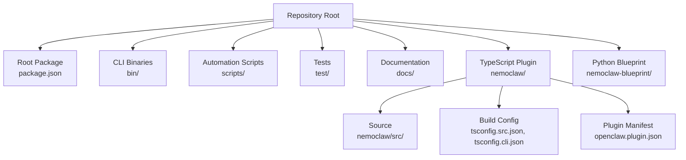
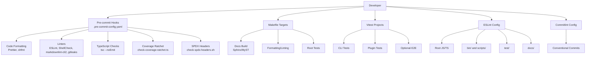
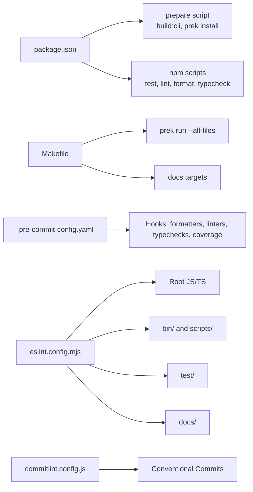

# Contributing Guide

<cite>
**Referenced Files in This Document**
- [CONTRIBUTING.md](file://CONTRIBUTING.md)
- [CODE_OF_CONDUCT.md](file://CODE_OF_CONDUCT.md)
- [SECURITY.md](file://SECURITY.md)
- [.github/PULL_REQUEST_TEMPLATE.md](file://.github/PULL_REQUEST_TEMPLATE.md)
- [.pre-commit-config.yaml](file://.pre-commit-config.yaml)
- [commitlint.config.js](file://commitlint.config.js)
- [eslint.config.mjs](file://eslint.config.mjs)
- [Makefile](file://Makefile)
- [package.json](file://package.json)
- [jsconfig.json](file://jsconfig.json)
- [tsconfig.src.json](file://tsconfig.src.json)
- [tsconfig.cli.json](file://tsconfig.cli.json)
- [vitest.config.ts](file://vitest.config.ts)
- [docs/CONTRIBUTING.md](file://docs/CONTRIBUTING.md)
- [scripts/docs-to-skills.py](file://scripts/docs-to-skills.py)
</cite>

## Table of Contents
1. [Introduction](#introduction)
2. [Project Structure](#project-structure)
3. [Core Components](#core-components)
4. [Architecture Overview](#architecture-overview)
5. [Detailed Component Analysis](#detailed-component-analysis)
6. [Dependency Analysis](#dependency-analysis)
7. [Performance Considerations](#performance-considerations)
8. [Troubleshooting Guide](#troubleshooting-guide)
9. [Conclusion](#conclusion)
10. [Appendices](#appendices)

## Introduction
This guide documents how to contribute effectively to NemoClaw. It covers prerequisites, development environment setup, coding standards, testing and quality gates, the pull request process, and community expectations. It also explains how documentation is maintained and how AI-generated skills are produced from docs.

## Project Structure
NemoClaw is a multi-language, multi-project repository:
- Root package and CLI live under the repository root.
- The TypeScript plugin resides under the nemoclaw directory.
- Python blueprints and documentation are under dedicated directories.
- Scripts and automation live under scripts/.
- Tests are split across root-level integration tests and plugin unit tests.

**Diagram sources**
- [package.json:1-60](file://package.json#L1-L60)
- [Makefile:1-34](file://Makefile#L1-L34)

**Section sources**
- [CONTRIBUTING.md:86-98](file://CONTRIBUTING.md#L86-L98)

## Core Components
This section summarizes the development toolchain and standards that contributors must follow.

- Prerequisites
  - Node.js and npm versions are specified in the root package engine field and installation instructions.
  - Python 3.11+ is required for blueprint and documentation builds.
  - Docker must be installed and running.
  - uv is used for Python dependency management.
  - hadolint is required for Dockerfile linting.

- Development Environment Setup
  - Install root dependencies and build the TypeScript plugin.
  - Install Python dependencies for the blueprint using uv.
  - Use Makefile targets for common tasks like formatting, linting, type checking, and docs building.

- Coding Standards
  - All new source files must be TypeScript.
  - Shell scripts must pass ShellCheck and use shfmt formatting.
  - Formatting and linting are enforced via pre-commit hooks and Makefile targets.

- Testing and Quality Gates
  - Unit tests use Vitest with multiple test projects (CLI, plugin, optional E2E).
  - Coverage thresholds are enforced per project.
  - Pre-push hooks run TypeScript type checks and coverage verification.

- Documentation
  - Docs are built with Sphinx/MyST and served locally via Makefile targets.
  - Doc-to-skills pipeline generates AI agent skills from docs for conversational assistance.

**Section sources**
- [CONTRIBUTING.md:13-36](file://CONTRIBUTING.md#L13-L36)
- [CONTRIBUTING.md:54-84](file://CONTRIBUTING.md#L54-L84)
- [CONTRIBUTING.md:107-138](file://CONTRIBUTING.md#L107-L138)
- [package.json:38-40](file://package.json#L38-L40)
- [Makefile:1-34](file://Makefile#L1-L34)
- [eslint.config.mjs:1-104](file://eslint.config.mjs#L1-L104)
- [vitest.config.ts:1-39](file://vitest.config.ts#L1-L39)
- [.pre-commit-config.yaml:1-248](file://.pre-commit-config.yaml#L1-L248)

## Architecture Overview
The contribution workflow integrates developer tools, CI-like pre-commit hooks, and repository policies.

**Diagram sources**
- [.pre-commit-config.yaml:1-248](file://.pre-commit-config.yaml#L1-L248)
- [Makefile:1-34](file://Makefile#L1-L34)
- [vitest.config.ts:1-39](file://vitest.config.ts#L1-L39)
- [eslint.config.mjs:1-104](file://eslint.config.mjs#L1-L104)
- [commitlint.config.js:1-24](file://commitlint.config.js#L1-L24)

## Detailed Component Analysis

### Development Environment Setup
- Prerequisites and installation
  - Node.js and npm versions are defined in the root package engines and installation steps.
  - Python 3.11+ and uv are required for blueprint and docs.
  - Docker must be installed and running.
  - hadolint is required for Dockerfile linting.

- Build and run
  - Install root dependencies and build the TypeScript plugin.
  - Install Python dependencies for the blueprint using uv.
  - Use Makefile targets for formatting, linting, type checking, and docs building.

- Local testing
  - Run root-level tests and plugin unit tests.
  - Use Makefile targets for docs preview and strict builds.

**Section sources**
- [CONTRIBUTING.md:13-36](file://CONTRIBUTING.md#L13-L36)
- [CONTRIBUTING.md:23-53](file://CONTRIBUTING.md#L23-L53)
- [CONTRIBUTING.md:54-69](file://CONTRIBUTING.md#L54-L69)
- [package.json:38-40](file://package.json#L38-L40)

### Coding Standards and Style Guidelines
- Language policy
  - All new source files must be TypeScript.
  - Prefer migrating existing JavaScript to TypeScript in the same PR.
  - Shell scripts must pass ShellCheck and use shfmt formatting.

- Formatting and linting
  - Prettier is used for TypeScript and JavaScript formatting.
  - ESLint enforces style rules across bin/, scripts/, test/, docs/, and root JS/TS.
  - Markdownlint-cli2 lints Markdown docs.
  - ShellCheck validates shell scripts.
  - gitleaks scans for secrets.
  - hadolint lints Dockerfiles.

- Pre-commit hooks
  - Pre-commit runs formatters, linters, and tests.
  - Commit-msg enforces Conventional Commits.
  - Pre-push runs TypeScript type checks and coverage verification.

- Version synchronization
  - Pre-push verifies package.json version matches git tag.

**Section sources**
- [CONTRIBUTING.md:99-106](file://CONTRIBUTING.md#L99-L106)
- [.pre-commit-config.yaml:59-162](file://.pre-commit-config.yaml#L59-L162)
- [eslint.config.mjs:16-103](file://eslint.config.mjs#L16-L103)
- [commitlint.config.js:4-23](file://commitlint.config.js#L4-L23)
- [.pre-commit-config.yaml:216-223](file://.pre-commit-config.yaml#L216-L223)

### Pull Request Process
- Branching and PR submission
  - Create a feature branch from main.
  - Make changes with tests.
  - Run make check and npm test to verify.
  - Open a PR.

- PR template requirements
  - Summarize changes, link related issues, and confirm checklist items.
  - Verify pre-commit checks, test runs, and docs builds (for doc-only changes).

- Review and limits
  - PRs require maintainer review.
  - Contributors should keep fewer than 10 open PRs at any time.

- Commit message format
  - Conventional Commits with allowed types: feat, fix, docs, chore, refactor, test, ci, perf, merge.

**Section sources**
- [CONTRIBUTING.md:168-225](file://CONTRIBUTING.md#L168-L225)
- [.github/PULL_REQUEST_TEMPLATE.md:1-47](file://.github/PULL_REQUEST_TEMPLATE.md#L1-L47)

### Contribution Types and Workflows
- Bug fixes
  - Include tests that fail before the fix and pass after.
  - Update docs if behavior changes.

- Feature additions
  - Add new functionality with tests.
  - Update relevant docs and run pre-commit checks.

- Documentation improvements
  - Edit pages under docs/.
  - Regenerate AI skills using the doc-to-skills pipeline.
  - Follow the docs style guide.

- Security patches
  - Report vulnerabilities privately using the security policy.
  - Do not open public issues or PRs for security problems.

**Section sources**
- [CONTRIBUTING.md:5-11](file://CONTRIBUTING.md#L5-L11)
- [CONTRIBUTING.md:107-138](file://CONTRIBUTING.md#L107-L138)
- [SECURITY.md:1-59](file://SECURITY.md#L1-L59)

### Documentation and Skills Pipeline
- Source of truth
  - All user-facing documentation lives under docs/.
  - Do not edit generated skill files under .agents/skills/ — they are overwritten by regeneration.

- Regeneration
  - Use the doc-to-skills script to convert docs into agent skills.
  - Use dry-run to preview changes before writing.

- Skill structure
  - Each skill directory contains a SKILL.md and a references/ folder with supporting content.

**Section sources**
- [CONTRIBUTING.md:122-167](file://CONTRIBUTING.md#L122-L167)
- [scripts/docs-to-skills.py](file://scripts/docs-to-skills.py)

### Continuous Integration and Release Procedures
- Pre-push checks
  - TypeScript type checks for plugin, CLI, and JS configs.
  - Coverage thresholds enforced per project.
  - Version-tag synchronization check.

- Coverage thresholds
  - CLI and plugin coverage thresholds are defined in CI configuration files.

- Release notes and tags
  - Ensure package.json version matches git tag before pushing.

**Section sources**
- [.pre-commit-config.yaml:185-243](file://.pre-commit-config.yaml#L185-L243)
- [ci/coverage-threshold-cli.json](file://ci/coverage-threshold-cli.json)
- [ci/coverage-threshold-plugin.json](file://ci/coverage-threshold-plugin.json)

### Community Guidelines and Communication
- Code of Conduct
  - The project follows the Contributor Covenant.
  - Enforcement and reporting channels are documented.

- Communication channels
  - Use GitHub issues for bugs and feature proposals.
  - Report security issues privately using the security policy.

**Section sources**
- [CODE_OF_CONDUCT.md:1-85](file://CODE_OF_CONDUCT.md#L1-L85)
- [SECURITY.md:1-59](file://SECURITY.md#L1-L59)
- [CONTRIBUTING.md:5-11](file://CONTRIBUTING.md#L5-L11)

## Dependency Analysis
The development toolchain is configured centrally and enforced by pre-commit hooks and Makefile targets.

**Diagram sources**
- [package.json:9-20](file://package.json#L9-L20)
- [Makefile:3-5](file://Makefile#L3-L5)
- [.pre-commit-config.yaml:1-248](file://.pre-commit-config.yaml#L1-L248)
- [eslint.config.mjs:1-104](file://eslint.config.mjs#L1-L104)
- [commitlint.config.js:4-23](file://commitlint.config.js#L4-L23)

**Section sources**
- [package.json:9-20](file://package.json#L9-L20)
- [Makefile:3-5](file://Makefile#L3-L5)
- [.pre-commit-config.yaml:1-248](file://.pre-commit-config.yaml#L1-L248)
- [eslint.config.mjs:1-104](file://eslint.config.mjs#L1-L104)
- [commitlint.config.js:4-23](file://commitlint.config.js#L4-L23)

## Performance Considerations
- Keep PRs focused and small to reduce review time and CI overhead.
- Use targeted formatting and linting runs via Makefile when iterating locally.
- Prefer incremental type checks during pre-push to speed up feedback loops.

## Troubleshooting Guide
- Git hooks not running
  - If you previously used Husky, unset core.hooksPath and re-run npm install so prek can register hooks.
  - Ensure the prek binary is available in PATH or installed as a devDependency.

- Pre-commit failures
  - Run npx prek run --all-files to reproduce CI checks locally.
  - Fix SPDX headers, formatting, linting, and type errors before retrying.

- Coverage failures
  - Ensure tests cover new or changed behavior.
  - Verify coverage thresholds for CLI and plugin projects.

- Version mismatch
  - Confirm package.json version matches the git tag before pushing.

**Section sources**
- [CONTRIBUTING.md:80-84](file://CONTRIBUTING.md#L80-L84)
- [.pre-commit-config.yaml:185-243](file://.pre-commit-config.yaml#L185-L243)

## Conclusion
By following the environment setup, coding standards, testing requirements, and PR process outlined here, contributors can efficiently collaborate on NemoClaw while maintaining high code quality and consistent documentation.

## Appendices

### Quick Reference: Common Tasks
- Install dependencies and build:
  - npm install
  - cd nemoclaw && npm install && npm run build && cd ..
  - cd nemoclaw-blueprint && uv sync && cd ..

- Lint and format:
  - make check
  - make format

- Type check:
  - npm run typecheck:cli
  - cd nemoclaw && npm run build

- Test:
  - npm test
  - cd nemoclaw && npm test

- Docs:
  - make docs
  - make docs-live

**Section sources**
- [CONTRIBUTING.md:25-53](file://CONTRIBUTING.md#L25-L53)
- [CONTRIBUTING.md:54-69](file://CONTRIBUTING.md#L54-L69)
- [Makefile:21-31](file://Makefile#L21-L31)