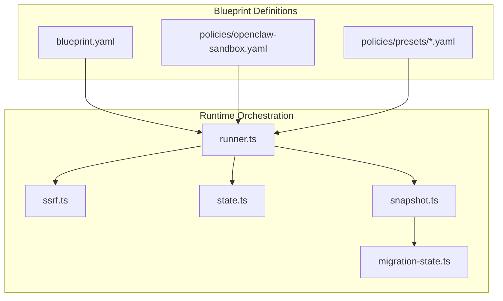
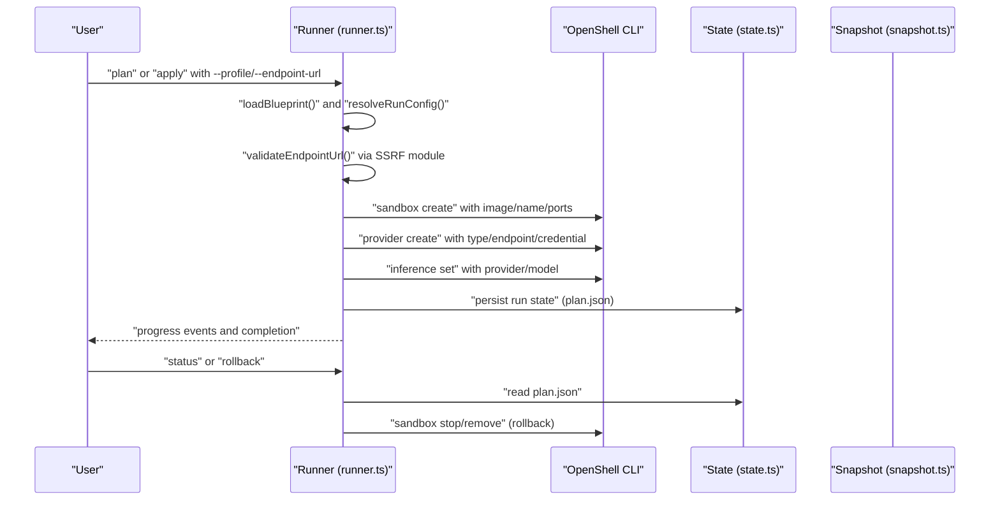
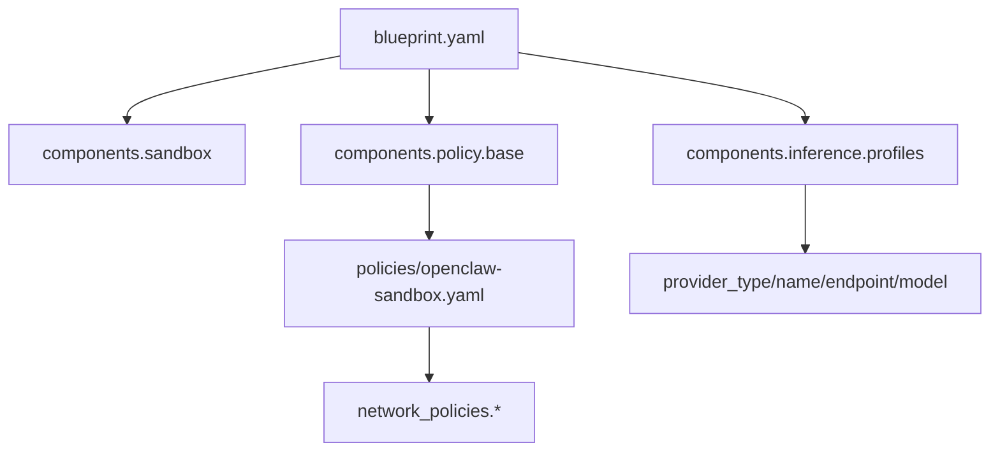
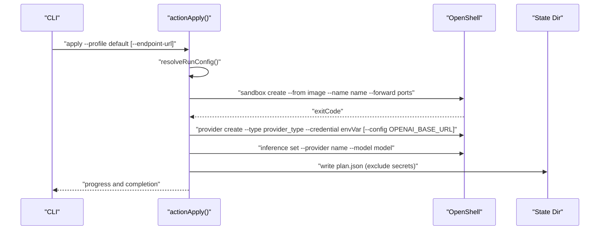
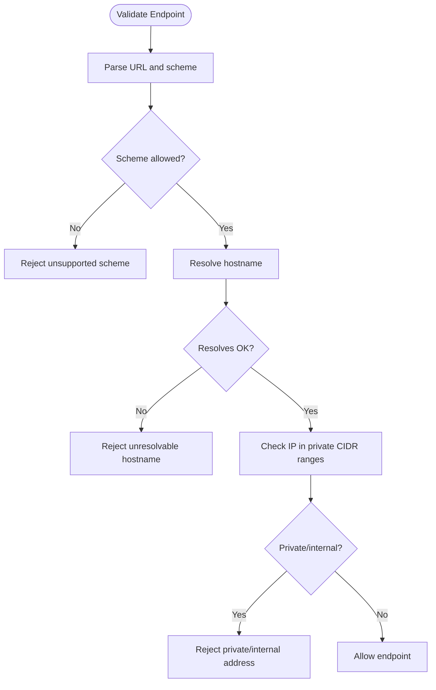
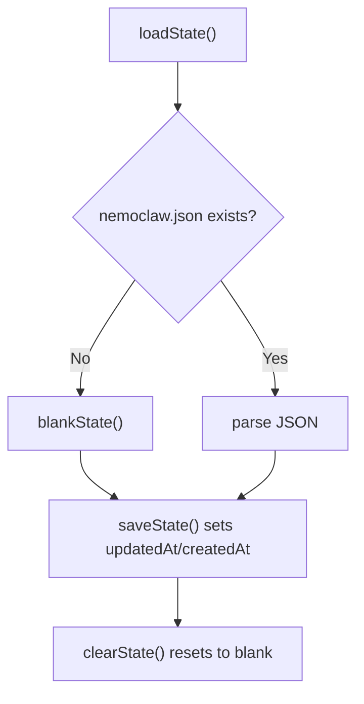
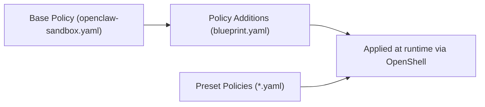
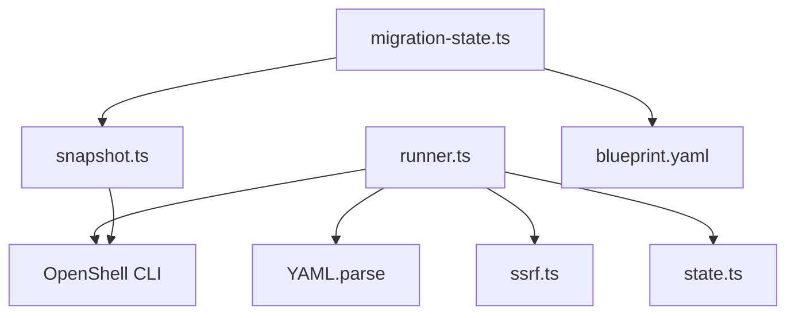

# Blueprint System

<cite>
**Referenced Files in This Document**
- [blueprint.yaml](file://nemoclaw-blueprint/blueprint.yaml)
- [openclaw-sandbox.yaml](file://nemoclaw-blueprint/policies/openclaw-sandbox.yaml)
- [brave.yaml](file://nemoclaw-blueprint/policies/presets/brave.yaml)
- [discord.yaml](file://nemoclaw-blueprint/policies/presets/discord.yaml)
- [runner.ts](file://nemoclaw/src/blueprint/runner.ts)
- [state.ts](file://nemoclaw/src/blueprint/state.ts)
- [snapshot.ts](file://nemoclaw/src/blueprint/snapshot.ts)
- [ssrf.ts](file://nemoclaw/src/blueprint/ssrf.ts)
- [migration-state.ts](file://nemoclaw/src/commands/migration-state.ts)
- [runner.test.ts](file://nemoclaw/src/blueprint/runner.test.ts)
- [state.test.ts](file://nemoclaw/src/blueprint/state.test.ts)
- [snapshot.test.ts](file://nemoclaw/src/blueprint/snapshot.test.ts)
- [ssrf.test.ts](file://nemoclaw/src/blueprint/ssrf.test.ts)
- [validate-blueprint.test.ts](file://test/validate-blueprint.test.ts)
</cite>

## Table of Contents
1. [Introduction](#introduction)
2. [Project Structure](#project-structure)
3. [Core Components](#core-components)
4. [Architecture Overview](#architecture-overview)
5. [Detailed Component Analysis](#detailed-component-analysis)
6. [Dependency Analysis](#dependency-analysis)
7. [Performance Considerations](#performance-considerations)
8. [Troubleshooting Guide](#troubleshooting-guide)
9. [Conclusion](#conclusion)
10. [Appendices](#appendices)

## Introduction
This document explains NemoClaw’s blueprint system for versioned blueprint architecture and configuration management. It covers the blueprint YAML structure, component definitions, policy enforcement, the blueprint runner that orchestrates sandbox creation via OpenShell CLI commands, state management for version tracking and migrations, and supply chain safety measures such as SSRF validation and blueprint digest verification. It also provides practical guidance for authoring and modifying blueprints safely.

## Project Structure
The blueprint system spans two primary areas:
- Blueprint definitions and policies under nemoclaw-blueprint
- Runtime orchestration, state, and migration logic under nemoclaw/src/blueprint and nemoclaw/src/commands

**Diagram sources**
- [blueprint.yaml:1-66](file://nemoclaw-blueprint/blueprint.yaml#L1-L66)
- [openclaw-sandbox.yaml:1-219](file://nemoclaw-blueprint/policies/openclaw-sandbox.yaml#L1-L219)
- [runner.ts:1-451](file://nemoclaw/src/blueprint/runner.ts#L1-L451)
- [ssrf.ts:1-156](file://nemoclaw/src/blueprint/ssrf.ts#L1-L156)
- [state.ts:1-70](file://nemoclaw/src/blueprint/state.ts#L1-L70)
- [snapshot.ts:1-177](file://nemoclaw/src/blueprint/snapshot.ts#L1-L177)
- [migration-state.ts:1-912](file://nemoclaw/src/commands/migration-state.ts#L1-L912)

**Section sources**
- [blueprint.yaml:1-66](file://nemoclaw-blueprint/blueprint.yaml#L1-L66)
- [openclaw-sandbox.yaml:1-219](file://nemoclaw-blueprint/policies/openclaw-sandbox.yaml#L1-L219)
- [runner.ts:1-451](file://nemoclaw/src/blueprint/runner.ts#L1-L451)

## Core Components
- Blueprint YAML: Defines versioning, minimum tool versions, profiles, components (sandbox, inference), and policy additions.
- Policies: Base sandbox policy and preset policies for external services.
- Runner: Loads blueprint, validates inputs, orchestrates OpenShell commands, persists run state, and supports status/rollback.
- SSRF validator: Enforces safe endpoint URLs by rejecting private/internal IPs and unsupported schemes.
- State manager: Tracks last run, blueprint version, and migration snapshot metadata.
- Snapshot manager: Captures, lists, restores, and rolls back host OpenClaw state into/out of the sandbox.
- Migration state: Creates and verifies blueprint digests for supply chain integrity during restore.

**Section sources**
- [blueprint.yaml:1-66](file://nemoclaw-blueprint/blueprint.yaml#L1-L66)
- [openclaw-sandbox.yaml:1-219](file://nemoclaw-blueprint/policies/openclaw-sandbox.yaml#L1-L219)
- [runner.ts:1-451](file://nemoclaw/src/blueprint/runner.ts#L1-L451)
- [ssrf.ts:1-156](file://nemoclaw/src/blueprint/ssrf.ts#L1-L156)
- [state.ts:1-70](file://nemoclaw/src/blueprint/state.ts#L1-L70)
- [snapshot.ts:1-177](file://nemoclaw/src/blueprint/snapshot.ts#L1-L177)
- [migration-state.ts:552-557](file://nemoclaw/src/commands/migration-state.ts#L552-L557)

## Architecture Overview
The blueprint runner parses blueprint.yaml, validates endpoints, and invokes OpenShell to create and configure the sandbox. It records run metadata locally and supports status queries and rollback. The snapshot subsystem migrates host OpenClaw state into the sandbox and enforces supply chain safety by computing and verifying blueprint digests.

**Diagram sources**
- [runner.ts:167-330](file://nemoclaw/src/blueprint/runner.ts#L167-L330)
- [ssrf.ts:118-155](file://nemoclaw/src/blueprint/ssrf.ts#L118-L155)
- [state.ts:47-61](file://nemoclaw/src/blueprint/state.ts#L47-L61)
- [snapshot.ts:34-135](file://nemoclaw/src/blueprint/snapshot.ts#L34-L135)

## Detailed Component Analysis

### Blueprint YAML Structure and Policy Enforcement
- Top-level fields: version, min_openshell_version, min_openclaw_version, digest, profiles, description.
- Components:
  - sandbox: image, name, forward_ports
  - inference: profiles with provider_type, provider_name, endpoint, model, credential_env, credential_default, dynamic_endpoint
  - policy: base policy path and additions appended at runtime
- Policy enforcement:
  - Base policy controls filesystem, process identity, and network_policies with explicit endpoints, protocols, enforcement modes, and TLS termination.
  - Preset policies demonstrate service-specific allowances (e.g., Brave Search, Discord) with binary allowlists.

**Diagram sources**
- [blueprint.yaml:9-66](file://nemoclaw-blueprint/blueprint.yaml#L9-L66)
- [openclaw-sandbox.yaml:46-219](file://nemoclaw-blueprint/policies/openclaw-sandbox.yaml#L46-L219)
- [brave.yaml:8-23](file://nemoclaw-blueprint/policies/presets/brave.yaml#L8-L23)
- [discord.yaml:8-47](file://nemoclaw-blueprint/policies/presets/discord.yaml#L8-L47)

**Section sources**
- [blueprint.yaml:1-66](file://nemoclaw-blueprint/blueprint.yaml#L1-L66)
- [openclaw-sandbox.yaml:1-219](file://nemoclaw-blueprint/policies/openclaw-sandbox.yaml#L1-L219)
- [brave.yaml:1-23](file://nemoclaw-blueprint/policies/presets/brave.yaml#L1-L23)
- [discord.yaml:1-47](file://nemoclaw-blueprint/policies/presets/discord.yaml#L1-L47)

### Blueprint Runner: Orchestration and Resource Provisioning
- Actions:
  - plan: validates blueprint, checks OpenShell availability, resolves profile and endpoint overrides, emits progress milestones, prints a JSON plan.
  - apply: creates sandbox, configures provider and inference route, persists run state, logs completion.
  - status: prints latest run plan or a specific run’s plan.
  - rollback: stops/removes sandbox if recorded, marks rollback timestamp.
- Endpoint validation: SSRF checks disallow private/internal IPs and unsupported schemes; supports dynamic endpoint override.
- Secrets handling: credentials passed via environment variable to provider create; persisted plan excludes credential_env and credential_default.

**Diagram sources**
- [runner.ts:212-330](file://nemoclaw/src/blueprint/runner.ts#L212-L330)

**Section sources**
- [runner.ts:167-330](file://nemoclaw/src/blueprint/runner.ts#L167-L330)
- [runner.test.ts:263-463](file://nemoclaw/src/blueprint/runner.test.ts#L263-L463)

### SSRF Validation and Supply Chain Safety
- SSRF module rejects private/internal addresses and unsupported URL schemes; validates DNS resolution; preserves URL path and port.
- Blueprint digest verification:
  - Migration state computes SHA-256 digest of blueprint file and stores it in snapshot manifest.
  - During restore, current blueprint digest is recomputed and compared to manifest; mismatch aborts restore.

**Diagram sources**
- [ssrf.ts:118-155](file://nemoclaw/src/blueprint/ssrf.ts#L118-L155)
- [migration-state.ts:853-884](file://nemoclaw/src/commands/migration-state.ts#L853-L884)

**Section sources**
- [ssrf.ts:1-156](file://nemoclaw/src/blueprint/ssrf.ts#L1-L156)
- [ssrf.test.ts:75-181](file://nemoclaw/src/blueprint/ssrf.test.ts#L75-L181)
- [migration-state.ts:853-884](file://nemoclaw/src/commands/migration-state.ts#L853-L884)

### State Management and Migrations
- State manager:
  - Tracks lastRunId, lastAction, blueprintVersion, sandboxName, migrationSnapshot, hostBackupPath, timestamps.
  - Ensures state directory exists, loads blank state if missing, persists updates.
- Snapshot manager:
  - Captures ~/.openclaw into snapshots with manifest listing files and timestamps.
  - Restores snapshot into sandbox via OpenShell copy, supports cutover and rollback.
- Migration state:
  - Creates snapshot bundles with sanitized configs and external roots.
  - Verifies blueprint digest during restore to prevent supply chain attacks.

**Diagram sources**
- [state.ts:47-70](file://nemoclaw/src/blueprint/state.ts#L47-L70)

**Section sources**
- [state.ts:1-70](file://nemoclaw/src/blueprint/state.ts#L1-L70)
- [snapshot.ts:57-135](file://nemoclaw/src/blueprint/snapshot.ts#L57-L135)
- [snapshot.test.ts:116-241](file://nemoclaw/src/blueprint/snapshot.test.ts#L116-L241)
- [migration-state.ts:670-743](file://nemoclaw/src/commands/migration-state.ts#L670-L743)

### Policy Additions and Presets
- Blueprint policy additions can extend base sandbox policy with additional endpoints and binaries.
- Preset policies encapsulate service-specific allowances for common integrations (e.g., Brave, Discord), enabling dynamic enablement via policy set.

**Diagram sources**
- [blueprint.yaml:57-66](file://nemoclaw-blueprint/blueprint.yaml#L57-L66)
- [openclaw-sandbox.yaml:1-219](file://nemoclaw-blueprint/policies/openclaw-sandbox.yaml#L1-L219)
- [brave.yaml:1-23](file://nemoclaw-blueprint/policies/presets/brave.yaml#L1-L23)
- [discord.yaml:1-47](file://nemoclaw-blueprint/policies/presets/discord.yaml#L1-L47)

**Section sources**
- [blueprint.yaml:57-66](file://nemoclaw-blueprint/blueprint.yaml#L57-L66)
- [openclaw-sandbox.yaml:46-219](file://nemoclaw-blueprint/policies/openclaw-sandbox.yaml#L46-L219)
- [brave.yaml:8-23](file://nemoclaw-blueprint/policies/presets/brave.yaml#L8-L23)
- [discord.yaml:8-47](file://nemoclaw-blueprint/policies/presets/discord.yaml#L8-L47)

## Dependency Analysis
- Runner depends on:
  - YAML parsing for blueprint loading
  - SSRF validator for endpoint safety
  - OpenShell CLI for sandbox and provider operations
  - Local state persistence for run metadata
- Snapshot and migration state depend on:
  - OpenShell sandbox copy operations
  - Filesystem traversal and tar archiving
  - Blueprint digest computation and verification

**Diagram sources**
- [runner.ts:79-89](file://nemoclaw/src/blueprint/runner.ts#L79-L89)
- [ssrf.ts:118-155](file://nemoclaw/src/blueprint/ssrf.ts#L118-L155)
- [snapshot.ts:81-96](file://nemoclaw/src/blueprint/snapshot.ts#L81-L96)
- [migration-state.ts:552-557](file://nemoclaw/src/commands/migration-state.ts#L552-L557)

**Section sources**
- [runner.ts:1-451](file://nemoclaw/src/blueprint/runner.ts#L1-L451)
- [snapshot.ts:1-177](file://nemoclaw/src/blueprint/snapshot.ts#L1-L177)
- [migration-state.ts:1-912](file://nemoclaw/src/commands/migration-state.ts#L1-L912)

## Performance Considerations
- Prefer dry-run plans to validate configurations before provisioning.
- Use default ports and minimal policy additions to reduce sandbox startup overhead.
- Keep blueprint profiles concise and avoid unnecessary dynamic_endpoint overrides.
- Snapshot operations traverse filesystem trees; ensure adequate disk space and avoid excessive external roots.

## Troubleshooting Guide
Common issues and resolutions:
- OpenShell not installed or not found:
  - The runner checks availability and exits with guidance if missing.
- Profile not found:
  - Ensure the requested profile exists in components.inference.profiles.
- Endpoint URL rejected:
  - Verify scheme (http/https), hostname resolves publicly, and address is not private/internal.
- Sandbox creation failures:
  - Review stderr output; “already exists” is handled by reuse; other errors indicate environment constraints.
- Status/rollback:
  - Ensure a run exists; status prints latest run plan; rollback writes a marker and attempts sandbox stop/remove.

**Section sources**
- [runner.ts:182-186](file://nemoclaw/src/blueprint/runner.ts#L182-L186)
- [runner.test.ts:175-250](file://nemoclaw/src/blueprint/runner.test.ts#L175-L250)
- [runner.test.ts:465-510](file://nemoclaw/src/blueprint/runner.test.ts#L465-L510)
- [runner.test.ts:511-576](file://nemoclaw/src/blueprint/runner.test.ts#L511-L576)

## Conclusion
NemoClaw’s blueprint system provides a robust, versioned, and secure framework for orchestrating OpenClaw sandboxes. Blueprints define sandbox and inference configuration, while policies govern network and filesystem access. The runner enforces safety via SSRF validation, persists run state, and integrates with snapshot and migration logic to maintain integrity and continuity. Supply chain safety is strengthened by blueprint digest verification during restore.

## Appendices

### Blueprint Configuration Syntax and Examples
- Blueprint top-level:
  - version, min_openshell_version, min_openclaw_version, digest, profiles, description
- Components.sandbox:
  - image, name, forward_ports
- Components.inference.profiles:
  - provider_type, provider_name, endpoint, model, credential_env, credential_default, dynamic_endpoint
- Components.policy:
  - base, additions

Example references:
- [blueprint.yaml:4-66](file://nemoclaw-blueprint/blueprint.yaml#L4-L66)
- [openclaw-sandbox.yaml:16-219](file://nemoclaw-blueprint/policies/openclaw-sandbox.yaml#L16-L219)
- [brave.yaml:4-23](file://nemoclaw-blueprint/policies/presets/brave.yaml#L4-L23)
- [discord.yaml:4-47](file://nemoclaw-blueprint/policies/presets/discord.yaml#L4-L47)

### Best Practices for Blueprint Authoring
- Define minimal profiles and keep endpoint URLs public and resolvable.
- Use credential_env and credential_default to inject secrets securely without baking them into artifacts.
- Leverage policy additions and presets for service-specific allowances.
- Validate blueprints with dedicated tests to catch missing fields or misconfigurations early.
- Maintain version fields and compute digest for supply chain integrity.

**Section sources**
- [validate-blueprint.test.ts:30-87](file://test/validate-blueprint.test.ts#L30-L87)
- [migration-state.ts:552-557](file://nemoclaw/src/commands/migration-state.ts#L552-L557)