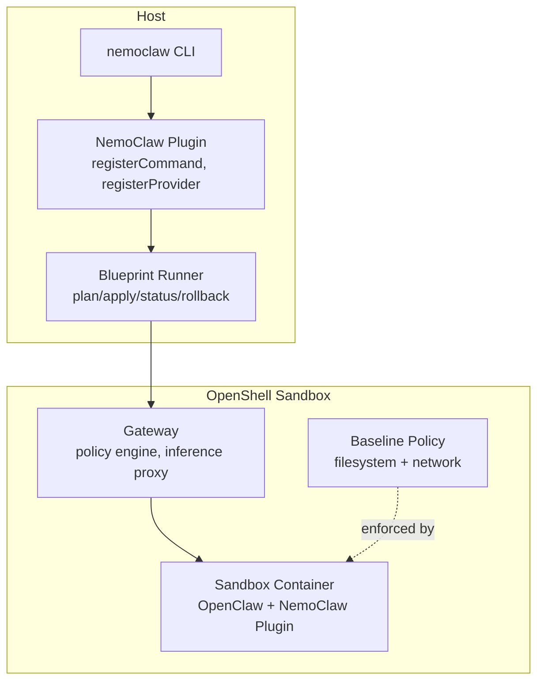
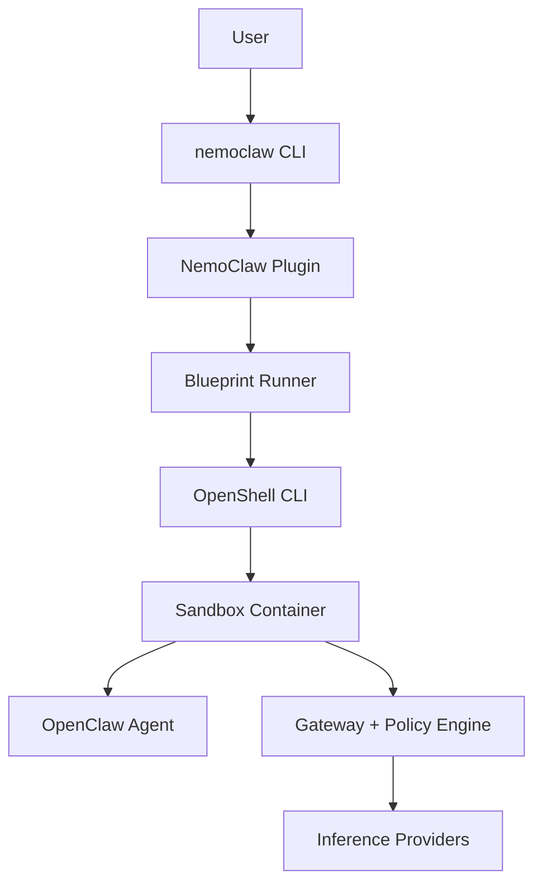
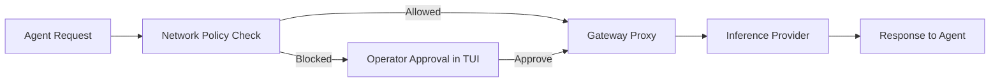
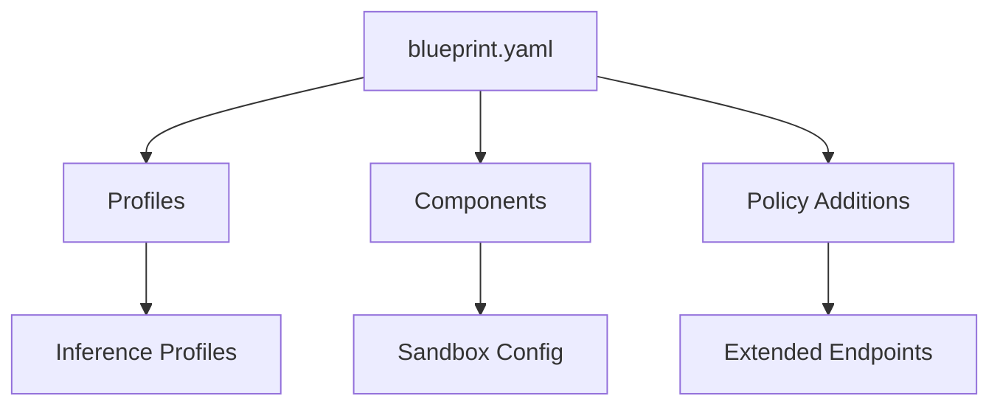
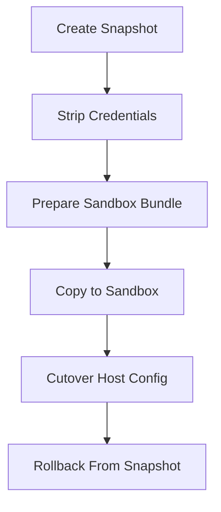
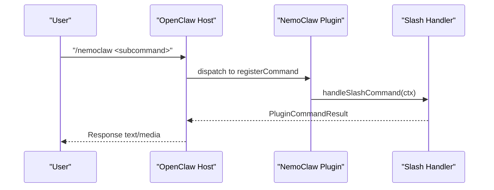
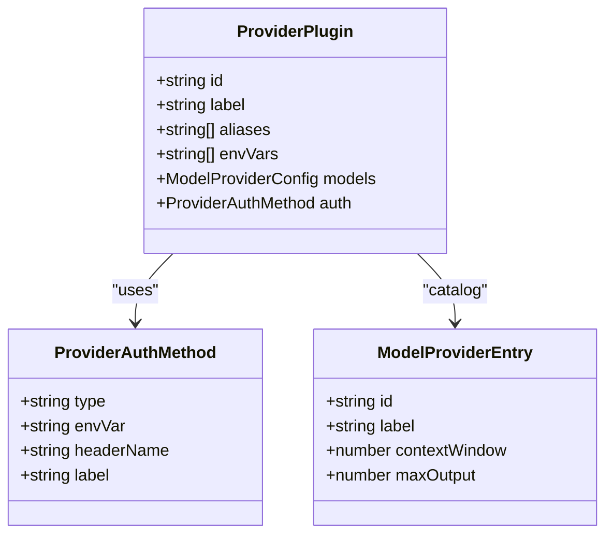
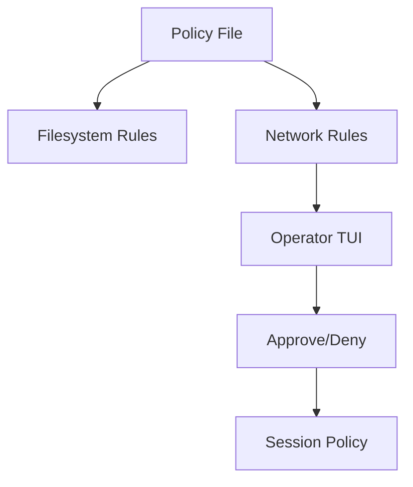
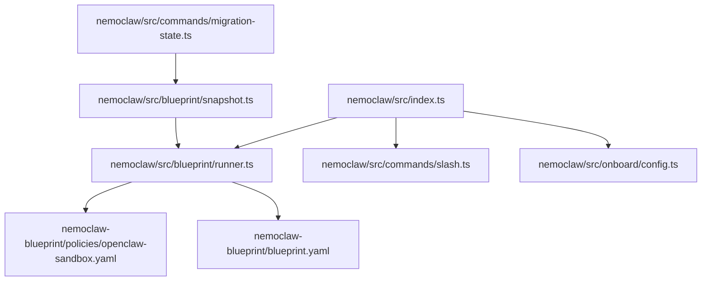

# Core Concepts

<cite>
**Referenced Files in This Document**
- [nemoclaw/src/index.ts](file://nemoclaw/src/index.ts)
- [nemoclaw/openclaw.plugin.json](file://nemoclaw/openclaw.plugin.json)
- [nemoclaw/src/blueprint/runner.ts](file://nemoclaw/src/blueprint/runner.ts)
- [nemoclaw/src/blueprint/state.ts](file://nemoclaw/src/blueprint/state.ts)
- [nemoclaw/src/blueprint/snapshot.ts](file://nemoclaw/src/blueprint/snapshot.ts)
- [nemoclaw/src/commands/slash.ts](file://nemoclaw/src/commands/slash.ts)
- [nemoclaw/src/onboard/config.ts](file://nemoclaw/src/onboard/config.ts)
- [nemoclaw/src/commands/migration-state.ts](file://nemoclaw/src/commands/migration-state.ts)
- [nemoclaw-blueprint/blueprint.yaml](file://nemoclaw-blueprint/blueprint.yaml)
- [nemoclaw-blueprint/policies/openclaw-sandbox.yaml](file://nemoclaw-blueprint/policies/openclaw-sandbox.yaml)
- [docs/reference/architecture.md](file://docs/reference/architecture.md)
- [docs/about/how-it-works.md](file://docs/about/how-it-works.md)
- [docs/reference/network-policies.md](file://docs/reference/network-policies.md)
- [docs/deployment/sandbox-hardening.md](file://docs/deployment/sandbox-hardening.md)
- [docs/security/best-practices.md](file://docs/security/best-practices.md)
- [README.md](file://README.md)
</cite>

## Table of Contents
1. [Introduction](#introduction)
2. [Project Structure](#project-structure)
3. [Core Components](#core-components)
4. [Architecture Overview](#architecture-overview)
5. [Detailed Component Analysis](#detailed-component-analysis)
6. [Dependency Analysis](#dependency-analysis)
7. [Performance Considerations](#performance-considerations)
8. [Troubleshooting Guide](#troubleshooting-guide)
9. [Conclusion](#conclusion)

## Introduction
This document explains the fundamental NemoClaw architectural principles and terminology. It covers:
- OpenShell sandboxing concepts and protection layers
- Blueprint configuration systems and lifecycle
- State management and migration handling
- The relationship between OpenClaw plugins and NemoClaw extensions
- The slash command system and provider registration mechanisms
- YAML-based blueprint configuration syntax, component definitions, and policy enforcement
- Practical examples showing how these concepts combine to create secure, reproducible agent environments

## Project Structure
NemoClaw is organized into a thin OpenClaw plugin and a versioned blueprint that orchestrates OpenShell resources. The plugin registers commands and providers, while the blueprint defines sandbox composition, policies, and lifecycle actions.

**Diagram sources**
- [docs/reference/architecture.md:31-86](file://docs/reference/architecture.md#L31-L86)
- [docs/about/how-it-works.md:44-81](file://docs/about/how-it-works.md#L44-L81)

**Section sources**
- [docs/reference/architecture.md:23-194](file://docs/reference/architecture.md#L23-L194)
- [docs/about/how-it-works.md:23-152](file://docs/about/how-it-works.md#L23-L152)

## Core Components
- Plugin entry and registration: Registers slash commands and inference providers, injects logger and OpenClaw host API.
- Blueprint runner: Resolves, validates, and executes sandbox lifecycle actions (plan, apply, status, rollback).
- State management: Persists run metadata and run IDs on the host for auditability and rollback.
- Migration snapshot: Captures, sanitizes, and moves host OpenClaw state into the sandbox with integrity checks.
- Slash command handler: Provides chat-based status, onboard, and eject guidance.
- Onboarding configuration: Stores endpoint/provider/model selections and credentials for provider registration.
- Blueprint configuration: Defines sandbox image, inference profiles, and policy additions.

**Section sources**
- [nemoclaw/src/index.ts:237-266](file://nemoclaw/src/index.ts#L237-L266)
- [nemoclaw/src/blueprint/runner.ts:167-451](file://nemoclaw/src/blueprint/runner.ts#L167-L451)
- [nemoclaw/src/blueprint/state.ts:47-70](file://nemoclaw/src/blueprint/state.ts#L47-L70)
- [nemoclaw/src/blueprint/snapshot.ts:57-177](file://nemoclaw/src/blueprint/snapshot.ts#L57-L177)
- [nemoclaw/src/commands/slash.ts:21-147](file://nemoclaw/src/commands/slash.ts#L21-L147)
- [nemoclaw/src/onboard/config.ts:91-111](file://nemoclaw/src/onboard/config.ts#L91-L111)
- [nemoclaw-blueprint/blueprint.yaml:19-66](file://nemoclaw-blueprint/blueprint.yaml#L19-L66)

## Architecture Overview
NemoClaw layers a hardened blueprint and state management atop OpenShell. The plugin remains thin and stable, delegating orchestration to the blueprint. The sandbox enforces filesystem, network, and process protections, while inference is routed through the gateway.

**Diagram sources**
- [docs/reference/architecture.md:40-86](file://docs/reference/architecture.md#L40-L86)
- [docs/about/how-it-works.md:114-131](file://docs/about/how-it-works.md#L114-L131)

**Section sources**
- [docs/reference/architecture.md:25-86](file://docs/reference/architecture.md#L25-L86)
- [docs/about/how-it-works.md:103-131](file://docs/about/how-it-works.md#L103-L131)

## Detailed Component Analysis

### OpenShell Sandboxing and Protection Layers
- Filesystem confinement: Read-only system paths, read-write access to sandbox and temp directories; process runs as a dedicated user.
- Network policy: Deny-by-default with operator approval flow; TLS termination at port 443; dynamic policy updates per session.
- Process controls: Capability drops, no-new-privileges, process limits; seccomp and Landlock LSM enforcement where supported.
- Inference routing: Requests are intercepted and proxied through the gateway using configured providers and credentials.

**Diagram sources**
- [docs/reference/network-policies.md:25-145](file://docs/reference/network-policies.md#L25-L145)
- [docs/security/best-practices.md:258-320](file://docs/security/best-practices.md#L258-L320)
- [docs/deployment/sandbox-hardening.md:25-91](file://docs/deployment/sandbox-hardening.md#L25-L91)

**Section sources**
- [docs/reference/network-policies.md:25-145](file://docs/reference/network-policies.md#L25-L145)
- [docs/security/best-practices.md:258-320](file://docs/security/best-practices.md#L258-L320)
- [docs/deployment/sandbox-hardening.md:25-91](file://docs/deployment/sandbox-hardening.md#L25-L91)

### Blueprint Configuration System
- Blueprint YAML defines versioning, minimum OpenShell/OpenClaw compatibility, profiles, components, and policy additions.
- Components include sandbox image, name, forwarded ports, and inference profiles with provider type/name, endpoint, model, and credential environment.
- Policy additions extend baseline rules (e.g., local NIM service endpoints) for the sandbox.

**Diagram sources**
- [nemoclaw-blueprint/blueprint.yaml:4-66](file://nemoclaw-blueprint/blueprint.yaml#L4-L66)

**Section sources**
- [nemoclaw-blueprint/blueprint.yaml:4-66](file://nemoclaw-blueprint/blueprint.yaml#L4-L66)

### Sandbox Lifecycle: Creation to Destruction
- Resolve: Locate blueprint artifact and verify compatibility.
- Verify: Check artifact digest against expected value.
- Plan: Determine resources to create/update (gateway, providers, sandbox, policy).
- Apply: Execute plan via OpenShell CLI (create sandbox, configure provider, set inference route).
- Status: Report current run state and plan.
- Rollback: Stop/remove sandbox and mark run state as rolled back.

**Diagram sources**
- [docs/reference/architecture.md:139-146](file://docs/reference/architecture.md#L139-L146)
- [nemoclaw/src/blueprint/runner.ts:167-451](file://nemoclaw/src/blueprint/runner.ts#L167-L451)

**Section sources**
- [docs/reference/architecture.md:137-152](file://docs/reference/architecture.md#L137-L152)
- [nemoclaw/src/blueprint/runner.ts:167-451](file://nemoclaw/src/blueprint/runner.ts#L167-L451)

### State Management and Migration Handling
- Host state: Persisted run metadata (last run ID, last action, blueprint version, sandbox name, migration snapshot, timestamps).
- Migration snapshot: Capture host OpenClaw state, sanitize credentials, and optionally restore into sandbox; supports cutover and rollback.
- Integrity verification: Blueprint digest validation during restore; strict containment checks for restore targets.

**Diagram sources**
- [nemoclaw/src/blueprint/snapshot.ts:57-135](file://nemoclaw/src/blueprint/snapshot.ts#L57-L135)
- [nemoclaw/src/commands/migration-state.ts:670-800](file://nemoclaw/src/commands/migration-state.ts#L670-L800)

**Section sources**
- [nemoclaw/src/blueprint/state.ts:47-70](file://nemoclaw/src/blueprint/state.ts#L47-L70)
- [nemoclaw/src/blueprint/snapshot.ts:57-177](file://nemoclaw/src/blueprint/snapshot.ts#L57-L177)
- [nemoclaw/src/commands/migration-state.ts:670-800](file://nemoclaw/src/commands/migration-state.ts#L670-L800)

### Plugin Architecture and Slash Command System
- Plugin registration: Registers a slash command and a managed inference provider with OpenClaw host API.
- Slash command handler: Provides status, onboard, and eject guidance; defers full management to the CLI.
- Provider registration: Builds provider metadata from onboard configuration, including model catalogs and authentication methods.

**Diagram sources**
- [nemoclaw/src/index.ts:237-266](file://nemoclaw/src/index.ts#L237-L266)
- [nemoclaw/src/commands/slash.ts:21-147](file://nemoclaw/src/commands/slash.ts#L21-L147)

**Section sources**
- [nemoclaw/src/index.ts:237-266](file://nemoclaw/src/index.ts#L237-L266)
- [nemoclaw/src/commands/slash.ts:21-147](file://nemoclaw/src/commands/slash.ts#L21-L147)

### Provider Registration Mechanisms
- Provider plugin definition: Includes id, label, aliases, environment variables, model catalogs, and authentication method.
- Managed provider: Built from onboard configuration, selecting endpoint type, provider label, and model entries.
- Authentication: Supports bearer token injection via environment variable; header name and label reflect provider-specific details.

**Diagram sources**
- [nemoclaw/src/index.ts:89-98](file://nemoclaw/src/index.ts#L89-L98)
- [nemoclaw/src/index.ts:67-87](file://nemoclaw/src/index.ts#L67-L87)
- [nemoclaw/src/index.ts:178-202](file://nemoclaw/src/index.ts#L178-L202)

**Section sources**
- [nemoclaw/src/index.ts:89-98](file://nemoclaw/src/index.ts#L89-L98)
- [nemoclaw/src/index.ts:178-202](file://nemoclaw/src/index.ts#L178-L202)

### Policy Enforcement and Baseline Rules
- Baseline policy: Deny-by-default filesystem and network rules; enforce TLS termination; restrict binaries per policy group.
- Dynamic approvals: Operator approval flow surfaces blocked requests in TUI; approved endpoints persist for the session.
- Static changes: Edit blueprint policy file and re-run onboarding; dynamic changes apply via OpenShell CLI.

**Diagram sources**
- [nemoclaw-blueprint/policies/openclaw-sandbox.yaml:16-219](file://nemoclaw-blueprint/policies/openclaw-sandbox.yaml#L16-L219)
- [docs/reference/network-policies.md:110-145](file://docs/reference/network-policies.md#L110-L145)

**Section sources**
- [nemoclaw-blueprint/policies/openclaw-sandbox.yaml:16-219](file://nemoclaw-blueprint/policies/openclaw-sandbox.yaml#L16-L219)
- [docs/reference/network-policies.md:25-145](file://docs/reference/network-policies.md#L25-L145)

## Dependency Analysis
- Plugin depends on OpenClaw host API for command and provider registration, and on onboard configuration for provider metadata.
- Blueprint runner depends on OpenShell CLI for sandbox and policy operations; validates endpoints and SSRF risks.
- State and snapshot modules depend on filesystem and OpenShell sandbox copy operations.
- Policy enforcement depends on baseline YAML and OpenShell gateway.

**Diagram sources**
- [nemoclaw/src/index.ts:14-19](file://nemoclaw/src/index.ts#L14-L19)
- [nemoclaw/src/blueprint/runner.ts:79-89](file://nemoclaw/src/blueprint/runner.ts#L79-L89)
- [nemoclaw/src/blueprint/snapshot.ts:81-96](file://nemoclaw/src/blueprint/snapshot.ts#L81-L96)
- [nemoclaw/src/commands/migration-state.ts:670-743](file://nemoclaw/src/commands/migration-state.ts#L670-L743)

**Section sources**
- [nemoclaw/src/index.ts:14-19](file://nemoclaw/src/index.ts#L14-L19)
- [nemoclaw/src/blueprint/runner.ts:79-89](file://nemoclaw/src/blueprint/runner.ts#L79-L89)
- [nemoclaw/src/blueprint/snapshot.ts:81-96](file://nemoclaw/src/blueprint/snapshot.ts#L81-L96)
- [nemoclaw/src/commands/migration-state.ts:670-743](file://nemoclaw/src/commands/migration-state.ts#L670-L743)

## Performance Considerations
- Prefer digest-verified blueprints to avoid repeated downloads and ensure reproducibility.
- Use static policy changes for frequently accessed endpoints to minimize operator intervention.
- Keep inference provider endpoints close to the gateway to reduce latency.
- Limit external workspace roots migrated into the sandbox to reduce snapshot size and restore time.

## Troubleshooting Guide
- Sandbox creation failures: Verify OpenShell availability and that the sandbox name is unique; review runner logs for create command exit codes.
- Policy denials: Use the TUI to approve blocked endpoints; confirm policy file correctness and endpoint reachability.
- Migration issues: Ensure snapshot integrity (digest validation) and that restore targets are within trusted host roots; check credential stripping and sanitized config paths.
- Provider configuration: Confirm environment variables and endpoint URLs; validate model entries and authentication headers.

**Section sources**
- [nemoclaw/src/blueprint/runner.ts:212-331](file://nemoclaw/src/blueprint/runner.ts#L212-L331)
- [docs/reference/network-policies.md:110-145](file://docs/reference/network-policies.md#L110-L145)
- [nemoclaw/src/commands/migration-state.ts:853-884](file://nemoclaw/src/commands/migration-state.ts#L853-L884)

## Conclusion
NemoClaw’s architecture combines a stable plugin with a versioned, digest-verified blueprint to deliver a secure, reproducible sandboxed environment for OpenClaw. Protection layers (filesystem, network, process, inference) are enforced by OpenShell, while NemoClaw manages provider registration, slash commands, and robust state migration. The blueprint configuration system and policy enforcement ensure least-privilege access and operator control, enabling safe experimentation and reliable operations.