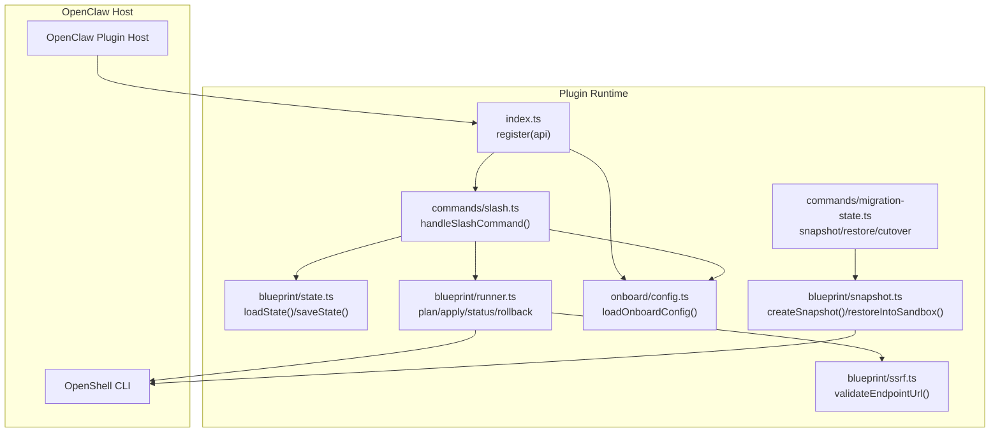
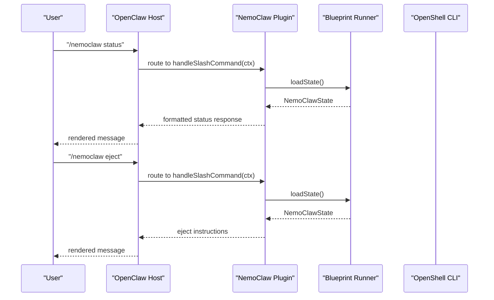
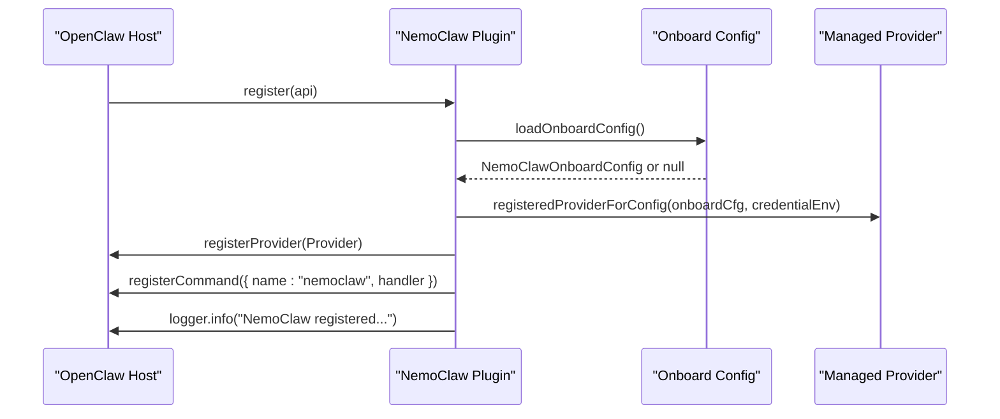
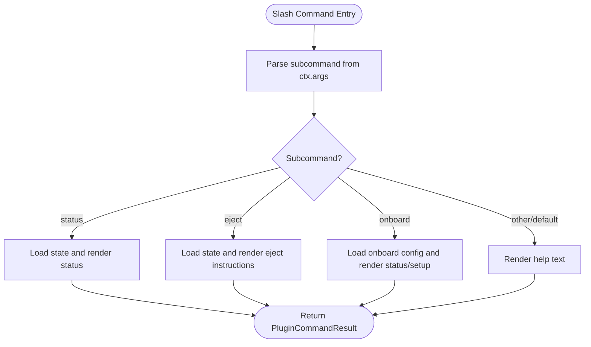
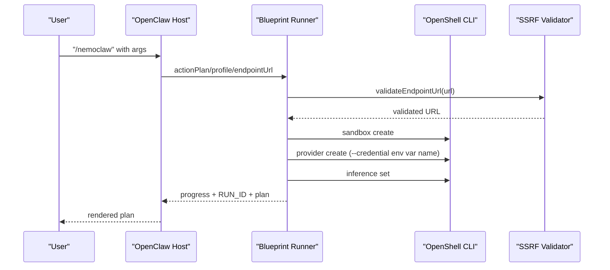
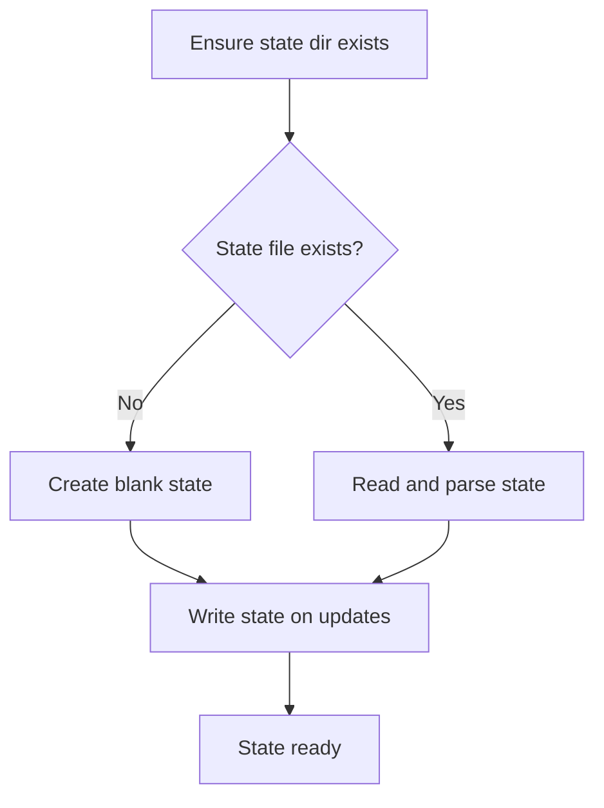
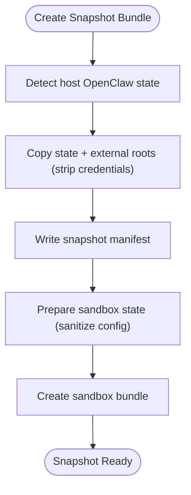
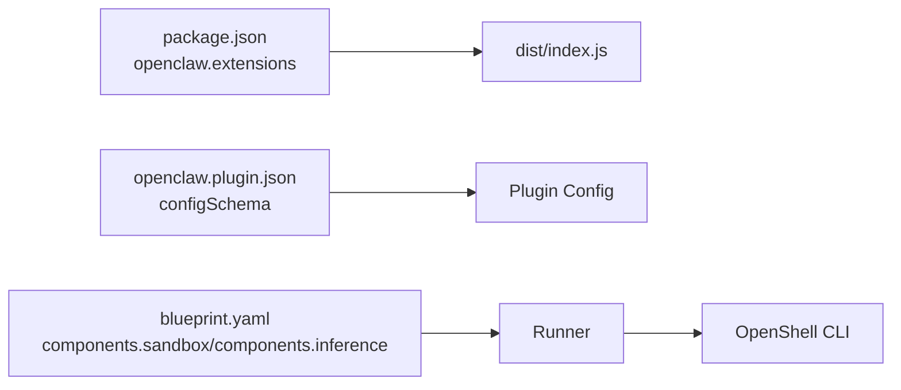

# Plugin Architecture

<cite>
**Referenced Files in This Document**
- [nemoclaw/src/index.ts](file://nemoclaw/src/index.ts)
- [nemoclaw/openclaw.plugin.json](file://nemoclaw/openclaw.plugin.json)
- [nemoclaw/src/commands/slash.ts](file://nemoclaw/src/commands/slash.ts)
- [nemoclaw/src/blueprint/state.ts](file://nemoclaw/src/blueprint/state.ts)
- [nemoclaw/src/blueprint/runner.ts](file://nemoclaw/src/blueprint/runner.ts)
- [nemoclaw/src/onboard/config.ts](file://nemoclaw/src/onboard/config.ts)
- [nemoclaw/src/blueprint/snapshot.ts](file://nemoclaw/src/blueprint/snapshot.ts)
- [nemoclaw/src/blueprint/ssrf.ts](file://nemoclaw/src/blueprint/ssrf.ts)
- [nemoclaw/src/commands/migration-state.ts](file://nemoclaw/src/commands/migration-state.ts)
- [nemoclaw/src/commands/slash.test.ts](file://nemoclaw/src/commands/slash.test.ts)
- [nemoclaw/src/register.test.ts](file://nemoclaw/src/register.test.ts)
- [nemoclaw/src/blueprint/runner.test.ts](file://nemoclaw/src/blueprint/runner.test.ts)
- [nemoclaw/package.json](file://nemoclaw/package.json)
- [nemoclaw-blueprint/blueprint.yaml](file://nemoclaw-blueprint/blueprint.yaml)
</cite>

## Table of Contents
1. [Introduction](#introduction)
2. [Project Structure](#project-structure)
3. [Core Components](#core-components)
4. [Architecture Overview](#architecture-overview)
5. [Detailed Component Analysis](#detailed-component-analysis)
6. [Dependency Analysis](#dependency-analysis)
7. [Performance Considerations](#performance-considerations)
8. [Troubleshooting Guide](#troubleshooting-guide)
9. [Conclusion](#conclusion)
10. [Appendices](#appendices)

## Introduction
This document explains NemoClaw’s plugin architecture and its integration with OpenClaw and OpenShell. It focuses on how the plugin registers slash commands, providers, and services; how it wraps blueprint execution; and how it coordinates state, credentials, and the user interface. It also covers configuration, command routing, service discovery, lifecycle, error handling, debugging, and extension guidance.

## Project Structure
NemoClaw is implemented as a TypeScript plugin packaged for OpenClaw. The plugin exposes:
- A slash command handler for /nemoclaw
- A managed inference provider registration
- A thin wrapper around blueprint-driven sandbox lifecycle orchestration
- Persistent state and onboard configuration management
- Security controls for endpoint validation and credential handling

**Diagram sources**
- [nemoclaw/src/index.ts:237-265](file://nemoclaw/src/index.ts#L237-L265)
- [nemoclaw/src/commands/slash.ts:21-37](file://nemoclaw/src/commands/slash.ts#L21-L37)
- [nemoclaw/src/blueprint/state.ts:47-61](file://nemoclaw/src/blueprint/state.ts#L47-L61)
- [nemoclaw/src/blueprint/runner.ts:167-330](file://nemoclaw/src/blueprint/runner.ts#L167-L330)
- [nemoclaw/src/blueprint/ssrf.ts:118-155](file://nemocaw/src/blueprint/ssrf.ts#L118-L155)
- [nemoclaw/src/onboard/config.ts:91-110](file://nemoclaw/src/onboard/config.ts#L91-L110)
- [nemoclaw/src/blueprint/snapshot.ts:81-96](file://nemoclaw/src/blueprint/snapshot.ts#L81-L96)
- [nemoclaw/src/commands/migration-state.ts:670-743](file://nemoclaw/src/commands/migration-state.ts#L670-L743)

**Section sources**
- [nemoclaw/src/index.ts:1-266](file://nemoclaw/src/index.ts#L1-L266)
- [nemoclaw/openclaw.plugin.json:1-33](file://nemoclaw/openclaw.plugin.json#L1-L33)

## Core Components
- Plugin registration and API surface
  - The plugin defines OpenClaw-compatible types and registers:
    - A slash command named “nemoclaw”
    - A managed inference provider
    - Optional background services
  - Plugin configuration is read from openclaw.plugin.json and exposed via api.pluginConfig.

- Slash command system
  - /nemoclaw supports subcommands:
    - status: displays sandbox/blueprint/inference state
    - eject: shows rollback instructions
    - onboard: shows onboarding status and instructions
    - help: prints usage

- Provider registration
  - Registers a provider with model catalogs and authentication method derived from onboard configuration.
  - Supports multiple endpoint types and credential environments.

- Blueprint runner
  - Orchestrates sandbox lifecycle via OpenShell CLI:
    - plan: validates blueprint and emits a plan with progress markers
    - apply: creates sandbox, sets provider/model, persists run state
    - status: prints latest run plan or a specific run
    - rollback: stops/removes sandbox and marks rollback

- State and onboarding
  - Persistent state stored under ~/.nemoclaw/state
  - Onboard configuration stored under ~/.nemocaw/config.json with human-readable descriptions

- Security and SSRF protection
  - Validates inference endpoint URLs and blocks private/internal addresses

**Section sources**
- [nemoclaw/src/index.ts:237-265](file://nemoclaw/src/index.ts#L237-L265)
- [nemoclaw/src/commands/slash.ts:21-37](file://nemoclaw/src/commands/slash.ts#L21-L37)
- [nemoclaw/src/blueprint/runner.ts:167-330](file://nemoclaw/src/blueprint/runner.ts#L167-L330)
- [nemoclaw/src/blueprint/state.ts:47-61](file://nemoclaw/src/blueprint/state.ts#L47-L61)
- [nemoclaw/src/onboard/config.ts:91-110](file://nemoclaw/src/onboard/config.ts#L91-L110)
- [nemoclaw/src/blueprint/ssrf.ts:118-155](file://nemoclaw/src/blueprint/ssrf.ts#L118-L155)

## Architecture Overview
The plugin acts as a thin wrapper around blueprint execution. It delegates:
- Command routing to the slash command handler
- Provider setup to OpenShell via the runner
- State persistence to local files
- Security checks to SSRF validation

**Diagram sources**
- [nemoclaw/src/commands/slash.ts:21-37](file://nemoclaw/src/commands/slash.ts#L21-L37)
- [nemoclaw/src/blueprint/state.ts:47-61](file://nemoclaw/src/blueprint/state.ts#L47-L61)

**Section sources**
- [nemoclaw/src/index.ts:237-265](file://nemoclaw/src/index.ts#L237-L265)
- [nemoclaw/src/commands/slash.ts:21-37](file://nemoclaw/src/commands/slash.ts#L21-L37)

## Detailed Component Analysis

### Plugin Registration and Provider Setup
- Registration flow
  - register(api) is the plugin entry point invoked by the OpenClaw host.
  - Registers:
    - Slash command “nemoclaw” with handler
    - Managed inference provider based on onboard configuration
  - Logs a banner summarizing endpoint/provider/model and slash command availability.

- Provider registration
  - Provider id and label are fixed for managed inference.
  - Models are dynamically populated from onboard configuration or a default catalog.
  - Authentication method is derived from the onboard credential environment variable.

**Diagram sources**
- [nemoclaw/src/index.ts:237-265](file://nemoclaw/src/index.ts#L237-L265)
- [nemoclaw/src/onboard/config.ts:91-110](file://nemoclaw/src/onboard/config.ts#L91-L110)

**Section sources**
- [nemoclaw/src/index.ts:237-265](file://nemoclaw/src/index.ts#L237-L265)
- [nemoclaw/src/register.test.ts:39-80](file://nemoclaw/src/register.test.ts#L39-L80)

### Slash Command Implementation
- Supported subcommands
  - status: prints last action, blueprint version, run ID, sandbox name, updated time, and optional rollback snapshot.
  - eject: prints rollback instructions or indicates manual rollback required.
  - onboard: prints onboard status or setup instructions.
  - help: prints usage and subcommand list.

- Routing and context
  - The handler parses the first token of ctx.args to select a subcommand.
  - Uses onboard configuration and state to tailor responses.

**Diagram sources**
- [nemoclaw/src/commands/slash.ts:21-37](file://nemoclaw/src/commands/slash.ts#L21-L37)

**Section sources**
- [nemoclaw/src/commands/slash.ts:21-147](file://nemoclaw/src/commands/slash.ts#L21-L147)
- [nemoclaw/src/commands/slash.test.ts:69-247](file://nemoclaw/src/commands/slash.test.ts#L69-L247)

### Blueprint Runner and Sandbox Lifecycle
- Actions
  - plan: validates blueprint, checks OpenShell availability, emits progress, and prints a JSON plan.
  - apply: creates sandbox, sets provider/model, persists run state, and emits progress.
  - status: prints latest run plan or a specific run.
  - rollback: stops/removes sandbox and marks rollback.

- Endpoint overrides and SSRF protection
  - Accepts --endpoint-url to override blueprint endpoints.
  - Validates endpoints via SSRF checks before use.

- Credential handling
  - Reads credentials from environment variables or defaults.
  - Passes credential names to OpenShell provider creation without leaking values into global process environment.

**Diagram sources**
- [nemoclaw/src/blueprint/runner.ts:167-330](file://nemoclaw/src/blueprint/runner.ts#L167-L330)
- [nemoclaw/src/blueprint/ssrf.ts:118-155](file://nemoclaw/src/blueprint/ssrf.ts#L118-L155)

**Section sources**
- [nemoclaw/src/blueprint/runner.ts:167-330](file://nemoclaw/src/blueprint/runner.ts#L167-L330)
- [nemoclaw/src/blueprint/runner.test.ts:132-261](file://nemoclaw/src/blueprint/runner.test.ts#L132-L261)

### State Management and Onboarding
- State persistence
  - State is stored under ~/.nemoclaw/state/nemoclaw.json with fields for last action, blueprint version, run ID, sandbox name, migration snapshot, host backup path, and timestamps.

- Onboarding configuration
  - Stored under ~/.nemocaw/config.json with endpoint type/url, model, profile, credential environment, provider label, and onboard timestamp.
  - Human-readable descriptions for endpoint/provider are computed for UI presentation.

**Diagram sources**
- [nemoclaw/src/blueprint/state.ts:47-61](file://nemoclaw/src/blueprint/state.ts#L47-L61)

**Section sources**
- [nemoclaw/src/blueprint/state.ts:47-61](file://nemoclaw/src/blueprint/state.ts#L47-L61)
- [nemoclaw/src/onboard/config.ts:91-110](file://nemoclaw/src/onboard/config.ts#L91-L110)

### Migration Snapshot and Restore
- Snapshot creation
  - Captures host OpenClaw state and external roots, sanitizes credentials, and writes a manifest.

- Restore and cutover
  - Restores snapshot into sandbox filesystem and performs host cutover or rollback.

- Security
  - Strips sensitive files and fields, validates restore targets, and sanitizes configuration before entering sandbox.

**Diagram sources**
- [nemoclaw/src/commands/migration-state.ts:670-743](file://nemoclaw/src/commands/migration-state.ts#L670-L743)

**Section sources**
- [nemoclaw/src/commands/migration-state.ts:670-743](file://nemoclaw/src/commands/migration-state.ts#L670-L743)
- [nemoclaw/src/blueprint/snapshot.ts:57-96](file://nemoclaw/src/blueprint/snapshot.ts#L57-L96)

## Dependency Analysis
- Plugin packaging and schema
  - openclaw.plugin.json defines plugin identity, version, description, and configSchema for blueprintVersion, blueprintRegistry, sandboxName, and inferenceProvider.
  - package.json declares the plugin entry point and build outputs.

- Blueprint integration
  - The runner loads blueprint.yaml from the blueprint directory and uses its components to configure sandbox and inference.

**Diagram sources**
- [nemoclaw/package.json:9-13](file://nemoclaw/package.json#L9-L13)
- [nemoclaw/openclaw.plugin.json:6-31](file://nemoclaw/openclaw.plugin.json#L6-L31)
- [nemoclaw-blueprint/blueprint.yaml:19-66](file://nemoclaw-blueprint/blueprint.yaml#L19-L66)

**Section sources**
- [nemoclaw/package.json:1-49](file://nemoclaw/package.json#L1-L49)
- [nemoclaw/openclaw.plugin.json:1-33](file://nemoclaw/openclaw.plugin.json#L1-L33)
- [nemoclaw-blueprint/blueprint.yaml:1-66](file://nemoclaw-blueprint/blueprint.yaml#L1-L66)

## Performance Considerations
- Minimize synchronous filesystem operations in hot paths; the runner already streams progress and defers heavy operations to subprocesses.
- Prefer caching where appropriate (e.g., onboard config) to reduce repeated IO.
- Keep blueprint parsing lightweight; avoid unnecessary recomputation of plans.

## Troubleshooting Guide
- Slash command not recognized
  - Verify the plugin is registered and the command name matches “nemoclaw”.

- Provider not available
  - Confirm onboard configuration exists and provider registration succeeded.

- Sandbox creation failures
  - Check OpenShell availability and permissions; review runner logs for “already exists” reuse or other errors.

- Endpoint URL rejected
  - SSRF validation blocks private/internal addresses; adjust endpoint to a public URL.

- State not updating
  - Ensure state directory exists and is writable; confirm saveState is called after actions.

- Migration restore issues
  - Validate snapshot integrity and restore target containment; ensure host cutover/rollback steps are executed.

**Section sources**
- [nemoclaw/src/commands/slash.test.ts:69-247](file://nemoclaw/src/commands/slash.test.ts#L69-L247)
- [nemoclaw/src/blueprint/runner.test.ts:132-261](file://nemoclaw/src/blueprint/runner.test.ts#L132-L261)
- [nemoclaw/src/blueprint/ssrf.ts:118-155](file://nemoclaw/src/blueprint/ssrf.ts#L118-L155)

## Conclusion
NemoClaw’s plugin architecture cleanly separates concerns: the plugin registers commands and providers, delegates sandbox lifecycle to the runner, and manages state and onboarding. It integrates tightly with OpenClaw and OpenShell while enforcing security boundaries and providing robust error handling and diagnostics.

## Appendices

### Practical Examples

- Plugin configuration
  - Configure blueprintVersion, blueprintRegistry, sandboxName, and inferenceProvider via openclaw.plugin.json. Defaults are applied when values are omitted or invalid.

- Command routing
  - /nemoclaw status: shows last action, blueprint version, run ID, sandbox name, updated time, and rollback snapshot if present.
  - /nemoclaw eject: shows rollback instructions or indicates manual rollback required.
  - /nemoclaw onboard: shows onboard status or setup instructions.

- State management
  - State is persisted under ~/.nemoclaw/state/nemoclaw.json; blank state is created automatically if missing.

- Provider registration
  - Provider id is “inference”; models are derived from onboard configuration; authentication uses bearer tokens from environment variables.

- Service discovery
  - Providers and services are registered with the OpenClaw host; the plugin logs a banner upon successful registration.

**Section sources**
- [nemoclaw/openclaw.plugin.json:6-31](file://nemoclaw/openclaw.plugin.json#L6-L31)
- [nemoclaw/src/register.test.ts:82-115](file://nemoclaw/src/register.test.ts#L82-L115)
- [nemoclaw/src/commands/slash.ts:60-147](file://nemoclaw/src/commands/slash.ts#L60-L147)
- [nemoclaw/src/blueprint/state.ts:47-61](file://nemoclaw/src/blueprint/state.ts#L47-L61)
- [nemoclaw/src/index.ts:246-249](file://nemoclaw/src/index.ts#L246-L249)

### Extending the Plugin System and Developing Custom Slash Commands
- Add a new slash command
  - Define a PluginCommandDefinition and call api.registerCommand in register(api).
  - Implement handler(ctx) to parse subcommands and return PluginCommandResult.

- Integrate with blueprint runner
  - Invoke runner actions (plan/apply/status/rollback) from your handler to orchestrate sandbox lifecycle.

- Manage state
  - Use loadState/saveState to persist and retrieve plugin state.

- Enforce security
  - Validate endpoint URLs with validateEndpointUrl and sanitize credentials before bundling.

- Debugging
  - Use api.logger.info/warn/error/debug to emit structured logs.
  - Inspect runner progress markers (PROGRESS:<pct>:<label>) and RUN_ID lines.

**Section sources**
- [nemoclaw/src/index.ts:237-265](file://nemoclaw/src/index.ts#L237-L265)
- [nemoclaw/src/blueprint/runner.ts:167-330](file://nemoclaw/src/blueprint/runner.ts#L167-L330)
- [nemoclaw/src/blueprint/ssrf.ts:118-155](file://nemoclaw/src/blueprint/ssrf.ts#L118-L155)