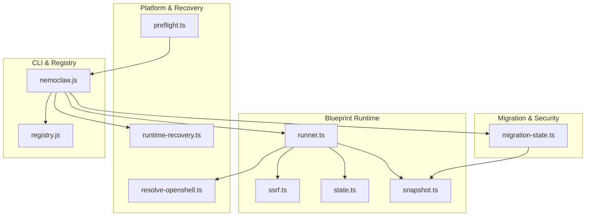
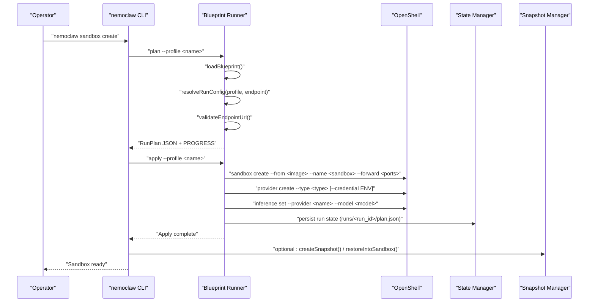
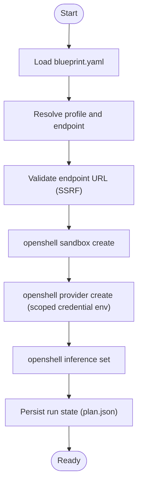
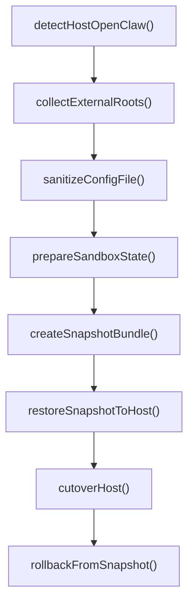
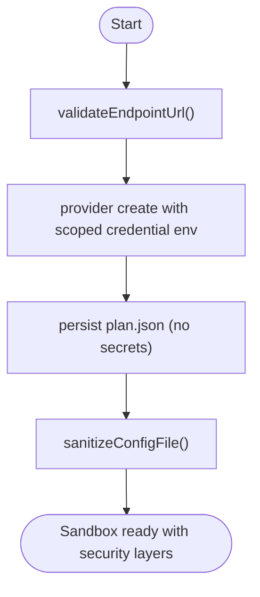
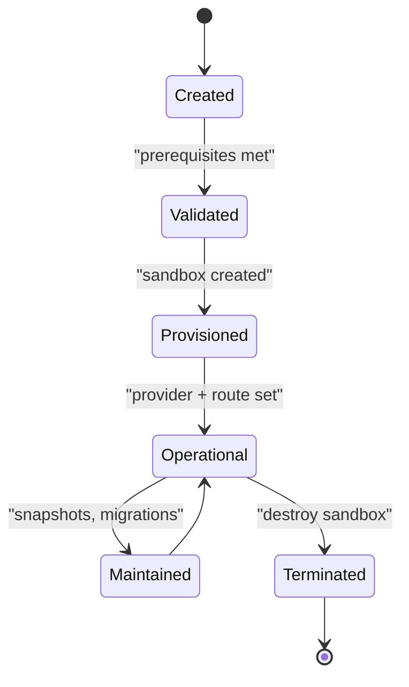
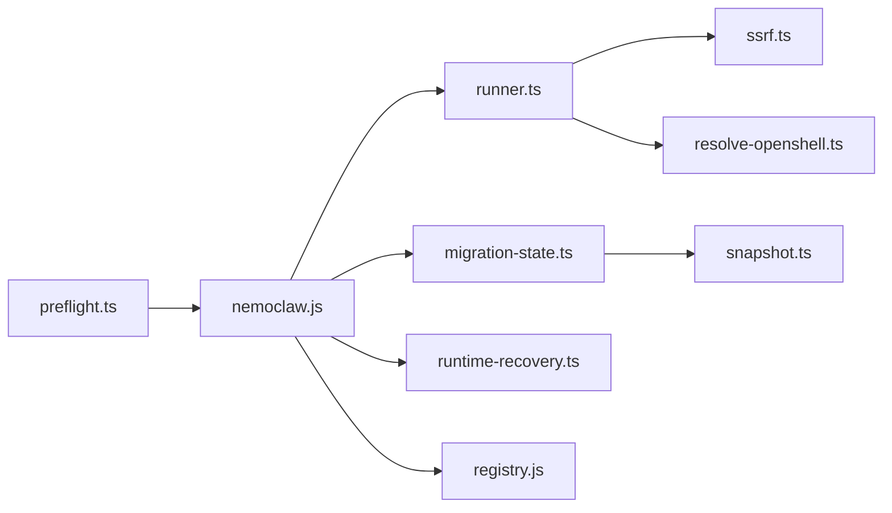

# Sandbox Lifecycle

<cite>
**Referenced Files in This Document**
- [runner.ts](file://nemoclaw/src/blueprint/runner.ts)
- [ssrf.ts](file://nemoclaw/src/blueprint/ssrf.ts)
- [state.ts](file://nemoclaw/src/blueprint/state.ts)
- [snapshot.ts](file://nemoclaw/src/blueprint/snapshot.ts)
- [migration-state.ts](file://nemoclaw/src/commands/migration-state.ts)
- [validation.ts](file://src/lib/validation.ts)
- [runtime-recovery.ts](file://src/lib/runtime-recovery.ts)
- [preflight.ts](file://src/lib/preflight.ts)
- [resolve-openshell.ts](file://src/lib/resolve-openshell.ts)
- [registry.js](file://bin/lib/registry.js)
- [nemoclaw.js](file://bin/nemoclaw.js)
- [architecture.md](file://docs/reference/architecture.md)
- [how-it-works.md](file://docs/about/how-it-works.md)
</cite>

## Table of Contents
1. [Introduction](#introduction)
2. [Project Structure](#project-structure)
3. [Core Components](#core-components)
4. [Architecture Overview](#architecture-overview)
5. [Detailed Component Analysis](#detailed-component-analysis)
6. [Dependency Analysis](#dependency-analysis)
7. [Performance Considerations](#performance-considerations)
8. [Troubleshooting Guide](#troubleshooting-guide)
9. [Conclusion](#conclusion)

## Introduction
This document explains the complete sandbox lifecycle from creation to destruction, focusing on how NemoClaw orchestrates OpenShell-managed sandboxes. It covers blueprint resolution, OpenShell resource provisioning, security layer activation, state management, migration and credential stripping, lifecycle phases, and recovery procedures. Practical examples and troubleshooting guidance are included to help operators reliably operate sandboxes across machines.

## Project Structure
The sandbox lifecycle spans several modules:
- Blueprint runner and SSRF validation for blueprint-driven provisioning
- State and snapshot management for migration and recovery
- Migration state bundling and credential sanitization
- Preflight checks and runtime recovery classification
- Registry and CLI orchestration for sandbox lifecycle commands

**Diagram sources**
- [runner.ts:1-451](file://nemoclaw/src/blueprint/runner.ts#L1-L451)
- [ssrf.ts:1-156](file://nemoclaw/src/blueprint/ssrf.ts#L1-L156)
- [state.ts:1-70](file://nemoclaw/src/blueprint/state.ts#L1-L70)
- [snapshot.ts:1-177](file://nemoclaw/src/blueprint/snapshot.ts#L1-L177)
- [migration-state.ts:1-912](file://nemoclaw/src/commands/migration-state.ts#L1-L912)
- [preflight.ts:1-754](file://src/lib/preflight.ts#L1-L754)
- [runtime-recovery.ts:1-91](file://src/lib/runtime-recovery.ts#L1-L91)
- [resolve-openshell.ts:1-60](file://src/lib/resolve-openshell.ts#L1-L60)
- [nemoclaw.js:331-389](file://bin/nemoclaw.js#L331-L389)
- [registry.js:154-238](file://bin/lib/registry.js#L154-L238)

**Section sources**
- [architecture.md:120-153](file://docs/reference/architecture.md#L120-L153)

## Core Components
- Blueprint Runner: Loads blueprint, validates endpoints, provisions OpenShell resources, persists run state, and supports rollback.
- SSRF Validator: Ensures inference endpoints are safe and not private/internal addresses.
- State Manager: Tracks last run, last action, blueprint version, sandbox name, migration snapshot, and timestamps.
- Snapshot Manager: Captures host OpenClaw state, restores into sandbox, cutover host config, and rollback support.
- Migration State: Detects host OpenClaw state, builds external root mappings, sanitizes credentials, prepares sandbox bundle, and creates archives.
- Preflight: Validates host readiness (Docker, OpenShell, GPU presence), port availability, and memory/swap conditions.
- Runtime Recovery: Parses sandbox/gateway status from CLI output and suggests recovery actions.
- Registry and CLI: Manages sandbox registry entries and orchestrates lifecycle commands.

**Section sources**
- [runner.ts:1-451](file://nemoclaw/src/blueprint/runner.ts#L1-L451)
- [ssrf.ts:1-156](file://nemoclaw/src/blueprint/ssrf.ts#L1-L156)
- [state.ts:1-70](file://nemoclaw/src/blueprint/state.ts#L1-L70)
- [snapshot.ts:1-177](file://nemoclaw/src/blueprint/snapshot.ts#L1-L177)
- [migration-state.ts:1-912](file://nemoclaw/src/commands/migration-state.ts#L1-L912)
- [preflight.ts:1-754](file://src/lib/preflight.ts#L1-L754)
- [runtime-recovery.ts:1-91](file://src/lib/runtime-recovery.ts#L1-L91)
- [registry.js:154-238](file://bin/lib/registry.js#L154-L238)
- [nemoclaw.js:331-389](file://bin/nemoclaw.js#L331-L389)

## Architecture Overview
The sandbox lifecycle follows a blueprint-driven flow orchestrated by the runner, validated by SSRF checks, and secured by credential stripping and snapshot-based migration.

**Diagram sources**
- [runner.ts:167-330](file://nemoclaw/src/blueprint/runner.ts#L167-L330)
- [ssrf.ts:118-155](file://nemoclaw/src/blueprint/ssrf.ts#L118-L155)
- [state.ts:47-61](file://nemoclaw/src/blueprint/state.ts#L47-L61)
- [snapshot.ts:57-96](file://nemoclaw/src/blueprint/snapshot.ts#L57-L96)

**Section sources**
- [runner.ts:167-330](file://nemoclaw/src/blueprint/runner.ts#L167-L330)
- [ssrf.ts:118-155](file://nemoclaw/src/blueprint/ssrf.ts#L118-L155)
- [state.ts:47-61](file://nemoclaw/src/blueprint/state.ts#L47-L61)
- [snapshot.ts:57-96](file://nemoclaw/src/blueprint/snapshot.ts#L57-L96)

## Detailed Component Analysis

### Blueprint Lifecycle Orchestration
- Blueprint loading and validation: The runner loads blueprint.yaml, validates profile existence, and enforces SSRF-safe endpoints.
- Resource provisioning: Creates sandbox, registers provider with scoped credentials, and sets inference route.
- Run state persistence: Writes plan.json under ~/.nemoclaw/state/runs/<run_id> for audit and rollback.
- Rollback: Stops and removes sandbox associated with a run_id, marks rollback completion.

**Diagram sources**
- [runner.ts:79-330](file://nemoclaw/src/blueprint/runner.ts#L79-L330)
- [ssrf.ts:118-155](file://nemoclaw/src/blueprint/ssrf.ts#L118-L155)

**Section sources**
- [runner.ts:79-330](file://nemoclaw/src/blueprint/runner.ts#L79-L330)
- [ssrf.ts:118-155](file://nemoclaw/src/blueprint/ssrf.ts#L118-L155)

### State Management and Migration
- State persistence: Tracks lastRunId, lastAction, blueprintVersion, sandboxName, migrationSnapshot, and timestamps.
- Snapshot lifecycle: Captures host OpenClaw state, restores into sandbox, cutover host config, and rollback.
- Migration bundle: Detects host state, collects external roots, sanitizes credentials, prepares sandbox openclaw.json, and writes archives.

**Diagram sources**
- [migration-state.ts:376-743](file://nemoclaw/src/commands/migration-state.ts#L376-L743)
- [snapshot.ts:57-135](file://nemoclaw/src/blueprint/snapshot.ts#L57-L135)
- [state.ts:47-69](file://nemoclaw/src/blueprint/state.ts#L47-L69)

**Section sources**
- [migration-state.ts:376-743](file://nemoclaw/src/commands/migration-state.ts#L376-L743)
- [snapshot.ts:57-135](file://nemoclaw/src/blueprint/snapshot.ts#L57-L135)
- [state.ts:47-69](file://nemoclaw/src/blueprint/state.ts#L47-L69)

### Security Layer Activation and Credential Stripping
- Endpoint safety: SSRF validator rejects private/internal IPs and unsupported schemes.
- Credential isolation: Provider credentials are passed via scoped environment variables and never persisted in plan.json.
- Config sanitization: Removes gateway config and strips sensitive fields from openclaw.json before entering sandbox.

**Diagram sources**
- [ssrf.ts:118-155](file://nemoclaw/src/blueprint/ssrf.ts#L118-L155)
- [runner.ts:258-329](file://nemoclaw/src/blueprint/runner.ts#L258-L329)
- [migration-state.ts:540-550](file://nemoclaw/src/commands/migration-state.ts#L540-L550)

**Section sources**
- [ssrf.ts:118-155](file://nemoclaw/src/blueprint/ssrf.ts#L118-L155)
- [runner.ts:258-329](file://nemoclaw/src/blueprint/runner.ts#L258-L329)
- [migration-state.ts:540-550](file://nemoclaw/src/commands/migration-state.ts#L540-L550)

### Lifecycle Phases
- Creation: Plan blueprint, validate prerequisites, create sandbox, configure provider, set inference route, persist run state.
- Validation: SSRF endpoint validation, host readiness checks (Docker, OpenShell, ports, memory).
- Operation: Sandbox runs with network, filesystem, process, and inference protections.
- Maintenance: Snapshot and restore for migration, cutover and rollback for recovery.
- Termination: Stop and remove sandbox, clear run state, optionally destroy registry entries.

**Diagram sources**
- [runner.ts:167-330](file://nemoclaw/src/blueprint/runner.ts#L167-L330)
- [preflight.ts:238-329](file://src/lib/preflight.ts#L238-L329)
- [snapshot.ts:57-135](file://nemoclaw/src/blueprint/snapshot.ts#L57-L135)

**Section sources**
- [runner.ts:167-330](file://nemoclaw/src/blueprint/runner.ts#L167-L330)
- [preflight.ts:238-329](file://src/lib/preflight.ts#L238-L329)
- [snapshot.ts:57-135](file://nemoclaw/src/blueprint/snapshot.ts#L57-L135)

### Practical Examples
- Lifecycle events:
  - Plan: Emits progress milestones and run_id; prints RunPlan JSON.
  - Apply: Creates sandbox, registers provider with scoped credential env, sets inference route, persists plan.json.
  - Status: Lists latest run or specific run_id, prints plan.json.
  - Rollback: Stops/removes sandbox, writes rolled_back marker.
- State snapshots:
  - createSnapshot(): Captures ~/.openclaw and writes snapshot.json with file inventory.
  - restoreIntoSandbox(): Copies snapshot into sandbox filesystem via OpenShell.
  - cutoverHost()/rollbackFromSnapshot(): Moves host config aside and restores from snapshot.
- Recovery procedures:
  - Runtime recovery: Parse sandbox/gateway status from CLI output and suggest remediation.
  - Registry recovery: Upsert sandbox entries based on session metadata.

**Section sources**
- [runner.ts:167-391](file://nemoclaw/src/blueprint/runner.ts#L167-L391)
- [snapshot.ts:57-135](file://nemoclaw/src/blueprint/snapshot.ts#L57-L135)
- [runtime-recovery.ts:41-91](file://src/lib/runtime-recovery.ts#L41-L91)
- [nemoclaw.js:334-381](file://bin/nemoclaw.js#L334-L381)

## Dependency Analysis
- Runner depends on SSRF validator and OpenShell binary resolution.
- Migration state depends on snapshot manager and sanitizer.
- CLI integrates runner, migration state, runtime recovery, and registry.
- Preflight provides host readiness to prevent lifecycle failures.

**Diagram sources**
- [runner.ts:107-110](file://nemoclaw/src/blueprint/runner.ts#L107-L110)
- [resolve-openshell.ts:22-59](file://src/lib/resolve-openshell.ts#L22-L59)
- [migration-state.ts:1-22](file://nemoclaw/src/commands/migration-state.ts#L1-L22)
- [snapshot.ts:14-32](file://nemoclaw/src/blueprint/snapshot.ts#L14-L32)
- [nemoclaw.js:331-389](file://bin/nemoclaw.js#L331-L389)
- [registry.js:154-238](file://bin/lib/registry.js#L154-L238)
- [preflight.ts:238-329](file://src/lib/preflight.ts#L238-L329)

**Section sources**
- [runner.ts:107-110](file://nemoclaw/src/blueprint/runner.ts#L107-L110)
- [resolve-openshell.ts:22-59](file://src/lib/resolve-openshell.ts#L22-L59)
- [migration-state.ts:1-22](file://nemoclaw/src/commands/migration-state.ts#L1-L22)
- [snapshot.ts:14-32](file://nemoclaw/src/blueprint/snapshot.ts#L14-L32)
- [nemoclaw.js:331-389](file://bin/nemoclaw.js#L331-L389)
- [registry.js:154-238](file://bin/lib/registry.js#L154-L238)
- [preflight.ts:238-329](file://src/lib/preflight.ts#L238-L329)

## Performance Considerations
- Prefer dry-run plans to estimate provisioning steps before apply.
- Minimize snapshot sizes by avoiding unnecessary external roots and ensuring symlinked paths are handled conservatively.
- Use scoped credential env to avoid repeated provider registration overhead.
- Ensure sufficient memory/swap to prevent sandbox image transfer timeouts.

[No sources needed since this section provides general guidance]

## Troubleshooting Guide
Common issues and resolutions:
- Sandbox creation failures:
  - Image transfer timeout/reset: Indicates network instability or gateway issues; retry after verifying connectivity.
  - Partial creation: Confirm sandbox exists and investigate partial state; use rollback to clean up.
- State corruption:
  - Missing plan.json: Use rollback to stop/remove sandbox and mark rolled_back; rebuild state via apply.
  - Unsafe endpoints: Fix SSRF violations; only allow http/https to public addresses.
- Migration problems:
  - Host root containment: Ensure snapshot manifest homeDir is within trusted host root; otherwise refuse restore.
  - Credential leakage: Verify sanitizeConfigFile removed gateway and sensitive fields; rebuild bundle if needed.
- Runtime recovery:
  - Gateway unavailable: Attempt recovery using onboard session; resume or restart onboarding as appropriate.
  - Port conflicts: Use preflight to probe and resolve port conflicts before sandbox creation.

**Section sources**
- [validation.ts:54-70](file://src/lib/validation.ts#L54-L70)
- [runner.ts:362-391](file://nemoclaw/src/blueprint/runner.ts#L362-L391)
- [migration-state.ts:772-800](file://nemoclaw/src/commands/migration-state.ts#L772-L800)
- [runtime-recovery.ts:41-91](file://src/lib/runtime-recovery.ts#L41-L91)
- [preflight.ts:482-537](file://src/lib/preflight.ts#L482-L537)

## Conclusion
NemoClaw’s sandbox lifecycle is blueprint-driven, secure, and resilient. The runner coordinates OpenShell provisioning, SSRF validation ensures endpoint safety, and migration state plus snapshots enable reliable cross-machine operation. State management, runtime recovery, and preflight checks collectively reduce operational risk and improve reliability across diverse environments.