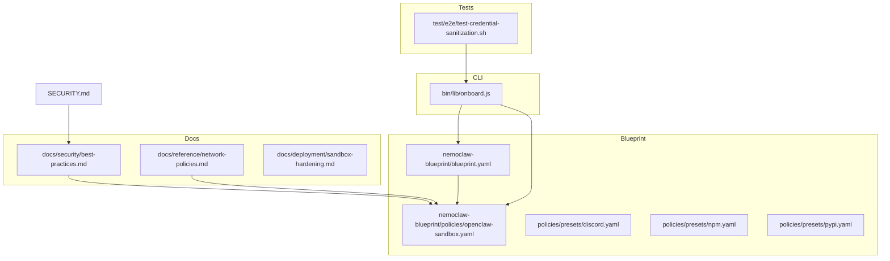
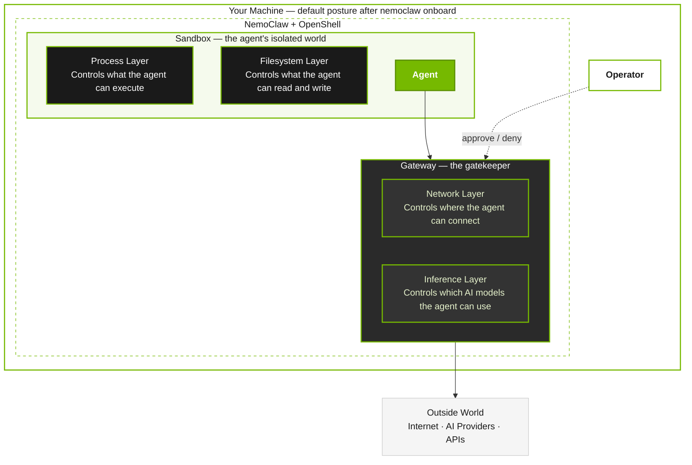
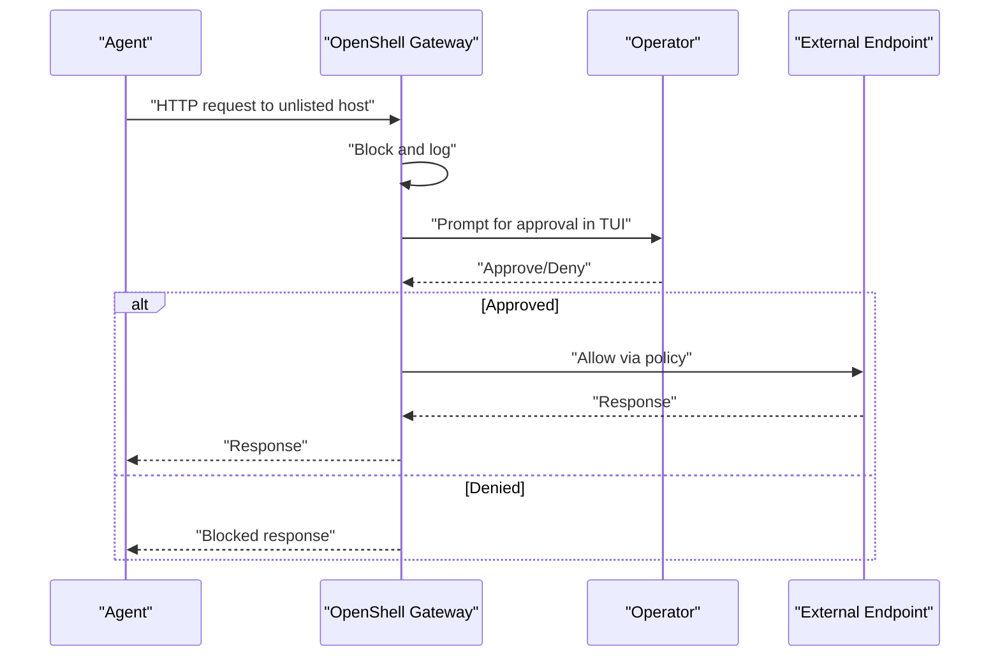
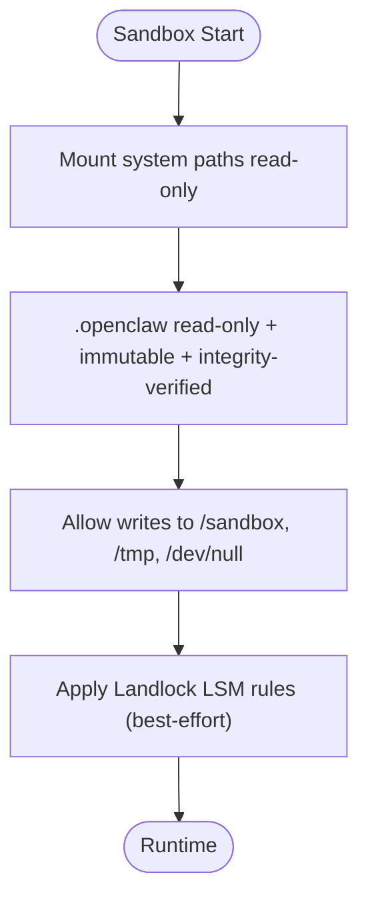
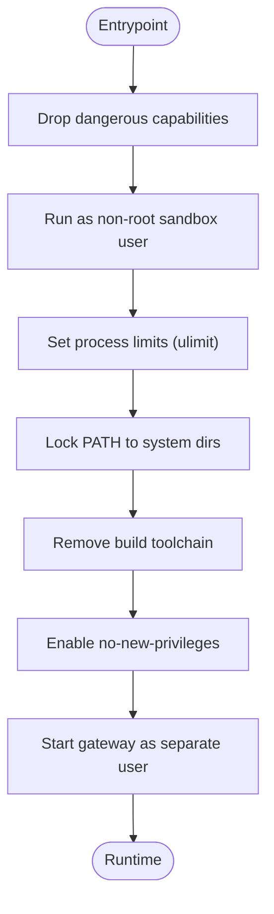
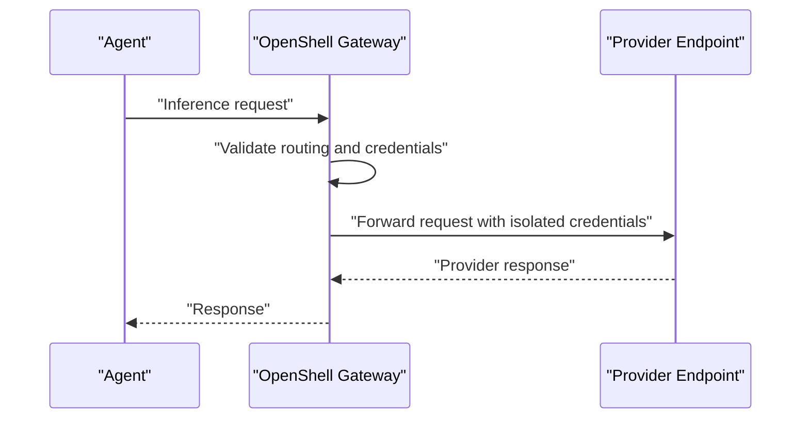
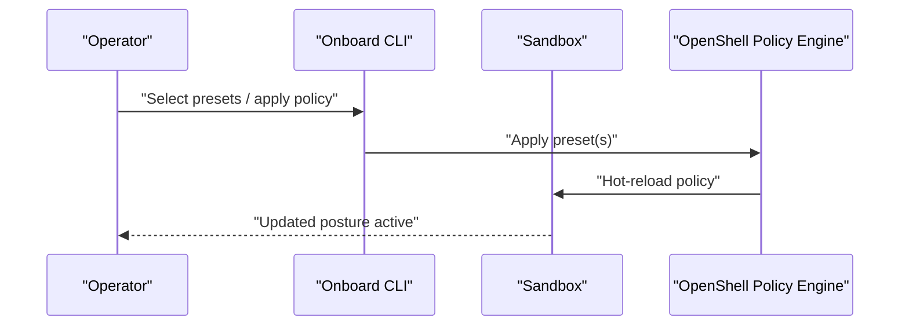
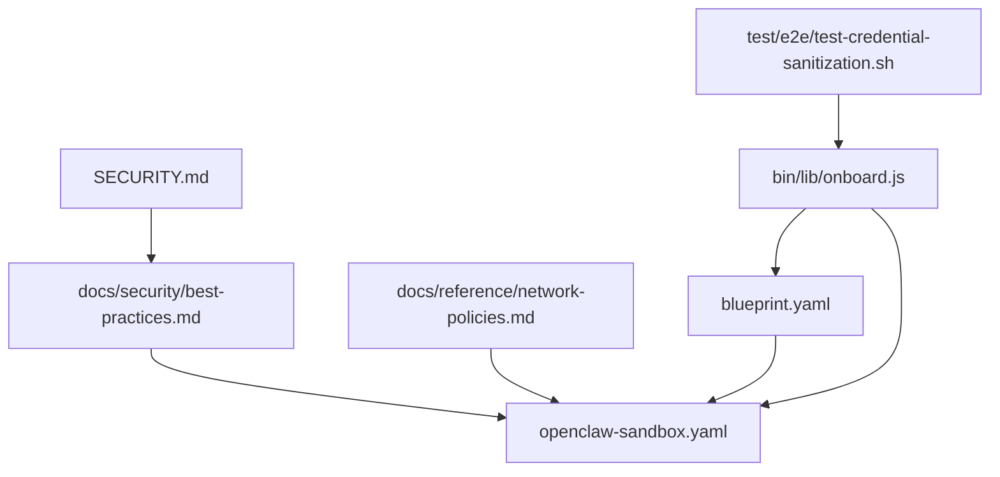

# Security Layers

<cite>
**Referenced Files in This Document**
- [best-practices.md](file://docs/security/best-practices.md)
- [network-policies.md](file://docs/reference/network-policies.md)
- [sandbox-hardening.md](file://docs/deployment/sandbox-hardening.md)
- [openclaw-sandbox.yaml](file://nemoclaw-blueprint/policies/openclaw-sandbox.yaml)
- [blueprint.yaml](file://nemoclaw-blueprint/blueprint.yaml)
- [discord.yaml](file://nemoclaw-blueprint/policies/presets/discord.yaml)
- [npm.yaml](file://nemoclaw-blueprint/policies/presets/npm.yaml)
- [pypi.yaml](file://nemoclaw-blueprint/policies/presets/pypi.yaml)
- [SECURITY.md](file://SECURITY.md)
- [onboard.js](file://bin/lib/onboard.js)
- [test-credential-sanitization.sh](file://test/e2e/test-credential-sanitization.sh)
</cite>

## Table of Contents
1. [Introduction](#introduction)
2. [Project Structure](#project-structure)
3. [Core Components](#core-components)
4. [Architecture Overview](#architecture-overview)
5. [Detailed Component Analysis](#detailed-component-analysis)
6. [Dependency Analysis](#dependency-analysis)
7. [Performance Considerations](#performance-considerations)
8. [Troubleshooting Guide](#troubleshooting-guide)
9. [Conclusion](#conclusion)
10. [Appendices](#appendices)

## Introduction
This document explains NemoClaw’s multi-layered security architecture and operational controls. The system enforces four protection layers—network, filesystem, process, and inference—combined with platform-level enforcement from OpenShell. It covers default policies, hot-reloadable controls, operator approval workflows, SSRF protection, credential sanitization, supply chain safety, best practices, threat modeling, and incident response.

## Project Structure
Security-related assets are organized across documentation, policy blueprints, and CLI orchestration:
- Security guidance and posture profiles: docs/security/best-practices.md
- Network policy reference and operator approval flow: docs/reference/network-policies.md
- Sandbox hardening and runtime controls: docs/deployment/sandbox-hardening.md
- Baseline and preset policies: nemoclaw-blueprint/policies/*
- Blueprint orchestration and inference profiles: nemoclaw-blueprint/blueprint.yaml
- Onboarding and preset application: bin/lib/onboard.js
- Credential sanitization tests: test/e2e/test-credential-sanitization.sh
- Security reporting process: SECURITY.md

**Diagram sources**
- [best-practices.md:25-124](file://docs/security/best-practices.md#L25-L124)
- [network-policies.md:25-145](file://docs/reference/network-policies.md#L25-L145)
- [sandbox-hardening.md:47-91](file://docs/deployment/sandbox-hardening.md#L47-L91)
- [openclaw-sandbox.yaml:1-219](file://nemoclaw-blueprint/policies/openclaw-sandbox.yaml#L1-L219)
- [blueprint.yaml:1-66](file://nemoclaw-blueprint/blueprint.yaml#L1-L66)
- [discord.yaml:1-47](file://nemoclaw-blueprint/policies/presets/discord.yaml#L1-L47)
- [npm.yaml:1-25](file://nemoclaw-blueprint/policies/presets/npm.yaml#L1-L25)
- [pypi.yaml:1-27](file://nemoclaw-blueprint/policies/presets/pypi.yaml#L1-L27)
- [onboard.js:3425-3687](file://bin/lib/onboard.js#L3425-L3687)
- [test-credential-sanitization.sh:629-805](file://test/e2e/test-credential-sanitization.sh#L629-L805)
- [SECURITY.md:1-59](file://SECURITY.md#L1-L59)

**Section sources**
- [best-practices.md:25-124](file://docs/security/best-practices.md#L25-L124)
- [network-policies.md:25-145](file://docs/reference/network-policies.md#L25-L145)
- [sandbox-hardening.md:47-91](file://docs/deployment/sandbox-hardening.md#L47-L91)
- [openclaw-sandbox.yaml:1-219](file://nemoclaw-blueprint/policies/openclaw-sandbox.yaml#L1-L219)
- [blueprint.yaml:1-66](file://nemoclaw-blueprint/blueprint.yaml#L1-L66)
- [discord.yaml:1-47](file://nemoclaw-blueprint/policies/presets/discord.yaml#L1-L47)
- [npm.yaml:1-25](file://nemoclaw-blueprint/policies/presets/npm.yaml#L1-L25)
- [pypi.yaml:1-27](file://nemoclaw-blueprint/policies/presets/pypi.yaml#L1-L27)
- [onboard.js:3425-3687](file://bin/lib/onboard.js#L3425-L3687)
- [test-credential-sanitization.sh:629-805](file://test/e2e/test-credential-sanitization.sh#L629-L805)
- [SECURITY.md:1-59](file://SECURITY.md#L1-L59)

## Core Components
NemoClaw enforces four security layers with distinct enforcement points and runtime characteristics:

- Network layer
  - Deny-by-default egress with operator approval for unlisted endpoints
  - Binary-scoped endpoint rules and path-scoped HTTP rules
  - L4-only vs L7 inspection via the CONNECT proxy
  - Hot-reloadable via OpenShell policy updates

- Filesystem layer
  - Read-only system paths and read-only immutable gateway config
  - Writable agent workspace and temporary directories
  - Landlock LSM enforcement with best-effort compatibility

- Process layer
  - Capability drops, non-root user, process limits, PATH hardening
  - Build toolchain removal and no-new-privileges flag
  - Gateway process isolation and runtime controls

- Inference layer
  - Inference routing through the gateway to isolate provider credentials
  - Provider trust tiers and inference profile selection

**Section sources**
- [best-practices.md:38-124](file://docs/security/best-practices.md#L38-L124)
- [network-policies.md:25-145](file://docs/reference/network-policies.md#L25-L145)
- [openclaw-sandbox.yaml:18-45](file://nemoclaw-blueprint/policies/openclaw-sandbox.yaml#L18-L45)
- [blueprint.yaml:26-56](file://nemoclaw-blueprint/blueprint.yaml#L26-L56)

## Architecture Overview
The four-layer architecture is layered and interdependent. The diagram below shows how the operator, sandbox, gateway, and outside world interact under default posture.

**Diagram sources**
- [best-practices.md:46-93](file://docs/security/best-practices.md#L46-L93)

**Section sources**
- [best-practices.md:38-124](file://docs/security/best-practices.md#L38-L124)

## Detailed Component Analysis

### Network Controls
- Deny-by-default egress: Only endpoints listed in the baseline policy can be reached. Unlisted destinations trigger operator approval.
- Binary-scoped endpoint rules: Each endpoint restricts which executables can reach it using binary identity checks.
- Path-scoped HTTP rules: Endpoint rules restrict allowed HTTP methods and URL paths.
- L4-only vs L7 inspection: CONNECT proxy with optional L7 inspection via REST rules and TLS termination.
- Operator approval flow: Blocked requests surface in the TUI; operator can approve/deny per session.
- Hot-reloadable policy: Dynamic updates via OpenShell without sandbox restart.

**Diagram sources**
- [network-policies.md:110-127](file://docs/reference/network-policies.md#L110-L127)

**Section sources**
- [best-practices.md:126-191](file://docs/security/best-practices.md#L126-L191)
- [network-policies.md:25-145](file://docs/reference/network-policies.md#L25-L145)
- [openclaw-sandbox.yaml:46-219](file://nemoclaw-blueprint/policies/openclaw-sandbox.yaml#L46-L219)

### Filesystem Controls
- Read-only system paths: Prevent tampering with binaries, libraries, and configs.
- Immutable gateway configuration: Read-only, root-owned, immutable, and integrity-verified.
- Writable paths: Controlled access to agent workspace and temp directories.
- Landlock LSM enforcement: Kernel-level filesystem access rules with best-effort compatibility.

**Diagram sources**
- [best-practices.md:210-267](file://docs/security/best-practices.md#L210-L267)
- [openclaw-sandbox.yaml:18-41](file://nemoclaw-blueprint/policies/openclaw-sandbox.yaml#L18-L41)

**Section sources**
- [best-practices.md:210-267](file://docs/security/best-practices.md#L210-L267)
- [openclaw-sandbox.yaml:18-41](file://nemoclaw-blueprint/policies/openclaw-sandbox.yaml#L18-L41)

### Process Controls
- Capability drops: Dangerous capabilities dropped at startup; kept only those required for privilege separation.
- Non-root user: Agent runs as a dedicated sandbox user; gateway runs as a separate gateway user.
- Process limits: Ulimit caps spawned processes to mitigate fork-bomb risks.
- PATH hardening: Lock down PATH to trusted system directories.
- Build toolchain removal: Compilers and network probes removed from runtime image.
- No-new-privileges: Prevents escalation via setuid binaries.

**Diagram sources**
- [best-practices.md:269-362](file://docs/security/best-practices.md#L269-L362)
- [sandbox-hardening.md:47-91](file://docs/deployment/sandbox-hardening.md#L47-L91)

**Section sources**
- [best-practices.md:269-362](file://docs/security/best-practices.md#L269-L362)
- [sandbox-hardening.md:47-91](file://docs/deployment/sandbox-hardening.md#L47-L91)

### Inference Routing
- Inference routed through the gateway to isolate provider credentials from the sandbox.
- Provider trust tiers and inference profile selection in the blueprint.
- Hot-reloadable inference routing via OpenShell.

**Diagram sources**
- [best-practices.md:412-427](file://docs/security/best-practices.md#L412-L427)
- [blueprint.yaml:26-56](file://nemoclaw-blueprint/blueprint.yaml#L26-L56)

**Section sources**
- [best-practices.md:412-427](file://docs/security/best-practices.md#L412-L427)
- [blueprint.yaml:26-56](file://nemoclaw-blueprint/blueprint.yaml#L26-L56)

### SSRF Protection
- OpenShell enforces SSRF protections and TLS termination at the gateway.
- CONNECT proxy with optional L7 inspection for REST endpoints.
- Operator approval for unlisted endpoints reduces risk of blind SSRF.

**Section sources**
- [best-practices.md:126-191](file://docs/security/best-practices.md#L126-L191)
- [network-policies.md:25-145](file://docs/reference/network-policies.md#L25-L145)

### Credential Sanitization
- CLI and migration systems sanitize credential fields in logs and outputs.
- Automated tests verify stripping of sensitive keys across nested structures.

**Section sources**
- [best-practices.md:401-411](file://docs/security/best-practices.md#L401-L411)
- [test-credential-sanitization.sh:629-805](file://test/e2e/test-credential-sanitization.sh#L629-L805)

### Supply Chain Safety Measures
- Immutable gateway configuration with integrity verification and immutable flags.
- Symlink validation and root ownership with strict DAC permissions.
- Baseline policy minimizes attack surface; presets vetted for least privilege.

**Section sources**
- [best-practices.md:228-246](file://docs/security/best-practices.md#L228-L246)
- [openclaw-sandbox.yaml:18-41](file://nemoclaw-blueprint/policies/openclaw-sandbox.yaml#L18-L41)

### Default Policy System and Hot-Reloadable Controls
- Baseline policy defines deny-by-default egress and filesystem rules.
- Operator approval flow for unlisted endpoints; approvals persist per sandbox instance.
- Hot-reloadable network and inference policies via OpenShell without sandbox restart.
- Preset application during onboarding or non-interactively via environment variables.

**Diagram sources**
- [onboard.js:3425-3687](file://bin/lib/onboard.js#L3425-L3687)
- [network-policies.md:128-145](file://docs/reference/network-policies.md#L128-L145)

**Section sources**
- [network-policies.md:128-145](file://docs/reference/network-policies.md#L128-L145)
- [onboard.js:3425-3687](file://bin/lib/onboard.js#L3425-L3687)

### Practical Examples
- Enforcing L7 inspection for REST APIs: add protocol: rest with rules or access presets.
- Scoping endpoints to specific binaries: use the binaries field to restrict callers.
- Adding a preset: apply via onboard or non-interactively with NEMOCLAW_POLICY_MODE and NEMOCLAW_POLICY_PRESETS.
- Hardening the sandbox: use Docker Compose with cap-drop, no-new-privileges, and ulimits.

**Section sources**
- [best-practices.md:126-191](file://docs/security/best-practices.md#L126-L191)
- [sandbox-hardening.md:47-91](file://docs/deployment/sandbox-hardening.md#L47-L91)
- [onboard.js:3425-3687](file://bin/lib/onboard.js#L3425-L3687)

## Dependency Analysis
The security posture depends on coordinated controls across documentation, policy blueprints, CLI orchestration, and platform enforcement.

**Diagram sources**
- [best-practices.md:25-124](file://docs/security/best-practices.md#L25-L124)
- [network-policies.md:25-145](file://docs/reference/network-policies.md#L25-L145)
- [openclaw-sandbox.yaml:1-219](file://nemoclaw-blueprint/policies/openclaw-sandbox.yaml#L1-L219)
- [blueprint.yaml:1-66](file://nemoclaw-blueprint/blueprint.yaml#L1-L66)
- [onboard.js:3425-3687](file://bin/lib/onboard.js#L3425-L3687)
- [test-credential-sanitization.sh:629-805](file://test/e2e/test-credential-sanitization.sh#L629-L805)
- [SECURITY.md:1-59](file://SECURITY.md#L1-L59)

**Section sources**
- [best-practices.md:25-124](file://docs/security/best-practices.md#L25-L124)
- [network-policies.md:25-145](file://docs/reference/network-policies.md#L25-L145)
- [openclaw-sandbox.yaml:1-219](file://nemoclaw-blueprint/policies/openclaw-sandbox.yaml#L1-L219)
- [blueprint.yaml:1-66](file://nemoclaw-blueprint/blueprint.yaml#L1-L66)
- [onboard.js:3425-3687](file://bin/lib/onboard.js#L3425-L3687)
- [test-credential-sanitization.sh:629-805](file://test/e2e/test-credential-sanitization.sh#L629-L805)
- [SECURITY.md:1-59](file://SECURITY.md#L1-L59)

## Performance Considerations
- L7 inspection adds CPU overhead; use protocol: rest selectively for REST APIs requiring method/path control.
- CONNECT tunneling avoids HTTP timeouts for long-lived streams (e.g., WebSocket gateways).
- Process limits reduce fork-bomb risk; adjust ulimits carefully to avoid impacting legitimate workloads.
- PATH hardening and capability drops improve security without significant runtime cost.

[No sources needed since this section provides general guidance]

## Troubleshooting Guide
- OpenShell policy updates unsupported: Known limitation tracked in NemoClaw #536; retry or use alternative workflow.
- Sandbox not ready for policy application: Wait for readiness or re-run with retries.
- Unknown presets: Verify preset names and ensure they exist in the available set.
- Credential leaks in logs: Confirm sanitization is active; review CLI output redaction behavior.
- Security reporting: Follow the coordinated vulnerability disclosure process.

**Section sources**
- [onboard.js:3454-3472](file://bin/lib/onboard.js#L3454-L3472)
- [onboard.js:3614-3632](file://bin/lib/onboard.js#L3614-L3632)
- [SECURITY.md:10-59](file://SECURITY.md#L10-L59)

## Conclusion
NemoClaw’s four-layer security architecture combines deny-by-default network controls, hardened filesystem and process boundaries, and inference routing through the gateway. Operators can tune policies at runtime while maintaining strong defaults. Supply chain and credential safety are reinforced by immutable configurations and sanitization. Adhering to posture profiles and best practices ensures a robust security posture across diverse deployment scenarios.

[No sources needed since this section summarizes without analyzing specific files]

## Appendices
- Preset examples: Discord, npm, pypi
- Threat modeling and incident response: Follow SECURITY.md for reporting and PSIRT processes

**Section sources**
- [discord.yaml:1-47](file://nemoclaw-blueprint/policies/presets/discord.yaml#L1-L47)
- [npm.yaml:1-25](file://nemoclaw-blueprint/policies/presets/npm.yaml#L1-L25)
- [pypi.yaml:1-27](file://nemoclaw-blueprint/policies/presets/pypi.yaml#L1-L27)
- [SECURITY.md:1-59](file://SECURITY.md#L1-L59)