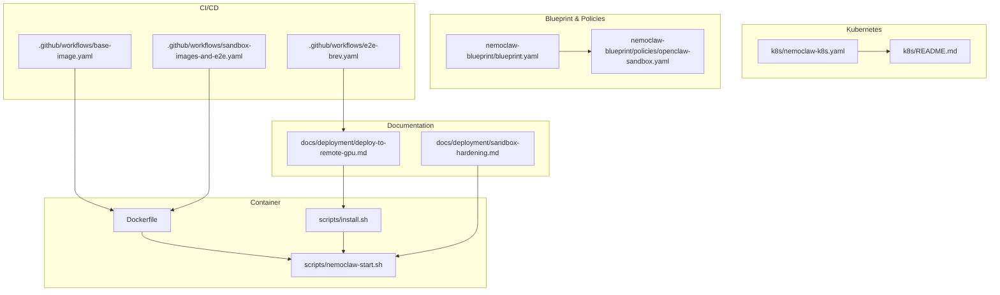
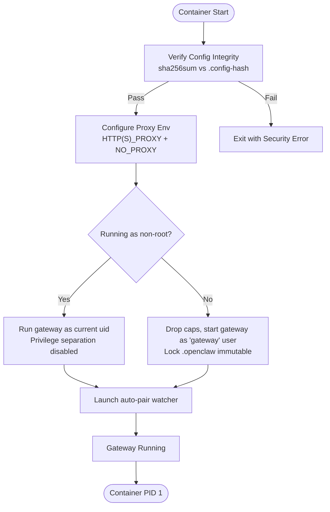
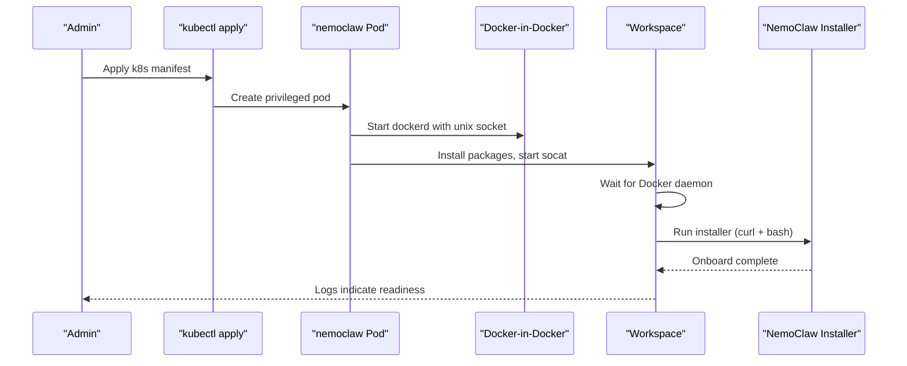
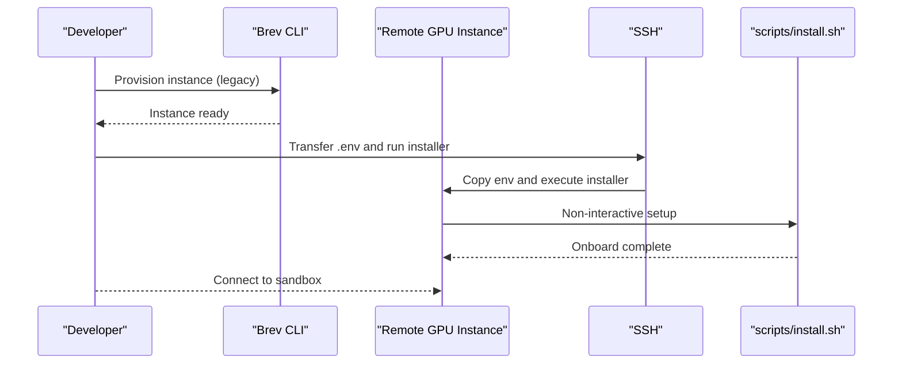
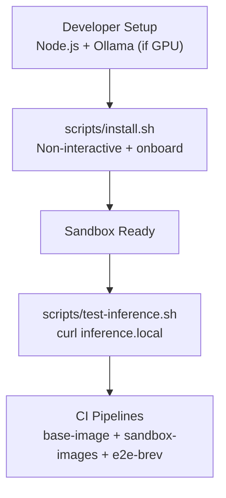
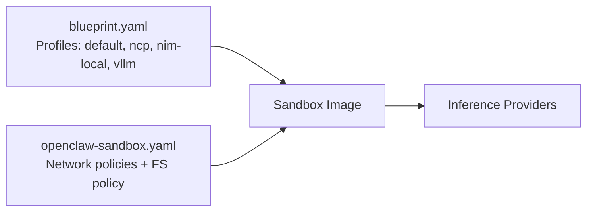
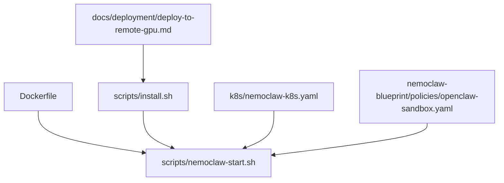

# Deployment Options

<cite>
**Referenced Files in This Document**
- [k8s/nemoclaw-k8s.yaml](file://k8s/nemoclaw-k8s.yaml)
- [k8s/README.md](file://k8s/README.md)
- [Dockerfile](file://Dockerfile)
- [scripts/nemoclaw-start.sh](file://scripts/nemoclaw-start.sh)
- [scripts/install.sh](file://scripts/install.sh)
- [docs/deployment/deploy-to-remote-gpu.md](file://docs/deployment/deploy-to-remote-gpu.md)
- [src/lib/deploy.ts](file://src/lib/deploy.ts)
- [nemoclaw-blueprint/blueprint.yaml](file://nemoclaw-blueprint/blueprint.yaml)
- [nemoclaw-blueprint/policies/openclaw-sandbox.yaml](file://nemoclaw-blueprint/policies/openclaw-sandbox.yaml)
- [docs/deployment/sandbox-hardening.md](file://docs/deployment/sandbox-hardening.md)
- [scripts/test-inference.sh](file://scripts/test-inference.sh)
- [.github/workflows/base-image.yaml](file://.github/workflows/base-image.yaml)
- [.github/workflows/sandbox-images-and-e2e.yaml](file://.github/workflows/sandbox-images-and-e2e.yaml)
- [.github/workflows/e2e-brev.yaml](file://.github/workflows/e2e-brev.yaml)
</cite>

## Table of Contents
1. [Introduction](#introduction)
2. [Project Structure](#project-structure)
3. [Core Components](#core-components)
4. [Architecture Overview](#architecture-overview)
5. [Detailed Component Analysis](#detailed-component-analysis)
6. [Dependency Analysis](#dependency-analysis)
7. [Performance Considerations](#performance-considerations)
8. [Troubleshooting Guide](#troubleshooting-guide)
9. [Conclusion](#conclusion)
10. [Appendices](#appendices)

## Introduction
This document provides comprehensive guidance for deploying NemoClaw across multiple environments and architectures. It covers:
- Docker-based single-host deployment with container configuration, volume management, and networking.
- Kubernetes deployment using the provided manifest, including cluster preparation, resource allocation, and service exposure.
- Remote GPU deployment scenarios for distributed inference, including SSH-based orchestration, resource scheduling, and performance optimization.
- Development environment setup, local testing, and CI/CD integration.
- Practical examples of deployment configuration, scaling considerations, and monitoring setup.
- Troubleshooting, rollback procedures, and maintenance workflows tailored to each deployment scenario.

## Project Structure
The repository organizes deployment assets and documentation across dedicated directories:
- k8s: Kubernetes manifests and documentation for cluster-based deployment.
- Dockerfile and scripts: Container image build and sandbox entrypoint logic.
- docs/deployment: Deployment-focused documentation for remote GPU and sandbox hardening.
- src/lib/deploy.ts: Legacy remote deployment orchestration logic (deprecated).
- nemoclaw-blueprint: Blueprint and policy definitions for sandbox configuration and network policies.
- .github/workflows: CI/CD pipelines for base images, sandbox images, and E2E tests.

**Diagram sources**
- [k8s/nemoclaw-k8s.yaml:1-120](file://k8s/nemoclaw-k8s.yaml#L1-L120)
- [k8s/README.md:1-206](file://k8s/README.md#L1-L206)
- [Dockerfile:1-176](file://Dockerfile#L1-L176)
- [scripts/nemoclaw-start.sh:1-436](file://scripts/nemoclaw-start.sh#L1-L436)
- [scripts/install.sh:1-800](file://scripts/install.sh#L1-L800)
- [docs/deployment/deploy-to-remote-gpu.md:1-135](file://docs/deployment/deploy-to-remote-gpu.md#L1-L135)
- [docs/deployment/sandbox-hardening.md:1-91](file://docs/deployment/sandbox-hardening.md#L1-L91)
- [nemoclaw-blueprint/blueprint.yaml:1-66](file://nemoclaw-blueprint/blueprint.yaml#L1-L66)
- [nemoclaw-blueprint/policies/openclaw-sandbox.yaml:1-219](file://nemoclaw-blueprint/policies/openclaw-sandbox.yaml#L1-L219)
- [.github/workflows/base-image.yaml](file://.github/workflows/base-image.yaml)
- [.github/workflows/sandbox-images-and-e2e.yaml](file://.github/workflows/sandbox-images-and-e2e.yaml)
- [.github/workflows/e2e-brev.yaml](file://.github/workflows/e2e-brev.yaml)

**Section sources**
- [k8s/nemoclaw-k8s.yaml:1-120](file://k8s/nemoclaw-k8s.yaml#L1-L120)
- [k8s/README.md:1-206](file://k8s/README.md#L1-L206)
- [Dockerfile:1-176](file://Dockerfile#L1-L176)
- [scripts/nemoclaw-start.sh:1-436](file://scripts/nemoclaw-start.sh#L1-L436)
- [scripts/install.sh:1-800](file://scripts/install.sh#L1-L800)
- [docs/deployment/deploy-to-remote-gpu.md:1-135](file://docs/deployment/deploy-to-remote-gpu.md#L1-L135)
- [docs/deployment/sandbox-hardening.md:1-91](file://docs/deployment/sandbox-hardening.md#L1-L91)
- [nemoclaw-blueprint/blueprint.yaml:1-66](file://nemoclaw-blueprint/blueprint.yaml#L1-L66)
- [nemoclaw-blueprint/policies/openclaw-sandbox.yaml:1-219](file://nemoclaw-blueprint/policies/openclaw-sandbox.yaml#L1-L219)
- [.github/workflows/base-image.yaml](file://.github/workflows/base-image.yaml)
- [.github/workflows/sandbox-images-and-e2e.yaml](file://.github/workflows/sandbox-images-and-e2e.yaml)
- [.github/workflows/e2e-brev.yaml](file://.github/workflows/e2e-brev.yaml)

## Core Components
- Kubernetes Pod with Docker-in-Docker (DinD) and workspace container for sandbox isolation and onboarding.
- Single-container sandbox image with hardened runtime, immutable gateway configuration, and controlled network access.
- Installer script for local and remote deployment, including Node.js/Ollama setup, sandbox creation, and optional auxiliary services.
- Blueprint and policy definitions governing sandbox image selection, inference routing, and network policy enforcement.

Key deployment assets:
- Kubernetes manifest defines privileged DinD container, workspace container, environment variables, and volumes.
- Dockerfile stages build the plugin, embed configuration, and lock down runtime security.
- Sandbox entrypoint enforces process limits, capability dropping, and config integrity checks.
- Remote GPU deployment documentation and legacy orchestration logic.

**Section sources**
- [k8s/nemoclaw-k8s.yaml:1-120](file://k8s/nemoclaw-k8s.yaml#L1-L120)
- [Dockerfile:1-176](file://Dockerfile#L1-L176)
- [scripts/nemoclaw-start.sh:1-436](file://scripts/nemoclaw-start.sh#L1-L436)
- [scripts/install.sh:1-800](file://scripts/install.sh#L1-L800)
- [nemoclaw-blueprint/blueprint.yaml:1-66](file://nemoclaw-blueprint/blueprint.yaml#L1-L66)
- [nemoclaw-blueprint/policies/openclaw-sandbox.yaml:1-219](file://nemoclaw-blueprint/policies/openclaw-sandbox.yaml#L1-L219)

## Architecture Overview
This section maps the deployment architectures and their interactions.

```mermaid
graph TB
subgraph "Single-Host Docker"
Host["Host Machine"]
Sandbox["Sandbox Container<br/>Dockerfile + nemoclaw-start.sh"]
Gateway["OpenClaw Gateway<br/>Immutable config + auth token"]
Agent["Agent Processes<br/>Restricted by policy"]
Inference["Inference Endpoint<br/>NVIDIA / OpenAI-compatible"]
end
subgraph "Kubernetes"
Kube["Kubernetes Cluster"]
Pod["Pod: privileged DinD + workspace"]
DinD["Docker-in-Docker (DinD)<br/>privileged: true"]
WS["Workspace Container<br/>installs NemoClaw"]
Socat["socat proxy<br/>host.openshell.internal:8000"]
Dyn["Inference Endpoint (Dynamo/vLLM)"]
end
subgraph "Remote GPU"
Local["Local Developer Machine"]
Brev["Brev Cloud (legacy)"]
Remote["Remote GPU Instance"]
SSH["SSH Tunneling"]
end
Host --> Sandbox
Sandbox --> Gateway
Sandbox --> Agent
Gateway --> Inference
Kube --> Pod
Pod --> DinD
Pod --> WS
WS --> Socat
Socat --> Dyn
Local --> SSH --> Remote
Local --> Brev --> Remote
```

**Diagram sources**
- [k8s/nemoclaw-k8s.yaml:1-120](file://k8s/nemoclaw-k8s.yaml#L1-L120)
- [k8s/README.md:129-152](file://k8s/README.md#L129-L152)
- [Dockerfile:1-176](file://Dockerfile#L1-L176)
- [scripts/nemoclaw-start.sh:1-436](file://scripts/nemoclaw-start.sh#L1-L436)
- [docs/deployment/deploy-to-remote-gpu.md:1-135](file://docs/deployment/deploy-to-remote-gpu.md#L1-L135)

## Detailed Component Analysis

### Docker-Based Single-Host Deployment
- Container configuration:
  - Multi-stage build: builder stage compiles the plugin; runtime stage embeds configuration and locks down the image.
  - Environment variables define model, provider, and web UI configuration at build time.
  - Immutable gateway configuration is written at build time and protected by a config hash.
- Volume management:
  - The sandbox image expects writable state under a designated data directory managed by symlinks.
  - The entrypoint enforces symlink targets and sets immutable flags to prevent tampering.
- Networking setup:
  - The entrypoint configures proxy variables and writes them to shell profiles for interactive sessions.
  - Process limits and capability dropping reduce attack surface and mitigate fork-bomb risks.

**Diagram sources**
- [Dockerfile:86-170](file://Dockerfile#L86-L170)
- [scripts/nemoclaw-start.sh:104-116](file://scripts/nemoclaw-start.sh#L104-L116)
- [scripts/nemoclaw-start.sh:255-330](file://scripts/nemoclaw-start.sh#L255-L330)
- [scripts/nemoclaw-start.sh:375-436](file://scripts/nemoclaw-start.sh#L375-L436)

**Section sources**
- [Dockerfile:1-176](file://Dockerfile#L1-L176)
- [scripts/nemoclaw-start.sh:1-436](file://scripts/nemoclaw-start.sh#L1-L436)
- [docs/deployment/sandbox-hardening.md:1-91](file://docs/deployment/sandbox-hardening.md#L1-L91)

### Kubernetes Deployment (Docker-in-Docker)
- Cluster preparation:
  - Requires a namespace and permissions for privileged pods to enable DinD.
  - Resource requests for DinD and workspace containers should account for GPU inference overhead.
- Manifest highlights:
  - Privileged DinD container with Docker socket and storage mounts.
  - Workspace container installs NemoClaw, starts socat proxy, waits for Docker, and runs the installer.
  - Environment variables configure the inference endpoint, model, and sandbox name.
- Service exposure:
  - The sandbox image forwards the gateway UI on a fixed port; expose via port-forward or ingress depending on cluster policy.

**Diagram sources**
- [k8s/nemoclaw-k8s.yaml:1-120](file://k8s/nemoclaw-k8s.yaml#L1-L120)
- [k8s/README.md:18-39](file://k8s/README.md#L18-L39)

**Section sources**
- [k8s/nemoclaw-k8s.yaml:1-120](file://k8s/nemoclaw-k8s.yaml#L1-L120)
- [k8s/README.md:1-206](file://k8s/README.md#L1-L206)

### Remote GPU Deployment Scenarios
- Legacy Brev compatibility flow:
  - Deprecation notice and preference for provisioning the host separately, then running the installer and onboard.
  - The legacy flow provisions a GPU instance, installs Docker/NVIDIA Container Toolkit, OpenShell CLI, runs onboard, and starts auxiliary services when available.
- SSH-based orchestration:
  - The deploy module uses SSH to transfer environment and run the installer interactively.
  - Optional auxiliary services are started remotely when tokens are provided.
- Performance optimization:
  - GPU selection via environment variables.
  - Dashboard origin configuration for remote access.

**Diagram sources**
- [docs/deployment/deploy-to-remote-gpu.md:40-80](file://docs/deployment/deploy-to-remote-gpu.md#L40-L80)
- [src/lib/deploy.ts:334-377](file://src/lib/deploy.ts#L334-L377)

**Section sources**
- [docs/deployment/deploy-to-remote-gpu.md:1-135](file://docs/deployment/deploy-to-remote-gpu.md#L1-L135)
- [src/lib/deploy.ts:163-377](file://src/lib/deploy.ts#L163-L377)

### Development Environment Setup, Local Testing, and CI/CD Integration
- Development environment:
  - The installer supports non-interactive mode and environment-driven configuration for sandbox creation, provider selection, and policy modes.
  - Local testing scripts validate inference routing through the sandbox’s provider.
- CI/CD integration:
  - Base image pipeline builds and publishes the sandbox base image.
  - Sandbox images and E2E pipeline validate sandbox creation, policy enforcement, and inference routing.
  - E2E Brev pipeline exercises remote GPU deployment flows.

**Diagram sources**
- [scripts/install.sh:251-282](file://scripts/install.sh#L251-L282)
- [scripts/test-inference.sh:1-9](file://scripts/test-inference.sh#L1-L9)
- [.github/workflows/base-image.yaml](file://.github/workflows/base-image.yaml)
- [.github/workflows/sandbox-images-and-e2e.yaml](file://.github/workflows/sandbox-images-and-e2e.yaml)
- [.github/workflows/e2e-brev.yaml](file://.github/workflows/e2e-brev.yaml)

**Section sources**
- [scripts/install.sh:251-282](file://scripts/install.sh#L251-L282)
- [scripts/test-inference.sh:1-9](file://scripts/test-inference.sh#L1-L9)
- [.github/workflows/base-image.yaml](file://.github/workflows/base-image.yaml)
- [.github/workflows/sandbox-images-and-e2e.yaml](file://.github/workflows/sandbox-images-and-e2e.yaml)
- [.github/workflows/e2e-brev.yaml](file://.github/workflows/e2e-brev.yaml)

### Blueprint and Policy Configuration
- Blueprint:
  - Defines sandbox image, inference profiles (NVIDIA, NCP, NIM local, vLLM), and policy additions for service endpoints.
- Sandbox policy:
  - Restricts filesystem access, enforces Landlock, and defines network policies for providers and messaging platforms.
  - Includes endpoints for OpenClaw services, package registries, and communication channels.

**Diagram sources**
- [nemoclaw-blueprint/blueprint.yaml:1-66](file://nemoclaw-blueprint/blueprint.yaml#L1-L66)
- [nemoclaw-blueprint/policies/openclaw-sandbox.yaml:1-219](file://nemoclaw-blueprint/policies/openclaw-sandbox.yaml#L1-L219)

**Section sources**
- [nemoclaw-blueprint/blueprint.yaml:1-66](file://nemoclaw-blueprint/blueprint.yaml#L1-L66)
- [nemoclaw-blueprint/policies/openclaw-sandbox.yaml:1-219](file://nemoclaw-blueprint/policies/openclaw-sandbox.yaml#L1-L219)

## Dependency Analysis
- Container runtime dependencies:
  - Sandbox image depends on Node.js and OpenClaw; installer optionally installs Ollama when a GPU is detected.
  - The entrypoint enforces capability dropping and process limits.
- Kubernetes dependencies:
  - Privileged pod required for DinD; workspace container depends on socat and Docker availability.
- Remote deployment dependencies:
  - SSH connectivity and Brev CLI for legacy flow; optional auxiliary services require tokens.

**Diagram sources**
- [Dockerfile:1-176](file://Dockerfile#L1-L176)
- [scripts/nemoclaw-start.sh:1-436](file://scripts/nemoclaw-start.sh#L1-L436)
- [scripts/install.sh:1-800](file://scripts/install.sh#L1-L800)
- [k8s/nemoclaw-k8s.yaml:1-120](file://k8s/nemoclaw-k8s.yaml#L1-L120)
- [docs/deployment/deploy-to-remote-gpu.md:1-135](file://docs/deployment/deploy-to-remote-gpu.md#L1-L135)
- [nemoclaw-blueprint/policies/openclaw-sandbox.yaml:1-219](file://nemoclaw-blueprint/policies/openclaw-sandbox.yaml#L1-L219)

**Section sources**
- [Dockerfile:1-176](file://Dockerfile#L1-L176)
- [scripts/nemoclaw-start.sh:1-436](file://scripts/nemoclaw-start.sh#L1-L436)
- [scripts/install.sh:1-800](file://scripts/install.sh#L1-L800)
- [k8s/nemoclaw-k8s.yaml:1-120](file://k8s/nemoclaw-k8s.yaml#L1-L120)
- [docs/deployment/deploy-to-remote-gpu.md:1-135](file://docs/deployment/deploy-to-remote-gpu.md#L1-L135)
- [nemoclaw-blueprint/policies/openclaw-sandbox.yaml:1-219](file://nemoclaw-blueprint/policies/openclaw-sandbox.yaml#L1-L219)

## Performance Considerations
- Resource sizing:
  - DinD requires significant CPU and memory; allocate at least several gigabytes of RAM and multiple CPUs for stability.
  - GPU instances should align with model size and throughput requirements.
- Network routing:
  - socat proxy introduces latency; ensure DNS and proxy configuration are correct to avoid retries.
- Sandbox isolation:
  - Capability dropping and process limits reduce overhead and improve security posture.
- CI/CD:
  - Parallelize base image and sandbox image builds; run E2E tests in parallel where safe.

[No sources needed since this section provides general guidance]

## Troubleshooting Guide
- Kubernetes:
  - Pod fails to start due to missing privileged context or insufficient memory.
  - DinD daemon not ready; check container logs and increase resource requests.
  - Inference not reachable; verify socat is running and endpoint is correct.
- Docker sandbox:
  - Config integrity check failures indicate tampering or misconfiguration.
  - Proxy misconfiguration causing DNS loops; ensure NO_PROXY excludes gateway IP.
- Remote GPU:
  - SSH host key verification failures; accept new keys or configure StrictHostKeyChecking.
  - Legacy deploy flow deprecated; provision host separately and run installer/onboard.

**Section sources**
- [k8s/README.md:163-196](file://k8s/README.md#L163-L196)
- [scripts/nemoclaw-start.sh:104-116](file://scripts/nemoclaw-start.sh#L104-L116)
- [scripts/nemoclaw-start.sh:255-330](file://scripts/nemoclaw-start.sh#L255-L330)
- [docs/deployment/deploy-to-remote-gpu.md:40-80](file://docs/deployment/deploy-to-remote-gpu.md#L40-L80)

## Conclusion
NemoClaw supports flexible deployment across single-host Docker, Kubernetes with DinD, and remote GPU environments. The sandbox image and entrypoint emphasize security and isolation, while the installer and blueprints streamline configuration and policy enforcement. For production Kubernetes, consider replacing the privileged DinD approach with a non-root, non-privileged sandbox and a managed inference backend. For remote deployments, prefer provisioning hosts separately and running the standard installer and onboard flow.

[No sources needed since this section summarizes without analyzing specific files]

## Appendices

### Practical Configuration Examples
- Kubernetes environment variables:
  - DYNAMO_HOST: inference endpoint for socat proxy.
  - NEMOCLAW_ENDPOINT_URL: sandbox endpoint URL.
  - COMPATIBLE_API_KEY: dummy for Dynamo/vLLM.
  - NEMOCLAW_MODEL: model name.
  - NEMOCLAW_SANDBOX_NAME: sandbox name.
- Docker build arguments:
  - NEMOCLAW_MODEL, NEMOCLAW_PROVIDER_KEY, CHAT_UI_URL, NEMOCLAW_INFERENCE_BASE_URL, NEMOCLAW_INFERENCE_API, NEMOCLAW_INFERENCE_COMPAT_B64, NEMOCLAW_WEB_CONFIG_B64, NEMOCLAW_DISABLE_DEVICE_AUTH.

**Section sources**
- [k8s/README.md:45-67](file://k8s/README.md#L45-L67)
- [Dockerfile:48-76](file://Dockerfile#L48-L76)

### Scaling Strategies
- Horizontal scaling:
  - Use multiple sandbox instances behind a load balancer for inference workloads.
  - Distribute remote GPU instances across regions for low-latency access.
- Vertical scaling:
  - Increase DinD CPU/memory requests in Kubernetes.
  - Select larger GPU instances for higher throughput models.
- Blue/Green deployments:
  - Maintain two sandbox images and switch traffic gradually.

[No sources needed since this section provides general guidance]

### Monitoring Setup
- Kubernetes:
  - Port-forward the sandbox UI and collect logs from the workspace container.
  - Monitor DinD resource utilization and restarts.
- Docker:
  - Observe gateway logs and auto-pair watcher output.
- Remote:
  - Use SSH to access the host and run OpenShell TUI for sandbox monitoring.

**Section sources**
- [k8s/README.md:73-90](file://k8s/README.md#L73-L90)
- [scripts/nemoclaw-start.sh:364-370](file://scripts/nemoclaw-start.sh#L364-L370)

### Rollback Procedures
- Kubernetes:
  - Roll back to a previous image tag by updating the manifest and re-applying.
  - Delete and recreate the pod if necessary.
- Docker:
  - Rebuild the sandbox image with a known-good configuration and relaunch.
- Remote:
  - Re-run the installer with a previous configuration or restore from a backup.

[No sources needed since this section provides general guidance]