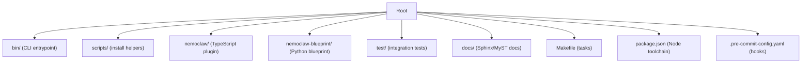
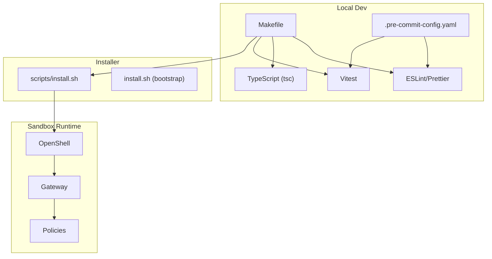
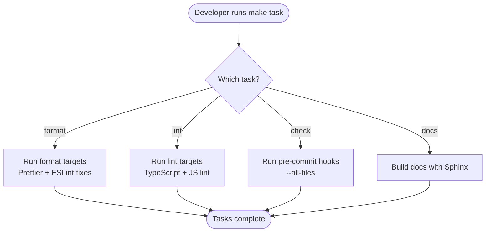
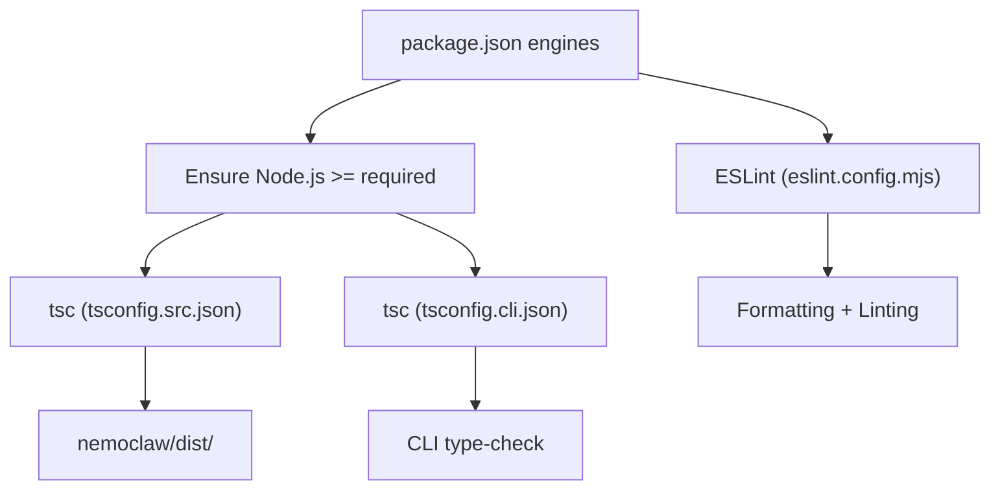
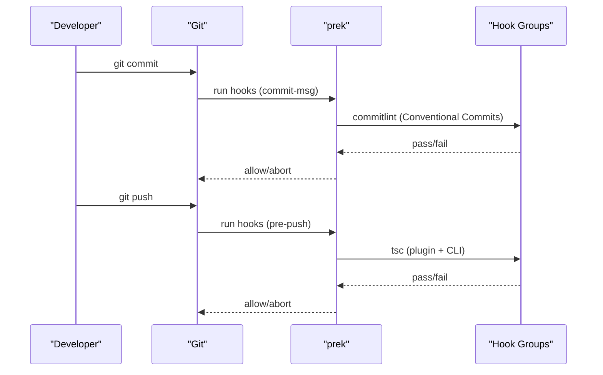
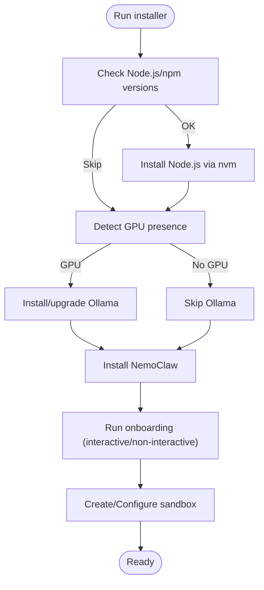
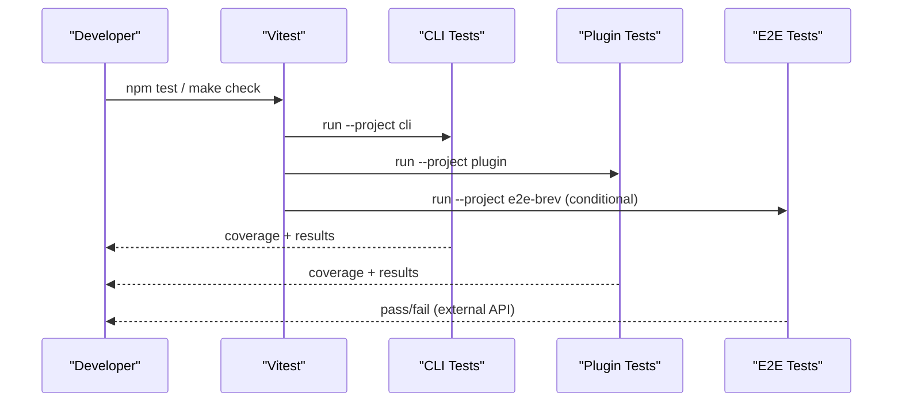
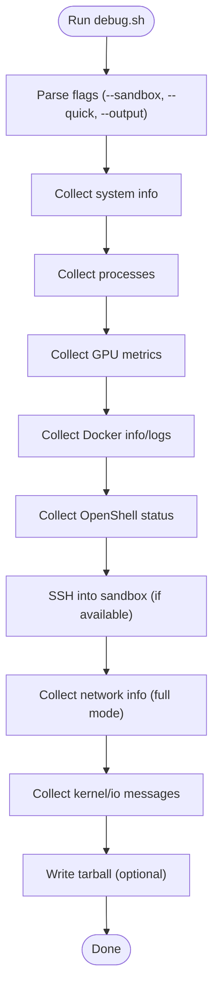
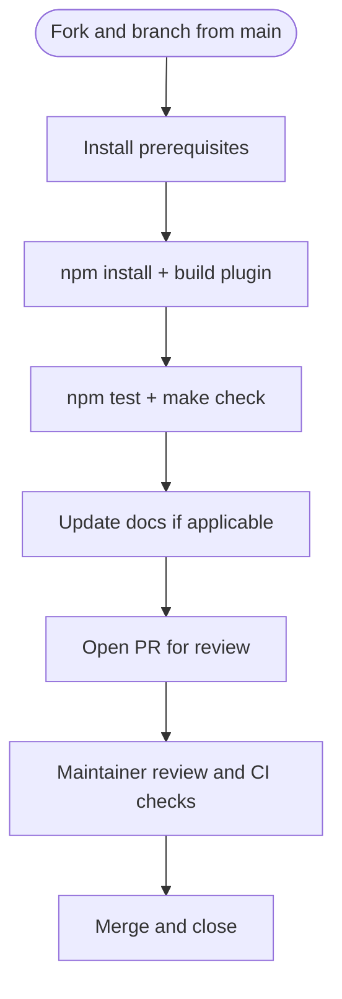
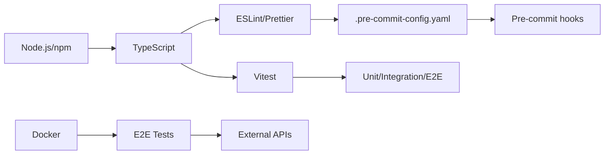

# Development Environment Setup

<cite>
**Referenced Files in This Document**
- [Makefile](file://Makefile)
- [package.json](file://package.json)
- [CONTRIBUTING.md](file://CONTRIBUTING.md)
- [eslint.config.mjs](file://eslint.config.mjs)
- [vitest.config.ts](file://vitest.config.ts)
- [.pre-commit-config.yaml](file://.pre-commit-config.yaml)
- [scripts/install.sh](file://scripts/install.sh)
- [install.sh](file://install.sh)
- [scripts/debug.sh](file://scripts/debug.sh)
- [test/e2e/test-full-e2e.sh](file://test/e2e/test-full-e2e.sh)
- [tsconfig.src.json](file://tsconfig.src.json)
- [tsconfig.cli.json](file://tsconfig.cli.json)
</cite>

## Table of Contents
1. [Introduction](#introduction)
2. [Project Structure](#project-structure)
3. [Core Components](#core-components)
4. [Architecture Overview](#architecture-overview)
5. [Detailed Component Analysis](#detailed-component-analysis)
6. [Dependency Analysis](#dependency-analysis)
7. [Performance Considerations](#performance-considerations)
8. [Troubleshooting Guide](#troubleshooting-guide)
9. [Conclusion](#conclusion)
10. [Appendices](#appendices)

## Introduction
This document provides a comprehensive guide to setting up a development environment for the NemoClaw ecosystem. It focuses on local development, testing, and contribution workflows, covering toolchain requirements, Makefile targets, installation procedures, sandbox setup, debugging, and testing strategies. It also includes practical workflows for code modification, IDE recommendations, and continuous integration integration.

## Project Structure
The repository is organized into multiple areas:
- Root CLI and installer logic under bin/ and scripts/
- NemoClaw TypeScript plugin under nemoclaw/
- Blueprint orchestration under nemoclaw-blueprint/
- Tests under test/
- Documentation under docs/
- Build and linting configuration files

**Section sources**
- [CONTRIBUTING.md:86-98](file://CONTRIBUTING.md#L86-L98)

## Core Components
- Development tasks are orchestrated via Makefile targets for linting, formatting, and documentation building.
- Node.js and npm are the primary runtime and package managers; TypeScript compilation is handled by tsc with dedicated tsconfig files.
- Pre-commit hooks manage formatting, linting, and validation via prek.
- Vitest runs unit and integration tests across CLI, plugin, and E2E scopes.
- The installer automates Node.js, optional Ollama, and NemoClaw installation, including onboarding and sandbox creation.

**Section sources**
- [Makefile:1-34](file://Makefile#L1-L34)
- [package.json:9-20](file://package.json#L9-L20)
- [CONTRIBUTING.md:54-69](file://CONTRIBUTING.md#L54-L69)
- [eslint.config.mjs:6-14](file://eslint.config.mjs#L6-L14)
- [vitest.config.ts:6-38](file://vitest.config.ts#L6-L38)
- [.pre-commit-config.yaml:33-32](file://.pre-commit-config.yaml#L33-L32)

## Architecture Overview
The development environment integrates several layers:
- Toolchain: Node.js, npm, TypeScript, ESLint, Prettier, Vitest, Sphinx, uv
- Local sandbox: OpenShell-managed sandbox with gateway and policy enforcement
- Installer: Bootstraps runtime, optional inference stack, and NemoClaw CLI
- Hooks and CI: Pre-commit hooks and CI jobs enforce quality gates

**Diagram sources**
- [Makefile:1-34](file://Makefile#L1-L34)
- [.pre-commit-config.yaml:33-248](file://.pre-commit-config.yaml#L33-L248)
- [scripts/install.sh:583-630](file://scripts/install.sh#L583-L630)
- [install.sh:109-121](file://install.sh#L109-L121)

## Detailed Component Analysis

### Makefile Targets and Development Tasks
Common development tasks are exposed via Makefile:
- Formatting and linting: format, format-ts, format-cli, lint, lint-ts
- Documentation: docs, docs-strict, docs-live, docs-clean
- Quality gate: check (runs pre-commit hooks across all files)

These targets coordinate with npm scripts and pre-commit hooks to maintain consistent code quality.

**Section sources**
- [Makefile:3-33](file://Makefile#L3-L33)
- [CONTRIBUTING.md:56-69](file://CONTRIBUTING.md#L56-L69)

### Node.js and TypeScript Toolchain
- Node.js and npm requirements are enforced by the installer and package manifest.
- TypeScript configurations:
  - tsconfig.src.json: plugin sources compiled to dist
  - tsconfig.cli.json: CLI and scripts type-checking
- ESLint configuration applies to bin/, scripts/, and test/ with language-specific globals and rules.

**Section sources**
- [package.json:38-40](file://package.json#L38-L40)
- [tsconfig.src.json:1-21](file://tsconfig.src.json#L1-L21)
- [tsconfig.cli.json:1-21](file://tsconfig.cli.json#L1-L21)
- [eslint.config.mjs:16-103](file://eslint.config.mjs#L16-L103)

### Pre-commit Hooks and Quality Gates
- Pre-commit hooks are managed by prek and configured in .pre-commit-config.yaml.
- Hook priorities group tasks (file fixers, SPDX headers, formatters, linters, tests, coverage).
- Commit message linting enforces Conventional Commits.
- Pre-push hooks include TypeScript type checks and coverage thresholds.

**Section sources**
- [.pre-commit-config.yaml:1-248](file://.pre-commit-config.yaml#L1-L248)
- [CONTRIBUTING.md:70-84](file://CONTRIBUTING.md#L70-L84)

### Installer and Sandbox Setup
The installer automates:
- Runtime detection and Node.js installation via nvm
- Optional Ollama installation on GPU systems
- NemoClaw installation and onboarding
- Sandbox creation and policy configuration

**Section sources**
- [scripts/install.sh:560-578](file://scripts/install.sh#L560-L578)
- [scripts/install.sh:634-715](file://scripts/install.sh#L634-L715)
- [scripts/install.sh:756-800](file://scripts/install.sh#L756-L800)
- [install.sh:109-121](file://install.sh#L109-L121)

### Testing Environment and Strategies
- Unit and integration tests:
  - Root tests under test/ run via npm test
  - Plugin tests under nemoclaw/src via npm run test
  - Vitest projects split by scope (cli, plugin, e2e-brev)
- Coverage reporting configured per project
- End-to-end tests validate full user journey with real inference

**Section sources**
- [vitest.config.ts:6-38](file://vitest.config.ts#L6-L38)
- [CONTRIBUTING.md:56-69](file://CONTRIBUTING.md#L56-L69)
- [test/e2e/test-full-e2e.sh:1-379](file://test/e2e/test-full-e2e.sh#L1-L379)

### Debugging and Diagnostics
The debug script collects system, GPU, Docker, OpenShell, and sandbox diagnostics, with optional tarball output and secret redaction.

**Section sources**
- [scripts/debug.sh:1-356](file://scripts/debug.sh#L1-L356)

### Contribution Workflow and Best Practices
- Prerequisites: Node.js 22.16+, npm 10+, Python 3.11+, Docker, uv, hadolint
- Build and test: npm install, build plugin, run tests, make docs
- Commit conventions: Conventional Commits enforced by commitlint
- Language policy: New source files must be TypeScript; migrate existing JS where feasible

**Section sources**
- [CONTRIBUTING.md:13-36](file://CONTRIBUTING.md#L13-L36)
- [CONTRIBUTING.md:168-225](file://CONTRIBUTING.md#L168-L225)

## Dependency Analysis
- Node.js runtime and npm versions are enforced by both installer and package manifest.
- TypeScript configurations isolate plugin vs CLI type-checking.
- Pre-commit hooks depend on external tools (ShellCheck, hadolint, gitleaks, markdownlint-cli2).
- E2E tests rely on Docker and external inference endpoints.

**Diagram sources**
- [package.json:38-40](file://package.json#L38-L40)
- [tsconfig.src.json:1-21](file://tsconfig.src.json#L1-L21)
- [tsconfig.cli.json:1-21](file://tsconfig.cli.json#L1-L21)
- [.pre-commit-config.yaml:147-175](file://.pre-commit-config.yaml#L147-L175)
- [test/e2e/test-full-e2e.sh:103-122](file://test/e2e/test-full-e2e.sh#L103-L122)

**Section sources**
- [package.json:38-40](file://package.json#L38-L40)
- [.pre-commit-config.yaml:147-175](file://.pre-commit-config.yaml#L147-L175)

## Performance Considerations
- Use pre-commit hooks to catch issues early and reduce CI failures.
- Keep TypeScript configurations optimized (exclude test files from plugin build).
- Prefer incremental builds and watch mode for iterative development.
- Limit E2E runs to environments with reliable network connectivity to external inference endpoints.

## Troubleshooting Guide
- Installer failures:
  - Verify Node.js/npm versions meet requirements.
  - Ensure nvm is sourced and PATH is refreshed after installation.
  - Check for GPU detection and Ollama minimum version compatibility.
- Sandbox connectivity:
  - Confirm Docker is running and OpenShell gateway is healthy.
  - Use the debug script to collect sandbox internals and gateway logs.
- E2E test failures:
  - Validate NVIDIA API key and network access to inference endpoints.
  - Review E2E logs and cleanup residual sandbox/gateway artifacts.

**Section sources**
- [scripts/install.sh:560-578](file://scripts/install.sh#L560-L578)
- [scripts/install.sh:634-715](file://scripts/install.sh#L634-L715)
- [scripts/debug.sh:274-298](file://scripts/debug.sh#L274-L298)
- [test/e2e/test-full-e2e.sh:103-132](file://test/e2e/test-full-e2e.sh#L103-L132)

## Conclusion
The NemoClaw development environment is designed for productivity and quality. By leveraging Makefile tasks, pre-commit hooks, TypeScript configurations, and comprehensive testing, contributors can efficiently develop, validate, and iterate on changes. The installer streamlines local sandbox setup, while the debug script provides robust diagnostics for troubleshooting.

## Appendices

### Practical Development Workflows
- Local development:
  - Install prerequisites and build the plugin.
  - Run unit tests and type checks.
  - Use formatting and linting targets before committing.
- Sandbox setup:
  - Run the installer in non-interactive mode with environment variables for automation.
  - Verify sandbox status and policy application.
- Local testing:
  - Execute root and plugin tests via npm test.
  - For E2E, ensure Docker and a valid NVIDIA API key are available.

**Section sources**
- [CONTRIBUTING.md:23-36](file://CONTRIBUTING.md#L23-L36)
- [CONTRIBUTING.md:56-69](file://CONTRIBUTING.md#L56-L69)
- [test/e2e/test-full-e2e.sh:16-26](file://test/e2e/test-full-e2e.sh#L16-L26)

### IDE Configuration Recommendations
- Enable ESLint and Prettier integrations for automatic formatting and linting on save.
- Configure TypeScript projects to use tsconfig.src.json for plugin and tsconfig.cli.json for CLI scripts.
- Set up Vitest integration to run and debug tests directly from the editor.

**Section sources**
- [eslint.config.mjs:16-103](file://eslint.config.mjs#L16-L103)
- [tsconfig.src.json:1-21](file://tsconfig.src.json#L1-L21)
- [tsconfig.cli.json:1-21](file://tsconfig.cli.json#L1-L21)
- [vitest.config.ts:6-38](file://vitest.config.ts#L6-L38)

### Continuous Integration Integration
- Pre-commit hooks enforce formatting, linting, and type checks locally.
- Pre-push hooks validate TypeScript builds and coverage thresholds.
- CI should mirror pre-commit and pre-push checks to maintain consistency.

**Section sources**
- [.pre-commit-config.yaml:176-248](file://.pre-commit-config.yaml#L176-L248)
- [CONTRIBUTING.md:70-84](file://CONTRIBUTING.md#L70-L84)