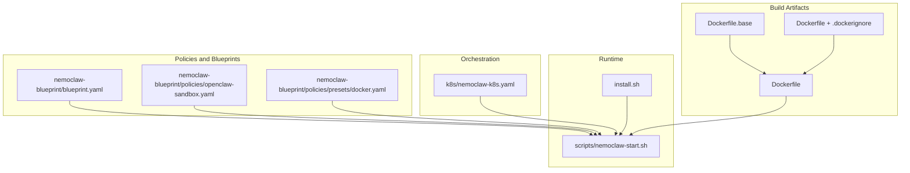
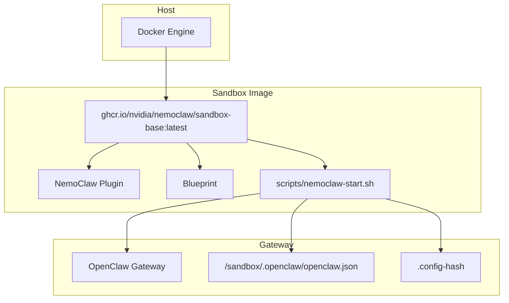
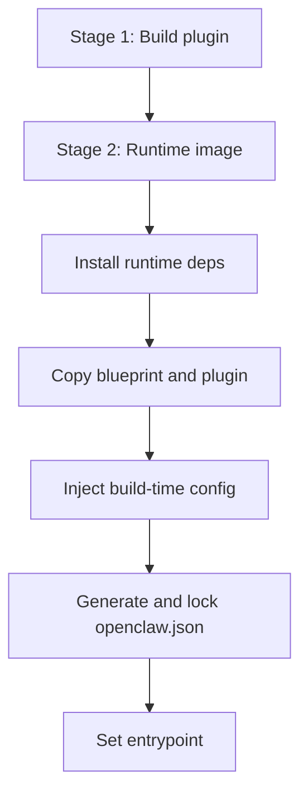
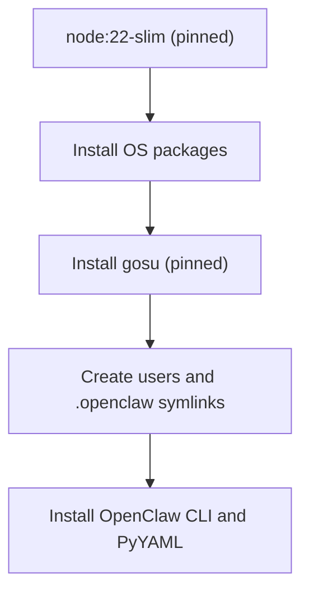
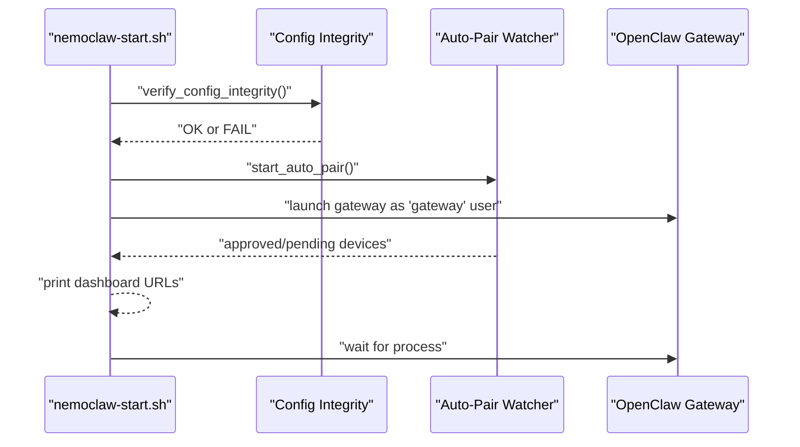
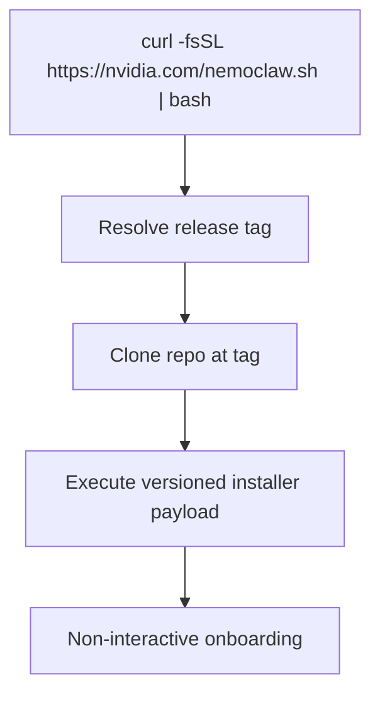
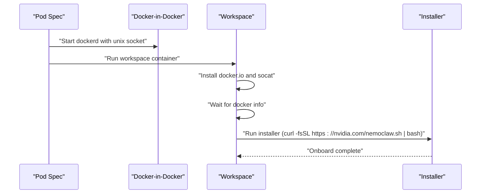
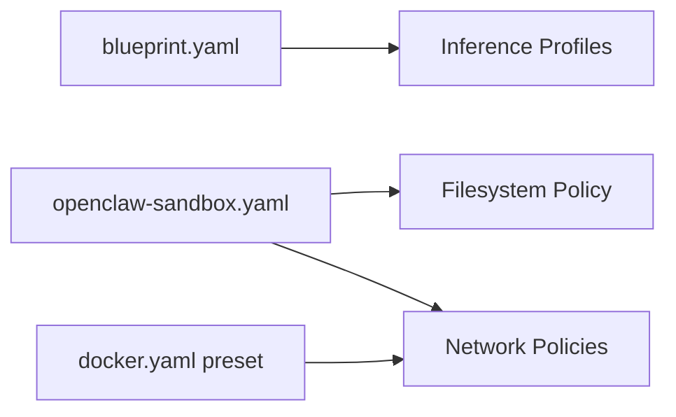
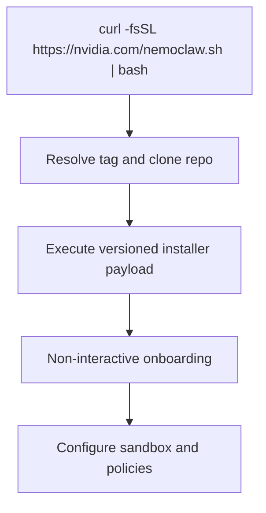
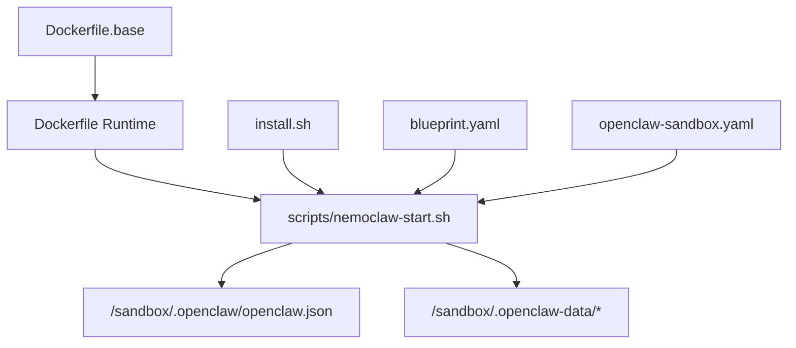

# Docker Deployment

<cite>
**Referenced Files in This Document**
- [Dockerfile](file://Dockerfile)
- [Dockerfile.base](file://Dockerfile.base)
- [.dockerignore](file://.dockerignore)
- [scripts/nemoclaw-start.sh](file://scripts/nemoclaw-start.sh)
- [install.sh](file://install.sh)
- [k8s/nemoclaw-k8s.yaml](file://k8s/nemoclaw-k8s.yaml)
- [nemoclaw-blueprint/policies/presets/docker.yaml](file://nemoclaw-blueprint/policies/presets/docker.yaml)
- [nemoclaw-blueprint/blueprint.yaml](file://nemoclaw-blueprint/blueprint.yaml)
- [nemoclaw-blueprint/policies/openclaw-sandbox.yaml](file://nemoclaw-blueprint/policies/openclaw-sandbox.yaml)
- [docs/deployment/sandbox-hardening.md](file://docs/deployment/sandbox-hardening.md)
- [docs/security/best-practices.md](file://docs/security/best-practices.md)
- [src/lib/deploy.ts](file://src/lib/deploy.ts)
- [scripts/setup-dns-proxy.sh](file://scripts/setup-dns-proxy.sh)
</cite>

## Table of Contents
1. [Introduction](#introduction)
2. [Project Structure](#project-structure)
3. [Core Components](#core-components)
4. [Architecture Overview](#architecture-overview)
5. [Detailed Component Analysis](#detailed-component-analysis)
6. [Dependency Analysis](#dependency-analysis)
7. [Performance Considerations](#performance-considerations)
8. [Troubleshooting Guide](#troubleshooting-guide)
9. [Conclusion](#conclusion)
10. [Appendices](#appendices)

## Introduction
This document provides a comprehensive guide to deploying NemoClaw in single-host Docker environments. It covers the official Dockerfile configuration, base image requirements, container orchestration setup, volume mounting strategies, Docker socket sharing for sandbox isolation, network configuration, step-by-step installation via the official installer script, environment variable configuration for different deployment modes, container health monitoring, practical Docker Compose configurations, resource allocation tuning, troubleshooting common container issues, and security considerations for Docker-in-Docker setups, volume permissions, and container isolation best practices.

## Project Structure
The repository includes:
- Official Dockerfiles for building the sandbox image and a reusable base image.
- An entrypoint script that starts the gateway securely and handles device pairing and proxy configuration.
- An installer script that supports non-interactive onboarding and environment-driven configuration.
- Kubernetes manifests demonstrating Docker-in-Docker (DinD) for sandbox isolation.
- Blueprint and policy definitions that govern network access and filesystem behavior.
- Documentation on sandbox hardening and security best practices.
- Supporting scripts for DNS proxy setup and deployment automation.

**Diagram sources**
- [Dockerfile:1-176](file://Dockerfile#L1-L176)
- [Dockerfile.base:1-124](file://Dockerfile.base#L1-L124)
- [.dockerignore:1-13](file://.dockerignore#L1-L13)
- [scripts/nemoclaw-start.sh:1-436](file://scripts/nemoclaw-start.sh#L1-L436)
- [install.sh:1-121](file://install.sh#L1-L121)
- [k8s/nemoclaw-k8s.yaml:1-120](file://k8s/nemoclaw-k8s.yaml#L1-L120)
- [nemoclaw-blueprint/blueprint.yaml:1-66](file://nemoclaw-blueprint/blueprint.yaml#L1-L66)
- [nemoclaw-blueprint/policies/openclaw-sandbox.yaml:1-219](file://nemoclaw-blueprint/policies/openclaw-sandbox.yaml#L1-L219)
- [nemoclaw-blueprint/policies/presets/docker.yaml:1-46](file://nemoclaw-blueprint/policies/presets/docker.yaml#L1-L46)

**Section sources**
- [Dockerfile:1-176](file://Dockerfile#L1-L176)
- [Dockerfile.base:1-124](file://Dockerfile.base#L1-L124)
- [.dockerignore:1-13](file://.dockerignore#L1-L13)
- [scripts/nemoclaw-start.sh:1-436](file://scripts/nemoclaw-start.sh#L1-L436)
- [install.sh:1-121](file://install.sh#L1-L121)
- [k8s/nemoclaw-k8s.yaml:1-120](file://k8s/nemoclaw-k8s.yaml#L1-L120)
- [nemoclaw-blueprint/blueprint.yaml:1-66](file://nemoclaw-blueprint/blueprint.yaml#L1-L66)
- [nemoclaw-blueprint/policies/openclaw-sandbox.yaml:1-219](file://nemoclaw-blueprint/policies/openclaw-sandbox.yaml#L1-L219)
- [nemoclaw-blueprint/policies/presets/docker.yaml:1-46](file://nemoclaw-blueprint/policies/presets/docker.yaml#L1-L46)

## Core Components
- Official Dockerfile: Defines a two-stage build (TypeScript plugin build and runtime image), applies security hardening, injects build-time configuration into the runtime, and sets the entrypoint.
- Base image Dockerfile: Establishes a stable, cacheable base with pinned OS packages, gosu, user/group setup, and OpenClaw CLI installation.
- Entrypoint script: Starts the gateway as a dedicated user, validates configuration integrity, manages device pairing, configures proxy settings, and ensures sandbox isolation.
- Installer script: Supports non-interactive onboarding, environment-driven configuration, and optional service startup.
- Kubernetes manifest: Demonstrates Docker-in-Docker for sandbox isolation and environment configuration for the workspace container.
- Policies and blueprints: Define filesystem, network, and process policies for sandbox behavior and inference routing.

**Section sources**
- [Dockerfile:1-176](file://Dockerfile#L1-L176)
- [Dockerfile.base:1-124](file://Dockerfile.base#L1-L124)
- [scripts/nemoclaw-start.sh:1-436](file://scripts/nemoclaw-start.sh#L1-L436)
- [install.sh:1-121](file://install.sh#L1-L121)
- [k8s/nemoclaw-k8s.yaml:1-120](file://k8s/nemoclaw-k8s.yaml#L1-L120)
- [nemoclaw-blueprint/blueprint.yaml:1-66](file://nemoclaw-blueprint/blueprint.yaml#L1-L66)
- [nemoclaw-blueprint/policies/openclaw-sandbox.yaml:1-219](file://nemoclaw-blueprint/policies/openclaw-sandbox.yaml#L1-L219)
- [nemoclaw-blueprint/policies/presets/docker.yaml:1-46](file://nemoclaw-blueprint/policies/presets/docker.yaml#L1-L46)

## Architecture Overview
The Docker-based deployment architecture centers on a sandbox image layered on a hardened base image. The entrypoint script initializes the gateway, enforces configuration integrity, and manages device pairing and proxy settings. The installer script automates onboarding and environment configuration. Kubernetes manifests demonstrate Docker-in-Docker for sandbox isolation.

**Diagram sources**
- [Dockerfile.base:51-124](file://Dockerfile.base#L51-L124)
- [Dockerfile:21-47](file://Dockerfile#L21-L47)
- [scripts/nemoclaw-start.sh:100-170](file://scripts/nemoclaw-start.sh#L100-L170)

**Section sources**
- [Dockerfile.base:1-124](file://Dockerfile.base#L1-L124)
- [Dockerfile:1-176](file://Dockerfile#L1-L176)
- [scripts/nemoclaw-start.sh:1-436](file://scripts/nemoclaw-start.sh#L1-L436)

## Detailed Component Analysis

### Official Dockerfile Configuration
- Two-stage build: The first stage compiles the NemoClaw TypeScript plugin; the second stage pulls the base image and installs runtime dependencies.
- Security hardening: Removes unnecessary build tools and network probes from the base image.
- Build-time configuration: Injects inference provider, model, and UI configuration via build arguments promoted to environment variables.
- Immutable gateway configuration: Generates and locks down the gateway configuration file and pins a config hash for integrity verification.
- Entrypoint: Sets the entrypoint to the NemoClaw startup script.

**Diagram sources**
- [Dockerfile:14-47](file://Dockerfile#L14-L47)
- [Dockerfile:86-170](file://Dockerfile#L86-L170)

**Section sources**
- [Dockerfile:1-176](file://Dockerfile#L1-L176)

### Base Image Requirements
- Pinned OS packages and utilities for stability and security.
- Installation of gosu for privilege separation and OpenClaw CLI.
- Creation of sandbox and gateway users and split .openclaw directory structure with symlinks to writable state directories.
- PyYAML installed for inline Python scripts.

**Diagram sources**
- [Dockerfile.base:51-124](file://Dockerfile.base#L51-L124)

**Section sources**
- [Dockerfile.base:1-124](file://Dockerfile.base#L1-L124)

### Entrypoint Script: Gateway Initialization and Security
- Validates configuration integrity using a pinned hash.
- Drops unnecessary Linux capabilities and limits process count.
- Writes an authentication profile if an API key is provided.
- Manages device pairing and prints dashboard URLs.
- Configures proxy environment variables for outbound connectivity.
- Starts the gateway as a dedicated user and waits for it to remain running.

**Diagram sources**
- [scripts/nemoclaw-start.sh:100-170](file://scripts/nemoclaw-start.sh#L100-L170)
- [scripts/nemoclaw-start.sh:169-253](file://scripts/nemoclaw-start.sh#L169-L253)
- [scripts/nemoclaw-start.sh:422-436](file://scripts/nemoclaw-start.sh#L422-L436)

**Section sources**
- [scripts/nemoclaw-start.sh:1-436](file://scripts/nemoclaw-start.sh#L1-L436)

### Installer Script: Non-Interactive Onboarding
- Resolves a release tag and clones the repository at that tag.
- Executes the versioned installer payload with environment-driven configuration.
- Supports options for non-interactive mode, acceptance of third-party software, and help/version output.

**Diagram sources**
- [install.sh:17-63](file://install.sh#L17-L63)
- [install.sh:90-121](file://install.sh#L90-L121)

**Section sources**
- [install.sh:1-121](file://install.sh#L1-L121)

### Kubernetes Manifest: Docker-in-Docker Setup
- DinD container runs the Docker daemon with privileged access and mounts storage and socket paths.
- Workspace container installs Docker client and socat, waits for the Docker daemon, and runs the official installer.
- Environment variables configure provider, endpoint, model, and policy mode for the sandbox.

**Diagram sources**
- [k8s/nemoclaw-k8s.yaml:13-120](file://k8s/nemoclaw-k8s.yaml#L13-L120)

**Section sources**
- [k8s/nemoclaw-k8s.yaml:1-120](file://k8s/nemoclaw-k8s.yaml#L1-L120)

### Network Policies and Blueprint Configuration
- Blueprint defines sandbox image, port forwarding, and inference profiles for different providers.
- Sandbox policy enforces filesystem read-only paths, allows writable state directories, and restricts network endpoints.
- Preset policy for Docker registries allows access to Docker Hub and NVCR with enforced TLS termination.

**Diagram sources**
- [nemoclaw-blueprint/blueprint.yaml:19-66](file://nemoclaw-blueprint/blueprint.yaml#L19-L66)
- [nemoclaw-blueprint/policies/openclaw-sandbox.yaml:18-45](file://nemoclaw-blueprint/policies/openclaw-sandbox.yaml#L18-L45)
- [nemoclaw-blueprint/policies/presets/docker.yaml:8-46](file://nemoclaw-blueprint/policies/presets/docker.yaml#L8-L46)

**Section sources**
- [nemoclaw-blueprint/blueprint.yaml:1-66](file://nemoclaw-blueprint/blueprint.yaml#L1-L66)
- [nemoclaw-blueprint/policies/openclaw-sandbox.yaml:1-219](file://nemoclaw-blueprint/policies/openclaw-sandbox.yaml#L1-L219)
- [nemoclaw-blueprint/policies/presets/docker.yaml:1-46](file://nemoclaw-blueprint/policies/presets/docker.yaml#L1-L46)

### Volume Mounting Strategies for Persistent Storage
- Writable state directories are symlinked under /sandbox/.openclaw-data and mounted as volumes for persistence across container restarts.
- The immutable configuration directory /sandbox/.openclaw remains read-only and protected by DAC and Landlock policies.

Practical guidance:
- Mount /sandbox/.openclaw-data to persist agents, plugins, workspace, skills, hooks, identity, devices, canvas, cron, and memory.
- Keep /sandbox/.openclaw read-only and rely on the symlinked writable paths for state.

**Section sources**
- [Dockerfile.base:90-118](file://Dockerfile.base#L90-L118)
- [Dockerfile.base:154-163](file://Dockerfile.base#L154-L163)
- [nemoclaw-blueprint/policies/openclaw-sandbox.yaml:28-37](file://nemoclaw-blueprint/policies/openclaw-sandbox.yaml#L28-L37)

### Docker Socket Sharing for Sandbox Isolation
- The Kubernetes manifest demonstrates sharing the Docker socket with a DinD container to enable sandbox isolation.
- The workspace container sets DOCKER_HOST to the Unix socket and configures socat for DNS bridging.

Best practices:
- Use privileged mode for DinD only when necessary and restrict other capabilities.
- Mount only required paths (/var/run, /var/lib/docker, /etc/docker) and isolate storage with dedicated volumes.

**Section sources**
- [k8s/nemoclaw-k8s.yaml:14-120](file://k8s/nemoclaw-k8s.yaml#L14-L120)

### Network Configuration for Container Communication
- Sandbox policy enforces read-only filesystem paths and allows writable state directories.
- Network policies define allowed endpoints for providers and messaging platforms.
- Proxy configuration is injected into the sandbox to handle outbound requests while excluding gateway IP ranges.

**Section sources**
- [nemoclaw-blueprint/policies/openclaw-sandbox.yaml:46-219](file://nemoclaw-blueprint/policies/openclaw-sandbox.yaml#L46-L219)
- [scripts/nemoclaw-start.sh:255-330](file://scripts/nemoclaw-start.sh#L255-L330)

### Step-by-Step Installation Procedures Using the Official Installer
- Obtain the installer via curl and execute it in non-interactive mode with environment variables.
- The installer resolves a release tag, clones the repository, and executes the versioned payload.
- Onboarding completes with the configured sandbox name, provider, endpoint, and policy mode.

**Diagram sources**
- [install.sh:17-63](file://install.sh#L17-L63)
- [install.sh:90-121](file://install.sh#L90-L121)

**Section sources**
- [install.sh:1-121](file://install.sh#L1-L121)

### Environment Variable Configuration for Different Deployment Modes
Common environment variables used during onboarding and runtime:
- Provider selection and endpoint configuration
- Model selection and policy mode
- Chat UI URL and device authentication settings
- API keys for inference providers

These variables are consumed by the installer and the entrypoint script to configure the sandbox and gateway.

**Section sources**
- [install.sh:80-87](file://install.sh#L80-L87)
- [scripts/nemoclaw-start.sh:12-17](file://scripts/nemoclaw-start.sh#L12-L17)
- [src/lib/deploy.ts:80-105](file://src/lib/deploy.ts#L80-L105)
- [src/lib/deploy.ts:213-224](file://src/lib/deploy.ts#L213-L224)

### Container Health Monitoring
- The entrypoint script prints dashboard URLs with embedded tokens for local and remote access.
- For external monitoring, expose port 18789 and use the gateway’s internal health checks or external probes against the dashboard URL.

**Section sources**
- [scripts/nemoclaw-start.sh:140-167](file://scripts/nemoclaw-start.sh#L140-L167)
- [nemoclaw-blueprint/blueprint.yaml:23-24](file://nemoclaw-blueprint/blueprint.yaml#L23-L24)

### Practical Examples of Docker Compose Configurations
While a Compose file is not included in this repository, the documentation provides a reference example for capability dropping, process limits, and read-only filesystems. Apply similar patterns in your Compose file:
- Drop all capabilities and add only required ones (e.g., NET_BIND_SERVICE).
- Set process limits (ulimit nproc).
- Enforce no-new-privileges.
- Use read-only root filesystem and tmpfs for temporary directories.

**Section sources**
- [docs/deployment/sandbox-hardening.md:47-91](file://docs/deployment/sandbox-hardening.md#L47-L91)

### Resource Allocation Tuning
- Allocate sufficient CPU and memory to the sandbox container to support inference workloads.
- For Kubernetes, adjust requests and limits in the pod spec for both DinD and workspace containers as needed.

**Section sources**
- [k8s/nemoclaw-k8s.yaml:29-100](file://k8s/nemoclaw-k8s.yaml#L29-L100)

### Troubleshooting Common Container Issues
- DNS resolution in isolated namespaces: Use the DNS proxy script to forward DNS queries to the host’s CoreDNS.
- Gateway readiness: Ensure the gateway is started by the entrypoint and remains running; check logs for integrity verification failures or symlink validation errors.
- Proxy misconfiguration: Verify NO_PROXY includes the gateway IP and excludes inference.local to maintain proxy routing.

**Section sources**
- [scripts/setup-dns-proxy.sh:1-37](file://scripts/setup-dns-proxy.sh#L1-L37)
- [scripts/nemoclaw-start.sh:100-116](file://scripts/nemoclaw-start.sh#L100-L116)
- [scripts/nemoclaw-start.sh:255-330](file://scripts/nemoclaw-start.sh#L255-L330)

### Security Considerations for Docker-in-Docker, Volume Permissions, and Container Isolation
- Docker-in-Docker: Use privileged mode sparingly, restrict capabilities, and mount only necessary paths.
- Volume permissions: Ensure writable state directories are owned by the sandbox user and mounted as volumes.
- Container isolation: Enforce read-only filesystems, drop capabilities, limit processes, and leverage Landlock policies.

**Section sources**
- [docs/security/best-practices.md:307-320](file://docs/security/best-practices.md#L307-L320)
- [Dockerfile.base:90-118](file://Dockerfile.base#L90-L118)
- [Dockerfile.base:154-163](file://Dockerfile.base#L154-L163)
- [nemoclaw-blueprint/policies/openclaw-sandbox.yaml:38-45](file://nemoclaw-blueprint/policies/openclaw-sandbox.yaml#L38-L45)

## Dependency Analysis
The runtime depends on the base image for OS packages, gosu, and OpenClaw CLI. The entrypoint script depends on the generated configuration and symlink structure. The installer depends on environment variables and the blueprint/policy definitions.

**Diagram sources**
- [Dockerfile.base:51-124](file://Dockerfile.base#L51-L124)
- [Dockerfile:21-47](file://Dockerfile#L21-L47)
- [scripts/nemoclaw-start.sh:100-170](file://scripts/nemoclaw-start.sh#L100-L170)
- [nemoclaw-blueprint/blueprint.yaml:19-66](file://nemoclaw-blueprint/blueprint.yaml#L19-L66)
- [nemoclaw-blueprint/policies/openclaw-sandbox.yaml:18-45](file://nemoclaw-blueprint/policies/openclaw-sandbox.yaml#L18-L45)

**Section sources**
- [Dockerfile.base:1-124](file://Dockerfile.base#L1-L124)
- [Dockerfile:1-176](file://Dockerfile#L1-L176)
- [scripts/nemoclaw-start.sh:1-436](file://scripts/nemoclaw-start.sh#L1-L436)
- [nemoclaw-blueprint/blueprint.yaml:1-66](file://nemoclaw-blueprint/blueprint.yaml#L1-L66)
- [nemoclaw-blueprint/policies/openclaw-sandbox.yaml:1-219](file://nemoclaw-blueprint/policies/openclaw-sandbox.yaml#L1-L219)

## Performance Considerations
- Prefer the base image for caching to reduce build times.
- Minimize writable state directories to improve I/O performance.
- Tune CPU and memory requests/limits according to workload requirements.
- Avoid unnecessary network access to reduce latency and bandwidth usage.

## Troubleshooting Guide
- Integrity verification failure: Indicates tampering with the configuration file; rebuild the image with correct build arguments.
- Symlink validation failure: Indicates unexpected targets for symlinks under .openclaw; verify the symlink structure and ownership.
- Device pairing issues: Confirm allowed clients and modes and check the auto-pair watcher logs.
- Proxy loop: Ensure NO_PROXY excludes the gateway IP and inference.local is routed through the proxy intentionally.

**Section sources**
- [scripts/nemoclaw-start.sh:100-116](file://scripts/nemoclaw-start.sh#L100-L116)
- [scripts/nemoclaw-start.sh:396-420](file://scripts/nemoclaw-start.sh#L396-L420)
- [scripts/nemoclaw-start.sh:169-253](file://scripts/nemoclaw-start.sh#L169-L253)
- [scripts/nemoclaw-start.sh:255-330](file://scripts/nemoclaw-start.sh#L255-L330)

## Conclusion
This guide outlined the Docker-based deployment of NemoClaw for single-host environments, covering the official Dockerfile and base image, container orchestration with Kubernetes, volume mounting strategies, Docker socket sharing, network configuration, installation procedures, environment variables, health monitoring, practical Compose configurations, resource tuning, troubleshooting, and security best practices. By following these guidelines, you can deploy a secure, isolated, and performant NemoClaw sandbox.

## Appendices
- Sandbox hardening reference for capability dropping and process limits.
- Security best practices for no-new-privileges and process limits.

**Section sources**
- [docs/deployment/sandbox-hardening.md:47-91](file://docs/deployment/sandbox-hardening.md#L47-L91)
- [docs/security/best-practices.md:307-320](file://docs/security/best-practices.md#L307-L320)