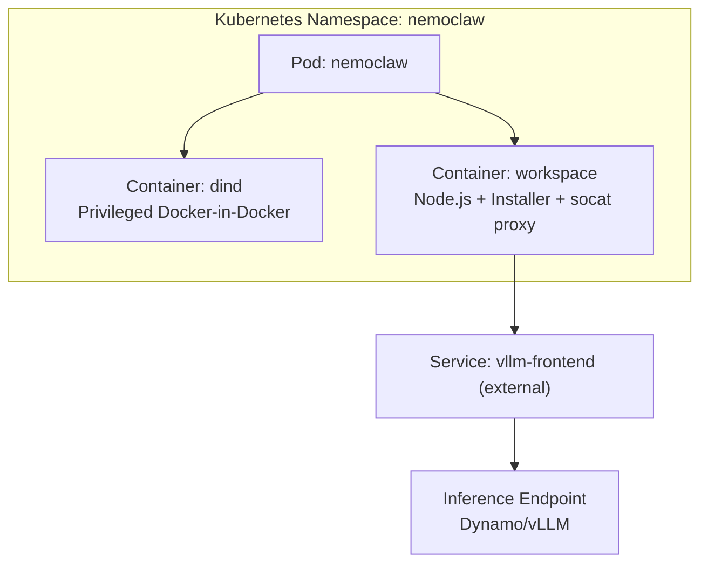
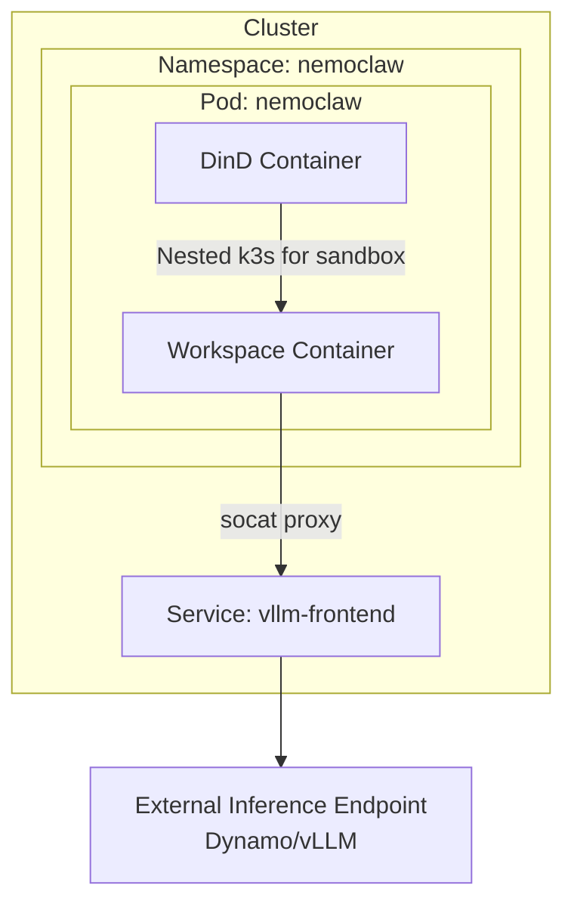
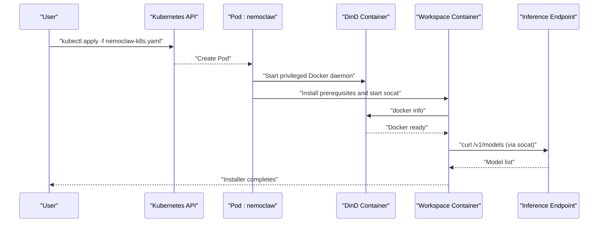
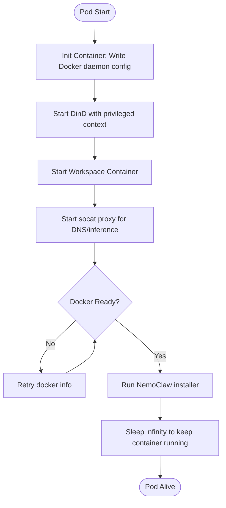
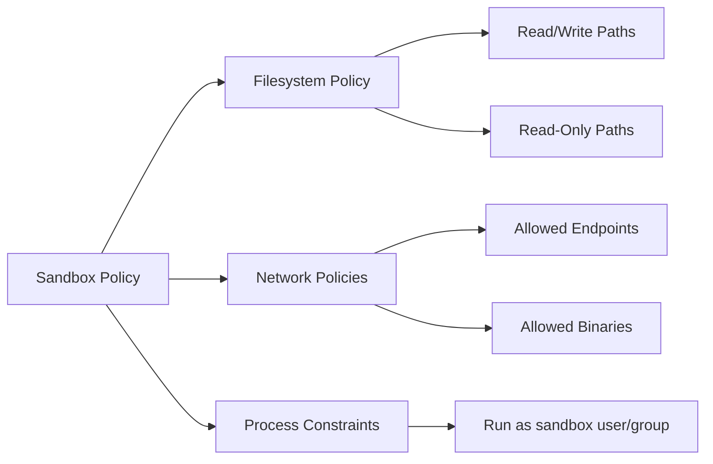
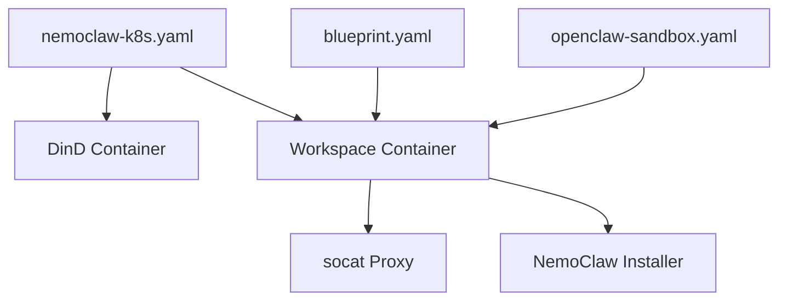

# Kubernetes Deployment

<cite>
**Referenced Files in This Document**
- [nemoclaw-k8s.yaml](file://k8s/nemoclaw-k8s.yaml)
- [README.md](file://k8s/README.md)
- [blueprint.yaml](file://nemoclaw-blueprint/blueprint.yaml)
- [openclaw-sandbox.yaml](file://nemoclaw-blueprint/policies/openclaw-sandbox.yaml)
- [backup-restore.md](file://docs/workspace/backup-restore.md)
- [SKILL.md](file://.agents/skills/nemoclaw-workspace/SKILL.md)
- [setup-dns-proxy.sh](file://scripts/setup-dns-proxy.sh)
- [fix-coredns.sh](file://scripts/fix-coredns.sh)
- [sandbox-hardening.md](file://docs/deployment/sandbox-hardening.md)
- [best-practices.md](file://.agents/skills/nemoclaw-security-best/references/best-practices.md)
</cite>

## Table of Contents
1. [Introduction](#introduction)
2. [Project Structure](#project-structure)
3. [Core Components](#core-components)
4. [Architecture Overview](#architecture-overview)
5. [Detailed Component Analysis](#detailed-component-analysis)
6. [Dependency Analysis](#dependency-analysis)
7. [Performance Considerations](#performance-considerations)
8. [Troubleshooting Guide](#troubleshooting-guide)
9. [Conclusion](#conclusion)
10. [Appendices](#appendices)

## Introduction
This document provides a production-focused Kubernetes deployment guide for NemoClaw. It explains the provided Kubernetes manifest, including the privileged pod with Docker-in-Docker (DinD), resource allocation, and security contexts. It also covers namespace management, service discovery, and ingress configuration for external access. Additional topics include cluster preparation, RBAC permissions, persistent volumes for stateful operations, practical kubectl commands, monitoring and logging, advanced topics such as horizontal pod autoscaling and rolling updates, backup strategies, and multi-node considerations. Finally, it includes troubleshooting guidance and performance optimization techniques.

## Project Structure
The Kubernetes deployment is centered around a single Pod manifest that runs:
- A privileged DinD container for sandbox isolation
- A workspace container that installs and runs NemoClaw, with a socat proxy bridging DNS and inference endpoints

**Diagram sources**
- [nemoclaw-k8s.yaml:11-120](file://k8s/nemoclaw-k8s.yaml#L11-L120)
- [README.md:131-152](file://k8s/README.md#L131-L152)

**Section sources**
- [nemoclaw-k8s.yaml:1-120](file://k8s/nemoclaw-k8s.yaml#L1-L120)
- [README.md:1-206](file://k8s/README.md#L1-L206)

## Core Components
- Privileged Pod with Docker-in-Docker
  - The manifest defines a single Pod with two containers: a privileged DinD container and a workspace container.
  - The DinD container mounts emptyDir volumes for storage, Docker socket, and configuration.
  - Resource requests are set for memory and CPU to support sandbox isolation and inference workloads.
- Workspace Container
  - Installs prerequisites, starts a socat proxy to bridge DNS and inference endpoints, waits for Docker readiness, and runs the NemoClaw installer.
  - Environment variables configure the inference endpoint, model, sandbox name, and policy mode.
- Init Container
  - Writes a Docker daemon configuration to enable cgroup v2 compatibility for nested k3s clusters used by OpenShell.

Practical kubectl commands (as documented):
- Create namespace and deploy the manifest
- Tail logs from the workspace container
- Exec into the workspace container to run NemoClaw commands
- Connect to a sandbox and test inference

**Section sources**
- [nemoclaw-k8s.yaml:11-120](file://k8s/nemoclaw-k8s.yaml#L11-L120)
- [README.md:18-125](file://k8s/README.md#L18-L125)

## Architecture Overview
The deployment architecture relies on a privileged pod to host a DinD daemon, which in turn runs OpenShell’s nested k3s cluster for sandbox isolation. A socat proxy routes DNS and inference traffic from the sandbox to the configured inference endpoint.

**Diagram sources**
- [nemoclaw-k8s.yaml:11-120](file://k8s/nemoclaw-k8s.yaml#L11-L120)
- [README.md:129-160](file://k8s/README.md#L129-L160)

## Detailed Component Analysis

### Pod Specification and Security Context
- Privileged DinD
  - The DinD container runs with elevated privileges to enable nested containerization.
  - Mounts emptyDir volumes for Docker storage, socket, and configuration.
  - Sets resource requests suitable for sandbox and inference workloads.
- Workspace Container
  - Installs system packages, starts socat to proxy DNS and inference traffic, waits for Docker readiness, and runs the NemoClaw installer.
  - Mounts the Docker socket and configuration from the pod.
  - Sets resource requests appropriate for the installer and runtime tasks.
- Init Container
  - Writes Docker daemon configuration to align cgroup behavior for nested containers.

Security considerations:
- Privileged containers increase risk; ensure RBAC and admission controls are configured appropriately.
- The workspace container runs standard Node.js and bash; ensure minimal attack surface by limiting capabilities and using read-only filesystems where feasible.

**Section sources**
- [nemoclaw-k8s.yaml:11-120](file://k8s/nemoclaw-k8s.yaml#L11-L120)

### Namespace Management
- The manifest targets the namespace “nemoclaw”.
- The README documents creating the namespace and applying the manifest.

Operational guidance:
- Use separate namespaces per environment (dev/staging/prod) to isolate resources and permissions.
- Apply resource quotas and limit ranges at the namespace level.

**Section sources**
- [nemoclaw-k8s.yaml:6-8](file://k8s/nemoclaw-k8s.yaml#L6-L8)
- [README.md:18-23](file://k8s/README.md#L18-L23)

### Service Discovery and Ingress
- Service Discovery
  - The workspace container uses a configurable environment variable to point to the inference endpoint service.
  - The README demonstrates configuring the endpoint URL and model, and shows how to verify inference from within the sandbox.
- Ingress
  - The provided manifest does not include an Ingress resource.
  - To expose NemoClaw externally, create a Service (ClusterIP/LoadBalancer/NodePort) and an Ingress resource pointing to the service.
  - Ensure TLS termination and proper certificate management.

**Section sources**
- [nemoclaw-k8s.yaml:71-91](file://k8s/nemoclaw-k8s.yaml#L71-L91)
- [README.md:43-125](file://k8s/README.md#L43-L125)

### Persistent Volumes and Stateful Operations
- Current Manifest State
  - The provided manifest uses emptyDir volumes for Docker storage, socket, and configuration. These are ephemeral and tied to the Pod lifecycle.
- Production Recommendations
  - Use PersistentVolumes (PVs) and PersistentVolumeClaims (PVCs) for sandbox data and workspace state.
  - Bind PVs to storage classes that meet performance and durability requirements.
  - Consider snapshotting strategies for backup and disaster recovery.

Backup and restore:
- The repository includes documentation and scripts for backing up and restoring workspace files.
- Use the documented CLI commands and scripts to manage backups before destructive operations.

**Section sources**
- [nemoclaw-k8s.yaml:111-117](file://k8s/nemoclaw-k8s.yaml#L111-L117)
- [backup-restore.md:1-77](file://docs/workspace/backup-restore.md#L1-L77)
- [SKILL.md:47-82](file://.agents/skills/nemoclaw-workspace/SKILL.md#L47-L82)

### Monitoring and Logging
- Pod and Container Logs
  - Tail logs from the workspace container to observe installation progress and diagnose issues.
- Sandbox Diagnostics
  - Use exec commands to run NemoClaw and OpenShell diagnostics from within the sandbox.
- DNS Proxy and CoreDNS
  - The repository includes scripts to set up a DNS proxy and to patch CoreDNS for improved resolution in sandboxed environments.

**Section sources**
- [README.md:25-31](file://k8s/README.md#L25-L31)
- [README.md:71-125](file://k8s/README.md#L71-L125)
- [setup-dns-proxy.sh:70-102](file://scripts/setup-dns-proxy.sh#L70-L102)
- [fix-coredns.sh:63-77](file://scripts/fix-coredns.sh#L63-L77)

### Advanced Topics

#### Horizontal Pod Autoscaling (HPA)
- Current Manifest State
  - The provided manifest defines a single-replica Pod.
- Recommended Implementation
  - Define a HorizontalPodAutoscaler targeting the Pod or a Deployment.
  - Choose metrics aligned with workload (CPU, memory, custom metrics).
  - Ensure the HPA scale target matches the workload’s resource requests and limits.

[No sources needed since this section provides general guidance]

#### Rolling Updates
- Current Manifest State
  - The Pod uses restartPolicy Never; rolling updates are not applicable at the Pod level.
- Recommended Implementation
  - Convert the Pod to a Deployment with a rolling update strategy.
  - Configure maxUnavailable and maxSurge to balance availability and throughput.
  - Use imagePullPolicy and image tag strategies to control update cadence.

[No sources needed since this section provides general guidance]

#### Backup Strategies
- Use the documented backup and restore procedures to preserve workspace state before destructive operations.
- Automate periodic backups using scheduled jobs or CI/CD pipelines.

**Section sources**
- [backup-restore.md:1-77](file://docs/workspace/backup-restore.md#L1-L77)
- [SKILL.md:47-82](file://.agents/skills/nemoclaw-workspace/SKILL.md#L47-L82)

#### Multi-Node Cluster Considerations
- Pod Affinity/Anti-Affinity
  - Place sandbox workloads on nodes with sufficient resources and GPU scheduling if needed.
- Storage
  - Ensure storage backends are accessible across nodes and meet performance requirements.
- Networking
  - Validate DNS and service mesh configurations for cross-node communication.

[No sources needed since this section provides general guidance]

### RBAC and Security Contexts
- Privileged Pod Requirement
  - The manifest requires permission to run privileged containers. Ensure RBAC and PSP/ admission controller policies permit this.
- Sandbox Hardening
  - The sandbox policy restricts filesystem access, enforces Landlock, and limits network endpoints.
  - The sandbox hardening guide recommends dropping Linux capabilities and setting read-only filesystems.

**Section sources**
- [nemoclaw-k8s.yaml:16-17](file://k8s/nemoclaw-k8s.yaml#L16-L17)
- [openclaw-sandbox.yaml:18-41](file://nemoclaw-blueprint/policies/openclaw-sandbox.yaml#L18-L41)
- [sandbox-hardening.md:47-91](file://docs/deployment/sandbox-hardening.md#L47-L91)
- [best-practices.md:262-270](file://.agents/skills/nemoclaw-security-best/references/best-practices.md#L262-L270)

## Architecture Overview

**Diagram sources**
- [nemoclaw-k8s.yaml:11-120](file://k8s/nemoclaw-k8s.yaml#L11-L120)
- [README.md:163-198](file://k8s/README.md#L163-L198)

## Detailed Component Analysis

### Pod Lifecycle and Initialization

**Diagram sources**
- [nemoclaw-k8s.yaml:102-120](file://k8s/nemoclaw-k8s.yaml#L102-L120)

### Sandbox Policy and Network Controls

**Diagram sources**
- [openclaw-sandbox.yaml:18-41](file://nemoclaw-blueprint/policies/openclaw-sandbox.yaml#L18-L41)
- [openclaw-sandbox.yaml:46-219](file://nemoclaw-blueprint/policies/openclaw-sandbox.yaml#L46-L219)

**Section sources**
- [openclaw-sandbox.yaml:1-219](file://nemoclaw-blueprint/policies/openclaw-sandbox.yaml#L1-L219)

## Dependency Analysis
- Manifest Dependencies
  - The workspace container depends on the DinD container being ready and exposing the Docker socket.
  - The socat proxy depends on the inference endpoint being reachable via the configured service.
- Blueprint and Policy
  - The blueprint defines inference profiles and endpoints used by the sandbox.
  - The sandbox policy restricts network access and filesystem behavior.

**Diagram sources**
- [nemoclaw-k8s.yaml:11-120](file://k8s/nemoclaw-k8s.yaml#L11-L120)
- [blueprint.yaml:19-66](file://nemoclaw-blueprint/blueprint.yaml#L19-L66)
- [openclaw-sandbox.yaml:1-219](file://nemoclaw-blueprint/policies/openclaw-sandbox.yaml#L1-L219)

**Section sources**
- [blueprint.yaml:1-66](file://nemoclaw-blueprint/blueprint.yaml#L1-L66)
- [openclaw-sandbox.yaml:1-219](file://nemoclaw-blueprint/policies/openclaw-sandbox.yaml#L1-L219)

## Performance Considerations
- Resource Requests and Limits
  - Ensure memory and CPU requests are sufficient for sandbox and inference workloads.
- Storage I/O
  - Use fast SSD-backed PVs for sandbox data and logs.
- Network Latency
  - Place the inference endpoint close to the cluster or use optimized networking.
- DNS Resolution
  - Use the included DNS proxy and CoreDNS fixes to minimize latency and improve reliability.

[No sources needed since this section provides general guidance]

## Troubleshooting Guide
Common issues and resolutions:
- Pod Won’t Start
  - Check pod events and describe the pod for permission and scheduling issues.
  - Validate that the cluster allows privileged pods.
- Docker Daemon Not Starting
  - Inspect DinD container logs and confirm resource availability.
- Inference Not Working
  - Verify socat is running and test the endpoint via the workspace container.
  - Confirm the inference endpoint service and DNS resolution.

Operational commands:
- Describe pod, get logs, exec into containers, and run NemoClaw/OpenShell diagnostics.

**Section sources**
- [README.md:163-198](file://k8s/README.md#L163-L198)

## Conclusion
The provided Kubernetes manifest offers a functional, experimental path to run NemoClaw with Docker-in-Docker and sandbox isolation. For production, augment the manifest with RBAC, persistent storage, HPA, rolling updates, and ingress. Harden the sandbox with strict policies and capabilities, and establish robust backup and monitoring practices.

[No sources needed since this section summarizes without analyzing specific files]

## Appendices

### Practical kubectl Commands
- Create namespace and deploy
  - kubectl create namespace nemoclaw
  - kubectl apply -f https://raw.githubusercontent.com/NVIDIA/NemoClaw/main/k8s/nemoclaw-k8s.yaml
- Monitor logs
  - kubectl logs -f nemoclaw -n nemoclaw -c workspace
- Access workspace and sandbox
  - kubectl exec -it nemoclaw -n nemoclaw -c workspace -- bash
  - kubectl exec -it nemoclaw -n nemoclaw -c workspace -- nemoclaw my-assistant connect
- List and check sandbox status
  - kubectl exec nemocaw -n nemoclaw -c workspace -- nemoclaw list
  - kubectl exec nemoclaw -n nemoclaw -c workspace -- nemoclaw my-assistant status

**Section sources**
- [README.md:18-90](file://k8s/README.md#L18-L90)