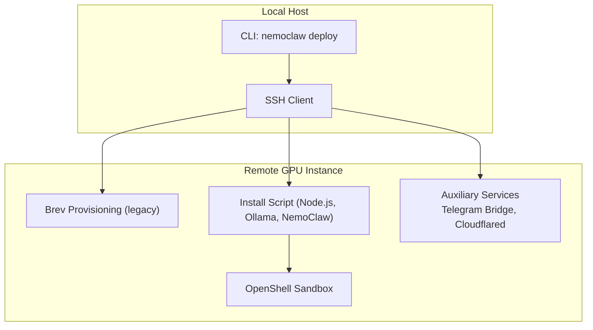
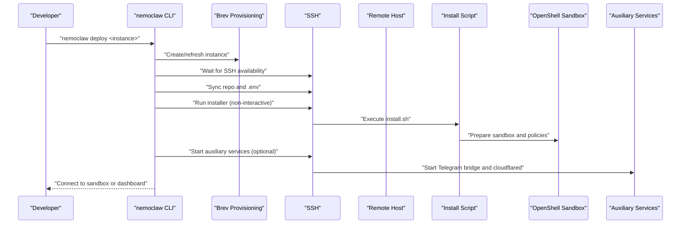
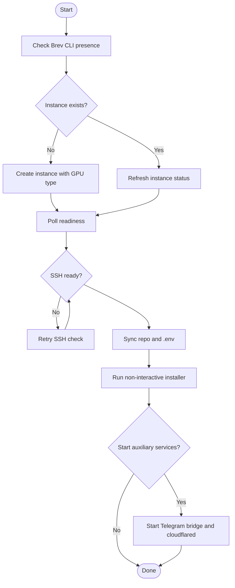
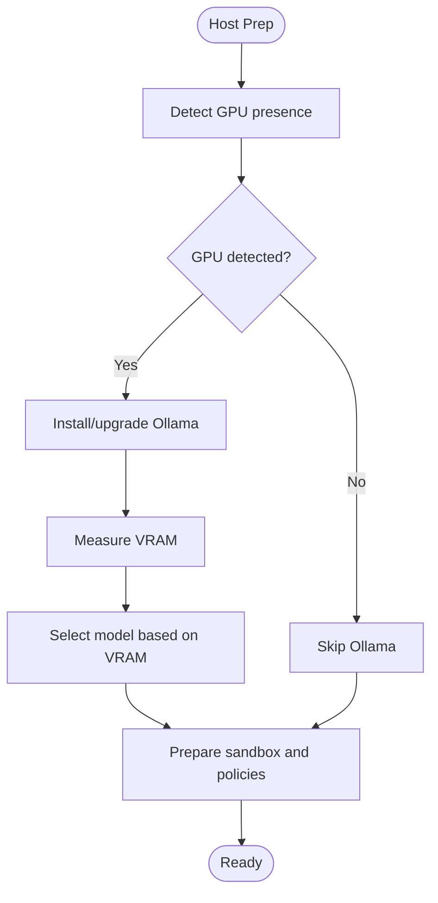
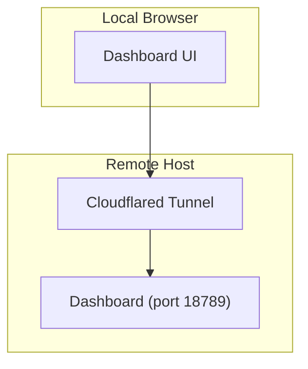
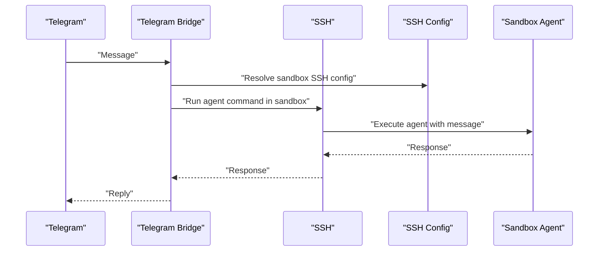
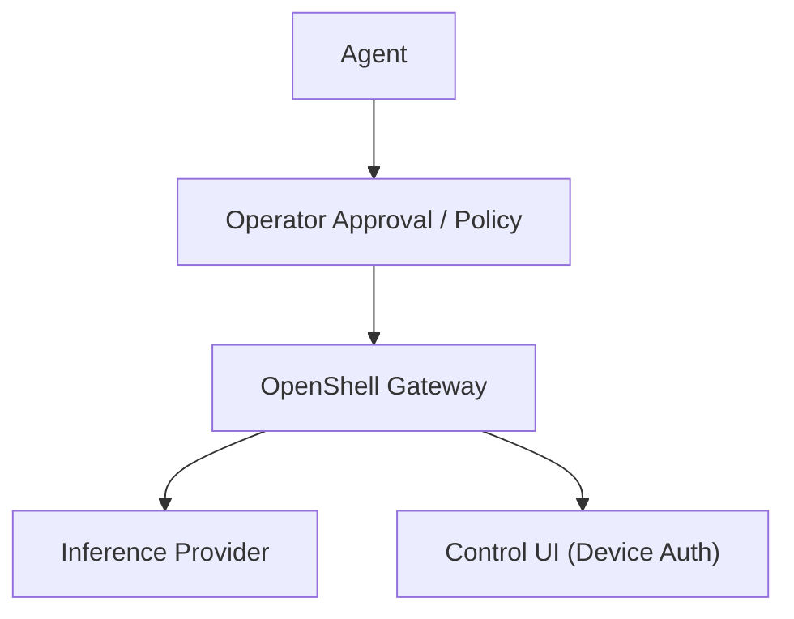
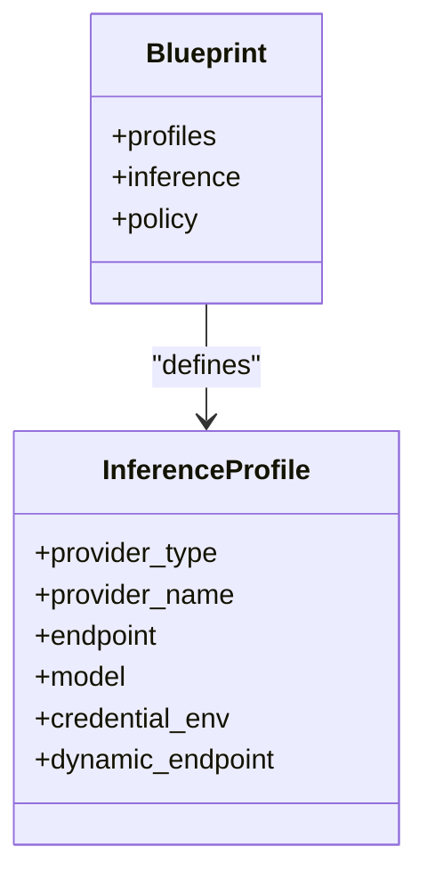
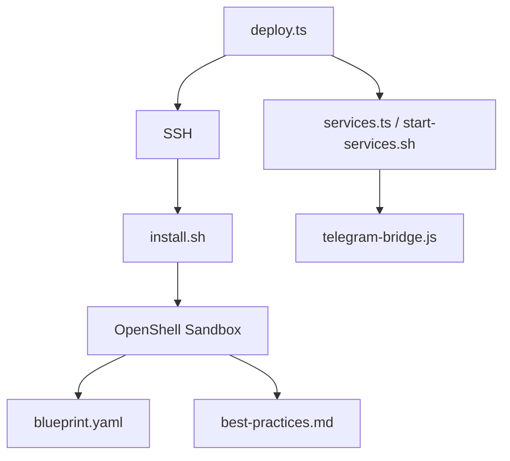

# Remote GPU Deployment

<cite>
**Referenced Files in This Document**
- [deploy-to-remote-gpu.md](file://docs/deployment/deploy-to-remote-gpu.md)
- [deploy.ts](file://src/lib/deploy.ts)
- [runtime.sh](file://scripts/lib/runtime.sh)
- [services.ts](file://src/lib/services.ts)
- [start-services.sh](file://scripts/start-services.sh)
- [install.sh](file://scripts/install.sh)
- [sandbox-hardening.md](file://docs/deployment/sandbox-hardening.md)
- [best-practices.md](file://docs/security/best-practices.md)
- [monitor-sandbox-activity.md](file://docs/monitoring/monitor-sandbox-activity.md)
- [blueprint.yaml](file://nemoclaw-blueprint/blueprint.yaml)
- [telegram-bridge.js](file://scripts/telegram-bridge.js)
- [troubleshooting.md](file://docs/reference/troubleshooting.md)
</cite>

## Table of Contents
1. [Introduction](#introduction)
2. [Project Structure](#project-structure)
3. [Core Components](#core-components)
4. [Architecture Overview](#architecture-overview)
5. [Detailed Component Analysis](#detailed-component-analysis)
6. [Dependency Analysis](#dependency-analysis)
7. [Performance Considerations](#performance-considerations)
8. [Troubleshooting Guide](#troubleshooting-guide)
9. [Conclusion](#conclusion)
10. [Appendices](#appendices)

## Introduction
This document provides a comprehensive guide to deploying and operating NemoClaw on remote GPU instances for distributed inference workloads. It focuses on SSH-based deployment procedures, remote host preparation, GPU resource allocation, network configuration for inference endpoints, secure access via SSH and optional cloudflared tunnels, and operational practices for monitoring and troubleshooting. It synthesizes the repository’s deployment flows, security posture, and operational tooling to support reliable, repeatable, and secure remote GPU setups.

## Project Structure
The repository organizes remote GPU deployment across three primary areas:
- Deployment orchestration and SSH automation for remote provisioning and setup
- Auxiliary services for secure remote access and bridging (Telegram, cloudflared)
- Security and hardening controls that govern sandbox isolation and inference routing

**Diagram sources**
- [deploy.ts:163-397](file://src/lib/deploy.ts#L163-L397)
- [install.sh:583-715](file://scripts/install.sh#L583-L715)
- [start-services.sh:125-206](file://scripts/start-services.sh#L125-L206)

**Section sources**
- [deploy-to-remote-gpu.md:23-135](file://docs/deployment/deploy-to-remote-gpu.md#L23-L135)
- [deploy.ts:163-397](file://src/lib/deploy.ts#L163-L397)
- [install.sh:583-715](file://scripts/install.sh#L583-L715)
- [start-services.sh:125-206](file://scripts/start-services.sh#L125-L206)

## Core Components
- Remote deployment orchestration: The CLI wraps Brev provisioning and automates SSH-based setup, environment propagation, and sandbox initialization.
- Remote host preparation: The installer configures Node.js, optionally installs Ollama for local inference, and prepares the sandbox environment.
- Auxiliary services: Telegram bridge and cloudflared tunneling enable secure remote access and public dashboards.
- Security and hardening: Built-in sandbox controls, inference routing, and device authentication mitigate risk in remote deployments.

**Section sources**
- [deploy.ts:163-397](file://src/lib/deploy.ts#L163-L397)
- [install.sh:583-715](file://scripts/install.sh#L583-L715)
- [services.ts:249-366](file://src/lib/services.ts#L249-L366)
- [best-practices.md:454-510](file://docs/security/best-practices.md#L454-L510)

## Architecture Overview
The remote GPU deployment architecture centers on SSH automation, sandbox isolation, and secure inference routing.

**Diagram sources**
- [deploy.ts:242-397](file://src/lib/deploy.ts#L242-L397)
- [install.sh:583-715](file://scripts/install.sh#L583-L715)
- [start-services.sh:125-206](file://scripts/start-services.sh#L125-L206)

## Detailed Component Analysis

### SSH-Based Deployment Orchestration
- Instance provisioning and readiness: The CLI validates prerequisites, provisions or targets an existing Brev instance, and polls for readiness.
- SSH connectivity: The flow waits for SSH to become available and then synchronizes the repository and environment to the remote host.
- Environment propagation: The CLI generates a temporary environment file with provider credentials and sandbox configuration, securely transferred to the remote host.
- Setup automation: The installer is executed non-interactively, enabling reproducible sandbox creation and policy application.

**Diagram sources**
- [deploy.ts:242-397](file://src/lib/deploy.ts#L242-L397)

**Section sources**
- [deploy.ts:163-397](file://src/lib/deploy.ts#L163-L397)
- [deploy-to-remote-gpu.md:48-112](file://docs/deployment/deploy-to-remote-gpu.md#L48-L112)

### Remote Host Preparation and GPU Resource Allocation
- GPU selection: The deployment respects an environment variable to choose GPU type and count for the remote instance.
- Runtime detection: The installer detects GPUs and, when present, installs and configures Ollama for local inference with model selection based on VRAM.
- Node.js and sandbox prerequisites: The installer ensures a supported Node.js version and prepares the sandbox image and policies.

**Diagram sources**
- [install.sh:642-715](file://scripts/install.sh#L642-L715)
- [deploy-to-remote-gpu.md:119-128](file://docs/deployment/deploy-to-remote-gpu.md#L119-L128)

**Section sources**
- [install.sh:642-715](file://scripts/install.sh#L642-L715)
- [deploy-to-remote-gpu.md:119-128](file://docs/deployment/deploy-to-remote-gpu.md#L119-L128)

### Network Configuration and Secure Access
- Dashboard allowlist: The dashboard origin is validated against an allowlist; for remote access, configure the UI origin before setup.
- SSH-based access: The CLI uses strict SSH options and accepts new host keys for first-time connections.
- Optional cloudflared tunnel: Auxiliary services can expose a public URL via cloudflared when available; otherwise, local SSH port forwarding is recommended.

**Diagram sources**
- [deploy-to-remote-gpu.md:97-117](file://docs/deployment/deploy-to-remote-gpu.md#L97-L117)
- [services.ts:305-334](file://src/lib/services.ts#L305-L334)

**Section sources**
- [deploy-to-remote-gpu.md:97-117](file://docs/deployment/deploy-to-remote-gpu.md#L97-L117)
- [services.ts:305-334](file://src/lib/services.ts#L305-L334)

### Auxiliary Services: Telegram Bridge and Cloudflared
- Telegram bridge: Bridges Telegram messages to the OpenClaw agent inside the sandbox, enforcing rate limits and chat allowlists.
- Cloudflared tunnel: Exposes the dashboard securely via a tunnel URL when available; the service module and script both support this capability.
- Lifecycle management: Services are started/stopped with PID tracking and log rotation.

**Diagram sources**
- [telegram-bridge.js:98-158](file://scripts/telegram-bridge.js#L98-L158)

**Section sources**
- [services.ts:249-366](file://src/lib/services.ts#L249-L366)
- [start-services.sh:125-206](file://scripts/start-services.sh#L125-L206)
- [telegram-bridge.js:98-158](file://scripts/telegram-bridge.js#L98-L158)

### Security Controls for Remote Access
- Device authentication: Enforced by default; can be disabled only at build time and discouraged for remote deployments.
- Insecure auth derivation: Controlled by the UI URL scheme; HTTPS enforces secure auth.
- Network and inference routing: All inference requests are routed through the gateway, keeping provider credentials isolated from the sandbox.
- Sandbox hardening: Process limits, capability dropping, and read-only filesystems reduce blast radius.

**Diagram sources**
- [best-practices.md:412-427](file://docs/security/best-practices.md#L412-L427)

**Section sources**
- [best-practices.md:363-427](file://docs/security/best-practices.md#L363-L427)
- [sandbox-hardening.md:25-91](file://docs/deployment/sandbox-hardening.md#L25-L91)

### Inference Routing and Provider Profiles
- Provider profiles: The blueprint defines default and specialized profiles for NVIDIA endpoints, NIM, and local vLLM, including endpoint URLs and credential handling.
- Dynamic endpoints: Some profiles support dynamic endpoints and environment-driven credentials.

**Diagram sources**
- [blueprint.yaml:26-66](file://nemoclaw-blueprint/blueprint.yaml#L26-L66)

**Section sources**
- [blueprint.yaml:26-66](file://nemoclaw-blueprint/blueprint.yaml#L26-L66)

## Dependency Analysis
The deployment relies on coordinated components across local and remote environments.

**Diagram sources**
- [deploy.ts:163-397](file://src/lib/deploy.ts#L163-L397)
- [install.sh:583-715](file://scripts/install.sh#L583-L715)
- [services.ts:249-366](file://src/lib/services.ts#L249-L366)
- [start-services.sh:125-206](file://scripts/start-services.sh#L125-L206)
- [blueprint.yaml:19-66](file://nemoclaw-blueprint/blueprint.yaml#L19-L66)
- [best-practices.md:25-93](file://docs/security/best-practices.md#L25-L93)

**Section sources**
- [deploy.ts:163-397](file://src/lib/deploy.ts#L163-L397)
- [install.sh:583-715](file://scripts/install.sh#L583-L715)
- [services.ts:249-366](file://src/lib/services.ts#L249-L366)
- [start-services.sh:125-206](file://scripts/start-services.sh#L125-L206)
- [blueprint.yaml:19-66](file://nemoclaw-blueprint/blueprint.yaml#L19-L66)
- [best-practices.md:25-93](file://docs/security/best-practices.md#L25-L93)

## Performance Considerations
- GPU selection: Choose GPU types and counts aligned with workload requirements and model sizes to avoid underprovisioning or wasted capacity.
- Local inference: When using local models (Ollama), ensure sufficient VRAM and consider model size selection to balance latency and throughput.
- Concurrency and rate limiting: The Telegram bridge enforces per-chat cooldowns and serializes requests to prevent overload.
- Monitoring: Use the TUI and logs to identify bottlenecks in network egress, inference latency, or sandbox resource usage.

[No sources needed since this section provides general guidance]

## Troubleshooting Guide
Common issues and remedies:
- SSH connectivity timeouts: The deployment flow retries SSH checks; verify network access and firewall rules.
- Port conflicts: The gateway uses a default port; resolve conflicts by stopping the conflicting process.
- Sandbox state recovery: Reconnect after reboot by ensuring the container runtime and gateway are running, then reconnect to the sandbox.
- Inference failures: Confirm provider endpoint reachability, credentials, and policy approvals.
- Service startup: Use the service status and logs to diagnose auxiliary service issues.

**Section sources**
- [troubleshooting.md:108-121](file://docs/reference/troubleshooting.md#L108-L121)
- [troubleshooting.md:181-229](file://docs/reference/troubleshooting.md#L181-L229)
- [troubleshooting.md:244-277](file://docs/reference/troubleshooting.md#L244-L277)

## Conclusion
This guide consolidates repository-backed practices for deploying NemoClaw on remote GPU instances. By leveraging SSH automation, robust host preparation, secure inference routing, and auxiliary services, teams can operate scalable, secure, and observable distributed inference environments. Adhering to the documented security controls and operational procedures ensures resilient deployments across diverse compute nodes.

[No sources needed since this section summarizes without analyzing specific files]

## Appendices

### Practical Deployment Automation Scripts
- Remote deployment wrapper: Orchestrates Brev provisioning, SSH connectivity, environment propagation, and non-interactive installer execution.
- Service lifecycle: Manages auxiliary services with PID tracking, log rotation, and graceful shutdown.
- Telegram bridge: Provides a secure bridge from Telegram to the sandbox agent with rate limiting and chat allowlists.

**Section sources**
- [deploy.ts:163-397](file://src/lib/deploy.ts#L163-L397)
- [start-services.sh:125-206](file://scripts/start-services.sh#L125-L206)
- [telegram-bridge.js:98-158](file://scripts/telegram-bridge.js#L98-L158)

### Security Considerations
- Device authentication and secure auth derivation
- Network and inference routing through the gateway
- Sandbox hardening controls (capabilities, process limits, filesystem protections)

**Section sources**
- [best-practices.md:363-427](file://docs/security/best-practices.md#L363-L427)
- [sandbox-hardening.md:25-91](file://docs/deployment/sandbox-hardening.md#L25-L91)

### Monitoring and Observability
- Sandbox status, logs, and TUI for tracing agent behavior and network activity
- Auxiliary service status and tunnel URL discovery

**Section sources**
- [monitor-sandbox-activity.md:32-95](file://docs/monitoring/monitor-sandbox-activity.md#L32-L95)
- [services.ts:215-239](file://src/lib/services.ts#L215-L239)