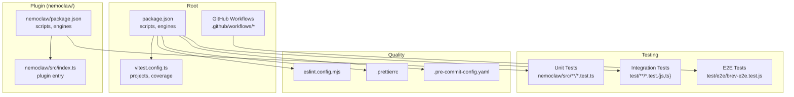
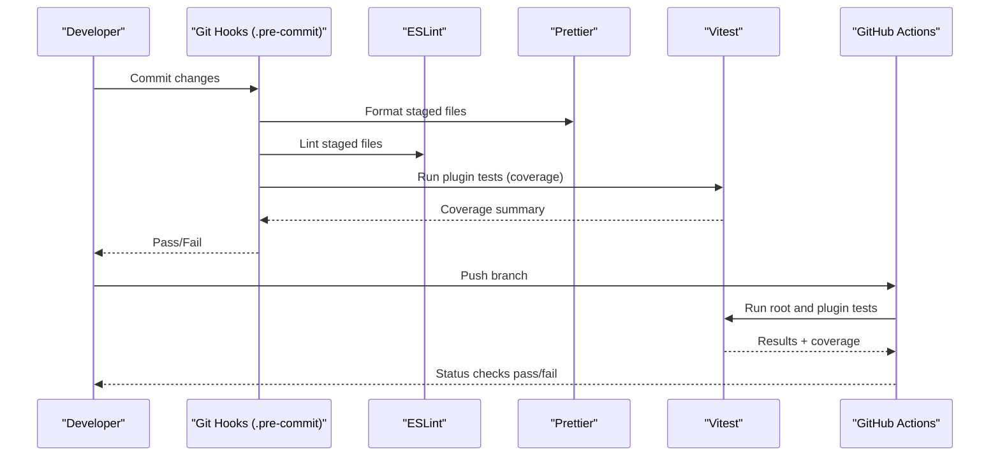
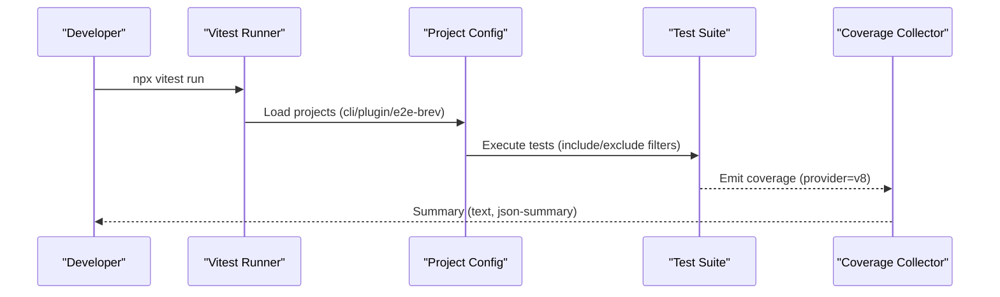
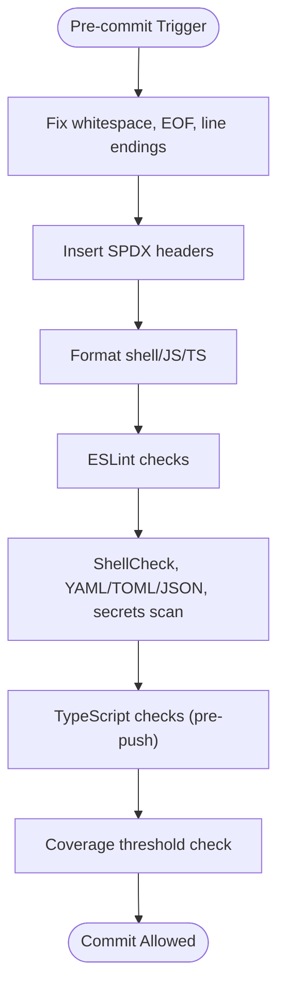
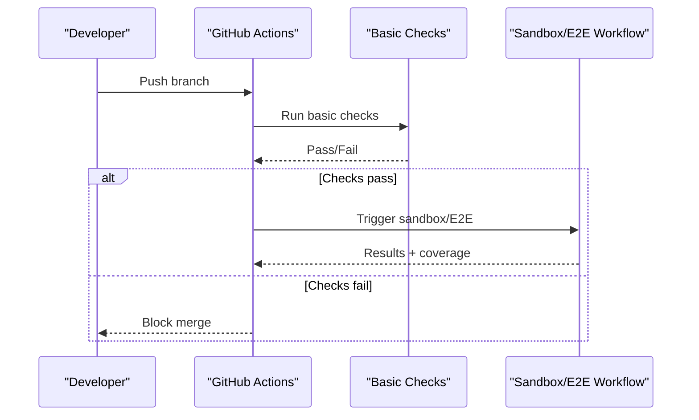
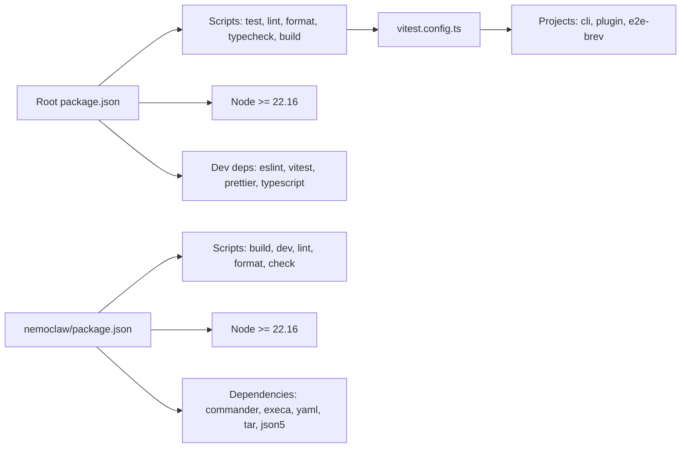

# Development and Testing

<cite>
**Referenced Files in This Document**
- [vitest.config.ts](file://vitest.config.ts)
- [package.json](file://package.json)
- [eslint.config.mjs](file://eslint.config.mjs)
- [.prettierrc](file://.prettierrc)
- [.pre-commit-config.yaml](file://.pre-commit-config.yaml)
- [CONTRIBUTING.md](file://CONTRIBUTING.md)
- [test/e2e/brev-e2e.test.js](file://test/e2e/brev-e2e.test.js)
- [test/cli.test.js](file://test/cli.test.js)
- [.github/workflows/main.yaml](file://.github/workflows/main.yaml)
- [nemoclaw/src/index.ts](file://nemoclaw/src/index.ts)
- [nemoclaw/package.json](file://nemoclaw/package.json)
</cite>

## Table of Contents
1. [Introduction](#introduction)
2. [Project Structure](#project-structure)
3. [Core Components](#core-components)
4. [Architecture Overview](#architecture-overview)
5. [Detailed Component Analysis](#detailed-component-analysis)
6. [Dependency Analysis](#dependency-analysis)
7. [Performance Considerations](#performance-considerations)
8. [Troubleshooting Guide](#troubleshooting-guide)
9. [Conclusion](#conclusion)
10. [Appendices](#appendices)

## Introduction
This document provides a comprehensive guide to setting up NemoClaw’s development environment and executing quality assurance processes. It covers environment prerequisites, Node.js and dependency management, IDE configuration tips, the testing framework with Vitest (unit, integration, and E2E), code quality tooling (ESLint, Prettier, pre-commit hooks), contribution guidelines, pull request workflow, debugging failing tests, maintaining coverage, continuous integration pipelines, and release-related quality gates.

## Project Structure
NemoClaw is a multi-package repository with:
- Root package managing CLI, scripts, tests, and shared tooling
- A TypeScript plugin under nemoclaw/ that integrates with OpenClaw/OpenShell
- A dedicated test suite under test/ with unit, integration, and E2E tests
- GitHub Actions workflows orchestrating CI checks and E2E jobs
- Pre-commit hooks enforcing formatting, linting, and coverage thresholds

**Diagram sources**
- [package.json:1-60](file://package.json#L1-L60)
- [vitest.config.ts:1-39](file://vitest.config.ts#L1-L39)
- [nemoclaw/package.json:1-49](file://nemoclaw/package.json#L1-L49)
- [nemoclaw/src/index.ts:1-266](file://nemoclaw/src/index.ts#L1-L266)
- [test/e2e/brev-e2e.test.js:1-672](file://test/e2e/brev-e2e.test.js#L1-L672)
- [eslint.config.mjs:1-104](file://eslint.config.mjs#L1-L104)
- [.prettierrc:1-8](file://.prettierrc#L1-L8)
- [.pre-commit-config.yaml:1-248](file://.pre-commit-config.yaml#L1-L248)
- [.github/workflows/main.yaml:1-37](file://.github/workflows/main.yaml#L1-L37)

**Section sources**
- [package.json:1-60](file://package.json#L1-L60)
- [CONTRIBUTING.md:23-36](file://CONTRIBUTING.md#L23-L36)

## Core Components
- Development environment prerequisites:
  - Node.js 22.16+ and npm 10+
  - Python 3.11+ (blueprint and docs)
  - Docker (running)
  - uv (Python dependency management)
  - hadolint (Dockerfile linter)
- Dependency management:
  - Root package manages Node.js scripts, engines, and devDependencies
  - Plugin package defines its own scripts, engines, and TypeScript build pipeline
- IDE configuration:
  - TypeScript projects configured via tsconfig files
  - ESLint and Prettier applied per-language scopes
  - Pre-commit hooks automate formatting and linting

**Section sources**
- [CONTRIBUTING.md:13-22](file://CONTRIBUTING.md#L13-L22)
- [package.json:38-40](file://package.json#L38-L40)
- [nemoclaw/package.json:41-43](file://nemoclaw/package.json#L41-L43)

## Architecture Overview
The development and QA architecture centers around:
- Vitest projects for unit, CLI integration, and E2E testing
- Pre-commit hooks enforcing code quality and coverage thresholds
- GitHub Actions workflows gating merges and running E2E suites
- Plugin architecture that registers commands/providers/services into OpenClaw/OpenShell

**Diagram sources**
- [.pre-commit-config.yaml:225-242](file://.pre-commit-config.yaml#L225-L242)
- [vitest.config.ts:6-38](file://vitest.config.ts#L6-L38)
- [.github/workflows/main.yaml:24-37](file://.github/workflows/main.yaml#L24-L37)

## Detailed Component Analysis

### Development Environment Setup
- Prerequisites and installation:
  - Install root dependencies, build the TypeScript plugin, and sync Python dependencies for blueprints
- Building:
  - Plugin: build/watch modes via tsc
  - CLI: separate type-checking via tsconfig.cli.json
- IDE tips:
  - Configure TypeScript projects for both root and plugin
  - Enable ESLint and Prettier integrations in your editor
  - Use pre-commit hooks to auto-format and lint before commits

**Section sources**
- [CONTRIBUTING.md:23-53](file://CONTRIBUTING.md#L23-L53)
- [package.json:9-19](file://package.json#L9-L19)
- [nemoclaw/package.json:14-22](file://nemoclaw/package.json#L14-L22)

### Testing Framework with Vitest
- Projects and coverage:
  - Three Vitest projects: cli, plugin, e2e-brev
  - Coverage configured for plugin sources, with reporters and include/exclude rules
- Unit tests (plugin):
  - Located under nemoclaw/src/**/*.test.ts
  - Example: command handling, onboard configuration, and provider registration
- Integration tests (CLI):
  - Located under test/**/*.test.{js,ts}
  - Example: CLI argument parsing, sandbox lifecycle, and gateway behavior
- E2E tests:
  - Remote E2E via Brev cloud instances
  - Requires environment variables and optional test suite selection
  - Bootstraps a fresh instance, syncs branch code, installs dependencies, builds plugin, runs onboard, and executes test scripts

**Diagram sources**
- [vitest.config.ts:6-38](file://vitest.config.ts#L6-L38)

**Section sources**
- [vitest.config.ts:6-38](file://vitest.config.ts#L6-L38)
- [nemoclaw/src/index.ts:237-265](file://nemoclaw/src/index.ts#L237-L265)
- [test/cli.test.js:1-120](file://test/cli.test.js#L1-L120)
- [test/e2e/brev-e2e.test.js:1-120](file://test/e2e/brev-e2e.test.js#L1-L120)

### Code Quality Tools
- ESLint:
  - Recommended rules with complexity limits and unused variable allowances
  - Separate configs for bin/scripts (CommonJS), test (ESM), and docs (browser globals)
- Prettier:
  - Standardized formatting rules for semicolons, quotes, trailing commas, print width, and tab width
- Pre-commit hooks:
  - File fixers, SPDX header insertion, shfmt, Prettier, ESLint, ShellCheck, gitleaks, markdownlint
  - TypeScript type checks on pre-push
  - Coverage thresholds enforced via check-coverage-ratchet.ts

**Diagram sources**
- [.pre-commit-config.yaml:34-242](file://.pre-commit-config.yaml#L34-L242)
- [eslint.config.mjs:16-103](file://eslint.config.mjs#L16-L103)
- [.prettierrc:1-8](file://.prettierrc#L1-L8)

**Section sources**
- [eslint.config.mjs:16-103](file://eslint.config.mjs#L16-L103)
- [.prettierrc:1-8](file://.prettierrc#L1-L8)
- [.pre-commit-config.yaml:1-248](file://.pre-commit-config.yaml#L1-L248)

### Contributing Code and Pull Requests
- Workflow:
  - Create feature branch from main
  - Add tests for your changes
  - Run make check and npm test locally
  - Open a PR
- Commit messages:
  - Conventional Commits format with allowed types
- Limits:
  - Keep fewer than 10 open PRs at a time

**Section sources**
- [CONTRIBUTING.md:168-225](file://CONTRIBUTING.md#L168-L225)

### Practical Examples

#### Writing Unit Tests (Plugin)
- Example patterns:
  - Command registration and handler invocation
  - Provider registration with model catalogs and auth methods
  - Plugin configuration resolution and defaults
- Reference paths:
  - [nemoclaw/src/index.ts:237-265](file://nemoclaw/src/index.ts#L237-L265)

**Section sources**
- [nemoclaw/src/index.ts:237-265](file://nemoclaw/src/index.ts#L237-L265)

#### Writing Integration Tests (CLI)
- Example patterns:
  - CLI argument parsing and help output
  - Sandbox lifecycle (create, list, logs, connect, destroy)
  - Gateway runtime behavior and registry cleanup
- Reference paths:
  - [test/cli.test.js:35-120](file://test/cli.test.js#L35-L120)
  - [test/cli.test.js:233-294](file://test/cli.test.js#L233-L294)

**Section sources**
- [test/cli.test.js:35-120](file://test/cli.test.js#L35-L120)
- [test/cli.test.js:233-294](file://test/cli.test.js#L233-L294)

#### Debugging Failing Tests
- Strategies:
  - Run targeted projects: vitest run --project plugin or vitest run --project cli
  - Increase timeouts for long-running tests
  - Inspect coverage reports and adjust include/exclude patterns
  - For E2E, verify environment variables and instance provisioning logs
- Reference paths:
  - [vitest.config.ts:6-38](file://vitest.config.ts#L6-L38)
  - [test/e2e/brev-e2e.test.js:13-28](file://test/e2e/brev-e2e.test.js#L13-L28)

**Section sources**
- [vitest.config.ts:6-38](file://vitest.config.ts#L6-L38)
- [test/e2e/brev-e2e.test.js:13-28](file://test/e2e/brev-e2e.test.js#L13-L28)

#### Maintaining Test Coverage
- Coverage configuration:
  - Provider: v8
  - Include plugin sources, exclude test files
  - Reporters: text and json-summary
- Threshold enforcement:
  - Pre-commit hooks run check-coverage-ratchet.ts against ci/coverage-threshold-*.json
- Reference paths:
  - [vitest.config.ts:31-36](file://vitest.config.ts#L31-L36)
  - [.pre-commit-config.yaml:225-242](file://.pre-commit-config.yaml#L225-L242)
  - [ci/coverage-threshold-plugin.json](file://ci/coverage-threshold-plugin.json)
  - [ci/coverage-threshold-cli.json](file://ci/coverage-threshold-cli.json)

**Section sources**
- [vitest.config.ts:31-36](file://vitest.config.ts#L31-L36)
- [.pre-commit-config.yaml:225-242](file://.pre-commit-config.yaml#L225-L242)

### Continuous Integration and Quality Gates
- Main workflow:
  - Runs basic checks on pushes to main
  - Delegates sandbox image and E2E jobs to reusable workflow
- E2E pipeline:
  - Remote Brev instances provisioned and tested
  - Coverage thresholds validated in CI via pre-commit hooks
- Quality gates:
  - Pre-commit hooks enforce formatting, linting, type checks, and coverage
  - GitHub Actions gate PRs with status checks

**Diagram sources**
- [.github/workflows/main.yaml:24-37](file://.github/workflows/main.yaml#L24-L37)

**Section sources**
- [.github/workflows/main.yaml:1-37](file://.github/workflows/main.yaml#L1-L37)
- [test/e2e/brev-e2e.test.js:1-28](file://test/e2e/brev-e2e.test.js#L1-L28)

## Dependency Analysis
- Root package dependencies:
  - Node engine requirement and devDependencies for linting, formatting, and testing
  - Scripts for building CLI, type-checking, and preparing hooks
- Plugin package dependencies:
  - TypeScript-based build and watch scripts
  - ESLint/Prettier scripts for code quality
- Coupling and cohesion:
  - Plugin tests are isolated in the plugin project
  - CLI integration tests are isolated in the root project
  - E2E tests are gated behind environment variables and run as a separate project

**Diagram sources**
- [package.json:9-58](file://package.json#L9-L58)
- [nemoclaw/package.json:14-40](file://nemoclaw/package.json#L14-L40)
- [vitest.config.ts:6-38](file://vitest.config.ts#L6-L38)

**Section sources**
- [package.json:9-58](file://package.json#L9-L58)
- [nemoclaw/package.json:14-40](file://nemoclaw/package.json#L14-L40)
- [vitest.config.ts:6-38](file://vitest.config.ts#L6-L38)

## Performance Considerations
- Prefer running targeted Vitest projects to reduce overhead
- Use watch mode for iterative plugin development
- Keep pre-commit hook priorities balanced to minimize latency
- Cache dependencies and build artifacts in CI to speed up workflows

## Troubleshooting Guide
- Node.js version mismatch:
  - Ensure Node.js >= 22.16 and npm 10+ are installed
- Pre-commit hook failures:
  - Run npx prek run --all-files to diagnose issues
  - Check SPDX headers, formatting, and type-checks
- E2E provisioning issues:
  - Verify Brev authentication and required environment variables
  - Confirm instance name uniqueness and provider filters
- Coverage thresholds:
  - Review coverage reports and adjust include/exclude patterns if needed

**Section sources**
- [CONTRIBUTING.md:13-22](file://CONTRIBUTING.md#L13-L22)
- [.pre-commit-config.yaml:13-14](file://.pre-commit-config.yaml#L13-L14)
- [test/e2e/brev-e2e.test.js:13-28](file://test/e2e/brev-e2e.test.js#L13-L28)

## Conclusion
NemoClaw’s development and testing ecosystem emphasizes reproducible environments, strong code quality, and robust CI. By following the setup instructions, adhering to contribution guidelines, leveraging Vitest projects, and enforcing quality gates via pre-commit hooks and GitHub Actions, contributors can efficiently develop, test, and ship changes with confidence.

## Appendices
- Quick commands:
  - Install root and plugin dependencies, build plugin, type-check CLI
  - Run all checks and tests locally
  - Prepare pre-commit hooks and run them manually

**Section sources**
- [CONTRIBUTING.md:25-68](file://CONTRIBUTING.md#L25-L68)
- [package.json:9-19](file://package.json#L9-L19)
- [.pre-commit-config.yaml:70-82](file://.pre-commit-config.yaml#L70-L82)