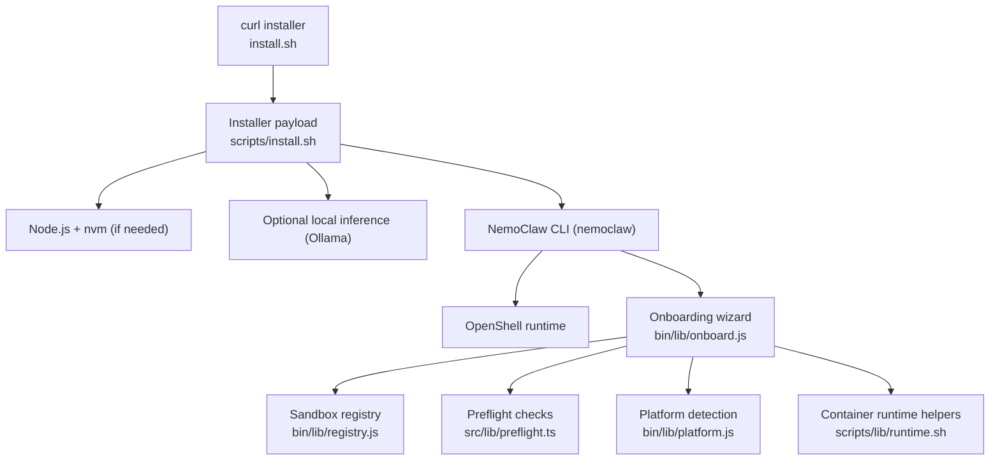
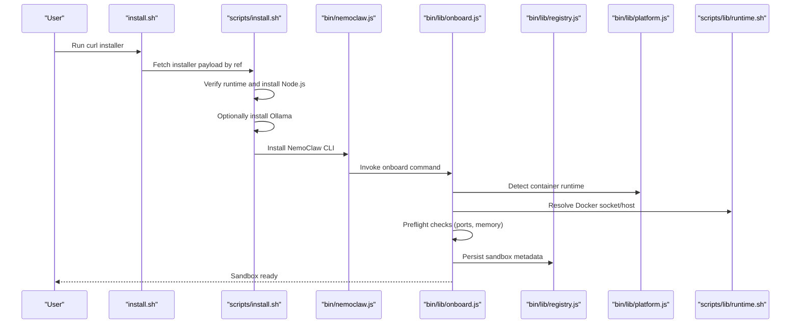
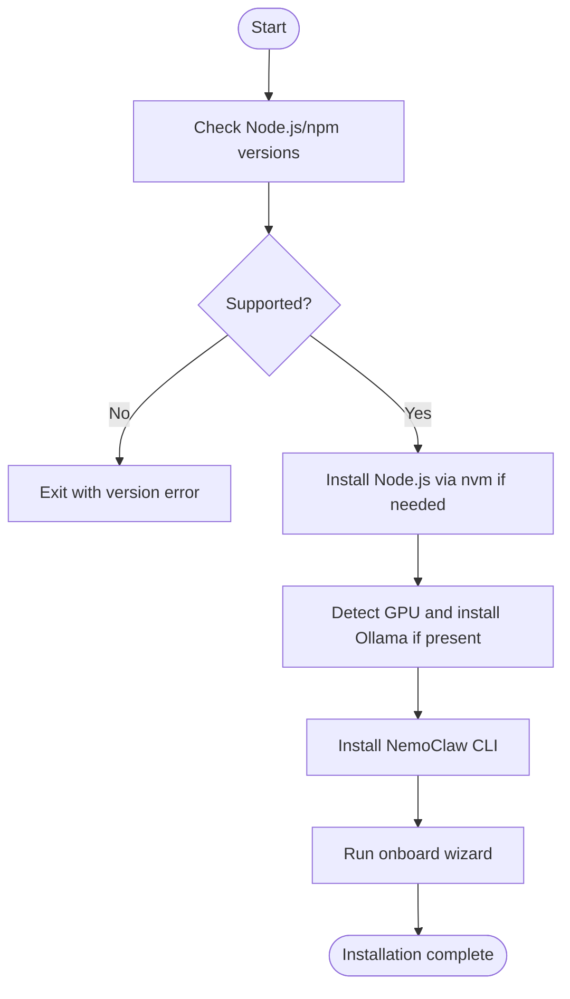
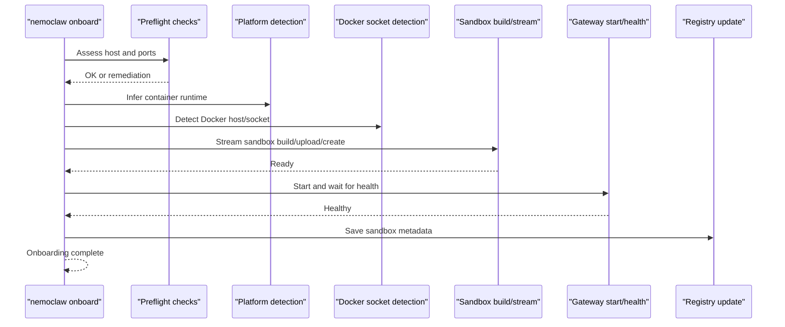
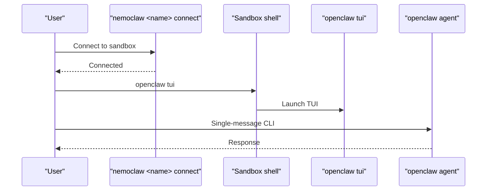
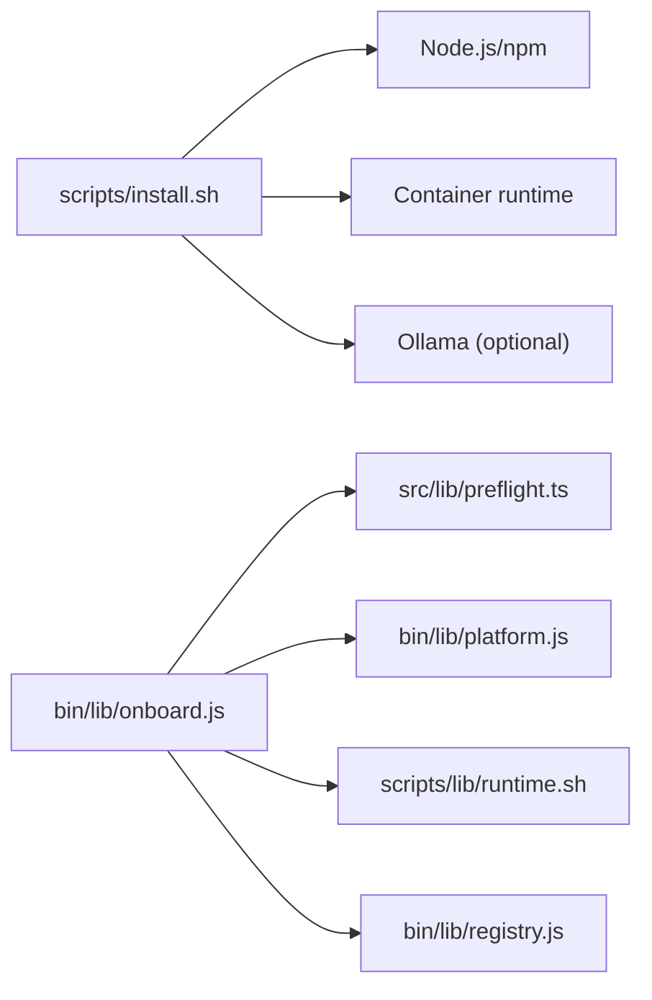

# Getting Started

<cite>
**Referenced Files in This Document**
- [README.md](file://README.md)
- [quickstart.md](file://docs/get-started/quickstart.md)
- [install.sh](file://install.sh)
- [scripts/install.sh](file://scripts/install.sh)
- [bin/nemoclaw.js](file://bin/nemoclaw.js)
- [bin/lib/onboard.js](file://bin/lib/onboard.js)
- [bin/lib/platform.js](file://bin/lib/platform.js)
- [scripts/lib/runtime.sh](file://scripts/lib/runtime.sh)
- [src/lib/preflight.ts](file://src/lib/preflight.ts)
- [bin/lib/runner.js](file://bin/lib/runner.js)
- [bin/lib/registry.js](file://bin/lib/registry.js)
- [troubleshooting.md](file://docs/reference/troubleshooting.md)
- [smoke-macos-install.sh](file://scripts/smoke-macos-install.sh)
</cite>

## Table of Contents
1. [Introduction](#introduction)
2. [Project Structure](#project-structure)
3. [Core Components](#core-components)
4. [Architecture Overview](#architecture-overview)
5. [Detailed Component Analysis](#detailed-component-analysis)
6. [Dependency Analysis](#dependency-analysis)
7. [Performance Considerations](#performance-considerations)
8. [Troubleshooting Guide](#troubleshooting-guide)
9. [Conclusion](#conclusion)
10. [Appendices](#appendices)

## Introduction
This guide helps you install NemoClaw, onboard your first sandboxed OpenClaw assistant, and connect to it via TUI or CLI. It consolidates prerequisites, installation steps, onboarding flow, and first-time usage patterns, with troubleshooting guidance for common setup issues.

## Project Structure
NemoClaw provides:
- A thin bootstrap installer that fetches the proper installer payload from a pinned Git ref
- An installer that validates prerequisites, installs Node.js and optional local inference, then runs the guided onboarding wizard
- A CLI that orchestrates OpenShell, sandboxes, and OpenClaw gateway lifecycle
- Onboarding logic that creates a sandbox, configures inference, and applies security policies
- Documentation and troubleshooting references

**Diagram sources**
- [install.sh:1-121](file://install.sh#L1-L121)
- [scripts/install.sh:1-800](file://scripts/install.sh#L1-L800)
- [bin/nemoclaw.js:780-796](file://bin/nemoclaw.js#L780-L796)
- [bin/lib/onboard.js:1-800](file://bin/lib/onboard.js#L1-L800)
- [bin/lib/registry.js:1-263](file://bin/lib/registry.js#L1-L263)
- [src/lib/preflight.ts:1-200](file://src/lib/preflight.ts#L1-L200)
- [bin/lib/platform.js:1-108](file://bin/lib/platform.js#L1-L108)
- [scripts/lib/runtime.sh:1-229](file://scripts/lib/runtime.sh#L1-L229)

**Section sources**
- [README.md:25-132](file://README.md#L25-L132)
- [quickstart.md:32-146](file://docs/get-started/quickstart.md#L32-L146)

## Core Components
- Bootstrap installer: selects a Git ref, downloads the payload, and executes the installer logic
- Installer payload: verifies runtime, installs Node.js and optional local inference, then runs onboarding
- Onboarding wizard: guides you through sandbox creation, inference configuration, and policy application
- CLI: wraps OpenShell commands, manages registry, and recovers sandbox/gateway state
- Preflight checks: validates ports, memory, and remediations
- Platform/runtime helpers: detect container runtimes and Docker sockets

**Section sources**
- [install.sh:17-121](file://install.sh#L17-L121)
- [scripts/install.sh:560-800](file://scripts/install.sh#L560-L800)
- [bin/lib/onboard.js:1-800](file://bin/lib/onboard.js#L1-L800)
- [bin/nemoclaw.js:780-796](file://bin/nemoclaw.js#L780-L796)
- [src/lib/preflight.ts:86-130](file://src/lib/preflight.ts#L86-L130)
- [bin/lib/platform.js:23-107](file://bin/lib/platform.js#L23-L107)
- [scripts/lib/runtime.sh:45-104](file://scripts/lib/runtime.sh#L45-L104)

## Architecture Overview
High-level flow from installation to a running sandboxed agent:

**Diagram sources**
- [install.sh:90-121](file://install.sh#L90-L121)
- [scripts/install.sh:560-800](file://scripts/install.sh#L560-L800)
- [bin/nemoclaw.js:780-796](file://bin/nemoclaw.js#L780-L796)
- [bin/lib/onboard.js:1-800](file://bin/lib/onboard.js#L1-L800)
- [bin/lib/registry.js:154-203](file://bin/lib/registry.js#L154-L203)
- [bin/lib/platform.js:74-96](file://bin/lib/platform.js#L74-L96)
- [scripts/lib/runtime.sh:45-84](file://scripts/lib/runtime.sh#L45-L84)

## Detailed Component Analysis

### Prerequisites and Platform Support
- Hardware: minimum CPU, RAM, and disk; sandbox image size and memory pressure notes
- Software: supported Linux, Node.js and npm versions, container runtime, and OpenShell
- Container runtimes per platform: Docker (primary), Colima/Docker Desktop (macOS), Docker Desktop (Intel macOS), Docker (Windows WSL), Docker (DGX Spark)

**Section sources**
- [README.md:31-64](file://README.md#L31-L64)
- [quickstart.md:34-67](file://docs/get-started/quickstart.md#L34-L67)

### Installation via Curl Installer
- Download and run the installer script; it installs Node.js if needed, then runs the guided onboarding wizard
- If using nvm/fnm, the installer may not update your current shell’s PATH; source your shell profile or open a new terminal

**Diagram sources**
- [scripts/install.sh:560-800](file://scripts/install.sh#L560-L800)
- [scripts/install.sh:635-715](file://scripts/install.sh#L635-L715)
- [README.md:70-82](file://README.md#L70-L82)

**Section sources**
- [install.sh:69-88](file://install.sh#L69-L88)
- [scripts/install.sh:560-800](file://scripts/install.sh#L560-L800)
- [README.md:65-95](file://README.md#L65-L95)

### Guided Onboarding Wizard
The wizard performs:
- Preflight checks (ports, memory, swap)
- Sandbox creation with progress streaming
- Gateway cluster start with health checks
- Inference provider selection and validation
- Policy application and registry updates

**Diagram sources**
- [bin/lib/onboard.js:236-440](file://bin/lib/onboard.js#L236-L440)
- [bin/lib/onboard.js:442-565](file://bin/lib/onboard.js#L442-L565)
- [src/lib/preflight.ts:86-130](file://src/lib/preflight.ts#L86-L130)
- [bin/lib/platform.js:74-96](file://bin/lib/platform.js#L74-L96)
- [scripts/lib/runtime.sh:45-84](file://scripts/lib/runtime.sh#L45-L84)
- [bin/lib/registry.js:171-189](file://bin/lib/registry.js#L171-L189)

**Section sources**
- [bin/lib/onboard.js:1-800](file://bin/lib/onboard.js#L1-L800)
- [src/lib/preflight.ts:1-200](file://src/lib/preflight.ts#L1-L200)
- [bin/lib/platform.js:1-108](file://bin/lib/platform.js#L1-L108)
- [scripts/lib/runtime.sh:1-229](file://scripts/lib/runtime.sh#L1-L229)
- [bin/lib/registry.js:154-203](file://bin/lib/registry.js#L154-L203)

### First-Time User Workflows
- Connect to the sandbox and chat via TUI or CLI
- Typical commands: connect to sandbox, open TUI, or send a single-message CLI request

**Diagram sources**
- [README.md:96-115](file://README.md#L96-L115)
- [quickstart.md:99-118](file://docs/get-started/quickstart.md#L99-L118)

**Section sources**
- [README.md:96-115](file://README.md#L96-L115)
- [quickstart.md:99-118](file://docs/get-started/quickstart.md#L99-L118)

### Verification and PATH Configuration
- After installation, the installer prints next steps; if using nvm/fnm, source your shell profile or open a new terminal
- The installer ensures PATH includes user-local bins and adds a marker to your shell profile for persistence

**Section sources**
- [scripts/install.sh:488-554](file://scripts/install.sh#L488-L554)
- [README.md:78-82](file://README.md#L78-L82)

## Dependency Analysis
- Installer depends on:
  - Git to fetch the payload by ref
  - Node.js/npm for the CLI and onboarding
  - Container runtime (Docker/Colima/Docker Desktop) for sandbox creation
  - Optional Ollama for local inference on GPU-enabled hosts
- Onboarding depends on:
  - Preflight checks for ports/memory
  - Platform detection and Docker socket resolution
  - Registry for persistent sandbox metadata

**Diagram sources**
- [scripts/install.sh:560-800](file://scripts/install.sh#L560-L800)
- [bin/lib/onboard.js:1-800](file://bin/lib/onboard.js#L1-L800)
- [src/lib/preflight.ts:1-200](file://src/lib/preflight.ts#L1-L200)
- [bin/lib/platform.js:1-108](file://bin/lib/platform.js#L1-L108)
- [scripts/lib/runtime.sh:1-229](file://scripts/lib/runtime.sh#L1-L229)
- [bin/lib/registry.js:1-263](file://bin/lib/registry.js#L1-L263)

**Section sources**
- [scripts/install.sh:560-800](file://scripts/install.sh#L560-L800)
- [bin/lib/onboard.js:1-800](file://bin/lib/onboard.js#L1-L800)
- [src/lib/preflight.ts:1-200](file://src/lib/preflight.ts#L1-L200)
- [bin/lib/platform.js:1-108](file://bin/lib/platform.js#L1-L108)
- [scripts/lib/runtime.sh:1-229](file://scripts/lib/runtime.sh#L1-L229)
- [bin/lib/registry.js:1-263](file://bin/lib/registry.js#L1-L263)

## Performance Considerations
- Memory pressure during sandbox image push can trigger OOM on low-RAM systems; configure swap as a workaround
- On macOS, ensure Xcode command line tools and a running container runtime before installing

**Section sources**
- [README.md:43-44](file://README.md#L43-L44)
- [troubleshooting.md:69-74](file://docs/reference/troubleshooting.md#L69-L74)
- [troubleshooting.md:86-94](file://docs/reference/troubleshooting.md#L86-L94)

## Troubleshooting Guide
Common issues and resolutions:
- `nemoclaw` not found after install: source your shell profile or open a new terminal
- Unsupported platform or old Node.js version: install a supported Node.js version
- Image push OOM: add swap to avoid OOM killer
- Docker not running: start the Docker daemon or open Docker Desktop/Colima
- Port 18789 in use: identify and stop the conflicting process
- Cgroup v2 or Podman issues: use Docker Desktop/Colima or Docker Engine
- Colima socket not detected: verify Colima is running and check both legacy and modern socket paths
- Sandbox creation killed by OOM: create swap before retrying onboarding
- Reconnect after reboot: start runtime, check sandbox state, restart gateway if needed, then reconnect

**Section sources**
- [troubleshooting.md:35-137](file://docs/reference/troubleshooting.md#L35-L137)
- [troubleshooting.md:179-277](file://docs/reference/troubleshooting.md#L179-L277)

## Conclusion
You are now ready to install NemoClaw, onboard your first sandbox, and interact with your assistant via TUI or CLI. Use the troubleshooting guide for common setup issues and verify your installation by connecting to the sandbox and running a simple chat.

## Appendices

### Step-by-Step Installation
- Prerequisites: Linux Ubuntu 22.04+, Node.js 22.16+, npm 10+, container runtime, OpenShell
- Run the installer: curl -fsSL https://www.nvidia.com/nemoclaw.sh | bash
- If using nvm/fnm, source your shell profile or open a new terminal
- On completion, follow the printed next steps to onboard and connect

**Section sources**
- [README.md:31-95](file://README.md#L31-L95)
- [quickstart.md:68-98](file://docs/get-started/quickstart.md#L68-L98)

### First-Time Usage Examples
- Connect to sandbox: nemoclaw <name> connect
- Open TUI: openclaw tui
- Single-message CLI: openclaw agent --agent main --local -m "hello" --session-id test

**Section sources**
- [README.md:96-115](file://README.md#L96-L115)
- [quickstart.md:99-118](file://docs/get-started/quickstart.md#L99-L118)

### Platform-Specific Notes
- macOS: install Xcode command line tools and start Docker Desktop or Colima before running the installer
- Windows WSL: Docker Desktop (WSL backend) is supported
- DGX Spark: Docker is supported; use the standard installer and `nemoclaw onboard`

**Section sources**
- [README.md:55-64](file://README.md#L55-L64)
- [quickstart.md:58-67](file://docs/get-started/quickstart.md#L58-L67)

### Installer Environment Variables and Options
- Options: --non-interactive, --yes-i-accept-third-party-software, --version, --help
- Environment variables: NEMOCLAW_INSTALL_TAG, NEMOCLAW_NON_INTERACTIVE, NEMOCLAW_ACCEPT_THIRD_PARTY_SOFTWARE, NEMOCLAW_SANDBOX_NAME, NEMOCLAW_PROVIDER, NEMOCLAW_POLICY_MODE, NVIDIA_API_KEY, BRAVE_API_KEY, DISCORD_BOT_TOKEN, SLACK_BOT_TOKEN, TELEGRAM_BOT_TOKEN

**Section sources**
- [install.sh:69-88](file://install.sh#L69-L88)
- [scripts/install.sh:251-282](file://scripts/install.sh#L251-L282)

### Onboarding Environment Variables and Options
- Options: --non-interactive, --resume, third-party software acceptance flag
- Environment variables: NEMOCLAW_NON_INTERACTIVE, NEMOCLAW_SANDBOX_NAME, NEMOCLAW_RECREATE_SANDBOX, NEMOCLAW_PROVIDER, NEMOCLAW_MODEL, NEMOCLAW_POLICY_MODE, NEMOCLAW_POLICY_PRESETS

**Section sources**
- [bin/nemoclaw.js:780-796](file://bin/nemoclaw.js#L780-L796)
- [scripts/install.sh:251-282](file://scripts/install.sh#L251-L282)

### Smoke Test for macOS
- Validates install/uninstall flow, logs, and cleanup; useful for manual smoke validation

**Section sources**
- [smoke-macos-install.sh:1-322](file://scripts/smoke-macos-install.sh#L1-L322)