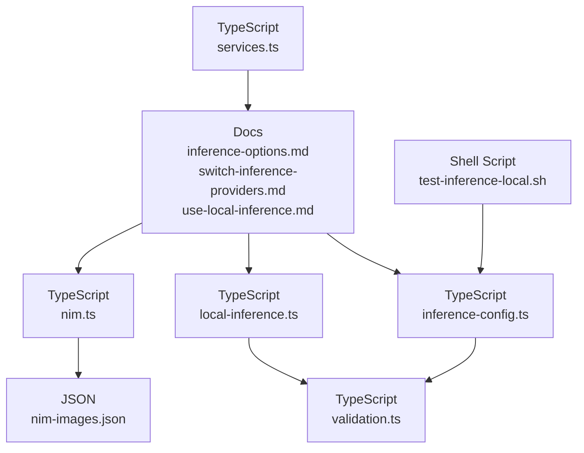
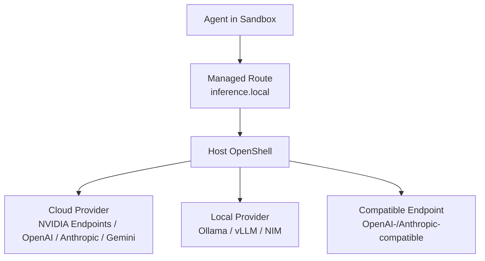
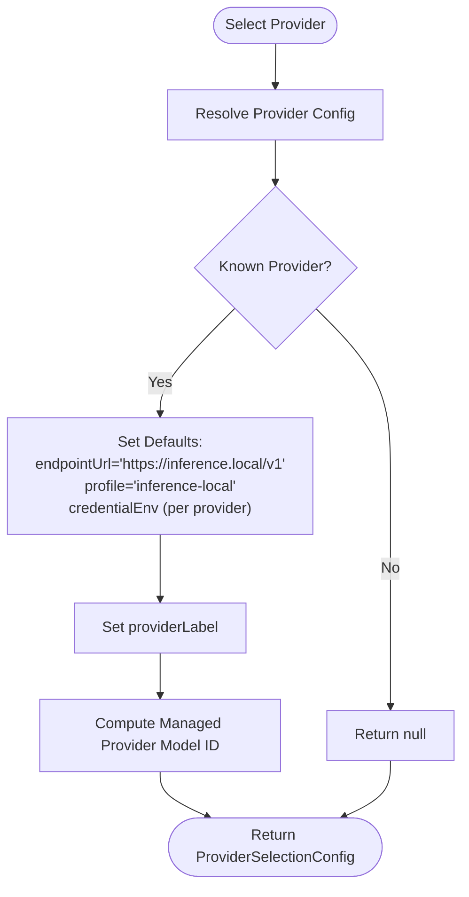
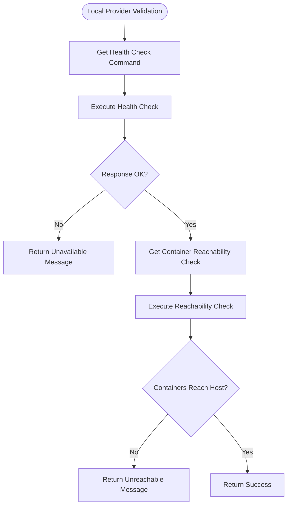
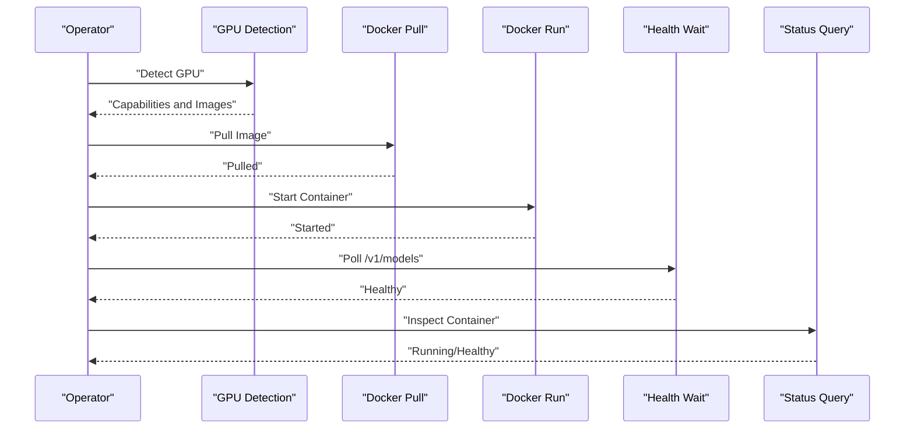
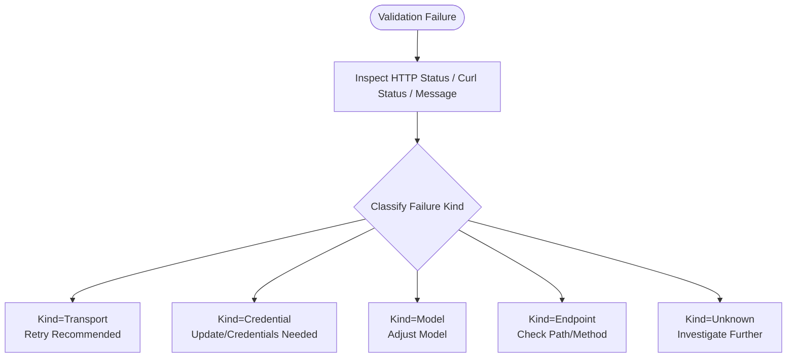
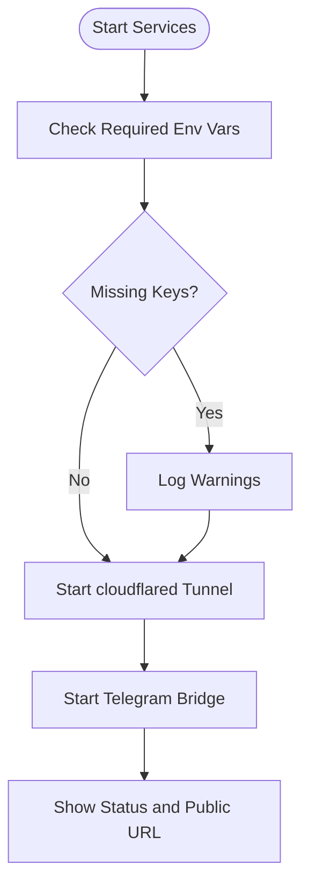
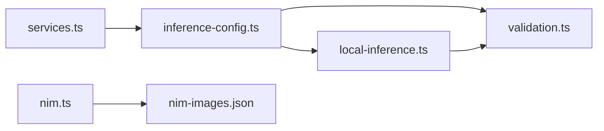

# Inference Management

<cite>
**Referenced Files in This Document**
- [inference-options.md](file://docs/inference/inference-options.md)
- [switch-inference-providers.md](file://docs/inference/switch-inference-providers.md)
- [use-local-inference.md](file://docs/inference/use-local-inference.md)
- [inference-config.ts](file://src/lib/inference-config.ts)
- [local-inference.ts](file://src/lib/local-inference.ts)
- [nim.ts](file://src/lib/nim.ts)
- [nim-images.json](file://bin/lib/nim-images.json)
- [validation.ts](file://src/lib/validation.ts)
- [services.ts](file://src/lib/services.ts)
- [test-inference-local.sh](file://scripts/test-inference-local.sh)
</cite>

## Table of Contents
1. [Introduction](#introduction)
2. [Project Structure](#project-structure)
3. [Core Components](#core-components)
4. [Architecture Overview](#architecture-overview)
5. [Detailed Component Analysis](#detailed-component-analysis)
6. [Dependency Analysis](#dependency-analysis)
7. [Performance Considerations](#performance-considerations)
8. [Troubleshooting Guide](#troubleshooting-guide)
9. [Conclusion](#conclusion)
10. [Appendices](#appendices)

## Introduction
This document explains NemoClaw’s inference management capabilities, focusing on how multiple AI inference providers are supported, configured, validated, and routed. It covers cloud providers (including NVIDIA Endpoints), local inference servers (Ollama, vLLM, and NVIDIA NIM), and compatible endpoints. It also documents runtime model switching, validation logic, authentication handling, and operational guidance for local setups, including hardware requirements, model selection, and performance tuning.

## Project Structure
NemoClaw separates concerns across documentation, TypeScript libraries, and shell scripts:
- Documentation describes provider options, routing, and operational steps.
- TypeScript modules implement provider selection, local inference helpers, NIM orchestration, validation classification, and service lifecycle.
- Shell scripts demonstrate local inference routing and testing.

**Diagram sources**
- [inference-options.md:1-81](file://docs/inference/inference-options.md#L1-L81)
- [switch-inference-providers.md:1-101](file://docs/inference/switch-inference-providers.md#L1-L101)
- [use-local-inference.md:1-232](file://docs/inference/use-local-inference.md#L1-L232)
- [inference-config.ts:1-150](file://src/lib/inference-config.ts#L1-L150)
- [local-inference.ts:1-238](file://src/lib/local-inference.ts#L1-L238)
- [nim.ts:1-276](file://src/lib/nim.ts#L1-L276)
- [nim-images.json:1-30](file://bin/lib/nim-images.json#L1-L30)
- [validation.ts:1-85](file://src/lib/validation.ts#L1-L85)
- [services.ts:1-384](file://src/lib/services.ts#L1-L384)
- [test-inference-local.sh:1-10](file://scripts/test-inference-local.sh#L1-L10)

**Section sources**
- [inference-options.md:1-81](file://docs/inference/inference-options.md#L1-L81)
- [use-local-inference.md:1-232](file://docs/inference/use-local-inference.md#L1-L232)
- [inference-config.ts:1-150](file://src/lib/inference-config.ts#L1-L150)
- [local-inference.ts:1-238](file://src/lib/local-inference.ts#L1-L238)
- [nim.ts:1-276](file://src/lib/nim.ts#L1-L276)
- [nim-images.json:1-30](file://bin/lib/nim-images.json#L1-L30)
- [validation.ts:1-85](file://src/lib/validation.ts#L1-L85)
- [services.ts:1-384](file://src/lib/services.ts#L1-L384)
- [test-inference-local.sh:1-10](file://scripts/test-inference-local.sh#L1-L10)

## Core Components
- Provider selection and routing configuration: resolves provider-specific defaults, model IDs, and credential environment variables, and constructs the managed provider label and model identifier.
- Local inference helpers: compute base URLs, health checks, container reachability checks, model detection, warm-up and probe commands, and validation outcomes.
- NVIDIA NIM orchestration: detects GPUs, pulls and runs NIM containers, waits for health, and reports status.
- Validation classification: classifies failures by kind (transport, credential, model, endpoint, unknown) and suggests retries or corrective actions.
- Service lifecycle: manages long-running services (cloudflared tunnel, Telegram bridge) and prints status and public URLs.

**Section sources**
- [inference-config.ts:26-150](file://src/lib/inference-config.ts#L26-L150)
- [local-inference.ts:29-238](file://src/lib/local-inference.ts#L29-L238)
- [nim.ts:38-276](file://src/lib/nim.ts#L38-L276)
- [validation.ts:10-85](file://src/lib/validation.ts#L10-L85)
- [services.ts:104-384](file://src/lib/services.ts#L104-L384)

## Architecture Overview
NemoClaw routes inference through a managed endpoint on the host, with the sandbox agent communicating to a local route that OpenShell forwards to the selected provider. Credentials remain on the host, and the sandbox interacts with the managed route only.

**Diagram sources**
- [inference-options.md:29-36](file://docs/inference/inference-options.md#L29-L36)
- [inference-config.ts:12-24](file://src/lib/inference-config.ts#L12-L24)

**Section sources**
- [inference-options.md:29-36](file://docs/inference/inference-options.md#L29-L36)
- [inference-config.ts:12-24](file://src/lib/inference-config.ts#L12-L24)

## Detailed Component Analysis

### Provider Selection and Routing
Provider selection maps a provider identifier to endpoint type, URL, model defaults, credential environment variable, and a human-friendly label. It also computes the managed provider model identifier used by the sandbox.

**Diagram sources**
- [inference-config.ts:42-121](file://src/lib/inference-config.ts#L42-L121)

**Section sources**
- [inference-config.ts:42-121](file://src/lib/inference-config.ts#L42-L121)

### Local Inference: Ollama, vLLM, and Container Reachability
Local inference helpers compute base URLs for host and container contexts, run health checks, and validate that containers can reach the host endpoint. They also provide model discovery and warm-up/probe commands.

**Diagram sources**
- [local-inference.ts:73-130](file://src/lib/local-inference.ts#L73-L130)

**Section sources**
- [local-inference.ts:29-130](file://src/lib/local-inference.ts#L29-L130)

### NVIDIA NIM Orchestration
NIM orchestration detects GPU capability, pulls the appropriate container image, starts the container with GPU access and shared memory sizing, waits for health, and reports status. It also exposes model listings and image mapping.

**Diagram sources**
- [nim.ts:59-227](file://src/lib/nim.ts#L59-L227)

**Section sources**
- [nim.ts:38-276](file://src/lib/nim.ts#L38-L276)
- [nim-images.json:1-30](file://bin/lib/nim-images.json#L1-L30)

### Validation Classification and Failure Handling
Validation classification interprets HTTP statuses and error messages to determine whether a failure is transport-related, credential-related, model-related, endpoint-related, or unknown. It suggests corrective actions such as retry, credential update, model change, or provider selection.

**Diagram sources**
- [validation.ts:20-48](file://src/lib/validation.ts#L20-L48)

**Section sources**
- [validation.ts:10-85](file://src/lib/validation.ts#L10-L85)

### Service Lifecycle and Environment
The service module manages long-running services (cloudflared tunnel and Telegram bridge), logs status, and warns about missing environment variables. It also ensures IPv4-first DNS resolution on WSL2 environments.

**Diagram sources**
- [services.ts:249-366](file://src/lib/services.ts#L249-L366)

**Section sources**
- [services.ts:104-384](file://src/lib/services.ts#L104-L384)

## Dependency Analysis
- Provider selection depends on local inference defaults and produces managed provider identifiers consumed by the sandbox.
- Local inference helpers depend on environment and host/container networking to validate availability.
- NIM orchestration depends on GPU detection and image metadata to select and run containers.
- Validation classification is used across provider selection and local inference flows to guide remediation.
- Services depend on environment variables and external tools to operate.

**Diagram sources**
- [inference-config.ts:10-24](file://src/lib/inference-config.ts#L10-L24)
- [local-inference.ts:9-18](file://src/lib/local-inference.ts#L9-L18)
- [nim.ts:6-9](file://src/lib/nim.ts#L6-L9)
- [nim-images.json:1-30](file://bin/lib/nim-images.json#L1-L30)
- [services.ts:255-261](file://src/lib/services.ts#L255-L261)

**Section sources**
- [inference-config.ts:10-24](file://src/lib/inference-config.ts#L10-L24)
- [local-inference.ts:9-18](file://src/lib/local-inference.ts#L9-L18)
- [nim.ts:6-9](file://src/lib/nim.ts#L6-L9)
- [nim-images.json:1-30](file://bin/lib/nim-images.json#L1-L30)
- [services.ts:255-261](file://src/lib/services.ts#L255-L261)

## Performance Considerations
- Prefer local inference for reduced latency and improved privacy when sufficient host resources are available.
- Warm up local models to reduce cold-start latency; use probe commands to verify readiness before heavy usage.
- For NVIDIA NIM, ensure adequate GPU memory and shared memory sizing; larger models require higher VRAM.
- Use compatible endpoints that implement the standard chat/completions API to avoid extra translation overhead.
- Monitor container reachability to prevent sandbox-side timeouts caused by host-only listeners.
- On WSL2, enabling IPv4-first DNS can improve reliability of outbound connections.

[No sources needed since this section provides general guidance]

## Troubleshooting Guide
Common issues and resolutions:
- Local provider not reachable from containers: Ensure the server listens on an address reachable from containers (for example, bind to 0.0.0.0 for Ollama).
- Local provider responds on localhost but not from containers: The validation step will fail; adjust binding or networking.
- Ollama model probe fails: The model may still be loading, too large for the host, or unhealthy; reduce model size or allocate more resources.
- Inference routing test fails: Confirm the managed route is reachable and that OpenShell is forwarding traffic to the intended provider.
- Missing environment variables for services: The service module will warn if required tokens or keys are not set.

**Section sources**
- [local-inference.ts:73-130](file://src/lib/local-inference.ts#L73-L130)
- [local-inference.ts:210-237](file://src/lib/local-inference.ts#L210-L237)
- [services.ts:255-261](file://src/lib/services.ts#L255-L261)
- [test-inference-local.sh:1-10](file://scripts/test-inference-local.sh#L1-L10)

## Conclusion
NemoClaw’s inference management provides a robust, secure, and flexible routing mechanism that keeps credentials on the host while enabling seamless switching among cloud and local providers. With built-in validation, classification, and orchestration for local servers and NVIDIA NIM, operators can optimize for cost, latency, and scalability across diverse deployment scenarios.

[No sources needed since this section summarizes without analyzing specific files]

## Appendices

### Provider Configuration and Authentication
- Cloud providers: Set the appropriate API key environment variable for the chosen provider. The managed provider label and model defaults are derived from the provider selection configuration.
- Compatible endpoints: Provide a base URL and model name; if authentication is not required, supply any non-empty key value.
- Local Ollama: Detected automatically; if absent, the wizard can start it. Ensure it listens on an address reachable from containers.
- Local vLLM and NIM: The wizard can auto-detect running instances or manage containers; ensure ports are open and reachable.

**Section sources**
- [inference-config.ts:42-121](file://src/lib/inference-config.ts#L42-L121)
- [use-local-inference.md:85-145](file://docs/inference/use-local-inference.md#L85-L145)
- [use-local-inference.md:147-203](file://docs/inference/use-local-inference.md#L147-L203)

### Model Catalog and Selection
- Cloud models: Predefined curated models are available for NVIDIA Endpoints and other providers.
- Local models: Ollama models are discovered from local tags or lists; default and bootstrap options are selected based on available memory.
- NIM models: Listed and filtered by minimum GPU memory requirements; images are pulled and containers started accordingly.

**Section sources**
- [inference-config.ts:14-21](file://src/lib/inference-config.ts#L14-L21)
- [local-inference.ts:153-184](file://src/lib/local-inference.ts#L153-L184)
- [nim.ts:47-57](file://src/lib/nim.ts#L47-L57)
- [nim-images.json:1-30](file://bin/lib/nim-images.json#L1-L30)

### Runtime Model Switching
- Change the active model without restarting the sandbox by updating the OpenShell inference route.
- Verify the active provider and model using the status command; for machine-readable output, include the JSON flag.

**Section sources**
- [switch-inference-providers.md:33-96](file://docs/inference/switch-inference-providers.md#L33-L96)

### Local Inference Setup Guidance
- Hardware requirements: Ensure sufficient CPU/RAM/GPU memory for the selected model; NIM requires adequate VRAM and shared memory.
- Model downloading: For Ollama, models are pulled and warmed; for NIM, images are pulled and containers started.
- Resource allocation: Adjust keep-alive timers and shared memory sizes to balance responsiveness and resource usage.

**Section sources**
- [use-local-inference.md:38-84](file://docs/inference/use-local-inference.md#L38-L84)
- [use-local-inference.md:176-203](file://docs/inference/use-local-inference.md#L176-L203)
- [local-inference.ts:186-208](file://src/lib/local-inference.ts#L186-L208)
- [nim.ts:194-201](file://src/lib/nim.ts#L194-L201)

### Request Validation and Response Handling
- Endpoint validation: For compatible endpoints, tests are sent to determine compatibility; for manual model entry, catalog validation is performed.
- Response parsing: The gateway inference output is parsed to extract provider and model information for status reporting.

**Section sources**
- [inference-options.md:65-76](file://docs/inference/inference-options.md#L65-L76)
- [inference-config.ts:123-149](file://src/lib/inference-config.ts#L123-L149)

### Cost Optimization, Latency, and Scalability
- Cost optimization: Prefer local inference for repeated workloads to reduce API costs; use smaller models for development and testing.
- Latency considerations: Warm up models, use compatible endpoints with minimal overhead, and ensure container reachability to avoid retries.
- Scalability planning: For cloud APIs, monitor rate limits and consider batching or queuing; for local deployments, scale horizontally across machines or vertically with larger GPUs.

[No sources needed since this section provides general guidance]