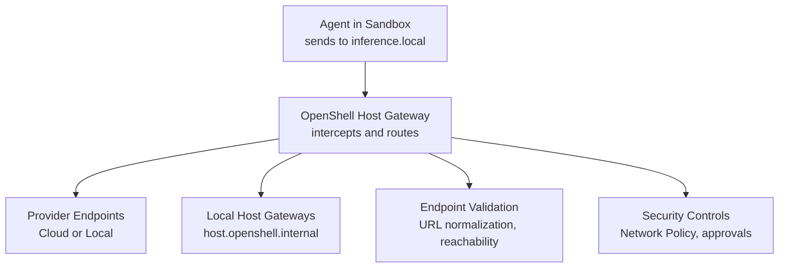
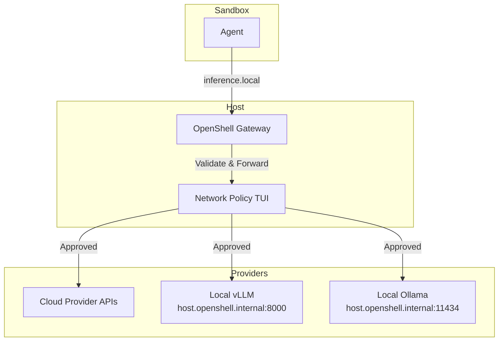
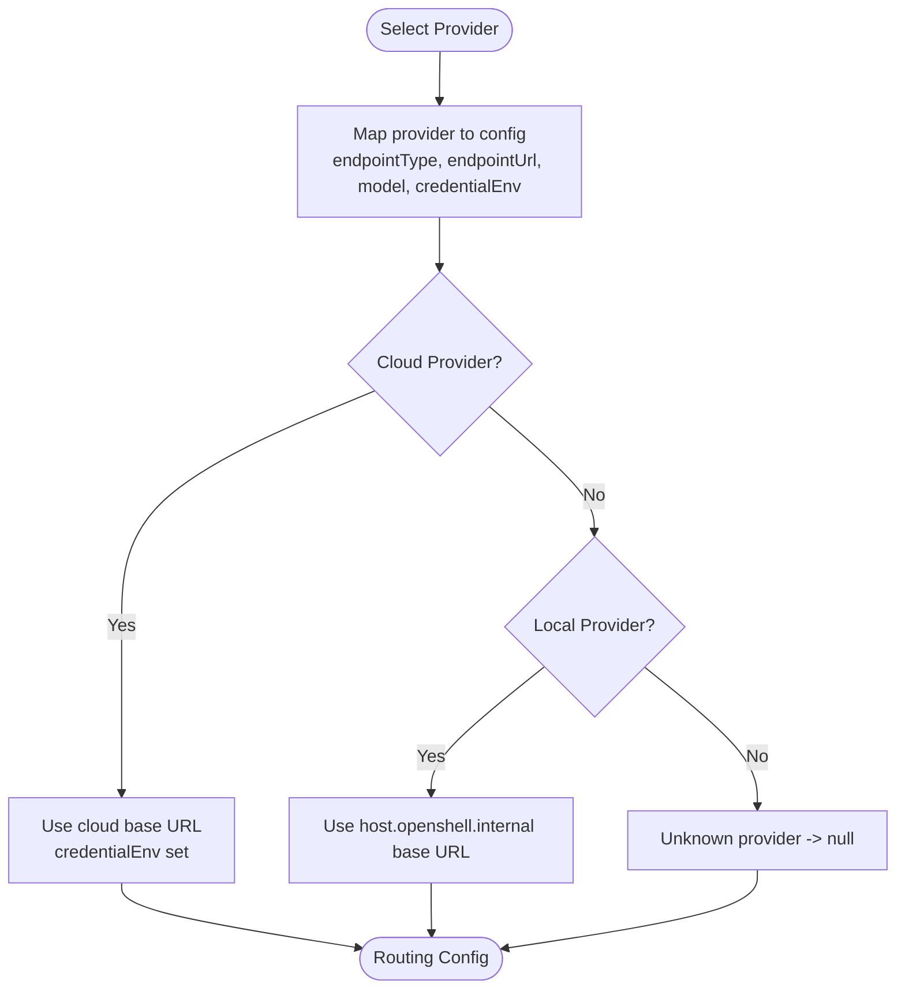
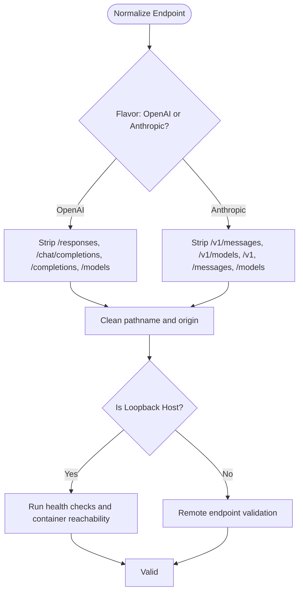
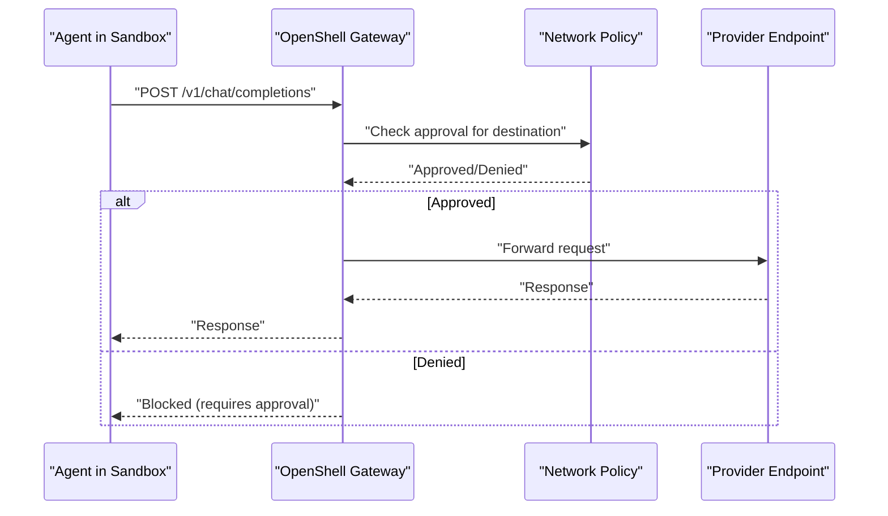
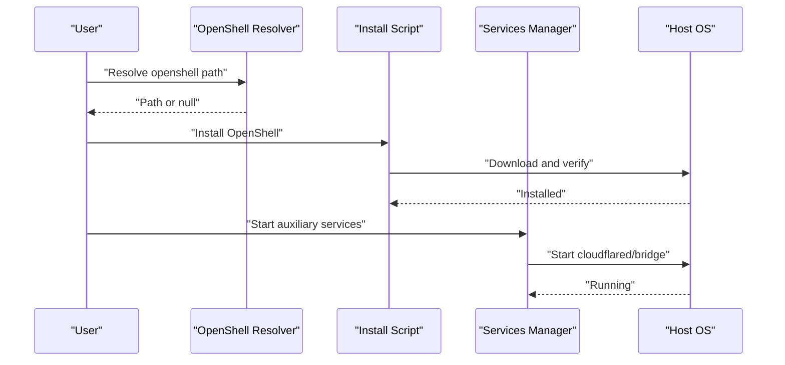
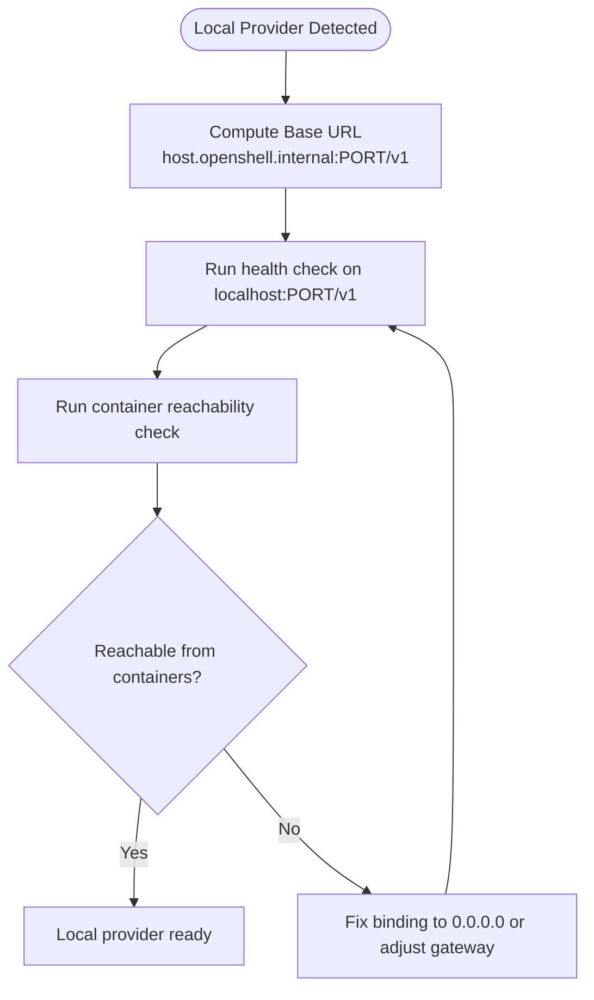
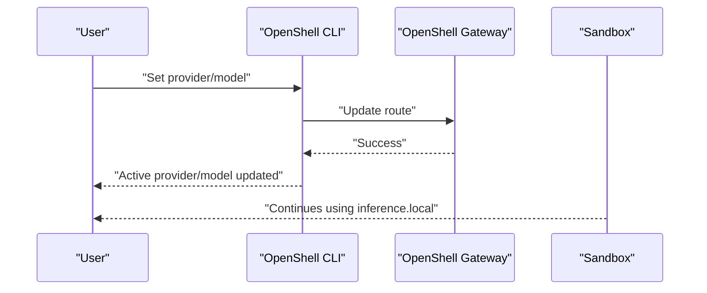
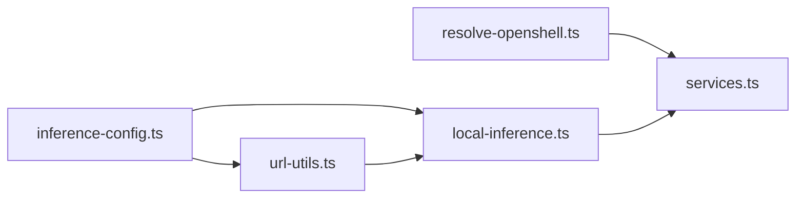

# Inference Routing

<cite>
**Referenced Files in This Document**
- [inference-config.ts](file://src/lib/inference-config.ts)
- [local-inference.ts](file://src/lib/local-inference.ts)
- [resolve-openshell.ts](file://src/lib/resolve-openshell.ts)
- [url-utils.ts](file://src/lib/url-utils.ts)
- [services.ts](file://src/lib/services.ts)
- [inference-options.md](file://docs/inference/inference-options.md)
- [use-local-inference.md](file://docs/inference/use-local-inference.md)
- [switch-inference-providers.md](file://docs/inference/switch-inference-providers.md)
- [approve-network-requests.md](file://docs/network-policy/approve-network-requests.md)
- [troubleshooting.md](file://docs/reference/troubleshooting.md)
- [install-openshell.sh](file://scripts/install-openshell.sh)
- [start-services.sh](file://scripts/start-services.sh)
- [inference-config.js](file://bin/lib/inference-config.js)
- [local-inference.js](file://bin/lib/local-inference.js)
</cite>

## Table of Contents
1. [Introduction](#introduction)
2. [Project Structure](#project-structure)
3. [Core Components](#core-components)
4. [Architecture Overview](#architecture-overview)
5. [Detailed Component Analysis](#detailed-component-analysis)
6. [Dependency Analysis](#dependency-analysis)
7. [Performance Considerations](#performance-considerations)
8. [Troubleshooting Guide](#troubleshooting-guide)
9. [Conclusion](#conclusion)
10. [Appendices](#appendices)

## Introduction
This document explains how NemoClaw routes inference traffic between agents and providers. Agents inside the sandbox send requests to a local domain that resolves to a host-side gateway. OpenShell intercepts and forwards these requests to the selected provider endpoint, keeping secrets on the host and preventing the sandbox from accessing them. The routing pipeline includes provider selection, endpoint validation, traffic forwarding, and response handling. We also cover OpenShell integration, network interception, security considerations, performance implications, failover strategies, and operational guidance.

## Project Structure
The routing logic spans TypeScript libraries, documentation, and scripts:
- Provider selection and routing configuration live in the inference configuration module.
- Local inference helpers define host gateway URLs and validation commands.
- URL utilities normalize provider base URLs and detect loopback targets.
- OpenShell resolution locates the OpenShell binary for gateway operations.
- Services orchestrate auxiliary services and integrate with OpenShell.
- Documentation describes provider options, routing mechanics, and operational procedures.
- Scripts install OpenShell and start auxiliary services.

**Section sources**
- [inference-options.md:29-36](file://docs/inference/inference-options.md#L29-L36)
- [use-local-inference.md:28-31](file://docs/inference/use-local-inference.md#L28-L31)

## Core Components
- Provider selection and routing configuration: maps provider identifiers to endpoint types, base URLs, and credential environments.
- Local inference helpers: define host gateway URLs for local providers, health checks, and container reachability tests.
- URL utilities: normalize provider base URLs and strip API suffixes depending on provider flavor.
- OpenShell resolution: locates the OpenShell binary for gateway operations.
- Services: integrates OpenShell and auxiliary services, ensuring proper startup and status reporting.
- Documentation: outlines provider options, routing behavior, and operational procedures.

**Section sources**
- [inference-config.ts:12-121](file://src/lib/inference-config.ts#L12-L121)
- [local-inference.ts:12-130](file://src/lib/local-inference.ts#L12-L130)
- [url-utils.ts:23-44](file://src/lib/url-utils.ts#L23-L44)
- [resolve-openshell.ts:22-59](file://src/lib/resolve-openshell.ts#L22-L59)
- [services.ts:104-366](file://src/lib/services.ts#L104-L366)

## Architecture Overview
The routing architecture centers on a fixed sandbox endpoint that resolves to a host-side gateway. The agent never contacts providers directly; OpenShell enforces network policy and forwards traffic to the active provider. Provider selection determines the base URL and credential environment. Local providers are accessed via host gateway aliases, while cloud providers use configured base URLs. Validation ensures endpoints are reachable and healthy before sandbox activation.

**Diagram sources**
- [inference-options.md:31-36](file://docs/inference/inference-options.md#L31-L36)
- [local-inference.ts:29-38](file://src/lib/local-inference.ts#L29-L38)
- [approve-network-requests.md:25-66](file://docs/network-policy/approve-network-requests.md#L25-L66)

**Section sources**
- [inference-options.md:29-36](file://docs/inference/inference-options.md#L29-L36)
- [local-inference.ts:29-38](file://src/lib/local-inference.ts#L29-L38)
- [approve-network-requests.md:25-66](file://docs/network-policy/approve-network-requests.md#L25-L66)

## Detailed Component Analysis

### Provider Selection and Routing Configuration
Provider selection maps a provider identifier to a configuration object containing endpoint type, base URL, model, profile, credential environment, and provider label. The base URL defaults to a fixed sandbox endpoint, while cloud providers use explicit credentials. Local providers resolve to host gateway URLs for traffic forwarding.

**Diagram sources**
- [inference-config.ts:42-115](file://src/lib/inference-config.ts#L42-L115)
- [local-inference.ts:29-38](file://src/lib/local-inference.ts#L29-L38)

**Section sources**
- [inference-config.ts:42-115](file://src/lib/inference-config.ts#L42-L115)
- [inference-config.ts:12-24](file://src/lib/inference-config.ts#L12-L24)

### Endpoint Validation and Normalization
Endpoint validation normalizes provider base URLs and strips API suffixes depending on provider flavor. Loopback detection helps identify local endpoints. For local providers, health checks and container reachability tests ensure the host gateway is reachable from sandbox containers.

**Diagram sources**
- [url-utils.ts:25-44](file://src/lib/url-utils.ts#L25-L44)
- [local-inference.ts:73-130](file://src/lib/local-inference.ts#L73-L130)

**Section sources**
- [url-utils.ts:23-54](file://src/lib/url-utils.ts#L23-L54)
- [local-inference.ts:73-130](file://src/lib/local-inference.ts#L73-L130)

### Traffic Forwarding and Response Handling
Agents send requests to a fixed sandbox endpoint. OpenShell intercepts and forwards to the active provider. Responses are returned to the agent without exposing provider credentials. Network policy controls whether endpoints are approved for egress.

**Diagram sources**
- [inference-options.md:31-36](file://docs/inference/inference-options.md#L31-L36)
- [approve-network-requests.md:58-66](file://docs/network-policy/approve-network-requests.md#L58-L66)

**Section sources**
- [inference-options.md:29-36](file://docs/inference/inference-options.md#L29-L36)
- [approve-network-requests.md:25-66](file://docs/network-policy/approve-network-requests.md#L25-L66)

### OpenShell Integration and Auxiliary Services
OpenShell binary resolution ensures the gateway and CLI are available. Auxiliary services (Telegram bridge and cloudflared tunnel) integrate with OpenShell and rely on sandbox readiness. Scripts install OpenShell and start services with appropriate environment handling.

**Diagram sources**
- [resolve-openshell.ts:22-59](file://src/lib/resolve-openshell.ts#L22-L59)
- [install-openshell.sh:54-128](file://scripts/install-openshell.sh#L54-L128)
- [services.ts:292-366](file://src/lib/services.ts#L292-L366)

**Section sources**
- [resolve-openshell.ts:22-59](file://src/lib/resolve-openshell.ts#L22-L59)
- [install-openshell.sh:54-128](file://scripts/install-openshell.sh#L54-L128)
- [services.ts:292-366](file://src/lib/services.ts#L292-L366)

### Local Provider Routing Details
Local providers are accessed via host gateway aliases. Health checks and container reachability tests ensure the host gateway is reachable from sandbox containers. For Docker-based setups, the host gateway is reachable via a special hostname.

**Diagram sources**
- [local-inference.ts:29-71](file://src/lib/local-inference.ts#L29-L71)
- [use-local-inference.md:56-69](file://docs/inference/use-local-inference.md#L56-L69)

**Section sources**
- [local-inference.ts:29-71](file://src/lib/local-inference.ts#L29-L71)
- [use-local-inference.md:56-69](file://docs/inference/use-local-inference.md#L56-L69)

### Runtime Provider Switching
Runtime switching updates the OpenShell route without restarting the sandbox. The agent continues to use the sandbox endpoint; the host route changes to the new provider.

**Diagram sources**
- [switch-inference-providers.md:35-96](file://docs/inference/switch-inference-providers.md#L35-L96)

**Section sources**
- [switch-inference-providers.md:35-96](file://docs/inference/switch-inference-providers.md#L35-L96)

## Dependency Analysis
Routing depends on:
- Provider selection mapping to endpoint configuration.
- URL normalization to ensure consistent base URLs.
- Local inference helpers for host gateway URLs and validation.
- OpenShell resolver for gateway availability.
- Services manager for auxiliary service integration.

**Diagram sources**
- [inference-config.ts:10-24](file://src/lib/inference-config.ts#L10-L24)
- [url-utils.ts:25-44](file://src/lib/url-utils.ts#L25-L44)
- [local-inference.ts:12-38](file://src/lib/local-inference.ts#L12-L38)
- [resolve-openshell.ts:22-59](file://src/lib/resolve-openshell.ts#L22-L59)
- [services.ts:104-145](file://src/lib/services.ts#L104-L145)

**Section sources**
- [inference-config.ts:10-24](file://src/lib/inference-config.ts#L10-L24)
- [url-utils.ts:25-44](file://src/lib/url-utils.ts#L25-L44)
- [local-inference.ts:12-38](file://src/lib/local-inference.ts#L12-L38)
- [resolve-openshell.ts:22-59](file://src/lib/resolve-openshell.ts#L22-L59)
- [services.ts:104-145](file://src/lib/services.ts#L104-L145)

## Performance Considerations
- Fixed sandbox endpoint simplifies routing and reduces per-request overhead.
- Local providers benefit from reduced latency when the host gateway is reachable from containers.
- Container reachability checks prevent misconfiguration-induced retries.
- Auxiliary services (cloudflared, Telegram bridge) should be started conditionally to minimize resource usage.
- WSL2-specific DNS settings improve reliability of external connections.

[No sources needed since this section provides general guidance]

## Troubleshooting Guide
Common issues and resolutions:
- Inference requests time out: verify the active provider and endpoint, check network policy approvals, and confirm credentials.
- Sandbox shows as stopped or not running inside: check host-side sandbox state and restart the gateway if needed.
- Network policy blocks external hosts: use the TUI to approve endpoints or customize the policy.
- Local provider unreachable: ensure the service listens on 0.0.0.0 and is reachable from containers.
- Auxiliary services not starting: verify environment variables and OpenShell availability.

**Section sources**
- [troubleshooting.md:244-255](file://docs/reference/troubleshooting.md#L244-L255)
- [troubleshooting.md:231-243](file://docs/reference/troubleshooting.md#L231-L243)
- [approve-network-requests.md:58-66](file://docs/network-policy/approve-network-requests.md#L58-L66)
- [use-local-inference.md:56-69](file://docs/inference/use-local-inference.md#L56-L69)
- [start-services.sh:126-132](file://scripts/start-services.sh#L126-L132)

## Conclusion
NemoClaw’s inference routing isolates provider credentials on the host, centralizes traffic via OpenShell, and validates endpoints to ensure reliable operation. Provider selection, URL normalization, and local reachability checks form a robust pipeline. Operators can switch providers at runtime, approve network requests, and troubleshoot efficiently using documented procedures.

[No sources needed since this section summarizes without analyzing specific files]

## Appendices

### Provider Selection Reference
- Cloud providers: NVIDIA Endpoints, OpenAI, Anthropic, Google Gemini.
- Compatible endpoints: OpenAI-compatible and Anthropic-compatible servers.
- Local providers: vLLM and Ollama via host gateway.
- Custom endpoints: configurable base URL and model.

**Section sources**
- [inference-options.md:38-63](file://docs/inference/inference-options.md#L38-L63)
- [use-local-inference.md:38-108](file://docs/inference/use-local-inference.md#L38-L108)

### Endpoint Validation Methods
- OpenAI-compatible: tests multiple API paths.
- Anthropic-compatible: tests messages API.
- Manual model entry: validates against catalog.
- Compatible endpoints: sends a real inference request.

**Section sources**
- [inference-options.md:65-76](file://docs/inference/inference-options.md#L65-L76)

### Security Considerations
- Secrets remain on the host; sandbox does not receive credentials.
- Network policy controls egress; operators approve endpoints in the TUI.
- Loopback detection and reachability checks reduce risk of misconfiguration.

**Section sources**
- [inference-options.md:35-36](file://docs/inference/inference-options.md#L35-L36)
- [approve-network-requests.md:25-66](file://docs/network-policy/approve-network-requests.md#L25-L66)