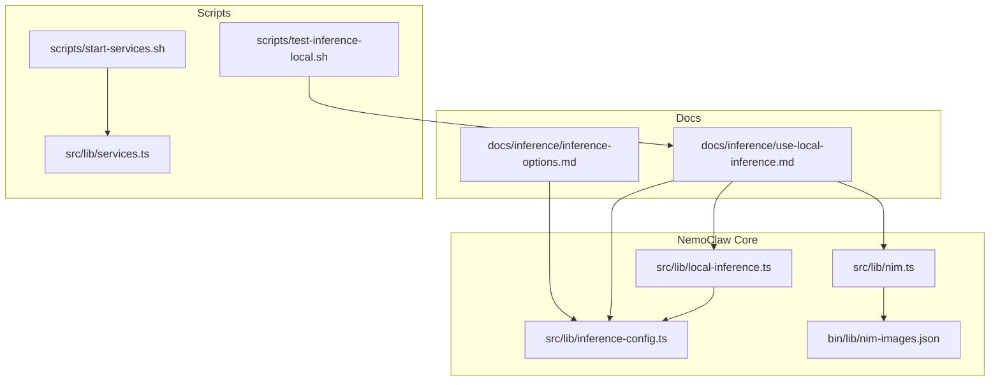
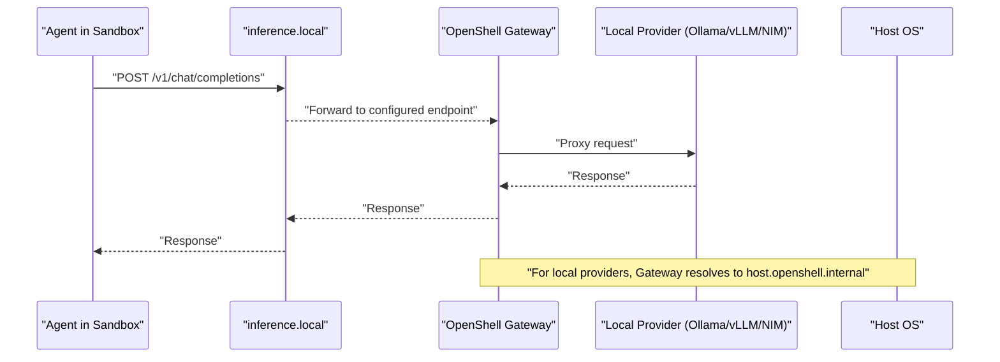
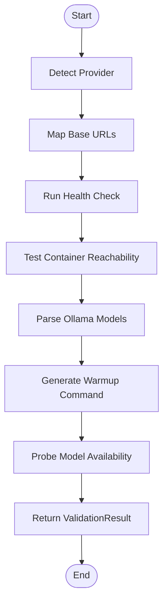
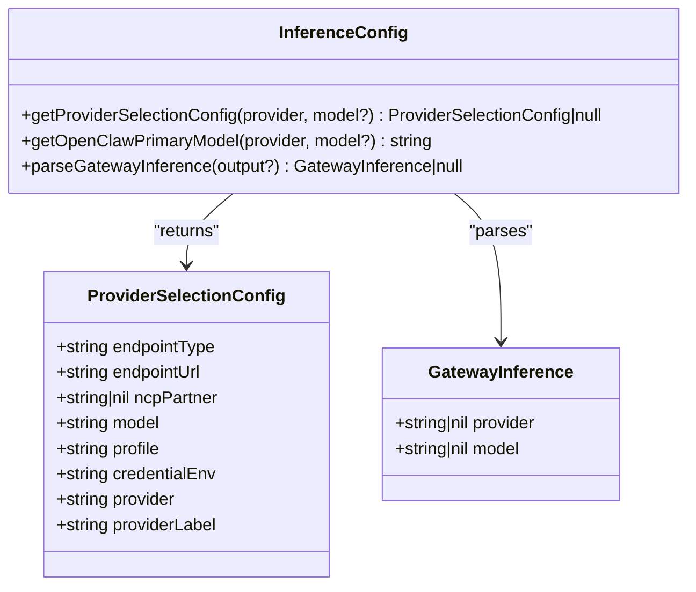
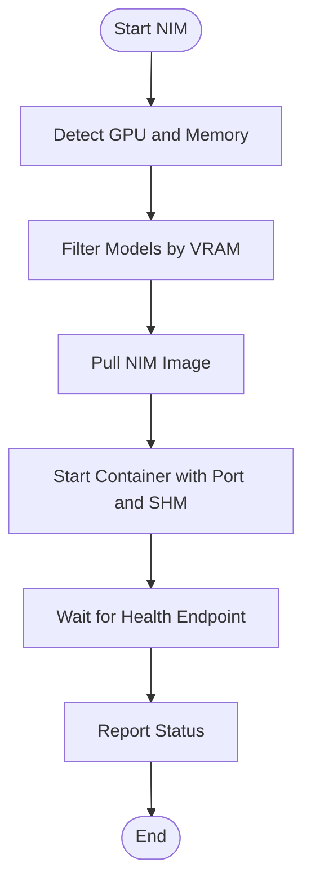
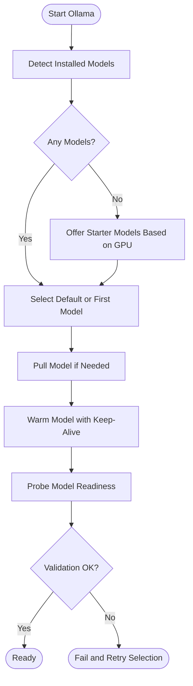
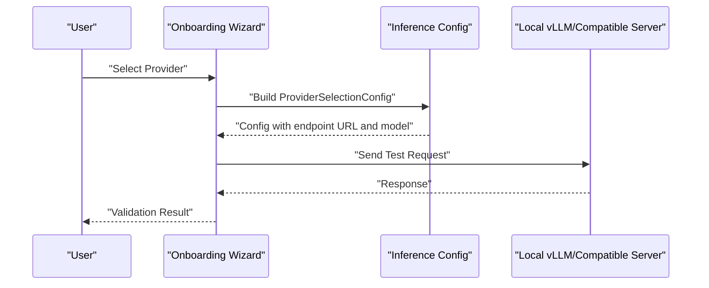
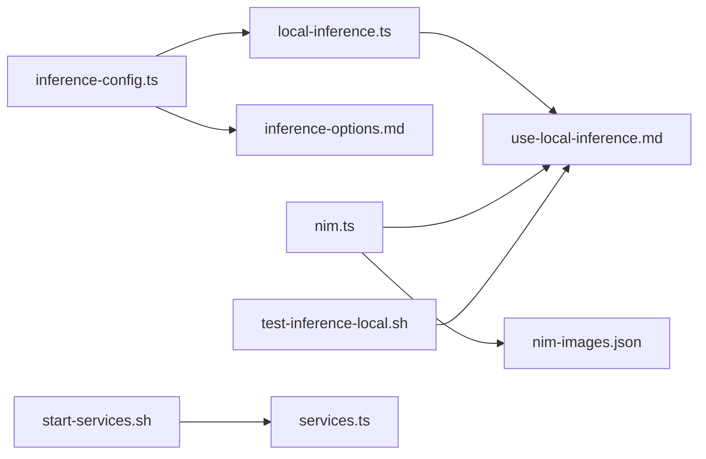

# Local Inference Setup

<cite>
**Referenced Files in This Document**
- [src/lib/local-inference.ts](file://src/lib/local-inference.ts)
- [src/lib/inference-config.ts](file://src/lib/inference-config.ts)
- [src/lib/nim.ts](file://src/lib/nim.ts)
- [bin/lib/nim-images.json](file://bin/lib/nim-images.json)
- [docs/inference/use-local-inference.md](file://docs/inference/use-local-inference.md)
- [docs/inference/inference-options.md](file://docs/inference/inference-options.md)
- [scripts/test-inference-local.sh](file://scripts/test-inference-local.sh)
- [scripts/start-services.sh](file://scripts/start-services.sh)
- [src/lib/services.ts](file://src/lib/services.ts)
</cite>

## Table of Contents
1. [Introduction](#introduction)
2. [Project Structure](#project-structure)
3. [Core Components](#core-components)
4. [Architecture Overview](#architecture-overview)
5. [Detailed Component Analysis](#detailed-component-analysis)
6. [Dependency Analysis](#dependency-analysis)
7. [Performance Considerations](#performance-considerations)
8. [Troubleshooting Guide](#troubleshooting-guide)
9. [Conclusion](#conclusion)
10. [Appendices](#appendices)

## Introduction
This document explains how to set up and manage local inference servers within NemoClaw. It covers configuring Ollama, NVIDIA NIM, and vLLM as local providers, including model detection, pulling starter models, warming, validation, and integration with NemoClaw’s routing system. It also documents port management, environment variables, and operational guidance for optimal performance and reliability.

## Project Structure
The local inference capabilities are implemented primarily in TypeScript modules under src/lib and surfaced through thin CommonJS shims in bin/lib. Documentation for onboarding and usage is provided in docs/inference. Helper scripts support testing and service management.

**Diagram sources**
- [src/lib/local-inference.ts:1-238](file://src/lib/local-inference.ts#L1-L238)
- [src/lib/inference-config.ts:1-150](file://src/lib/inference-config.ts#L1-L150)
- [src/lib/nim.ts:1-276](file://src/lib/nim.ts#L1-L276)
- [bin/lib/nim-images.json:1-30](file://bin/lib/nim-images.json#L1-L30)
- [docs/inference/use-local-inference.md:1-232](file://docs/inference/use-local-inference.md#L1-L232)
- [docs/inference/inference-options.md:1-81](file://docs/inference/inference-options.md#L1-L81)
- [scripts/test-inference-local.sh:1-10](file://scripts/test-inference-local.sh#L1-L10)
- [scripts/start-services.sh:1-214](file://scripts/start-services.sh#L1-L214)
- [src/lib/services.ts:1-384](file://src/lib/services.ts#L1-L384)

**Section sources**
- [src/lib/local-inference.ts:1-238](file://src/lib/local-inference.ts#L1-L238)
- [src/lib/inference-config.ts:1-150](file://src/lib/inference-config.ts#L1-L150)
- [src/lib/nim.ts:1-276](file://src/lib/nim.ts#L1-L276)
- [bin/lib/nim-images.json:1-30](file://bin/lib/nim-images.json#L1-L30)
- [docs/inference/use-local-inference.md:1-232](file://docs/inference/use-local-inference.md#L1-L232)
- [docs/inference/inference-options.md:1-81](file://docs/inference/inference-options.md#L1-L81)
- [scripts/test-inference-local.sh:1-10](file://scripts/test-inference-local.sh#L1-L10)
- [scripts/start-services.sh:1-214](file://scripts/start-services.sh#L1-L214)
- [src/lib/services.ts:1-384](file://src/lib/services.ts#L1-L384)

## Core Components
- Local inference provider helpers: URL mapping, health checks, container reachability, Ollama model parsing, warmup/probe commands, and validation.
- Inference configuration: provider selection, default models, managed provider labeling, and gateway output parsing.
- NVIDIA NIM management: GPU detection, model filtering by VRAM, container lifecycle, and health checks.
- Documentation: Onboarding steps, environment variables, and validation procedures for local providers.

Key responsibilities:
- Provider selection and routing configuration.
- Local server detection and validation.
- Model discovery and warming for Ollama.
- NIM image pulling, container start/stop, and health verification.

**Section sources**
- [src/lib/local-inference.ts:29-130](file://src/lib/local-inference.ts#L29-L130)
- [src/lib/local-inference.ts:132-237](file://src/lib/local-inference.ts#L132-L237)
- [src/lib/inference-config.ts:42-121](file://src/lib/inference-config.ts#L42-L121)
- [src/lib/inference-config.ts:123-149](file://src/lib/inference-config.ts#L123-L149)
- [src/lib/nim.ts:59-169](file://src/lib/nim.ts#L59-L169)
- [src/lib/nim.ts:171-227](file://src/lib/nim.ts#L171-L227)

## Architecture Overview
NemoClaw routes inference through a local endpoint by intercepting traffic to a fixed route. Providers are configured during onboarding and validated before sandbox creation. For local servers, the agent communicates with the host via a gateway URL; container reachability is verified to ensure sandbox access.

**Diagram sources**
- [docs/inference/use-local-inference.md:25-31](file://docs/inference/use-local-inference.md#L25-L31)
- [src/lib/local-inference.ts:12-13](file://src/lib/local-inference.ts#L12-L13)
- [src/lib/inference-config.ts:12-24](file://src/lib/inference-config.ts#L12-L24)

## Detailed Component Analysis

### Local Inference Provider Helpers
This module centralizes provider-specific logic for URL mapping, health checks, container reachability, Ollama model parsing, warmup, and validation.

**Diagram sources**
- [src/lib/local-inference.ts:29-130](file://src/lib/local-inference.ts#L29-L130)
- [src/lib/local-inference.ts:132-172](file://src/lib/local-inference.ts#L132-L172)
- [src/lib/local-inference.ts:186-208](file://src/lib/local-inference.ts#L186-L208)
- [src/lib/local-inference.ts:210-237](file://src/lib/local-inference.ts#L210-L237)

Key behaviors:
- Provider base URLs for vLLM and Ollama are mapped to host gateway and localhost variants for validation.
- Health checks query provider endpoints; container reachability ensures sandbox can access the host endpoint.
- Ollama model parsing supports both tags API and CLI list fallback.
- Warmup and probe commands exercise model readiness with configurable keep-alive and timeouts.

Operational guidance:
- Use provider health checks to confirm local server availability.
- Validate container reachability when running in Dockerized environments.
- Warm models to reduce first-use latency and probe to confirm readiness.

**Section sources**
- [src/lib/local-inference.ts:29-130](file://src/lib/local-inference.ts#L29-L130)
- [src/lib/local-inference.ts:132-172](file://src/lib/local-inference.ts#L132-L172)
- [src/lib/local-inference.ts:186-208](file://src/lib/local-inference.ts#L186-L208)
- [src/lib/local-inference.ts:210-237](file://src/lib/local-inference.ts#L210-L237)

### Inference Configuration and Routing
Provider selection configures endpoint type, URL, profile, and credentials. Managed provider labeling ensures consistent identification in logs and dashboards. Gateway output parsing extracts provider and model from formatted output.

**Diagram sources**
- [src/lib/inference-config.ts:26-40](file://src/lib/inference-config.ts#L26-L40)
- [src/lib/inference-config.ts:42-121](file://src/lib/inference-config.ts#L42-L121)
- [src/lib/inference-config.ts:123-149](file://src/lib/inference-config.ts#L123-L149)

Guidance:
- Select providers during onboarding; defaults are applied for cloud and local options.
- Managed provider labeling simplifies monitoring and debugging.
- Use gateway output parsing to verify routing decisions.

**Section sources**
- [src/lib/inference-config.ts:42-121](file://src/lib/inference-config.ts#L42-L121)
- [src/lib/inference-config.ts:123-149](file://src/lib/inference-config.ts#L123-L149)

### NVIDIA NIM Management
NIM integration automates GPU detection, image selection, container lifecycle, and health verification. It filters models by minimum VRAM and manages container ports and shared memory.

**Diagram sources**
- [src/lib/nim.ts:59-169](file://src/lib/nim.ts#L59-L169)
- [src/lib/nim.ts:171-227](file://src/lib/nim.ts#L171-L227)
- [bin/lib/nim-images.json:1-30](file://bin/lib/nim-images.json#L1-L30)

Guidance:
- Ensure sufficient VRAM for the chosen model; images define minimum memory requirements.
- Containers bind to host port 8000; health checks poll the models endpoint.
- Stop containers cleanly to free resources.

**Section sources**
- [src/lib/nim.ts:59-169](file://src/lib/nim.ts#L59-L169)
- [src/lib/nim.ts:171-227](file://src/lib/nim.ts#L171-L227)
- [bin/lib/nim-images.json:1-30](file://bin/lib/nim-images.json#L1-L30)

### Ollama Integration and Lifecycle
Ollama is the default local provider. The system detects installed models, offers starter models when none are present, pulls and warms the selected model, and validates readiness.

**Diagram sources**
- [src/lib/local-inference.ts:153-184](file://src/lib/local-inference.ts#L153-L184)
- [src/lib/local-inference.ts:186-208](file://src/lib/local-inference.ts#L186-L208)
- [src/lib/local-inference.ts:210-237](file://src/lib/local-inference.ts#L210-L237)

Guidance:
- On Linux/Docker, ensure Ollama listens on 0.0.0.0:11434 for container reachability.
- Use warmup and probe to mitigate cold-start latency and detect unhealthy models.
- Non-interactive setup supports environment variables for provider and model selection.

**Section sources**
- [src/lib/local-inference.ts:153-184](file://src/lib/local-inference.ts#L153-L184)
- [src/lib/local-inference.ts:186-208](file://src/lib/local-inference.ts#L186-L208)
- [src/lib/local-inference.ts:210-237](file://src/lib/local-inference.ts#L210-L237)
- [docs/inference/use-local-inference.md:38-84](file://docs/inference/use-local-inference.md#L38-L84)

### vLLM and Compatible Endpoints
vLLM and other OpenAI-compatible servers are supported via a generic provider. The wizard validates endpoints and enforces API paths for tool-call compatibility.

**Diagram sources**
- [src/lib/inference-config.ts:42-121](file://src/lib/inference-config.ts#L42-L121)
- [docs/inference/use-local-inference.md:85-128](file://docs/inference/use-local-inference.md#L85-L128)

Guidance:
- Use base URLs ending with /v1 for compatibility.
- For vLLM, NemoClaw forces chat/completions API path to enable tool-call parsing.
- Compatible endpoints require a dummy API key if no authentication is enforced.

**Section sources**
- [src/lib/inference-config.ts:42-121](file://src/lib/inference-config.ts#L42-L121)
- [docs/inference/use-local-inference.md:85-128](file://docs/inference/use-local-inference.md#L85-L128)

## Dependency Analysis
- Provider selection depends on inference configuration constants and defaults.
- Local inference helpers depend on host gateway URL and provider-specific endpoints.
- NIM management depends on GPU detection and model image metadata.
- Documentation references guide onboarding and validation procedures.

**Diagram sources**
- [src/lib/inference-config.ts:1-150](file://src/lib/inference-config.ts#L1-L150)
- [src/lib/local-inference.ts:1-238](file://src/lib/local-inference.ts#L1-L238)
- [src/lib/nim.ts:1-276](file://src/lib/nim.ts#L1-L276)
- [bin/lib/nim-images.json:1-30](file://bin/lib/nim-images.json#L1-L30)
- [docs/inference/use-local-inference.md:1-232](file://docs/inference/use-local-inference.md#L1-L232)
- [docs/inference/inference-options.md:1-81](file://docs/inference/inference-options.md#L1-L81)
- [scripts/test-inference-local.sh:1-10](file://scripts/test-inference-local.sh#L1-L10)
- [scripts/start-services.sh:1-214](file://scripts/start-services.sh#L1-L214)
- [src/lib/services.ts:1-384](file://src/lib/services.ts#L1-L384)

**Section sources**
- [src/lib/inference-config.ts:1-150](file://src/lib/inference-config.ts#L1-L150)
- [src/lib/local-inference.ts:1-238](file://src/lib/local-inference.ts#L1-L238)
- [src/lib/nim.ts:1-276](file://src/lib/nim.ts#L1-L276)
- [bin/lib/nim-images.json:1-30](file://bin/lib/nim-images.json#L1-L30)
- [docs/inference/use-local-inference.md:1-232](file://docs/inference/use-local-inference.md#L1-L232)
- [docs/inference/inference-options.md:1-81](file://docs/inference/inference-options.md#L1-L81)
- [scripts/test-inference-local.sh:1-10](file://scripts/test-inference-local.sh#L1-L10)
- [scripts/start-services.sh:1-214](file://scripts/start-services.sh#L1-L214)
- [src/lib/services.ts:1-384](file://src/lib/services.ts#L1-L384)

## Performance Considerations
- Warm models proactively to reduce first-request latency.
- Prefer larger models on systems with sufficient memory; the Ollama default is selected based on GPU memory thresholds.
- For NIM, ensure adequate VRAM and container shared memory; health checks prevent proceeding until the server is responsive.
- Use container reachability checks to avoid routing failures when the host endpoint is not accessible from sandboxes.
- Limit keep-alive durations to balance responsiveness and resource usage.

[No sources needed since this section provides general guidance]

## Troubleshooting Guide
Common issues and resolutions:
- Local provider not responding on localhost: Confirm the server is running and listening on the expected port.
- Containers cannot reach host endpoint: Ensure the server binds to 0.0.0.0 instead of loopback for Dockerized environments.
- Ollama model probe fails: The model may still be loading, too large for the host, or otherwise unhealthy; retry after warming or switch to a smaller model.
- NIM container not healthy: Verify GPU memory meets model requirements and that the health endpoint responds on the mapped host port.
- Validation failures during onboarding: Review provider selection and endpoint configuration; re-run with corrected environment variables.

**Section sources**
- [src/lib/local-inference.ts:73-130](file://src/lib/local-inference.ts#L73-L130)
- [src/lib/local-inference.ts:210-237](file://src/lib/local-inference.ts#L210-L237)
- [src/lib/nim.ts:204-227](file://src/lib/nim.ts#L204-L227)
- [docs/inference/use-local-inference.md:56-69](file://docs/inference/use-local-inference.md#L56-L69)

## Conclusion
NemoClaw provides robust, documented pathways to configure and manage local inference servers. By leveraging provider helpers, inference configuration, and NIM management, teams can reliably deploy Ollama, vLLM, and NIM with proper validation and lifecycle management. Use the documented environment variables and validation steps to ensure smooth operation across diverse environments.

[No sources needed since this section summarizes without analyzing specific files]

## Appendices

### Environment Variables and Flags
- NEMOCLAW_PROVIDER: Select provider (e.g., ollama, custom, anthropicCompatible, vllm, nim).
- NEMOCLAW_MODEL: Specify model tag or ID for local providers.
- NEMOCLAW_ENDPOINT_URL: Base URL for compatible endpoints.
- COMPATIBLE_API_KEY / COMPATIBLE_ANTHROPIC_API_KEY: API keys for compatible endpoints.
- OPENAI_API_KEY: Credential for cloud providers.
- NEMOCLAW_EXPERIMENTAL=1: Enables experimental providers (vLLM auto-detect, NIM).
- OLLAMA_HOST: Bind address for Ollama (Linux/Docker).

**Section sources**
- [docs/inference/use-local-inference.md:70-84](file://docs/inference/use-local-inference.md#L70-L84)
- [docs/inference/use-local-inference.md:110-128](file://docs/inference/use-local-inference.md#L110-L128)
- [docs/inference/use-local-inference.md:165-175](file://docs/inference/use-local-inference.md#L165-L175)
- [docs/inference/use-local-inference.md:194-203](file://docs/inference/use-local-inference.md#L194-L203)

### Ports and Endpoints
- Ollama: Default port 11434; reachable via host.openshell.internal for containers.
- vLLM: Default port 8000; reachable via host.openshell.internal for containers.
- NIM: Container runs on port 8000; health checked on /v1/models.

**Section sources**
- [src/lib/local-inference.ts:12-13](file://src/lib/local-inference.ts#L12-L13)
- [src/lib/local-inference.ts:30-49](file://src/lib/local-inference.ts#L30-L49)
- [src/lib/nim.ts:204-227](file://src/lib/nim.ts#L204-L227)

### Testing Local Inference
Use the provided script to send a test request to the local inference route.

**Section sources**
- [scripts/test-inference-local.sh:1-10](file://scripts/test-inference-local.sh#L1-L10)