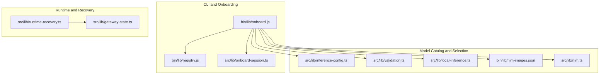
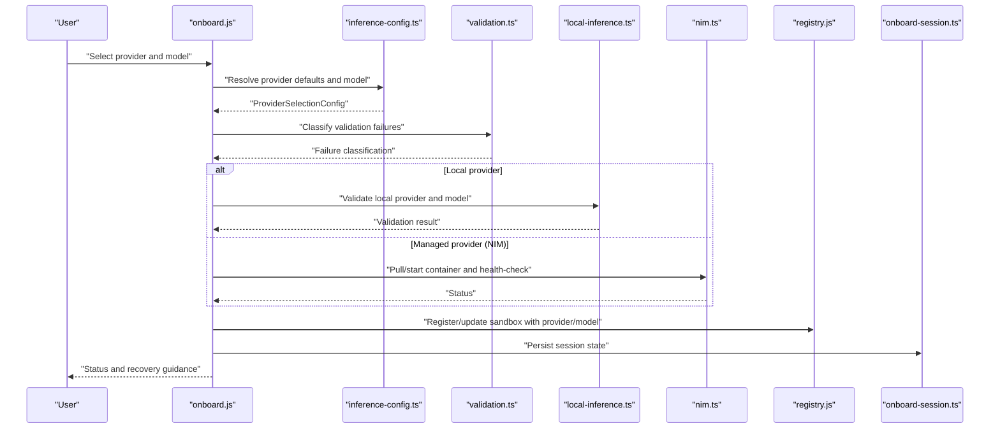
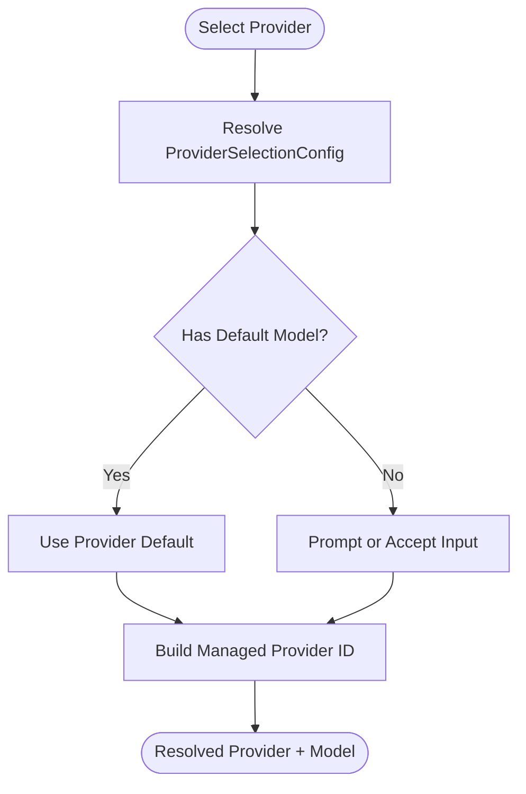
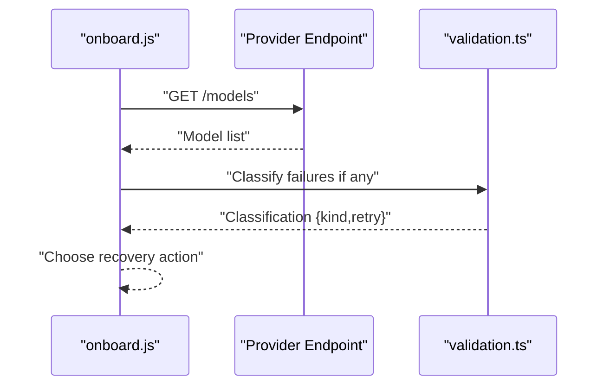
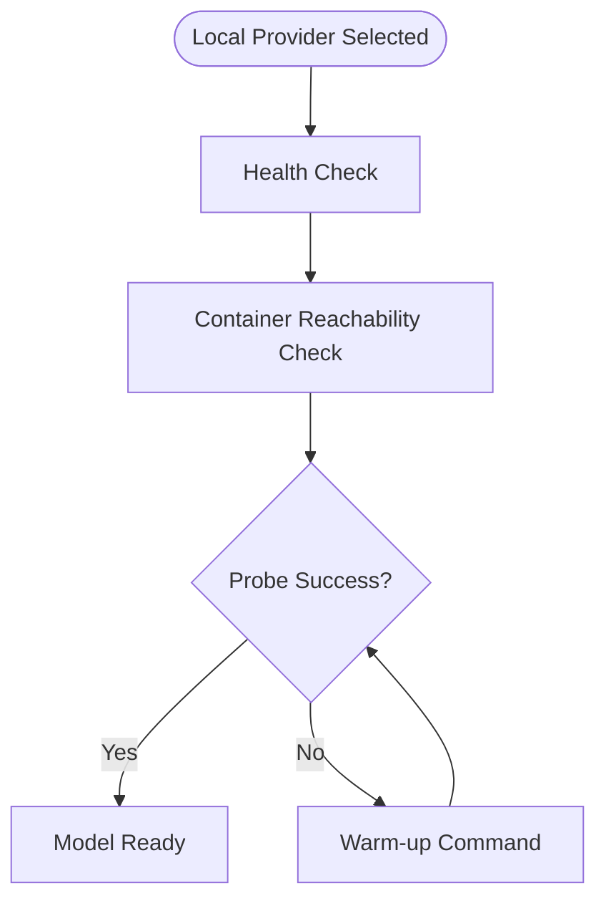
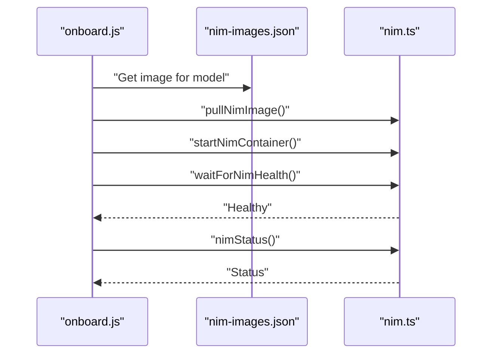
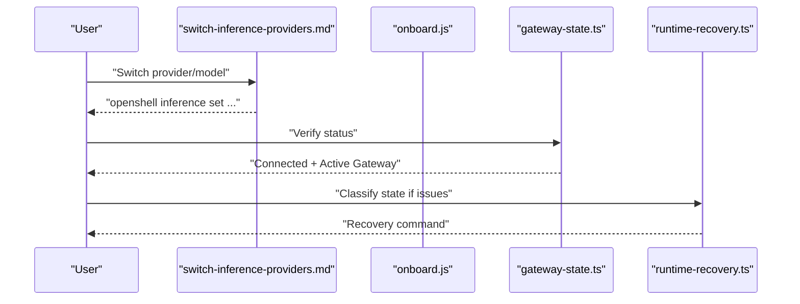
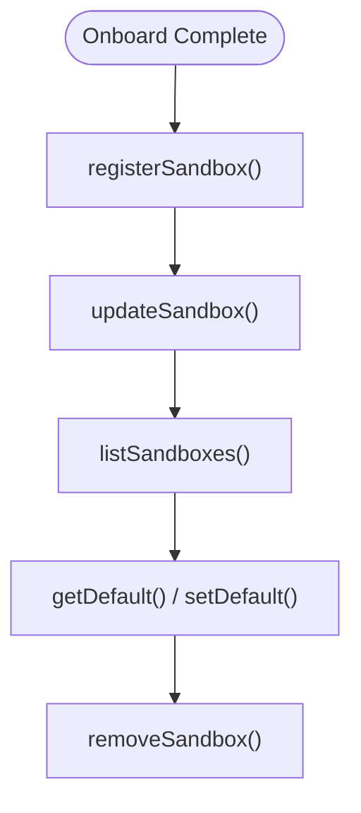
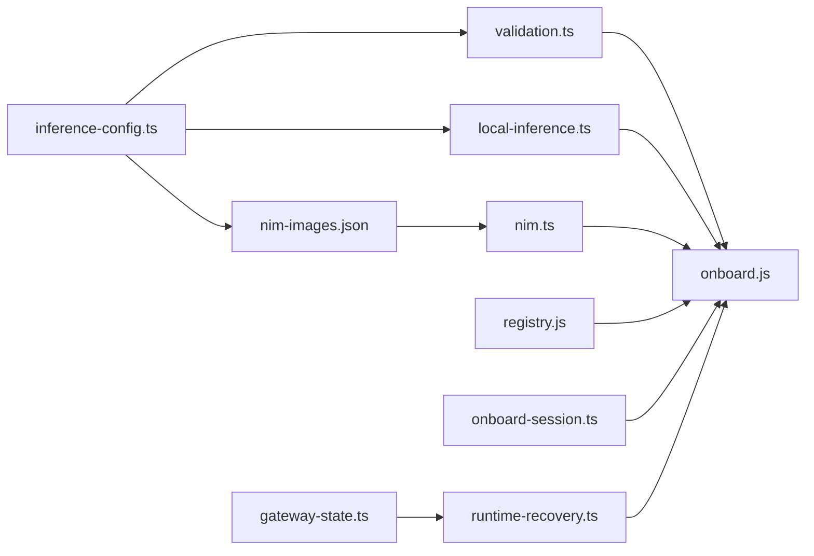

# Model Management

<cite>
**Referenced Files in This Document**
- [inference-config.ts](file://src/lib/inference-config.ts)
- [validation.ts](file://src/lib/validation.ts)
- [local-inference.ts](file://src/lib/local-inference.ts)
- [nim.ts](file://src/lib/nim.ts)
- [onboard.js](file://bin/lib/onboard.js)
- [registry.js](file://bin/lib/registry.js)
- [onboard-session.ts](file://src/lib/onboard-session.ts)
- [runtime-recovery.ts](file://src/lib/runtime-recovery.ts)
- [gateway-state.ts](file://src/lib/gateway-state.ts)
- [nim-images.json](file://bin/lib/nim-images.json)
- [switch-inference-providers.md](file://docs/inference/switch-inference-providers.md)
- [register.test.ts](file://nemoclaw/src/register.test.ts)
</cite>

## Table of Contents
1. [Introduction](#introduction)
2. [Project Structure](#project-structure)
3. [Core Components](#core-components)
4. [Architecture Overview](#architecture-overview)
5. [Detailed Component Analysis](#detailed-component-analysis)
6. [Dependency Analysis](#dependency-analysis)
7. [Performance Considerations](#performance-considerations)
8. [Troubleshooting Guide](#troubleshooting-guide)
9. [Conclusion](#conclusion)
10. [Appendices](#appendices)

## Introduction
This document describes model management in NemoClaw with a focus on catalog handling, model validation, and runtime model switching. It explains how NemoClaw discovers and curates models across providers, validates model choices, and manages runtime transitions between providers and models. It also covers lifecycle management, local model warming, and troubleshooting common issues.

## Project Structure
NemoClaw’s model management spans several libraries and binaries:
- Provider selection and model resolution live in a dedicated library module.
- Validation logic classifies failures and suggests recovery actions.
- Local inference helpers support Ollama and vLLM providers.
- NVIDIA NIM container orchestration supports managed model images.
- Onboarding and runtime recovery coordinate provider/model selection and state.
- Registry and session files persist sandbox metadata and model/provider choices.

**Diagram sources**
- [onboard.js:105-183](file://bin/lib/onboard.js#L105-L183)
- [inference-config.ts:26-150](file://src/lib/inference-config.ts#L26-L150)
- [validation.ts:20-85](file://src/lib/validation.ts#L20-L85)
- [local-inference.ts:29-238](file://src/lib/local-inference.ts#L29-L238)
- [nim-images.json:1-30](file://bin/lib/nim-images.json#L1-L30)
- [nim.ts:42-276](file://src/lib/nim.ts#L42-L276)
- [registry.js:154-238](file://bin/lib/registry.js#L154-L238)
- [onboard-session.ts:40-90](file://src/lib/onboard-session.ts#L40-L90)
- [gateway-state.ts:33-124](file://src/lib/gateway-state.ts#L33-L124)
- [runtime-recovery.ts:25-91](file://src/lib/runtime-recovery.ts#L25-L91)

**Section sources**
- [onboard.js:105-183](file://bin/lib/onboard.js#L105-L183)
- [inference-config.ts:26-150](file://src/lib/inference-config.ts#L26-L150)
- [validation.ts:20-85](file://src/lib/validation.ts#L20-L85)
- [local-inference.ts:29-238](file://src/lib/local-inference.ts#L29-L238)
- [nim-images.json:1-30](file://bin/lib/nim-images.json#L1-L30)
- [nim.ts:42-276](file://src/lib/nim.ts#L42-L276)
- [registry.js:154-238](file://bin/lib/registry.js#L154-L238)
- [onboard-session.ts:40-90](file://src/lib/onboard-session.ts#L40-L90)
- [gateway-state.ts:33-124](file://src/lib/gateway-state.ts#L33-L124)
- [runtime-recovery.ts:25-91](file://src/lib/runtime-recovery.ts#L25-L91)

## Core Components
- Provider selection and model resolution: centralizes provider-specific defaults, model options, and managed provider model IDs.
- Validation classification: classifies transport, credential, model, endpoint, and unknown failures; powers recovery prompts.
- Local inference helpers: URL mapping, health checks, and warm-up commands for local providers.
- NVIDIA NIM orchestration: model image discovery, GPU capability checks, container lifecycle, and health probing.
- Onboarding and runtime recovery: provider/model selection flows, sandbox registry, session persistence, and recovery strategies.
- Model catalogs: curated lists for some providers and dynamic discovery for others.

**Section sources**
- [inference-config.ts:26-150](file://src/lib/inference-config.ts#L26-L150)
- [validation.ts:20-85](file://src/lib/validation.ts#L20-L85)
- [local-inference.ts:29-238](file://src/lib/local-inference.ts#L29-L238)
- [nim.ts:42-276](file://src/lib/nim.ts#L42-L276)
- [onboard.js:105-183](file://bin/lib/onboard.js#L105-L183)
- [registry.js:154-238](file://bin/lib/registry.js#L154-L238)
- [onboard-session.ts:40-90](file://src/lib/onboard-session.ts#L40-L90)
- [runtime-recovery.ts:25-91](file://src/lib/runtime-recovery.ts#L25-L91)

## Architecture Overview
The model management architecture integrates provider selection, validation, and runtime orchestration:

**Diagram sources**
- [onboard.js:698-727](file://bin/lib/onboard.js#L698-L727)
- [inference-config.ts:42-121](file://src/lib/inference-config.ts#L42-L121)
- [validation.ts:20-85](file://src/lib/validation.ts#L20-L85)
- [local-inference.ts:73-130](file://src/lib/local-inference.ts#L73-L130)
- [nim.ts:171-227](file://src/lib/nim.ts#L171-L227)
- [registry.js:172-189](file://bin/lib/registry.js#L172-L189)
- [onboard-session.ts:432-492](file://src/lib/onboard-session.ts#L432-L492)

## Detailed Component Analysis

### Provider Catalog and Model Resolution
- Provider selection config defines defaults per provider, including endpoint URLs, profiles, credentials, and default models.
- Managed provider model IDs are constructed consistently for internal routing.
- Cloud provider model options include curated lists for quick selection.

**Diagram sources**
- [inference-config.ts:42-121](file://src/lib/inference-config.ts#L42-L121)

**Section sources**
- [inference-config.ts:26-150](file://src/lib/inference-config.ts#L26-L150)

### Model Discovery and Validation
- Dynamic model discovery queries provider endpoints for available models.
- Validation failure classification drives recovery prompts (retry, credential update, model selection, endpoint selection).
- Safe model ID validation prevents unsafe identifiers.

**Diagram sources**
- [onboard.js:1455-1594](file://bin/lib/onboard.js#L1455-L1594)
- [validation.ts:20-85](file://src/lib/validation.ts#L20-L85)

**Section sources**
- [onboard.js:1455-1594](file://bin/lib/onboard.js#L1455-L1594)
- [validation.ts:20-85](file://src/lib/validation.ts#L20-L85)

### Local Model Validation and Warm-Up
- Local provider validation ensures the selected provider is reachable from both host and containers.
- Ollama model warm-up and probe commands support model readiness checks and keep-alive tuning.

**Diagram sources**
- [local-inference.ts:73-130](file://src/lib/local-inference.ts#L73-L130)
- [local-inference.ts:186-208](file://src/lib/local-inference.ts#L186-L208)

**Section sources**
- [local-inference.ts:73-130](file://src/lib/local-inference.ts#L73-L130)
- [local-inference.ts:186-208](file://src/lib/local-inference.ts#L186-L208)

### NVIDIA NIM Orchestration
- Model image discovery from curated JSON.
- GPU capability detection and minimum memory checks.
- Container lifecycle: pull, start, health-check, stop.
- Status reporting and port mapping inspection.

**Diagram sources**
- [nim-images.json:1-30](file://bin/lib/nim-images.json#L1-L30)
- [nim.ts:42-276](file://src/lib/nim.ts#L42-L276)

**Section sources**
- [nim-images.json:1-30](file://bin/lib/nim-images.json#L1-L30)
- [nim.ts:42-276](file://src/lib/nim.ts#L42-L276)

### Runtime Switching and Seamless Transitions
- Runtime switching changes the OpenShell route without rewriting stored credentials.
- Status verification confirms active provider, model, and endpoint.
- Recovery strategies classify sandbox/gateway state and suggest remediation.

**Diagram sources**
- [switch-inference-providers.md:70-101](file://docs/inference/switch-inference-providers.md#L70-L101)
- [gateway-state.ts:77-114](file://src/lib/gateway-state.ts#L77-L114)
- [runtime-recovery.ts:77-91](file://src/lib/runtime-recovery.ts#L77-L91)

**Section sources**
- [switch-inference-providers.md:70-101](file://docs/inference/switch-inference-providers.md#L70-L101)
- [gateway-state.ts:77-114](file://src/lib/gateway-state.ts#L77-L114)
- [runtime-recovery.ts:77-91](file://src/lib/runtime-recovery.ts#L77-L91)

### Model Lifecycle Management and Registry
- Sandbox registry persists provider/model selections and GPU flags.
- Session management tracks onboarding progress and allows resume/recovery.
- Registration adds entries, updates merge changes, and removes or clears state.

**Diagram sources**
- [registry.js:172-238](file://bin/lib/registry.js#L172-L238)
- [onboard-session.ts:432-492](file://src/lib/onboard-session.ts#L432-L492)

**Section sources**
- [registry.js:172-238](file://bin/lib/registry.js#L172-L238)
- [onboard-session.ts:432-492](file://src/lib/onboard-session.ts#L432-L492)

## Dependency Analysis
- Provider selection depends on curated model options and managed provider IDs.
- Validation depends on classification functions to drive recovery.
- Local inference depends on health checks and warm-up commands.
- NIM orchestration depends on curated model images and GPU detection.
- Onboarding coordinates all components and persists state.

**Diagram sources**
- [inference-config.ts:26-150](file://src/lib/inference-config.ts#L26-L150)
- [validation.ts:20-85](file://src/lib/validation.ts#L20-L85)
- [local-inference.ts:29-238](file://src/lib/local-inference.ts#L29-L238)
- [nim-images.json:1-30](file://bin/lib/nim-images.json#L1-L30)
- [nim.ts:42-276](file://src/lib/nim.ts#L42-L276)
- [registry.js:154-238](file://bin/lib/registry.js#L154-L238)
- [onboard-session.ts:40-90](file://src/lib/onboard-session.ts#L40-L90)
- [gateway-state.ts:33-124](file://src/lib/gateway-state.ts#L33-L124)
- [runtime-recovery.ts:25-91](file://src/lib/runtime-recovery.ts#L25-L91)
- [onboard.js:698-727](file://bin/lib/onboard.js#L698-L727)

**Section sources**
- [inference-config.ts:26-150](file://src/lib/inference-config.ts#L26-L150)
- [validation.ts:20-85](file://src/lib/validation.ts#L20-L85)
- [local-inference.ts:29-238](file://src/lib/local-inference.ts#L29-L238)
- [nim-images.json:1-30](file://bin/lib/nim-images.json#L1-L30)
- [nim.ts:42-276](file://src/lib/nim.ts#L42-L276)
- [registry.js:154-238](file://bin/lib/registry.js#L154-L238)
- [onboard-session.ts:40-90](file://src/lib/onboard-session.ts#L40-L90)
- [gateway-state.ts:33-124](file://src/lib/gateway-state.ts#L33-L124)
- [runtime-recovery.ts:25-91](file://src/lib/runtime-recovery.ts#L25-L91)
- [onboard.js:698-727](file://bin/lib/onboard.js#L698-L727)

## Performance Considerations
- Prefer curated model lists for faster selection and reduced validation overhead.
- Use warm-up commands for local models to reduce first-request latency.
- Monitor provider health endpoints and adjust timeouts to balance responsiveness and reliability.
- For NIM, ensure sufficient GPU memory to avoid repeated restarts and degraded throughput.
- Minimize repeated validation retries by caching safe model IDs and validated endpoints.

[No sources needed since this section provides general guidance]

## Troubleshooting Guide
Common issues and remedies:
- Transport failures: Check DNS, proxy, and endpoint reachability; retry after resolving connectivity.
- Credential failures: Replace API keys or switch provider/model; validate key format.
- Model failures: Confirm model availability from provider endpoints; use curated lists when available.
- Endpoint mismatches: Select a compatible endpoint or adjust model selection.
- Sandbox/gateway state issues: Classify state and follow recovery command suggestions.

**Section sources**
- [validation.ts:20-85](file://src/lib/validation.ts#L20-L85)
- [onboard.js:660-687](file://bin/lib/onboard.js#L660-L687)
- [runtime-recovery.ts:41-91](file://src/lib/runtime-recovery.ts#L41-L91)

## Conclusion
NemoClaw’s model management integrates provider catalogs, robust validation, and runtime orchestration to enable reliable model selection and switching. By leveraging curated lists, dynamic discovery, and health checks, users can optimize for performance and cost while maintaining seamless transitions across providers and models.

[No sources needed since this section summarizes without analyzing specific files]

## Appendices

### Model Selection Criteria and Best Practices
- Choose curated models for known-good configurations.
- Validate model availability against provider endpoints before committing.
- Use local warm-up for frequently used models to improve responsiveness.
- Align model capabilities with hardware constraints (GPU memory for NIM).
- Prefer managed provider IDs for consistent routing and reduced misconfiguration risk.

**Section sources**
- [inference-config.ts:14-24](file://src/lib/inference-config.ts#L14-L24)
- [local-inference.ts:186-208](file://src/lib/local-inference.ts#L186-L208)
- [nim.ts:55-57](file://src/lib/nim.ts#L55-L57)

### Example: Programmatic Model Registration
- Providers can programmatically register models; custom models are supported when onboard configuration specifies a model.

**Section sources**
- [register.test.ts:63-79](file://nemoclaw/src/register.test.ts#L63-L79)