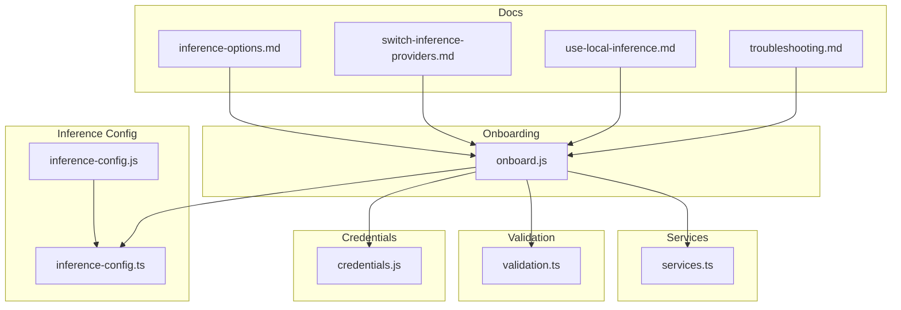
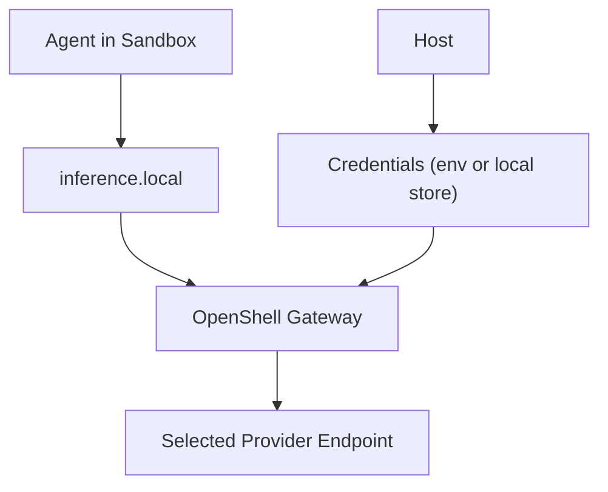
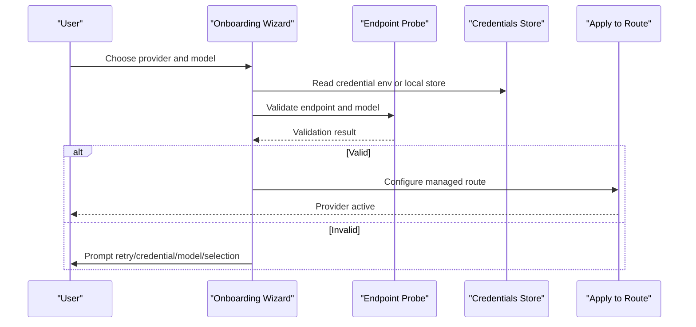
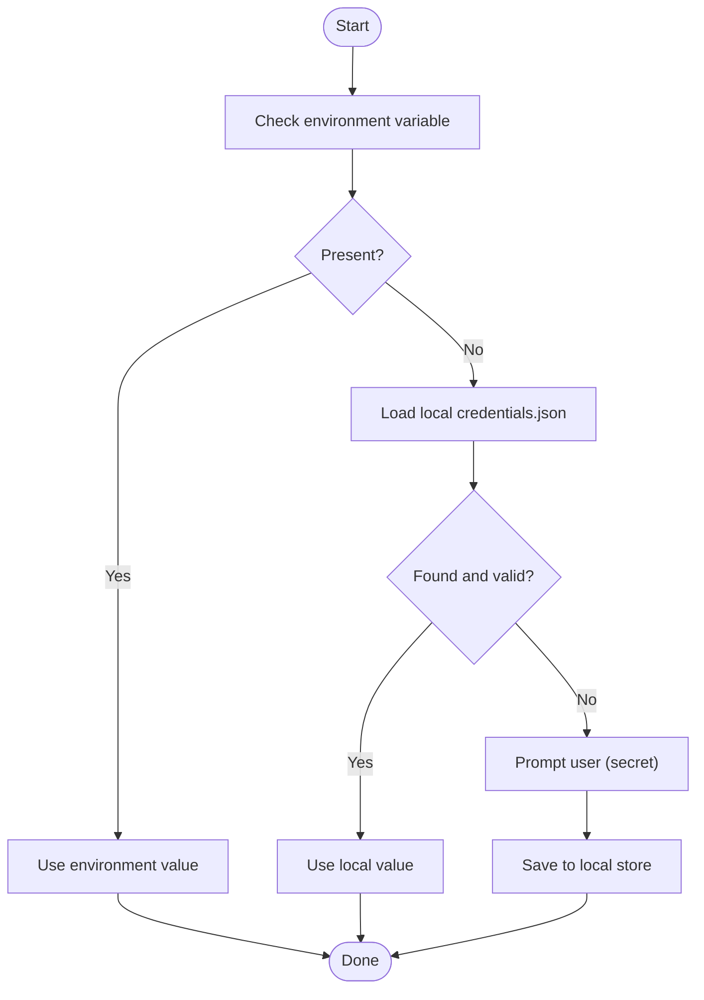
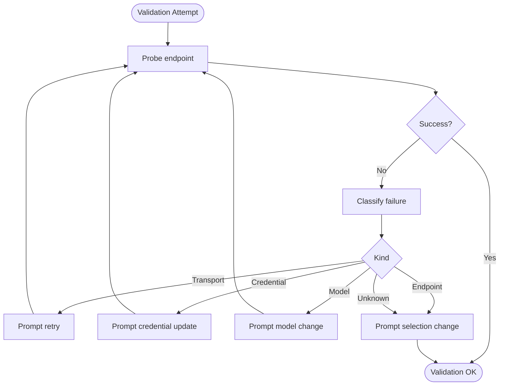
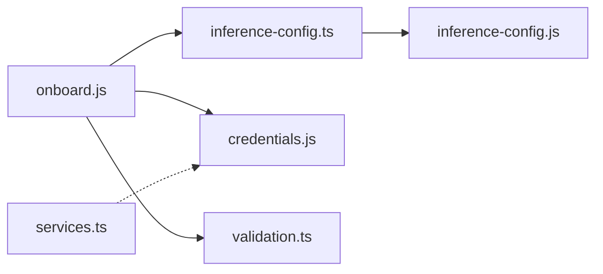

# Provider Configuration

<cite>
**Referenced Files in This Document**
- [onboard.js](file://bin/lib/onboard.js)
- [inference-config.ts](file://src/lib/inference-config.ts)
- [inference-config.js](file://bin/lib/inference-config.js)
- [credentials.js](file://bin/lib/credentials.js)
- [validation.ts](file://src/lib/validation.ts)
- [services.ts](file://src/lib/services.ts)
- [inference-options.md](file://docs/inference/inference-options.md)
- [switch-inference-providers.md](file://docs/inference/switch-inference-providers.md)
- [use-local-inference.md](file://docs/inference/use-local-inference.md)
- [troubleshooting.md](file://docs/reference/troubleshooting.md)
</cite>

## Table of Contents
1. [Introduction](#introduction)
2. [Project Structure](#project-structure)
3. [Core Components](#core-components)
4. [Architecture Overview](#architecture-overview)
5. [Detailed Component Analysis](#detailed-component-analysis)
6. [Dependency Analysis](#dependency-analysis)
7. [Performance Considerations](#performance-considerations)
8. [Troubleshooting Guide](#troubleshooting-guide)
9. [Conclusion](#conclusion)
10. [Appendices](#appendices)

## Introduction
This document explains how to set up and manage inference providers in NemoClaw. It covers provider selection during onboarding, model catalog integration, runtime switching, and provider-specific configuration. It also details credential management, environment variables, validation processes, and best practices for secure storage. Cost optimization, rate limiting, and provider-specific limitations are addressed to help you operate efficiently and reliably.

## Project Structure
Provider configuration spans several modules:
- Onboarding wizard orchestrates provider selection, model prompts, and validation.
- Inference configuration maps provider identifiers to endpoint URLs, default models, and credential environment variables.
- Credential manager handles secure storage and retrieval of API keys.
- Validation utilities classify failures and guide recovery.
- Documentation pages describe provider options, runtime switching, and local inference setups.

**Diagram sources**
- [onboard.js:105-170](file://bin/lib/onboard.js#L105-L170)
- [inference-config.ts:26-115](file://src/lib/inference-config.ts#L26-L115)
- [inference-config.js:1-7](file://bin/lib/inference-config.js#L1-L7)
- [credentials.js:58-91](file://bin/lib/credentials.js#L58-L91)
- [validation.ts:20-48](file://src/lib/validation.ts#L20-L48)
- [services.ts:255-261](file://src/lib/services.ts#L255-L261)
- [inference-options.md:23-81](file://docs/inference/inference-options.md#L23-L81)
- [switch-inference-providers.md:23-101](file://docs/inference/switch-inference-providers.md#L23-L101)
- [use-local-inference.md:23-232](file://docs/inference/use-local-inference.md#L23-L232)
- [troubleshooting.md:25-277](file://docs/reference/troubleshooting.md#L25-L277)

**Section sources**
- [onboard.js:105-170](file://bin/lib/onboard.js#L105-L170)
- [inference-config.ts:26-115](file://src/lib/inference-config.ts#L26-L115)
- [inference-config.js:1-7](file://bin/lib/inference-config.js#L1-L7)
- [credentials.js:58-91](file://bin/lib/credentials.js#L58-L91)
- [validation.ts:20-48](file://src/lib/validation.ts#L20-L48)
- [services.ts:255-261](file://src/lib/services.ts#L255-L261)
- [inference-options.md:23-81](file://docs/inference/inference-options.md#L23-L81)
- [switch-inference-providers.md:23-101](file://docs/inference/switch-inference-providers.md#L23-L101)
- [use-local-inference.md:23-232](file://docs/inference/use-local-inference.md#L23-L232)
- [troubleshooting.md:25-277](file://docs/reference/troubleshooting.md#L25-L277)

## Core Components
- Provider selection configuration: Maps provider IDs to endpoint URLs, default models, credential environment variables, and labels.
- Onboarding wizard: Presents providers, collects credentials and model choices, validates endpoints, and persists configuration.
- Credential manager: Stores secrets securely under the user’s home directory and reads from environment variables or local storage.
- Validation classifier: Interprets HTTP statuses and messages to determine whether to retry, change credentials, adjust model, or return to selection.
- Services module: Validates presence of required tokens for optional services and warns when prerequisites are missing.

Key responsibilities:
- Provider selection and routing: Provider IDs are mapped to managed routes and validated before sandbox creation.
- Secure credential handling: Credentials are read from environment variables or encrypted local storage and sanitized.
- Recovery workflows: Failures are classified to guide interactive recovery (retry, credential update, model change, or selection change).

**Section sources**
- [inference-config.ts:42-115](file://src/lib/inference-config.ts#L42-L115)
- [onboard.js:105-170](file://bin/lib/onboard.js#L105-L170)
- [credentials.js:58-91](file://bin/lib/credentials.js#L58-L91)
- [validation.ts:20-48](file://src/lib/validation.ts#L20-L48)
- [services.ts:255-261](file://src/lib/services.ts#L255-L261)

## Architecture Overview
NemoClaw routes inference through a managed endpoint. The agent inside the sandbox communicates with a local route; OpenShell forwards traffic to the selected provider. Credentials remain on the host and are never exposed to the sandbox.

**Diagram sources**
- [inference-options.md:29-36](file://docs/inference/inference-options.md#L29-L36)
- [onboard.js:3234-3310](file://bin/lib/onboard.js#L3234-L3310)

**Section sources**
- [inference-options.md:29-36](file://docs/inference/inference-options.md#L29-L36)
- [onboard.js:3234-3310](file://bin/lib/onboard.js#L3234-L3310)

## Detailed Component Analysis

### Provider Selection Workflow
The onboarding wizard presents curated providers and supports custom endpoints. It:
- Prompts for provider selection.
- Collects endpoint URL and model (when applicable).
- Validates endpoints using provider-specific probes.
- Persists provider configuration and applies it to the managed route.

**Diagram sources**
- [onboard.js:1329-1359](file://bin/lib/onboard.js#L1329-L1359)
- [onboard.js:1393-1452](file://bin/lib/onboard.js#L1393-L1452)
- [onboard.js:3234-3310](file://bin/lib/onboard.js#L3234-L3310)
- [credentials.js:58-91](file://bin/lib/credentials.js#L58-L91)

**Section sources**
- [onboard.js:1329-1359](file://bin/lib/onboard.js#L1329-L1359)
- [onboard.js:1393-1452](file://bin/lib/onboard.js#L1393-L1452)
- [onboard.js:3234-3310](file://bin/lib/onboard.js#L3234-L3310)
- [credentials.js:58-91](file://bin/lib/credentials.js#L58-L91)

### Provider-Specific Configuration and Parameters
- NVIDIA Endpoints
  - Environment variable: NVIDIA_API_KEY
  - Endpoint URL: build.nvidia.com
  - Default model: curated selection
  - Validation: Catalog-based model validation
- OpenAI
  - Environment variable: OPENAI_API_KEY
  - Endpoint URL: api.openai.com
  - Default model: curated selection
  - Validation: Endpoint probing
- Anthropic
  - Environment variable: ANTHROPIC_API_KEY
  - Endpoint URL: api.anthropic.com
  - Default model: curated selection
  - Validation: Messages API probe
- Google Gemini
  - Environment variable: GEMINI_API_KEY
  - Endpoint URL: generativelanguage.googleapis.com/v1beta/openai/
  - Default model: curated selection
  - Validation: Endpoint probing
- OpenAI-compatible endpoint
  - Environment variable: COMPATIBLE_API_KEY
  - Endpoint URL: user-provided
  - Model input: user-provided
  - Validation: Real inference request
- Anthropic-compatible endpoint
  - Environment variable: COMPATIBLE_ANTHROPIC_API_KEY
  - Endpoint URL: user-provided
  - Model input: user-provided
  - Validation: Messages API probe

Provider mapping and defaults are defined centrally and consumed by the onboarding wizard and managed route.

**Section sources**
- [inference-config.ts:42-115](file://src/lib/inference-config.ts#L42-L115)
- [onboard.js:105-170](file://bin/lib/onboard.js#L105-L170)
- [inference-options.md:38-52](file://docs/inference/inference-options.md#L38-L52)

### Credential Management and Authentication Tokens
- Reading credentials:
  - Environment variables take precedence.
  - Otherwise, credentials are read from a secure local JSON file under the user’s home directory.
- Secure storage:
  - Directory and file are created with restrictive permissions.
  - Values are normalized and trimmed.
- Specialized flows:
  - NVIDIA API key ensures a specific prefix and is persisted locally.
  - GitHub token can be auto-detected via CLI or prompted.

**Diagram sources**
- [credentials.js:58-91](file://bin/lib/credentials.js#L58-L91)
- [credentials.js:217-256](file://bin/lib/credentials.js#L217-L256)

**Section sources**
- [credentials.js:58-91](file://bin/lib/credentials.js#L58-L91)
- [credentials.js:217-256](file://bin/lib/credentials.js#L217-L256)

### Validation Processes and Recovery
- Classification:
  - Transport errors (rate limits, 5xx) suggest retry.
  - 401/403 indicate credential issues.
  - 400 or “model not found” indicates model issues.
  - 404/405 suggests endpoint mismatch; return to selection.
  - General unauthorized/forbidden messages imply credential fixes.
- Recovery prompts:
  - Retry, credential update, model change, or return to selection.
- Endpoint validation:
  - OpenAI-like: tries alternative endpoints when probing fails.
  - Anthropic: probes messages endpoint.
  - Custom endpoints: sends a real inference request to validate compatibility.

**Diagram sources**
- [validation.ts:20-48](file://src/lib/validation.ts#L20-L48)
- [onboard.js:1329-1359](file://bin/lib/onboard.js#L1329-L1359)
- [onboard.js:1424-1452](file://bin/lib/onboard.js#L1424-L1452)

**Section sources**
- [validation.ts:20-48](file://src/lib/validation.ts#L20-L48)
- [onboard.js:1329-1359](file://bin/lib/onboard.js#L1329-L1359)
- [onboard.js:1424-1452](file://bin/lib/onboard.js#L1424-L1452)

### Step-by-Step Setup Instructions

- NVIDIA Endpoints
  - Set environment variable: NVIDIA_API_KEY
  - Select provider during onboarding; optionally enter a model from the catalog
  - Validation checks model against catalog
  - Apply configuration to managed route

- OpenAI
  - Set environment variable: OPENAI_API_KEY
  - Select provider; choose a curated model or enter a custom model
  - Validation probes endpoint availability

- Anthropic
  - Set environment variable: ANTHROPIC_API_KEY
  - Select provider; choose a curated model or enter a custom model
  - Validation probes messages endpoint

- Google Gemini
  - Set environment variable: GEMINI_API_KEY
  - Select provider; choose a curated model
  - Validation probes endpoint availability

- OpenAI-Compatible Endpoint
  - Set environment variable: COMPATIBLE_API_KEY
  - Provide base URL and model during onboarding
  - Validation sends a real inference request

- Anthropic-Compatible Endpoint
  - Set environment variable: COMPATIBLE_ANTHROPIC_API_KEY
  - Provide base URL and model during onboarding
  - Validation probes messages endpoint

- Local Inference (Ollama, vLLM, NIM)
  - Follow local inference documentation for server setup and detection
  - Use managed route for local endpoints

**Section sources**
- [inference-options.md:38-52](file://docs/inference/inference-options.md#L38-L52)
- [use-local-inference.md:38-232](file://docs/inference/use-local-inference.md#L38-L232)
- [onboard.js:105-170](file://bin/lib/onboard.js#L105-L170)

### Provider Catalog Integration and Model Resolution
- Curated providers supply model lists; onboarding validates against these catalogs.
- Custom endpoints allow free-form model entries; validation sends a real request to confirm compatibility.
- Managed provider ID prefixes models for internal routing.

**Section sources**
- [inference-options.md:44-52](file://docs/inference/inference-options.md#L44-L52)
- [inference-config.ts:117-121](file://src/lib/inference-config.ts#L117-L121)

### Provider Switching Mechanisms
- Runtime switching uses the managed route to change the active provider and model without restarting the sandbox.
- Use the documented commands to set provider and model; verify with status.

**Section sources**
- [switch-inference-providers.md:33-96](file://docs/inference/switch-inference-providers.md#L33-L96)

### Cost Optimization and Rate Limiting
- Prefer curated models and endpoints with known quotas.
- Monitor transport failures and adjust retry behavior accordingly.
- Use local inference for high-volume, low-latency scenarios when appropriate.

**Section sources**
- [validation.ts:29-31](file://src/lib/validation.ts#L29-L31)
- [inference-options.md:65-76](file://docs/inference/inference-options.md#L65-L76)

### Best Practices for Secure Credential Storage
- Store credentials in environment variables or the secure local store.
- Avoid committing secrets to repositories.
- Use short-lived tokens when possible and rotate regularly.

**Section sources**
- [credentials.js:75-84](file://bin/lib/credentials.js#L75-L84)
- [credentials.js:217-256](file://bin/lib/credentials.js#L217-L256)

## Dependency Analysis
Provider configuration depends on:
- Inference configuration mapping provider IDs to endpoints and defaults.
- Onboarding wizard orchestrating prompts, validation, and application.
- Credential manager for secure storage and retrieval.
- Validation utilities for failure classification and recovery.

**Diagram sources**
- [onboard.js:35-37](file://bin/lib/onboard.js#L35-L37)
- [inference-config.ts:26-115](file://src/lib/inference-config.ts#L26-L115)
- [inference-config.js:1-7](file://bin/lib/inference-config.js#L1-L7)
- [credentials.js:58-91](file://bin/lib/credentials.js#L58-L91)
- [validation.ts:20-48](file://src/lib/validation.ts#L20-L48)
- [services.ts:255-261](file://src/lib/services.ts#L255-L261)

**Section sources**
- [onboard.js:35-37](file://bin/lib/onboard.js#L35-L37)
- [inference-config.ts:26-115](file://src/lib/inference-config.ts#L26-L115)
- [inference-config.js:1-7](file://bin/lib/inference-config.js#L1-L7)
- [credentials.js:58-91](file://bin/lib/credentials.js#L58-L91)
- [validation.ts:20-48](file://src/lib/validation.ts#L20-L48)
- [services.ts:255-261](file://src/lib/services.ts#L255-L261)

## Performance Considerations
- Prefer local inference for latency-sensitive tasks when hardware permits.
- Use curated models to reduce validation overhead.
- Avoid unnecessary retries by ensuring correct endpoint URLs and models.

[No sources needed since this section provides general guidance]

## Troubleshooting Guide
Common issues and resolutions:
- Inference requests timeout: Verify active provider and endpoint; check network policy rules; confirm credentials and base URL.
- Sandbox shows “not running” inside the sandbox: Check host-side sandbox state externally.
- Port conflicts during onboarding: Resolve conflicting processes and retry.
- Out-of-memory during image push: Add swap or upgrade memory.

**Section sources**
- [troubleshooting.md:244-255](file://docs/reference/troubleshooting.md#L244-L255)
- [troubleshooting.md:108-121](file://docs/reference/troubleshooting.md#L108-L121)
- [troubleshooting.md:163-177](file://docs/reference/troubleshooting.md#L163-L177)

## Conclusion
NemoClaw’s provider configuration centers on a managed routing model with strong validation and secure credential handling. By following the provider-specific setup steps, leveraging curated catalogs, and applying best practices for credential storage, you can reliably operate across cloud and local inference environments while optimizing costs and performance.

[No sources needed since this section summarizes without analyzing specific files]

## Appendices

### Provider Configuration Reference
- NVIDIA Endpoints: Environment variable, endpoint URL, curated model list, catalog validation
- OpenAI: Environment variable, endpoint URL, curated model list, endpoint probing
- Anthropic: Environment variable, endpoint URL, curated model list, messages API probe
- Google Gemini: Environment variable, endpoint URL, curated model list, endpoint probing
- OpenAI-compatible: Environment variable, user-provided base URL, user-provided model, real request validation
- Anthropic-compatible: Environment variable, user-provided base URL, user-provided model, messages API probe

**Section sources**
- [inference-options.md:38-52](file://docs/inference/inference-options.md#L38-L52)
- [onboard.js:105-170](file://bin/lib/onboard.js#L105-L170)