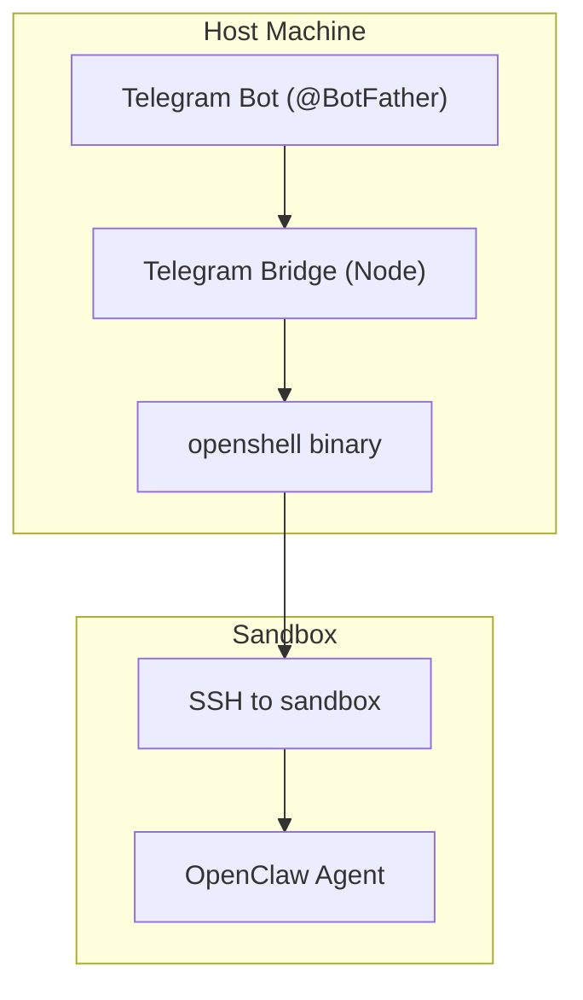
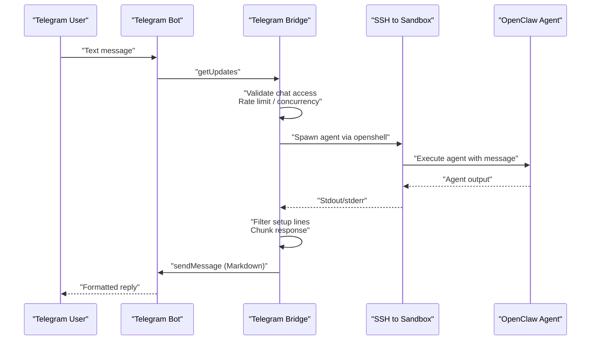
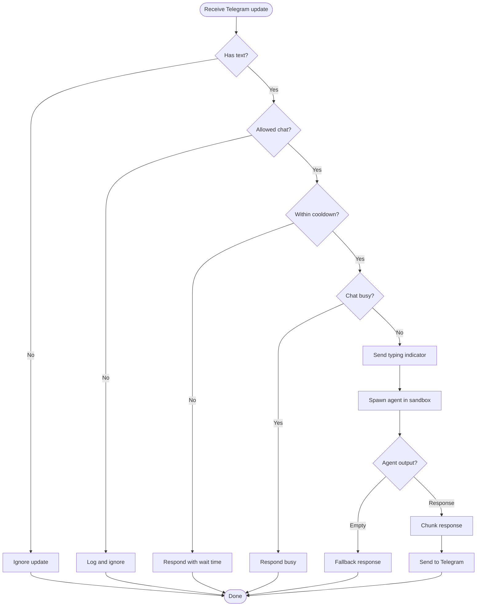
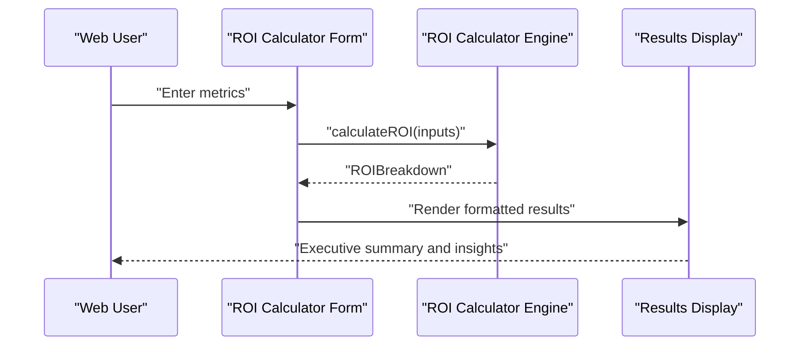
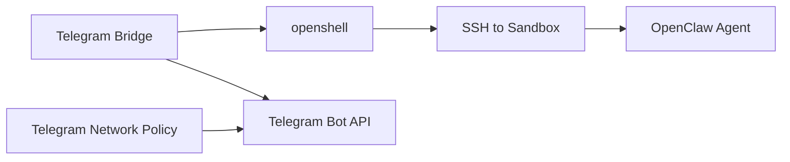

# Messaging Bridges

<cite>
**Referenced Files in This Document**
- [set-up-telegram-bridge.md](file://docs/deployment/set-up-telegram-bridge.md)
- [telegram-bridge.js](file://scripts/telegram-bridge.js)
- [telegram.yaml](file://nemoclaw-blueprint/policies/presets/telegram.yaml)
- [chat-filter.js](file://bin/lib/chat-filter.js)
- [chat-filter.ts](file://src/lib/chat-filter.ts)
- [runner.js](file://bin/lib/runner.js)
- [resolve-openshell.js](file://bin/lib/resolve-openshell.js)
- [resolve-openshell.ts](file://src/lib/resolve-openshell.ts)
- [roi-calculator.ts](file://milp-platform/src/lib/roi-calculator.ts)
- [roi-calculator-form.tsx](file://milp-platform/src/components/roi-calculator-form.tsx)
</cite>

## Table of Contents
1. [Introduction](#introduction)
2. [Project Structure](#project-structure)
3. [Core Components](#core-components)
4. [Architecture Overview](#architecture-overview)
5. [Detailed Component Analysis](#detailed-component-analysis)
6. [Dependency Analysis](#dependency-analysis)
7. [Performance Considerations](#performance-considerations)
8. [Troubleshooting Guide](#troubleshooting-guide)
9. [Conclusion](#conclusion)
10. [Appendices](#appendices)

## Introduction
This document explains NemoClaw’s messaging bridges with a focus on the Telegram bridge. It covers setup, configuration, message routing, formatting, attachments, responses, and security. It also documents the ROI calculator web interface integration and real-time communication features, including rate limiting, concurrency control, and operational troubleshooting.

## Project Structure
The Telegram bridge is implemented as a Node.js service that polls Telegram updates, validates access, and executes agent commands inside the sandbox via SSH. Network policy and sandbox access are governed by the blueprint. The web-based ROI calculator is part of the milp-platform Next.js application.

**Diagram sources**
- [telegram-bridge.js:1-276](file://scripts/telegram-bridge.js#L1-L276)
- [resolve-openshell.ts:1-60](file://src/lib/resolve-openshell.ts#L1-L60)

**Section sources**
- [set-up-telegram-bridge.md:23-97](file://docs/deployment/set-up-telegram-bridge.md#L23-L97)
- [telegram-bridge.js:1-276](file://scripts/telegram-bridge.js#L1-L276)

## Core Components
- Telegram Bridge: Polls Telegram for updates, enforces access control, rate limits, and concurrency, and executes agent commands inside the sandbox.
- Access Control: Chat ID allowlist parsing and enforcement.
- Sandbox Execution: Resolves openshell, builds SSH command, and streams agent output.
- Network Policy: Blueprint preset for Telegram Bot API access.
- Web Interface Integration: ROI calculator form and engine for real-time financial impact calculations.

**Section sources**
- [telegram-bridge.js:1-276](file://scripts/telegram-bridge.js#L1-L276)
- [chat-filter.ts:1-25](file://src/lib/chat-filter.ts#L1-L25)
- [resolve-openshell.ts:1-60](file://src/lib/resolve-openshell.ts#L1-L60)
- [telegram.yaml:1-23](file://nemoclaw-blueprint/policies/presets/telegram.yaml#L1-L23)
- [roi-calculator-form.tsx:1-208](file://milp-platform/src/components/roi-calculator-form.tsx#L1-L208)
- [roi-calculator.ts:1-323](file://milp-platform/src/lib/roi-calculator.ts#L1-L323)

## Architecture Overview
The Telegram bridge acts as a thin proxy between Telegram and the OpenClaw agent inside the sandbox. It authenticates via a Telegram bot token, optionally restricts chats by ID, and forwards sanitized messages to the agent. Responses are chunked and sent back to Telegram with Markdown rendering and fallback handling.

**Diagram sources**
- [telegram-bridge.js:162-247](file://scripts/telegram-bridge.js#L162-L247)
- [telegram-bridge.js:98-158](file://scripts/telegram-bridge.js#L98-L158)

## Detailed Component Analysis

### Telegram Bridge Setup and Configuration
- Prerequisites: Running sandbox and a Telegram bot token from BotFather.
- Environment variables:
  - TELEGRAM_BOT_TOKEN: Required for Telegram API access.
  - NVIDIA_API_KEY: Required for inference.
  - SANDBOX_NAME: Optional sandbox identifier (validated).
  - ALLOWED_CHAT_IDS: Optional comma-separated list of chat IDs to permit.
- Starting services: The bridge starts automatically when the required environment variables are present during the start command.

Operational highlights:
- Polling: Periodic polling with offset tracking and a bounded timeout.
- Typing indicators: Sent periodically while the agent is processing.
- Rate limiting: Per-chat cooldown to reduce spam.
- Concurrency control: Single active session per chat at a time.
- Session reset: Supports resetting chat sessions via a command.

Security and safety:
- Access control: Enforced via parsed allowlist; unset allowlist accepts all chats.
- Sandbox isolation: Agent executed inside the sandbox via openshell and SSH.
- Credential handling: Uses shell quoting and avoids embedding secrets in command strings.

**Section sources**
- [set-up-telegram-bridge.md:28-97](file://docs/deployment/set-up-telegram-bridge.md#L28-L97)
- [telegram-bridge.js:31-38](file://scripts/telegram-bridge.js#L31-L38)
- [telegram-bridge.js:162-247](file://scripts/telegram-bridge.js#L162-L247)
- [telegram-bridge.js:98-158](file://scripts/telegram-bridge.js#L98-L158)

### Message Routing and Processing
- Incoming updates: Filtered by presence of text; unsupported attachments are ignored.
- Access control: Enforced before processing.
- Typing indicators: Sent immediately and periodically while processing.
- Agent execution: Builds a safe command with environment variables and message content, then spawns SSH to sandbox.
- Output filtering: Removes setup/installation lines and trims whitespace.
- Response handling: Splits long responses into chunks respecting Telegram’s message size limit and retries without Markdown if initial send fails.

**Diagram sources**
- [telegram-bridge.js:162-247](file://scripts/telegram-bridge.js#L162-L247)
- [telegram-bridge.js:73-90](file://scripts/telegram-bridge.js#L73-L90)

**Section sources**
- [telegram-bridge.js:162-247](file://scripts/telegram-bridge.js#L162-L247)
- [telegram-bridge.js:73-90](file://scripts/telegram-bridge.js#L73-L90)

### Message Formatting and Attachments
- Formatting: Messages are sent with Markdown enabled and split into chunks of 4000 characters. If Markdown parsing fails, the bridge retries without Markdown.
- Attachments: Only text messages are processed; media and other attachments are not handled by this bridge.

**Section sources**
- [telegram-bridge.js:73-90](file://scripts/telegram-bridge.js#L73-L90)

### Bridge Configuration Options and Authentication
- Required environment variables:
  - TELEGRAM_BOT_TOKEN
  - NVIDIA_API_KEY
- Optional environment variables:
  - SANDBOX_NAME
  - ALLOWED_CHAT_IDS
- Authentication with Telegram: Uses Bot Token for API calls.
- Sandbox authentication: Relies on openshell and SSH configuration resolved at runtime.

**Section sources**
- [telegram-bridge.js:31-38](file://scripts/telegram-bridge.js#L31-L38)
- [resolve-openshell.ts:22-59](file://src/lib/resolve-openshell.ts#L22-L59)

### Security Considerations
- Access control: Enforce ALLOWED_CHAT_IDS to restrict who can message the agent.
- Credential protection: Secrets are passed via environment and quoted arguments; logging is redacted.
- Network policy: Telegram Bot API endpoints are permitted with enforced TLS termination.
- Sandbox execution: Uses openshell to establish a controlled SSH session to the sandbox.

**Section sources**
- [telegram-bridge.js:35-38](file://scripts/telegram-bridge.js#L35-L38)
- [runner.js:84-154](file://bin/lib/runner.js#L84-L154)
- [telegram.yaml:8-23](file://nemoclaw-blueprint/policies/presets/telegram.yaml#L8-L23)

### Custom Messaging Integrations and Multi-Channel Strategies
- Extending the bridge: Add new channels by implementing a similar polling/forwarding pattern with channel-specific authentication and message normalization.
- Message transformation: Normalize incoming messages (e.g., strip HTML, sanitize Markdown) before invoking the agent.
- Multi-channel orchestration: Route messages to a shared agent backend while preserving per-channel formatting and attachment handling.

[No sources needed since this section provides general guidance]

### ROI Calculator Web Interface Integration
The milp-platform includes a real-time ROI calculator integrated into the web UI:
- Form validation and defaults: React component validates inputs and provides sensible defaults.
- Calculation engine: Computes recoverable revenue, leakage, and annualized savings with configurable recovery rates and GCC benchmarks.
- Real-time feedback: Users can adjust inputs and see immediate results.

**Diagram sources**
- [roi-calculator-form.tsx:28-208](file://milp-platform/src/components/roi-calculator-form.tsx#L28-L208)
- [roi-calculator.ts:103-193](file://milp-platform/src/lib/roi-calculator.ts#L103-L193)

**Section sources**
- [roi-calculator-form.tsx:1-208](file://milp-platform/src/components/roi-calculator-form.tsx#L1-L208)
- [roi-calculator.ts:1-323](file://milp-platform/src/lib/roi-calculator.ts#L1-L323)

## Dependency Analysis
The Telegram bridge depends on:
- Telegram Bot API for receiving and sending messages.
- openshell for resolving the sandbox SSH configuration and spawning agent commands.
- Sandbox for executing the OpenClaw agent.
- Network policy to allow outbound Telegram Bot API access.

**Diagram sources**
- [telegram-bridge.js:25-29](file://scripts/telegram-bridge.js#L25-L29)
- [telegram-bridge.js:100-116](file://scripts/telegram-bridge.js#L100-L116)
- [telegram.yaml:8-23](file://nemoclaw-blueprint/policies/presets/telegram.yaml#L8-L23)

**Section sources**
- [telegram-bridge.js:25-29](file://scripts/telegram-bridge.js#L25-L29)
- [telegram-bridge.js:100-116](file://scripts/telegram-bridge.js#L100-L116)
- [telegram.yaml:8-23](file://nemoclaw-blueprint/policies/presets/telegram.yaml#L8-L23)

## Performance Considerations
- Polling interval: The bridge polls with a 1-second floor to avoid tight loops.
- Message chunking: Long responses are split to respect Telegram’s message size limit.
- Typing indicators: Periodic updates improve perceived responsiveness.
- Concurrency: Single active session per chat prevents resource contention.

[No sources needed since this section provides general guidance]

## Troubleshooting Guide
Common issues and remedies:
- Missing environment variables: Ensure TELEGRAM_BOT_TOKEN and NVIDIA_API_KEY are set.
- Access denied: If a chat is not in ALLOWED_CHAT_IDS, messages are ignored; update the allowlist.
- Rate-limited: Wait for the cooldown period before sending another message.
- Busy chat: If the previous message is still being processed, wait for completion.
- Agent errors: Inspect sandbox logs via openshell terminal; the bridge reports exit codes and stderr snippets.
- Network policy: Confirm the Telegram Bot API endpoints are allowed by the blueprint.

**Section sources**
- [telegram-bridge.js:37-38](file://scripts/telegram-bridge.js#L37-L38)
- [telegram-bridge.js:175-179](file://scripts/telegram-bridge.js#L175-L179)
- [telegram-bridge.js:207-211](file://scripts/telegram-bridge.js#L207-L211)
- [telegram-bridge.js:213-218](file://scripts/telegram-bridge.js#L213-L218)
- [telegram-bridge.js:147-151](file://scripts/telegram-bridge.js#L147-L151)
- [telegram.yaml:8-23](file://nemoclaw-blueprint/policies/presets/telegram.yaml#L8-L23)

## Conclusion
The Telegram bridge provides a secure, rate-controlled pathway from Telegram to the OpenClaw agent inside the sandbox. With access control, message chunking, and robust error handling, it supports reliable remote agent chat. The web-based ROI calculator complements the system by enabling real-time financial impact assessments directly from the UI.

## Appendices

### Access Control Utilities
- Chat ID parsing and validation are implemented in TypeScript and exposed via a JavaScript shim for Node usage.

**Section sources**
- [chat-filter.ts:8-24](file://src/lib/chat-filter.ts#L8-L24)
- [chat-filter.js:4-7](file://bin/lib/chat-filter.js#L4-L7)

### Sandbox Resolution
- The openshell binary location is resolved using a deterministic search order and validated for executability.

**Section sources**
- [resolve-openshell.ts:22-59](file://src/lib/resolve-openshell.ts#L22-L59)
- [resolve-openshell.js:4-7](file://bin/lib/resolve-openshell.js#L4-L7)