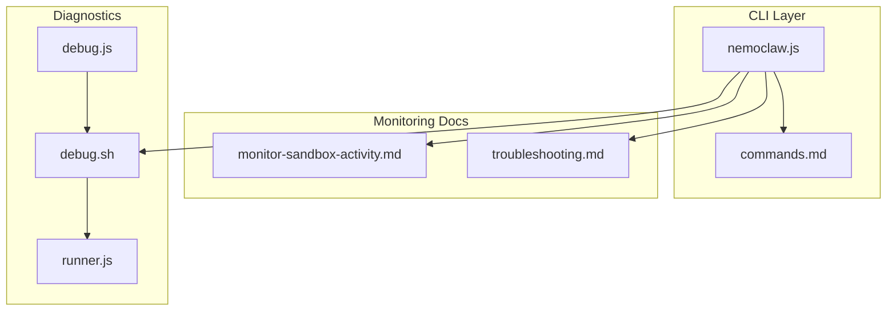
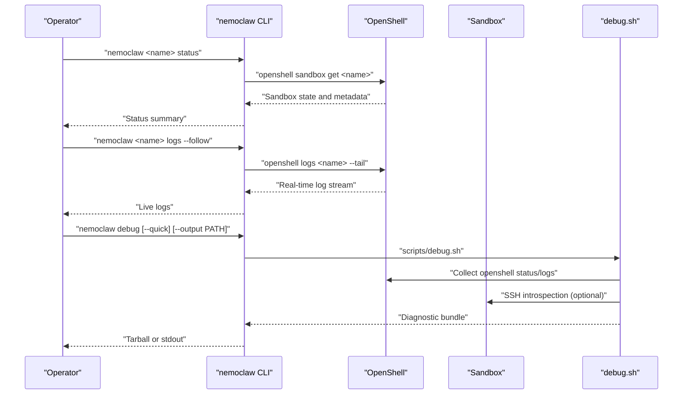
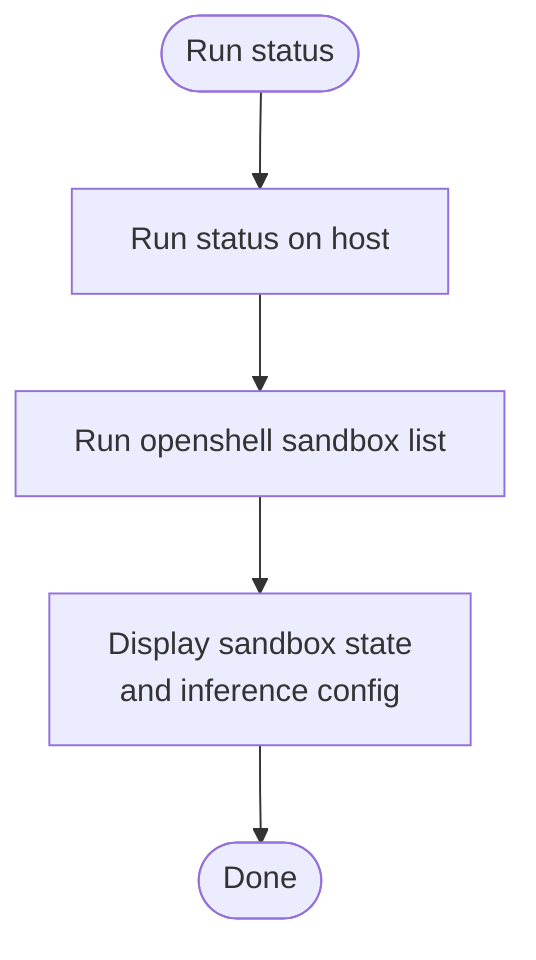
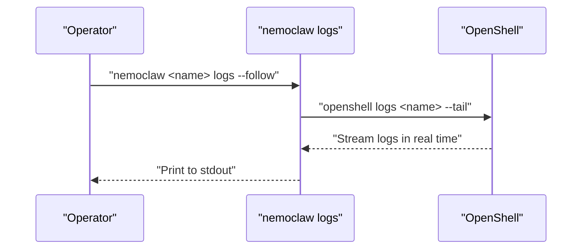
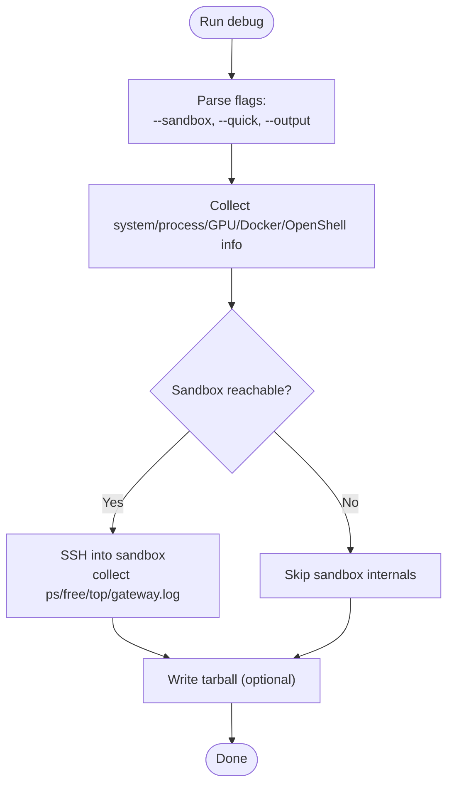
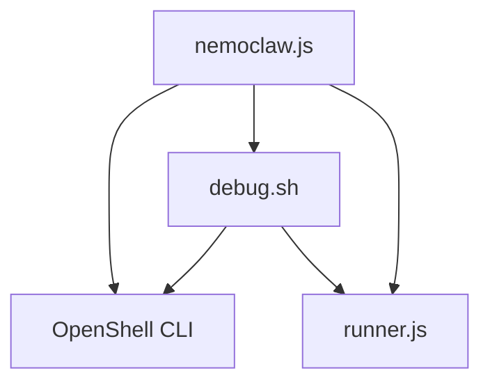
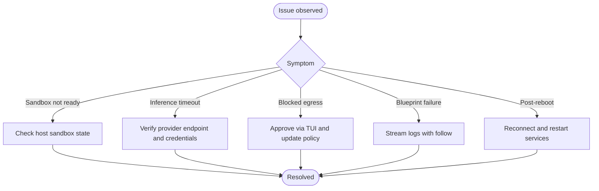

# Monitoring and Debugging

<cite>
**Referenced Files in This Document**
- [README.md](file://README.md)
- [monitor-sandbox-activity.md](file://docs/monitoring/monitor-sandbox-activity.md)
- [troubleshooting.md](file://docs/reference/troubleshooting.md)
- [commands.md](file://docs/reference/commands.md)
- [nemoclaw.js](file://bin/nemoclaw.js)
- [debug.sh](file://scripts/debug.sh)
- [runner.js](file://bin/lib/runner.js)
- [debug.js](file://bin/lib/debug.js)
</cite>

## Table of Contents
1. [Introduction](#introduction)
2. [Project Structure](#project-structure)
3. [Core Components](#core-components)
4. [Architecture Overview](#architecture-overview)
5. [Detailed Component Analysis](#detailed-component-analysis)
6. [Dependency Analysis](#dependency-analysis)
7. [Performance Considerations](#performance-considerations)
8. [Troubleshooting Guide](#troubleshooting-guide)
9. [Conclusion](#conclusion)
10. [Appendices](#appendices)

## Introduction
This document explains how to observe and troubleshoot NemoClaw deployments with a focus on CLI-driven status monitoring, real-time log streaming, and integrated diagnostics. It covers:
- How to monitor sandbox health and activity using CLI commands
- How to stream logs in real time with follow options
- How to collect diagnostics for bug reports
- How to interpret common errors and resolve typical issues
- How to track resource usage and identify performance bottlenecks
- How to integrate monitoring with external tools and set up alerts
- Best practices for proactive maintenance and escalation

## Project Structure
NemoClaw’s observability and diagnostics span three main areas:
- CLI commands for status, logs, and diagnostics
- Documentation for monitoring and troubleshooting
- Scripts and libraries that implement diagnostics and secure log streaming

**Diagram sources**
- [nemoclaw.js:1137-1165](file://bin/nemoclaw.js#L1137-L1165)
- [monitor-sandbox-activity.md:32-95](file://docs/monitoring/monitor-sandbox-activity.md#L32-L95)
- [troubleshooting.md:25-277](file://docs/reference/troubleshooting.md#L25-L277)
- [commands.md:137-244](file://docs/reference/commands.md#L137-L244)
- [debug.sh:1-356](file://scripts/debug.sh#L1-L356)
- [runner.js:1-207](file://bin/lib/runner.js#L1-L207)
- [debug.js:1-5](file://bin/lib/debug.js#L1-L5)

**Section sources**
- [README.md:25-132](file://README.md#L25-L132)
- [monitor-sandbox-activity.md:23-102](file://docs/monitoring/monitor-sandbox-activity.md#L23-L102)
- [troubleshooting.md:25-277](file://docs/reference/troubleshooting.md#L25-L277)
- [commands.md:23-275](file://docs/reference/commands.md#L23-L275)
- [nemoclaw.js:1137-1165](file://bin/nemoclaw.js#L1137-L1165)
- [debug.sh:1-356](file://scripts/debug.sh#L1-L356)
- [runner.js:1-207](file://bin/lib/runner.js#L1-L207)
- [debug.js:1-5](file://bin/lib/debug.js#L1-L5)

## Core Components
- Status monitoring: Use the status command to inspect sandbox state, blueprint run information, and active inference configuration.
- Log streaming: Use the logs command with follow to stream real-time output from the blueprint runner and sandbox.
- Diagnostics: Use the debug command to collect system info, Docker state, gateway logs, and sandbox status into a summary or tarball.

Key references:
- Status command and examples: [commands.md:137-143](file://docs/reference/commands.md#L137-L143)
- Logs streaming with follow: [monitor-sandbox-activity.md:50-61](file://docs/monitoring/monitor-sandbox-activity.md#L50-L61)
- Debug diagnostics: [commands.md:236-244](file://docs/reference/commands.md#L236-L244), [debug.sh:1-356](file://scripts/debug.sh#L1-L356)

**Section sources**
- [commands.md:137-152](file://docs/reference/commands.md#L137-L152)
- [monitor-sandbox-activity.md:32-61](file://docs/monitoring/monitor-sandbox-activity.md#L32-L61)
- [commands.md:236-244](file://docs/reference/commands.md#L236-L244)
- [debug.sh:1-356](file://scripts/debug.sh#L1-L356)

## Architecture Overview
The monitoring and debugging flow integrates CLI commands, OpenShell, and diagnostic scripts.

**Diagram sources**
- [nemoclaw.js:1137-1165](file://bin/nemoclaw.js#L1137-L1165)
- [monitor-sandbox-activity.md:32-61](file://docs/monitoring/monitor-sandbox-activity.md#L32-L61)
- [commands.md:236-244](file://docs/reference/commands.md#L236-L244)
- [debug.sh:1-356](file://scripts/debug.sh#L1-L356)

## Detailed Component Analysis

### Status Monitoring via CLI
- Purpose: Inspect sandbox health, blueprint run ID, and active inference configuration.
- Usage: Run the status command on the host; use OpenShell sandbox list for underlying details.
- Output highlights: Sandbox state, blueprint run ID, inference provider and endpoint.

References:
- Status command usage: [commands.md:137-143](file://docs/reference/commands.md#L137-L143)
- Host vs. sandbox context: [monitor-sandbox-activity.md:32-48](file://docs/monitoring/monitor-sandbox-activity.md#L32-L48)

**Diagram sources**
- [commands.md:137-143](file://docs/reference/commands.md#L137-L143)
- [monitor-sandbox-activity.md:32-48](file://docs/monitoring/monitor-sandbox-activity.md#L32-L48)

**Section sources**
- [commands.md:137-143](file://docs/reference/commands.md#L137-L143)
- [monitor-sandbox-activity.md:32-48](file://docs/monitoring/monitor-sandbox-activity.md#L32-L48)

### Real-Time Log Streaming with Follow
- Purpose: Stream live logs from the blueprint runner and sandbox for immediate visibility.
- Usage: Use logs with follow to continuously read new entries; without follow, prints recent logs and exits.
- Compatibility: Requires a compatible OpenShell version supporting live streaming.

References:
- Logs command and follow flag: [monitor-sandbox-activity.md:50-61](file://docs/monitoring/monitor-sandbox-activity.md#L50-L61)
- CLI logs command reference: [commands.md:145-152](file://docs/reference/commands.md#L145-L152)
- Compatibility guidance: [nemoclaw.js:742-751](file://bin/nemoclaw.js#L742-L751)

**Diagram sources**
- [monitor-sandbox-activity.md:50-61](file://docs/monitoring/monitor-sandbox-activity.md#L50-L61)
- [commands.md:145-152](file://docs/reference/commands.md#L145-L152)
- [nemoclaw.js:1137-1165](file://bin/nemoclaw.js#L1137-L1165)

**Section sources**
- [monitor-sandbox-activity.md:50-61](file://docs/monitoring/monitor-sandbox-activity.md#L50-L61)
- [commands.md:145-152](file://docs/reference/commands.md#L145-L152)
- [nemoclaw.js:742-751](file://bin/nemoclaw.js#L742-L751)
- [nemoclaw.js:1137-1165](file://bin/nemoclaw.js#L1137-L1165)

### Diagnostics Collection for Bug Reports
- Purpose: Gather system info, Docker state, gateway logs, and sandbox status for triage.
- Usage: Run debug with optional quick mode and output path; produces a tarball for attaching to issues.
- Scope: Includes system basics, processes, GPU, Docker, OpenShell, onboard session, and sandbox internals (when reachable).

References:
- Debug command reference: [commands.md:236-244](file://docs/reference/commands.md#L236-L244)
- Diagnostic script: [debug.sh:1-356](file://scripts/debug.sh#L1-L356)
- Wrapper module: [debug.js:1-5](file://bin/lib/debug.js#L1-L5)

**Diagram sources**
- [commands.md:236-244](file://docs/reference/commands.md#L236-L244)
- [debug.sh:1-356](file://scripts/debug.sh#L1-L356)

**Section sources**
- [commands.md:236-244](file://docs/reference/commands.md#L236-L244)
- [debug.sh:1-356](file://scripts/debug.sh#L1-L356)
- [debug.js:1-5](file://bin/lib/debug.js#L1-L5)

### Integrated Logging Utilities and Redaction
- Purpose: Provide secure logging and redaction to protect secrets in logs and error output.
- Features: Secret redaction patterns, URL sanitization, and redacted stdout/stderr printing.

References:
- Redaction and redacted output: [runner.js:79-168](file://bin/lib/runner.js#L79-L168)

**Section sources**
- [runner.js:79-168](file://bin/lib/runner.js#L79-L168)

## Dependency Analysis
- CLI depends on OpenShell for sandbox inspection and log streaming.
- Debugging relies on the diagnostic script and optional SSH access to the sandbox.
- Redaction utilities are reused across CLI and diagnostics.

**Diagram sources**
- [nemoclaw.js:83-108](file://bin/nemoclaw.js#L83-L108)
- [debug.sh:276-298](file://scripts/debug.sh#L276-L298)
- [runner.js:1-207](file://bin/lib/runner.js#L1-L207)

**Section sources**
- [nemoclaw.js:83-108](file://bin/nemoclaw.js#L83-L108)
- [debug.sh:276-298](file://scripts/debug.sh#L276-L298)
- [runner.js:1-207](file://bin/lib/runner.js#L1-L207)

## Performance Considerations
- Monitor resource usage: Use the diagnostics script to collect GPU utilization, Docker stats, and process lists for quick capacity assessments.
- Identify bottlenecks: Combine live logs with process and GPU telemetry to correlate spikes in CPU, memory, or GPU usage with inference or network events.
- Optimize throughput: Reduce unnecessary log verbosity during normal operation; rely on targeted diagnostics when investigating performance regressions.

[No sources needed since this section provides general guidance]

## Troubleshooting Guide
Common scenarios and resolutions:
- Sandbox shows “not running” inside the sandbox: This is expected; check host-side state with OpenShell sandbox list.
  - References: [monitor-sandbox-activity.md:236-242](file://docs/monitoring/monitor-sandbox-activity.md#L236-L242)
- Inference requests time out: Verify provider endpoint reachability and credentials; check active provider and endpoint via status.
  - References: [monitor-sandbox-activity.md:244-254](file://docs/monitoring/monitor-sandbox-activity.md#L244-L254)
- Agent cannot reach external host: Use the TUI to approve blocked requests; adjust network policies as needed.
  - References: [monitor-sandbox-activity.md:256-266](file://docs/monitoring/monitor-sandbox-activity.md#L256-L266)
- Blueprint run failed: Review logs with follow to locate the failure cause.
  - References: [monitor-sandbox-activity.md:268-276](file://docs/monitoring/monitor-sandbox-activity.md#L268-L276)
- Reconnect after host reboot: Start container runtime, ensure gateway is healthy, reconnect, and restart auxiliary services if needed.
  - References: [troubleshooting.md:181-222](file://docs/reference/troubleshooting.md#L181-L222)

**Diagram sources**
- [monitor-sandbox-activity.md:236-276](file://docs/monitoring/monitor-sandbox-activity.md#L236-L276)
- [troubleshooting.md:181-222](file://docs/reference/troubleshooting.md#L181-L222)

**Section sources**
- [monitor-sandbox-activity.md:236-276](file://docs/monitoring/monitor-sandbox-activity.md#L236-L276)
- [troubleshooting.md:181-222](file://docs/reference/troubleshooting.md#L181-L222)

## Conclusion
NemoClaw provides a cohesive set of CLI-driven monitoring and debugging tools:
- Use status and logs to continuously observe sandbox health and behavior.
- Use debug to collect comprehensive diagnostics for issues.
- Apply the troubleshooting guidance to quickly isolate and resolve common problems.
- Integrate these capabilities with external monitoring and alerting systems for proactive maintenance.

[No sources needed since this section summarizes without analyzing specific files]

## Appendices

### Practical Examples
- Monitor sandbox health: Run the status command on the host and cross-check with OpenShell sandbox list.
  - References: [commands.md:137-143](file://docs/reference/commands.md#L137-L143), [monitor-sandbox-activity.md:32-48](file://docs/monitoring/monitor-sandbox-activity.md#L32-L48)
- Stream logs in real time: Use logs with follow to watch live output.
  - References: [monitor-sandbox-activity.md:50-61](file://docs/monitoring/monitor-sandbox-activity.md#L50-L61), [commands.md:145-152](file://docs/reference/commands.md#L145-L152)
- Collect diagnostics: Run debug with quick mode for minimal data or output to a tarball for support.
  - References: [commands.md:236-244](file://docs/reference/commands.md#L236-L244), [debug.sh:1-356](file://scripts/debug.sh#L1-L356)

### Alerting and Proactive Maintenance
- Alerting: Tailor alerts to frequent status changes, repeated errors in logs, or sustained high CPU/GPU usage captured by diagnostics.
- Proactive maintenance: Periodically run diagnostics to establish baselines; schedule log reviews during onboarding and policy changes.

[No sources needed since this section provides general guidance]