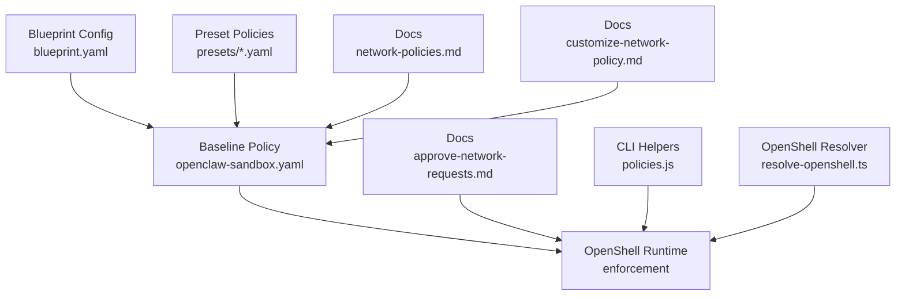
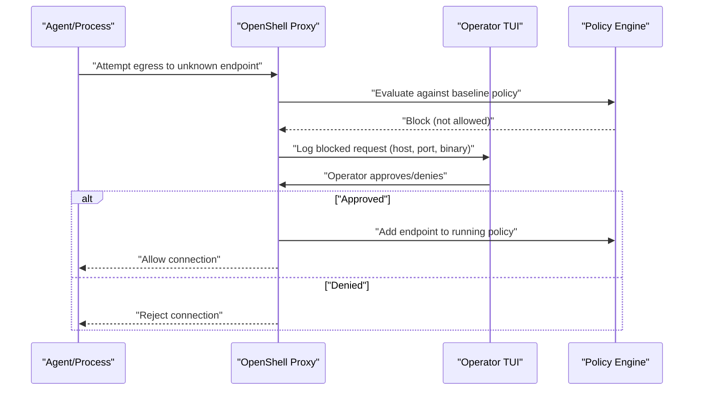
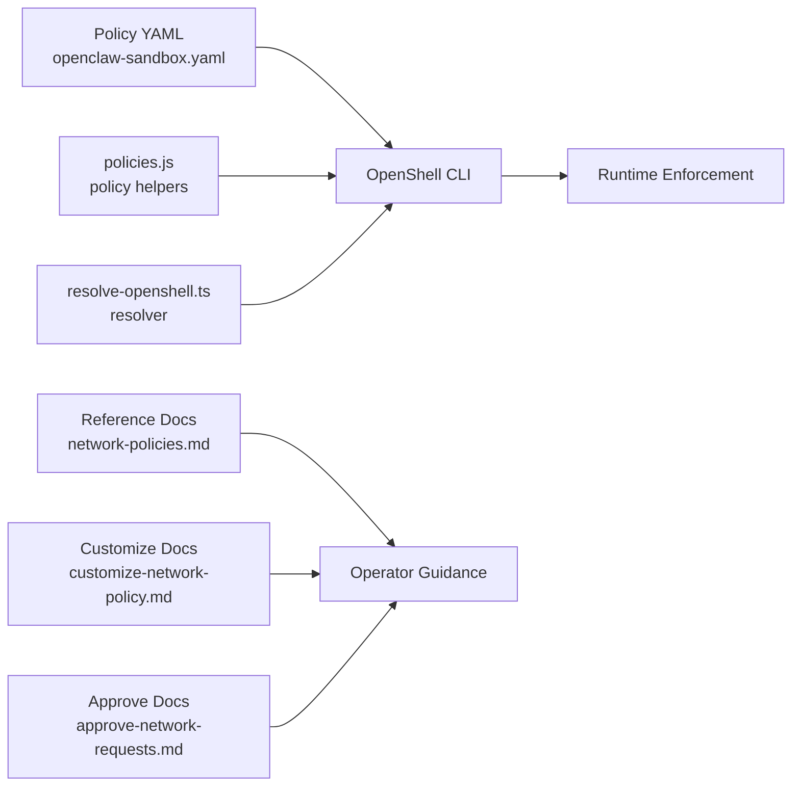

# Baseline Policy Configuration

<cite>
**Referenced Files in This Document**
- [openclaw-sandbox.yaml](file://nemoclaw-blueprint/policies/openclaw-sandbox.yaml)
- [blueprint.yaml](file://nemoclaw-blueprint/blueprint.yaml)
- [network-policies.md](file://docs/reference/network-policies.md)
- [customize-network-policy.md](file://docs/network-policy/customize-network-policy.md)
- [approve-network-requests.md](file://docs/network-policy/approve-network-requests.md)
- [telegram.yaml](file://nemoclaw-blueprint/policies/presets/telegram.yaml)
- [discord.yaml](file://nemoclaw-blueprint/policies/presets/discord.yaml)
- [huggingface.yaml](file://nemoclaw-blueprint/policies/presets/huggingface.yaml)
- [pypi.yaml](file://nemoclaw-blueprint/policies/presets/pypi.yaml)
- [npm.yaml](file://nemoclaw-blueprint/policies/presets/npm.yaml)
- [best-practices.md](file://docs/security/best-practices.md)
- [policies.js](file://bin/lib/policies.js)
- [resolve-openshell.ts](file://src/lib/resolve-openshell.ts)
</cite>

## Table of Contents
1. [Introduction](#introduction)
2. [Project Structure](#project-structure)
3. [Core Components](#core-components)
4. [Architecture Overview](#architecture-overview)
5. [Detailed Component Analysis](#detailed-component-analysis)
6. [Dependency Analysis](#dependency-analysis)
7. [Performance Considerations](#performance-considerations)
8. [Troubleshooting Guide](#troubleshooting-guide)
9. [Conclusion](#conclusion)
10. [Appendices](#appendices)

## Introduction
This document explains the baseline network policy configuration for the NemoClaw sandbox. It covers the deny-by-default approach, strict egress controls enforced by OpenShell, filesystem access rules, predefined endpoint groups, Landlock LSM enforcement, and practical guidance for editing policies and troubleshooting blocked connections.

## Project Structure
The baseline policy is defined in a declarative YAML file and enforced by OpenShell at runtime. Supporting documentation and presets provide additional context and examples.

**Diagram sources**
- [blueprint.yaml:57-66](file://nemoclaw-blueprint/blueprint.yaml#L57-L66)
- [openclaw-sandbox.yaml:1-219](file://nemoclaw-blueprint/policies/openclaw-sandbox.yaml#L1-L219)
- [network-policies.md:23-145](file://docs/reference/network-policies.md#L23-L145)
- [customize-network-policy.md:23-130](file://docs/network-policy/customize-network-policy.md#L23-L130)
- [approve-network-requests.md:23-84](file://docs/network-policy/approve-network-requests.md#L23-L84)
- [policies.js:73-111](file://bin/lib/policies.js#L73-L111)
- [resolve-openshell.ts:16-59](file://src/lib/resolve-openshell.ts#L16-L59)

**Section sources**
- [blueprint.yaml:57-66](file://nemoclaw-blueprint/blueprint.yaml#L57-L66)
- [openclaw-sandbox.yaml:1-219](file://nemoclaw-blueprint/policies/openclaw-sandbox.yaml#L1-L219)
- [network-policies.md:23-145](file://docs/reference/network-policies.md#L23-L145)
- [customize-network-policy.md:23-130](file://docs/network-policy/customize-network-policy.md#L23-L130)
- [approve-network-requests.md:23-84](file://docs/network-policy/approve-network-requests.md#L23-L84)
- [policies.js:73-111](file://bin/lib/policies.js#L73-L111)
- [resolve-openshell.ts:16-59](file://src/lib/resolve-openshell.ts#L16-L59)

## Core Components
- Deny-by-default network policy: Only explicitly allowed endpoints and methods are permitted. Unknown destinations are intercepted and require operator approval.
- Strict egress controls: Enforced by OpenShell at runtime; operators approve or deny requests in real time.
- Filesystem access: Read-only and read-write paths define what the sandbox can access. The sandbox runs under a dedicated user and group.
- Landlock LSM: Kernel-level filesystem enforcement applied on a best-effort basis.
- Predefined endpoint groups: Claude Code, NVIDIA, GitHub, GitHub REST API, ClawHub, OpenClaw API, OpenClaw Docs, npm Registry, and Telegram.

**Section sources**
- [network-policies.md:25-42](file://docs/reference/network-policies.md#L25-L42)
- [openclaw-sandbox.yaml:18-44](file://nemoclaw-blueprint/policies/openclaw-sandbox.yaml#L18-L44)

## Architecture Overview
The policy is defined statically and enforced by OpenShell. Operators can approve or deny requests in real time, and dynamic policy updates can be applied to a running sandbox.

**Diagram sources**
- [network-policies.md:110-119](file://docs/reference/network-policies.md#L110-L119)
- [approve-network-requests.md:23-67](file://docs/network-policy/approve-network-requests.md#L23-L67)

## Detailed Component Analysis

### Deny-by-default and Operator Approval Flow
- The sandbox uses a deny-by-default policy. Any outbound request to an unlisted host is intercepted.
- The TUI displays blocked requests with host, port, and the requesting binary. Operators can approve or deny per-request.
- Approved endpoints are added to the running policy for the current session only.

**Section sources**
- [network-policies.md:25-27](file://docs/reference/network-policies.md#L25-L27)
- [network-policies.md:110-119](file://docs/reference/network-policies.md#L110-L119)
- [approve-network-requests.md:23-67](file://docs/network-policy/approve-network-requests.md#L23-L67)

### Filesystem Access Rules
- Read-write paths: Includes workspace, temporary storage, and device nodes necessary for operation.
- Read-only paths: System directories and logs to prevent tampering and limit exposure.
- The sandbox runs under a dedicated user and group for least privilege.

**Section sources**
- [openclaw-sandbox.yaml:18-44](file://nemoclaw-blueprint/policies/openclaw-sandbox.yaml#L18-L44)
- [network-policies.md:33-41](file://docs/reference/network-policies.md#L33-L41)

### Landlock LSM Enforcement
- Landlock is applied on a best-effort basis. If supported by the kernel, filesystem access is enforced at the kernel level; otherwise, enforcement falls back to container-level mount configuration.

**Section sources**
- [openclaw-sandbox.yaml:39-40](file://nemoclaw-blueprint/policies/openclaw-sandbox.yaml#L39-L40)
- [best-practices.md:258-267](file://docs/security/best-practices.md#L258-L267)

### Predefined Endpoint Groups
The baseline policy includes the following endpoint groups, each with allowed hosts, optional HTTP method/path rules, and allowed binaries.

- claude_code
  - Hosts: Multiple endpoints used by the Claude client.
  - Allowed binaries: The Claude client binary.
  - HTTP rules: All methods allowed.
  - Enforcement: Enforced at TLS-terminating proxy.

- nvidia
  - Hosts: NVIDIA inference APIs.
  - Allowed binaries: Claude client and OpenClaw CLI.
  - HTTP rules: All methods allowed.
  - Enforcement: Enforced at TLS-terminating proxy.

- github
  - Hosts: GitHub and GitHub API.
  - Allowed binaries: Git and GitHub CLI.
  - HTTP rules: Full access allowed.
  - Enforcement: Not restricted by method/path in this group.

- github_rest_api
  - Host: GitHub REST API.
  - Allowed binaries: GitHub CLI.
  - HTTP rules: Standard REST methods allowed.
  - Enforcement: Not restricted by method/path in this group.

- clawhub
  - Host: ClawHub.
  - Allowed binaries: OpenClaw CLI and Node.js.
  - HTTP rules: GET and POST allowed.
  - Enforcement: Enforced at TLS-terminating proxy.

- openclaw_api
  - Host: OpenClaw API.
  - Allowed binaries: OpenClaw CLI and Node.js.
  - HTTP rules: GET and POST allowed.
  - Enforcement: Enforced at TLS-terminating proxy.

- openclaw_docs
  - Host: OpenClaw Docs.
  - Allowed binaries: OpenClaw CLI.
  - HTTP rules: GET only.
  - Enforcement: Enforced at TLS-terminating proxy.

- npm_registry
  - Host: npm registry.
  - Allowed binaries: OpenClaw CLI, npm, and Node.js.
  - HTTP rules: Full access allowed.
  - Enforcement: Not restricted by method/path in this group.

- telegram
  - Host: Telegram Bot API.
  - Allowed binaries: Node.js.
  - HTTP rules: GET and POST on bot-specific paths.
  - Enforcement: Enforced at TLS-terminating proxy.

Notes:
- All endpoints listed above use TLS termination at port 443 and are enforced by the proxy.
- Some groups use method/path rules; others permit full access as indicated.

**Section sources**
- [openclaw-sandbox.yaml:46-219](file://nemoclaw-blueprint/policies/openclaw-sandbox.yaml#L46-L219)
- [network-policies.md:43-101](file://docs/reference/network-policies.md#L43-L101)

### Policy Definition Syntax and Relationship to Runtime Enforcement
- The policy is defined in YAML and loaded by OpenShell at runtime.
- Static changes require updating the baseline policy file and re-running the onboard wizard.
- Dynamic changes can be applied to a running sandbox using the OpenShell CLI.

Key syntax highlights:
- Version and top-level keys define policy metadata and structure.
- Filesystem policy specifies read-only and read-write paths and whether the workspace is included.
- Process policy sets the sandbox user and group.
- Network policies define endpoint groups with hosts, ports, protocols, enforcement modes, TLS behavior, optional HTTP rules, and allowed binaries.

**Section sources**
- [openclaw-sandbox.yaml:16-219](file://nemoclaw-blueprint/policies/openclaw-sandbox.yaml#L16-L219)
- [customize-network-policy.md:35-96](file://docs/network-policy/customize-network-policy.md#L35-L96)
- [network-policies.md:128-145](file://docs/reference/network-policies.md#L128-L145)

### Rule Precedence and Dynamic Updates
- Static policy changes take effect after the next sandbox creation.
- Dynamic updates apply to the current session only; they do not alter the baseline policy file.
- Approved endpoints during a session remain active until the sandbox stops.

**Section sources**
- [customize-network-policy.md:72-96](file://docs/network-policy/customize-network-policy.md#L72-L96)
- [network-policies.md:110-119](file://docs/reference/network-policies.md#L110-L119)

### Practical Examples of Common Baseline Scenarios
- Approving a blocked request:
  - Use the TUI to review and approve or deny the request.
  - Approved endpoints are added to the running policy for the session.
- Adding a new endpoint group:
  - Define the group in the baseline policy file and re-run the onboard wizard for static changes.
  - Alternatively, create a separate policy file and apply it dynamically to the running sandbox.
- Extending access for development tools:
  - Add registry endpoints and associated binaries to the policy file for persistent changes.
  - For temporary needs, apply a preset or a custom policy file dynamically.

**Section sources**
- [approve-network-requests.md:23-77](file://docs/network-policy/approve-network-requests.md#L23-L77)
- [customize-network-policy.md:35-96](file://docs/network-policy/customize-network-policy.md#L35-L96)
- [telegram.yaml:8-23](file://nemoclaw-blueprint/policies/presets/telegram.yaml#L8-L23)
- [discord.yaml:8-47](file://nemoclaw-blueprint/policies/presets/discord.yaml#L8-L47)
- [huggingface.yaml:8-38](file://nemoclaw-blueprint/policies/presets/huggingface.yaml#L8-L38)
- [pypi.yaml:8-27](file://nemoclaw-blueprint/policies/presets/pypi.yaml#L8-L27)
- [npm.yaml:8-25](file://nemoclaw-blueprint/policies/presets/npm.yaml#L8-L25)

## Dependency Analysis
The policy depends on OpenShell for enforcement and on documentation for operator guidance. CLI helpers assist in building and parsing policy commands.

**Diagram sources**
- [openclaw-sandbox.yaml:16-219](file://nemoclaw-blueprint/policies/openclaw-sandbox.yaml#L16-L219)
- [network-policies.md:23-145](file://docs/reference/network-policies.md#L23-L145)
- [customize-network-policy.md:23-130](file://docs/network-policy/customize-network-policy.md#L23-L130)
- [approve-network-requests.md:23-84](file://docs/network-policy/approve-network-requests.md#L23-L84)
- [policies.js:73-111](file://bin/lib/policies.js#L73-L111)
- [resolve-openshell.ts:16-59](file://src/lib/resolve-openshell.ts#L16-L59)

**Section sources**
- [policies.js:73-111](file://bin/lib/policies.js#L73-L111)
- [resolve-openshell.ts:16-59](file://src/lib/resolve-openshell.ts#L16-L59)

## Performance Considerations
- OpenShell’s proxy and enforcement occur at the kernel boundary, minimizing overhead for allowed traffic.
- Limiting allowed endpoints reduces the attack surface and improves predictability.
- Prefer static policy changes for frequently used endpoints to avoid repeated dynamic updates.

[No sources needed since this section provides general guidance]

## Troubleshooting Guide
Common issues and resolutions:
- Blocked connection prompts:
  - Review the TUI for details about the blocked request and approve or deny accordingly.
- Applying policy changes:
  - For static changes, edit the baseline policy file and re-run the onboard wizard.
  - For dynamic changes, apply a policy file to the running sandbox using the OpenShell CLI.
- Verifying policy state:
  - Use the OpenShell CLI to fetch the current policy and confirm applied changes.
- Preset usage:
  - Apply a preset as a starting point for common integrations, then adjust as needed.

**Section sources**
- [approve-network-requests.md:23-77](file://docs/network-policy/approve-network-requests.md#L23-L77)
- [customize-network-policy.md:35-96](file://docs/network-policy/customize-network-policy.md#L35-L96)
- [policies.js:73-111](file://bin/lib/policies.js#L73-L111)

## Conclusion
NemoClaw’s baseline policy enforces strict egress controls through OpenShell with a deny-by-default model. The filesystem is locked down with explicit read-only and read-write paths, and Landlock LSM is applied when available. Predefined endpoint groups cover essential integrations, and operators can approve or deny requests in real time. Static and dynamic policy updates enable both persistent and session-scoped changes.

[No sources needed since this section summarizes without analyzing specific files]

## Appendices

### Appendix A: Policy File Relationship to Blueprint
- The blueprint references the baseline policy file and can include additional endpoints for specific use cases (e.g., local inference services).

**Section sources**
- [blueprint.yaml:57-66](file://nemoclaw-blueprint/blueprint.yaml#L57-L66)

### Appendix B: Example Presets
- Telegram, Discord, Hugging Face, PyPI, and npm presets demonstrate how to configure endpoints, enforcement, and allowed binaries for common integrations.

**Section sources**
- [telegram.yaml:8-23](file://nemoclaw-blueprint/policies/presets/telegram.yaml#L8-L23)
- [discord.yaml:8-47](file://nemoclaw-blueprint/policies/presets/discord.yaml#L8-L47)
- [huggingface.yaml:8-38](file://nemoclaw-blueprint/policies/presets/huggingface.yaml#L8-L38)
- [pypi.yaml:8-27](file://nemoclaw-blueprint/policies/presets/pypi.yaml#L8-L27)
- [npm.yaml:8-25](file://nemoclaw-blueprint/policies/presets/npm.yaml#L8-L25)