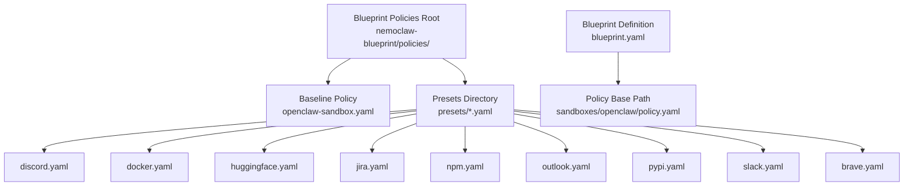
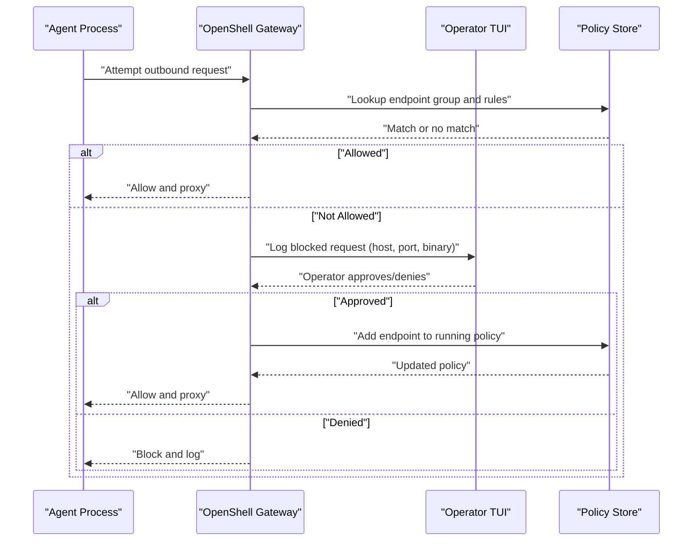
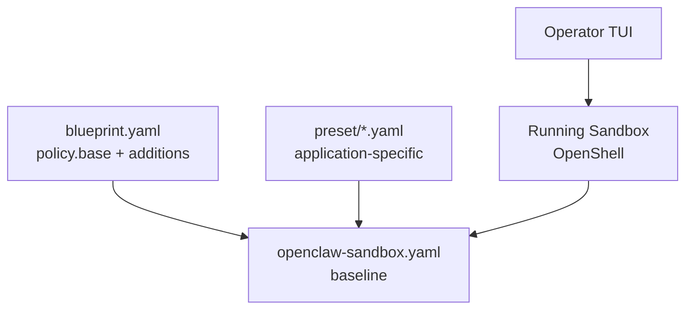

# Network Policies

<cite>
**Referenced Files in This Document**
- [openclaw-sandbox.yaml](file://nemoclaw-blueprint/policies/openclaw-sandbox.yaml)
- [discord.yaml](file://nemoclaw-blueprint/policies/presets/discord.yaml)
- [docker.yaml](file://nemoclaw-blueprint/policies/presets/docker.yaml)
- [huggingface.yaml](file://nemoclaw-blueprint/policies/presets/huggingface.yaml)
- [jira.yaml](file://nemoclaw-blueprint/policies/presets/jira.yaml)
- [npm.yaml](file://nemoclaw-blueprint/policies/presets/npm.yaml)
- [outlook.yaml](file://nemoclaw-blueprint/policies/presets/outlook.yaml)
- [pypi.yaml](file://nemoclaw-blueprint/policies/presets/pypi.yaml)
- [slack.yaml](file://nemoclaw-blueprint/policies/presets/slack.yaml)
- [brave.yaml](file://nemoclaw-blueprint/policies/presets/brave.yaml)
- [blueprint.yaml](file://nemoclaw-blueprint/blueprint.yaml)
- [network-policies.md](file://docs/reference/network-policies.md)
- [customize-network-policy.md](file://docs/network-policy/customize-network-policy.md)
- [approve-network-requests.md](file://docs/network-policy/approve-network-requests.md)
</cite>

## Table of Contents
1. [Introduction](#introduction)
2. [Project Structure](#project-structure)
3. [Core Components](#core-components)
4. [Architecture Overview](#architecture-overview)
5. [Detailed Component Analysis](#detailed-component-analysis)
6. [Dependency Analysis](#dependency-analysis)
7. [Performance Considerations](#performance-considerations)
8. [Troubleshooting Guide](#troubleshooting-guide)
9. [Conclusion](#conclusion)
10. [Appendices](#appendices)

## Introduction
This document explains NemoClaw’s network isolation and egress control mechanisms. It covers the baseline network policy definitions, the operator approval workflow for network requests, and how dynamic policies are applied at runtime. It also documents preset policies for common applications, customization techniques, static and dynamic policy updates, YAML syntax, rule precedence, conflict resolution, and practical troubleshooting and monitoring approaches.

## Project Structure
NemoClaw’s network policy system is defined in a declarative YAML format and enforced by OpenShell at runtime. The baseline policy resides in the blueprint under a dedicated policies directory. Preset policies for common integrations are provided as separate YAML files that can be applied statically or dynamically.

**Diagram sources**
- [openclaw-sandbox.yaml](file://nemoclaw-blueprint/policies/openclaw-sandbox.yaml)
- [discord.yaml](file://nemoclaw-blueprint/policies/presets/discord.yaml)
- [docker.yaml](file://nemoclaw-blueprint/policies/presets/docker.yaml)
- [huggingface.yaml](file://nemoclaw-blueprint/policies/presets/huggingface.yaml)
- [jira.yaml](file://nemoclaw-blueprint/policies/presets/jira.yaml)
- [npm.yaml](file://nemoclaw-blueprint/policies/presets/npm.yaml)
- [outlook.yaml](file://nemoclaw-blueprint/policies/presets/outlook.yaml)
- [pypi.yaml](file://nemoclaw-blueprint/policies/presets/pypi.yaml)
- [slack.yaml](file://nemoclaw-blueprint/policies/presets/slack.yaml)
- [brave.yaml](file://nemoclaw-blueprint/policies/presets/brave.yaml)
- [blueprint.yaml](file://nemoclaw-blueprint/blueprint.yaml)

**Section sources**
- [openclaw-sandbox.yaml](file://nemoclaw-blueprint/policies/openclaw-sandbox.yaml)
- [blueprint.yaml](file://nemoclaw-blueprint/blueprint.yaml)

## Core Components
- Baseline network policy: Defines allowed endpoint groups, endpoints, binaries, and HTTP rules for the sandbox. Enforced at runtime by OpenShell.
- Operator approval flow: When a request targets an unlisted endpoint, OpenShell intercepts it and prompts the operator in the TUI to approve or deny.
- Dynamic policy application: Operators can apply policy updates to a running sandbox without restarting it.
- Preset policies: Predefined YAML files for common integrations (e.g., Discord, Docker, HuggingFace, Jira, NPM, Outlook, PyPI, Slack, Telegram, Brave) that can be merged into the baseline or applied dynamically.

Key characteristics:
- Deny-by-default principle: Only explicitly allowed endpoints are reachable.
- TLS termination enforced at port 443 for REST endpoints.
- Landlock LSM enforcement applied on a best-effort basis.
- Sandbox runs as a dedicated user/group.

**Section sources**
- [network-policies.md](file://docs/reference/network-policies.md)
- [openclaw-sandbox.yaml](file://nemoclaw-blueprint/policies/openclaw-sandbox.yaml)

## Architecture Overview
The policy lifecycle spans three stages: baseline definition, operator approval, and dynamic runtime updates.

**Diagram sources**
- [network-policies.md](file://docs/reference/network-policies.md)
- [approve-network-requests.md](file://docs/network-policy/approve-network-requests.md)

## Detailed Component Analysis

### Baseline Policy: openclaw-sandbox.yaml
The baseline policy defines endpoint groups with associated endpoints, enforcement mode, TLS behavior, and HTTP rules. It also specifies which binaries are permitted to use each group.

Highlights:
- Endpoint groups include Claude, NVIDIA APIs, GitHub/GitHub API, ClawHub, OpenClaw API, OpenClaw Docs, npm registry, Telegram, and Discord.
- Enforcement and TLS fields indicate REST enforcement with TLS termination at port 443.
- HTTP rules support wildcard paths and multiple methods per endpoint.
- Binary lists restrict usage to specific executables.

Example groups and scope:
- Claude code: Anthropic endpoints with broad method/path allowances.
- NVIDIA: Inference and integration endpoints with broad method/path allowances.
- GitHub and GitHub REST API: Full access and constrained methods respectively.
- ClawHub, OpenClaw API, OpenClaw Docs: Controlled GET/POST or GET-only access.
- npm registry: Full access for package management tools.
- Telegram: Restricted to bot-related paths.
- Discord: REST endpoints plus WebSocket gateway requiring full access.

Operational notes:
- Landlock compatibility is configured as best effort.
- Filesystem policy defines read-only and read-write paths and a dedicated sandbox user/group.

**Section sources**
- [openclaw-sandbox.yaml](file://nemoclaw-blueprint/policies/openclaw-sandbox.yaml)

### Preset Policies

#### Discord
- Purpose: Discord API, gateway, and CDN access.
- Includes REST endpoints and WebSocket gateway requiring full access to maintain persistent connections.
- Restricted to Node-based binaries.

**Section sources**
- [discord.yaml](file://nemoclaw-blueprint/policies/presets/discord.yaml)

#### Docker
- Purpose: Docker Hub and NVIDIA container registry access.
- Allows GET/POST to registry endpoints.
- Restricted to Docker binary.

**Section sources**
- [docker.yaml](file://nemoclaw-blueprint/policies/presets/docker.yaml)

#### HuggingFace
- Purpose: Hugging Face Hub, LFS, and Inference API access.
- Allows GET/POST to core endpoints.
- Restricted to Python and Node binaries.

**Section sources**
- [huggingface.yaml](file://nemoclaw-blueprint/policies/presets/huggingface.yaml)

#### Jira
- Purpose: Jira and Atlassian Cloud access.
- Wildcard domain for Atlassian-hosted instances.
- Allows GET/POST to selected endpoints.
- Restricted to Node-based binaries.

**Section sources**
- [jira.yaml](file://nemoclaw-blueprint/policies/presets/jira.yaml)

#### NPM/Yarn
- Purpose: npm and Yarn registry access.
- Full access to registries.
- Applies to npm, npx, node, yarn family binaries.

**Section sources**
- [npm.yaml](file://nemoclaw-blueprint/policies/presets/npm.yaml)

#### Outlook
- Purpose: Microsoft Outlook and Graph API access.
- Allows GET/POST to Graph and related endpoints.
- Restricted to Node-based binaries.

**Section sources**
- [outlook.yaml](file://nemoclaw-blueprint/policies/presets/outlook.yaml)

#### PyPI
- Purpose: Python Package Index access.
- Full access to PyPI and files host.
- Applies to Python and pip family binaries.

**Section sources**
- [pypi.yaml](file://nemoclaw-blueprint/policies/presets/pypi.yaml)

#### Slack
- Purpose: Slack API, Socket Mode, and webhooks access.
- Includes REST endpoints and WebSocket gateways requiring full access.
- Restricted to Node-based binaries.

**Section sources**
- [slack.yaml](file://nemoclaw-blueprint/policies/presets/slack.yaml)

#### Brave
- Purpose: Brave Search API access.
- Allows GET/POST to the search API.
- Restricted to Node-based binaries.

**Section sources**
- [brave.yaml](file://nemoclaw-blueprint/policies/presets/brave.yaml)

### Blueprint Integration
The blueprint defines the base policy path consumed by the sandbox. Additional local endpoints (e.g., a local NIM service) can be added via blueprint additions.

**Section sources**
- [blueprint.yaml](file://nemoclaw-blueprint/blueprint.yaml)

## Dependency Analysis
Policy application depends on the relationship between the blueprint, baseline policy, and preset files.

**Diagram sources**
- [blueprint.yaml](file://nemoclaw-blueprint/blueprint.yaml)
- [openclaw-sandbox.yaml](file://nemoclaw-blueprint/policies/openclaw-sandbox.yaml)
- [discord.yaml](file://nemoclaw-blueprint/policies/presets/discord.yaml)
- [docker.yaml](file://nemoclaw-blueprint/policies/presets/docker.yaml)
- [huggingface.yaml](file://nemoclaw-blueprint/policies/presets/huggingface.yaml)
- [jira.yaml](file://nemoclaw-blueprint/policies/presets/jira.yaml)
- [npm.yaml](file://nemoclaw-blueprint/policies/presets/npm.yaml)
- [outlook.yaml](file://nemoclaw-blueprint/policies/presets/outlook.yaml)
- [pypi.yaml](file://nemoclaw-blueprint/policies/presets/pypi.yaml)
- [slack.yaml](file://nemoclaw-blueprint/policies/presets/slack.yaml)
- [brave.yaml](file://nemoclaw-blueprint/policies/presets/brave.yaml)

## Performance Considerations
- Enforcing CONNECT tunnels for persistent WebSocket connections avoids HTTP idle timeouts and reduces retries.
- REST enforcement with TLS termination at port 443 centralizes proxy behavior and simplifies rule matching.
- Limiting allowed binaries per endpoint group minimizes attack surface and reduces accidental cross-application egress.

[No sources needed since this section provides general guidance]

## Troubleshooting Guide

### Understanding Blocked Connections
- When a request targets an unlisted endpoint, OpenShell intercepts it and logs the attempt in the TUI with host, port, and the requesting binary.
- Approved endpoints are added to the running policy for the current session only.

**Section sources**
- [network-policies.md](file://docs/reference/network-policies.md)
- [approve-network-requests.md](file://docs/network-policy/approve-network-requests.md)

### Approving or Denying Requests
- Open the TUI to review blocked requests and decide whether to approve or deny.
- Approved endpoints remain in the running policy until the sandbox stops; they are not persisted to the baseline.

**Section sources**
- [approve-network-requests.md](file://docs/network-policy/approve-network-requests.md)

### Applying Preset Policies
- To enable a preset (e.g., PyPI) for a running sandbox, apply the preset YAML using the OpenShell CLI.
- To include a preset in the baseline, merge its entries into the baseline policy file and re-run the onboard wizard.

**Section sources**
- [customize-network-policy.md](file://docs/network-policy/customize-network-policy.md)

### Verifying Policy Application
- After applying static or dynamic changes, verify the sandbox status to confirm the updated policy is active.

**Section sources**
- [customize-network-policy.md](file://docs/network-policy/customize-network-policy.md)

### Monitoring and Logging
- Use the TUI to observe sandbox state, active inference provider, and live network activity.
- The TUI surfaces blocked requests with host, port, and binary details for operator review.

**Section sources**
- [approve-network-requests.md](file://docs/network-policy/approve-network-requests.md)

## Conclusion
NemoClaw enforces strict network isolation by default and provides a robust operator approval workflow for dynamic egress decisions. The baseline policy and preset configurations offer a secure foundation, while dynamic policy updates enable flexible, session-scoped adjustments. By combining these mechanisms, operators can balance security and usability across diverse agent workloads.

[No sources needed since this section summarizes without analyzing specific files]

## Appendices

### Policy Customization Techniques
- Static changes: Modify the baseline policy file and re-run the onboard wizard to apply new rules across sandbox lifecycles.
- Dynamic changes: Apply a policy file to a running sandbox using the OpenShell CLI; changes take effect immediately but reset when the sandbox stops.

**Section sources**
- [customize-network-policy.md](file://docs/network-policy/customize-network-policy.md)

### YAML Syntax and Rule Precedence
- Endpoint groups define endpoints, enforcement mode, TLS behavior, and HTTP rules.
- HTTP rules support method/path wildcards; multiple rules can be combined.
- Binary lists restrict which executables can use each endpoint group.
- Conflicts are resolved by the most specific match: a matching endpoint group and binary combination overrides blanket defaults.

**Section sources**
- [openclaw-sandbox.yaml](file://nemoclaw-blueprint/policies/openclaw-sandbox.yaml)
- [customize-network-policy.md](file://docs/network-policy/customize-network-policy.md)

### Practical Scenarios
- Allow Docker pulls: Merge the Docker preset into the baseline or apply it dynamically to enable registry access.
- Enable Slack Socket Mode: Apply the Slack preset to grant WebSocket gateways full access.
- Add PyPI access: Apply the PyPI preset or include full-access endpoints in the baseline for Python tooling.

**Section sources**
- [docker.yaml](file://nemoclaw-blueprint/policies/presets/docker.yaml)
- [slack.yaml](file://nemoclaw-blueprint/policies/presets/slack.yaml)
- [pypi.yaml](file://nemoclaw-blueprint/policies/presets/pypi.yaml)