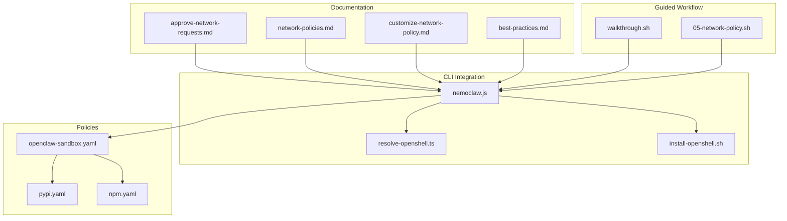
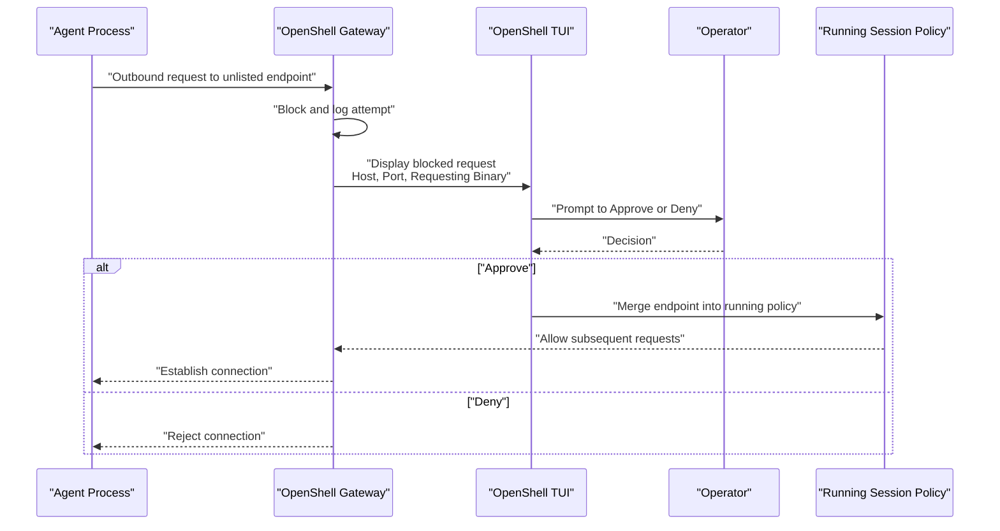
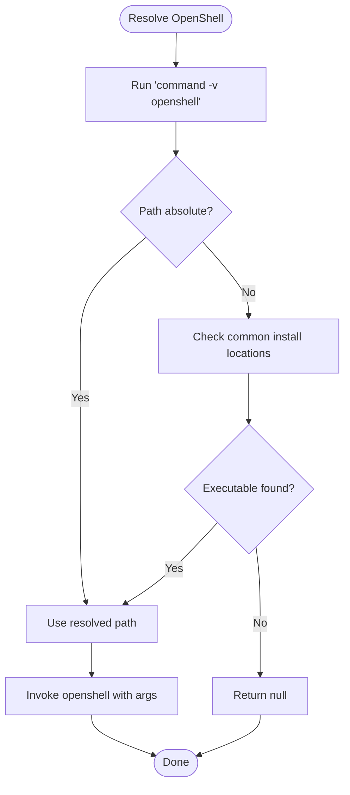
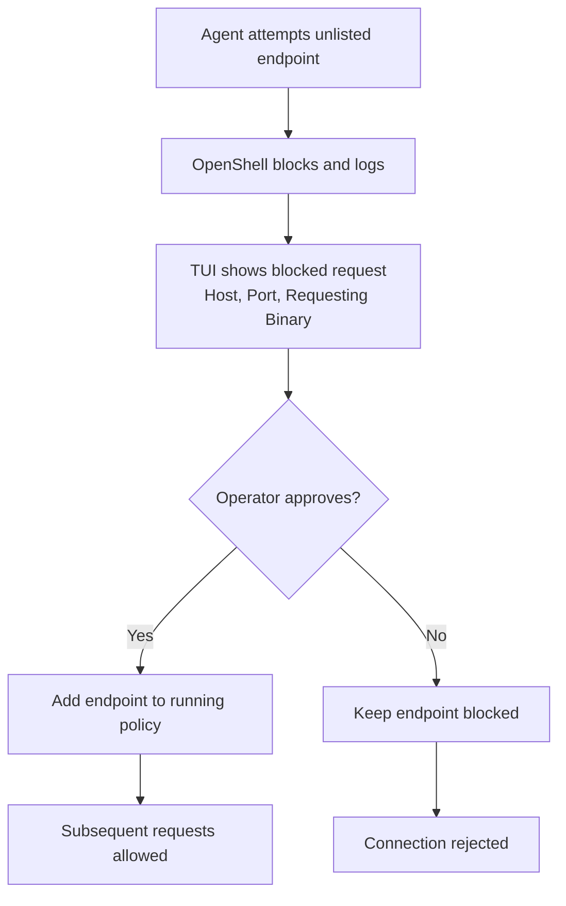
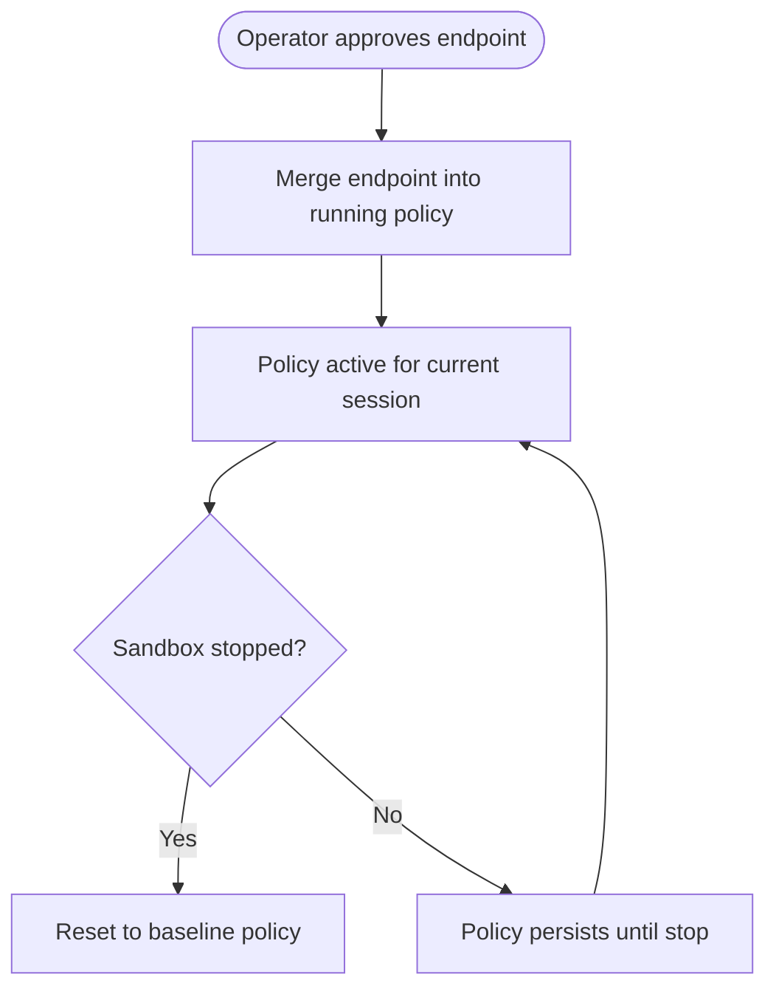
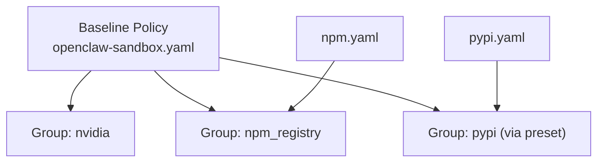
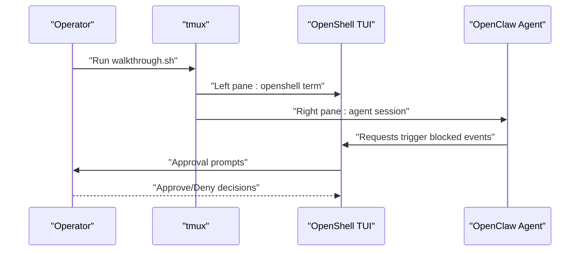
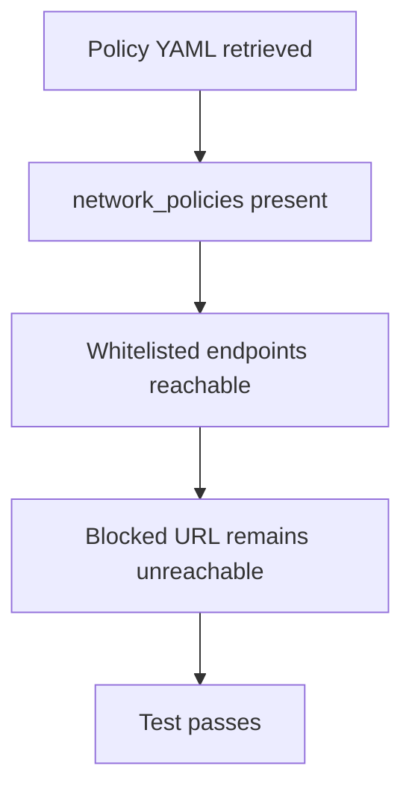
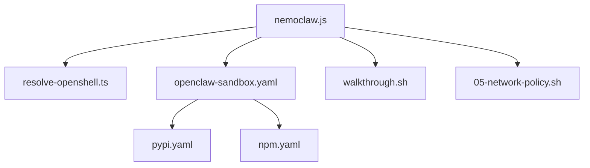

# Operator Approval Workflow

<cite>
**Referenced Files in This Document**
- [approve-network-requests.md](file://docs/network-policy/approve-network-requests.md)
- [walkthrough.sh](file://scripts/walkthrough.sh)
- [network-policies.md](file://docs/reference/network-policies.md)
- [customize-network-policy.md](file://docs/network-policy/customize-network-policy.md)
- [best-practices.md](file://docs/security/best-practices.md)
- [openclaw-sandbox.yaml](file://nemoclaw-blueprint/policies/openclaw-sandbox.yaml)
- [pypi.yaml](file://nemoclaw-blueprint/policies/presets/pypi.yaml)
- [npm.yaml](file://nemoclaw-blueprint/policies/presets/npm.yaml)
- [05-network-policy.sh](file://test/e2e/e2e-cloud-experimental/skip/05-network-policy.sh)
- [resolve-openshell.ts](file://src/lib/resolve-openshell.ts)
- [install-openshell.sh](file://scripts/install-openshell.sh)
- [nemoclaw.js](file://bin/nemoclaw.js)
- [SKILL.md](file://.agents/skills/nemoclaw-manage-policy/SKILL.md)
</cite>

## Table of Contents
1. [Introduction](#introduction)
2. [Project Structure](#project-structure)
3. [Core Components](#core-components)
4. [Architecture Overview](#architecture-overview)
5. [Detailed Component Analysis](#detailed-component-analysis)
6. [Dependency Analysis](#dependency-analysis)
7. [Performance Considerations](#performance-considerations)
8. [Troubleshooting Guide](#troubleshooting-guide)
9. [Conclusion](#conclusion)
10. [Appendices](#appendices)

## Introduction
This document explains the operator approval workflow for real-time network request approvals in NemoClaw. It covers how OpenShell intercepts outbound requests from agents attempting to reach unlisted endpoints, how the TUI presents blocked requests with host, port, and requesting binary information, and how operators approve or deny requests. It also documents the dynamic policy update mechanism that adds approved endpoints to the running session policy, along with practical walkthrough examples, common approval patterns, policy drift management, and best practices for production environments.

## Project Structure
The operator approval workflow spans documentation, CLI integration, sandbox policy definitions, and end-to-end tests. The most relevant areas are:
- Documentation for approval and policy customization
- OpenShell integration and resolution logic
- Sandbox policy baseline and presets
- Walkthrough script for guided sessions
- End-to-end tests validating policy enforcement

**Diagram sources**
- [approve-network-requests.md:1-84](file://docs/network-policy/approve-network-requests.md#L1-L84)
- [network-policies.md:110-145](file://docs/reference/network-policies.md#L110-L145)
- [customize-network-policy.md:1-130](file://docs/network-policy/customize-network-policy.md#L1-L130)
- [best-practices.md:174-194](file://docs/security/best-practices.md#L174-L194)
- [nemoclaw.js:72-183](file://bin/nemoclaw.js#L72-L183)
- [resolve-openshell.ts:1-60](file://src/lib/resolve-openshell.ts#L1-L60)
- [install-openshell.sh:1-128](file://scripts/install-openshell.sh#L1-L128)
- [openclaw-sandbox.yaml:1-219](file://nemoclaw-blueprint/policies/openclaw-sandbox.yaml#L1-L219)
- [pypi.yaml:1-27](file://nemoclaw-blueprint/policies/presets/pypi.yaml#L1-L27)
- [npm.yaml:1-25](file://nemoclaw-blueprint/policies/presets/npm.yaml#L1-L25)
- [walkthrough.sh:1-98](file://scripts/walkthrough.sh#L1-L98)
- [05-network-policy.sh:1-392](file://test/e2e/e2e-cloud-experimental/skip/05-network-policy.sh#L1-L392)

**Section sources**
- [approve-network-requests.md:1-84](file://docs/network-policy/approve-network-requests.md#L1-L84)
- [network-policies.md:110-145](file://docs/reference/network-policies.md#L110-L145)
- [customize-network-policy.md:1-130](file://docs/network-policy/customize-network-policy.md#L1-L130)
- [best-practices.md:174-194](file://docs/security/best-practices.md#L174-L194)
- [nemoclaw.js:72-183](file://bin/nemoclaw.js#L72-L183)
- [resolve-openshell.ts:1-60](file://src/lib/resolve-openshell.ts#L1-L60)
- [install-openshell.sh:1-128](file://scripts/install-openshell.sh#L1-L128)
- [openclaw-sandbox.yaml:1-219](file://nemoclaw-blueprint/policies/openclaw-sandbox.yaml#L1-L219)
- [pypi.yaml:1-27](file://nemoclaw-blueprint/policies/presets/pypi.yaml#L1-L27)
- [npm.yaml:1-25](file://nemoclaw-blueprint/policies/presets/npm.yaml#L1-L25)
- [walkthrough.sh:1-98](file://scripts/walkthrough.sh#L1-L98)
- [05-network-policy.sh:1-392](file://test/e2e/e2e-cloud-experimental/skip/05-network-policy.sh#L1-L392)

## Core Components
- OpenShell CLI integration: Resolves and invokes the OpenShell binary for sandbox operations and TUI access.
- Policy baseline and presets: Define allowed endpoints and binary constraints for sandbox egress.
- Operator TUI: Presents blocked requests with host, port, and requesting binary for approval decisions.
- Dynamic policy updates: Adds approved endpoints to the running session policy without restarting the sandbox.
- Walkthrough and tests: Provide guided sessions and validation of policy enforcement.

**Section sources**
- [nemoclaw.js:72-183](file://bin/nemoclaw.js#L72-L183)
- [resolve-openshell.ts:1-60](file://src/lib/resolve-openshell.ts#L1-L60)
- [openclaw-sandbox.yaml:1-219](file://nemoclaw-blueprint/policies/openclaw-sandbox.yaml#L1-L219)
- [pypi.yaml:1-27](file://nemoclaw-blueprint/policies/presets/pypi.yaml#L1-L27)
- [npm.yaml:1-25](file://nemoclaw-blueprint/policies/presets/npm.yaml#L1-L25)
- [approve-network-requests.md:23-84](file://docs/network-policy/approve-network-requests.md#L23-L84)
- [network-policies.md:110-145](file://docs/reference/network-policies.md#L110-L145)
- [customize-network-policy.md:72-96](file://docs/network-policy/customize-network-policy.md#L72-L96)
- [walkthrough.sh:1-98](file://scripts/walkthrough.sh#L1-L98)
- [05-network-policy.sh:1-392](file://test/e2e/e2e-cloud-experimental/skip/05-network-policy.sh#L1-L392)

## Architecture Overview
The approval workflow is orchestrated by OpenShell at the gateway layer. When an agent attempts to reach an unlisted endpoint, OpenShell blocks the connection, logs the event, and surfaces it in the TUI. Operators can approve or deny the request. Approved endpoints are merged into the running policy for the current session.

**Diagram sources**
- [approve-network-requests.md:49-67](file://docs/network-policy/approve-network-requests.md#L49-L67)
- [network-policies.md:110-119](file://docs/reference/network-policies.md#L110-L119)
- [best-practices.md:181-190](file://docs/security/best-practices.md#L181-L190)

## Detailed Component Analysis

### OpenShell CLI Resolution and Invocation
- The NemoClaw CLI resolves the OpenShell binary path using a deterministic lookup order and executes OpenShell commands for sandbox operations and TUI access.
- It handles version detection and error propagation for failed commands.

**Diagram sources**
- [resolve-openshell.ts:22-59](file://src/lib/resolve-openshell.ts#L22-L59)
- [nemoclaw.js:72-95](file://bin/nemoclaw.js#L72-L95)

**Section sources**
- [resolve-openshell.ts:1-60](file://src/lib/resolve-openshell.ts#L1-L60)
- [nemoclaw.js:72-183](file://bin/nemoclaw.js#L72-L183)

### Operator TUI and Approval Flow
- The TUI displays sandbox state, active inference provider, and a live feed of network activity.
- When a blocked request occurs, the TUI shows host, port, and the requesting binary, enabling targeted operator decisions.
- Approvals add endpoints to the running policy for the session; denials keep the endpoint blocked.

**Diagram sources**
- [approve-network-requests.md:33-67](file://docs/network-policy/approve-network-requests.md#L33-L67)
- [network-policies.md:110-119](file://docs/reference/network-policies.md#L110-L119)
- [SKILL.md:19-53](file://.agents/skills/nemoclaw-manage-policy/SKILL.md#L19-L53)

**Section sources**
- [approve-network-requests.md:23-84](file://docs/network-policy/approve-network-requests.md#L23-L84)
- [network-policies.md:110-145](file://docs/reference/network-policies.md#L110-L145)
- [SKILL.md:1-60](file://.agents/skills/nemoclaw-manage-policy/SKILL.md#L1-L60)

### Dynamic Policy Updates
- Approved endpoints are merged into the running session policy for the current sandbox instance.
- Dynamic updates apply to a running sandbox without restarting it.
- When the sandbox stops, the running policy resets to the baseline defined in the policy file; to make changes permanent, update the static policy and re-run setup.

**Diagram sources**
- [customize-network-policy.md:72-96](file://docs/network-policy/customize-network-policy.md#L72-L96)
- [best-practices.md:181-190](file://docs/security/best-practices.md#L181-L190)

**Section sources**
- [customize-network-policy.md:72-96](file://docs/network-policy/customize-network-policy.md#L72-L96)
- [best-practices.md:181-190](file://docs/security/best-practices.md#L181-L190)

### Sandbox Policy Baseline and Presets
- The baseline policy defines default allowed endpoints and binary constraints for core functionality.
- Preset policies provide curated configurations for common integrations (e.g., PyPI, npm).
- Operators can apply presets to running sandboxes or include them in the baseline.

**Diagram sources**
- [openclaw-sandbox.yaml:46-219](file://nemoclaw-blueprint/policies/openclaw-sandbox.yaml#L46-L219)
- [pypi.yaml:8-27](file://nemoclaw-blueprint/policies/presets/pypi.yaml#L8-L27)
- [npm.yaml:8-25](file://nemoclaw-blueprint/policies/presets/npm.yaml#L8-L25)

**Section sources**
- [openclaw-sandbox.yaml:1-219](file://nemoclaw-blueprint/policies/openclaw-sandbox.yaml#L1-L219)
- [pypi.yaml:1-27](file://nemoclaw-blueprint/policies/presets/pypi.yaml#L1-L27)
- [npm.yaml:1-25](file://nemoclaw-blueprint/policies/presets/npm.yaml#L1-L25)

### Walkthrough Script and Hands-On Scenarios
- The walkthrough script opens a split tmux session with the TUI on the left and the agent on the right.
- It demonstrates typical prompts that trigger the approval flow (e.g., fetching stock prices, installing packages, accessing news sites).
- Requires tmux and the NVIDIA API key environment variable.

**Diagram sources**
- [walkthrough.sh:30-98](file://scripts/walkthrough.sh#L30-L98)

**Section sources**
- [walkthrough.sh:1-98](file://scripts/walkthrough.sh#L1-L98)

### End-to-End Validation of Policy Enforcement
- E2E tests validate that declared YAML policies are applied and enforced inside the sandbox.
- They exercise whitelisted endpoints (e.g., PyPI, npm registry) and confirm blocked URLs remain blocked.
- Tests demonstrate curl exit codes and timeouts to verify policy behavior.

**Diagram sources**
- [05-network-policy.sh:45-70](file://test/e2e/e2e-cloud-experimental/skip/05-network-policy.sh#L45-L70)
- [05-network-policy.sh:158-206](file://test/e2e/e2e-cloud-experimental/skip/05-network-policy.sh#L158-L206)
- [05-network-policy.sh:208-268](file://test/e2e/e2e-cloud-experimental/skip/05-network-policy.sh#L208-L268)
- [05-network-policy.sh:357-385](file://test/e2e/e2e-cloud-experimental/skip/05-network-policy.sh#L357-L385)

**Section sources**
- [05-network-policy.sh:1-392](file://test/e2e/e2e-cloud-experimental/skip/05-network-policy.sh#L1-L392)

## Dependency Analysis
- The NemoClaw CLI depends on OpenShell for sandbox operations and TUI access.
- Policy enforcement relies on the baseline policy and presets defined in the blueprint.
- The walkthrough and tests depend on the presence of OpenShell and proper environment configuration.

**Diagram sources**
- [nemoclaw.js:72-183](file://bin/nemoclaw.js#L72-L183)
- [resolve-openshell.ts:1-60](file://src/lib/resolve-openshell.ts#L1-L60)
- [openclaw-sandbox.yaml:1-219](file://nemoclaw-blueprint/policies/openclaw-sandbox.yaml#L1-L219)
- [pypi.yaml:1-27](file://nemoclaw-blueprint/policies/presets/pypi.yaml#L1-L27)
- [npm.yaml:1-25](file://nemoclaw-blueprint/policies/presets/npm.yaml#L1-L25)
- [walkthrough.sh:1-98](file://scripts/walkthrough.sh#L1-L98)
- [05-network-policy.sh:1-392](file://test/e2e/e2e-cloud-experimental/skip/05-network-policy.sh#L1-L392)

**Section sources**
- [nemoclaw.js:72-183](file://bin/nemoclaw.js#L72-L183)
- [resolve-openshell.ts:1-60](file://src/lib/resolve-openshell.ts#L1-L60)
- [openclaw-sandbox.yaml:1-219](file://nemoclaw-blueprint/policies/openclaw-sandbox.yaml#L1-L219)
- [pypi.yaml:1-27](file://nemoclaw-blueprint/policies/presets/pypi.yaml#L1-L27)
- [npm.yaml:1-25](file://nemoclaw-blueprint/policies/presets/npm.yaml#L1-L25)
- [walkthrough.sh:1-98](file://scripts/walkthrough.sh#L1-L98)
- [05-network-policy.sh:1-392](file://test/e2e/e2e-cloud-experimental/skip/05-network-policy.sh#L1-L392)

## Performance Considerations
- L7 inspection with `protocol: rest` enables per-request HTTP method and path evaluation, increasing overhead compared to L4-only enforcement.
- Use `access: read-only` or narrow `rules` to minimize unnecessary inspection and improve throughput.
- Prefer binary-specific restrictions to reduce blast radius and simplify auditing.

[No sources needed since this section provides general guidance]

## Troubleshooting Guide
- If OpenShell is not found, ensure it is installed and on PATH. The installer script detects OS/architecture and verifies checksums.
- When using the walkthrough, ensure tmux is available and the NVIDIA API key environment variable is set.
- For blocked endpoints that should be allowed, apply a preset or add a tailored endpoint entry to the running policy using the OpenShell CLI.

**Section sources**
- [install-openshell.sh:1-128](file://scripts/install-openshell.sh#L1-L128)
- [walkthrough.sh:15-77](file://scripts/walkthrough.sh#L15-L77)
- [customize-network-policy.md:72-96](file://docs/network-policy/customize-network-policy.md#L72-L96)

## Conclusion
The operator approval workflow integrates OpenShell’s interception and TUI with dynamic policy updates to safely manage agent egress. By combining baseline policies, presets, and real-time operator decisions, teams can maintain strong security while enabling necessary functionality. Use the walkthrough to practice approvals, apply presets for common integrations, and refine policies iteratively to avoid drift and maintain operational hygiene.

[No sources needed since this section summarizes without analyzing specific files]

## Appendices

### Practical Walkthrough Examples
- Use the walkthrough script to observe the approval flow in a guided tmux session.
- Try prompts that trigger package installation or web searches to generate blocked requests requiring approval.

**Section sources**
- [walkthrough.sh:19-30](file://scripts/walkthrough.sh#L19-L30)
- [walkthrough.sh:67-98](file://scripts/walkthrough.sh#L67-L98)

### Best Practices for Production Environments
- Enable L7 inspection for HTTP APIs with specific rules and binary constraints.
- Regularly review sandbox activity with the TUI and clean up temporary approvals.
- If approvals repeat frequently, add the endpoint to the baseline policy with strict rules.

**Section sources**
- [best-practices.md:469-490](file://docs/security/best-practices.md#L469-L490)
- [best-practices.md:174-194](file://docs/security/best-practices.md#L174-L194)