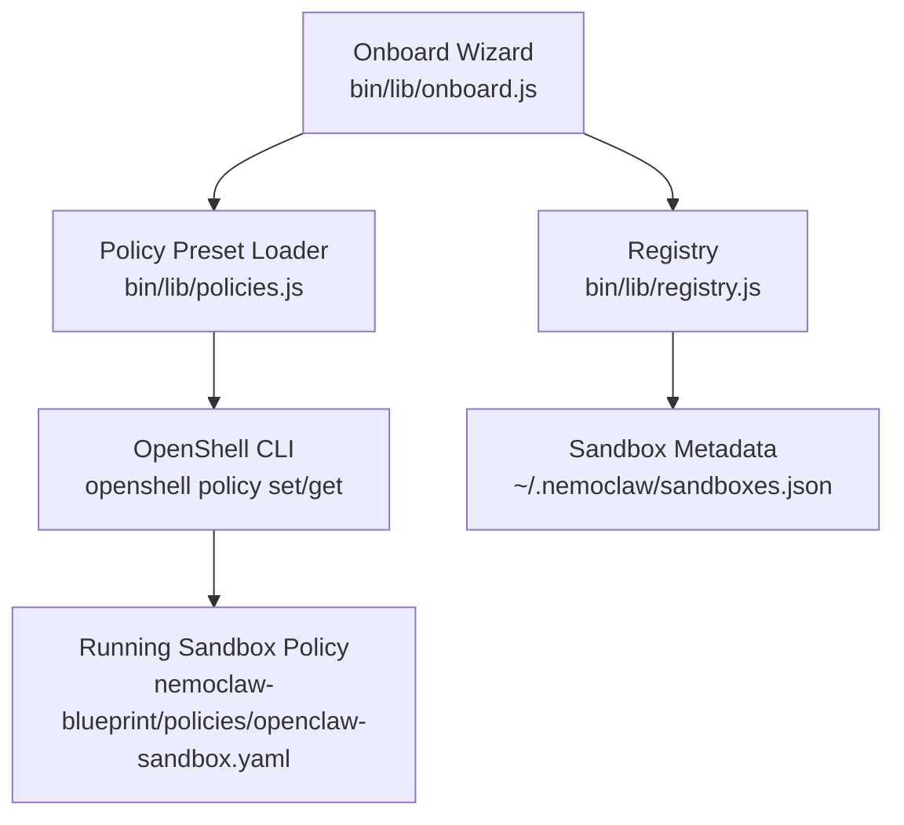
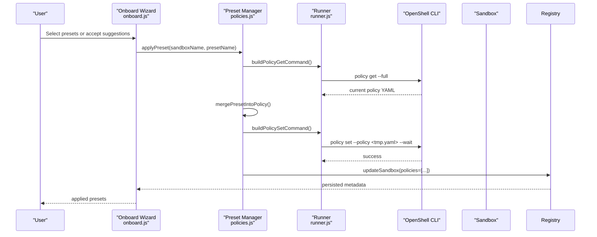
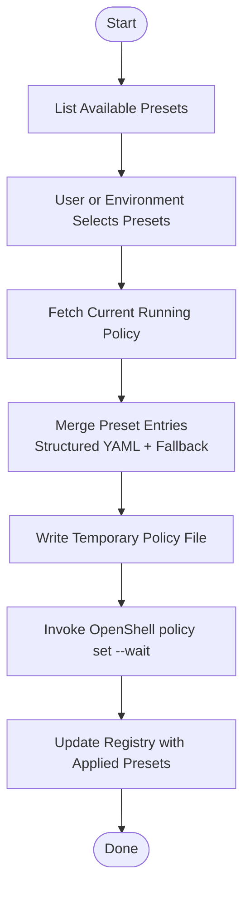
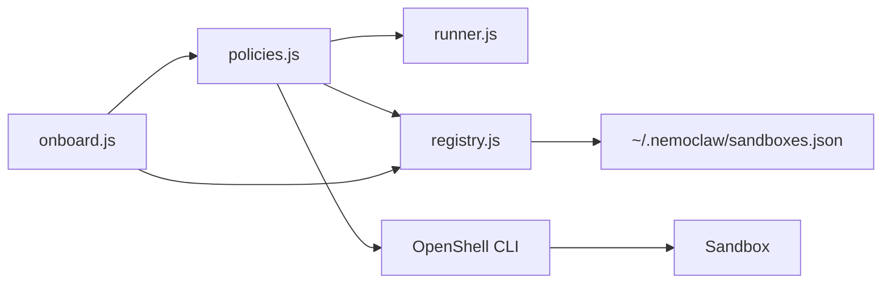

# Policy Customization and Management

<cite>
**Referenced Files in This Document**
- [policies.js](file://bin/lib/policies.js)
- [runner.js](file://bin/lib/runner.js)
- [registry.js](file://bin/lib/registry.js)
- [openclaw-sandbox.yaml](file://nemoclaw-blueprint/policies/openclaw-sandbox.yaml)
- [network-policies.md](file://docs/reference/network-policies.md)
- [customize-network-policy.md](file://docs/network-policy/customize-network-policy.md)
- [slash.ts](file://nemoclaw/src/commands/slash.ts)
- [onboard.js](file://bin/lib/onboard.js)
- [brave.yaml](file://nemoclaw-blueprint/policies/presets/brave.yaml)
- [huggingface.yaml](file://nemoclaw-blueprint/policies/presets/huggingface.yaml)
- [npm.yaml](file://nemoclaw-blueprint/policies/presets/npm.yaml)
</cite>

## Table of Contents
1. [Introduction](#introduction)
2. [Project Structure](#project-structure)
3. [Core Components](#core-components)
4. [Architecture Overview](#architecture-overview)
5. [Detailed Component Analysis](#detailed-component-analysis)
6. [Dependency Analysis](#dependency-analysis)
7. [Performance Considerations](#performance-considerations)
8. [Troubleshooting Guide](#troubleshooting-guide)
9. [Conclusion](#conclusion)
10. [Appendices](#appendices)

## Introduction
This document explains how to customize and manage policies for the NemoClaw sandbox using both static and dynamic techniques. It covers editing the baseline YAML policy file, applying runtime updates without restarting the sandbox, using the OpenShell CLI for dynamic policy updates, and leveraging the onboard wizard’s preset application workflow. It also documents policy inheritance, rule precedence, conflict resolution between static and dynamic changes, advanced customization scenarios, versioning strategies, and rollback procedures.

## Project Structure
Policy customization spans three primary areas:
- Static baseline policy: defined in a YAML blueprint file and applied during onboarding.
- Dynamic runtime updates: applied to a running sandbox via the OpenShell CLI.
- Preset management: curated policy fragments for common integrations, used either standalone or merged into the running policy.

**Diagram sources**
- [onboard.js](file://bin/lib/onboard.js)
- [policies.js](file://bin/lib/policies.js)
- [registry.js](file://bin/lib/registry.js)
- [openclaw-sandbox.yaml](file://nemoclaw-blueprint/policies/openclaw-sandbox.yaml)

**Section sources**
- [customize-network-policy.md](file://docs/network-policy/customize-network-policy.md)
- [network-policies.md](file://docs/reference/network-policies.md)

## Core Components
- Static policy baseline: a YAML file containing filesystem, process, and network policies that define the sandbox’s default behavior.
- Dynamic policy application: a library that reads the current running policy, merges preset entries, writes a temporary policy file, and invokes the OpenShell CLI to apply it.
- Registry: maintains per-sandbox metadata, including applied presets, enabling consistent tracking across sessions.
- Onboard wizard: orchestrates preset selection and application, validates sandbox readiness, and records applied presets.

Key responsibilities:
- Normalize and parse the current policy output from OpenShell.
- Merge preset entries into the current policy using structured YAML parsing with a text fallback.
- Build and execute OpenShell commands safely with shell quoting.
- Persist applied presets in the registry for future reference.

**Section sources**
- [policies.js](file://bin/lib/policies.js)
- [runner.js](file://bin/lib/runner.js)
- [registry.js](file://bin/lib/registry.js)
- [openclaw-sandbox.yaml](file://nemoclaw-blueprint/policies/openclaw-sandbox.yaml)

## Architecture Overview
The policy lifecycle integrates the onboard wizard, preset management, and OpenShell runtime application.

**Diagram sources**
- [onboard.js](file://bin/lib/onboard.js)
- [policies.js](file://bin/lib/policies.js)
- [runner.js](file://bin/lib/runner.js)
- [registry.js](file://bin/lib/registry.js)

## Detailed Component Analysis

### Static Policy Modification
Static changes modify the baseline policy file and take effect after onboarding or redeployment.

- Edit the baseline policy file to add, remove, or adjust endpoint groups, binaries, and rules.
- Re-run the onboard wizard to apply the updated policy to the sandbox.
- Verify the applied policy using the CLI status command.

Practical steps:
- Locate the baseline policy file and adjust the network policy sections.
- Save changes and rerun the onboard wizard to regenerate the sandbox with the new baseline.
- Confirm the new policy is active using the status command.

**Section sources**
- [customize-network-policy.md](file://docs/network-policy/customize-network-policy.md)
- [network-policies.md](file://docs/reference/network-policies.md)
- [openclaw-sandbox.yaml](file://nemoclaw-blueprint/policies/openclaw-sandbox.yaml)

### Dynamic Policy Updates (Runtime)
Dynamic updates apply to a running sandbox without restarting it.

- Prepare a policy file with desired endpoint additions or modifications.
- Use the OpenShell CLI to apply the policy file to the running sandbox.
- The change takes effect immediately for the current session.

Scope:
- Dynamic changes apply only to the current session.
- When the sandbox stops, the running policy resets to the baseline defined in the static policy file.
- To make changes permanent, update the static policy file and re-run onboarding.

**Section sources**
- [customize-network-policy.md](file://docs/network-policy/customize-network-policy.md)
- [network-policies.md](file://docs/reference/network-policies.md)

### OpenShell Policy Commands
The system builds and executes OpenShell commands with proper quoting and environment handling.

- Build policy get command to fetch the current running policy.
- Build policy set command to apply a policy file to a sandbox.
- Use a runner utility to execute commands and redact secrets from output.

Security and safety:
- Shell-quote arguments to avoid injection.
- Redact secrets from command output and errors.
- Validate sandbox names and guard against truncation.

**Section sources**
- [policies.js](file://bin/lib/policies.js)
- [runner.js](file://bin/lib/runner.js)

### Preset Management and Application
Preset files encapsulate common endpoint groups for integrations. The system:
- Lists available presets and extracts their network policy entries.
- Merges preset entries into the current running policy using structured YAML parsing.
- Falls back to a text-based merge when structured parsing fails.
- Applies the merged policy via OpenShell and records applied presets in the registry.

Workflow:
- The onboard wizard selects presets (suggested, custom, or list).
- For each selected preset, it waits for the sandbox to be ready, then applies the preset.
- Applied presets are stored in the registry for future reference.

**Diagram sources**
- [policies.js](file://bin/lib/policies.js)
- [registry.js](file://bin/lib/registry.js)
- [onboard.js](file://bin/lib/onboard.js)

**Section sources**
- [policies.js](file://bin/lib/policies.js)
- [registry.js](file://bin/lib/registry.js)
- [onboard.js](file://bin/lib/onboard.js)

### Policy Inheritance, Precedence, and Conflict Resolution
Policy inheritance and precedence are determined by how presets are merged into the current running policy.

- Static baseline: defines the initial policy applied at onboarding.
- Dynamic runtime: augments the running policy for the current session.
- Preset merging: merges network policy entries by name; collisions are resolved by replacing the existing entry with the preset’s definition.

Precedence order:
1. Static baseline (from the policy file) forms the foundation.
2. Dynamic runtime updates (via OpenShell) extend or override the running policy for the session.
3. Preset application merges entries into the running policy; conflicts are resolved by replacing the existing entry with the preset’s definition.

Conflict resolution:
- Structured YAML merge replaces conflicting entries by name.
- Text-based fallback ensures compatibility when structured parsing fails.

**Section sources**
- [policies.js](file://bin/lib/policies.js)
- [openclaw-sandbox.yaml](file://nemoclaw-blueprint/policies/openclaw-sandbox.yaml)

### Advanced Customization Scenarios
- Creating custom endpoint groups:
  - Define a new endpoint group in the policy file with endpoints, binaries, and rules.
  - Apply the static change by re-running onboarding or apply dynamically using the OpenShell CLI.
- Modifying binary permissions:
  - Adjust the binaries list within an endpoint group to restrict or expand which executables can use the endpoint.
- Implementing application-specific network rules:
  - Add granular HTTP method and path rules within an endpoint group to control access precisely.

Examples from presets:
- Messaging endpoints with restricted paths.
- Package registries with full access for package managers.
- Model hub endpoints with GET/POST allowances.

**Section sources**
- [customize-network-policy.md](file://docs/network-policy/customize-network-policy.md)
- [brave.yaml](file://nemoclaw-blueprint/policies/presets/brave.yaml)
- [huggingface.yaml](file://nemoclaw-blueprint/policies/presets/huggingface.yaml)
- [npm.yaml](file://nemoclaw-blueprint/policies/presets/npm.yaml)

### Practical Examples of Common Customizations
- Allow a new external API for a specific binary path.
- Permit package manager operations to a private registry.
- Enable bot APIs with path-scoped allowances.
- Restrict inference endpoints to specific methods and paths.

These examples demonstrate how to extend the baseline policy using either static edits or dynamic updates.

**Section sources**
- [customize-network-policy.md](file://docs/network-policy/customize-network-policy.md)
- [brave.yaml](file://nemoclaw-blueprint/policies/presets/brave.yaml)
- [npm.yaml](file://nemoclaw-blueprint/policies/presets/npm.yaml)

### Policy Versioning Strategies and Rollback Procedures
Versioning:
- The policy file includes a version field; merging preserves or sets the version consistently.
- When merging, the system ensures a version header exists to maintain validity.

Rollback:
- Dynamic changes are ephemeral and revert when the sandbox stops.
- Static changes are applied at onboarding; to roll back, revert the policy file and re-run onboarding.
- The onboard slash command provides status and guidance for rollback procedures.

**Section sources**
- [customize-network-policy.md](file://docs/network-policy/customize-network-policy.md)
- [slash.ts](file://nemoclaw/src/commands/slash.ts)

## Dependency Analysis
Policy management depends on several modules working together.

**Diagram sources**
- [policies.js](file://bin/lib/policies.js)
- [runner.js](file://bin/lib/runner.js)
- [registry.js](file://bin/lib/registry.js)
- [onboard.js](file://bin/lib/onboard.js)

**Section sources**
- [policies.js](file://bin/lib/policies.js)
- [runner.js](file://bin/lib/runner.js)
- [registry.js](file://bin/lib/registry.js)
- [onboard.js](file://bin/lib/onboard.js)

## Performance Considerations
- Minimize repeated dynamic updates to reduce overhead; batch changes when possible.
- Prefer static changes for broad, long-term adjustments to avoid frequent runtime merges.
- Use preset files to standardize common configurations and reduce manual YAML maintenance.

## Troubleshooting Guide
Common issues and resolutions:
- Sandbox not ready for policy application:
  - The onboard wizard waits for the sandbox to be ready; ensure the sandbox is healthy before applying presets.
- Unknown or invalid preset names:
  - Verify preset names against the available list; unknown names cause failures.
- OpenShell policy updates unsupported:
  - Some gateway builds may not support dynamic policy updates; the wizard surfaces a specific message and exits.
- Policy merge failures:
  - If structured YAML parsing fails, the system falls back to a text-based merge; validate YAML formatting if issues persist.

Operational commands:
- Use the onboard slash command to check status and get rollback guidance.
- Use the CLI status command to verify applied policy after changes.

**Section sources**
- [onboard.js](file://bin/lib/onboard.js)
- [slash.ts](file://nemoclaw/src/commands/slash.ts)

## Conclusion
NemoClaw provides a robust dual-path policy management system: static baseline changes for persistent configuration and dynamic runtime updates for flexible, session-scoped adjustments. Preset management streamlines common integrations, while structured merging and a registry ensure predictable behavior and traceability. By combining these capabilities, operators can tailor sandbox policies to their needs, maintain strong security posture, and recover quickly from misconfigurations.

## Appendices
- Policy schema reference and OpenShell sandbox policies are available in the documentation links provided in the customization guide.