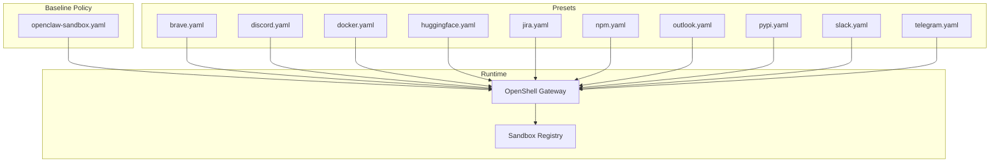
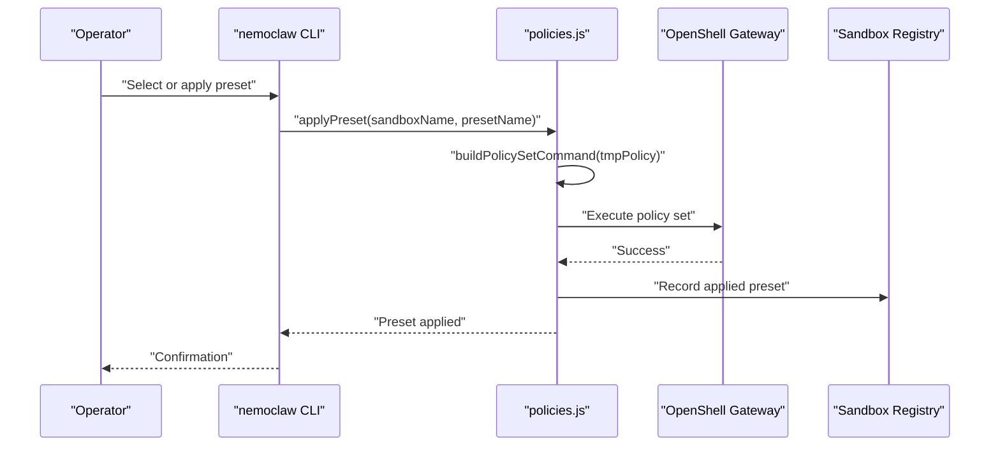
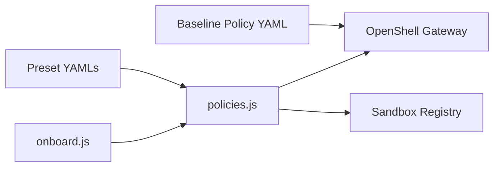

# Preset Application Policies

<cite>
**Referenced Files in This Document**
- [openclaw-sandbox.yaml](file://nemoclaw-blueprint/policies/openclaw-sandbox.yaml)
- [brave.yaml](file://nemoclaw-blueprint/policies/presets/brave.yaml)
- [discord.yaml](file://nemoclaw-blueprint/policies/presets/discord.yaml)
- [docker.yaml](file://nemoclaw-blueprint/policies/presets/docker.yaml)
- [huggingface.yaml](file://nemoclaw-blueprint/policies/presets/huggingface.yaml)
- [jira.yaml](file://nemoclaw-blueprint/policies/presets/jira.yaml)
- [npm.yaml](file://nemoclaw-blueprint/policies/presets/npm.yaml)
- [outlook.yaml](file://nemoclaw-blueprint/policies/presets/outlook.yaml)
- [pypi.yaml](file://nemoclaw-blueprint/policies/presets/pypi.yaml)
- [slack.yaml](file://nemoclaw-blueprint/policies/presets/slack.yaml)
- [telegram.yaml](file://nemoclaw-blueprint/policies/presets/telegram.yaml)
- [network-policies.md](file://docs/reference/network-policies.md)
- [customize-network-policy.md](file://docs/network-policy/customize-network-policy.md)
- [approve-network-requests.md](file://docs/network-policy/approve-network-requests.md)
- [policies.js](file://bin/lib/policies.js)
- [onboard.js](file://bin/lib/onboard.js)
- [policies.test.js](file://test/policies.test.js)
</cite>

## Table of Contents
1. [Introduction](#introduction)
2. [Project Structure](#project-structure)
3. [Core Components](#core-components)
4. [Architecture Overview](#architecture-overview)
5. [Detailed Component Analysis](#detailed-component-analysis)
6. [Dependency Analysis](#dependency-analysis)
7. [Performance Considerations](#performance-considerations)
8. [Troubleshooting Guide](#troubleshooting-guide)
9. [Conclusion](#conclusion)

## Introduction
This document describes preset network policies for common applications and use cases in the NemoClaw/OpenShell sandbox. It explains the rationale behind each preset’s endpoints, binary permissions, and access patterns, and shows how presets integrate with the baseline policy. It also covers when to use each preset, customization options, practical examples, performance considerations, and security implications.

## Project Structure
Preset policies are defined as standalone YAML files under the presets directory. They can be applied to a running sandbox or merged into the baseline policy file for persistent changes. The baseline policy file defines the default sandbox restrictions and minimal allowances.

**Diagram sources**
- [openclaw-sandbox.yaml:1-219](file://nemoclaw-blueprint/policies/openclaw-sandbox.yaml#L1-L219)
- [brave.yaml:1-23](file://nemoclaw-blueprint/policies/presets/brave.yaml#L1-L23)
- [discord.yaml:1-47](file://nemoclaw-blueprint/policies/presets/discord.yaml#L1-L47)
- [docker.yaml:1-46](file://nemoclaw-blueprint/policies/presets/docker.yaml#L1-L46)
- [huggingface.yaml:1-38](file://nemoclaw-blueprint/policies/presets/huggingface.yaml#L1-L38)
- [jira.yaml:1-38](file://nemoclaw-blueprint/policies/presets/jira.yaml#L1-L38)
- [npm.yaml:1-25](file://nemoclaw-blueprint/policies/presets/npm.yaml#L1-L25)
- [outlook.yaml:1-46](file://nemoclaw-blueprint/policies/presets/outlook.yaml#L1-L46)
- [pypi.yaml:1-27](file://nemoclaw-blueprint/policies/presets/pypi.yaml#L1-L27)
- [slack.yaml:1-46](file://nemoclaw-blueprint/policies/presets/slack.yaml#L1-L46)
- [telegram.yaml:1-23](file://nemocaw-blueprint/policies/presets/telegram.yaml#L1-L23)

**Section sources**
- [openclaw-sandbox.yaml:1-219](file://nemoclaw-blueprint/policies/openclaw-sandbox.yaml#L1-L219)
- [customize-network-policy.md:97-123](file://docs/network-policy/customize-network-policy.md#L97-L123)

## Core Components
- Baseline policy: Defines deny-by-default sandbox restrictions and a small set of allowed endpoints for core operations.
- Preset policies: Application-specific bundles of endpoints and binaries that can be applied to a running sandbox or merged into the baseline.
- Operator approval flow: When a request targets an unlisted endpoint, OpenShell prompts the operator for approval in the TUI.

Key capabilities:
- Static changes: Edit the baseline policy and re-run the onboard wizard.
- Dynamic changes: Apply a preset or policy file to a running sandbox via OpenShell CLI.
- Preset selection: Interactive or non-interactive selection during onboarding.

**Section sources**
- [openclaw-sandbox.yaml:1-219](file://nemoclaw-blueprint/policies/openclaw-sandbox.yaml#L1-L219)
- [network-policies.md:25-145](file://docs/reference/network-policies.md#L25-L145)
- [customize-network-policy.md:35-96](file://docs/network-policy/customize-network-policy.md#L35-L96)
- [approve-network-requests.md:23-84](file://docs/network-policy/approve-network-requests.md#L23-L84)
- [policies.js:258-285](file://bin/lib/policies.js#L258-L285)
- [onboard.js:3449-3687](file://bin/lib/onboard.js#L3449-L3687)

## Architecture Overview
The preset application flow integrates with OpenShell and the sandbox registry. Presets are validated and applied to the running sandbox, and the applied preset list is recorded in the sandbox registry.

**Diagram sources**
- [policies.js:258-285](file://bin/lib/policies.js#L258-L285)
- [onboard.js:3449-3687](file://bin/lib/onboard.js#L3449-L3687)

## Detailed Component Analysis

### Brave Browser Search API
- Purpose: Allow Brave Search API access for web search queries.
- Endpoints: Brave Search REST API host on port 443 with TLS termination and enforcement.
- Methods: GET and POST allowed.
- Binaries: Node.js runtimes included to support client-side scripts.
- Rationale: Minimal, explicit allowance for search APIs; restricts to specific path patterns typical of bot-style search endpoints.
- When to use: When agents need to fetch search results via the Brave API.
- Integration with baseline: Can be applied dynamically or merged into baseline.
- Customization: Adjust allowed methods or add path constraints if needed.
- Security: Enforced TLS termination and method scoping reduce exposure surface.

**Section sources**
- [brave.yaml:1-23](file://nemoclaw-blueprint/policies/presets/brave.yaml#L1-L23)

### Discord Team Collaboration
- Purpose: Enable Discord API, CDN, and WebSocket gateway access for bots and real-time communication.
- Endpoints:
  - REST API host with GET/POST/PUT/PATCH/DELETE.
  - WebSocket gateway host requiring full access (CONNECT tunnel) to avoid HTTP idle timeouts.
  - CDN host for read-only asset retrieval.
- Methods: REST endpoints allow multiple HTTP methods; WebSocket requires full access.
- Binaries: Node.js runtime for bot scripts.
- Rationale: Supports both REST-based interactions and persistent WebSocket connections.
- When to use: When agents operate Discord bots or require real-time channels.
- Integration with baseline: Full access to gateway requires CONNECT tunnel; baseline includes a similar pattern.
- Customization: Limit methods or add path constraints if using webhooks only.
- Security: Enforced TLS termination and method scoping; WebSocket via CONNECT tunnel prevents idle timeouts.

**Section sources**
- [discord.yaml:1-47](file://nemoclaw-blueprint/policies/presets/discord.yaml#L1-L47)
- [openclaw-sandbox.yaml:192-219](file://nemoclaw-blueprint/policies/openclaw-sandbox.yaml#L192-L219)

### Docker Container Management
- Purpose: Allow pulling images and authenticating against Docker and NVIDIA registries.
- Endpoints: Docker Hub registry, Docker auth, NVIDIA container registry (NVCR), and NVCR auth.
- Methods: GET and POST allowed for registry operations.
- Binaries: Docker client binary.
- Rationale: Enables image pulls and authentication flows without exposing unnecessary hosts.
- When to use: When agents orchestrate containers or pull base images.
- Integration with baseline: Requires explicit allowance for registry hosts and auth endpoints.
- Customization: Add or remove registry hosts; restrict methods if only pulling is needed.
- Security: Enforced TLS termination; method scoping reduces risk of mutation operations.

**Section sources**
- [docker.yaml:1-46](file://nemoclaw-blueprint/policies/presets/docker.yaml#L1-L46)

### HuggingFace Model Access
- Purpose: Enable access to Hugging Face Hub, LFS, and Inference API.
- Endpoints: Hub host, CDN host for LFS assets, and Inference API host.
- Methods: GET and POST allowed for Hub and Inference API.
- Binaries: Python and Node.js runtimes for SDKs and scripts.
- Rationale: Supports model discovery, asset downloads, and inference requests.
- When to use: When agents download datasets/models or invoke hosted inference endpoints.
- Integration with baseline: Can be applied dynamically or merged into baseline.
- Customization: Tighten path rules or restrict to specific model repositories.
- Security: Enforced TLS termination and method scoping; separate endpoints for CDN and inference.

**Section sources**
- [huggingface.yaml:1-38](file://nemoclaw-blueprint/policies/presets/huggingface.yaml#L1-L38)

### Jira Project Management
- Purpose: Allow Atlassian Cloud API access for Jira integrations.
- Endpoints: Wildcard domain for Atlassian-hosted instances, auth host, and API host.
- Methods: GET and POST allowed.
- Binaries: Node.js runtime for integrations.
- Rationale: Broad domain allowance for Atlassian Cloud; restricts to essential methods.
- When to use: When agents manage tickets, read boards, or trigger workflows.
- Integration with baseline: Wildcard domain support; baseline includes similar patterns.
- Customization: Narrow domains or add path constraints for specific projects.
- Security: Enforced TLS termination and method scoping; wildcard requires careful operational oversight.

**Section sources**
- [jira.yaml:1-38](file://nemoclaw-blueprint/policies/presets/jira.yaml#L1-L38)
- [openclaw-sandbox.yaml:9-219](file://nemoclaw-blueprint/policies/openclaw-sandbox.yaml#L9-L219)

### NPM Package Management
- Purpose: Enable npm and Yarn registry access for dependency installation.
- Endpoints: npm and Yarn registries.
- Methods: Full access allowed.
- Binaries: npm, npx, node, yarn family binaries; supports wildcards.
- Rationale: Allows package installation and resolution without exposing other hosts.
- When to use: When agents install plugins or dependencies via npm or Yarn.
- Integration with baseline: Can be applied dynamically or merged into baseline.
- Customization: Restrict to specific registries or add path constraints.
- Security: Full access implies trust boundaries; ensure only trusted packages are installed.

**Section sources**
- [npm.yaml:1-25](file://nemoclaw-blueprint/policies/presets/npm.yaml#L1-L25)

### Outlook Email Integration
- Purpose: Enable Microsoft Graph and Outlook API access.
- Endpoints: Graph API, login host, and Outlook endpoints.
- Methods: GET and POST allowed.
- Binaries: Node.js runtime for integrations.
- Rationale: Supports calendar, mail, and profile operations via Microsoft APIs.
- When to use: When agents send/receive emails or manage calendar events.
- Integration with baseline: Can be applied dynamically or merged into baseline.
- Customization: Narrow endpoints or add path constraints for specific workloads.
- Security: Enforced TLS termination and method scoping; authentication via Microsoft Online.

**Section sources**
- [outlook.yaml:1-46](file://nemoclaw-blueprint/policies/presets/outlook.yaml#L1-L46)

### PyPI Package Distribution
- Purpose: Allow Python Package Index and files host access for pip installs.
- Endpoints: PyPI and files host.
- Methods: Full access allowed.
- Binaries: Python and pip binaries; supports wildcards and virtual environments.
- Rationale: Enables package installation and artifact retrieval.
- When to use: When agents publish or install Python packages.
- Integration with baseline: Can be applied dynamically or merged into baseline.
- Customization: Restrict to trusted indices or add path constraints.
- Security: Full access implies trust boundaries; ensure only trusted packages are fetched.

**Section sources**
- [pypi.yaml:1-27](file://nemoclaw-blueprint/policies/presets/pypi.yaml#L1-L27)

### Slack Team Collaboration
- Purpose: Enable Slack API, webhooks, and Socket Mode WebSocket access.
- Endpoints:
  - REST API and webhooks hosts.
  - Socket Mode WebSocket hosts requiring full access (CONNECT tunnel).
- Methods: REST endpoints allow GET/POST; WebSocket requires full access.
- Binaries: Node.js runtime for bot scripts.
- Rationale: Supports both REST-based interactions and persistent WebSocket connections for real-time features.
- When to use: When agents operate Slack bots or subscribe to events.
- Integration with baseline: Full access to WebSocket hosts requires CONNECT tunnel; baseline includes similar patterns.
- Customization: Limit methods or add path constraints if using webhooks only.
- Security: Enforced TLS termination and method scoping; WebSocket via CONNECT tunnel prevents idle timeouts.

**Section sources**
- [slack.yaml:1-46](file://nemoclaw-blueprint/policies/presets/slack.yaml#L1-L46)
- [openclaw-sandbox.yaml:1-219](file://nemoclaw-blueprint/policies/openclaw-sandbox.yaml#L1-L219)

### Telegram Messaging
- Purpose: Allow Telegram Bot API access for messaging and media retrieval.
- Endpoints: Telegram Bot API host with path-scoped rules for bot endpoints and file retrieval.
- Methods: GET and POST allowed for bot paths; GET allowed for file retrieval.
- Binaries: Node.js runtime for bot scripts.
- Rationale: Supports bot commands and media downloads with strict path scoping.
- When to use: When agents send/receive messages or upload/download files via Telegram.
- Integration with baseline: Path-scoped rules align with baseline’s approach for Telegram.
- Customization: Tighten path patterns or restrict methods further.
- Security: Enforced TLS termination and path scoping reduce exposure.

**Section sources**
- [telegram.yaml:1-23](file://nemoclaw-blueprint/policies/presets/telegram.yaml#L1-L23)
- [openclaw-sandbox.yaml:177-219](file://nemoclaw-blueprint/policies/openclaw-sandbox.yaml#L177-L219)

## Dependency Analysis
Presets depend on the OpenShell policy engine and the sandbox registry. The CLI orchestrates preset application and records applied presets.

**Diagram sources**
- [onboard.js:3449-3687](file://bin/lib/onboard.js#L3449-L3687)
- [policies.js:258-285](file://bin/lib/policies.js#L258-L285)
- [openclaw-sandbox.yaml:1-219](file://nemoclaw-blueprint/policies/openclaw-sandbox.yaml#L1-L219)

**Section sources**
- [onboard.js:3449-3687](file://bin/lib/onboard.js#L3449-L3687)
- [policies.js:258-285](file://bin/lib/policies.js#L258-L285)
- [policies.test.js:108-154](file://test/policies.test.js#L108-L154)

## Performance Considerations
- WebSocket gateways: Using full access (CONNECT tunnel) for Discord and Slack prevents HTTP idle timeouts that would otherwise disrupt persistent connections.
- TLS termination: Enforced TLS termination ensures secure transport but may introduce minor overhead; acceptable for controlled, minimal endpoints.
- Method scoping: Limiting HTTP methods reduces unnecessary traffic and potential misuse.
- Path scoping: Fine-grained path rules (e.g., bot-specific paths) minimize data transfer and attack surface.

[No sources needed since this section provides general guidance]

## Troubleshooting Guide
- Operator approval flow: When a request targets an unlisted endpoint, OpenShell blocks it and shows details in the TUI. Approve to temporarily allow or deny to keep it blocked.
- Applying presets: Use the CLI to apply a preset to a running sandbox or merge into the baseline policy file and re-run the onboard wizard.
- Validation: The test suite validates preset names and content loading, including path traversal protections.

Practical steps:
- Use the TUI to review blocked requests and approve as needed.
- Apply presets via the CLI for immediate effect.
- For permanent changes, edit the baseline policy and re-run the onboard wizard.

**Section sources**
- [approve-network-requests.md:23-84](file://docs/network-policy/approve-network-requests.md#L23-L84)
- [customize-network-policy.md:72-96](file://docs/network-policy/customize-network-policy.md#L72-L96)
- [policies.test.js:108-154](file://test/policies.test.js#L108-L154)

## Conclusion
Preset policies provide safe, minimal allowances for common integrations. They integrate seamlessly with the baseline policy and OpenShell’s operator approval flow. Choose a preset aligned with your application needs, apply it dynamically or merge it into the baseline, and refine rules as required for your environment.

[No sources needed since this section summarizes without analyzing specific files]