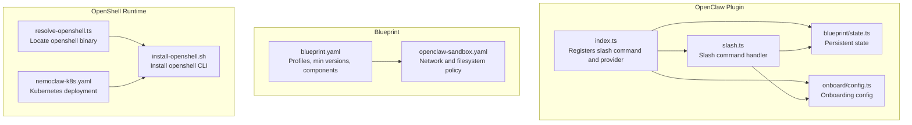
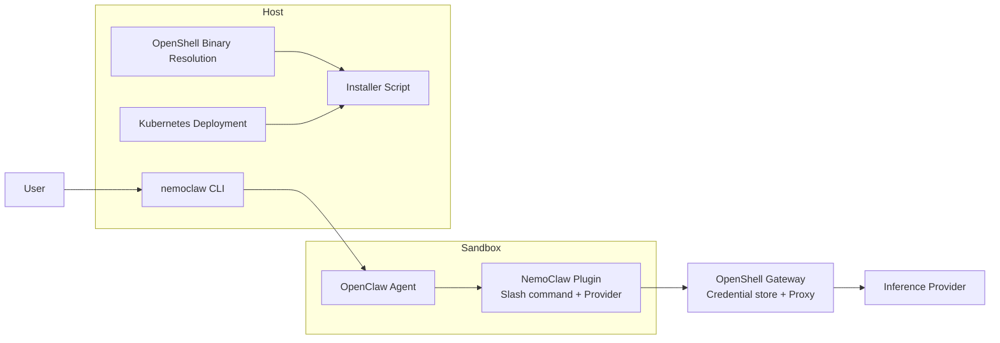
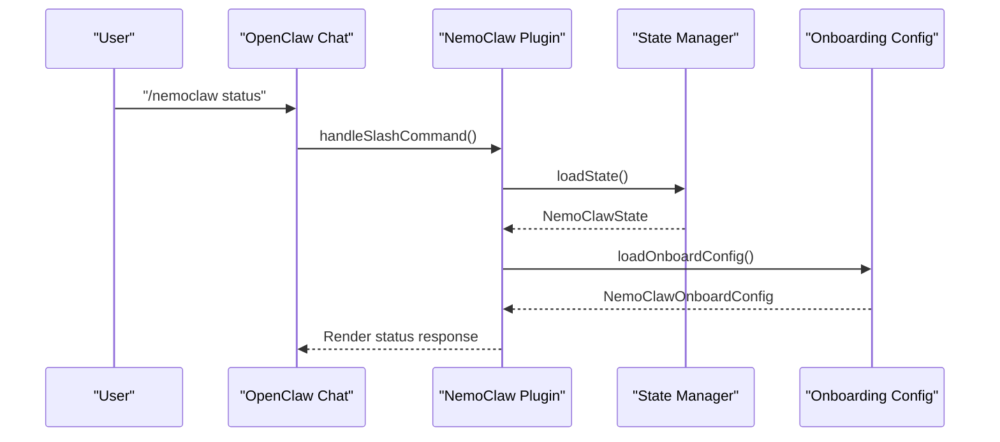
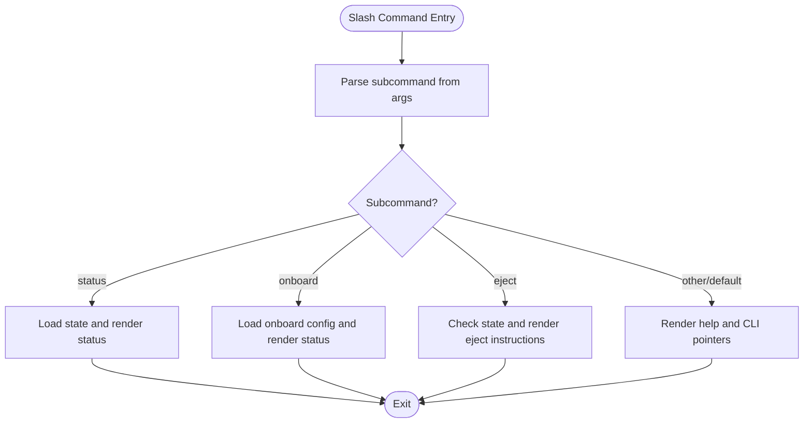
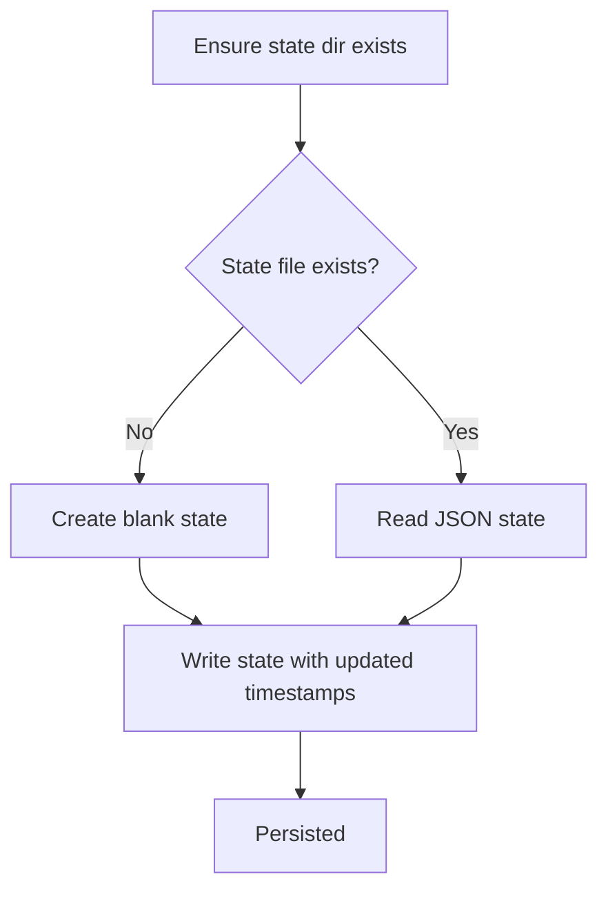
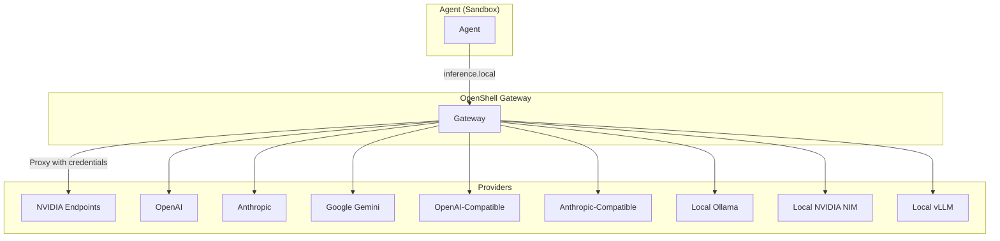
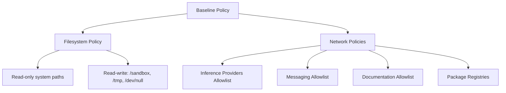
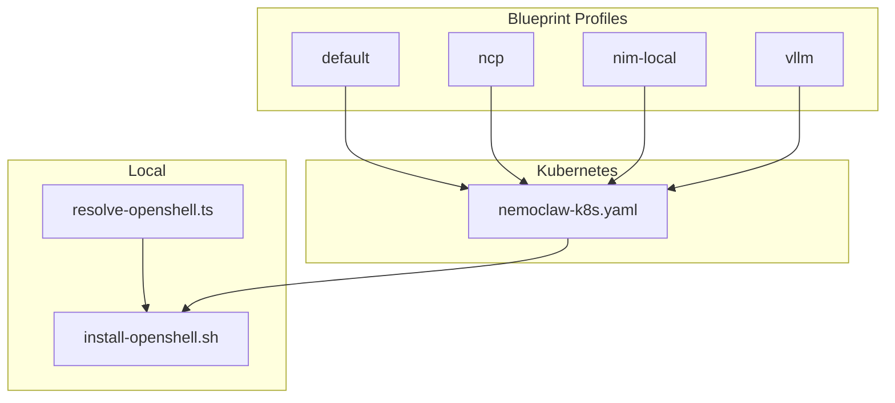
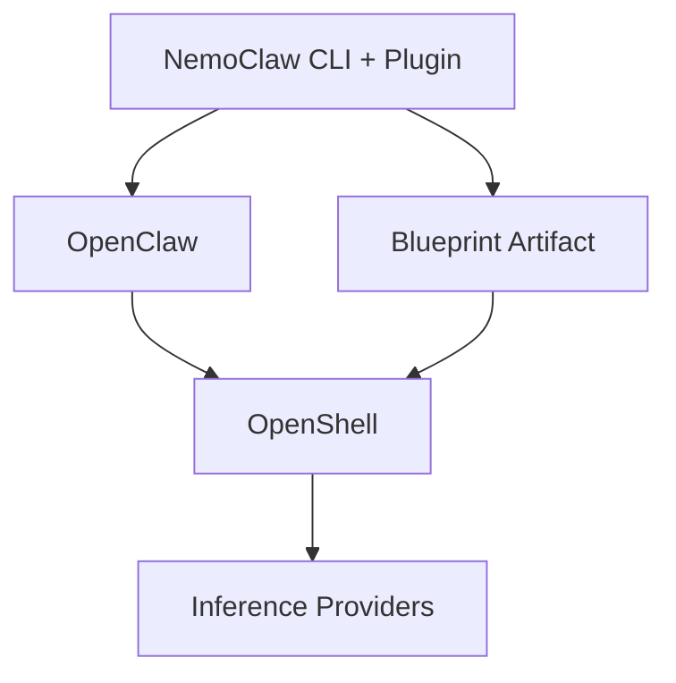

# Ecosystem Integration

<cite>
**Referenced Files in This Document**
- [openclaw.plugin.json](file://nemoclaw/openclaw.plugin.json)
- [index.ts](file://nemoclaw/src/index.ts)
- [slash.ts](file://nemoclaw/src/commands/slash.ts)
- [state.ts](file://nemoclaw/src/blueprint/state.ts)
- [config.ts](file://nemoclaw/src/onboard/config.ts)
- [resolve-openshell.js](file://bin/lib/resolve-openshell.js)
- [resolve-openshell.ts](file://src/lib/resolve-openshell.ts)
- [blueprint.yaml](file://nemoclaw-blueprint/blueprint.yaml)
- [openclaw-sandbox.yaml](file://nemoclaw-blueprint/policies/openclaw-sandbox.yaml)
- [install-openshell.sh](file://scripts/install-openshell.sh)
- [nemoclaw-k8s.yaml](file://k8s/nemoclaw-k8s.yaml)
- [architecture.md](file://docs/reference/architecture.md)
- [commands.md](file://docs/reference/commands.md)
- [inference-options.md](file://docs/inference/inference-options.md)
- [package.json](file://package.json)
</cite>

## Table of Contents
1. [Introduction](#introduction)
2. [Project Structure](#project-structure)
3. [Core Components](#core-components)
4. [Architecture Overview](#architecture-overview)
5. [Detailed Component Analysis](#detailed-component-analysis)
6. [Dependency Analysis](#dependency-analysis)
7. [Performance Considerations](#performance-considerations)
8. [Troubleshooting Guide](#troubleshooting-guide)
9. [Conclusion](#conclusion)
10. [Appendices](#appendices)

## Introduction
This document explains how NemoClaw integrates with the NVIDIA Agent Toolkit, specifically OpenShell and OpenClaw, and how it extends the OpenClaw agent framework. It covers the plugin architecture enabling OpenClaw integration, the slash command system, state synchronization mechanisms, supported inference providers, network policy systems, and deployment options. It also outlines compatibility requirements, version dependencies, integration patterns, and community resources.

## Project Structure
NemoClaw is organized around three primary layers:
- OpenClaw plugin: a TypeScript module that registers commands and providers inside the OpenClaw host process.
- Blueprint: a versioned artifact that orchestrates OpenShell resources and enforces sandbox policies.
- Host CLI and scripts: commands for onboarding, deployment, and lifecycle management.

**Diagram sources**
- [index.ts:237-266](file://nemoclaw/src/index.ts#L237-L266)
- [slash.ts:21-37](file://nemoclaw/src/commands/slash.ts#L21-L37)
- [state.ts:47-61](file://nemoclaw/src/blueprint/state.ts#L47-L61)
- [config.ts:91-103](file://nemoclaw/src/onboard/config.ts#L91-L103)
- [blueprint.yaml:4-66](file://nemoclaw-blueprint/blueprint.yaml#L4-L66)
- [openclaw-sandbox.yaml:16-219](file://nemoclaw-blueprint/policies/openclaw-sandbox.yaml#L16-L219)
- [resolve-openshell.ts:22-59](file://src/lib/resolve-openshell.ts#L22-L59)
- [install-openshell.sh:54-61](file://scripts/install-openshell.sh#L54-L61)
- [nemoclaw-k8s.yaml:1-120](file://k8s/nemoclaw-k8s.yaml#L1-L120)

**Section sources**
- [architecture.md:25-86](file://docs/reference/architecture.md#L25-L86)
- [package.json:1-60](file://package.json#L1-L60)

## Core Components
- OpenClaw Plugin Manifest: Declares the plugin identity, description, and configuration schema for blueprint versioning, registry, sandbox name, and default inference provider.
- Plugin Entry Point: Registers the /nemoclaw slash command and a managed inference provider with model catalogs and authentication.
- Slash Command System: Provides status, onboard, and eject subcommands for quick actions from the OpenClaw chat interface.
- State Management: Persists run state, last action, blueprint version, sandbox name, migration snapshot, and timestamps on the host.
- Onboarding Configuration: Stores endpoint type, URL, provider label, model, profile, credential environment variable, and onboard timestamp.
- OpenShell Resolution and Installation: Locates the openshell binary and installs it when missing or below minimum version.
- Blueprint Orchestration: Defines profiles (default, ncp, nim-local, vllm), minimum OpenShell/OpenClaw versions, sandbox image, inference routing, and network policy additions.
- Network Policies: Baseline filesystem and network policies for the sandbox, including endpoints for inference providers, messaging, and documentation.

**Section sources**
- [openclaw.plugin.json:1-33](file://nemoclaw/openclaw.plugin.json#L1-L33)
- [index.ts:237-266](file://nemoclaw/src/index.ts#L237-L266)
- [slash.ts:21-37](file://nemoclaw/src/commands/slash.ts#L21-L37)
- [state.ts:9-61](file://nemoclaw/src/blueprint/state.ts#L9-L61)
- [config.ts:21-103](file://nemoclaw/src/onboard/config.ts#L21-L103)
- [resolve-openshell.ts:22-59](file://src/lib/resolve-openshell.ts#L22-L59)
- [blueprint.yaml:4-66](file://nemoclaw-blueprint/blueprint.yaml#L4-L66)
- [openclaw-sandbox.yaml:16-219](file://nemoclaw-blueprint/policies/openclaw-sandbox.yaml#L16-L219)

## Architecture Overview
NemoClaw integrates with NVIDIA OpenShell and OpenClaw by combining a lightweight plugin with a versioned blueprint. The plugin runs in-process with the OpenClaw gateway inside the sandbox, while the blueprint orchestrates OpenShell resources and enforces policies.

**Diagram sources**
- [architecture.md:27-86](file://docs/reference/architecture.md#L27-L86)
- [index.ts:237-266](file://nemoclaw/src/index.ts#L237-L266)
- [resolve-openshell.ts:22-59](file://src/lib/resolve-openshell.ts#L22-L59)
- [install-openshell.sh:54-61](file://scripts/install-openshell.sh#L54-L61)
- [nemoclaw-k8s.yaml:1-120](file://k8s/nemocaw-k8s.yaml#L1-L120)

## Detailed Component Analysis

### OpenClaw Plugin Integration
The plugin registers:
- A slash command (/nemoclaw) with handlers for status, onboard, and eject.
- A managed inference provider with model entries and bearer-token authentication via environment variables.
- Logging banners summarizing endpoint, provider, model, and slash command availability.

**Diagram sources**
- [slash.ts:21-84](file://nemoclaw/src/commands/slash.ts#L21-L84)
- [state.ts:47-54](file://nemoclaw/src/blueprint/state.ts#L47-L54)
- [config.ts:91-98](file://nemoclaw/src/onboard/config.ts#L91-L98)
- [index.ts:237-266](file://nemoclaw/src/index.ts#L237-L266)

**Section sources**
- [openclaw.plugin.json:1-33](file://nemoclaw/openclaw.plugin.json#L1-L33)
- [index.ts:237-266](file://nemoclaw/src/index.ts#L237-L266)
- [slash.ts:21-84](file://nemoclaw/src/commands/slash.ts#L21-L84)

### Slash Command System
The /nemoclaw slash command supports:
- status: Displays last action, blueprint version, run ID, sandbox name, updated time, and rollback snapshot if available.
- onboard: Shows onboarding configuration including endpoint, provider, model, credential environment, profile, and onboard timestamp.
- eject: Provides rollback instructions and snapshot/host backup path when available.

**Diagram sources**
- [slash.ts:21-147](file://nemoclaw/src/commands/slash.ts#L21-L147)
- [state.ts:47-61](file://nemoclaw/src/blueprint/state.ts#L47-L61)
- [config.ts:91-103](file://nemoclaw/src/onboard/config.ts#L91-L103)

**Section sources**
- [slash.ts:21-147](file://nemoclaw/src/commands/slash.ts#L21-L147)
- [commands.md:27-37](file://docs/reference/commands.md#L27-L37)

### State Synchronization Mechanisms
NemoClaw persists state on the host to avoid sandbox contamination:
- State keys include last run ID, last action, blueprint version, sandbox name, migration snapshot, host backup path, created/updated timestamps.
- State is written to a JSON file under the user’s home directory and updated on each operation.

**Diagram sources**
- [state.ts:22-61](file://nemoclaw/src/blueprint/state.ts#L22-L61)

**Section sources**
- [state.ts:9-61](file://nemoclaw/src/blueprint/state.ts#L9-L61)

### Supported Inference Providers and Routing
NemoClaw registers a managed inference provider with curated models and supports multiple provider types:
- NVIDIA Endpoints, OpenAI, Anthropic, Google Gemini, OpenAI-compatible, Anthropic-compatible, Local Ollama, Local NVIDIA NIM, Local vLLM.
- Credentials remain on the host; the sandbox communicates with inference via the OpenShell gateway proxy.

**Diagram sources**
- [index.ts:136-202](file://nemoclaw/src/index.ts#L136-L202)
- [inference-options.md:29-81](file://docs/inference/inference-options.md#L29-L81)

**Section sources**
- [index.ts:136-202](file://nemoclaw/src/index.ts#L136-L202)
- [inference-options.md:38-81](file://docs/inference/inference-options.md#L38-L81)

### Network Policy Systems
The sandbox enforces a strict baseline policy:
- Filesystem: read-only system paths, read-write access to sandbox and temp directories, immutable gateway configuration area.
- Network: allowlists for inference providers, messaging platforms, documentation sites, and package registries; enforced TLS and method/path rules where applicable.
- Policy additions can be applied post-creation via OpenShell commands.

**Diagram sources**
- [openclaw-sandbox.yaml:18-219](file://nemoclaw-blueprint/policies/openclaw-sandbox.yaml#L18-L219)

**Section sources**
- [openclaw-sandbox.yaml:16-219](file://nemoclaw-blueprint/policies/openclaw-sandbox.yaml#L16-L219)

### Deployment Options
- Local installation: Installer script ensures openshell is installed and meets minimum version requirements.
- Kubernetes: A pod spec provisions Docker-in-Docker, runs the official installer, and configures environment variables for provider selection and sandbox naming.
- Blueprint profiles: default, ncp, nim-local, vllm tailor sandbox behavior and inference routing.

**Diagram sources**
- [resolve-openshell.ts:22-59](file://src/lib/resolve-openshell.ts#L22-L59)
- [install-openshell.sh:54-61](file://scripts/install-openshell.sh#L54-L61)
- [nemoclaw-k8s.yaml:1-120](file://k8s/nemoclaw-k8s.yaml#L1-L120)
- [blueprint.yaml:9-14](file://nemoclaw-blueprint/blueprint.yaml#L9-L14)

**Section sources**
- [install-openshell.sh:54-61](file://scripts/install-openshell.sh#L54-L61)
- [nemoclaw-k8s.yaml:1-120](file://k8s/nemoclaw-k8s.yaml#L1-L120)
- [blueprint.yaml:9-14](file://nemoclaw-blueprint/blueprint.yaml#L9-L14)

## Dependency Analysis
NemoClaw’s integration relies on:
- OpenShell runtime for sandboxing, credential storage, inference proxying, and policy enforcement.
- OpenClaw agent framework for the chat interface and plugin host.
- Blueprint artifact for deterministic orchestration and policy application.
- Node.js runtime for CLI and plugin logic.

**Diagram sources**
- [architecture.md:27-86](file://docs/reference/architecture.md#L27-L86)
- [index.ts:237-266](file://nemoclaw/src/index.ts#L237-L266)
- [blueprint.yaml:4-66](file://nemoclaw-blueprint/blueprint.yaml#L4-L66)

**Section sources**
- [architecture.md:27-86](file://docs/reference/architecture.md#L27-L86)
- [package.json:38-40](file://package.json#L38-L40)

## Performance Considerations
- Prefer the managed inference route to minimize latency and credential overhead.
- Use local inference options (NIM, vLLM) when low-latency, offline, or privacy-sensitive scenarios are required.
- Keep OpenShell and OpenClaw versions aligned with blueprint minimums to avoid compatibility overhead.
- Limit network egress to approved endpoints to reduce proxy traversal costs.

## Troubleshooting Guide
Common operational checks:
- Verify openshell binary presence and version using the resolution logic and installer script.
- Confirm onboarding configuration and provider credentials.
- Inspect sandbox status and logs via the CLI and OpenShell TUI.
- Review state persistence and migration snapshots for rollback scenarios.

**Section sources**
- [resolve-openshell.ts:22-59](file://src/lib/resolve-openshell.ts#L22-L59)
- [install-openshell.sh:54-61](file://scripts/install-openshell.sh#L54-L61)
- [config.ts:91-103](file://nemoclaw/src/onboard/config.ts#L91-L103)
- [state.ts:47-61](file://nemoclaw/src/blueprint/state.ts#L47-L61)
- [commands.md:186-195](file://docs/reference/commands.md#L186-L195)

## Conclusion
NemoClaw provides a robust integration layer for the NVIDIA Agent Toolkit by extending OpenClaw with a managed inference provider and slash command interface, while leveraging OpenShell for sandboxing, credential management, and policy enforcement. Its blueprint-driven approach ensures reproducible deployments across environments, and its state synchronization preserves operator visibility and control outside the sandbox.

## Appendices

### Compatibility and Version Dependencies
- Minimum OpenShell version is defined in the blueprint manifest.
- Minimum OpenClaw version is defined in the blueprint manifest.
- Node.js runtime requirement is specified in the package manifest.

**Section sources**
- [blueprint.yaml:5-6](file://nemoclaw-blueprint/blueprint.yaml#L5-L6)
- [package.json:38-40](file://package.json#L38-L40)

### Community Resources and Contribution Opportunities
- GitHub repository for source code and issues.
- Discussions for questions and collaboration.
- Contribution guidelines for development workflows.

**Section sources**
- [package.json:41-44](file://package.json#L41-L44)
- [CONTRIBUTING.md](file://CONTRIBUTING.md)