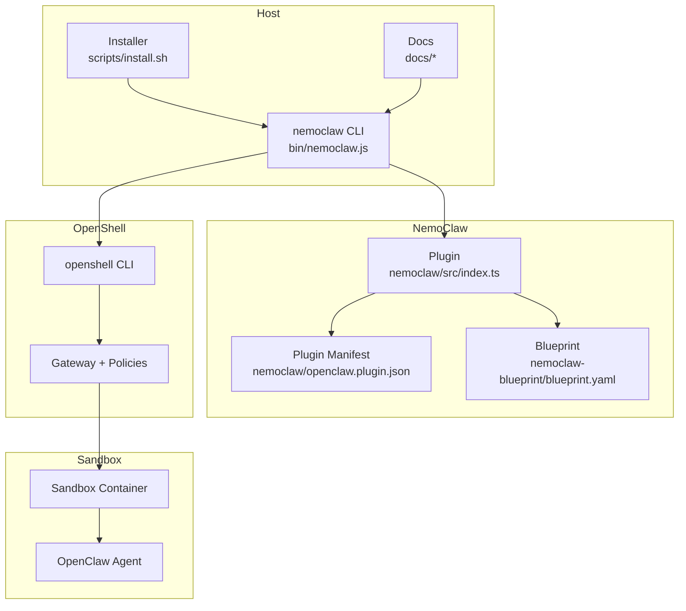
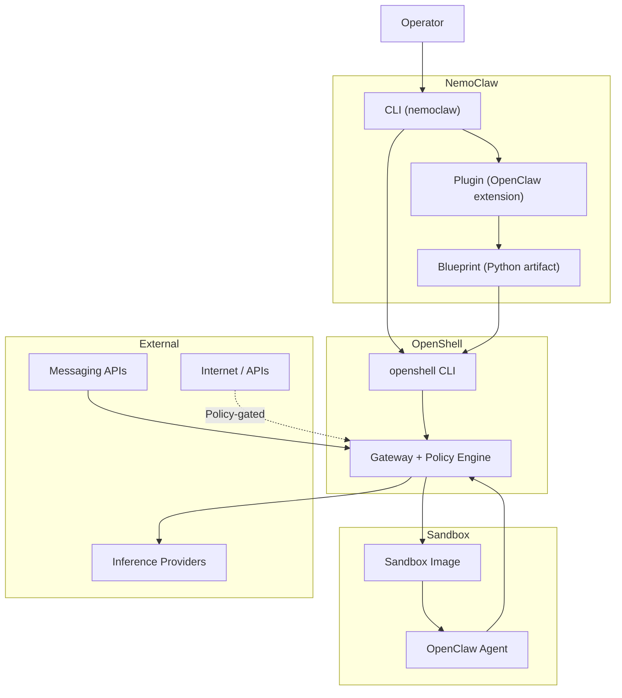
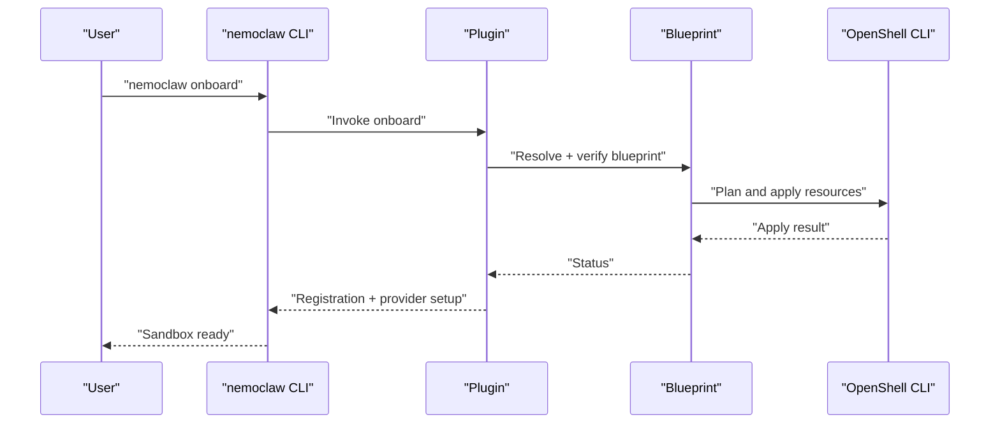
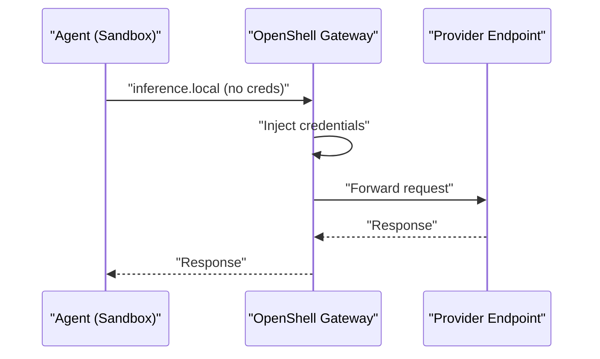
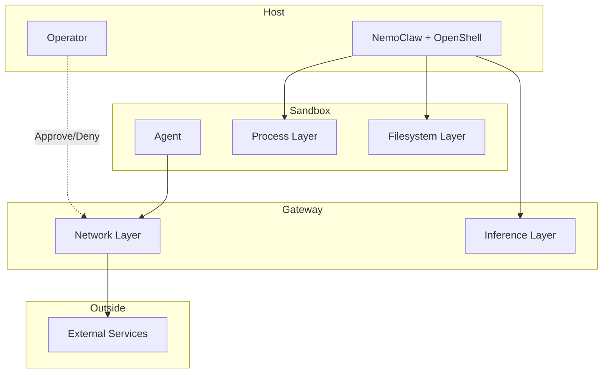
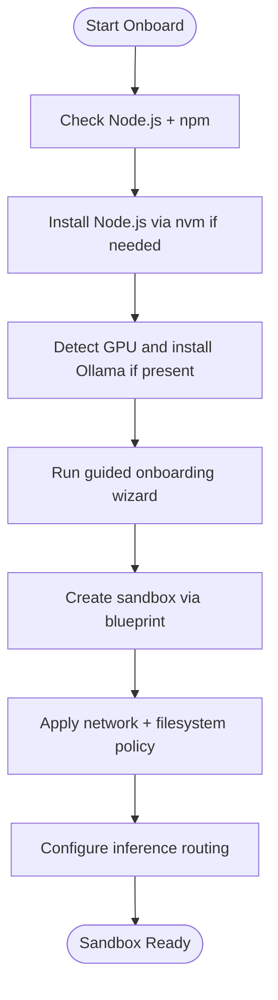
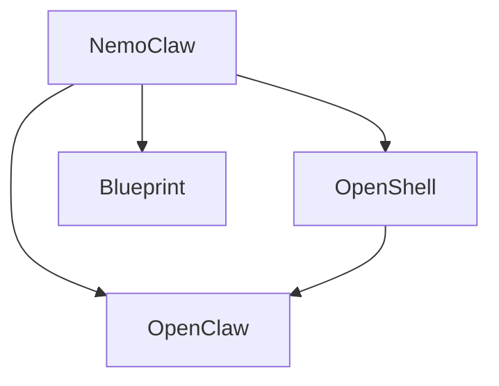

# Introduction and Purpose

<cite>
**Referenced Files in This Document**
- [README.md](file://README.md)
- [docs/about/overview.md](file://docs/about/overview.md)
- [docs/about/how-it-works.md](file://docs/about/how-it-works.md)
- [docs/reference/architecture.md](file://docs/reference/architecture.md)
- [docs/deployment/sandbox-hardening.md](file://docs/deployment/sandbox-hardening.md)
- [docs/security/best-practices.md](file://docs/security/best-practices.md)
- [docs/get-started/quickstart.md](file://docs/get-started/quickstart.md)
- [nemoclaw/src/index.ts](file://nemoclaw/src/index.ts)
- [nemoclaw/openclaw.plugin.json](file://nemoclaw/openclaw.plugin.json)
- [nemoclaw-blueprint/blueprint.yaml](file://nemoclaw-blueprint/blueprint.yaml)
- [bin/nemoclaw.js](file://bin/nemoclaw.js)
- [scripts/install.sh](file://scripts/install.sh)
- [CONTRIBUTING.md](file://CONTRIBUTING.md)
</cite>

## Table of Contents
1. [Introduction](#introduction)
2. [Project Structure](#project-structure)
3. [Core Components](#core-components)
4. [Architecture Overview](#architecture-overview)
5. [Detailed Component Analysis](#detailed-component-analysis)
6. [Dependency Analysis](#dependency-analysis)
7. [Performance Considerations](#performance-considerations)
8. [Troubleshooting Guide](#troubleshooting-guide)
9. [Conclusion](#conclusion)
10. [Appendices](#appendices)

## Introduction
NemoClaw is an open-source reference stack that makes it simpler and safer to run always-on AI assistants based on NVIDIA OpenClaw. It integrates tightly with NVIDIA OpenShell to deliver a hardened sandbox environment, layered protections, and a guided onboarding experience. NemoClaw’s mission is to lower the barrier to deploying trustworthy, policy-driven agents while keeping security front of mind from day one.

At its core, NemoClaw solves a practical problem: how to operate powerful AI agents reliably and safely without exposing systems, data, or users to unnecessary risk. It achieves this by combining:
- A guided onboarding flow that validates credentials, selects providers, and creates a working sandbox in one step
- A hardened blueprint that defines secure container images, least-privilege network rules, and capability drops
- A state management system that migrates agent state across machines with integrity checks and credential stripping
- Messaging bridges that connect chat platforms (Telegram, Discord, Slack) to the sandboxed agent
- Inference routing that keeps provider credentials on the host while the agent communicates through a controlled gateway

NVIDIA OpenShell provides the foundational sandboxing and policy enforcement. NemoClaw adds the “what” and “how” to make it easy for operators to deploy, manage, and evolve OpenClaw agents in a safe, repeatable way. Whether you are testing integrations, running an always-on assistant, or deploying to remote GPUs, NemoClaw offers a complete solution built on open tooling and open blueprints.

NemoClaw is currently in alpha. Expect iterative changes to APIs, configuration schemas, and runtime behavior as the project stabilizes. Early adopters are encouraged to experiment, provide feedback, and participate in the community to help shape the future of this reference stack.

**Section sources**
- [README.md:10-23](file://README.md#L10-L23)
- [docs/about/overview.md:23-31](file://docs/about/overview.md#L23-L31)
- [docs/about/how-it-works.md:23-42](file://docs/about/how-it-works.md#L23-L42)
- [docs/reference/architecture.md:25-30](file://docs/reference/architecture.md#L25-L30)

## Project Structure
NemoClaw is organized as a cohesive reference stack with clear separation of concerns:
- A TypeScript plugin that extends OpenClaw inside the sandbox and registers commands and providers
- A Python blueprint that orchestrates sandbox creation, policy application, and inference routing via OpenShell
- A CLI entry point that coordinates onboarding, sandbox lifecycle, and integration with OpenShell
- Supporting scripts and documentation that guide installation, security hardening, and best practices

**Diagram sources**
- [docs/reference/architecture.md:25-86](file://docs/reference/architecture.md#L25-L86)
- [bin/nemoclaw.js:72-95](file://bin/nemoclaw.js#L72-L95)
- [nemoclaw/src/index.ts:237-266](file://nemoclaw/src/index.ts#L237-L266)
- [nemoclaw/openclaw.plugin.json:1-33](file://nemoclaw/openclaw.plugin.json#L1-L33)
- [nemoclaw-blueprint/blueprint.yaml:1-66](file://nemoclaw-blueprint/blueprint.yaml#L1-L66)

**Section sources**
- [docs/reference/architecture.md:25-86](file://docs/reference/architecture.md#L25-L86)
- [README.md:151-167](file://README.md#L151-L167)
- [CONTRIBUTING.md:86-98](file://CONTRIBUTING.md#L86-L98)

## Core Components
- Plugin: Registers slash commands and inference providers inside the sandbox, and delegates orchestration to the blueprint. It exposes a single command for sandbox management and integrates with OpenClaw’s plugin API.
- Blueprint: A versioned Python artifact that defines sandbox shape, policies, and provider configurations. It resolves, verifies, and executes sandbox lifecycle operations through OpenShell.
- CLI: The primary interface for onboarding, sandbox management, and integration with OpenShell. It handles gateway lifecycle, port forwarding, and recovery flows.
- Installer: Guides users through Node.js setup, optional Ollama installation, and onboarding to create a sandbox with security policies and inference routing.
- Security and Hardening: Built-in controls across network, filesystem, process, and inference layers, with presets and posture profiles to tailor risk posture.

Benefits:
- Sandboxed execution with Landlock, seccomp, and network namespace isolation
- Transparent inference routing through OpenShell to hosted or local providers
- Declarative network policy with operator approval flow
- Single CLI to orchestrate gateway, sandbox, inference provider, and policy
- Blueprint lifecycle with versioning and digest verification

Use cases:
- Always-on assistant with controlled network access and operator-approved egress
- Sandboxed testing before granting broader permissions
- Remote GPU deployment for persistent operation

**Section sources**
- [nemoclaw/src/index.ts:237-266](file://nemoclaw/src/index.ts#L237-L266)
- [nemoclaw/openclaw.plugin.json:1-33](file://nemoclaw/openclaw.plugin.json#L1-L33)
- [nemoclaw-blueprint/blueprint.yaml:1-66](file://nemoclaw-blueprint/blueprint.yaml#L1-L66)
- [bin/nemoclaw.js:780-796](file://bin/nemoclaw.js#L780-L796)
- [scripts/install.sh:580-630](file://scripts/install.sh#L580-L630)
- [docs/about/overview.md:32-66](file://docs/about/overview.md#L32-L66)
- [docs/about/overview.md:67-87](file://docs/about/overview.md#L67-L87)

## Architecture Overview
NemoClaw sits atop NVIDIA OpenShell, which provides sandbox containers, a credential-storing gateway, inference proxying, and policy enforcement. NemoClaw supplies the “what” and “how”: what goes into the sandbox, how to configure it, and how to operate it safely.

**Diagram sources**
- [docs/reference/architecture.md:25-86](file://docs/reference/architecture.md#L25-L86)
- [docs/about/how-it-works.md:28-42](file://docs/about/how-it-works.md#L28-L42)
- [docs/about/how-it-works.md:103-112](file://docs/about/how-it-works.md#L103-L112)

**Section sources**
- [docs/reference/architecture.md:25-86](file://docs/reference/architecture.md#L25-L86)
- [docs/about/how-it-works.md:28-42](file://docs/about/how-it-works.md#L28-L42)

## Detailed Component Analysis

### Plugin and Blueprint Relationship
NemoClaw’s plugin is intentionally thin: it registers commands and providers inside the sandbox and delegates orchestration to the blueprint. The blueprint is a versioned artifact that orchestrates OpenShell resources (gateway, sandbox, policy, inference) and is resolved, verified, and executed by the plugin.

**Diagram sources**
- [docs/about/how-it-works.md:114-123](file://docs/about/how-it-works.md#L114-L123)
- [docs/reference/architecture.md:139-146](file://docs/reference/architecture.md#L139-L146)
- [nemoclaw/src/index.ts:237-266](file://nemoclaw/src/index.ts#L237-L266)

**Section sources**
- [docs/about/how-it-works.md:103-123](file://docs/about/how-it-works.md#L103-L123)
- [docs/reference/architecture.md:139-146](file://docs/reference/architecture.md#L139-L146)
- [nemoclaw/src/index.ts:237-266](file://nemoclaw/src/index.ts#L237-L266)

### Inference Routing and Credential Isolation
Inference requests from the agent are intercepted by the OpenShell gateway and routed to the configured provider. The agent never receives provider credentials; they remain on the host. This architecture ensures that even if the sandbox is compromised, provider secrets are not exposed.

**Diagram sources**
- [docs/about/how-it-works.md:125-130](file://docs/about/how-it-works.md#L125-L130)
- [docs/security/best-practices.md:412-427](file://docs/security/best-practices.md#L412-L427)

**Section sources**
- [docs/about/how-it-works.md:125-130](file://docs/about/how-it-works.md#L125-L130)
- [docs/security/best-practices.md:412-427](file://docs/security/best-practices.md#L412-L427)

### Protection Layers and Security Posture
NemoClaw enforces security across four layers: network, filesystem, process, and inference. Defaults are deny-by-default, with operator approval for unknown outbound requests. Some controls are locked at sandbox creation (filesystem, process), while others can be hot-reloaded (network, inference).

**Diagram sources**
- [docs/security/best-practices.md:38-93](file://docs/security/best-practices.md#L38-L93)

**Section sources**
- [docs/security/best-practices.md:25-43](file://docs/security/best-practices.md#L25-L43)
- [docs/security/best-practices.md:126-191](file://docs/security/best-practices.md#L126-L191)
- [docs/security/best-practices.md:269-328](file://docs/security/best-practices.md#L269-L328)
- [docs/security/best-practices.md:412-427](file://docs/security/best-practices.md#L412-L427)

### Sandbox Hardening Controls
The sandbox image applies multiple hardening measures to reduce attack surface and limit blast radius:
- Removal of build toolchains and network probes from the runtime image
- Process limits via ulimit to mitigate fork-bomb risks
- Capability drops and read-only system paths enforced at runtime and via container security contexts
- Immutable and integrity-verified gateway configuration directories

**Section sources**
- [docs/deployment/sandbox-hardening.md:25-58](file://docs/deployment/sandbox-hardening.md#L25-L58)
- [docs/deployment/sandbox-hardening.md:59-91](file://docs/deployment/sandbox-hardening.md#L59-L91)
- [docs/security/best-practices.md:208-268](file://docs/security/best-practices.md#L208-L268)

### Onboarding and Lifecycle Management
The CLI orchestrates a guided onboarding experience that validates credentials, selects providers, and creates a sandbox with security policies and inference routing. It also manages gateway lifecycle, port forwarding, and recovery flows to keep agents running consistently.

**Diagram sources**
- [scripts/install.sh:580-630](file://scripts/install.sh#L580-L630)
- [scripts/install.sh:667-715](file://scripts/install.sh#L667-L715)
- [bin/nemoclaw.js:780-796](file://bin/nemoclaw.js#L780-L796)

**Section sources**
- [scripts/install.sh:580-630](file://scripts/install.sh#L580-L630)
- [scripts/install.sh:667-715](file://scripts/install.sh#L667-L715)
- [bin/nemoclaw.js:780-796](file://bin/nemoclaw.js#L780-L796)

## Dependency Analysis
NemoClaw depends on and integrates with NVIDIA OpenShell and OpenClaw:
- OpenShell provides sandbox containers, gateway, policy enforcement, and CLI orchestration
- OpenClaw runs inside the sandbox and is extended by the NemoClaw plugin
- The blueprint is a separate Python artifact with its own release cadence and version constraints

**Diagram sources**
- [docs/reference/architecture.md:25-30](file://docs/reference/architecture.md#L25-L30)
- [docs/about/how-it-works.md:28-42](file://docs/about/how-it-works.md#L28-L42)

**Section sources**
- [docs/reference/architecture.md:25-30](file://docs/reference/architecture.md#L25-L30)
- [docs/about/how-it-works.md:28-42](file://docs/about/how-it-works.md#L28-L42)

## Performance Considerations
- Container startup and policy enforcement are optimized through deny-by-default baselines and hot-reloadable controls where appropriate
- Inference routing through the gateway introduces minimal overhead while centralizing credential management and reducing risk
- Sandboxing and hardening controls are designed to minimize performance regressions while preserving security guarantees

[No sources needed since this section provides general guidance]

## Troubleshooting Guide
Common areas to review when encountering issues:
- Gateway lifecycle and identity drift after restarts
- Port forwarding and dashboard connectivity
- Policy approval flow for unknown outbound requests
- Sandbox recovery and gateway restart procedures

**Section sources**
- [bin/nemoclaw.js:509-542](file://bin/nemoclaw.js#L509-L542)
- [bin/nemoclaw.js:615-740](file://bin/nemoclaw.js#L615-L740)
- [docs/security/best-practices.md:181-191](file://docs/security/best-practices.md#L181-L191)

## Conclusion
NemoClaw is a complete reference stack for running NVIDIA OpenClaw always-on assistants in a secure, sandboxed environment. By combining guided onboarding, hardened blueprints, layered security protections, and seamless integration with NVIDIA OpenShell, it lowers the complexity of deploying trustworthy AI agents while maintaining strong safety and operational controls. As an alpha project, it invites early adopters to experiment, iterate, and contribute to an open ecosystem that prioritizes security, simplicity, and reliability.

[No sources needed since this section summarizes without analyzing specific files]

## Appendices
- Quickstart and prerequisites for installation and first use
- Community and contribution guidelines for development and feedback

**Section sources**
- [docs/get-started/quickstart.md:25-31](file://docs/get-started/quickstart.md#L25-L31)
- [CONTRIBUTING.md:168-225](file://CONTRIBUTING.md#L168-L225)