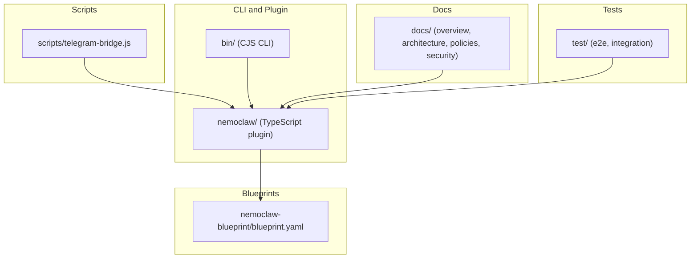
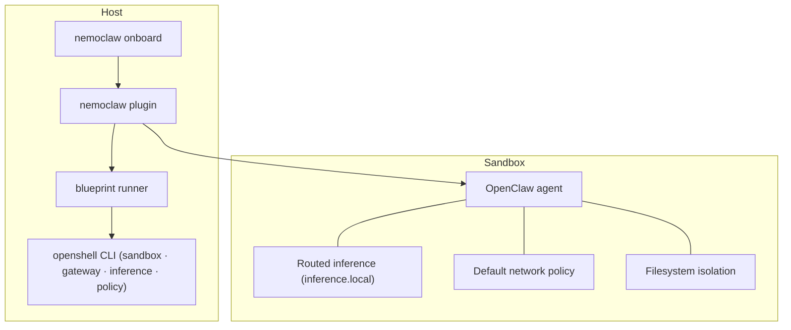
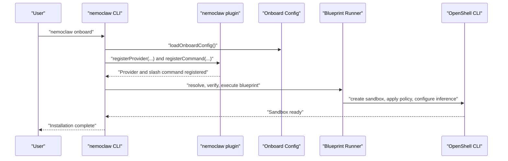
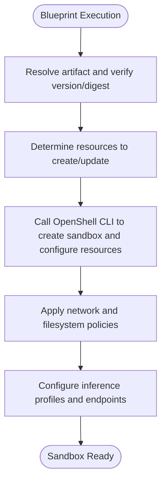
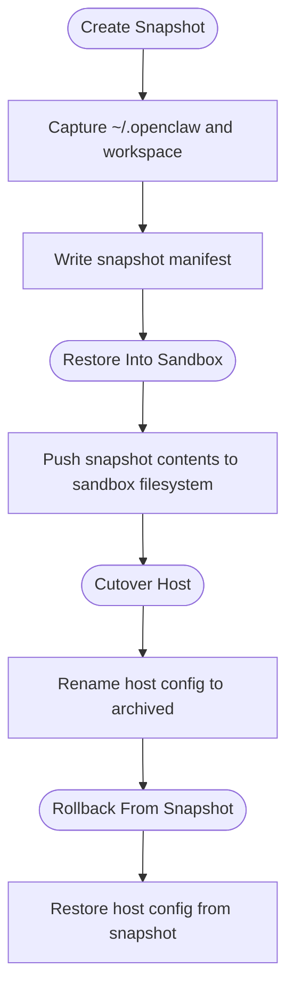
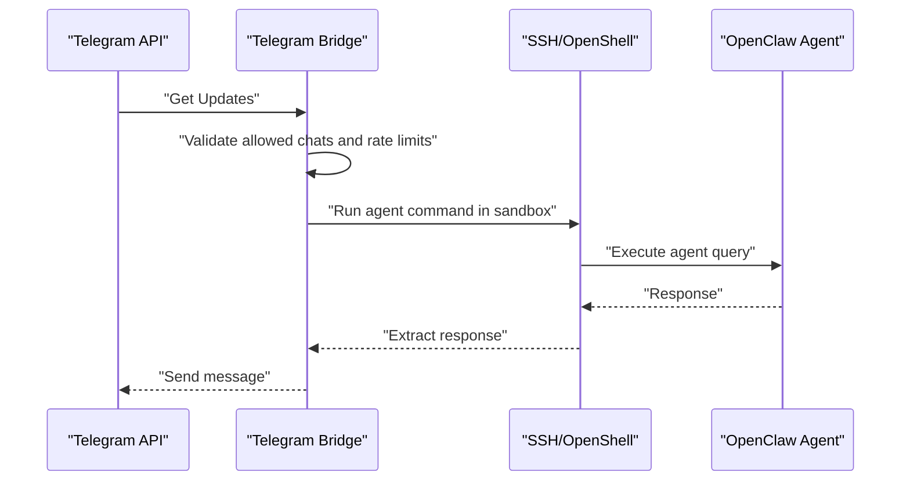
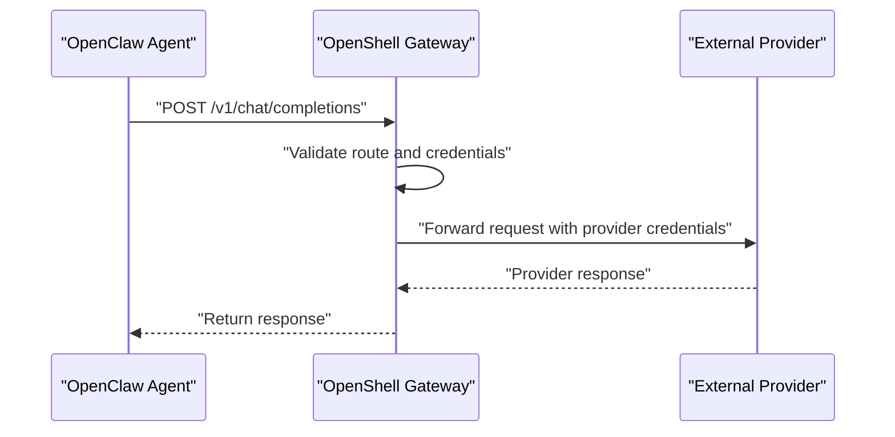
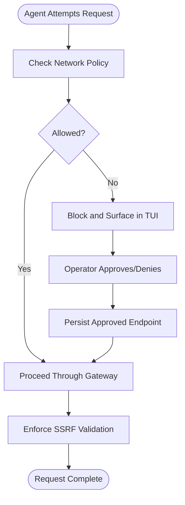
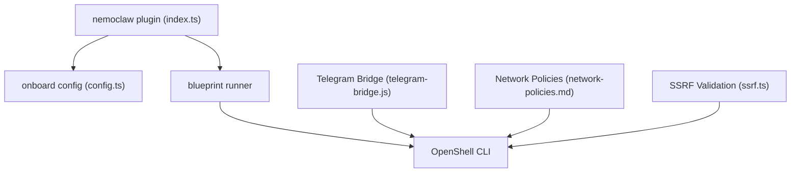

# Key Features and Benefits

<cite>
**Referenced Files in This Document**
- [README.md](file://README.md)
- [index.ts](file://nemoclaw/src/index.ts)
- [config.ts](file://nemoclaw/src/onboard/config.ts)
- [state.ts](file://nemoclaw/src/blueprint/state.ts)
- [snapshot.ts](file://nemoclaw/src/blueprint/snapshot.ts)
- [ssrf.ts](file://nemoclaw/src/blueprint/ssrf.ts)
- [blueprint.yaml](file://nemoclaw-blueprint/blueprint.yaml)
- [overview.md](file://docs/about/overview.md)
- [how-it-works.md](file://docs/about/how-it-works.md)
- [network-policies.md](file://docs/reference/network-policies.md)
- [sandbox-hardening.md](file://docs/deployment/sandbox-hardening.md)
- [best-practices.md](file://docs/security/best-practices.md)
- [telegram-bridge.js](file://scripts/telegram-bridge.js)
- [test-e2e-cloud-experimental.sh](file://test/e2e/test-e2e-cloud-experimental.sh)
</cite>

## Table of Contents
1. [Introduction](#introduction)
2. [Project Structure](#project-structure)
3. [Core Components](#core-components)
4. [Architecture Overview](#architecture-overview)
5. [Detailed Component Analysis](#detailed-component-analysis)
6. [Dependency Analysis](#dependency-analysis)
7. [Performance Considerations](#performance-considerations)
8. [Troubleshooting Guide](#troubleshooting-guide)
9. [Conclusion](#conclusion)

## Introduction
NemoClaw is an open-source reference stack that simplifies running always-on OpenClaw assistants safely. It integrates with the NVIDIA OpenShell runtime to provide a hardened sandbox environment and adds guided onboarding, a hardened blueprint system, state management, messaging bridges, routed inference, and layered security protection. The project emphasizes safety, ease of use, and operational efficiency, with a focus on alpha software status and continuous iteration.

## Project Structure
NemoClaw’s repository is organized into distinct areas:
- CLI and plugin: bin/ and nemoclaw/ provide the command-line entry point and TypeScript plugin that registers slash commands and inference providers.
- Blueprints: nemoclaw-blueprint/ defines the sandbox image, inference profiles, and network policy additions.
- Scripts: scripts/ includes host-side automation such as the Telegram bridge.
- Docs: docs/ contains user-facing documentation covering overview, architecture, security best practices, and policy references.
- Tests: test/ includes end-to-end and integration tests validating sandbox behavior, policy enforcement, and inference routing.

**Diagram sources**
- [index.ts:237-266](file://nemoclaw/src/index.ts#L237-L266)
- [blueprint.yaml:1-66](file://nemoclaw-blueprint/blueprint.yaml#L1-L66)
- [telegram-bridge.js:1-276](file://scripts/telegram-bridge.js#L1-L276)

**Section sources**
- [README.md:151-167](file://README.md#L151-L167)

## Core Components
This section outlines the key features and how they contribute to safety, ease of use, and operational efficiency.

- Guided onboarding
  - Validates credentials, selects providers, and creates a working sandbox in one command. The onboarding configuration persists host-side and describes the endpoint type, provider, and model selection.
  - Benefits: reduces friction, ensures consistent setup, and minimizes misconfiguration risks.
  - Example interaction: the plugin loads onboarding config and registers an inference provider and slash command for sandbox management.

- Hardened blueprint system
  - A security-first blueprint with capability drops, least-privilege network rules, and declarative policy. The blueprint orchestrates sandbox creation, policy application, and inference provider setup through OpenShell.
  - Benefits: immutability, reproducibility, and supply-chain safety via versioned digests.
  - Example interaction: blueprint YAML defines sandbox image, inference profiles, and policy additions.

- State management
  - Safe migration of agent state across machines with credential stripping and integrity verification. Snapshots capture host OpenClaw configuration and workspace, enabling cutover and rollback.
  - Benefits: operational continuity, disaster recovery, and reduced downtime.
  - Example interaction: snapshot creation, restoration into sandbox, and cutover/rollback logic.

- Messaging bridges
  - Host-side processes connect Telegram, Discord, and Slack to the sandboxed agent. The Telegram bridge polls messages, validates access, and runs agent commands inside the sandbox via SSH and OpenShell.
  - Benefits: seamless integration with communication platforms while keeping agent execution isolated.
  - Example interaction: the bridge validates environment variables, polls Telegram, and executes sandboxed agent queries.

- Routed inference
  - Provider-routed model calls through the OpenShell gateway, transparent to the agent. Credentials remain on the host; the agent communicates with inference.local.
  - Benefits: centralized control, cost visibility, and credential isolation.
  - Example interaction: blueprint defines provider profiles and endpoints; the gateway intercepts and routes inference requests.

- Layered protection
  - Network, filesystem, process, and inference controls that can be hot-reloaded or locked at creation. Operators approve endpoints dynamically; the sandbox enforces deny-by-default policies.
  - Benefits: robust defense-in-depth, operator oversight, and granular risk management.
  - Example interaction: network policies define allowed endpoints and binary/path restrictions; SSRF validation rejects private/internal addresses.

**Section sources**
- [index.ts:136-202](file://nemoclaw/src/index.ts#L136-L202)
- [config.ts:21-68](file://nemoclaw/src/onboard/config.ts#L21-L68)
- [snapshot.ts:57-135](file://nemoclaw/src/blueprint/snapshot.ts#L57-L135)
- [blueprint.yaml:19-66](file://nemoclaw-blueprint/blueprint.yaml#L19-L66)
- [telegram-bridge.js:96-158](file://scripts/telegram-bridge.js#L96-L158)
- [network-policies.md:25-104](file://docs/reference/network-policies.md#L25-L104)
- [ssrf.ts:118-155](file://nemoclaw/src/blueprint/ssrf.ts#L118-L155)

## Architecture Overview
The system architecture layers NemoClaw on top of OpenShell, combining a lightweight CLI plugin with a versioned blueprint to move OpenClaw into a controlled sandbox. The plugin registers slash commands and inference providers; the blueprint orchestrates sandbox creation, policy application, and inference routing.

**Diagram sources**
- [how-it-works.md:44-81](file://docs/about/how-it-works.md#L44-L81)
- [index.ts:237-266](file://nemoclaw/src/index.ts#L237-L266)

**Section sources**
- [how-it-works.md:28-102](file://docs/about/how-it-works.md#L28-L102)

## Detailed Component Analysis

### Guided Onboarding Experience
The onboarding component captures user preferences and environment, persists them, and feeds into plugin registration and blueprint execution. It supports multiple endpoint types and providers, and describes the selected endpoint/provider/model for operator visibility.

**Diagram sources**
- [index.ts:237-266](file://nemoclaw/src/index.ts#L237-L266)
- [config.ts:91-110](file://nemoclaw/src/onboard/config.ts#L91-L110)
- [how-it-works.md:114-123](file://docs/about/how-it-works.md#L114-L123)

**Section sources**
- [config.ts:21-68](file://nemoclaw/src/onboard/config.ts#L21-L68)
- [index.ts:178-202](file://nemoclaw/src/index.ts#L178-L202)
- [how-it-works.md:114-123](file://docs/about/how-it-works.md#L114-L123)

### Hardened Blueprint System
The blueprint defines the sandbox image, inference profiles, and policy additions. It ensures version compatibility, digest verification, and reproducible setup. The blueprint orchestrates OpenShell resources and applies security policies at creation time.

**Diagram sources**
- [how-it-works.md:119-123](file://docs/about/how-it-works.md#L119-L123)
- [blueprint.yaml:19-66](file://nemoclaw-blueprint/blueprint.yaml#L19-L66)

**Section sources**
- [blueprint.yaml:19-66](file://nemoclaw-blueprint/blueprint.yaml#L19-L66)
- [how-it-works.md:119-123](file://docs/about/how-it-works.md#L119-L123)

### State Management Capabilities
State management enables safe migration of agent state across machines. Snapshots capture host configuration and workspace, and restoration pushes contents into the sandbox filesystem. Cutover renames host config and points OpenClaw at the sandbox; rollback restores host config from snapshot.

**Diagram sources**
- [snapshot.ts:57-135](file://nemoclaw/src/blueprint/snapshot.ts#L57-L135)

**Section sources**
- [snapshot.ts:57-135](file://nemoclaw/src/blueprint/snapshot.ts#L57-L135)
- [state.ts:9-61](file://nemoclaw/src/blueprint/state.ts#L9-L61)

### Messaging Bridges
The Telegram bridge connects external messaging to the sandboxed agent. It validates environment variables, polls Telegram updates, enforces rate limits, and executes agent commands inside the sandbox via SSH and OpenShell. Operator approval is surfaced in the TUI when the agent attempts unlisted endpoints.

**Diagram sources**
- [telegram-bridge.js:162-247](file://scripts/telegram-bridge.js#L162-L247)
- [telegram-bridge.js:98-158](file://scripts/telegram-bridge.js#L98-L158)

**Section sources**
- [telegram-bridge.js:12-39](file://scripts/telegram-bridge.js#L12-L39)
- [telegram-bridge.js:162-247](file://scripts/telegram-bridge.js#L162-L247)

### Routed Inference
Inference requests from the agent are intercepted by OpenShell and routed to the configured provider. The plugin registers an inference provider and model catalog based on onboarding configuration. The blueprint defines provider profiles and endpoints, ensuring credentials remain on the host and the agent communicates with inference.local.

**Diagram sources**
- [how-it-works.md:125-131](file://docs/about/how-it-works.md#L125-L131)
- [index.ts:178-202](file://nemoclaw/src/index.ts#L178-L202)
- [blueprint.yaml:26-56](file://nemoclaw-blueprint/blueprint.yaml#L26-L56)

**Section sources**
- [how-it-works.md:125-131](file://docs/about/how-it-works.md#L125-L131)
- [index.ts:178-202](file://nemoclaw/src/index.ts#L178-L202)
- [blueprint.yaml:26-56](file://nemoclaw-blueprint/blueprint.yaml#L26-L56)

### Layered Security Protection
NemoClaw enforces deny-by-default policies across network, filesystem, process, and inference layers. Operators approve endpoints dynamically; the sandbox enforces filesystem isolation and process limits. SSRF validation rejects private/internal addresses, and policy presets provide common integration configurations.

**Diagram sources**
- [network-policies.md:25-104](file://docs/reference/network-policies.md#L25-L104)
- [ssrf.ts:118-155](file://nemoclaw/src/blueprint/ssrf.ts#L118-L155)
- [best-practices.md:126-191](file://docs/security/best-practices.md#L126-L191)

**Section sources**
- [network-policies.md:25-104](file://docs/reference/network-policies.md#L25-L104)
- [ssrf.ts:118-155](file://nemoclaw/src/blueprint/ssrf.ts#L118-L155)
- [best-practices.md:126-191](file://docs/security/best-practices.md#L126-L191)

## Dependency Analysis
NemoClaw’s plugin depends on onboarding configuration and blueprint execution. The blueprint depends on OpenShell CLI for sandbox creation and policy application. Messaging bridges depend on OpenShell SSH configuration and environment variables. Network policies and SSRF validation are enforced by OpenShell and documented in the security best practices.

**Diagram sources**
- [index.ts:237-266](file://nemoclaw/src/index.ts#L237-L266)
- [config.ts:91-110](file://nemoclaw/src/onboard/config.ts#L91-L110)
- [telegram-bridge.js:25-39](file://scripts/telegram-bridge.js#L25-L39)
- [network-policies.md:25-104](file://docs/reference/network-policies.md#L25-L104)
- [ssrf.ts:118-155](file://nemoclaw/src/blueprint/ssrf.ts#L118-L155)

**Section sources**
- [index.ts:237-266](file://nemoclaw/src/index.ts#L237-L266)
- [config.ts:91-110](file://nemoclaw/src/onboard/config.ts#L91-L110)
- [telegram-bridge.js:25-39](file://scripts/telegram-bridge.js#L25-L39)
- [network-policies.md:25-104](file://docs/reference/network-policies.md#L25-L104)
- [ssrf.ts:118-155](file://nemoclaw/src/blueprint/ssrf.ts#L118-L155)

## Performance Considerations
- Sandbox startup and policy application are orchestrated by the blueprint to minimize overhead while ensuring security.
- Inference routing through the gateway centralizes credential management and reduces latency by avoiding direct external calls from the sandbox.
- Messaging bridges implement rate limiting and per-chat serialization to prevent resource exhaustion and ensure fair throughput.
- Network policy enforcement occurs at the gateway, reducing per-request overhead inside the sandbox.

## Troubleshooting Guide
- Installation and onboarding issues: Use the troubleshooting guide for common problems and resolution steps.
- Policy approval flow: When agents attempt to reach unlisted endpoints, OpenShell blocks the request and surfaces it in the TUI for operator review.
- Sandbox hardening: Adjust process limits, capability drops, and runtime flags to meet deployment requirements.
- Inference routing: Verify provider credentials and endpoints; ensure inference.local is reachable and properly configured.

**Section sources**
- [README.md:130-131](file://README.md#L130-L131)
- [network-policies.md:110-127](file://docs/reference/network-policies.md#L110-L127)
- [sandbox-hardening.md:38-91](file://docs/deployment/sandbox-hardening.md#L38-L91)
- [best-practices.md:488-500](file://docs/security/best-practices.md#L488-L500)

## Conclusion
NemoClaw delivers a comprehensive, safety-first solution for running always-on OpenClaw assistants. Its guided onboarding, hardened blueprint system, state management, messaging bridges, routed inference, and layered security protection collectively enhance safety, ease of use, and operational efficiency. As an alpha project, NemoClaw is evolving rapidly, with roadmap expectations centered on expanding provider support, refining policy presets, and strengthening enterprise-grade controls. Early adopters gain access to cutting-edge sandboxing and security features, while enterprise deployments benefit from reproducible setups, immutable blueprints, and robust operator oversight.