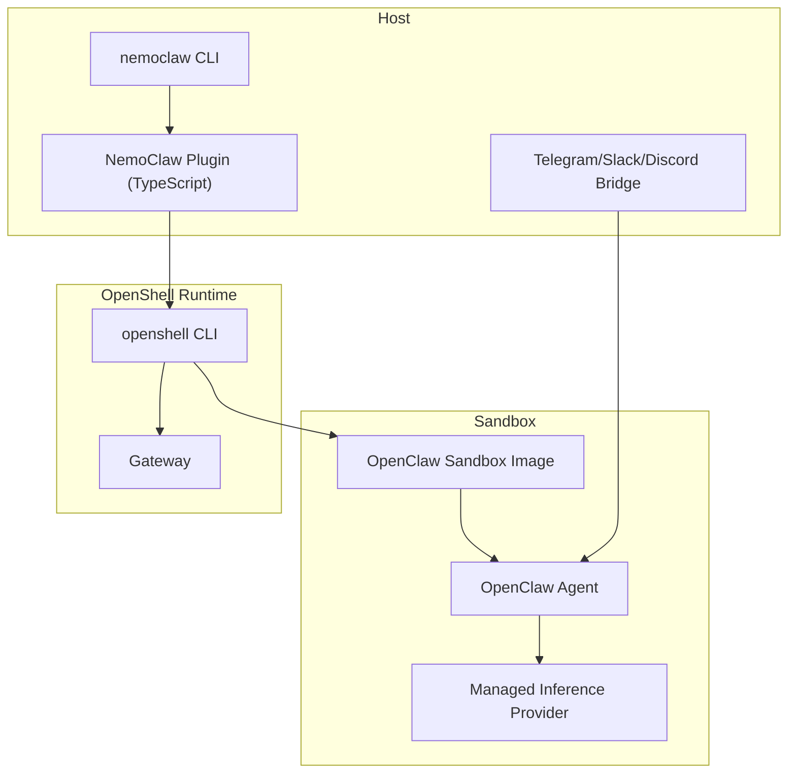
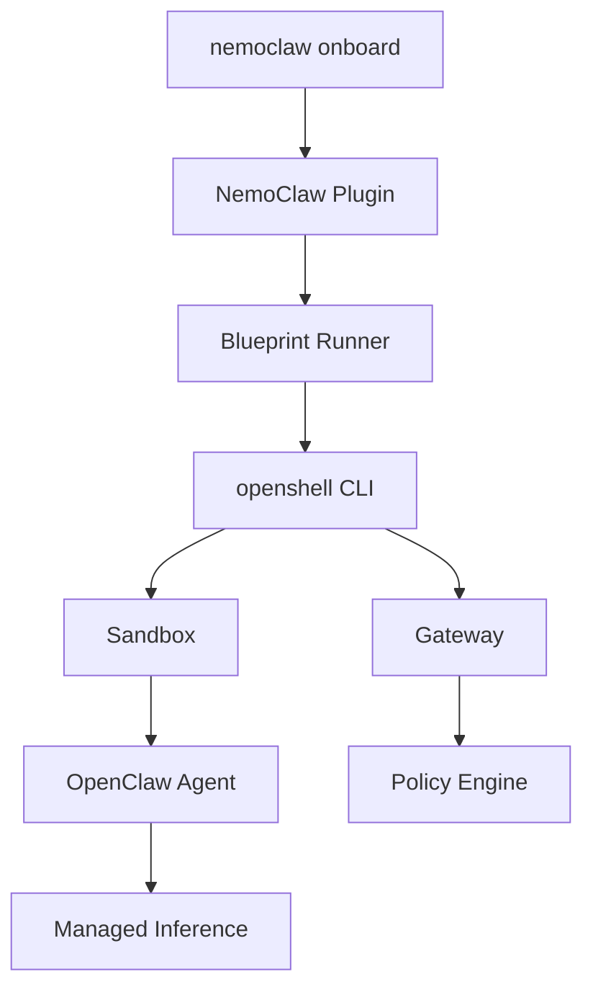
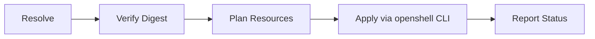
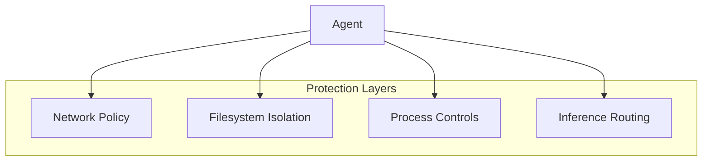
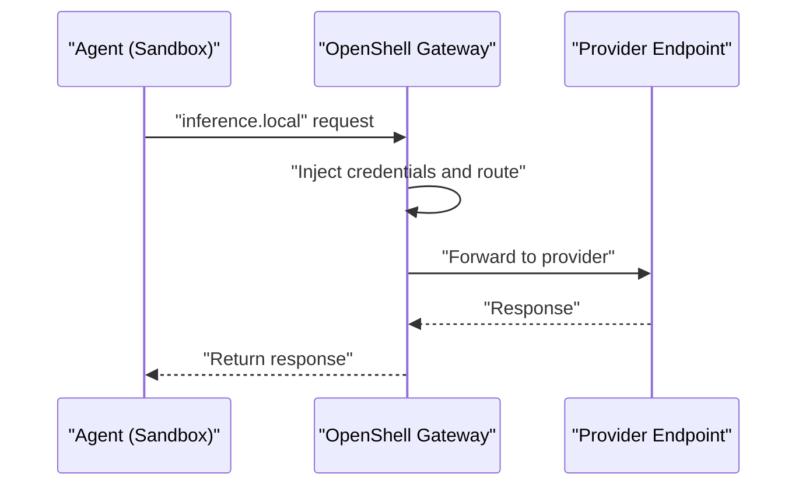
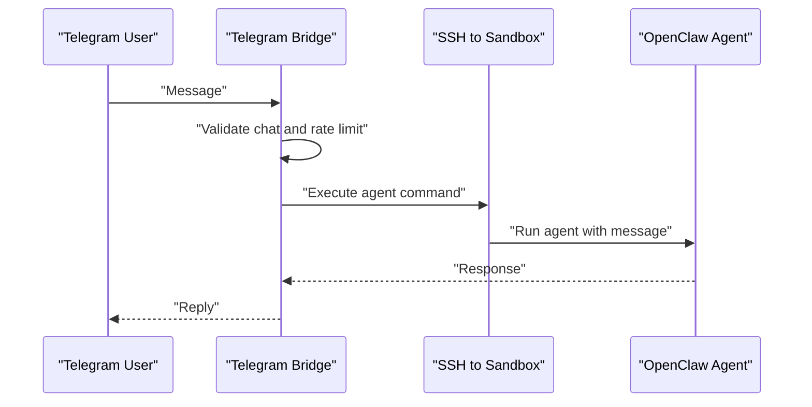
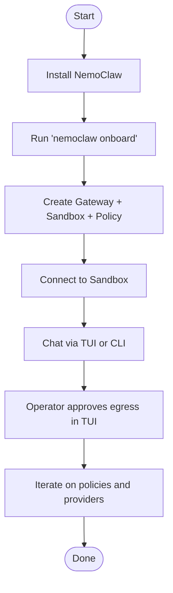
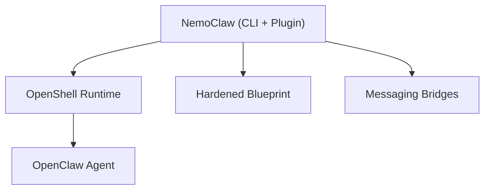

# Project Overview

<cite>
**Referenced Files in This Document**
- [README.md](file://README.md)
- [package.json](file://package.json)
- [docs/about/overview.md](file://docs/about/overview.md)
- [docs/about/how-it-works.md](file://docs/about/how-it-works.md)
- [docs/reference/architecture.md](file://docs/reference/architecture.md)
- [docs/get-started/quickstart.md](file://docs/get-started/quickstart.md)
- [docs/reference/network-policies.md](file://docs/reference/network-policies.md)
- [docs/deployment/sandbox-hardening.md](file://docs/deployment/sandbox-hardening.md)
- [docs/security/best-practices.md](file://docs/security/best-practices.md)
- [docs/reference/commands.md](file://docs/reference/commands.md)
- [docs/about/release-notes.md](file://docs/about/release-notes.md)
- [nemoclaw/src/index.ts](file://nemoclaw/src/index.ts)
- [nemoclaw-blueprint/blueprint.yaml](file://nemoclaw-blueprint/blueprint.yaml)
- [nemoclaw-blueprint/policies/openclaw-sandbox.yaml](file://nemoclaw-blueprint/policies/openclaw-sandbox.yaml)
- [scripts/telegram-bridge.js](file://scripts/telegram-bridge.js)
</cite>

## Table of Contents
1. [Introduction](#introduction)
2. [Project Structure](#project-structure)
3. [Core Components](#core-components)
4. [Architecture Overview](#architecture-overview)
5. [Detailed Component Analysis](#detailed-component-analysis)
6. [Dependency Analysis](#dependency-analysis)
7. [Performance Considerations](#performance-considerations)
8. [Troubleshooting Guide](#troubleshooting-guide)
9. [Conclusion](#conclusion)
10. [Appendices](#appendices)

## Introduction
NVIDIA NemoClaw is an open source reference stack that simplifies running OpenClaw always-on assistants more safely. It installs the NVIDIA OpenShell runtime and layers a hardened blueprint, guided onboarding, and layered protections on top of OpenShell to create a secure sandboxed environment for autonomous agents. NemoClaw’s purpose is to make it straightforward to deploy OpenClaw with strong privacy and security guardrails, enabling self-evolving agents to operate reliably in diverse environments—from cloud instances to on-premises systems and DGX Spark.

Key value propositions:
- Secure sandboxing with Landlock, seccomp, and network namespace isolation
- Guided onboarding that validates credentials, selects providers, and creates a working sandbox in one command
- Hardened blueprint with capability drops, least-privilege network rules, and declarative policy
- Layered protection: network, filesystem, process, and inference controls that can be hot-reloaded or locked at creation
- Messaging bridges connecting Telegram, Discord, and Slack to the sandboxed agent
- Routed inference through the OpenShell gateway, transparent to the agent

NemoClaw is part of the NVIDIA Agent Toolkit and integrates tightly with OpenShell and OpenClaw ecosystems. It focuses on supply chain safety, reproducible setup, and a deny-by-default posture across all protection layers.

**Section sources**
- [README.md:10-23](file://README.md#L10-L23)
- [docs/about/overview.md:23-31](file://docs/about/overview.md#L23-L31)

## Project Structure
At a high level, NemoClaw comprises:
- A TypeScript plugin that extends OpenClaw inside the sandbox and registers the NemoClaw slash command and managed inference provider
- A Python blueprint that orchestrates OpenShell resources (gateway, sandbox, policy, inference) and enforces supply chain safety
- A CLI (nemoclaw) that manages host-side operations and delegates heavy lifting to the blueprint
- Documentation and reference materials covering architecture, commands, policies, and best practices
- Scripts and bridges for messaging platforms and auxiliary services

**Diagram sources**
- [docs/reference/architecture.md:31-86](file://docs/reference/architecture.md#L31-L86)
- [nemoclaw/src/index.ts:237-266](file://nemoclaw/src/index.ts#L237-L266)

**Section sources**
- [README.md:151-167](file://README.md#L151-L167)
- [docs/reference/architecture.md:25-26](file://docs/reference/architecture.md#L25-L26)

## Core Components
- NemoClaw Plugin (TypeScript): Registers the /nemoclaw slash command, a managed inference provider, and integrates with the OpenClaw plugin API. It exposes configuration for blueprint versioning, registry, sandbox name, and provider selection.
- Blueprint (Python artifact): Orchestrates sandbox creation, policy application, and inference provider setup through OpenShell. It is versioned, digest-verified, and executed as a subprocess by the plugin.
- CLI (nemoclaw): Host-side command-line interface for onboarding, sandbox management, logs, status, and auxiliary services.
- Hardened Blueprint: Defines the sandbox image, inference profiles, and baseline network policy with deny-by-default rules.
- Messaging Bridges: Host-side processes that connect Telegram, Discord, and Slack to the sandboxed agent.

Practical example workflow:
- Install NemoClaw and onboard an agent in one command
- Connect to the sandbox and chat via TUI or CLI
- Approve network egress requests in the OpenShell TUI
- Monitor activity and adjust policies as needed

**Section sources**
- [nemoclaw/src/index.ts:129-231](file://nemoclaw/src/index.ts#L129-L231)
- [docs/about/how-it-works.md:103-124](file://docs/about/how-it-works.md#L103-L124)
- [docs/get-started/quickstart.md:68-117](file://docs/get-started/quickstart.md#L68-L117)
- [docs/reference/network-policies.md:25-27](file://docs/reference/network-policies.md#L25-L27)

## Architecture Overview
NemoClaw augments OpenShell with a thin plugin and a versioned blueprint. The plugin registers commands and providers inside the sandbox and resolves, verifies, and executes the blueprint as a subprocess. The blueprint orchestrates OpenShell resources and enforces security policies.

**Diagram sources**
- [docs/about/how-it-works.md:44-81](file://docs/about/how-it-works.md#L44-L81)
- [docs/reference/architecture.md:139-152](file://docs/reference/architecture.md#L139-L152)

**Section sources**
- [docs/about/how-it-works.md:28-42](file://docs/about/how-it-works.md#L28-L42)
- [docs/reference/architecture.md:27-29](file://docs/reference/architecture.md#L27-L29)

## Detailed Component Analysis

### Plugin and Blueprint Lifecycle
The plugin and blueprint collaborate to deliver a reproducible, supply-chain-safe setup:
- Resolve: Locate the blueprint artifact and check compatibility against minimum OpenShell and OpenClaw versions
- Verify: Validate the artifact digest and integrity
- Plan: Determine resources to create/update (gateway, sandbox, policy, inference)
- Apply: Execute the plan via OpenShell CLI
- Status: Report current state and health

**Diagram sources**
- [docs/reference/architecture.md:139-152](file://docs/reference/architecture.md#L139-L152)

**Section sources**
- [docs/reference/architecture.md:114-152](file://docs/reference/architecture.md#L114-L152)
- [nemoclaw-blueprint/blueprint.yaml:4-7](file://nemoclaw-blueprint/blueprint.yaml#L4-L7)

### Sandbox Environment and Protection Layers
The sandbox enforces a deny-by-default posture across four layers:
- Network: Blocks unauthorized outbound connections; operator approval flow for unknown hosts
- Filesystem: Read-only system paths, read-write workspace and temp; immutable gateway config
- Process: Capability drops, non-root user, process limits, PATH hardening, build toolchain removal
- Inference: Routed through OpenShell gateway; agent communicates with inference.local

**Diagram sources**
- [docs/security/best-practices.md:38-93](file://docs/security/best-practices.md#L38-L93)
- [docs/reference/network-policies.md:25-27](file://docs/reference/network-policies.md#L25-L27)

**Section sources**
- [docs/security/best-practices.md:25-43](file://docs/security/best-practices.md#L25-L43)
- [docs/reference/network-policies.md:33-42](file://docs/reference/network-policies.md#L33-L42)

### Inference Routing and Managed Providers
Inference requests from the agent are intercepted by OpenShell and routed to the configured provider through the gateway. Credentials remain on the host; the agent only talks to inference.local.

**Diagram sources**
- [docs/reference/architecture.md:164-173](file://docs/reference/architecture.md#L164-L173)
- [docs/about/how-it-works.md:125-131](file://docs/about/how-it-works.md#L125-L131)

**Section sources**
- [docs/about/how-it-works.md:125-131](file://docs/about/how-it-works.md#L125-L131)
- [docs/reference/architecture.md:164-173](file://docs/reference/architecture.md#L164-L173)

### Messaging Bridges
Host-side bridges connect Telegram, Discord, and Slack to the sandboxed agent. The Telegram bridge polls updates, validates chats, rate-limits, and forwards messages to the agent via SSH into the sandbox.

**Diagram sources**
- [scripts/telegram-bridge.js:162-247](file://scripts/telegram-bridge.js#L162-L247)

**Section sources**
- [scripts/telegram-bridge.js:12-39](file://scripts/telegram-bridge.js#L12-L39)
- [nemoclaw-blueprint/policies/openclaw-sandbox.yaml:174-219](file://nemoclaw-blueprint/policies/openclaw-sandbox.yaml#L174-L219)

### CLI and Onboarding Workflow
The CLI provides a single entrypoint for onboarding, sandbox management, logs, and auxiliary services. The guided onboarding wizard validates prerequisites, selects providers, and creates a working sandbox with hardened policies.

**Diagram sources**
- [docs/get-started/quickstart.md:68-117](file://docs/get-started/quickstart.md#L68-L117)
- [docs/reference/commands.md:59-106](file://docs/reference/commands.md#L59-L106)

**Section sources**
- [docs/get-started/quickstart.md:68-117](file://docs/get-started/quickstart.md#L68-L117)
- [docs/reference/commands.md:27-106](file://docs/reference/commands.md#L27-L106)

## Dependency Analysis
NemoClaw depends on:
- OpenShell for sandboxing, gateway, policy enforcement, and inference routing
- OpenClaw for the agent runtime and plugin SDK
- The blueprint for orchestrating resources and enforcing security policies
- Optional messaging bridges for external communication

**Diagram sources**
- [docs/reference/architecture.md:25-29](file://docs/reference/architecture.md#L25-L29)
- [nemoclaw/src/index.ts:237-266](file://nemoclaw/src/index.ts#L237-L266)

**Section sources**
- [docs/reference/architecture.md:25-29](file://docs/reference/architecture.md#L25-L29)
- [nemoclaw/src/index.ts:237-266](file://nemoclaw/src/index.ts#L237-L266)

## Performance Considerations
- Container runtime capabilities and process limits reduce blast radius and mitigate fork-bomb risks
- Build toolchain removal and PATH hardening minimize attack surface
- Network namespace isolation and policy enforcement reduce overhead by centralizing egress control
- Inference routing through the gateway avoids repeated credential handling and reduces latency variability

[No sources needed since this section provides general guidance]

## Troubleshooting Guide
Common areas to check:
- Pre-flight checks for Docker and supported runtimes during onboarding
- Operator approval flow for unknown egress requests in the OpenShell TUI
- Policy presets and baseline rules in the hardened blueprint
- Debug diagnostics collection via the CLI for bug reports

**Section sources**
- [docs/reference/commands.md:104-106](file://docs/reference/commands.md#L104-L106)
- [docs/reference/network-policies.md:110-127](file://docs/reference/network-policies.md#L110-L127)
- [docs/reference/commands.md:236-244](file://docs/reference/commands.md#L236-L244)

## Conclusion
NemoClaw delivers a secure, reproducible, and guided path to run OpenClaw agents in a sandboxed environment. By combining OpenShell’s platform-level protections with a hardened blueprint, deny-by-default policies, and managed inference routing, it lowers operational risk while maintaining flexibility for evolving agent behaviors. The project is in alpha and welcomes community feedback as it stabilizes.

[No sources needed since this section summarizes without analyzing specific files]

## Appendices

### Practical Example: From Installation to Agent Interaction
- Install NemoClaw and onboard an agent in one command
- Connect to the sandbox and chat via TUI or CLI
- Approve network egress requests in the OpenShell TUI
- Monitor activity and adjust policies as needed

**Section sources**
- [docs/get-started/quickstart.md:68-117](file://docs/get-started/quickstart.md#L68-L117)
- [docs/reference/network-policies.md:110-127](file://docs/reference/network-policies.md#L110-L127)

### Alpha Software Status and Licensing
- Alpha availability and change notice
- Apache 2.0 license

**Section sources**
- [docs/about/release-notes.md:25-32](file://docs/about/release-notes.md#L25-L32)
- [README.md:15-21](file://README.md#L15-L21)
- [package.json:5](file://package.json#L5)

### Community Resources
- Discord, GitHub Discussions, and Issues

**Section sources**
- [README.md:169-176](file://README.md#L169-L176)