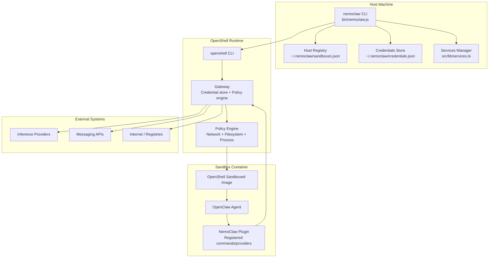
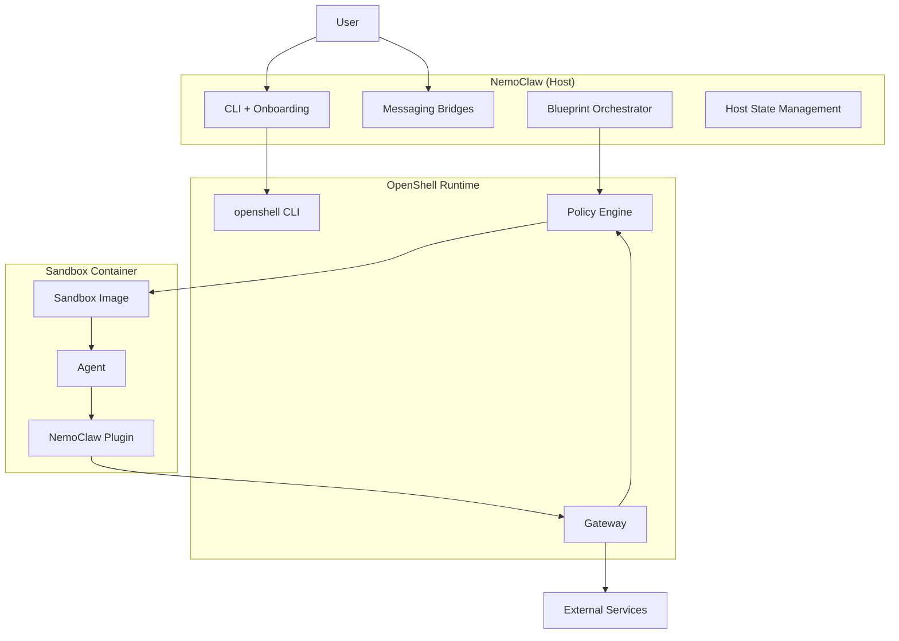
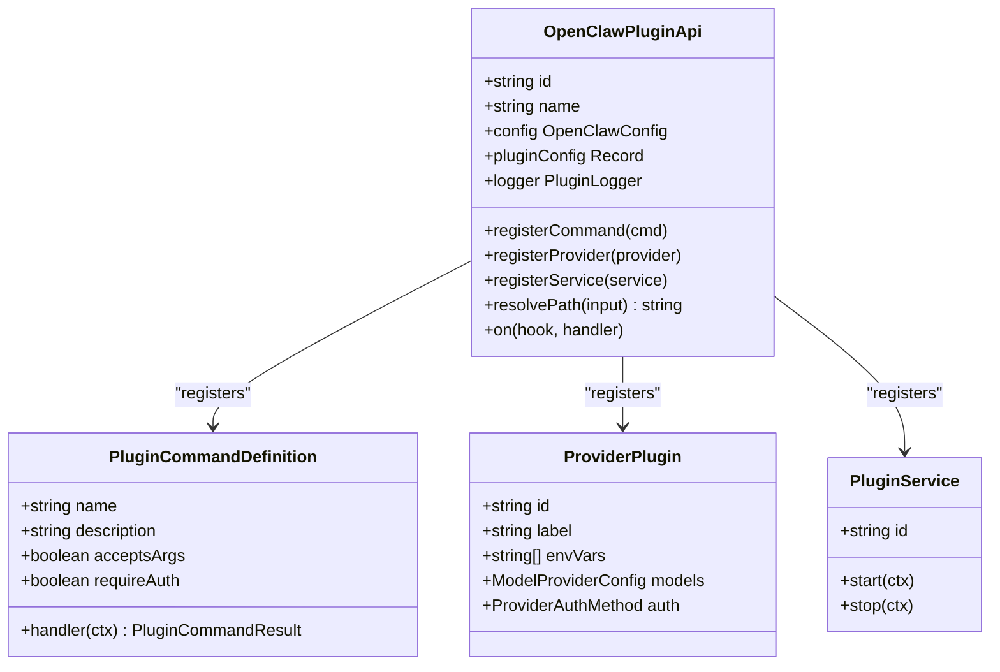
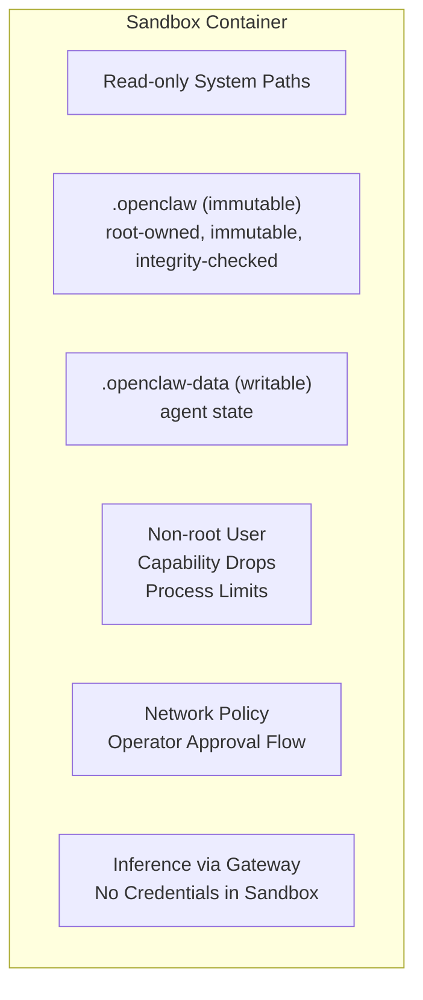
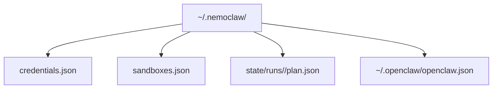
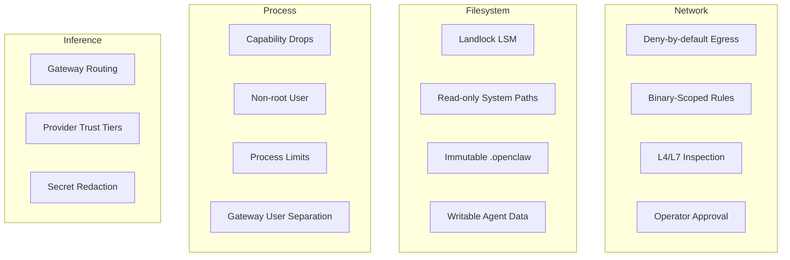
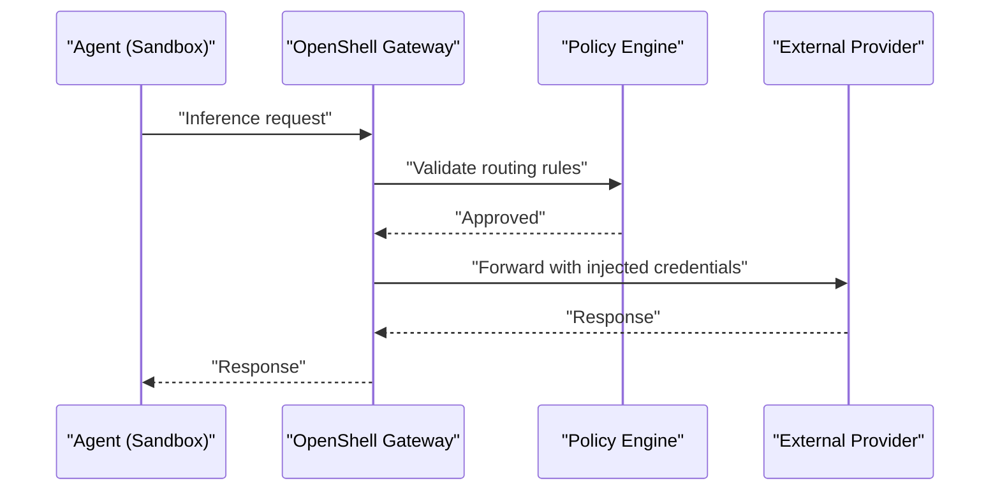
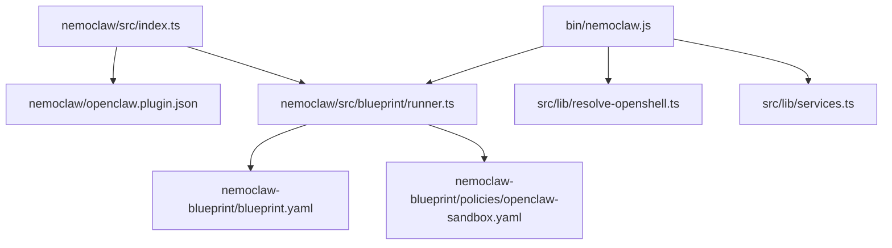
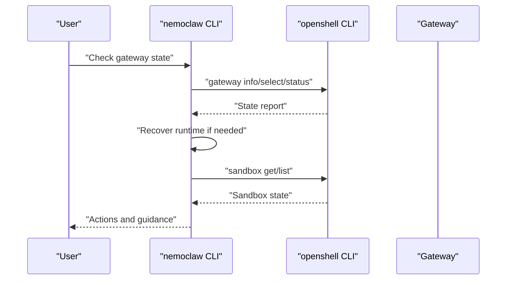

# System Architecture Overview

<cite>
**Referenced Files in This Document**
- [package.json](file://nemoclaw/package.json)
- [openclaw.plugin.json](file://nemoclaw/openclaw.plugin.json)
- [index.ts](file://nemoclaw/src/index.ts)
- [runner.ts](file://nemoclaw/src/blueprint/runner.ts)
- [state.ts](file://nemoclaw/src/blueprint/state.ts)
- [blueprint.yaml](file://nemoclaw-blueprint/blueprint.yaml)
- [openclaw-sandbox.yaml](file://nemoclaw-blueprint/policies/openclaw-sandbox.yaml)
- [nemoclaw.js](file://bin/nemoclaw.js)
- [resolve-openshell.ts](file://src/lib/resolve-openshell.ts)
- [services.ts](file://src/lib/services.ts)
- [inference-config.ts](file://src/lib/inference-config.ts)
- [architecture.md](file://docs/reference/architecture.md)
- [best-practices.md](file://docs/security/best-practices.md)
</cite>

## Table of Contents
1. [Introduction](#introduction)
2. [Project Structure](#project-structure)
3. [Core Components](#core-components)
4. [Architecture Overview](#architecture-overview)
5. [Detailed Component Analysis](#detailed-component-analysis)
6. [Dependency Analysis](#dependency-analysis)
7. [Performance Considerations](#performance-considerations)
8. [Troubleshooting Guide](#troubleshooting-guide)
9. [Conclusion](#conclusion)
10. [Appendices](#appendices)

## Introduction
This document presents the NemoClaw system architecture overview, focusing on the high-level design and component relationships among OpenShell runtime, OpenClaw agent framework, and NemoClaw’s security enhancements. It explains the plugin architecture, blueprint lifecycle, sandbox environment structure, and host-side state management. It also details the layered security approach using Landlock LSM, seccomp, and network namespaces, and provides system context diagrams showing how components interact, data flows between layers, and integration points with external systems. Finally, it addresses the modular design philosophy, extensibility points, and deployment flexibility that enable both security and usability.

## Project Structure
NemoClaw is organized around three primary areas:
- A TypeScript plugin that integrates with OpenClaw and registers commands/providers.
- A blueprint artifact that orchestrates OpenShell resources and enforces security policies.
- A CLI that manages onboarding, sandbox lifecycle, messaging bridges, and host-side state.

**Diagram sources**
- [architecture.md:31-86](file://docs/reference/architecture.md#L31-L86)
- [nemoclaw.js:83-108](file://bin/nemoclaw.js#L83-L108)
- [services.ts:107-145](file://src/lib/services.ts#L107-L145)
- [openclaw-sandbox.yaml:18-44](file://nemoclaw-blueprint/policies/openclaw-sandbox.yaml#L18-L44)

**Section sources**
- [architecture.md:25-86](file://docs/reference/architecture.md#L25-L86)

## Core Components
- NemoClaw Plugin: Registers slash commands and managed inference providers with OpenClaw, and logs operational banners.
- Blueprint Runner: Resolves, verifies, plans, and applies sandbox configurations via OpenShell CLI.
- Blueprint Artifacts: Define sandbox image, inference profiles, and baseline policies.
- Host CLI: Manages onboarding, sandbox lifecycle, gateway recovery, and optional services (Telegram bridge, cloudflared tunnel).
- Policy Engine: Enforces network, filesystem, and process controls at runtime.

**Section sources**
- [index.ts:237-265](file://nemoclaw/src/index.ts#L237-L265)
- [runner.ts:167-210](file://nemoclaw/src/blueprint/runner.ts#L167-L210)
- [blueprint.yaml:19-66](file://nemoclaw-blueprint/blueprint.yaml#L19-L66)
- [nemoclaw.js:780-796](file://bin/nemoclaw.js#L780-L796)
- [openclaw-sandbox.yaml:46-219](file://nemoclaw-blueprint/policies/openclaw-sandbox.yaml#L46-L219)

## Architecture Overview
NemoClaw composes OpenShell and OpenClaw into a hardened sandboxed environment. The plugin runs inside the sandboxed OpenClaw gateway and registers a managed inference provider and a user-facing slash command. Blueprints orchestrate sandbox creation, provider configuration, and policy application. The CLI manages host-side state and optional services, while the policy engine enforces network, filesystem, and process controls.

**Diagram sources**
- [architecture.md:31-86](file://docs/reference/architecture.md#L31-L86)
- [index.ts:237-265](file://nemoclaw/src/index.ts#L237-L265)
- [runner.ts:212-330](file://nemoclaw/src/blueprint/runner.ts#L212-L330)
- [openclaw-sandbox.yaml:18-44](file://nemoclaw-blueprint/policies/openclaw-sandbox.yaml#L18-L44)

## Detailed Component Analysis

### Plugin Architecture
The NemoClaw plugin integrates with OpenClaw via the plugin SDK. It registers:
- A slash command for sandbox management.
- A managed inference provider with model catalogs and authentication metadata.
- Optional background services via the plugin host.

**Diagram sources**
- [index.ts:111-123](file://nemoclaw/src/index.ts#L111-L123)
- [index.ts:58-105](file://nemoclaw/src/index.ts#L58-L105)
- [index.ts:178-202](file://nemoclaw/src/index.ts#L178-L202)

**Section sources**
- [index.ts:237-265](file://nemoclaw/src/index.ts#L237-L265)
- [openclaw.plugin.json:1-33](file://nemoclaw/openclaw.plugin.json#L1-L33)

### Blueprint Lifecycle
The blueprint lifecycle is orchestrated by the blueprint runner, which:
- Resolves and verifies the blueprint artifact.
- Plans sandbox creation, provider configuration, and policy additions.
- Applies the plan via OpenShell CLI commands.
- Persists run state and supports status queries and rollbacks.

**Diagram sources**
- [runner.ts:167-210](file://nemoclaw/src/blueprint/runner.ts#L167-L210)
- [runner.ts:212-330](file://nemoclaw/src/blueprint/runner.ts#L212-L330)
- [runner.ts:332-391](file://nemoclaw/src/blueprint/runner.ts#L332-L391)

**Section sources**
- [runner.ts:167-210](file://nemoclaw/src/blueprint/runner.ts#L167-L210)
- [runner.ts:212-330](file://nemoclaw/src/blueprint/runner.ts#L212-L330)
- [runner.ts:332-391](file://nemoclaw/src/blueprint/runner.ts#L332-L391)
- [blueprint.yaml:1-66](file://nemoclaw-blueprint/blueprint.yaml#L1-L66)

### Sandbox Environment Structure
The sandbox enforces strict isolation:
- Filesystem: Read-only system paths, read-only gateway config, writable agent state area.
- Network: Baseline deny-by-default with operator approval flow and endpoint scoping.
- Process: Non-root user, capability drops, process limits, and gateway user separation.
- Inference: All requests routed through the gateway to isolate provider credentials.

**Diagram sources**
- [openclaw-sandbox.yaml:18-44](file://nemoclaw-blueprint/policies/openclaw-sandbox.yaml#L18-L44)
- [openclaw-sandbox.yaml:218-246](file://nemoclaw-blueprint/policies/openclaw-sandbox.yaml#L218-L246)
- [best-practices.md:258-320](file://docs/security/best-practices.md#L258-L320)

**Section sources**
- [openclaw-sandbox.yaml:18-44](file://nemoclaw-blueprint/policies/openclaw-sandbox.yaml#L18-L44)
- [best-practices.md:258-320](file://docs/security/best-practices.md#L258-L320)

### Host-Side State Management
Host-side state is maintained outside the sandbox to preserve operator control and auditability:
- Credentials store for provider tokens.
- Registry of sandbox metadata and default selection.
- Per-run state persisted under the user’s home directory.

**Diagram sources**
- [architecture.md:175-194](file://docs/reference/architecture.md#L175-L194)
- [state.ts:7-18](file://nemoclaw/src/blueprint/state.ts#L7-L18)
- [nemoclaw.js:109-117](file://bin/nemoclaw.js#L109-L117)

**Section sources**
- [architecture.md:175-194](file://docs/reference/architecture.md#L175-L194)
- [state.ts:47-70](file://nemoclaw/src/blueprint/state.ts#L47-L70)

### Layered Security Approach
NemoClaw enforces a multi-layered security posture:
- Network: Baseline deny-by-default, binary-scoped endpoint rules, L4/L7 inspection, operator approval.
- Filesystem: Landlock LSM enforcement, read-only system paths, immutable gateway config, writable agent state area.
- Process: Capability drops, non-root user, process limits, gateway user separation, PATH hardening, build tool removal.
- Inference: Gateway routing, provider trust tiers, secret redaction.

**Diagram sources**
- [best-practices.md:38-125](file://docs/security/best-practices.md#L38-L125)
- [best-practices.md:258-453](file://docs/security/best-practices.md#L258-L453)

**Section sources**
- [best-practices.md:38-125](file://docs/security/best-practices.md#L38-L125)
- [best-practices.md:258-453](file://docs/security/best-practices.md#L258-L453)

### Integration Points with External Systems
- Inference Providers: Managed via OpenShell gateway to isolate credentials.
- Messaging APIs: Bridged via optional services (Telegram bridge).
- Internet Access: Controlled via policy engine with operator approval flow.
- Package Registries: Allowed only via explicit policy or presets.

**Diagram sources**
- [architecture.md:164-174](file://docs/reference/architecture.md#L164-L174)
- [inference-config.ts:12-24](file://src/lib/inference-config.ts#L12-L24)

**Section sources**
- [architecture.md:164-174](file://docs/reference/architecture.md#L164-L174)
- [inference-config.ts:12-24](file://src/lib/inference-config.ts#L12-L24)

## Dependency Analysis
NemoClaw’s dependencies span plugin registration, blueprint orchestration, CLI orchestration, and policy enforcement.

**Diagram sources**
- [index.ts:14-19](file://nemoclaw/src/index.ts#L14-L19)
- [openclaw.plugin.json:1-33](file://nemoclaw/openclaw.plugin.json#L1-L33)
- [runner.ts:79-89](file://nemoclaw/src/blueprint/runner.ts#L79-L89)
- [blueprint.yaml:1-66](file://nemoclaw-blueprint/blueprint.yaml#L1-L66)
- [openclaw-sandbox.yaml:1-219](file://nemoclaw-blueprint/policies/openclaw-sandbox.yaml#L1-L219)
- [nemoclaw.js:32-43](file://bin/nemoclaw.js#L32-L43)
- [resolve-openshell.ts:22-59](file://src/lib/resolve-openshell.ts#L22-L59)
- [services.ts:107-145](file://src/lib/services.ts#L107-L145)

**Section sources**
- [index.ts:14-19](file://nemoclaw/src/index.ts#L14-L19)
- [runner.ts:79-89](file://nemoclaw/src/blueprint/runner.ts#L79-L89)
- [nemoclaw.js:32-43](file://bin/nemoclaw.js#L32-L43)

## Performance Considerations
- Policy evaluation overhead is minimized by enforcing deny-by-default and scoping endpoints to specific binaries and HTTP methods.
- Gateway routing centralizes inference requests, reducing repeated credential handling and enabling caching at the gateway.
- Optional services (cloudflared tunnel, Telegram bridge) are started conditionally and can be disabled to reduce overhead.
- Blueprint runner persists run state to avoid redundant planning and to accelerate recovery.

[No sources needed since this section provides general guidance]

## Troubleshooting Guide
Common operational issues and recovery flows:
- Gateway lifecycle recovery: Select or start the named gateway, probe its state, and recover runtime if needed.
- Sandbox gateway health: Check presence, connectivity, and handshake status; recover or rebuild as required.
- Live sandbox verification: Ensure the sandbox is present and reachable; remove stale registry entries if missing.
- Service status: Manage Telegram bridge and cloudflared tunnel lifecycle with status reporting.

**Diagram sources**
- [nemoclaw.js:509-542](file://bin/nemoclaw.js#L509-L542)
- [nemoclaw.js:616-672](file://bin/nemoclaw.js#L616-L672)
- [nemoclaw.js:674-740](file://bin/nemoclaw.js#L674-L740)

**Section sources**
- [nemoclaw.js:509-542](file://bin/nemoclaw.js#L509-L542)
- [nemoclaw.js:616-672](file://bin/nemoclaw.js#L616-L672)
- [nemoclaw.js:674-740](file://bin/nemoclaw.js#L674-L740)

## Conclusion
NemoClaw delivers a secure, modular, and extensible architecture by combining OpenClaw’s agent capabilities with OpenShell’s hardened runtime. The plugin architecture extends the agent with managed configuration, the blueprint lifecycle automates sandbox provisioning and policy application, and host-side state management preserves operator control. The layered security approach—network, filesystem, process, and inference—provides strong isolation while maintaining usability through operator approval and flexible provider routing.

[No sources needed since this section summarizes without analyzing specific files]

## Appendices

### Technology Stack Choices
- Plugin and CLI: TypeScript/Node.js for cross-platform CLI and plugin integration.
- Orchestration: OpenShell CLI for sandbox, provider, and policy management.
- Policy Enforcement: OpenShell’s policy engine with network namespace isolation and seccomp filters.
- Security Modules: Landlock LSM for filesystem enforcement, capability drops, and process limits.

[No sources needed since this section provides general guidance]

### Architectural Patterns
- Plugin Pattern: Extensible command and provider registration via OpenClaw plugin SDK.
- Blueprint Pattern: Declarative configuration and lifecycle management via versioned blueprints.
- Policy-as-Code: Baseline and dynamic policy updates through YAML manifests.
- Separation of Concerns: Host-side state and services decoupled from sandbox runtime.

[No sources needed since this section provides general guidance]