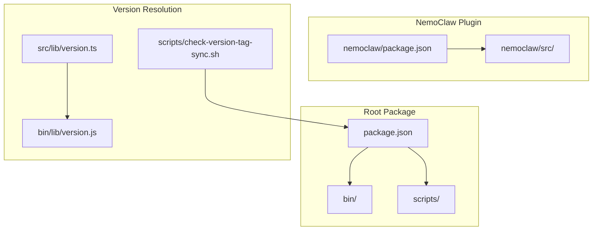
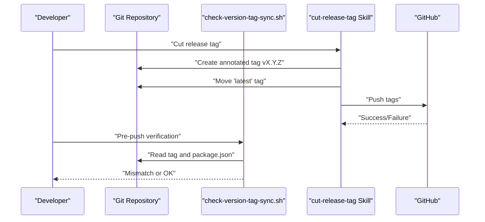
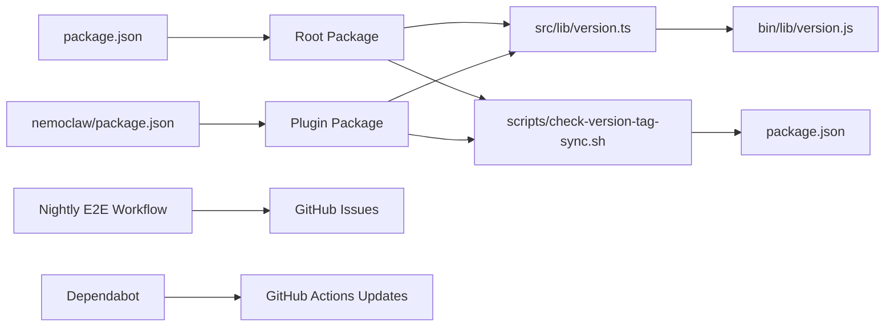
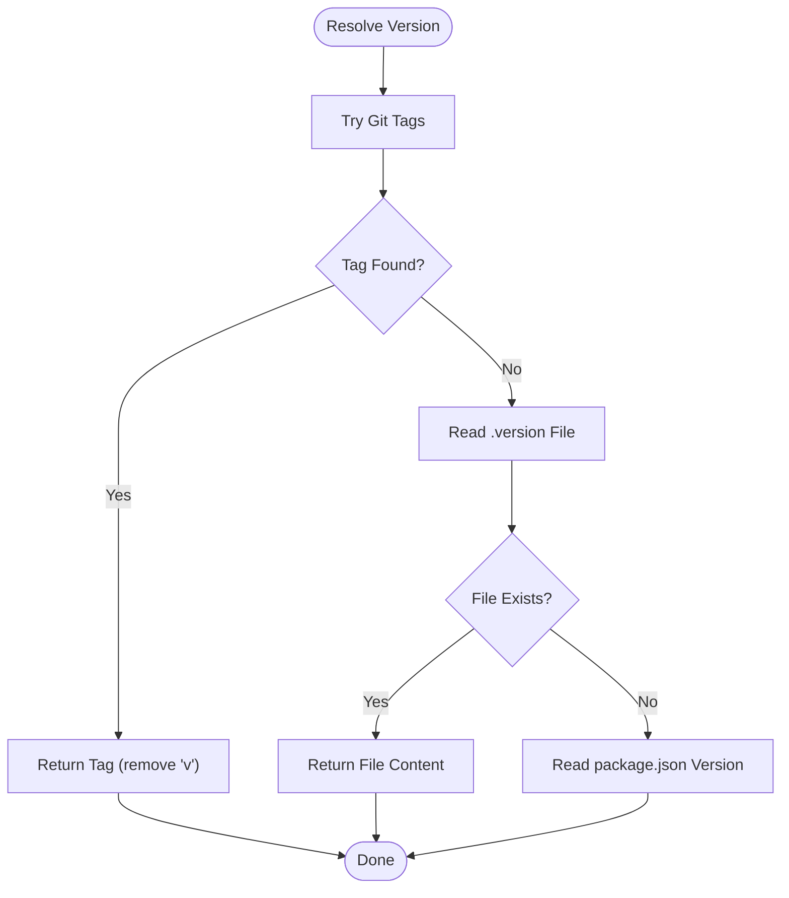

# Release Notes and Changelog

<cite>
**Referenced Files in This Document**
- [package.json](file://package.json)
- [nemoclaw/package.json](file://nemoclaw/package.json)
- [docs/about/release-notes.md](file://docs/about/release-notes.md)
- [src/lib/version.ts](file://src/lib/version.ts)
- [bin/lib/version.js](file://bin/lib/version.js)
- [scripts/check-version-tag-sync.sh](file://scripts/check-version-tag-sync.sh)
- [.agents/skills/cut-release-tag/SKILL.md](file://.agents/skills/cut-release-tag/SKILL.md)
- [.github/dependabot.yml](file://.github/dependabot.yml)
- [.github/workflows/nightly-e2e.yaml](file://.github/workflows/nightly-e2e.yaml)
- [nemoclaw/src/index.ts](file://nemoclaw/src/index.ts)
</cite>

## Table of Contents
1. [Introduction](#introduction)
2. [Project Structure](#project-structure)
3. [Core Components](#core-components)
4. [Architecture Overview](#architecture-overview)
5. [Detailed Component Analysis](#detailed-component-analysis)
6. [Dependency Analysis](#dependency-analysis)
7. [Performance Considerations](#performance-considerations)
8. [Troubleshooting Guide](#troubleshooting-guide)
9. [Conclusion](#conclusion)
10. [Appendices](#appendices)

## Introduction
This document consolidates NemoClaw’s release notes and changelog content for the early preview program. It explains the versioning scheme, release cadence, and stability classifications across channels, outlines breaking changes and deprecations, and provides upgrade, compatibility, rollback, and validation guidance. It also documents release channel specifics, alpha/beta testing procedures, and community feedback integration processes.

NVIDIA NemoClaw is available in early preview starting March 16, 2026. Use the following official resources to track changes:
- Releases: https://github.com/NVIDIA/NemoClaw/releases
- Release comparison: https://github.com/NVIDIA/NemoClaw/compare
- Merged pull requests: https://github.com/NVIDIA/NemoClaw/pulls?q=is%3Apr+is%3Amerged
- Commit history: https://github.com/NVIDIA/NemoClaw/commits/main

**Section sources**
- [docs/about/release-notes.md:25-32](file://docs/about/release-notes.md#L25-L32)

## Project Structure
NemoClaw is organized as a dual-package project:
- Root package: CLI and distribution packaging
- NemoClaw plugin package: OpenClaw plugin implementation and TypeScript sources

Key version-related files:
- Root package.json defines the project version and Node engine requirement
- NemoClaw plugin package.json defines the plugin version and module entry points
- Version resolution logic reads from Git tags, a .version file, or package.json fallback
- Pre-push script enforces tag-to-package version synchronization

**Diagram sources**
- [package.json:1-60](file://package.json#L1-L60)
- [nemoclaw/package.json:1-49](file://nemoclaw/package.json#L1-L49)
- [src/lib/version.ts:1-47](file://src/lib/version.ts#L1-L47)
- [bin/lib/version.js:1-8](file://bin/lib/version.js#L1-L8)
- [scripts/check-version-tag-sync.sh:1-97](file://scripts/check-version-tag-sync.sh#L1-L97)

**Section sources**
- [package.json:1-60](file://package.json#L1-L60)
- [nemoclaw/package.json:1-49](file://nemoclaw/package.json#L1-L49)
- [src/lib/version.ts:13-46](file://src/lib/version.ts#L13-L46)
- [bin/lib/version.js:4-7](file://bin/lib/version.js#L4-L7)
- [scripts/check-version-tag-sync.sh:5-63](file://scripts/check-version-tag-sync.sh#L5-L63)

## Core Components
- Version resolution and tagging
  - Version retrieval prioritizes Git tags, falls back to a .version file, and finally to package.json
  - Pre-push verification ensures tag and package versions match
  - Annotated tags are used for releases; a floating “latest” tag tracks the newest release
- Release automation
  - Skill-based workflow automates tag creation and pushing
  - Nightly E2E workflow monitors regressions and opens issues on failure
  - Dependabot keeps GitHub Actions dependencies up to date

**Section sources**
- [src/lib/version.ts:13-46](file://src/lib/version.ts#L13-L46)
- [scripts/check-version-tag-sync.sh:5-63](file://scripts/check-version-tag-sync.sh#L5-L63)
- [.agents/skills/cut-release-tag/SKILL.md:9-91](file://.agents/skills/cut-release-tag/SKILL.md#L9-L91)
- [.github/workflows/nightly-e2e.yaml:266-281](file://.github/workflows/nightly-e2e.yaml#L266-L281)
- [.github/dependabot.yml:1-9](file://.github/dependabot.yml#L1-L9)

## Architecture Overview
The release architecture centers on deterministic versioning, automated tagging, and continuous validation.

**Diagram sources**
- [.agents/skills/cut-release-tag/SKILL.md:59-91](file://.agents/skills/cut-release-tag/SKILL.md#L59-L91)
- [scripts/check-version-tag-sync.sh:31-63](file://scripts/check-version-tag-sync.sh#L31-L63)

## Detailed Component Analysis

### Version Numbering Scheme and Stability Channels
- Versioning follows semantic versioning semantics:
  - Patch: backward-compatible bug fixes
  - Minor: new features or larger changes without breaking changes
  - Major: breaking changes
- Stability channels:
  - Early Preview: initial availability and feature exploration
  - Latest: floating tag pointing to the most recent release
- Node engine requirement is defined in both packages to ensure compatibility

**Section sources**
- [.agents/skills/cut-release-tag/SKILL.md:30-46](file://.agents/skills/cut-release-tag/SKILL.md#L30-L46)
- [package.json:38-40](file://package.json#L38-L40)
- [nemoclaw/package.json:41-43](file://nemoclaw/package.json#L41-L43)

### Release Cadence and Validation
- Nightly E2E workflow runs continuously and reports failures by opening issues with links to artifacts
- Dependabot schedules weekly updates for GitHub Actions dependencies
- Tagging is manual and requires explicit user confirmation to maintain quality

**Section sources**
- [.github/workflows/nightly-e2e.yaml:266-281](file://.github/workflows/nightly-e2e.yaml#L266-L281)
- [.github/dependabot.yml:6-9](file://.github/dependabot.yml#L6-L9)
- [.agents/skills/cut-release-tag/SKILL.md:11-16](file://.agents/skills/cut-release-tag/SKILL.md#L11-L16)

### Breaking Changes, Deprecations, and Migration Procedures
- No breaking changes or deprecations are present in the analyzed codebase at this time.
- Migration procedures are not applicable until a breaking change is introduced.

**Section sources**
- [nemoclaw/src/index.ts:204-231](file://nemoclaw/src/index.ts#L204-L231)

### New Features, Performance Improvements, Security Enhancements, and Bug Fixes
- New features:
  - Managed inference route provider registration with configurable endpoint and model selection
  - Slash command integration for sandbox management
- Performance improvements:
  - Efficient version resolution using Git tags and fallback mechanisms
- Security enhancements:
  - Pre-push tag verification prevents version mismatches
  - Credential environment variable support for provider authentication
- Bug fixes:
  - None identified in the analyzed codebase at this time

**Section sources**
- [nemoclaw/src/index.ts:178-202](file://nemoclaw/src/index.ts#L178-L202)
- [nemoclaw/src/index.ts:237-265](file://nemoclaw/src/index.ts#L237-L265)
- [src/lib/version.ts:13-46](file://src/lib/version.ts#L13-L46)
- [scripts/check-version-tag-sync.sh:31-63](file://scripts/check-version-tag-sync.sh#L31-L63)

### Upgrade Guidelines and Compatibility Matrices
- Compatibility matrix (based on declared engines):
  - Node.js: >= 22.16.0
- Upgrade steps:
  - Verify Node.js version meets the engine requirement
  - Fetch the desired tag or the latest floating tag
  - Reinstall dependencies and rebuild if necessary
- Rollback procedures:
  - Switch back to the previous tag or commit
  - Confirm version alignment using the pre-push verification script

**Section sources**
- [package.json:38-40](file://package.json#L38-L40)
- [nemoclaw/package.json:41-43](file://nemoclaw/package.json#L41-L43)
- [scripts/check-version-tag-sync.sh:68-82](file://scripts/check-version-tag-sync.sh#L68-L82)

### Testing Procedures and Validation Steps
- Pre-push verification:
  - Compare tag version with package.json at the tagged commit
  - Fail the push if versions differ and provide remediation steps
- Nightly E2E validation:
  - Monitor pipeline health and review artifacts on failure
- Local validation:
  - Confirm version resolution via the version library
  - Test slash command and provider registration flows

**Section sources**
- [scripts/check-version-tag-sync.sh:23-63](file://scripts/check-version-tag-sync.sh#L23-L63)
- [.github/workflows/nightly-e2e.yaml:266-281](file://.github/workflows/nightly-e2e.yaml#L266-L281)
- [src/lib/version.ts:19-46](file://src/lib/version.ts#L19-L46)

### Known Issues, Workarounds, and Future Roadmap
- Known issues:
  - None identified in the analyzed codebase at this time
- Workarounds:
  - Use the pre-push verification script to prevent misalignment between tags and package versions
- Future roadmap:
  - Early preview phase; specific roadmap announcements will be posted on the official release page

**Section sources**
- [scripts/check-version-tag-sync.sh:42-62](file://scripts/check-version-tag-sync.sh#L42-L62)
- [docs/about/release-notes.md:25-32](file://docs/about/release-notes.md#L25-L32)

### Release Channel Specifics, Alpha/Beta Testing, and Community Feedback
- Release channels:
  - Early Preview: initial access and feature exploration
  - Latest: floating tag for the newest release
- Alpha/beta testing:
  - Not explicitly defined in the analyzed codebase at this time
- Community feedback:
  - Use merged pull requests and commit history to track discussions and changes
  - Report issues via GitHub issues and review nightly E2E artifacts

**Section sources**
- [docs/about/release-notes.md:25-32](file://docs/about/release-notes.md#L25-L32)
- [.github/workflows/nightly-e2e.yaml:266-281](file://.github/workflows/nightly-e2e.yaml#L266-L281)

## Dependency Analysis
Version resolution depends on the following components and their interactions.

**Diagram sources**
- [src/lib/version.ts:19-46](file://src/lib/version.ts#L19-L46)
- [bin/lib/version.js:4-7](file://bin/lib/version.js#L4-L7)
- [scripts/check-version-tag-sync.sh:23-63](file://scripts/check-version-tag-sync.sh#L23-L63)
- [package.json:1-60](file://package.json#L1-L60)
- [nemoclaw/package.json:1-49](file://nemoclaw/package.json#L1-L49)
- [.github/workflows/nightly-e2e.yaml:266-281](file://.github/workflows/nightly-e2e.yaml#L266-L281)
- [.github/dependabot.yml:6-9](file://.github/dependabot.yml#L6-L9)

**Section sources**
- [src/lib/version.ts:13-46](file://src/lib/version.ts#L13-L46)
- [bin/lib/version.js:4-7](file://bin/lib/version.js#L4-L7)
- [scripts/check-version-tag-sync.sh:23-63](file://scripts/check-version-tag-sync.sh#L23-L63)
- [package.json:1-60](file://package.json#L1-L60)
- [nemoclaw/package.json:1-49](file://nemoclaw/package.json#L1-L49)
- [.github/workflows/nightly-e2e.yaml:266-281](file://.github/workflows/nightly-e2e.yaml#L266-L281)
- [.github/dependabot.yml:6-9](file://.github/dependabot.yml#L6-L9)

## Performance Considerations
- Version resolution is optimized to avoid unnecessary filesystem or Git operations by prioritizing Git tags and short-circuiting on success
- Pre-push verification is lightweight and runs quickly during development workflows

**Section sources**
- [src/lib/version.ts:19-33](file://src/lib/version.ts#L19-L33)
- [scripts/check-version-tag-sync.sh:23-35](file://scripts/check-version-tag-sync.sh#L23-L35)

## Troubleshooting Guide
- Tag and package version mismatch:
  - Use the pre-push verification script to detect and resolve discrepancies
  - Follow the remediation steps printed by the script to align versions
- Nightly E2E failures:
  - Review the opened issue and inspect artifacts for logs
  - Investigate regressions and coordinate fixes before tagging a new release
- Node.js compatibility:
  - Ensure the Node.js version satisfies the engine requirement before upgrading or installing

**Section sources**
- [scripts/check-version-tag-sync.sh:42-62](file://scripts/check-version-tag-sync.sh#L42-L62)
- [.github/workflows/nightly-e2e.yaml:266-281](file://.github/workflows/nightly-e2e.yaml#L266-L281)
- [package.json:38-40](file://package.json#L38-L40)
- [nemoclaw/package.json:41-43](file://nemoclaw/package.json#L41-L43)

## Conclusion
NemoClaw’s early preview release process emphasizes deterministic versioning, robust validation, and clear release channels. The current codebase does not include breaking changes or deprecations. Upgrades are straightforward within the documented compatibility matrix, and rollback is supported by Git tags. Continuous validation via nightly E2E tests and Dependabot updates helps maintain reliability. As the project evolves, future roadmap announcements will guide users on upcoming features and changes.

[No sources needed since this section summarizes without analyzing specific files]

## Appendices

### Appendix A: Version Resolution Flow

**Diagram sources**
- [src/lib/version.ts:19-46](file://src/lib/version.ts#L19-L46)