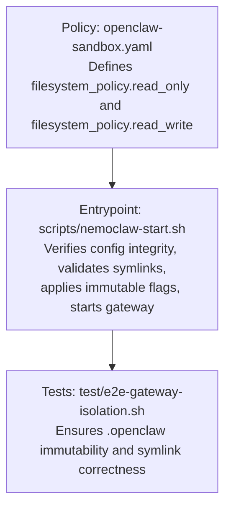
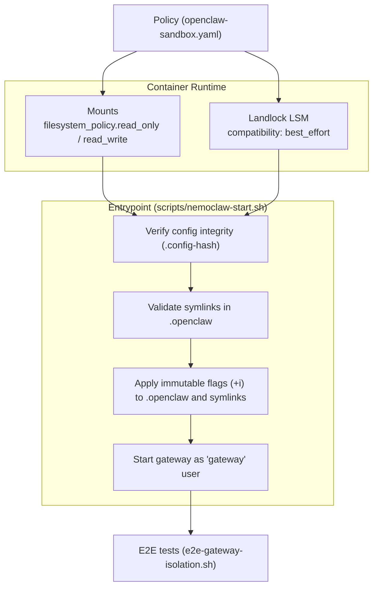
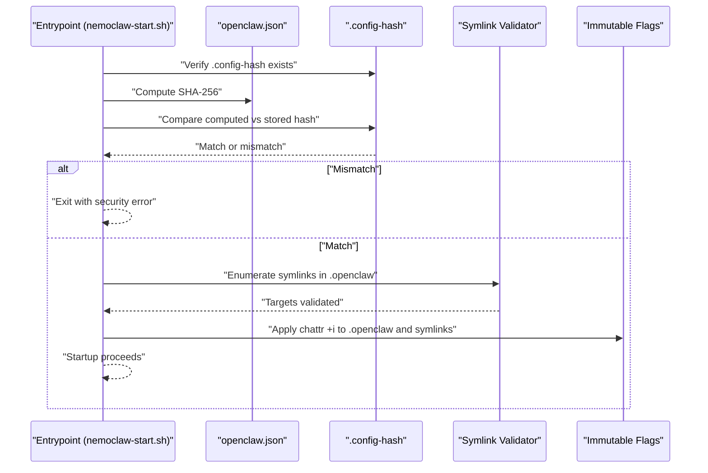
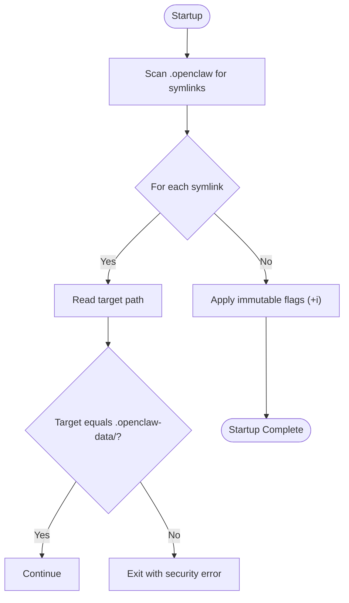
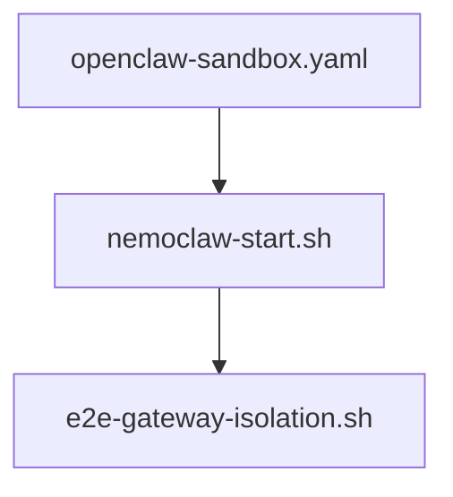

# Filesystem Controls

<cite>
**Referenced Files in This Document**
- [openclaw-sandbox.yaml](file://nemoclaw-blueprint/policies/openclaw-sandbox.yaml)
- [best-practices.md](file://docs/security/best-practices.md)
- [nemoclaw-start.sh](file://scripts/nemoclaw-start.sh)
- [e2e-gateway-isolation.sh](file://test/e2e-gateway-isolation.sh)
- [migration-state.ts](file://nemoclaw/src/commands/migration-state.ts)
</cite>

## Table of Contents
1. [Introduction](#introduction)
2. [Project Structure](#project-structure)
3. [Core Components](#core-components)
4. [Architecture Overview](#architecture-overview)
5. [Detailed Component Analysis](#detailed-component-analysis)
6. [Dependency Analysis](#dependency-analysis)
7. [Performance Considerations](#performance-considerations)
8. [Troubleshooting Guide](#troubleshooting-guide)
9. [Conclusion](#conclusion)

## Introduction
This document details NemoClaw’s filesystem controls that collectively protect the system and gateway configuration from tampering. It explains read-only system paths, immutable directory protection, symlink validation and integrity verification, writable path management, and Landlock LSM enforcement. It also documents the multi-layered protection of the .openclaw configuration directory, including DAC permissions, immutable flags, and config integrity hashes. Practical examples demonstrate how to configure filesystem policies, implement read-only restrictions, set up writable directories, and validate symlink integrity. Finally, it addresses security implications, risk assessments for different path configurations, and best practices for maintaining filesystem security while enabling necessary agent functionality.

## Project Structure
NemoClaw’s filesystem protections are defined in the blueprint policy and enforced at container startup by the entrypoint script. The policy file enumerates read-only and writable paths, while the entrypoint validates integrity, applies immutability, and enforces process and filesystem boundaries.

**Diagram sources**
- [openclaw-sandbox.yaml:18-40](file://nemoclaw-blueprint/policies/openclaw-sandbox.yaml#L18-L40)
- [nemoclaw-start.sh:104-116](file://scripts/nemoclaw-start.sh#L104-L116)
- [nemoclaw-start.sh:396-420](file://scripts/nemoclaw-start.sh#L396-L420)
- [e2e-gateway-isolation.sh:82-113](file://test/e2e-gateway-isolation.sh#L82-L113)

**Section sources**
- [openclaw-sandbox.yaml:18-40](file://nemoclaw-blueprint/policies/openclaw-sandbox.yaml#L18-L40)
- [best-practices.md:210-268](file://docs/security/best-practices.md#L210-L268)

## Core Components
- Filesystem policy definition: The blueprint policy defines read-only and writable paths, including the .openclaw directory and its data counterpart.
- Integrity verification: The entrypoint computes and validates the SHA-256 hash of the gateway configuration at startup.
- Immutable protection: The entrypoint applies immutable flags to the .openclaw directory and its symlinks to prevent runtime modification.
- Symlink validation: The entrypoint scans .openclaw for symlinks and ensures they point to the expected data directory targets.
- Writable path management: The policy grants controlled write access to sandbox workspace, temporary storage, and device nodes.
- Landlock LSM enforcement: The policy enables Landlock with best-effort compatibility to enforce kernel-level filesystem access rules.

**Section sources**
- [openclaw-sandbox.yaml:18-40](file://nemoclaw-blueprint/policies/openclaw-sandbox.yaml#L18-L40)
- [best-practices.md:210-268](file://docs/security/best-practices.md#L210-L268)
- [nemoclaw-start.sh:104-116](file://scripts/nemoclaw-start.sh#L104-L116)
- [nemoclaw-start.sh:396-420](file://scripts/nemoclaw-start.sh#L396-L420)

## Architecture Overview
The filesystem protection stack combines policy-driven container mounts, kernel-level Landlock enforcement, and entrypoint-driven runtime checks.

**Diagram sources**
- [openclaw-sandbox.yaml:18-40](file://nemoclaw-blueprint/policies/openclaw-sandbox.yaml#L18-L40)
- [nemoclaw-start.sh:104-116](file://scripts/nemoclaw-start.sh#L104-L116)
- [nemoclaw-start.sh:396-420](file://scripts/nemoclaw-start.sh#L396-L420)
- [e2e-gateway-isolation.sh:82-113](file://test/e2e-gateway-isolation.sh#L82-L113)

## Detailed Component Analysis

### Read-Only System Paths Configuration
- Purpose: Prevent modification of system binaries, libraries, and configuration files.
- Defaults: The policy includes commonly protected paths such as /usr, /lib, /proc, /dev/urandom, /app, /etc, and /var/log.
- Risk if relaxed: Allowing writes to /usr or /lib can let the agent replace critical binaries. Writable /etc can alter DNS, trust stores, and accounts.
- Recommendation: Keep system paths read-only; use sandbox workspace for generated files.

Practical example (policy editing):
- Add or remove entries in filesystem_policy.read_only to tighten or broaden restrictions.

Security implications:
- Container mount read-only ensures filesystem-level immutability even if other controls fail.
- Combined with Landlock, it reduces the attack surface for path traversal and binary substitution.

Risk assessment:
- High-risk changes include relaxing /usr, /lib, or /etc.
- Lower risk changes include adding non-system directories to read_write.

Best practices:
- Prefer sandbox-relative writable paths for agent-generated content.
- Avoid broad writable scopes like /var or /home unless absolutely necessary.

**Section sources**
- [openclaw-sandbox.yaml:20-27](file://nemoclaw-blueprint/policies/openclaw-sandbox.yaml#L20-L27)
- [best-practices.md:217-226](file://docs/security/best-practices.md#L217-L226)

### Immutable Directory Protection Using chattr +i
- Purpose: Enforce immutability at the filesystem level to prevent symlink swaps and directory modifications even if DAC or Landlock are bypassed.
- Enforcement: The entrypoint applies immutable flags to /sandbox/.openclaw and all symlinks under it.
- Validation: The entrypoint verifies the presence and applicability of chattr before applying flags.

Practical example (runtime behavior):
- Attempting to modify .openclaw or swap symlinks after startup fails due to immutable flags.

Security implications:
- chattr +i is a last line of defense; it complements DAC and Landlock.
- Requires root privileges to set; sandbox user cannot remove flags.

Risk assessment:
- Without immutable flags, symlink hijacking or directory tampering could occur.
- Kernel support for chattr is required; the entrypoint gracefully handles absence.

Best practices:
- Keep .openclaw immutable; store mutable state under .openclaw-data.
- Ensure chattr availability in the container environment.

**Section sources**
- [nemoclaw-start.sh:409-420](file://scripts/nemoclaw-start.sh#L409-L420)

### Symlink Validation and Integrity Verification
- Symlink validation: The entrypoint enumerates symlinks in .openclaw and verifies each points to the expected .openclaw-data target.
- Integrity verification: The entrypoint validates the pinned SHA-256 hash of openclaw.json against the .config-hash file.
- E2E validation: Tests confirm that symlink targets remain unchanged and that the hash is valid and unwritable.

Practical example (validation flow):
- Startup: Symlink scan and target checks.
- Startup: Hash computation and comparison against .config-hash.
- Runtime: Tests assert that attempts to replace symlinks or write to .config-hash are blocked.

Security implications:
- Symlink integrity prevents tampering with agent/plugin state linkage.
- Config hash prevents tampering with gateway configuration.

Risk assessment:
- Missing or invalid hash blocks startup.
- Incorrect symlink targets block startup.

Best practices:
- Maintain symlinks under .openclaw that point to .openclaw-data.
- Preserve .config-hash and ensure it is not writable by sandbox user.

**Section sources**
- [nemoclaw-start.sh:396-407](file://scripts/nemoclaw-start.sh#L396-L407)
- [nemoclaw-start.sh:104-116](file://scripts/nemoclaw-start.sh#L104-L116)
- [e2e-gateway-isolation.sh:82-113](file://test/e2e-gateway-isolation.sh#L82-L113)

### Writable Path Management
- Purpose: Provide controlled write access for agent operations while minimizing risk.
- Defaults: The policy grants read-write access to /sandbox, /tmp, and /dev/null. Additional writable paths can be added via filesystem_policy.read_write.
- Risk if relaxed: Each additional writable path expands persistence and potential modification of system behavior. Broad paths like /var or /home increase risk.

Practical example (policy editing):
- Add a subdirectory under /sandbox for persistent agent state.
- Avoid adding /var or /home unless strictly necessary.

Security implications:
- Controlled writability reduces persistence footprint.
- Limit writable scope to sandbox workspace and temporary locations.

Risk assessment:
- Low-risk: /sandbox and /tmp.
- Medium-high risk: /var or /home.

Best practices:
- Prefer ephemeral writes to /tmp; persist under /sandbox only when necessary.
- Use subdirectories to segment agent data.

**Section sources**
- [openclaw-sandbox.yaml:33-37](file://nemoclaw-blueprint/policies/openclaw-sandbox.yaml#L33-L37)
- [best-practices.md:247-256](file://docs/security/best-practices.md#L247-L256)

### Landlock LSM Enforcement
- Purpose: Enforce filesystem access rules at the kernel level for granular control.
- Defaults: The policy enables Landlock with best-effort compatibility. The entrypoint applies Landlock rules when supported and falls back gracefully on older kernels.
- Risk if relaxed: On kernels without Landlock support, filesystem restrictions rely solely on container mounts, which are less granular.

Practical example (policy editing):
- The policy sets landlock.compatibility: best_effort; adjust only if you understand the implications.

Security implications:
- Kernel-level enforcement reduces bypass risks compared to userspace-only controls.
- Best-effort mode ensures continued operation on unsupported kernels.

Risk assessment:
- High: Running on kernels without Landlock support.
- Low: Running on kernels with Landlock support.

Best practices:
- Use kernels that support Landlock (5.13+).
- Keep policy defaults unless you have a strong justification.

**Section sources**
- [openclaw-sandbox.yaml:39-40](file://nemoclaw-blueprint/policies/openclaw-sandbox.yaml#L39-L40)
- [best-practices.md:258-267](file://docs/security/best-practices.md#L258-L267)

### Multi-Layered Protection of .openclaw Configuration Directory
- DAC permissions: The directory and openclaw.json are owned by root and read-only to sandbox user.
- Immutable flags: chattr +i is applied to .openclaw and symlinks to prevent runtime modification.
- Symlink validation: Startup checks ensure symlinks point to .openclaw-data targets.
- Config integrity hash: A pinned SHA-256 hash is verified at startup; the hash file is unwritable by sandbox user.

Practical example (startup validation):
- Integrity check compares computed hash with .config-hash.
- Symlink scan ensures all links target .openclaw-data.
- Immutable flags are applied to .openclaw and symlinks.

Security implications:
- Multiple layers ensure .openclaw remains tamper-evident and tamper-resistant.
- Failure at any layer blocks startup, preventing unsafe configurations.

Risk assessment:
- Highest risk: Making .openclaw writable.
- Lower risk: Allowing writes to .openclaw-data (intended mutable state).

Best practices:
- Never move .openclaw from read-only to read-write.
- Store agent state under .openclaw-data via symlinks.
- Maintain .config-hash and ensure it is not writable.

**Section sources**
- [best-practices.md:228-245](file://docs/security/best-practices.md#L228-L245)
- [nemoclaw-start.sh:104-116](file://scripts/nemoclaw-start.sh#L104-L116)
- [nemoclaw-start.sh:396-420](file://scripts/nemoclaw-start.sh#L396-L420)
- [e2e-gateway-isolation.sh:82-113](file://test/e2e-gateway-isolation.sh#L82-L113)

### Practical Examples

#### Configure Filesystem Policies
- Edit nemoclaw-blueprint/policies/openclaw-sandbox.yaml to adjust:
  - filesystem_policy.read_only: Add or remove system paths.
  - filesystem_policy.read_write: Add controlled writable paths (prefer sandbox subdirectories).
  - landlock.compatibility: Keep best_effort for broad compatibility.

#### Implement Read-Only Restrictions
- Ensure /usr, /lib, /etc, and /var/log remain in read_only.
- Confirm container mounts enforce read-only at runtime.

#### Set Up Writable Directories
- Use /sandbox for persistent agent state and /tmp for ephemeral files.
- Add subdirectories under /sandbox for specific agents or plugins.

#### Validate Symlink Integrity
- Confirm that all symlinks in /sandbox/.openclaw point to /sandbox/.openclaw-data targets.
- Verify that .config-hash exists and is valid; ensure it is unwritable by sandbox user.

**Section sources**
- [openclaw-sandbox.yaml:18-40](file://nemoclaw-blueprint/policies/openclaw-sandbox.yaml#L18-L40)
- [nemoclaw-start.sh:396-420](file://scripts/nemoclaw-start.sh#L396-L420)
- [e2e-gateway-isolation.sh:82-113](file://test/e2e-gateway-isolation.sh#L82-L113)

### Sequence Diagram: Startup Integrity and Symlink Validation

**Diagram sources**
- [nemoclaw-start.sh:104-116](file://scripts/nemoclaw-start.sh#L104-L116)
- [nemoclaw-start.sh:396-420](file://scripts/nemoclaw-start.sh#L396-L420)

### Flowchart: Symlink Validation Logic

**Diagram sources**
- [nemoclaw-start.sh:396-407](file://scripts/nemoclaw-start.sh#L396-L407)

## Dependency Analysis
- Policy dependency: The blueprint policy drives container mounts and Landlock configuration.
- Entrypoint dependency: The entrypoint depends on the policy for runtime enforcement decisions.
- Test dependency: E2E tests validate that .openclaw immutability and symlink integrity hold under sandbox conditions.

**Diagram sources**
- [openclaw-sandbox.yaml:18-40](file://nemoclaw-blueprint/policies/openclaw-sandbox.yaml#L18-L40)
- [nemoclaw-start.sh:396-420](file://scripts/nemoclaw-start.sh#L396-L420)
- [e2e-gateway-isolation.sh:82-113](file://test/e2e-gateway-isolation.sh#L82-L113)

**Section sources**
- [openclaw-sandbox.yaml:18-40](file://nemoclaw-blueprint/policies/openclaw-sandbox.yaml#L18-L40)
- [nemoclaw-start.sh:396-420](file://scripts/nemoclaw-start.sh#L396-L420)
- [e2e-gateway-isolation.sh:82-113](file://test/e2e-gateway-isolation.sh#L82-L113)

## Performance Considerations
- Integrity and symlink checks occur at startup and add minimal overhead.
- Immutable flags are applied once at startup; they do not impact runtime performance.
- Landlock enforcement is kernel-level and efficient; best-effort mode avoids costly failures on unsupported kernels.

## Troubleshooting Guide
Common issues and resolutions:
- Config integrity failure: Indicates tampering or missing .config-hash. Investigate and restore a valid hash.
- Symlink target mismatch: Indicates symlink swap attempt or misconfiguration. Ensure all symlinks point to .openclaw-data.
- Immutable flag not applied: chattr may be unavailable; verify chattr presence and container capabilities.
- E2E test failures: Validate DAC permissions, symlink integrity, and hash correctness.

Operational checks:
- Confirm .config-hash exists and is valid.
- Verify that symlink targets remain unchanged after sandbox attempts.
- Ensure writable paths are scoped to /sandbox and /tmp.

**Section sources**
- [nemoclaw-start.sh:104-116](file://scripts/nemoclaw-start.sh#L104-L116)
- [nemoclaw-start.sh:396-420](file://scripts/nemoclaw-start.sh#L396-L420)
- [e2e-gateway-isolation.sh:82-113](file://test/e2e-gateway-isolation.sh#L82-L113)

## Conclusion
NemoClaw’s filesystem controls combine policy-defined mounts, kernel-level Landlock enforcement, and entrypoint-driven runtime validations to provide robust protection for system paths and the .openclaw configuration directory. By keeping system paths read-only, enforcing immutable flags, validating symlinks, and verifying configuration integrity, the system mitigates tampering risks while enabling necessary agent functionality through controlled writable paths. Adhering to best practices—avoiding writable .openclaw, scoping writable paths, and leveraging Landlock—maintains a strong security posture across diverse deployment environments.